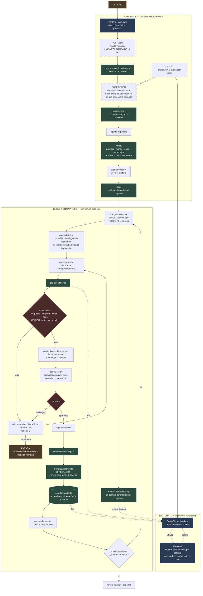

# Camino crítico de la información

Cómo viaja un dato desde la idea inicial hasta un capítulo aprobado, y cómo
vuelve al navegador. Detalle de cada pieza en `architecture.md`.

**Estado.** Lo dibujado con borde discontinuo no existe todavía: la cola, el
supervisor, `run.sh` y el log en vivo son las specs `0003` y `0004`, ambas en
`borrador`. Hasta que se implementen, el arranque lo hace un humano pegando el
comando `/novela-nueva` en una terminal (`architecture.md` §11.2 y §12.8).

## Cómo leerlo

- Línea sólida: información que se **escribe**. Punteada: información que solo se **mira**.
- Borde discontinuo: propuesto en una spec en `borrador`, todavía no existe.
- Una sola flecha entra en `estado.db`, y viene de `aplicar-delta`.
- La API escribe en un único sitio, `_cola/`, y nunca dentro de `novelas/<slug>/`.
  El prefijo `_` no es un slug válido, así que la separación se sostiene por
  construcción y no por disciplina.
- `run.sh` levanta la API y el supervisor a la vez. No existe el estado «panel en
  pie, nadie ejecutando», y por eso el panel no necesita ofrecer nunca un comando
  para copiar.
- El circuito de lectura cuelga del disco, no del orquestador: el panel puede
  consultarse mientras el bucle escribe.
- Las dos velocidades del panel son distintas a propósito. El **estado** solo
  cambia en `aplicar-delta`, una vez por capítulo. La **actividad** sale de
  `harness.log`, que se escribe continuamente: es lo que distingue un capítulo en
  marcha de un bucle colgado.
- El `escritor` está aislado del misterio; el `trazador` y los revisores no (§6.3).
- El gate barato precede a las tres llamadas de revisión. Invertir ese orden gasta
  cuota en descubrir lo que un `assert` ya sabía.
