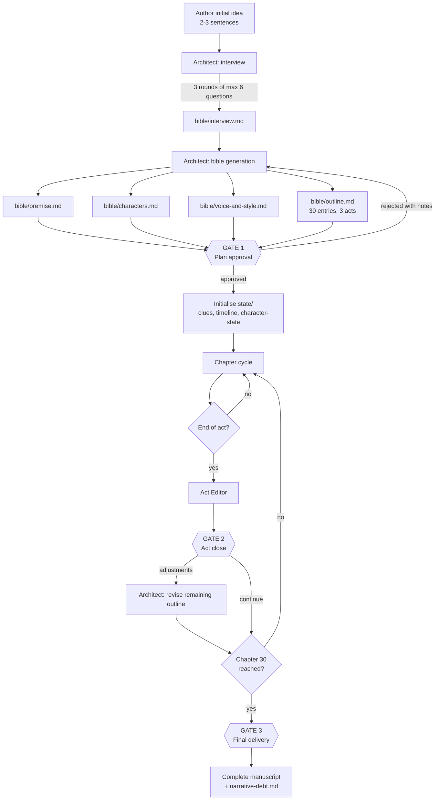
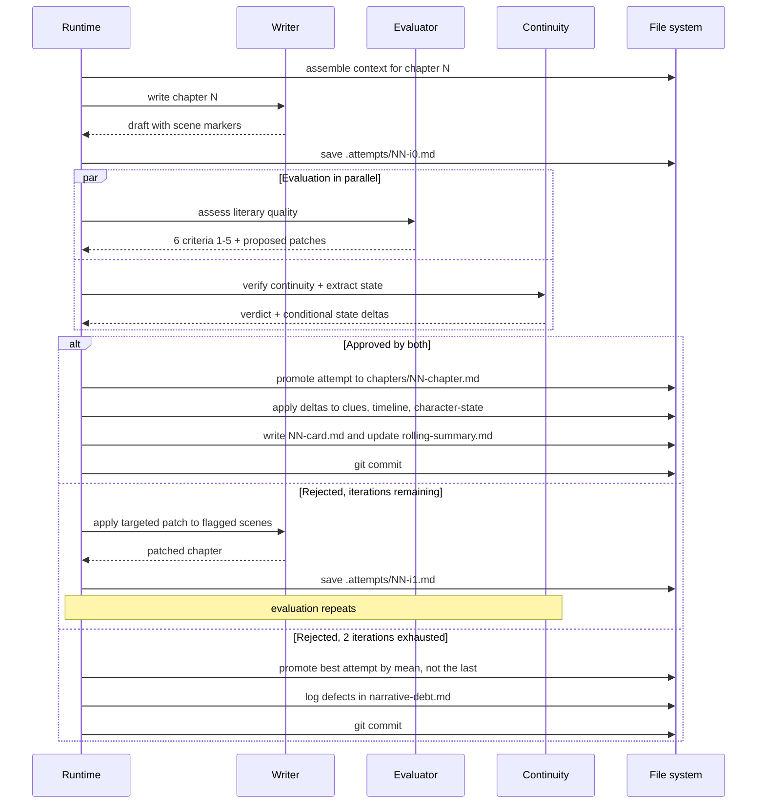
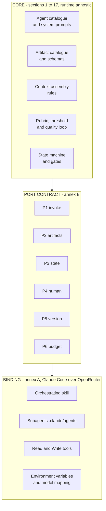

# Overall architecture

> Source: `docs/suspense-novel-harness.md` — §4 (4.1-4.5) (lines 140-280). Section numbers below ("§7", "Annex A") refer to the original document's numbering, mapped in `index.md`.

## Scope
- The full flow diagram, from the author's idea through the three gates to the finished manuscript (4.1).
- The one-chapter cycle as a sequence diagram: write, evaluate in parallel, accept or patch (4.2).
- Why the design splits planning from writing, and why only the Continuity Editor writes state (4.3).
- The mapping from the original Spanish diagram to this specification (4.4).
- The core / port / binding layering and what must never leak between layers (4.5).
- Load when changing how the phases fit together, or before touching anything near the core/binding boundary.

---

## 4. Overall architecture

### 4.1 Full flow

### 4.2 The cycle of one chapter

### 4.3 Explanation

The system has **two very different phases**. The planning phase is conversational, expensive in
human attention and cheap in quota (about 12 logical calls). The writing phase is autonomous, cheap
in human attention and expensive in quota (about 150 logical calls, which in Claude Code translate
into considerably more actual requests: §13). The design deliberately concentrates human
intervention in the first, because a mistake in the outline costs 30 chapters and a mistake in a
chapter costs one chapter.

The piece that makes the whole thing viable is the **accumulating state** (`novel/state/`). The
Writer never receives the whole novel: it receives an assembled, bounded view of it, built by the
runtime from those files according to the rules in §7. The Continuity Editor is the only agent that
writes into `novel/state/`, and it does so after a chapter has been accepted. This separation — one
agent that writes fiction and another that maintains the facts — is what prevents continuity drift
over the long stretch of the novel.

### 4.4 Mapping to the original diagram

| Original diagram (Spanish) | In this specification |
|---|---|
| Agente Inicio | **Architect** (§5.1), with the interview as its own subprocess |
| `.md con respuestas` | `bible/interview.md` |
| `Desarrollo de personajes` | `bible/characters.md` |
| `Resumen de la historia completa` | `bible/premise.md` |
| `Introducción, nudo y desenlace` (1 artifact) and `Desarrollo Introducción / nudo / desenlace` (3 artifacts) | **Resolved**: a single `bible/outline.md` with 30 entries grouped under three act headings. The three-way split stops being a decision about files and becomes a grouping inside one. |
| Agente Escritor | **Writer** (§5.2) |
| Agente Evaluador returning "fix this" | **Evaluator** (§5.3) with a numeric rubric + **Continuity Editor** (§5.4), kept separate |
| *(did not exist)* | **Act Editor** (§5.5), the whole of `state/`, `state.json`, `author-notes.md` |

### 4.5 Core / runtime binding separation

The orchestration runtime has already changed once and may change again. So that such a change costs
an annex rather than a rewrite, the system is split into two layers with an explicit boundary.

The core **never** names Claude Code, or OpenRouter, or a concrete model. When it needs something
from the outside world, it asks for it through a port. Three practical consequences:

1. **The system prompts in §5 are portable as they stand.** They are text; they do not depend on
   who sends them.
2. **The artifact schemas in §6 are portable as they stand.** They are files on disk.
3. **The only thing to rewrite when the runtime changes is Annex A.** Annex B defines what the
   replacement has to satisfy.

The two things that do change with the runtime, and are therefore kept out of the core, are **the
assignment of a concrete model to each role** (§5 speaks of model classes, not identifiers) and
**request accounting** (§13, which carries one table per binding).

