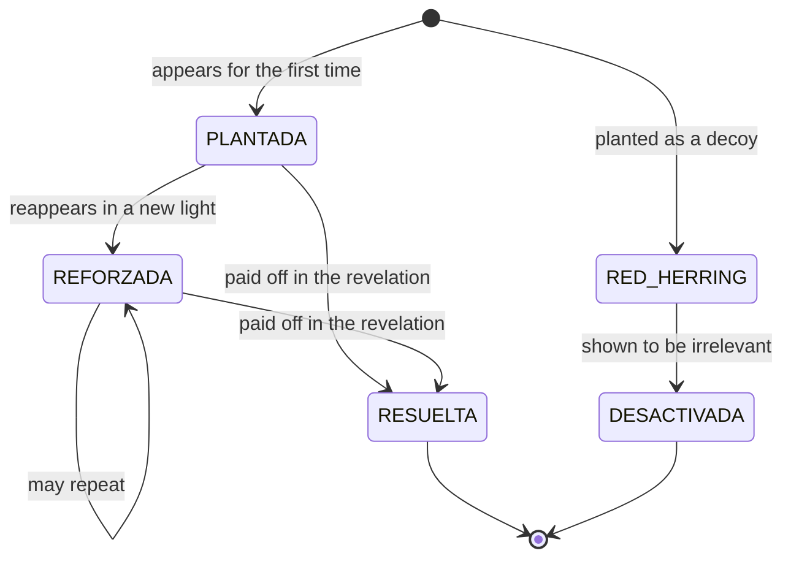

# Continuity and suspense rules

> Source: `docs/suspense-novel-harness.md` — §8 (8.1-8.3) (lines 1105-1150). Section numbers below ("§7", "Annex A") refer to the original document's numbering, mapped in `index.md`.

## Scope
- The clue state machine: PLANTADA, REFORZADA, RESUELTA, RED_HERRING, DESACTIVADA (8.1).
- The five blocking rules, three of which are verifiable in code with no LLM call (8.2).
- When each verification happens and who performs it, including the final audit before chapter 30 (8.3).
- Load when implementing the deterministic continuity checks or debugging a clue-state bug.

> SUPERSEDED BY: `config-schema.md` (§6.0), group `continuidad` — the chapter-30 audit point and the clue-staleness window are configured (`auditoria_antes_de_capitulo`, `max_capitulos_pista_sin_tocar`); `poc` sets them to 3 and 2.
---

## 8. Continuity and suspense

### 8.1 Life cycle of a clue

### 8.2 Blocking rules

Checked on every chapter; a breach produces a `CORREGIR` verdict from the Continuity Editor. The
first three are verifiable **in code, with no LLM call**, and must be implemented that way:

1. **Nothing is resolved that was not planted.** A clue cannot move to `RESUELTA` unless it has
   previously been `PLANTADA` or `REFORZADA` in a strictly earlier chapter.
2. **Every real clue has a planned resolution.** No clue of type `real` may exist without an
   assigned resolution chapter in the ledger.
3. **Every red herring is defused.** No `red_herring` clue may reach chapter 30 without moving to
   `DESACTIVADA`.
4. **Nobody uses information they do not have.** A character cannot act on a fact that is not in
   their *Sabe que* block in `character-state.md`. This one requires LLM judgement.
5. **The timeline moves forward.** A chapter's story day can never be lower than the previous
   chapter's, unless the outline explicitly marks it as a flashback.

### 8.3 When verification happens

| Moment | What is verified | By whom |
|---|---|---|
| After each draft, before acceptance | Rules 1-5 against the chapter | Continuity Editor + code checks |
| After each chapter is accepted | Deltas are applied and the rolling summary is recomputed | Runtime, deterministic |
| At the close of each act | Orphaned clues, live red herrings, tension curve | Act Editor |
| Before writing chapter 30 | **Final audit**: no `real` clue unresolved, no `red_herring` undefused | Runtime, in code; on failure it halts and opens a gate |

The audit before chapter 30 is the only point at which the system may refuse to continue for
reasons of plot. This is intentional: a suspense novel that ends with loose ends has failed, however
well each individual chapter is written.

