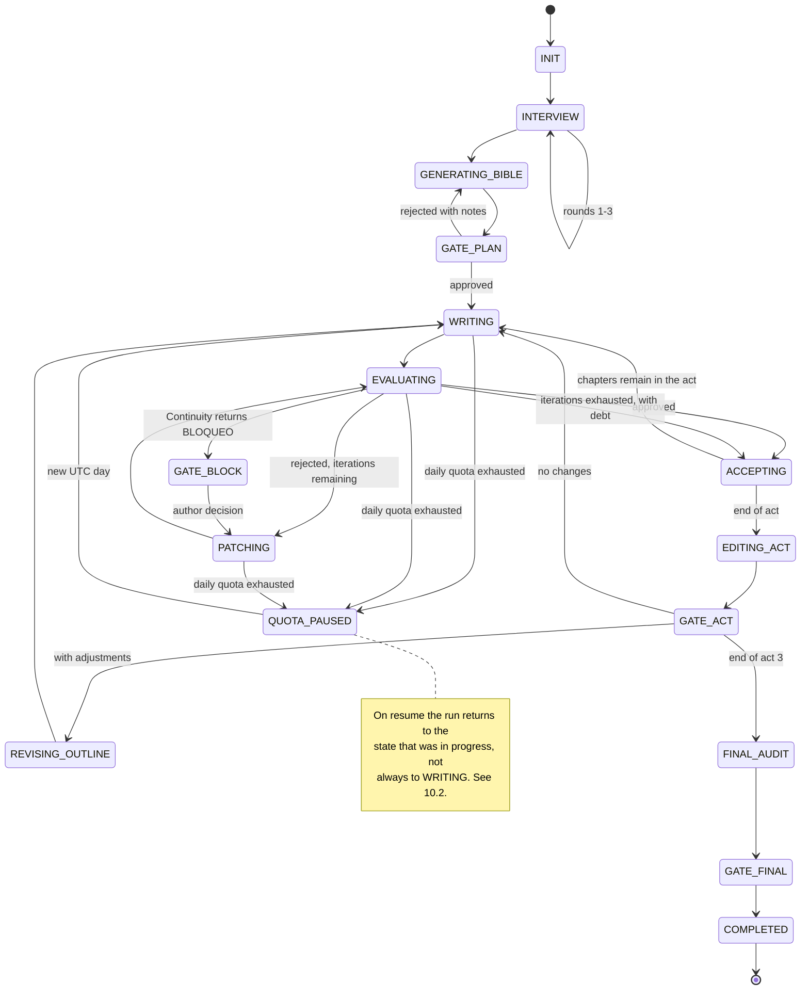

# Execution state machine and state.json

> Source: `docs/suspense-novel-harness.md` — §10 (10.1-10.2) (lines 1207-1304). Section numbers below ("§7", "Annex A") refer to the original document's numbering, mapped in `index.md`.

## Scope
- The full state diagram: every state, every transition, and the quota-pause branches (§10).
- The `novel/state.json` schema with a worked example, and the rule that it is rewritten atomically after every transition and every LLM call (10.1).
- Why state stores model *classes* and not identifiers, and what the `binding` field is for.
- Resumption rules: quota reset on a new UTC day, repeating an interrupted call, `.attempts/` handling, commit per chapter (10.2).
- Load when implementing persistence, resume, or a new state transition.

---

## 10. Execution state machine



### 10.1 `novel/state.json`

Rewritten atomically (write to a temporary file + `os.replace`) **after every state transition and
after every LLM call**, without exception.

```json
{
  "version": 1,
  "state": "EVALUATING",
  "current_chapter": 14,
  "current_act": 2,
  "iteration": 1,
  "attempts": [
    {"iteration": 0, "mean": 3.7, "path": "novel/.attempts/14-i0.md"}
  ],
  "accepted_chapters": [1, 2, 3, 4, 5, 6, 7, 8, 9, 10, 11, 12, 13],
  "pending_gate": null,
  "quota": {
    "date_utc": "2026-09-15",
    "calls_today": 37,
    "daily_limit": 50,
    "per_minute_limit": 20,
    "last_call_ts": 1789200000.0
  },
  "model_classes": {
    "architect":  "high",
    "writer":     "high",
    "evaluator":  "balanced",
    "continuity": "balanced",
    "act_editor": "high"
  },
  "binding": "claude-code",
  "last_error": null
}
```

State stores model **classes**, not identifiers: the concrete mapping is resolved by the binding
(Annex A.4) and must therefore not be frozen into the state of a run that might be resumed under a
different runtime. The `binding` field is recorded for diagnostics only, when resuming a run started
under another one. See `[OPEN: models]` in §17.

### 10.2 Resuming

Resuming means reading `state.json` and jumping to the handler for the state it names. There is no
other source of truth: the files on disk are a consequence of the state, never the other way round.
**This is what makes the runtime interchangeable even mid-novel**: a run started under one binding
can continue under another, because everything that defines it is on disk and nothing is in the
orchestrator's memory. In the Claude Code binding, resuming simply means opening a new session and
invoking the skill; there is no process to restart. Rules:

- If `state == "QUOTA_PAUSED"` and the current UTC date is later than `quota.date_utc`, the counter
  is reset to zero and the run continues automatically.
- If the process died mid-call, that call is repeated. Calls are idempotent from the point of view
  of state: nothing is applied until the response has been parsed successfully.
- Intermediate drafts live in `novel/.attempts/` (git-ignored) until one is accepted and promoted to
  `novel/chapters/`.
- Each accepted chapter produces a commit `feat(novel): chapter NN — <title>`. The git history is
  the second safety net: it allows returning to any point.

