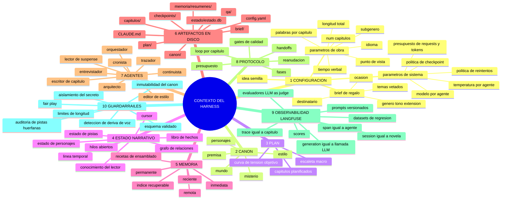
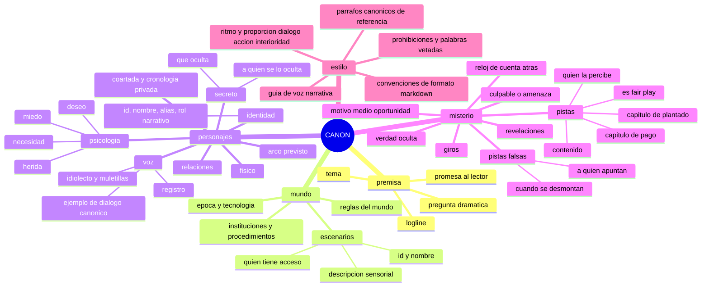
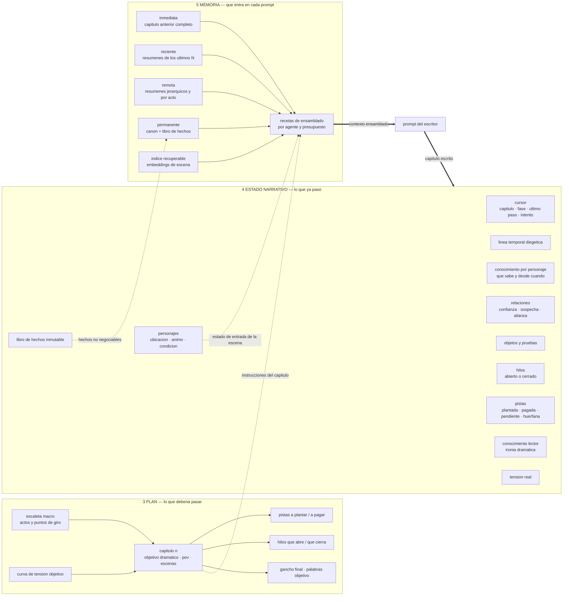
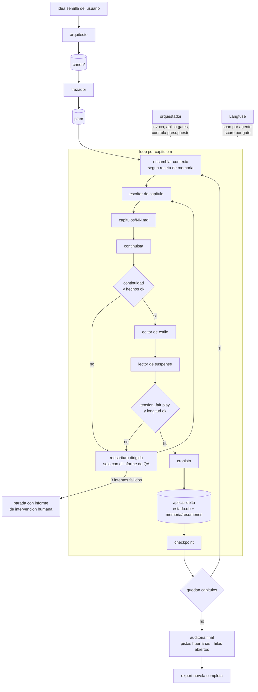
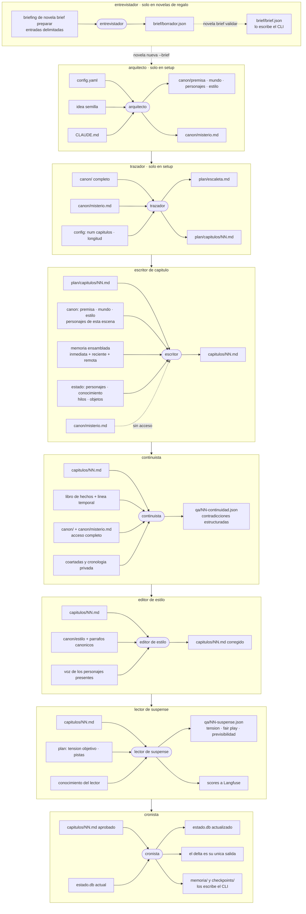
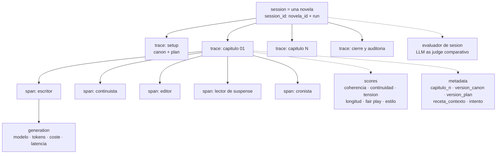

# Ontología de contexto — harness multiagente de novela de suspense

Seis vistas: la ontología general, el canon, el núcleo de contexto vivo, el grafo de orquestación, el mapa de acceso agente → artefacto y la jerarquía de trazas.

---

## 1. Visión general

---

## 2. CANON — la biblia de la obra

Versionado. Solo el orquestador autoriza cambios; `misterio.verdad_oculta` únicamente se amplía, nunca se reescribe.

---

## 3. Núcleo de contexto vivo — PLAN, ESTADO y MEMORIA

La separación entre los tres es la decisión estructural clave: **canon** es lo que es verdad del mundo, **plan** es lo que debería pasar, **estado** es lo que ya pasó.

---

## 4. Grafo de orquestación

El orquestador es el único proceso con visión del bucle completo; no escribe prosa.

---

## 5. Acceso agente → artefacto

Una fila por agente, con sus entradas a la izquierda y sus salidas a la derecha. Ningún artefacto es un nodo compartido: si aparece en varias filas, es que varios agentes lo tocan.

La asimetría clave está entre las filas 3 y 4: el escritor no ve `misterio.md` y el continuista sí. Es lo que permite verificar fair play contra la solución real sin que el escritor pueda filtrarla en el subtexto.

---

## 6. Jerarquía de trazas en Langfuse

