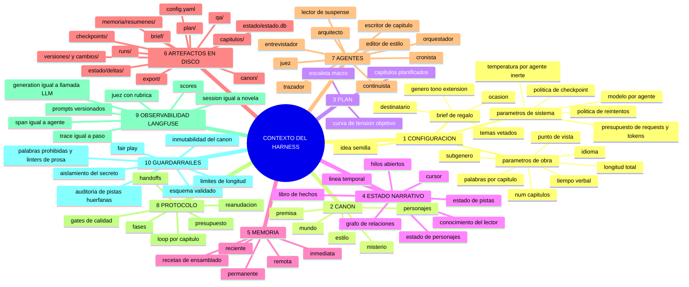
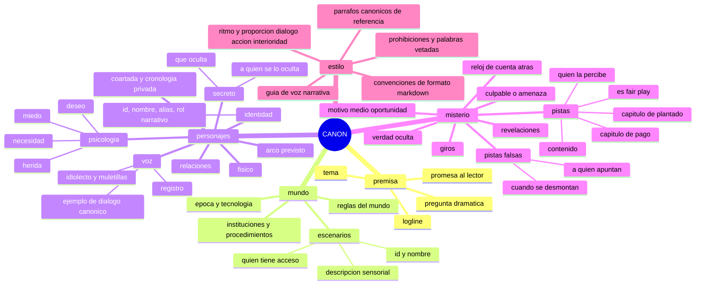
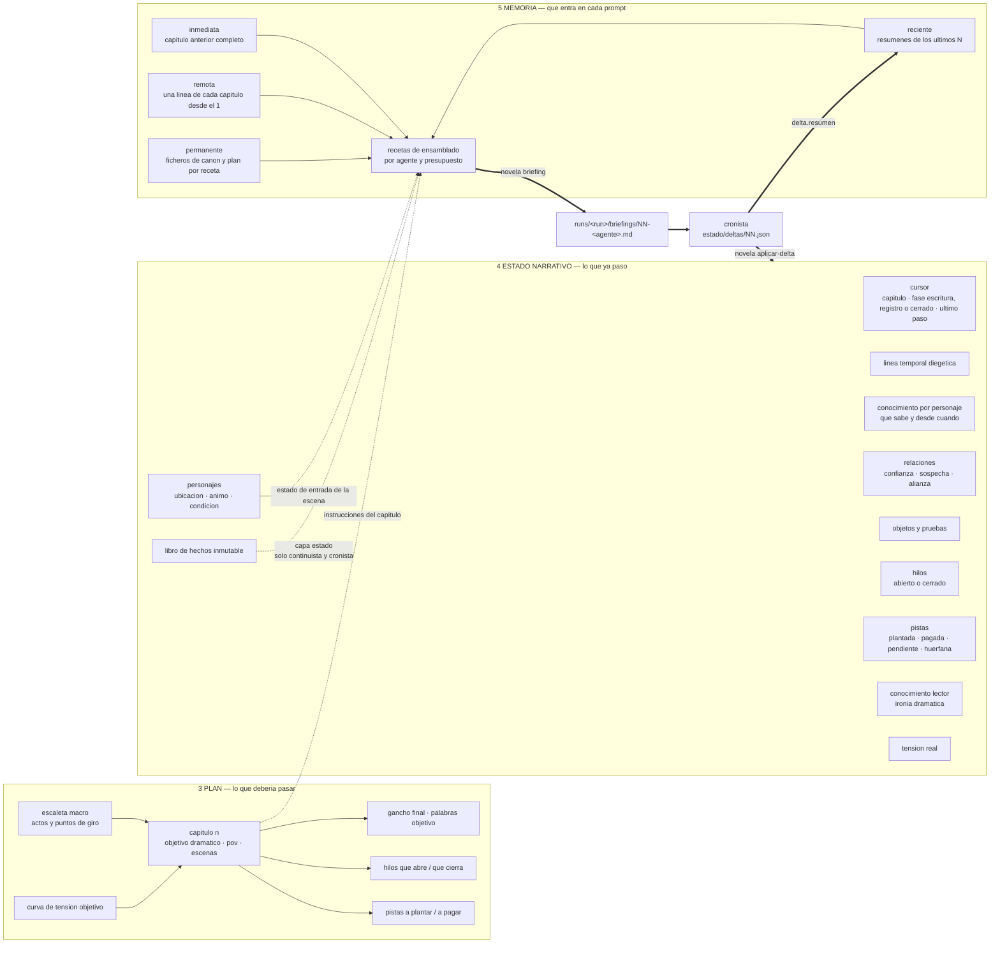
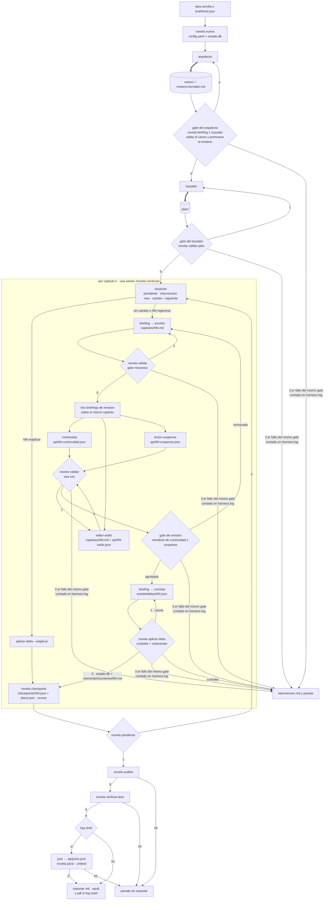
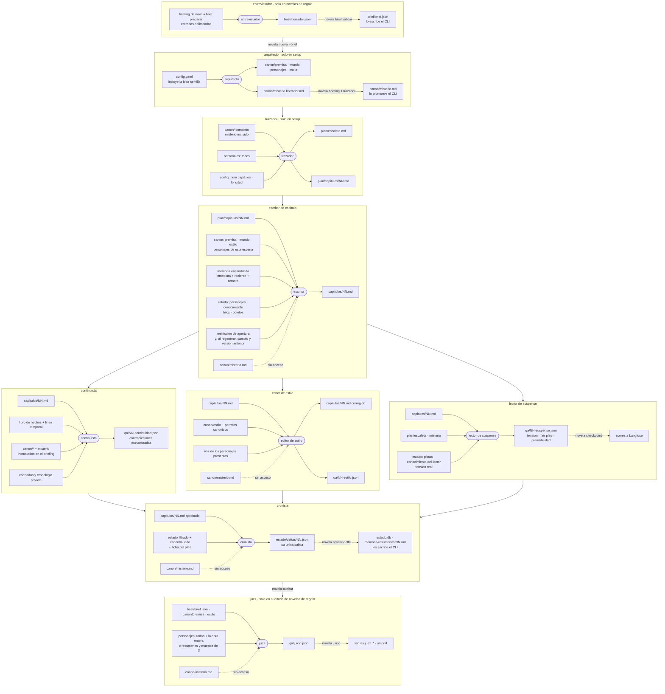
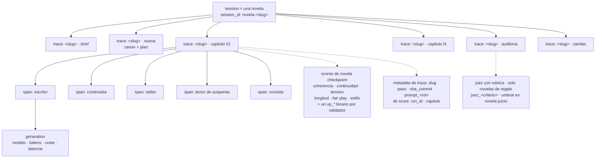

# Ontología de contexto — harness multiagente de novela de suspense

Seis vistas: la ontología general, el canon, el núcleo de contexto vivo, el grafo de orquestación, el mapa de acceso agente → artefacto y la jerarquía de trazas.

---

## 1. Visión general

```mermaid
mindmap
  root((CONTEXTO DEL HARNESS))
    1 CONFIGURACION
      idea semilla
      brief de regalo
        ocasion
        destinatario
        genero tono extension
        temas vetados
      parametros de obra
        longitud total
        num capitulos
        palabras por capitulo
        subgenero
        punto de vista
        tiempo verbal
        idioma
      parametros de sistema
        modelo por agente
        temperatura por agente inerte
        presupuesto de requests y tokens
        politica de reintentos
        politica de checkpoint
    2 CANON
      premisa
      mundo
      personajes
      misterio
      estilo
    3 PLAN
      escaleta macro
      capitulos planificados
      curva de tension objetivo
    4 ESTADO NARRATIVO
      cursor
      linea temporal
      estado de personajes
      grafo de relaciones
      libro de hechos
      hilos abiertos
      estado de pistas
      conocimiento del lector
    5 MEMORIA
      inmediata
      reciente
      remota
      permanente
      recetas de ensamblado
    6 ARTEFACTOS EN DISCO
      config.yaml
      brief/
      canon/
      plan/
      estado/estado.db
      memoria/resumenes/
      capitulos/
      qa/
      checkpoints/
      estado/deltas/
      runs/
      export/
      versiones/ y cambios/
    7 AGENTES
      orquestador
      entrevistador
      arquitecto
      trazador
      escritor de capitulo
      continuista
      editor de estilo
      lector de suspense
      cronista
      juez
    8 PROTOCOLO
      fases
      loop por capitulo
      gates de calidad
      handoffs
      reanudacion
      presupuesto
    9 OBSERVABILIDAD LANGFUSE
      session igual a novela
      trace igual a paso
      span igual a agente
      generation igual a llamada LLM
      prompts versionados
      scores
      juez con rubrica
    10 GUARDARRAILES
      esquema validado
      inmutabilidad del canon
      aislamiento del secreto
      fair play
      limites de longitud
      palabras prohibidas y linters de prosa
      auditoria de pistas huerfanas
```

---

## 2. CANON — la biblia de la obra

Versionado por huella de contenido: el sha256 de `canon/` va en cada `manifest.json` y en cada checkpoint. Lo escribe el arquitecto en el arranque y ningún flujo lo modifica después; `misterio.verdad_oculta` únicamente se amplía, nunca se reescribe. Un cambio pedido con la novela terminada va sobre el libro de hechos, no sobre el canon.

```mermaid
mindmap
  root((CANON))
    premisa
      logline
      pregunta dramatica
      tema
      promesa al lector
    mundo
      escenarios
        id y nombre
        descripcion sensorial
        quien tiene acceso
      epoca y tecnologia
      reglas del mundo
      instituciones y procedimientos
    personajes
      identidad
        id, nombre, alias, rol narrativo
      fisico
      voz
        idiolecto y muletillas
        registro
        ejemplo de dialogo canonico
      psicologia
        deseo
        necesidad
        miedo
        herida
      secreto
        que oculta
        a quien se lo oculta
      arco previsto
      relaciones
      coartada y cronologia privada
    misterio
      verdad oculta
      culpable o amenaza
      motivo medio oportunidad
      pistas
        contenido
        capitulo de plantado
        capitulo de pago
        quien la percibe
        es fair play
      pistas falsas
        a quien apuntan
        cuando se desmontan
      revelaciones
      giros
      reloj de cuenta atras
    estilo
      guia de voz narrativa
      ritmo y proporcion dialogo accion interioridad
      prohibiciones y palabras vetadas
      parrafos canonicos de referencia
      convenciones de formato markdown
```

---

## 3. Núcleo de contexto vivo — PLAN, ESTADO y MEMORIA

La separación entre los tres es la decisión estructural clave: **canon** es lo que es verdad del mundo, **plan** es lo que debería pasar, **estado** es lo que ya pasó.

```mermaid
flowchart LR
    subgraph P["3 PLAN — lo que deberia pasar"]
        direction TB
        P1["escaleta macro<br/>actos y puntos de giro"]
        P2["curva de tension objetivo"]
        P3["capitulo n<br/>objetivo dramatico · pov · escenas"]
        P4["pistas a plantar / a pagar"]
        P5["hilos que abre / que cierra"]
        P6["gancho final · palabras objetivo"]
        P1 --> P3
        P2 --> P3
        P3 --> P4
        P3 --> P5
        P3 --> P6
    end

    subgraph E["4 ESTADO NARRATIVO — lo que ya paso"]
        direction TB
        E1["cursor<br/>capitulo · fase escritura, registro o cerrado · ultimo paso"]
        E2["linea temporal diegetica"]
        E3["personajes<br/>ubicacion · animo · condicion"]
        E4["conocimiento por personaje<br/>que sabe y desde cuando"]
        E5["relaciones<br/>confianza · sospecha · alianza"]
        E6["objetos y pruebas"]
        E7["libro de hechos inmutable"]
        E8["hilos<br/>abierto o cerrado"]
        E9["pistas<br/>plantada · pagada · pendiente · huerfana"]
        E10["conocimiento lector<br/>ironia dramatica"]
        E11["tension real"]
    end

    subgraph M["5 MEMORIA — que entra en cada prompt"]
        direction TB
        M1["inmediata<br/>capitulo anterior completo"]
        M2["reciente<br/>resumenes de los ultimos N"]
        M3["remota<br/>una linea de cada capitulo desde el 1"]
        M4["permanente<br/>ficheros de canon y plan por receta"]
        M6["recetas de ensamblado<br/>por agente y presupuesto"]
        M1 --> M6
        M2 --> M6
        M3 --> M6
        M4 --> M6
    end

    P3 -.->|"instrucciones del capitulo"| M6
    E7 -.->|"capa estado<br/>solo continuista y cronista"| M6
    E3 -.->|"estado de entrada de la escena"| M6
    M6 ==>|"novela briefing"| OUT["runs/&lt;run&gt;/briefings/NN-&lt;agente&gt;.md"]
    OUT ==> CRO["cronista<br/>estado/deltas/NN.json"]
    CRO ==>|"novela aplicar-delta"| E
    CRO ==>|"delta.resumen"| M2
```

---

## 4. Grafo de orquestación

El orquestador es el único proceso con visión del bucle completo; no escribe prosa. El procedimiento exacto está en `.claude/commands/novela-nueva.md`, `novela-continuar.md` y `novela-auditar.md`; aquí, su forma.

```mermaid
flowchart TD
    S["idea semilla o brief/brief.json"] --> NV["novela nueva<br/>config.yaml + estado.db"]
    NV --> ARQ["arquitecto"]
    ARQ ==> CANB[("canon/ + misterio.borrador.md")]
    CANB --> GA{"gate del arquitecto<br/>novela briefing 1 trazador<br/>valida el canon y promueve el misterio"}
    GA -->|4| ARQ
    GA -->|0| TRZ["trazador"]
    TRZ ==> PLN[("plan/")]
    PLN --> GT{"gate del trazador<br/>novela validar-plan"}
    GT -->|1| TRZ
    GT -->|0| SIT

    subgraph LOOP["por capitulo n · una sesion /novela-continuar"]
        direction TB
        SIT["situacion<br/>pendiente · intervencion viva · cambio --siguiente"]
        SIT -->|"NN reaplicar"| REA["aplicar-delta --reaplicar"]
        REA --> CKP
        SIT -->|"sin cambio o NN regenerar"| ESC["briefing → escritor<br/>capitulos/NN.md"]
        ESC --> V1{"novela validar<br/>gate mecanico"}
        V1 -->|1| ESC
        V1 -->|0| B3["tres briefings de revision<br/>sobre el mismo capitulo"]
        B3 --> CON["continuista<br/>qa/NN-continuidad.json"]
        B3 --> EDI["editor-estilo<br/>capitulos/NN.md + qa/NN-estilo.json"]
        B3 --> LEC["lector-suspense<br/>qa/NN-suspense.json"]
        CON & EDI & LEC --> V2{"novela validar<br/>otra vez"}
        V2 -->|1| EDI
        V2 -->|0| GR{"gate de revision<br/>veredicto de continuidad y suspense"}
        GR -->|rechazado| ESC
        GR -->|aprobado| CRO["briefing → cronista<br/>estado/deltas/NN.json"]
        CRO --> AD{"novela aplicar-delta<br/>custodia + violaciones"}
        AD -->|"1 · causa"| CRO
        AD -->|"0 · estado.db + memoria/resumenes/NN.md"| CKP["novela checkpoint<br/>checkpoints/NN.json + latest.json · scores"]
    end

    CKP --> G3{"novela pendiente"}
    G3 -->|0| SIT
    G3 -->|1| AUD["novela auditar"]
    AUD -->|0| LEAN["novela verificar-lean"]
    LEAN -->|0| JZ{"hay brief"}
    JZ -->|si| JUE["juez → qa/juicio.json<br/>novela juicio · umbral"]
    JZ -->|no| EXP
    JUE -->|0| EXP["exportar md · epub<br/>y pdf si hay brief"]

    V1 & V2 & GR & AD & GA & GT -->|"3.er fallo del mismo gate<br/>contado en harness.log"| HALT["intervencion.md y parada"]
    AD -->|"custodia:"| HALT
    AUD & LEAN & JUE -->|"≠0"| STOP["parada sin exportar"]
```

Cada gate reintenta a quien lo hizo fallar, con su mismo briefing y la ruta del informe: el escritor tras el primer `validar` y tras el gate de revisión, el editor-estilo tras el segundo `validar`, el cronista tras `aplicar-delta`. Los intentos se cuentan en `runs/<run_id>/harness.log`, nunca en la conversación ni en `cursor.intento`.

---

## 5. Acceso agente → artefacto

Una fila por agente, con sus entradas a la izquierda y sus salidas a la derecha. Ningún artefacto es un nodo compartido: si aparece en varias filas, es que varios agentes lo tocan.

```mermaid
flowchart TB
    subgraph R0["entrevistador · solo en novelas de regalo"]
        direction LR
        i0["briefing de novela brief preparar<br/>entradas delimitadas"] --> a0(["entrevistador"])
        a0 --> o0["brief/borrador.json"]
        o0 -. "novela brief validar" .-> o00["brief/brief.json<br/>lo escribe el CLI"]
    end

    subgraph R1["arquitecto · solo en setup"]
        direction LR
        i1["config.yaml<br/>incluye la idea semilla"] --> a1(["arquitecto"])
        a1 --> o1["canon/premisa · mundo · personajes · estilo"]
        a1 --> o2["canon/misterio.borrador.md"]
        o2 -. "novela briefing 1 trazador" .-> o20["canon/misterio.md<br/>lo promueve el CLI"]
    end

    subgraph R2["trazador · solo en setup"]
        direction LR
        i4["canon/ completo<br/>misterio incluido"] --> a2(["trazador"])
        i5["personajes: todos"] --> a2
        i6["config: num capitulos · longitud"] --> a2
        a2 --> o3["plan/escaleta.md"]
        a2 --> o4["plan/capitulos/NN.md"]
    end

    subgraph R3["escritor de capitulo"]
        direction LR
        i7["plan/capitulos/NN.md"] --> a3(["escritor"])
        i8["canon: premisa · mundo · estilo<br/>personajes de esta escena"] --> a3
        i9["memoria ensamblada<br/>inmediata + reciente + remota"] --> a3
        i10["estado: personajes · conocimiento<br/>hilos · objetos"] --> a3
        i10b["restriccion de apertura<br/>y, al regenerar, cambio y version anterior"] --> a3
        i11["canon/misterio.md"] -. "sin acceso" .-x a3
        a3 --> o5["capitulos/NN.md"]
    end

    subgraph R4["continuista"]
        direction LR
        i12["capitulos/NN.md"] --> a4(["continuista"])
        i13["libro de hechos + linea temporal"] --> a4
        i14["canon/* + misterio<br/>incrustados en el briefing"] --> a4
        i15["coartadas y cronologia privada"] --> a4
        a4 --> o6["qa/NN-continuidad.json<br/>contradicciones estructuradas"]
    end

    subgraph R5["editor de estilo"]
        direction LR
        i16["capitulos/NN.md"] --> a5(["editor de estilo"])
        i17["canon/estilo + parrafos canonicos"] --> a5
        i18["voz de los personajes presentes"] --> a5
        i11b["canon/misterio.md"] -. "sin acceso" .-x a5
        a5 --> o7["capitulos/NN.md corregido"]
        a5 --> o7b["qa/NN-estilo.json"]
    end

    subgraph R6["lector de suspense"]
        direction LR
        i19["capitulos/NN.md"] --> a6(["lector de suspense"])
        i20["plan/escaleta · misterio"] --> a6
        i21["estado: pistas · conocimiento del lector<br/>tension real"] --> a6
        a6 --> o8["qa/NN-suspense.json<br/>tension · fair play · previsibilidad"]
        o8 -. "novela checkpoint" .-> o9["scores a Langfuse"]
    end

    subgraph R7["cronista"]
        direction LR
        i22["capitulos/NN.md aprobado"] --> a7(["cronista"])
        i23["estado filtrado + canon/mundo<br/>+ ficha del plan"] --> a7
        i11c["canon/misterio.md"] -. "sin acceso" .-x a7
        a7 --> o10["estado/deltas/NN.json<br/>su unica salida"]
        o10 -. "novela aplicar-delta" .-> o12["estado.db · memoria/resumenes/NN.md<br/>los escribe el CLI"]
    end

    subgraph R8["juez · solo en auditoria de novelas de regalo"]
        direction LR
        i24["brief/brief.json · canon/premisa · estilo"] --> a8(["juez"])
        i25["personajes: todos + la obra entera<br/>o resumenes y muestra de 3"] --> a8
        i26["canon/misterio.md"] -. "sin acceso" .-x a8
        a8 --> o13["qa/juicio.json"]
        o13 -. "novela juicio" .-> o14["scores juez_* · umbral"]
    end

    R0 -. "novela nueva --brief" .-> R1
    R1 --> R2 --> R3 --> R4 & R5 & R6 --> R7
    R7 -. "novela-auditar" .-> R8
```

La asimetría clave: escritor, editor de estilo, cronista y juez no ven el misterio; trazador, continuista y lector de suspense lo reciben incrustado en su briefing. Es lo que permite verificar fair play contra la solución real sin que el escritor pueda filtrarla en el subtexto. Ningún agente lee `canon/misterio.md` directamente, y el hook impide al escritor y al editor leer un informe de `qa/` que copie ocho palabras seguidas del misterio.

---

## 6. Jerarquía de trazas en Langfuse

```mermaid
flowchart TD
    SES["session = una novela<br/>session_id: novela-&lt;slug&gt;"]
    SES --> TB["trace: &lt;slug&gt; · brief"]
    SES --> T0["trace: &lt;slug&gt; · nueva<br/>canon + plan"]
    SES --> T1["trace: &lt;slug&gt; · capitulo 01"]
    SES --> TN["trace: &lt;slug&gt; · capitulo N"]
    SES --> TC["trace: &lt;slug&gt; · auditoria"]
    SES --> TX["trace: &lt;slug&gt; · cambio"]

    T1 --> SP1["span: escritor"]
    T1 --> SP2["span: continuista"]
    T1 --> SP3["span: editor"]
    T1 --> SP4["span: lector de suspense"]
    T1 --> SP5["span: cronista"]

    SP1 --> GEN["generation<br/>modelo · tokens · coste · latencia"]

    T1 -.-> SC["scores de novela checkpoint<br/>coherencia · continuidad · tension<br/>longitud · fair play · estilo<br/>+ un vp_* binario por validador"]
    T1 -.-> MD["metadata de traza: slug · paso · sha_commit · prompt_&lt;rol&gt;<br/>de score: run_id · capitulo"]
    TC -.-> EV["juez con rubrica · solo novelas de regalo<br/>juez_&lt;criterio&gt; · umbral en novela juicio"]
```
