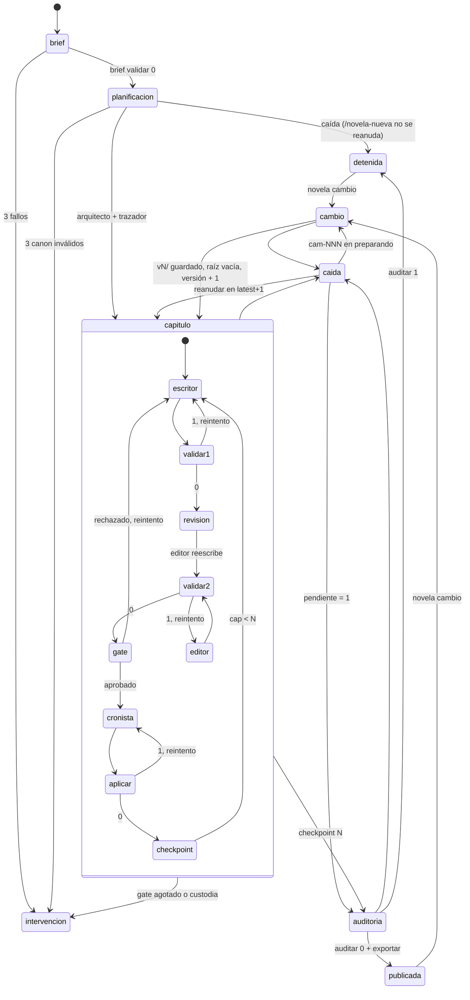

# Validación formal del harness con TLA+

`formal/tla/` describe el flujo de generación como una máquina de estados y TLC la recorre entera
sobre un modelo pequeño. Donde `backend/tests/test_bucle.py` enumera en Python el bucle de **un**
capítulo, aquí entran la novela entera, las caídas, la reanudación y `novela cambio`. La tabla de
qué acción corresponde a qué orden o paso está en [`formal/tla/README.md`](../../formal/tla/README.md).

El modelo no sustituye a los tests: dice qué propiedades tiene **el procedimiento** si el código
cumple sus guardas, y los mutantes dicen qué guarda sostiene cada propiedad.

## Máquina de estados



## Invariantes y propiedades

| Nombre | Qué dice | Guarda que lo sostiene (mutante que lo rompe) |
|---|---|---|
| `TypeOK` | Tipos de todas las variables | — |
| `NuncaSinValidar` | Todo capítulo cerrado pasó `validar` sobre su texto y la revisión lo aprobó | Paso 6 del procedimiento (`HarnessMutante.cfg`) |
| `PublicadaValida` | Publicada ⇒ libro completo 1..N, auditoría aprobada y `export/` de la versión vigente | `producir` exige que la auditoría escriba `export/` (`HarnessExport.cfg`) |
| `ReanudacionExacta` | El libro es exactamente 1..`latest.json`: la reanudación no duplica ni pierde | `cap = latest.json + 1` (`HarnessReanudar.cfg`) |
| `VersionAnteriorConservada` | Toda versión anterior está entera en `versiones/vN/` | Copiar y renombrar `vN/` antes de vaciar (`HarnessVaciar.cfg`) |
| `ReintentosAcotados` | Ningún gate pasa de 2 reintentos | Cuenta de intentos en `harness.log` |
| `GuardadasSoloCrecen` (temporal) | `versiones/` es append-only | — |
| `Termina` (liveness, `WF` sobre el progreso) | `<>[]` publicada, detenida o intervención: nunca un bucle infinito | Reintentos, caídas y cambios acotados |
| `IntervencionTrasAgotar` | Solo se interviene tras 3 fallos reales de un gate | **No se cumple**: hallazgo H-2 |
| `UnSoloEscritor` (`Regeneraciones`) | Quien está dentro de `preparar` tiene el lock | `ws.bloquear()` |
| `NingunaPerdida` (`Regeneraciones`) | Toda versión que llegó a estar completa sigue en la raíz o en `versiones/` | Guarda RF-21 de `registrar_peticion` (`RegeneracionesMutante.cfg`) |
| `UnaVersionPorCambio` (`Regeneraciones`) | Una versión nueva por cada `cambio` que termina | Guarda RF-21 |

Las caídas pueden ocurrir en cualquier paso de planificación, capítulo, auditoría o cambio, y no
tienen equidad: son el entorno. La equidad débil va sobre todo lo demás, incluido `Reanudar`, que
es el humano o `novela producir` relanzando.

## Resultados de TLC

TLC 2.19, Java 21, 12 workers, `formal/tla/tlc.sh` el 2026-09-25:

```
ok Harness.cfg: pasa (esperado pasa) · 281824 distinct states found · 43s
ok HarnessCuenta.cfg: contraejemplo (esperado contraejemplo) · 1372 distinct states found · 3s
ok HarnessExport.cfg: contraejemplo (esperado contraejemplo) · 24804 distinct states found · 3s
ok HarnessLiteral.cfg: contraejemplo (esperado contraejemplo) · 156 distinct states found · 3s
ok HarnessMutante.cfg: contraejemplo (esperado contraejemplo) · 487 distinct states found · 3s
ok HarnessReanudar.cfg: contraejemplo (esperado contraejemplo) · 7777 distinct states found · 3s
ok HarnessVaciar.cfg: contraejemplo (esperado contraejemplo) · 7781 distinct states found · 4s
ok Regeneraciones.cfg: pasa (esperado pasa) · 62 distinct states found · 3s
ok RegeneracionesMutante.cfg: contraejemplo (esperado contraejemplo) · 69 distinct states found · 3s
```

`Harness.cfg` (N = 5, 2 reintentos, 2 caídas, 1 cambio): 444.224 estados generados, 281.824
distintos, diámetro 118, sin errores en los seis invariantes, `Termina` ni `GuardadasSoloCrecen`;
la comprobación temporal ocupa 20 de los 34 s. Para descartar que pase por vacío, sondas que
niegan un estado dan contraejemplo: se alcanzan la versión 2 publicada tras dos caídas, la
intervención por revisión y por gate mecánico, y una caída con `vN/` ya renombrado.

Los contadores de estados de los mutantes varían entre ejecuciones (12 workers); la traza no.

## Registro de contraejemplos

Las trazas se leen con `formal/tla/tlc.sh <cfg>` y `$SALIDA/<modelo>.out`. Resumidas:

**Mutante `sin_gate_revision`** (`NuncaSinValidar`, 11 estados). `BriefOK → PlanOK → Escribir →
ValidarOK → Revisar` (veredicto `rechazado`) `→ ValidarOK → GateOK → Cronista → AplicarOK →
Checkpoint`: el capítulo 1 se cierra rechazado. Ni `aplicar-delta` ni `checkpoint` miran el
veredicto, así que el CLI lo deja pasar. Es el hallazgo H-1.

**Mutante `reanudar_sin_checkpoint`** (`ReanudacionExacta`, 21 estados). Se cierra el capítulo 1,
cae la sesión y se reanuda por el 1 en vez de por `latest.json + 1`: el segundo `Checkpoint` deja
`libro = <<1, 1>>`. En el código lo impide además el sello de `briefing`, que el modelo no tiene.

**Mutante `producir_por_export`** (`PublicadaValida`, 90 estados). Versión 1 entera, `AuditarOK`
(exporta), `CambioRegistrar → CambioCopiar → CambioVaciar`, versión 2 entera, `AuditarFalla`: la
novela queda `publicada` con `exportada = 1`, `version = 2` y `auditada = FALSE`. Es el código de
`producir` antes de este cambio (H-3).

**Mutante `vaciar_sin_copia`** (`VersionAnteriorConservada`, 48 estados). `CambioRegistrar →
CambioVaciar` sin `CambioCopiar`: versión 2 con `guardadas = <<>>`.

**`lectura_literal`** (`IntervencionTrasAgotar`, 12 estados). Capítulo 1: rechazo en revisión,
`Escribir → ValidarFalla → Escribir → ValidarFalla`: intervención con dos fallos mecánicos.

**Procedimiento real con caídas** (`HarnessCuenta.cfg`, 16 estados). `Revisar → ValidarOK → Caida
→ Reanudar → Revisar → ValidarOK → Caida → Reanudar → Revisar → ValidarOK → GateFalla`: el primer
rechazo real de la revisión escribe `intervencion.md` (`log.revision = 3`, `fallos.revision = 1`).

**`Regeneraciones` sin RF-21** (`NingunaPerdida`, 11 estados). Los dos procesos comprueban fuera
del lock; `p1` prepara la versión 2 y suelta el lock; se regenera la versión 2 entera; `p2` toma
el lock con la base 1 que leyó antes, registra `cam-001` otra vez, salta la copia (`v1/` existe) y
vacía la raíz: la versión 2 completa se pierde sin estar en `versiones/`.

**Durante el desarrollo.** `Harness.cfg` pasó a la primera. El primer `lectura_literal` dio una
traza en el gate del brief (`BriefFalla` × 2), que no es el hallazgo: `novela-brief.md` cuenta
«reintentos seguidos», sin ambigüedad. Se restringió la lectura literal a la tabla de
`novela-continuar.md`, y la traza pasó a ser la del gate mecánico de arriba.

## Hallazgos

**H-1. El gate de revisión solo lo aplica el procedimiento.** La custodia de `aplicar-delta`
ata `validar` al texto, pero ningún subcomando exige `veredicto` aprobado en
`qa/NN-continuidad.json` y `qa/NN-suspense.json`; `checkpoint` acepta que falten por la política de
cuota. Un orquestador que se salte el paso 6 cierra un capítulo rechazado. Está asumido
(`docs/validators.md` §3.9, punto 7: «no un juicio sobre veredictos», y §4.16);
el mutante lo demuestra. Sin cambio de código: llevar los gates al CLI (`novela gate`) es la spec 0002, aceptada.

**H-2. La cuenta de intentos no mide lo mismo en todos los gates.** En `novela-continuar.md`, los
consumidos del gate mecánico y del delta son las líneas `-> 1`, que ya incluyen el fallo actual;
los de revisión son los briefings de continuista menos uno, que no lo incluyen. «Con dos
consumidos, el siguiente fallo no reintenta» da, leído igual para todos, un solo reintento en el
mecánico y en el delta y dos en revisión (`HarnessLiteral.cfg`). Además, una caída entre el paso 4
y el 6 reanuda en el paso 4 (o en el 2), genera otro briefing de continuista y gasta un intento
de revisión sin rechazo: con dos caídas, el primer rechazo ya es intervención
(`HarnessCuenta.cfg`). No rompe ningún invariante de seguridad; para antes de tiempo. El arreglo
es de procedimiento (contar rechazos, no briefings, o medir todo como «fallos incluido este»), y un
cambio de procedimiento va por spec y novela de humo, no por TDD: queda propuesto.

**H-3. `producir` daba por publicada una novela con un export viejo.** Decidía «terminado» si
`export/` no estaba vacío, y `export/` no se vacía nunca: tampoco `novela cambio`, que no lo copia
ni lo borra. Con un export de una versión anterior (o uno hecho a mano), una auditoría con
hallazgos terminaba en «escrita, auditada y exportada». **Arreglado**: `producir` compara
`export/` antes y después de la sesión de auditoría y solo cuenta lo que esa sesión escribió
(`backend/novela/slices/producir/flujo.py`, `test_export_de_antes_no_cuenta_como_publicada`).

**H-4. `novela cambio` comprueba fuera del lock (rama `spec-0007`).** `_nueva_peticion` lee «sin
cambio en curso», «terminada», la versión base y el siguiente `cam-NNN` antes de
`ws.bloquear()`. Dos `cambio` simultáneos pasan las dos comprobaciones; el segundo, al tomar el
lock, choca con la guarda RF-21 de `registrar_peticion` y sale con 4 (`VersionInexplicada`,
«workspace inválido»), que es seguro (`Regeneraciones.cfg` pasa) pero engañoso: debería ser un 1
«cambio en curso». La guarda RF-21 es lo único que evita perder la versión nueva
(`RegeneracionesMutante.cfg`). Arreglo propuesto, en esa rama: repetir las comprobaciones de
`_nueva_peticion` dentro del lock.

## Trade-off: dónde corre TLC

TLC corre **en desarrollo**, no en cada generación. El modelo describe el procedimiento, no una
novela concreta: nada de lo que pasa en una ejecución cambia su resultado, y el bucle ya tiene las
guardas del CLI en tiempo de ejecución. Correrlo por novela costaría 40 s de JVM para
reconfirmar lo mismo.

Lo que sí se paga es mantener el modelo al día. Cuando cambia `novela-continuar.md`,
`novela-nueva.md`, `flujo.py` o la preparación de `novela cambio`, hay que tocar la acción de la
tabla del README y volver a pasar `tlc.sh`. `backend/tests/test_tla.py` lo hace dentro de
`uv run pytest` cuando hay java; sin java se salta, así que un CI sin JVM no lo verá. El modelo
puede quedarse atrás del código sin que falle nada: la tabla acción → fichero es la forma de
notarlo en revisión.

## Validadores y verificadores

- **Verificador**: `formal/tla/tlc.sh` sobre `Harness.cfg` y `Regeneraciones.cfg`; deben pasar.
- **Validadores del propio modelo**: los cuatro mutantes de `Harness` y el de `Regeneraciones`
  deben dar contraejemplo. Si un mutante pasa, el invariante no mide la guarda que dice.
- **Hallazgos vivos**: `HarnessLiteral.cfg` y `HarnessCuenta.cfg` dan contraejemplo hoy. Cuando se
  arregle H-2, pasarán y habrá que quitar su «se espera contraejemplo».
- **Contra el código**: `test_la_cli_rechaza_lo_que_la_maquina_prohibe` (`test_bucle.py`) comprueba
  en el CLI real las guardas que aquí se suponen (custodia, checkpoint tras delta, lock);
  `test_export_de_antes_no_cuenta_como_publicada` la de H-3.
