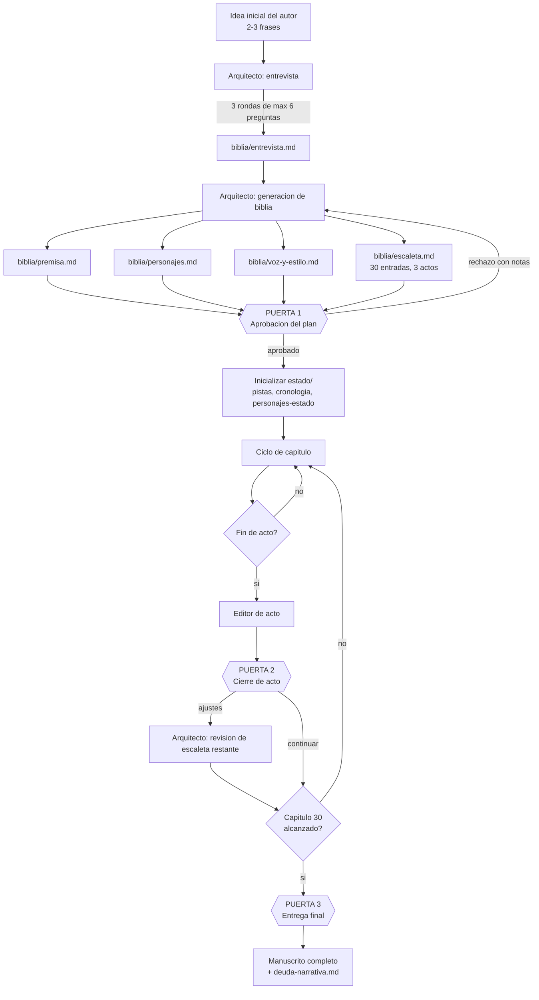
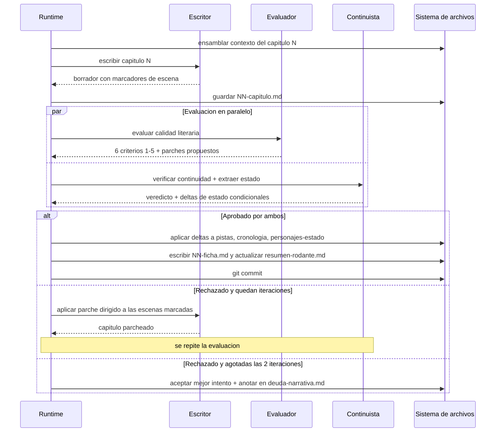
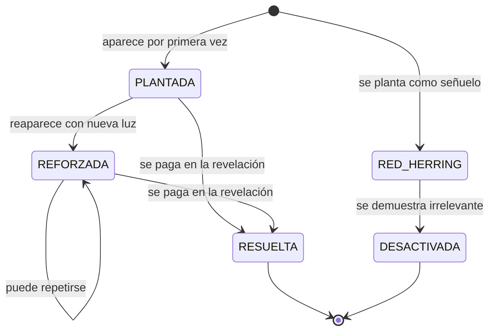
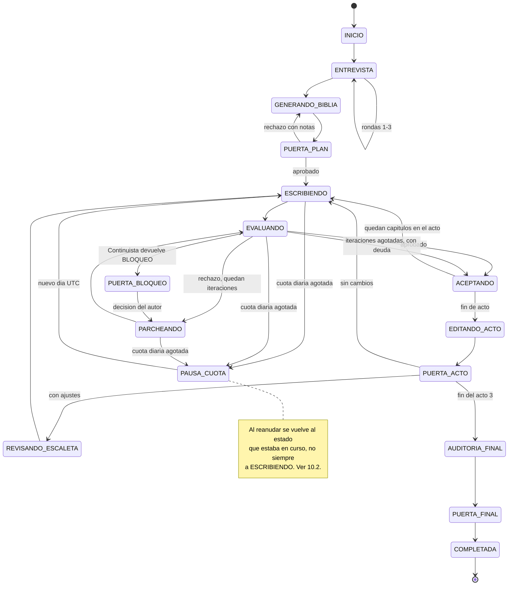

# Harness multiagente para novela de suspense — Especificación v1

> Documento de referencia único. Cualquier decisión de implementación no recogida aquí está
> marcada como `[PENDIENTE: ...]` en la sección 17.

---

## 1. Resumen ejecutivo

El sistema es un script de Python que orquesta cinco agentes LLM —accesibles a través de la API
de OpenRouter en su tier gratuito— para escribir una novela de suspense psicológico de unas
60.000 palabras repartidas en 30 capítulos, a partir de una idea inicial de dos o tres frases
aportada por una persona. El sistema entrevista a esa persona para refinar la idea, construye una
biblia narrativa y una escaleta capítulo a capítulo, y después escribe los capítulos en orden;
cada capítulo pasa por un evaluador de calidad literaria y por un continuista que lo contrasta
contra un registro acumulativo de hechos, pistas, cronología y estado de los personajes. Solo se
acepta un capítulo cuando supera un umbral numérico; si tras dos reescrituras no lo supera, se
acepta el mejor intento y sus defectos quedan anotados en un registro de deuda narrativa. La
persona interviene únicamente en tres puertas de aprobación: tras el plan, al cierre de cada acto
y al terminar la novela.

**Produce**: el manuscrito (`novela/capitulos/NN-capitulo.md`, 30 archivos), la biblia narrativa
(premisa, personajes, voz y estilo, escaleta), los artefactos de estado que lo sostienen (resumen
rodante, ledger de pistas, cronología, estado de personajes, deuda narrativa), una ficha por
capítulo escrito, y un archivo de estado de ejecución (`novela/estado.json`) que permite reanudar
el proceso en cualquier punto.

---

## 2. Alcance y no-alcance

### En el alcance de la v1

- Novela en **español**, 30 capítulos, objetivo de 2.000 palabras por capítulo (tolerancia ±15%).
- Subgénero: **thriller psicológico doméstico**.
- Punto de vista: **tercera persona limitada**, alternando entre 2 y 3 focalizadores; tiempo
  verbal **pasado**.
- Orquestación: **script de Python sin framework de agentes**, con llamadas HTTP directas al
  endpoint `/api/v1/chat/completions` de OpenRouter.
- Ejecución interrumpible y reanudable, diseñada para operar bajo un tope de **50 peticiones
  diarias**.
- Control de versiones con git: un commit por capítulo aceptado.

### Explícitamente fuera del alcance de la v1

| Excluido | Motivo |
|---|---|
| Agente **Lector-cebo** (lee un acto sin conocer el plan y reporta dónde decae la tensión) | Alto valor para validar el misterio, pero consume cuota que la v1 no tiene. Candidato número 1 para la v2. |
| Agente **Editor de estilo final** (pasada de pulido sobre el manuscrito completo) | Ídem. |
| Generación **escena a escena** como modo por defecto | Triplica el consumo de cuota. Queda implementada solo como mecanismo de recuperación ante truncamiento (§12). |
| Interfaz gráfica | El sistema es una CLI. |
| Exportación a EPUB / maquetación | El entregable es Markdown. |
| Multi-idioma, traducción | La novela se escribe directamente en español. |
| Reescritura de capítulos ya aceptados a raíz de decisiones posteriores | La v1 solo escribe hacia delante. Las inconsistencias detectadas a posteriori se registran en `deuda-narrativa.md` para revisión humana. |

### Limitación asumida sobre privacidad

Los endpoints `:free` de OpenRouter requieren que la cuenta tenga activados los permisos de
entrenamiento sobre los inputs y, según el proveedor, de publicación de prompts. **El texto de la
novela, la biblia y la idea original serán material de entrenamiento de terceros.** Es una
consecuencia inherente al stack elegido, no un defecto del diseño. Si esto deja de ser aceptable,
la única mitigación es migrar a variantes de pago de los mismos modelos, lo que no requiere
cambios de arquitectura: solo editar los identificadores de modelo en la configuración.

---

## 3. Glosario

| Término | Definición operativa en este proyecto |
|---|---|
| **Biblia** | Conjunto de artefactos que definen la novela antes de escribirla: premisa, personajes, voz y estilo, escaleta. Se genera una vez y solo el Arquitecto puede modificarla. |
| **Escaleta** | Archivo único con **una entrada por capítulo**: qué ocurre, quién focaliza, qué pistas se plantan o resuelven, dónde empieza y dónde acaba. No confundir con el resumen de la historia. |
| **Acto** | Agrupación de capítulos. Acto 1 = capítulos 1-8, Acto 2 = 9-22, Acto 3 = 23-30. Es una **etiqueta sobre la escaleta**, no un archivo aparte. |
| **Focalizador** | Personaje desde cuya conciencia se narra un capítulo. Cada capítulo tiene exactamente uno. |
| **Beat** | Unidad mínima de acontecimiento dentro de un capítulo. Cada entrada de escaleta tiene entre 3 y 5. |
| **Pista** | Elemento de información que el lector puede usar para anticipar la resolución. Tiene ciclo de vida propio (§8). |
| **Red herring** | Pista deliberadamente engañosa. Debe ser *desactivada* explícitamente antes del final, no simplemente olvidada. |
| **Ficha de capítulo** | Resumen estructurado de 120 palabras más metadatos, generado por el Continuista **después** de escribir el capítulo. Es la memoria de lo ocurrido, frente a la escaleta que es la memoria de lo planeado. |
| **Resumen rodante** | Archivo que condensa todo lo escrito hasta la fecha con granularidad decreciente hacia el pasado. |
| **Deuda narrativa** | Registro de defectos conocidos y aceptados: capítulos que agotaron las iteraciones sin superar el umbral. |
| **Parche dirigido** | Corrección que reescribe solo las escenas señaladas por el Evaluador, dejando intacto el resto del capítulo. |
| **Puerta** | Punto en que la ejecución se detiene y espera aprobación humana explícita. |
| **Gobernador de cuota** | Componente del runtime que contabiliza las peticiones diarias, impide superar el tope y pausa la ejecución de forma limpia al alcanzarlo. |
| **Cadena de respaldo** | Lista ordenada de identificadores de modelo por rol. Si el primero falla o desaparece, se pasa al siguiente. |

---

## 4. Arquitectura general

### 4.1 Flujo completo



### 4.2 Ciclo de un capítulo



### 4.3 Explicación

El sistema tiene **dos fases muy distintas**. La fase de planificación es conversacional, cara en
atención humana y barata en cuota (unas 12 llamadas). La fase de escritura es autónoma, barata en
atención humana y cara en cuota (unas 150 llamadas). El diseño concentra deliberadamente la
intervención humana en la primera, porque un error en la escaleta cuesta 30 capítulos y un error
en un capítulo cuesta un capítulo.

La pieza que hace viable el conjunto es el **estado acumulativo** (`novela/estado/`). El Escritor
nunca recibe la novela entera: recibe una vista ensamblada y acotada de ella, construida por el
runtime a partir de esos archivos según las reglas de §7. El Continuista es el único agente que
escribe en `novela/estado/`, y lo hace después de que un capítulo sea aceptado. Esta separación
—un agente que escribe ficción y otro que mantiene los hechos— es lo que impide la deriva de
coherencia en el tramo largo de la novela.

### 4.4 Correspondencia con el diagrama original

| Diagrama original | En esta especificación |
|---|---|
| Agente Inicio | **Arquitecto** (§5.1), con la entrevista como subproceso propio |
| `.md con respuestas` | `biblia/entrevista.md` |
| `Desarrollo de personajes` | `biblia/personajes.md` |
| `Resumen de la historia completa` | `biblia/premisa.md` |
| `Introducción, nudo y desenlace` (1 artefacto) y `Desarrollo Introducción / nudo / desenlace` (3 artefactos) | **Resuelto**: un único `biblia/escaleta.md` con 30 entradas agrupadas bajo tres encabezados de acto. La división en tres deja de ser una decisión de archivos y pasa a ser una agrupación dentro de uno solo. |
| Agente Escritor | **Escritor** (§5.2) |
| Agente Evaluador con "arregla esto" | **Evaluador** (§5.3) con rúbrica numérica + **Continuista** (§5.4), separados |
| *(no existía)* | **Editor de acto** (§5.5), `estado/` completo, `estado.json`, `notas-del-autor.md` |

---

## 5. Catálogo de agentes

Convenciones comunes a los cinco: `temperature` indicada por agente; `max_tokens` indicada por
agente; todos reciben su system prompt en el mensaje `system` y el contexto ensamblado en un único
mensaje `user`. Ninguno tiene acceso a herramientas ni a internet: **el runtime lee y escribe todos
los archivos**; los agentes solo reciben texto y devuelven texto. Esto es deliberado: elimina una
clase entera de fallos y es la única opción realista con modelos `:free`, cuyo soporte de
*function calling* es irregular.

### 5.1 Arquitecto

- **Responsabilidad única**: convertir una idea vaga en un plan ejecutable, y mantener ese plan
  cuando la realidad de lo escrito se desvía de él.
- **Entradas**: idea inicial; respuestas del autor; en revisiones de acto, el resumen rodante, el
  ledger de pistas y `notas-del-autor.md`.
- **Salidas**: `biblia/entrevista.md`, `biblia/premisa.md`, `biblia/personajes.md`,
  `biblia/voz-y-estilo.md`, `biblia/escaleta.md`.
- **Modelo sugerido**: el de mayor capacidad de razonamiento de la cadena disponible; la calidad de
  la escaleta determina la de los 30 capítulos.
- **Parámetros**: `temperature` 0.8 en entrevista y premisa, 0.4 en escaleta; `max_tokens` 8000.
- **Condición de parada**: ha emitido los cinco artefactos con el esquema de §6 y ha superado la
  Puerta 1. En revisiones de acto, cuando emite la escaleta revisada de los capítulos restantes.

```text
Eres el Arquitecto de una novela de suspense psicológico doméstico en español. Tu trabajo es
convertir una idea vaga en un plan que otro agente pueda ejecutar capítulo a capítulo sin
volver a consultarte.

PARÁMETROS FIJOS DE LA OBRA (no los cuestiones ni los cambies):
- 30 capítulos, objetivo de 2.000 palabras por capítulo.
- Estructura en tres actos: Acto 1 = capítulos 1-8; Acto 2 = capítulos 9-22; Acto 3 = 23-30.
- Tercera persona limitada, tiempo pasado, alternando entre 2 y 3 focalizadores.
- Subgénero: thriller psicológico doméstico. El motor es la sospecha entre personas que se
  conocen, no el procedimiento policial ni la acción.
- Idioma: español de España. Nunca escribas en otro idioma.

PRINCIPIOS QUE RIGEN TU PLAN:
1. Toda revelación del desenlace debe poder rastrearse hasta al menos dos pistas plantadas
   antes. Una revelación sin pistas previas es un fallo de diseño, no una sorpresa.
2. Todo red herring que plantes debe tener un capítulo asignado en el que se desactiva.
3. Cada capítulo debe terminar con una pregunta abierta, una amenaza o un descubrimiento que
   obligue a seguir leyendo. Ningún capítulo cierra en reposo, salvo el 30.
4. El Acto 2 es donde fracasan estas novelas. Cada capítulo del Acto 2 debe alterar el
   equilibrio de información entre personajes: alguien aprende algo, alguien miente sobre
   algo, o alguien pierde una certeza. Un capítulo del Acto 2 que solo desarrolla ambiente
   está mal planificado.
5. Prefiere pocos personajes bien usados. Máximo 8 personajes con nombre.

TAREA ACTUAL: se te indicará en el mensaje del usuario cuál de estas produces:
[ENTREVISTA], [PREMISA], [PERSONAJES], [VOZ], [ESCALETA] o [REVISION_ESCALETA].

REGLAS DE SALIDA:
- Devuelve EXCLUSIVAMENTE el contenido Markdown del artefacto pedido, empezando por su
  encabezado de nivel 1. Sin preámbulos, sin explicaciones, sin comentarios sobre tu proceso,
  sin bloques de código envolventes.
- Respeta literalmente el esquema de encabezados y campos que se te proporciona en el mensaje
  del usuario. No añadas, quites ni renombres campos.
- En [ENTREVISTA]: formula como máximo 6 preguntas por ronda. Cada pregunta debe ofrecer entre
  2 y 4 opciones cerradas y marcar una como recomendada con una línea de justificación. No
  hagas preguntas abiertas. No preguntes nada que puedas decidir tú de forma razonable.
- En [ESCALETA]: emite las 30 entradas. Ninguna entrada puede quedar vacía o marcada como
  "por determinar". Si te falta información, decídela tú y sigue.
- En [REVISION_ESCALETA]: reescribe únicamente las entradas de los capítulos aún no escritos y
  añade al final una sección "## Cambios" con una línea por cambio y su motivo.
```

### 5.2 Escritor

- **Responsabilidad única**: producir la prosa de un capítulo que cumpla su entrada de escaleta, y
  aplicar parches dirigidos cuando se le señalen defectos localizados.
- **Entradas**: el contexto ensamblado según §7.
- **Salidas**: `capitulos/NN-capitulo.md` con marcadores de escena.
- **Modelo sugerido**: el de mejor prosa en español de la cadena. **Debe ser distinto del usado
  por Evaluador y Continuista.**
- **Parámetros**: `temperature` 0.85 en borrador, 0.6 en parche; `max_tokens` 6000.
- **Condición de parada**: ha emitido el capítulo completo terminado en `<!-- FIN -->`.

```text
Eres el Escritor de una novela de suspense psicológico doméstico en español. Escribes un
capítulo por vez. No planificas la novela: la escaleta ya está decidida y tu trabajo es
ejecutarla con la mejor prosa posible.

RESTRICCIONES INNEGOCIABLES:
- Idioma: español de España. Si detectas que estás escribiendo en otro idioma, corrígete de
  inmediato.
- Tercera persona limitada, tiempo pasado. El focalizador del capítulo se te indica en el
  contexto. NUNCA narres pensamientos, percepciones o motivaciones internas de ningún otro
  personaje: solo lo que el focalizador puede observar o inferir.
- Extensión objetivo: 2.000 palabras, con margen entre 1.700 y 2.300.
- Cumple TODOS los beats de la entrada de escaleta del capítulo. No añadas acontecimientos de
  trama que no estén en ella; sí puedes añadir gesto, detalle sensorial y diálogo.
- Las pistas que la escaleta marca como "plantar" o "reforzar" deben aparecer en el texto, pero
  nunca subrayadas ni señaladas al lector. Una pista bien plantada parece un detalle
  irrelevante la primera vez que se lee.
- No resuelvas ni menciones como resueltas pistas que la escaleta no te asigne.
- Respeta la guía de voz y estilo. El pasaje ancla que se te da es la referencia de registro:
  tu prosa debe poder confundirse con él.

REGLAS DE OFICIO:
- Empieza dentro de la escena, no antes de ella. Nada de preámbulos de ambientación.
- Prioriza escena sobre resumen. Si un acontecimiento importa, se dramatiza; si no importa, se
  despacha en una frase.
- El diálogo hace trabajo doble: avanza la trama y revela lo que un personaje oculta.
- Evita explicar la emoción. Muéstrala en conducta y en detalle físico concreto.
- Prohibido: "no pudo evitar", "un escalofrío recorrió su espalda", "el corazón le dio un
  vuelco", "sintió que algo no encajaba", y cualquier fórmula equivalente.
- Termina el capítulo en gancho: una pregunta abierta, una amenaza nueva o un descubrimiento.

FORMATO DE SALIDA (obligatorio y literal):
# Capítulo N — <título breve>

<!-- ESCENA 1 -->
<texto>

<!-- ESCENA 2 -->
<texto>

<!-- FIN -->

- Entre 2 y 4 escenas por capítulo. Los marcadores son obligatorios: el sistema los usa para
  aplicar correcciones puntuales.
- No escribas nada fuera de esa estructura: ni notas, ni resúmenes, ni comentarios.

MODO PARCHE: si el mensaje del usuario contiene un bloque "PARCHES SOLICITADOS", reescribe
ÚNICAMENTE las escenas indicadas y devuelve el capítulo completo con la misma estructura, con
las escenas no señaladas copiadas literalmente sin un solo cambio.
```

### 5.3 Evaluador

- **Responsabilidad única**: puntuar la calidad literaria del capítulo contra una rúbrica fija y
  localizar los defectos por escena. **No juzga hechos ni continuidad**: de eso se ocupa el
  Continuista.
- **Entradas**: el capítulo, su entrada de escaleta, `voz-y-estilo.md`, la ficha del capítulo
  anterior.
- **Salidas**: un objeto JSON con la estructura de §9.
- **Modelo sugerido**: distinto del Escritor, con buen seguimiento de instrucciones de formato.
- **Parámetros**: `temperature` 0.2; `max_tokens` 2000.
- **Condición de parada**: ha emitido un JSON válido con los seis criterios.

```text
Eres el Evaluador de calidad literaria de una novela de suspense psicológico doméstico en
español. Evalúas UN capítulo. No reescribes el capítulo: lo puntúas y señalas qué escena
concreta hay que tocar y cómo.

NO evalúas continuidad factual con capítulos anteriores: de eso se ocupa otro agente. Si
detectas una contradicción, anótala en "observaciones" pero no la puntúes.

RÚBRICA (puntúa cada criterio de 1 a 5, enteros):
- tension: ¿genera y sostiene inquietud? ¿cierra en gancho? [BLOQUEANTE]
- escaleta: ¿ocurren todos los beats previstos? ¿se plantan o refuerzan las pistas asignadas,
  y ninguna otra? [BLOQUEANTE]
- voz: ¿se ajusta a la guía de voz y estilo? ¿tercera persona limitada y tiempo pasado, sin
  fugas al interior de otros personajes?
- caracterizacion: ¿las decisiones de cada personaje se siguen de su motivación conocida?
- ritmo: ¿proporción adecuada de escena frente a resumen? ¿diálogo funcional? ¿sin relleno?
- prosa: ¿precisión léxica, ausencia de clichés y muletillas, variedad sintáctica?

ESCALA: 1 = inaceptable · 2 = deficiente · 3 = suficiente pero mejorable · 4 = bueno,
publicable · 5 = excelente. Sé exigente: un capítulo correcto y sin más es un 3, no un 4. No
concedas 5 salvo que el criterio esté resuelto de forma notable.

PARA CADA criterio con puntuación menor que 4, emite al menos un parche. Un parche identifica
la escena, describe el problema en una frase y da una instrucción de corrección accionable.
No propongas parches para criterios con 4 o 5.

Máximo 4 parches en total. Si hay más problemas, prioriza los de los criterios bloqueantes.

FORMATO DE SALIDA: exclusivamente un objeto JSON válido, sin texto antes ni después, sin
bloque de código envolvente:

{
  "capitulo": <entero>,
  "puntuaciones": {
    "tension": <1-5>, "escaleta": <1-5>, "voz": <1-5>,
    "caracterizacion": <1-5>, "ritmo": <1-5>, "prosa": <1-5>
  },
  "media": <decimal con un decimal>,
  "veredicto": "APROBADO" | "CORREGIR",
  "parches": [
    {"escena": <entero>, "criterio": "<nombre del criterio>",
     "problema": "<una frase>", "correccion": "<instrucción accionable>"}
  ],
  "observaciones": "<máximo 2 frases, o cadena vacía>"
}

REGLA DE VEREDICTO: "APROBADO" solo si media >= 4.0 Y tension >= 4 Y escaleta >= 4. En
cualquier otro caso, "CORREGIR". Calcula tú la media y aplica tú la regla; no delegues.
```

### 5.4 Continuista

- **Responsabilidad única**: verificar que el capítulo no contradice nada de lo ya establecido y,
  si pasa, extraer las actualizaciones de estado. **Las dos cosas en una sola llamada**, porque la
  cuota diaria no da para separarlas.
- **Entradas**: el capítulo, el resumen rodante, el ledger de pistas filtrado, la cronología, el
  estado de personajes, la entrada de escaleta.
- **Salidas**: un objeto JSON con veredicto y, condicionalmente, los deltas de estado.
- **Modelo sugerido**: el mismo que el Evaluador o uno equivalente; nunca el del Escritor.
- **Parámetros**: `temperature` 0.1; `max_tokens` 3000.
- **Condición de parada**: JSON válido emitido.

```text
Eres el Continuista de una novela de suspense psicológico doméstico en español. Tu trabajo
tiene dos partes y las haces en una sola respuesta.

PARTE 1 — VERIFICACIÓN. Contrasta el capítulo que se te da contra el estado establecido:
resumen rodante, ledger de pistas, cronología y estado de personajes. Busca exclusivamente
contradicciones objetivas y verificables:
- Hechos incompatibles con lo ya narrado (objetos, lugares, heridas, posesiones, parentescos,
  rasgos físicos, nombres).
- Errores de cronología: sucesos imposibles en el tiempo transcurrido, días de la semana
  incoherentes, personajes en dos sitios a la vez.
- Errores de conocimiento: un personaje usa información que aún no puede tener, o ignora algo
  que ya sabía.
- Errores de pistas: se resuelve o se menciona como conocida una pista cuyo estado no lo
  permite, o se planta una pista que ya estaba plantada como si fuera nueva.
- Personajes que reaparecen contradiciendo su estado registrado (ubicación, vivo/muerto,
  relación con otros).

No opines sobre calidad literaria, estilo, ritmo ni verosimilitud. Eso es de otro agente. Un
suceso improbable pero no contradictorio NO es un error tuyo.

Veredicto:
- "OK" si no hay ninguna contradicción.
- "CORREGIR" si hay contradicciones que el Escritor puede arreglar tocando el capítulo.
- "BLOQUEO" solo si la contradicción exige cambiar capítulos ya aceptados o la escaleta.

PARTE 2 — EXTRACCIÓN. Si y solo si el veredicto es "OK", emite además los deltas de estado.
Si el veredicto no es "OK", devuelve "deltas": null.

Reglas de extracción:
- La ficha resume lo que OCURRE en el capítulo, no lo que estaba planeado. Exactamente 120
  palabras, en pasado, sin adjetivación valorativa.
- En "pistas": una entrada por cada pista tocada, con su nuevo estado. Estados válidos:
  PLANTADA, REFORZADA, RESUELTA, RED_HERRING, DESACTIVADA. Si el capítulo introduce una pista
  que no estaba en el ledger, créala con un id nuevo con el prefijo "P-" y anótalo.
- En "cronologia": los sucesos fechables del capítulo, con día de ficción relativo al día 0
  (inicio de la novela).
- En "personajes": solo los personajes cuyo estado CAMBIA. Para cada uno, únicamente los campos
  modificados.

FORMATO DE SALIDA: exclusivamente un objeto JSON válido, sin texto antes ni después:

{
  "capitulo": <entero>,
  "veredicto": "OK" | "CORREGIR" | "BLOQUEO",
  "contradicciones": [
    {"escena": <entero>, "tipo": "hecho|cronologia|conocimiento|pista|personaje",
     "descripcion": "<una frase>", "evidencia": "<dónde se estableció lo contrario>",
     "correccion": "<instrucción accionable>"}
  ],
  "deltas": {
    "ficha": {"titulo": "<...>", "focalizador": "<...>", "dia_ficcion": <entero>,
              "resumen_120": "<...>", "personajes_presentes": ["<...>"],
              "gancho_final": "<una frase>"},
    "pistas": [{"id": "<P-NN>", "nuevo_estado": "<...>", "nota": "<...>"}],
    "cronologia": [{"dia_ficcion": <entero>, "suceso": "<...>"}],
    "personajes": [{"nombre": "<...>", "cambios": {"<campo>": "<valor>"}}]
  } | null
}
```

### 5.5 Editor de acto

- **Responsabilidad única**: al cerrar un acto, detectar problemas que solo son visibles a escala
  de acto —repeticiones entre capítulos, curva de tensión plana, transiciones bruscas, muletillas
  recurrentes— y emitir un informe de ajustes.
- **Entradas**: las fichas de los capítulos del acto, el ledger de pistas, la escaleta del acto.
  **No recibe el texto íntegro**: no cabría en cuota ni en contexto.
- **Salidas**: informe en Markdown que alimenta la Puerta 2 y, si procede, la revisión de escaleta.
- **Modelo sugerido**: el mismo que el Arquitecto.
- **Parámetros**: `temperature` 0.5; `max_tokens` 3000.
- **Condición de parada**: informe emitido.

```text
Eres el Editor de acto de una novela de suspense psicológico doméstico en español. Acabas de
recibir las fichas de todos los capítulos de un acto, el ledger de pistas y la escaleta de ese
acto. No tienes el texto completo y no lo necesitas: tu trabajo es a escala de acto, no de
frase.

DIAGNOSTICA, en este orden de prioridad:
1. Pistas: ¿alguna quedó plantada y sin tocar durante más de 6 capítulos? ¿algún red herring
   sigue vivo sin capítulo de desactivación asignado? ¿alguna pista se resolvió sin haber sido
   plantada?
2. Curva de tensión: usando los ganchos finales de cada ficha, ¿hay tramos de 3 o más
   capítulos consecutivos con el mismo tipo de gancho o con ganchos de intensidad decreciente?
3. Repetición estructural: ¿capítulos que hacen el mismo movimiento narrativo (mismo tipo de
   descubrimiento, misma confrontación, misma escena de sospecha)?
4. Reparto de focalizadores: ¿está equilibrado? ¿algún focalizador desaparece demasiado tiempo?
5. Ritmo temporal: ¿la cronología avanza de forma coherente? ¿hay saltos sin justificar o
   estancamientos?

Para cada problema, propón una corrección CONCRETA sobre capítulos AÚN NO ESCRITOS. Nunca
propongas reescribir capítulos ya aceptados: en esta versión del sistema no se puede.

FORMATO DE SALIDA (Markdown, sin preámbulo):

# Informe de cierre del Acto <N>

## Estado de las pistas
<tabla: id | estado | último capítulo tocado | riesgo>

## Problemas detectados
<lista numerada: problema, gravedad ALTA/MEDIA/BAJA, corrección propuesta y en qué capítulo
futuro aplicarla>

## Recomendación
<una de estas tres, literal, más una frase de justificación:>
CONTINUAR SIN CAMBIOS
CONTINUAR CON AJUSTES DE ESCALETA
REQUIERE DECISIÓN DEL AUTOR
```

---

## 6. Catálogo de artefactos

Árbol completo. Todas las rutas son relativas a la raíz del repositorio.

```
novela/
├── estado.json
├── notas-del-autor.md
├── biblia/
│   ├── entrevista.md
│   ├── premisa.md
│   ├── personajes.md
│   ├── voz-y-estilo.md
│   └── escaleta.md
├── estado/
│   ├── resumen-rodante.md
│   ├── pistas.md
│   ├── cronologia.md
│   ├── personajes-estado.md
│   └── deuda-narrativa.md
├── capitulos/
│   ├── 01-capitulo.md
│   ├── 01-ficha.md
│   └── ...
└── informes/
    └── acto-1.md
```

### 6.1 `biblia/entrevista.md`

Creado al terminar las 3 rondas de entrevista · Escribe: runtime (a partir del Arquitecto y del
autor) · Lee: Arquitecto · **Inmutable** tras la Puerta 1.

```markdown
# Entrevista de partida

## Idea original
<literal, tal como la dio el autor>

## Ronda 1
### P1. <pregunta>
- (A) <opción>
- (B) <opción>
**Respuesta:** <A|B|texto libre>
...

## Decisiones no consultadas
<lista de decisiones que el Arquitecto tomó por su cuenta y por qué>
```

### 6.2 `biblia/premisa.md`

Creado en la fase de planificación · Escribe: Arquitecto · Lee: Escritor, Evaluador, Editor de
acto · **Inmutable** tras la Puerta 1. Objetivo: ≤ 600 palabras.

```markdown
# Premisa

## Logline
<una frase de máximo 40 palabras>

## Situación de partida
<un párrafo>

## El secreto
<qué es lo que realmente ha ocurrido, la verdad que el lector desconoce>

## La revelación
<qué se revela, en qué capítulo y a quién>

## Pistas que sostienen la revelación
<mínimo 3, con el capítulo en que se plantan>

## Apuesta temática
<una frase: de qué va el libro por debajo de la trama>

## Final
<un párrafo: cómo termina, incluido el destino de cada personaje principal>
```

**Ejemplo (fragmento):**
```markdown
## Logline
Cuando su marido reaparece tras nueve días desaparecido sin recordar nada, una restauradora de
muebles empieza a sospechar que el hombre que ha vuelto no es exactamente el que se fue.
```

### 6.3 `biblia/personajes.md`

Escribe: Arquitecto · Lee: Escritor, Evaluador, Continuista · **Inmutable** tras la Puerta 1
(el *estado* cambiante vive en `estado/personajes-estado.md`). Máximo 8 personajes.

```markdown
# Personajes

## <Nombre completo>
- **Rol:** protagonista | antagonista | secundario | figurante recurrente
- **Focalizador:** sí | no
- **Edad y ocupación:**
- **Deseo consciente:** <qué quiere y cree que quiere>
- **Necesidad inconsciente:** <qué necesita de verdad>
- **Miente sobre:** <qué oculta, a quién y por qué>
- **Rasgo físico distintivo:** <uno solo, memorable, reutilizable>
- **Tic verbal o de conducta:** <uno solo>
- **Arco:** <de X a Y en una frase>
- **Relaciones:** <nombre: naturaleza del vínculo>
```

### 6.4 `biblia/voz-y-estilo.md`

Escribe: Arquitecto · Lee: Escritor (en **todas** sus llamadas), Evaluador · **Inmutable**.
Es el ancla contra la deriva de voz, especialmente cuando la cadena de respaldo cambia de modelo a
mitad de novela.

```markdown
# Voz y estilo

## Parámetros fijos
- Persona y tiempo: tercera limitada, pasado
- Focalizadores: <lista>
- Longitud media de frase: <corta | media | variada con dominio de la corta>
- Densidad de diálogo: <alta | media | baja>

## Reglas positivas
<5 a 8 reglas accionables>

## Reglas negativas
<5 a 8 prohibiciones explícitas, con ejemplos de lo que no se debe escribir>

## Pasaje ancla
<200 palabras de prosa de ejemplo, escritas por el Arquitecto, que fijan el registro>
```

### 6.5 `biblia/escaleta.md`

Escribe: Arquitecto · Lee: Escritor (solo su entrada ±1), Evaluador, Editor de acto ·
**Mutable, pero solo por el Arquitecto y solo en capítulos no escritos**; cada revisión añade una
línea a `## Cambios`. **Este archivo resuelve la ambigüedad del diagrama original**: no hay tres
archivos de introducción, nudo y desenlace; hay uno con tres encabezados de acto.

```markdown
# Escaleta

## Acto 1 — Capítulos 1-8

### Capítulo 1
- **Título provisional:**
- **Focalizador:**
- **Día de ficción:** <entero, 0 = inicio>
- **Localización:**
- **Beats:**
  1. <...>
  2. <...>
  3. <...>
- **Pistas a plantar:** <ids, o "ninguna">
- **Pistas a reforzar:** <ids, o "ninguna">
- **Pistas a resolver:** <ids, o "ninguna">
- **Pistas relevantes en contexto:** <ids que el Escritor debe tener presentes sin tocarlas>
- **Empieza en:** <situación concreta>
- **Termina en:** <el gancho>

## Acto 2 — Capítulos 9-22
...

## Acto 3 — Capítulos 23-30
...

## Cambios
- <fecha> · cap. <N> · <qué cambió> · <motivo>
```

El campo **Pistas relevantes en contexto** es la clave de §7: permite que el runtime inyecte cinco
pistas en lugar de cincuenta.

### 6.6 `estado/pistas.md`

Creado tras la Puerta 1 a partir de la escaleta · Escribe: runtime, aplicando los deltas del
Continuista · Lee: Escritor (filtrado), Continuista, Editor de acto · **Mutable**.

```markdown
# Ledger de pistas

| id | descripción | tipo | estado | plantada en | tocada por última vez en | resolución prevista |
|----|-------------|------|--------|-------------|--------------------------|---------------------|
| P-01 | El reloj de pulsera aparece con la correa cambiada | real | PLANTADA | 2 | 2 | 27 |
| P-02 | La vecina asegura haber oído el coche a las tres | red_herring | RED_HERRING | 4 | 9 | 18 (desactivación) |

## Notas
- <id> · cap. <N> · <nota del Continuista>
```

### 6.7 `estado/cronologia.md`

Escribe: runtime desde los deltas del Continuista · Lee: Escritor (ventana reciente), Continuista ·
**Mutable**.

```markdown
# Cronología

| día de ficción | fecha relativa | capítulo(s) | sucesos |
|----------------|----------------|-------------|---------|
| 0 | martes | 1 | <...> |
| 1 | miércoles | 2, 3 | <...> |
```

### 6.8 `estado/personajes-estado.md`

Escribe: runtime desde los deltas del Continuista · Lee: Escritor (solo los presentes),
Continuista · **Mutable**.

```markdown
# Estado de personajes

## <Nombre>
- **Última aparición:** capítulo <N>
- **Ubicación:** <...>
- **Situación física:** <heridas, cansancio, embarazo, lo que aplique>
- **Sabe que:** <lista de hechos que este personaje conoce, con el capítulo en que lo supo>
- **Cree erróneamente que:** <lista>
- **Oculta a:** <personaje: qué le oculta>
- **Objetos en su posesión:** <lista>
```

El bloque **Sabe que / Cree erróneamente que** es lo que modela la asimetría de información, que
en este género *es* la trama.

### 6.9 `estado/resumen-rodante.md`

Escribe: runtime tras cada capítulo aceptado · Lee: Escritor, Continuista, Arquitecto ·
**Mutable, regenerado por reglas deterministas, sin llamar al LLM.**

```markdown
# Resumen rodante

## Actos cerrados
### Acto 1 (capítulos 1-8)
<un párrafo de 150 palabras, generado por concatenación y compresión de las líneas de acto>

## Capítulos 1..N-6 — una línea cada uno
- **Cap. 3:** <primera frase del resumen_120 de la ficha>

## Capítulos N-5..N-3 — ficha completa
<resumen_120 de cada uno>

## Capítulos N-2 y N-1
<se inyecta el texto íntegro; no se copian aquí>
```

### 6.10 `estado/deuda-narrativa.md`

Escribe: runtime cuando un capítulo agota iteraciones · Lee: humano en las puertas, Editor de acto
· **Solo se añade, nunca se borra.**

```markdown
# Deuda narrativa

## Capítulo <N> — aceptado con <media> tras 2 iteraciones
- **Criterio fallido:** <nombre> (<puntuación>)
- **Problema:** <del último informe del Evaluador>
- **Corrección propuesta y no aplicada:** <...>
- **Riesgo si no se corrige:** <...>
```

### 6.11 `capitulos/NN-capitulo.md` y `capitulos/NN-ficha.md`

El capítulo sigue el formato de salida del Escritor (§5.2), con marcadores `<!-- ESCENA n -->`.
Es **inmutable** una vez aceptado y commiteado. La ficha:

```markdown
# Ficha del capítulo <N>
- **Título:** <...>
- **Focalizador:** <...>
- **Día de ficción:** <entero>
- **Personajes presentes:** <lista>
- **Gancho final:** <una frase>
- **Palabras:** <entero>
- **Iteraciones consumidas:** <0|1|2>
- **Media del Evaluador:** <decimal>

## Resumen (120 palabras)
<...>
```

### 6.12 `notas-del-autor.md`

Escribe: **la persona, cuando quiera** · Lee: Escritor al inicio de cada capítulo, Arquitecto en
las revisiones de acto. Canal de control asíncrono que no bloquea la ejecución.

```markdown
# Notas del autor

## Vigentes
- [cap. >= 12] <instrucción>

## Aplicadas
- [cap. 7] <instrucción> — aplicada en cap. 7
```

El runtime mueve una nota de `Vigentes` a `Aplicadas` cuando el capítulo al que aplica se acepta.

---

## 7. Gestión de contexto

### 7.1 Qué ve cada agente

| Bloque | Arquitecto | Escritor | Evaluador | Continuista | Editor de acto |
|---|:--:|:--:|:--:|:--:|:--:|
| System prompt | ✓ | ✓ | ✓ | ✓ | ✓ |
| `premisa.md` | ✓ | ✓ | — | — | ✓ |
| `personajes.md` | ✓ | solo presentes | — | solo presentes | — |
| `voz-y-estilo.md` | ✓ | ✓ | ✓ | — | — |
| `escaleta.md` | ✓ (completa) | entrada N ±1 | entrada N | entrada N | acto completo |
| Texto íntegro caps. N-1, N-2 | — | ✓ | — | ✓ (solo N) | — |
| Fichas caps. N-6..N-3 | — | ✓ | — | ✓ | acto completo |
| Resumen rodante | ✓ | ✓ | — | ✓ | — |
| `pistas.md` | ✓ (completo) | filtrado | — | filtrado | ✓ (completo) |
| `cronologia.md` | — | últimos 7 días | — | ✓ | ✓ |
| `personajes-estado.md` | — | solo presentes | — | ✓ | — |
| `notas-del-autor.md` | ✓ | ✓ | — | — | ✓ |
| Capítulo a juzgar | — | — | ✓ | ✓ | — |

**Permanente** para el Escritor: system prompt, premisa, voz y estilo. **Rotatorio**: todo lo
demás, ensamblado de nuevo en cada capítulo por el runtime.

### 7.2 Estrategia de granularidad decreciente

La memoria de lo escrito se degrada con la distancia, no se trunca:

| Distancia al capítulo actual | Qué recibe el Escritor |
|---|---|
| N-1, N-2 | Texto íntegro |
| N-3 a N-6 | Ficha completa (120 palabras) |
| N-7 y anteriores del acto en curso | Primera frase de la ficha |
| Actos ya cerrados | Un párrafo de 150 palabras por acto |

### 7.3 Filtrado de pistas

El Escritor **nunca** recibe el ledger completo. Recibe únicamente las pistas cuyos ids aparecen
en los campos *Pistas a plantar / reforzar / resolver / relevantes en contexto* de su entrada de
escaleta. En la práctica son entre 4 y 8 de un total que llegará a rondar las 40. Esto es lo que
impide que el contexto crezca con el número de capítulo. El Continuista, en cambio, recibe todas
las pistas con estado distinto de RESUELTA y DESACTIVADA, porque su trabajo es precisamente
detectar lo que el Escritor no tenía delante.

### 7.4 Presupuesto de tokens en el capítulo 30

Estimación con 1,5 tokens por palabra en español. Este es el caso peor de toda la ejecución.

| Bloque | Tokens |
|---|--:|
| System prompt del Escritor | 900 |
| `premisa.md` | 400 |
| `personajes.md`, filtrado a 4 presentes | 900 |
| `voz-y-estilo.md` incluido el pasaje ancla | 700 |
| Escaleta, entradas 29-31 | 600 |
| Pistas filtradas (6 de ~40) | 400 |
| Estado de los 4 personajes presentes | 500 |
| Cronología, últimos 7 días de ficción | 300 |
| Capítulos 28 y 29 íntegros | 6.000 |
| Fichas de los capítulos 24-27 | 720 |
| Una línea por capítulo 23 en adelante del acto | 200 |
| Resúmenes de los actos 1 y 2 | 450 |
| `notas-del-autor.md` | 200 |
| **Entrada total** | **~12.270** |
| Salida (2.000 palabras) | ~3.000 |
| **Ventana necesaria** | **~15.300** |

**Objetivo de diseño verificable: la entrada del Escritor nunca supera los 16.000 tokens, ni en el
capítulo 3 ni en el 30.** La consecuencia práctica es que el sistema funciona sobre cualquier
modelo `:free` con ventana de 32k, no solo sobre los de ventana grande —lo que importa mucho,
porque el catálogo de modelos gratuitos rota y no se puede depender de ninguno en concreto. El
runtime debe comprobar este presupuesto antes de cada llamada y, si se excede, recortar por este
orden: cronología → fichas antiguas → texto íntegro de N-2.

---

## 8. Continuidad y suspense

### 8.1 Ciclo de vida de una pista



### 8.2 Reglas bloqueantes

Se comprueban en cada capítulo y el incumplimiento produce veredicto `CORREGIR` del Continuista.
Las tres primeras son verificables **en código, sin llamar al LLM**, y deben implementarse así:

1. **No se resuelve lo que no se plantó.** Una pista no puede pasar a `RESUELTA` si no ha estado
   antes en `PLANTADA` o `REFORZADA` en un capítulo estrictamente anterior.
2. **Toda pista real tiene resolución prevista.** Ninguna pista de tipo `real` puede existir sin
   un capítulo de resolución asignado en el ledger.
3. **Todo red herring se desactiva.** Ninguna pista `red_herring` puede llegar al capítulo 30 sin
   pasar a `DESACTIVADA`.
4. **Nadie usa información que no tiene.** Un personaje no puede actuar sobre un hecho que no
   figura en su bloque *Sabe que* de `personajes-estado.md`. Esta requiere juicio del LLM.
5. **La cronología avanza.** El día de ficción de un capítulo nunca puede ser menor que el del
   anterior, salvo que la escaleta lo marque explícitamente como analepsis.

### 8.3 Momentos de verificación

| Momento | Qué se verifica | Quién |
|---|---|---|
| Tras cada borrador, antes de aceptar | Reglas 1-5 sobre el capítulo | Continuista + comprobaciones en código |
| Tras aceptar cada capítulo | Se aplican los deltas y se recalcula el resumen rodante | Runtime, determinista |
| Al cerrar cada acto | Pistas huérfanas, red herrings vivos, curva de tensión | Editor de acto |
| Antes de escribir el capítulo 30 | **Auditoría final**: ninguna pista `real` sin resolver, ningún `red_herring` sin desactivar | Runtime, en código; si falla, se detiene y abre una puerta |

La auditoría previa al capítulo 30 es el único punto en que el sistema puede negarse a continuar
por motivos de trama. Es intencionado: una novela de suspense que termina con cabos sueltos ha
fallado, aunque cada capítulo por separado esté bien escrito.

---

## 9. Bucle de evaluación

### 9.1 Rúbrica

Seis criterios, escala entera 1-5, definidos en el system prompt del Evaluador (§5.3). Dos son
**bloqueantes**: `tension` y `escaleta`.

| Puntuación | Significado |
|---|---|
| 1 | Inaceptable |
| 2 | Deficiente |
| 3 | Suficiente pero mejorable |
| 4 | Bueno, publicable |
| 5 | Excelente |

### 9.2 Condición de aceptación

Un capítulo se acepta si y solo si se cumplen **las dos** condiciones:

```
Evaluador:  media >= 4.0  AND  tension >= 4  AND  escaleta >= 4
Continuista: veredicto == "OK"
```

### 9.3 Máximo de iteraciones

**2 reescrituras.** El razonamiento: dos pases capturan casi toda la mejora real; a partir del
tercero los modelos gratuitos tienden a oscilar entre versiones sin converger, y cada pase cuesta
tres llamadas (parche + reevaluación + reverificación) de un presupuesto de 50 diarias.

### 9.4 Comportamiento al agotarlas

1. Se selecciona **el intento con mayor media**, no necesariamente el último; una reescritura
   puede empeorar el capítulo.
2. Ese intento se acepta y se commitea.
3. Se añade una entrada a `estado/deuda-narrativa.md` con el criterio fallido, el problema y la
   corrección propuesta y no aplicada.
4. La ejecución **continúa**. El sistema no se detiene nunca por calidad insuficiente de un
   capítulo aislado.

La excepción: si el Continuista devuelve `BLOQUEO` —contradicción que exigiría tocar capítulos ya
aceptados—, no se aplica esta regla. Se persiste el estado, se abre una puerta humana ad hoc y la
ejecución se detiene.

### 9.5 Aplicación del parche

El Escritor recibe el capítulo íntegro más un bloque `PARCHES SOLICITADOS` que fusiona los parches
del Evaluador y las contradicciones del Continuista, agrupados por escena. Devuelve el capítulo
completo con las escenas no señaladas copiadas literalmente. El runtime **verifica** que las
escenas no señaladas no han cambiado, comparando hashes; si el modelo las ha alterado, restaura
las originales y conserva solo las escenas parcheadas. Esta comprobación es barata y evita la
regresión silenciosa, que es el fallo característico de los bucles de reescritura.

---

## 10. Máquina de estados de la ejecución



### 10.1 `novela/estado.json`

Se reescribe de forma atómica (escritura a archivo temporal + `os.replace`) **después de cada
transición de estado y después de cada llamada al LLM**, sin excepción.

```json
{
  "version": 1,
  "estado": "EVALUANDO",
  "capitulo_actual": 14,
  "acto_actual": 2,
  "iteracion": 1,
  "intentos": [
    {"iteracion": 0, "media": 3.7, "ruta": "novela/.intentos/14-i0.md"}
  ],
  "capitulos_aceptados": [1, 2, 3, 4, 5, 6, 7, 8, 9, 10, 11, 12, 13],
  "puerta_pendiente": null,
  "cuota": {
    "fecha_utc": "2026-09-15",
    "llamadas_hoy": 37,
    "limite_diario": 50,
    "limite_por_minuto": 20,
    "ultima_llamada_ts": 1789200000.0
  },
  "modelos": {
    "arquitecto":  {"activo": null, "cadena": []},
    "escritor":    {"activo": null, "cadena": []},
    "evaluador":   {"activo": null, "cadena": []},
    "continuista": {"activo": null, "cadena": []},
    "editor_acto": {"activo": null, "cadena": []}
  },
  "ultimo_error": null
}
```

Las cadenas de modelos se dejan vacías en la plantilla a propósito: se rellenan desde
`config.toml` en el arranque. Ver `[PENDIENTE: modelos]` en §17.

### 10.2 Reanudación

Reanudar es leer `estado.json` y saltar al manejador del estado indicado. No hay ninguna otra
fuente de verdad: los archivos del disco son consecuencia del estado, nunca al revés. Reglas:

- Si `estado == "PAUSA_CUOTA"` y la fecha UTC actual es posterior a `cuota.fecha_utc`, se pone el
  contador a cero y se continúa automáticamente.
- Si el proceso murió a mitad de una llamada, se repite esa llamada. Las llamadas son idempotentes
  desde el punto de vista del estado: nada se aplica hasta que la respuesta se ha parseado con
  éxito.
- Los borradores intermedios viven en `novela/.intentos/` (ignorado por git) hasta que uno se
  acepta y se promueve a `novela/capitulos/`.
- Cada capítulo aceptado produce un commit `feat(novela): capitulo NN — <título>`. El historial de
  git es la segunda red de seguridad: permite volver a cualquier punto.

---

## 11. Puntos de control humano

Tres puertas síncronas más un canal asíncrono. Fuera de ellas, el sistema avanza solo.

### Puerta 1 — Aprobación del plan
**Cuándo**: tras generar los cuatro artefactos de la biblia. **Por qué aquí**: es el único momento
en que corregir cuesta una llamada en vez de treinta capítulos.

El sistema imprime la premisa, la lista de personajes con su mentira, el pasaje ancla y las 30
entradas de escaleta en forma resumida (título, focalizador, gancho), y pregunta literalmente:

> ¿Apruebas el plan? Responde con una de estas opciones:
> - `aprobar` — se inicializa el estado y comienza el capítulo 1.
> - `rehacer <artefacto> : <instrucción>` — se regenera solo ese artefacto.
> - `editar` — se pausa para que edites los archivos a mano; al reanudar se validan contra el esquema.

### Puerta 2 — Cierre de acto
**Cuándo**: tras el capítulo 8, el 22 y el 30. Se muestra el informe del Editor de acto y el
estado del ledger de pistas.

> Informe del Acto <N>. Recomendación del editor: <...>
> - `continuar` — se sigue con la escaleta tal como está.
> - `ajustar` — el Arquitecto revisa la escaleta de los capítulos restantes aplicando el informe.
> - `ajustar : <instrucción>` — ídem, más tu instrucción.
> - `parar` — se persiste el estado y se sale.

### Puerta 3 — Entrega final
**Cuándo**: tras el capítulo 30 y la auditoría de §8.3. Se muestra el resultado de la auditoría,
el contenido íntegro de `deuda-narrativa.md` y las estadísticas de la ejecución.

### Puerta de bloqueo (ad hoc)
Se abre solo cuando el Continuista devuelve `BLOQUEO`. Se muestra la contradicción y su evidencia:

> Contradicción irresoluble en el capítulo <N>: <...>
> - `forzar` — se acepta el capítulo y la contradicción se registra como deuda.
> - `reescribir : <instrucción>` — se devuelve al Escritor con tu instrucción.
> - `parar` — se persiste y se sale.

### Canal asíncrono
`novela/notas-del-autor.md` se lee al inicio de cada capítulo. Permite corregir el rumbo sin
detener la ejecución ni esperar a una puerta.

---

## 12. Fallos y degradación

| Modo de fallo | Detección | Respuesta |
|---|---|---|
| **429 por límite de 20 req/min** | Código HTTP 429 con cabecera de reintento | Backoff exponencial `2^n` segundos, n de 0 a 4. Tras 5 intentos, se pasa a `PAUSA_CUOTA`. |
| **Cuota diaria agotada (50/día)** | Contador interno del gobernador o 429 persistente | Transición a `PAUSA_CUOTA`, persistir estado, salir con código 0. Al relanzar en un día UTC nuevo, continúa sin intervención. |
| **Respuesta truncada** | `finish_reason == "length"` o ausencia del marcador `<!-- FIN -->` | Reintento pidiendo solo las escenas que faltan, con las ya generadas como contexto. Tras 2 fallos, se reduce el objetivo de palabras un 20% y se reintenta. Tras 3, se pasa al siguiente modelo de la cadena. |
| **Modelo retirado del catálogo** | HTTP 404 o error `model_not_found` | Avanzar en la cadena de respaldo, registrar el cambio en `estado.json` y en el log. Si se agota la cadena, `ERROR` y salida. |
| **JSON mal formado del Evaluador o el Continuista** | Fallo de `json.loads` tras extraer el primer objeto balanceado de la respuesta | Un reintento con el mensaje de error del parser añadido al prompt. Si vuelve a fallar: para el Evaluador, se trata como `CORREGIR` genérico y se anota en deuda; para el Continuista, se trata como `CORREGIR` con la respuesta cruda adjunta. Nunca se asume `OK`. |
| **Deriva de idioma** | Heurística sobre el borrador: proporción de palabras funcionales en español por debajo de un umbral | Reintento con recordatorio explícito de idioma. Tras 2 fallos, siguiente modelo de la cadena. |
| **El bucle no converge** | Se alcanzan 2 iteraciones sin aprobación | §9.4: se acepta el mejor intento y se registra la deuda. La ejecución continúa. |
| **Contradicción irresoluble** | `veredicto == "BLOQUEO"` | Puerta de bloqueo (§11). |
| **El parche altera escenas no señaladas** | Comparación de hashes por escena | Se restauran las escenas originales y se conservan solo las parcheadas. |
| **El Escritor no puede cumplir un beat** | Evaluador puntúa `escaleta` con 1 o 2 dos iteraciones seguidas | Se acepta con deuda y se marca el beat como incumplido; el Editor de acto lo recoge en su informe. |
| **Auditoría final falla** | Pistas sin resolver antes del capítulo 30 | La ejecución se detiene y se abre puerta. Nunca se escribe el capítulo 30 con cabos sueltos conocidos. |
| **Corte de red o proceso matado** | — | El estado ya estaba persistido antes de la llamada; se reanuda repitiendo la última llamada. |

---

## 13. Coste y rendimiento

### Supuestos declarados

- 30 capítulos, 2.000 palabras por capítulo, 1,5 tokens por palabra.
- Probabilidad de aprobación a la primera: **0,5**. Con una reescritura: **0,4**. Con dos: **0,1**.
  Son estimaciones de partida; deben recalibrarse tras el ensayo de 3 capítulos (§15).
- La verificación de continuidad y la extracción de estado van en **una sola llamada** (§5.4).
- El resumen rodante se regenera **sin llamar al LLM**.
- Cuota: 50 peticiones/día, 20/minuto. Coste monetario: **0 €**.

### Llamadas por capítulo

| Camino | Probabilidad | Llamadas | Desglose |
|---|--:|--:|---|
| Aprobado a la primera | 0,5 | 3 | escritor + evaluador + continuista |
| Una reescritura | 0,4 | 6 | 3 + parche + evaluador + continuista |
| Dos reescrituras | 0,1 | 9 | 3 + 2 × (parche + evaluador + continuista) |
| **Esperanza** | | **4,8** | 0,5·3 + 0,4·6 + 0,1·9 |

### Total de la novela

| Fase | Llamadas |
|---|--:|
| Entrevista (3 rondas) | 3 |
| Premisa + personajes + voz | 3 |
| Escaleta (una llamada por acto) | 3 |
| Reajustes tras la Puerta 1 | 3 |
| 30 capítulos × 4,8 | 144 |
| Editor de acto (3 actos, con margen) | 4 |
| Revisiones de escaleta en puertas de acto | 2 |
| **Total** | **~162** |

### Tokens y tiempo de reloj

- Entrada acumulada: ~162 × 10.000 ≈ **1,6 M tokens**.
- Salida acumulada: ~162 × 2.000 ≈ **0,32 M tokens**.
- **Tiempo de reloj: 162 / 50 = 3,24 → 4 días naturales**, asumiendo que no se aprovecha la cuota
  completa el primer día. El límite de 20 req/min nunca es vinculante: con 50 llamadas diarias, el
  proceso podría despacharlas en menos de tres minutos de emisión, y lo que domina es la latencia
  de generación de capítulos largos en endpoints gratuitos.

**Consecuencia de diseño**: escribir la novela ocupa varios días de reloj por construcción, no por
ineficiencia. Por eso la persistencia y la reanudación (§10) son requisitos de la v1 y no una
mejora posterior.

---

## 14. Plan de implementación por fases

| Fase | Contenido | Criterio de "hecho" verificable |
|---|---|---|
| **F1 — Esqueleto** | Cliente HTTP de OpenRouter, cadena de respaldo, backoff, gobernador de cuota, `estado.json` atómico, CLI (`init`, `run`, `status`, `resume`). | `python -m harness status` imprime el estado. Una llamada de prueba incrementa `llamadas_hoy`. Matar el proceso con SIGKILL y relanzar `resume` continúa sin pérdida. Simular un 429 hace esperar y reintentar. |
| **F2 — Planificación** | Arquitecto, entrevista de 3 rondas, generación de los cuatro artefactos, validadores de esquema, Puerta 1. | Partiendo de una idea de 3 líneas, se producen los cuatro artefactos, los cuatro pasan sus validadores de esquema, la escaleta tiene exactamente 30 entradas sin campos vacíos, y la ejecución se detiene en `PUERTA_PLAN`. |
| **F3 — Escritura** | Ensamblador de contexto (§7), Escritor, detección de truncamiento, recuperación por escenas, commit por capítulo. | Se genera `01-capitulo.md` de 1.700-2.300 palabras, con marcadores de escena y `<!-- FIN -->`, en tercera persona y pasado. El ensamblador reporta un presupuesto de entrada inferior a 16k tokens. |
| **F4 — Calidad** | Evaluador, Continuista, aplicación de deltas, parche dirigido con verificación de hashes, deuda narrativa, reglas bloqueantes en código. | Inyectando a mano una contradicción en un capítulo (p. ej. cambiar el color de un objeto ya establecido), el Continuista la detecta y el parche la corrige en ≤ 2 iteraciones sin alterar las escenas no señaladas. Un capítulo deliberadamente malo agota iteraciones y aparece en `deuda-narrativa.md`. |
| **F5 — Actos y cierre** | Editor de acto, Puertas 2 y 3, revisión de escaleta, auditoría final, `notas-del-autor.md`. | El ensayo de 3 capítulos de §15 pasa entero. Con un red herring sin desactivar, la auditoría previa al capítulo 30 detiene la ejecución. |

---

## 15. Cómo probarlo

Antes de lanzar los 30 capítulos, se ejecuta un **ensayo de 3 capítulos** con una escaleta reducida
a 3 entradas. Se lanza la novela completa solo si pasan los once puntos.

**Sobre el plan**
1. La escaleta tiene una entrada por capítulo, ningún campo vacío y ningún "por determinar".
2. Cada pista de tipo `real` de la premisa aparece en el ledger con capítulo de resolución
   asignado, y cada `red_herring` con capítulo de desactivación.

**Sobre el texto**
3. Los tres capítulos están en español, tercera persona limitada y pasado, y ninguno se fuga al
   interior de un personaje que no sea su focalizador.
4. Extensión dentro de 1.700-2.300 palabras, con marcadores de escena y `<!-- FIN -->`.
5. Los tres terminan en gancho. Lee solo los finales: si alguno cierra en reposo, falla.
6. Los tres beats de cada entrada de escaleta ocurren realmente en el texto.

**Sobre el estado**
7. Tras los tres capítulos, `pistas.md`, `cronologia.md` y `personajes-estado.md` reflejan lo
   escrito. Verificación manual comparando con el texto: es el punto más importante del ensayo,
   porque un extractor que alucina envenena los 27 capítulos restantes.
8. `resumen-rodante.md` tiene texto íntegro de los 2 últimos y ficha del anterior.

**Sobre el bucle**
9. Inyectar a mano una contradicción en el capítulo 3 y comprobar que el Continuista la detecta.
10. Forzar un capítulo malo (bajar `temperature` a 0 o mutilar el contexto) y comprobar que agota
    las 2 iteraciones, se acepta el mejor intento y aparece en `deuda-narrativa.md`.

**Sobre la operación**
11. Matar el proceso a mitad del capítulo 2 y relanzar `resume`: debe continuar sin duplicar
    trabajo ni corromper el estado. Verificar además que el contador de cuota es correcto.

**Recalibración**: anotar cuántos de los 3 capítulos aprobaron a la primera y ajustar las
probabilidades de §13. Si aprueba menos de 1 de cada 3, el problema está casi siempre en la
escaleta (beats vagos) o en el pasaje ancla, no en el Escritor.

---

## 16. Decisiones tomadas y alternativas descartadas

Las cuatro primeras fueron decididas por el autor. Las once restantes se aplicaron por defecto
tomando la opción recomendada, según su instrucción de resolver así lo no contestado.

| # | Decisión | Elegido | Descartado y por qué |
|---|---|---|---|
| 1 | Runtime | **Script Python sin framework** · *decisión del autor* | LangGraph y similares: añaden una capa que aprender y depurar para un grafo que cabe en una función. n8n: gestiona mal prompts largos y estado acumulativo. Claude Code: cambiaría por completo el modelo de despliegue. |
| 2 | Cuota | **50 req/día** · *decisión del autor* | — Es un dato, no una preferencia. Condiciona todo el documento. |
| 3 | Extensión | **30 × 2.000 ≈ 60.000** · *decisión del autor* | 40 × 2.500: más deriva y ~270 llamadas. 15 × 2.500: no habría validado el problema del tramo largo. |
| 4 | Agentes | **5** · *decisión del autor* | 3 (diagrama original): el Escritor sería su propio continuista, el fallo raíz. 7: Lector-cebo y Editor de estilo final no caben en 50 req/día. |
| 5 | PDV y tiempo | 3ª limitada, 2-3 focalizadores, pasado | 1ª persona presente: más difícil ocultar información de forma legítima y más frágil ante la deriva de voz entre modelos. |
| 6 | Subgénero | Thriller psicológico doméstico | Procedimental policial: exige detalle técnico que los modelos gratuitos inventan. Conspiración/acción: depende de escala y coreografía, sus puntos débiles. |
| 7 | Escaleta | **Archivo único, 30 entradas, 3 encabezados de acto** | Tres archivos separados: era una de las dos lecturas del diagrama original; describe la forma de la historia pero no qué pasa en el capítulo 17, que es lo que el Escritor necesita. Un archivo por acto: fragmenta sin ganar nada, ya que el Escritor solo carga su entrada ±1. |
| 8 | Registro de estado | Ficha por capítulo + resumen rodante + pistas + cronología + estado de personajes | Un solo resumen acumulativo: crece sin estructura y pierde justo lo que hay que verificar. Releer capítulos anteriores: desborda contexto y cuota. |
| 9 | Evaluación | **Dos evaluadores**: calidad (subjetivo) y continuidad (objetivo) | Uno con rúbrica mixta: al mezclar "¿está bien escrito?" con "¿es verdad?", el modelo sacrifica sistemáticamente lo segundo. |
| 10 | Modelos | Modelo distinto para Escritor y para Evaluador/Continuista | Mismo modelo: tiende a validar su propio texto. En tier gratuito la diversidad no cuesta nada. |
| 11 | Rúbrica y umbral | 6 criterios × 1-5; media ≥ 4,0 con 2 bloqueantes ≥ 4; máx. 2 reescrituras | Umbral 4,5 y 4 iteraciones: los modelos gratuitos oscilan sin converger y el coste en cuota es prohibitivo. Veredicto binario: no permite elegir el mejor intento al agotar iteraciones. |
| 12 | Al agotar iteraciones | Aceptar el mejor intento + deuda narrativa + continuar | Parar y preguntar: convierte una ejecución autónoma de 4 días en una sesión interactiva. Bajar el umbral en silencio: pierdes el registro de qué salió mal. |
| 13 | Corrección | Parche dirigido por escena, con verificación de hashes | Reescritura completa: el doble de tokens y regresión sobre texto que ya estaba bien. Que corrija el Evaluador: mezcla los roles de juez y autor, y la voz deriva. |
| 14 | Control humano | 3 puertas + canal asíncrono | Capítulo a capítulo: 30 interrupciones, incompatible con "intervención humana mínima". Cero intervención: un error de escaleta se descubre en el capítulo 30. |
| 15 | Granularidad | Capítulo completo en una llamada; escenas solo como recuperación | Escena a escena siempre: triplica la cuota, que es el recurso escaso. Sin control de truncamiento: metería capítulos cortados en el corpus, que luego contaminan el contexto de todos los siguientes. |

### Añadidos que no estaban en el diagrama original

`estado/pistas.md`, `estado/cronologia.md`, `estado/personajes-estado.md`, `estado/deuda-narrativa.md`,
`biblia/voz-y-estilo.md`, `biblia/escaleta.md`, las fichas por capítulo, `estado.json`,
`notas-del-autor.md`, el gobernador de cuota, la cadena de respaldo de modelos y la auditoría
previa al capítulo 30. Todos están integrados en el flujo de §4, no anexados.

---

## 17. Preguntas abiertas pendientes

- **[PENDIENTE: modelos]** Qué identificadores de modelo `:free` concretos se usan en cada rol.
  El catálogo gratuito de OpenRouter rota con frecuencia y no puede fijarse desde este documento.
  El implementador debe consultar el catálogo vigente y rellenar `config.toml` con, para cada rol,
  un modelo activo y al menos dos de respaldo. Criterios de selección: para el **Escritor**,
  calidad de prosa en español y ventana ≥ 32k; para **Evaluador** y **Continuista**, fiabilidad
  emitiendo JSON válido, que es más determinante que la capacidad literaria; para el
  **Arquitecto**, capacidad de razonamiento estructurado. Antes del primer lanzamiento debe
  comprobarse empíricamente que los candidatos de Evaluador y Continuista devuelven JSON parseable
  en 10 de 10 intentos.

- **[PENDIENTE: permisos de entrenamiento]** Confirmar que la cuenta de OpenRouter tiene activados
  los permisos que exigen los endpoints `:free`, y aceptar de forma consciente la implicación
  descrita en §2.

- **[PENDIENTE: título]** El título de la novela no está decidido. El Arquitecto puede proponerlo
  al generar la premisa, pero no está especificado como campo obligatorio.

- **[PENDIENTE: idea inicial]** La idea de partida de dos o tres frases todavía no se ha aportado.
  Es la única entrada humana obligatoria antes de la Puerta 1.

- **[PENDIENTE: destino del manuscrito]** No se ha indicado qué se hace con los 30 archivos al
  terminar. La v1 los deja en `novela/capitulos/`. Si se quiere un archivo único ensamblado o una
  exportación, es trabajo de v2 y hoy está fuera de alcance (§2).
