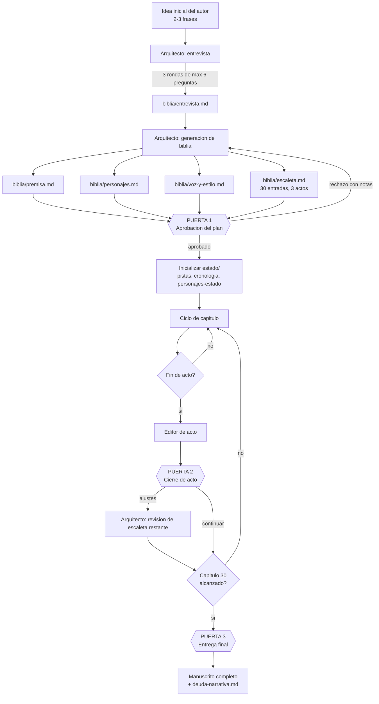
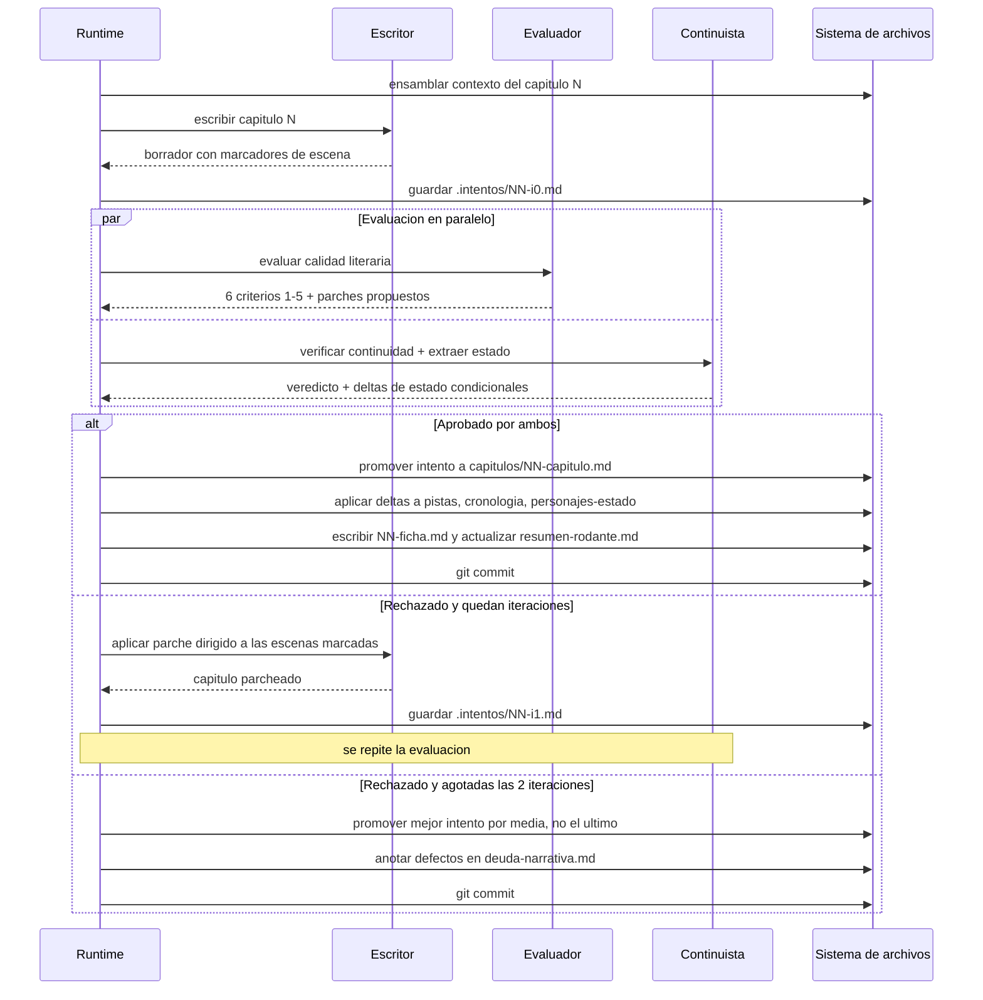
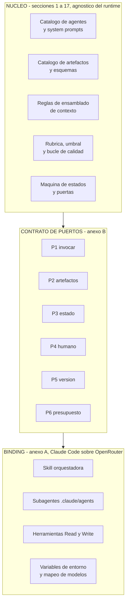
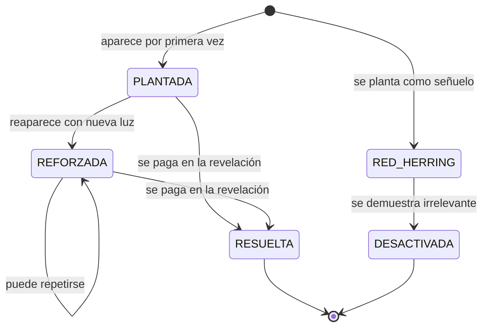
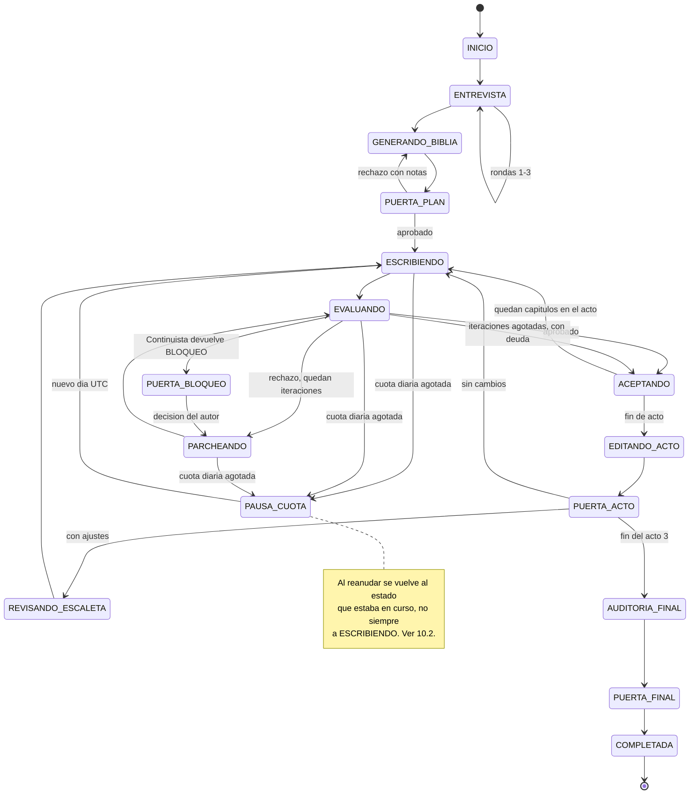

# Harness multiagente para novela de suspense — Especificación v1

> Documento de referencia único. Cualquier decisión de implementación no recogida aquí está
> marcada como `[PENDIENTE: ...]` en la sección 17.

---

## 1. Resumen ejecutivo

El sistema orquesta cinco agentes LLM —accesibles a través de la API de OpenRouter en su tier
gratuito— para escribir una novela de suspense psicológico de unas 60.000 palabras repartidas en 30
capítulos, a partir de una idea inicial de dos o tres frases aportada por una persona. El runtime
de orquestación de la v1 es **Claude Code**, con una skill que conduce el ciclo y un subagente por
rol, pero el diseño no depende de esa elección: las secciones 1 a 17 son agnósticas del runtime y
se comunican con él por los seis puertos del Anexo B, de modo que sustituirlo consiste en escribir
un anexo nuevo (§4.5). El sistema entrevista a esa persona para refinar la idea, construye una
biblia narrativa y una escaleta capítulo a capítulo, y después escribe los capítulos en orden;
cada capítulo pasa por un evaluador de calidad literaria y por un continuista que lo contrasta
contra un registro acumulativo de hechos, pistas, cronología y estado de los personajes. Solo se
acepta un capítulo cuando supera un umbral numérico; si tras dos reescrituras no lo supera, se
acepta el mejor intento y sus defectos quedan anotados en un registro de deuda narrativa. La
persona interviene únicamente en tres puertas de aprobación: tras el plan, al cierre de cada acto
y al terminar la novela.

**Produce**: el manuscrito (`novela/capitulos/NN-capitulo.md`, 30 archivos), la biblia narrativa
(premisa, personajes, voz y estilo, escaleta), los artefactos de estado que lo sostienen (resumen
rodante, ledger de pistas, cronología, estado de personajes, deuda narrativa), una ficha por
capítulo escrito, y un archivo de estado de ejecución (`novela/estado.json`) que permite reanudar
el proceso en cualquier punto.

---

## 2. Alcance y no-alcance

### En el alcance de la v1

- Novela en **español**, 30 capítulos, objetivo de 2.000 palabras por capítulo (tolerancia ±15%).
- Subgénero: **thriller psicológico doméstico**.
- Punto de vista: **tercera persona limitada**, alternando entre 2 y 3 focalizadores; tiempo
  verbal **pasado**.
- Orquestación: **Claude Code**, con una skill orquestadora en la sesión principal y un subagente
  por rol. La inferencia **no** usa modelos de Anthropic: Claude Code se apunta a OpenRouter
  mediante `ANTHROPIC_BASE_URL`, y OpenRouter atiende el formato Messages a través de su capa de
  compatibilidad. Sin proxy local. Configuración completa en el **Anexo A**.
- **La primera entrega es una POC**, no la novela: 3 capítulos de unas 60 palabras que ejercitan
  toda la máquina en minutos en lugar de en días (§15.1). No es un modo aparte ni código aparte: es
  un perfil de `config.json` (§6.0). La novela completa se lanza cuando la POC pasa dos veces
  seguidas.
- **Todos los parámetros del sistema viven en `novela/config.json`**, no en el código ni en este
  documento: número de capítulos, longitud, umbrales, máximo de reescrituras, cuota, temperaturas.
  El documento explica los números; el archivo los fija (§6.0).
- **El runtime está aislado.** Las secciones 1 a 17 no dependen de él: se comunican con él a través
  de los seis puertos del **Anexo B**. Cambiar de runtime significa escribir un anexo nuevo, no
  reescribir la especificación.
- Ejecución interrumpible y reanudable, diseñada para operar bajo un tope de **50 peticiones
  diarias**.
- Control de versiones con git: un commit por capítulo aceptado.

### Explícitamente fuera del alcance de la v1

| Excluido | Motivo |
|---|---|
| Agente **Lector-cebo** (lee un acto sin conocer el plan y reporta dónde decae la tensión) | Alto valor para validar el misterio, pero consume cuota que la v1 no tiene. Candidato número 1 para la v2. |
| Agente **Editor de estilo final** (pasada de pulido sobre el manuscrito completo) | Ídem. |
| Generación **escena a escena** como modo por defecto | Triplica el consumo de cuota. Queda implementada solo como mecanismo de recuperación ante truncamiento (§12). |
| Interfaz gráfica | El sistema se opera desde Claude Code. |
| Pasarela local de traducción Messages↔OpenAI | No hace falta: OpenRouter ya atiende el formato Messages. Solo entra en juego como plan de contingencia (§2, riesgo abierto). |
| Bindings de runtime distintos del de Claude Code | El Anexo B define el contrato para escribirlos; la v1 implementa uno solo. |
| Exportación a EPUB / maquetación | El entregable es Markdown. |
| Multi-idioma, traducción | La novela se escribe directamente en español. |
| Reescritura de capítulos ya aceptados a raíz de decisiones posteriores | La v1 solo escribe hacia delante. Las inconsistencias detectadas a posteriori se registran en `deuda-narrativa.md` para revisión humana. |

### Limitación asumida sobre privacidad

Los endpoints `:free` de OpenRouter requieren que la cuenta tenga activados los permisos de
entrenamiento sobre los inputs y, según el proveedor, de publicación de prompts. **El texto de la
novela, la biblia y la idea original serán material de entrenamiento de terceros.** Es una
consecuencia inherente al stack elegido, no un defecto del diseño. Si esto deja de ser aceptable,
la única mitigación es migrar a variantes de pago de los mismos modelos, lo que no requiere
cambios de arquitectura: solo editar los identificadores de modelo en la configuración.

### Riesgo abierto del stack elegido

OpenRouter documenta que su integración nativa con Claude Code está garantizada **solo con los
modelos Anthropic de primera parte**, que son de pago. Los modelos `:free` de otros proveedores
atraviesan la misma capa de compatibilidad, pero sin garantía de que respeten el formato Messages
ni el uso nativo de herramientas, y con ventanas de contexto menores. Dicho de forma directa: **la
combinación "Claude Code + OpenRouter + modelos gratuitos" no está soportada oficialmente y puede
no funcionar.**

Esto no invalida el diseño, precisamente porque el runtime está aislado (Anexo B), pero obliga a
una prueba de humo **antes** de empezar la fase F1: ver §17, `[PENDIENTE: viabilidad del stack]`.
Si los modelos `:free` no funcionan por esta vía, las salidas son, de menor a mayor coste de
cambio:

1. Usar modelos Anthropic de pago a través de OpenRouter. Funciona, cuesta dinero, y el resto del
   documento no cambia ni una línea.
2. Intercalar una pasarela local de traducción Messages↔OpenAI delante de OpenRouter, que sí
   permite modelos `:free` arbitrarios a cambio de mantener un componente más.
3. Cambiar el binding de runtime (Anexo B.2) y salir de Claude Code.

---

## 3. Glosario

| Término | Definición operativa en este proyecto |
|---|---|
| **Biblia** | Conjunto de artefactos que definen la novela antes de escribirla: premisa, personajes, voz y estilo, escaleta. Se genera una vez y solo el Arquitecto puede modificarla. |
| **Escaleta** | Archivo único con **una entrada por capítulo**: qué ocurre, quién focaliza, qué pistas se plantan o resuelven, dónde empieza y dónde acaba. No confundir con el resumen de la historia. |
| **Acto** | Agrupación de capítulos. Acto 1 = capítulos 1-8, Acto 2 = 9-22, Acto 3 = 23-30. Es una **etiqueta sobre la escaleta**, no un archivo aparte. |
| **Focalizador** | Personaje desde cuya conciencia se narra un capítulo. Cada capítulo tiene exactamente uno. |
| **Beat** | Unidad mínima de acontecimiento dentro de un capítulo. Cada entrada de escaleta tiene entre 3 y 5. |
| **Pista** | Elemento de información que el lector puede usar para anticipar la resolución. Tiene ciclo de vida propio (§8). |
| **Red herring** | Pista deliberadamente engañosa. Debe ser *desactivada* explícitamente antes del final, no simplemente olvidada. |
| **Ficha de capítulo** | Resumen estructurado de 120 palabras más metadatos, generado por el Continuista **después** de escribir el capítulo. Es la memoria de lo ocurrido, frente a la escaleta que es la memoria de lo planeado. |
| **Resumen rodante** | Archivo que condensa todo lo escrito hasta la fecha con granularidad decreciente hacia el pasado. |
| **Deuda narrativa** | Registro de defectos conocidos y aceptados: capítulos que agotaron las iteraciones sin superar el umbral. |
| **Parche dirigido** | Corrección que reescribe solo las escenas señaladas por el Evaluador, dejando intacto el resto del capítulo. |
| **Puerta** | Punto en que la ejecución se detiene y espera aprobación humana explícita. |
| **Gobernador de cuota** | Componente del runtime que contabiliza las peticiones diarias, impide superar el tope y pausa la ejecución de forma limpia al alcanzarlo. |
| **Cadena de respaldo** | Lista ordenada de identificadores de modelo por rol. Si el primero falla o desaparece, se pasa al siguiente. |
| **Núcleo** | Las secciones 1-17 de este documento: agentes, artefactos, rúbrica, máquina de estados y reglas de contexto. No depende del runtime. |
| **Binding de runtime** | Anexo que ata el núcleo a una tecnología de ejecución concreta. La v1 tiene uno: Claude Code (Anexo A). |
| **Puerto** | Una de las seis capacidades que el núcleo exige a cualquier runtime (Anexo B). El núcleo no sabe cómo se implementan. |
| **Subagente** | Agente de Claude Code definido en `.claude/agents/<nombre>.md`. Se invoca desde la sesión principal, corre en su propio contexto aislado y devuelve texto. |
| **Skill orquestadora** | Skill de Claude Code que conduce el ciclo de un capítulo desde la sesión principal. Es el único componente que lanza subagentes, porque un subagente no puede lanzar otro. |
| **Llamada lógica** | Una invocación conceptual de un agente ("escribe el capítulo 14"). Unidad de razonamiento del núcleo. |
| **Petición** | Una petición HTTP real contra OpenRouter. Unidad de cuota. **Una llamada lógica cuesta varias peticiones** en Claude Code; ver §13. |

---

## 4. Arquitectura general

### 4.1 Flujo completo



### 4.2 Ciclo de un capítulo



### 4.3 Explicación

El sistema tiene **dos fases muy distintas**. La fase de planificación es conversacional, cara en
atención humana y barata en cuota (unas 12 llamadas lógicas). La fase de escritura es autónoma,
barata en atención humana y cara en cuota (unas 150 llamadas lógicas, que en Claude Code se
traducen en bastantes más peticiones reales: §13). El diseño concentra deliberadamente la
intervención humana en la primera, porque un error en la escaleta cuesta 30 capítulos y un error
en un capítulo cuesta un capítulo.

La pieza que hace viable el conjunto es el **estado acumulativo** (`novela/estado/`). El Escritor
nunca recibe la novela entera: recibe una vista ensamblada y acotada de ella, construida por el
runtime a partir de esos archivos según las reglas de §7. El Continuista es el único agente que
escribe en `novela/estado/`, y lo hace después de que un capítulo sea aceptado. Esta separación
—un agente que escribe ficción y otro que mantiene los hechos— es lo que impide la deriva de
coherencia en el tramo largo de la novela.

### 4.4 Correspondencia con el diagrama original

| Diagrama original | En esta especificación |
|---|---|
| Agente Inicio | **Arquitecto** (§5.1), con la entrevista como subproceso propio |
| `.md con respuestas` | `biblia/entrevista.md` |
| `Desarrollo de personajes` | `biblia/personajes.md` |
| `Resumen de la historia completa` | `biblia/premisa.md` |
| `Introducción, nudo y desenlace` (1 artefacto) y `Desarrollo Introducción / nudo / desenlace` (3 artefactos) | **Resuelto**: un único `biblia/escaleta.md` con 30 entradas agrupadas bajo tres encabezados de acto. La división en tres deja de ser una decisión de archivos y pasa a ser una agrupación dentro de uno solo. |
| Agente Escritor | **Escritor** (§5.2) |
| Agente Evaluador con "arregla esto" | **Evaluador** (§5.3) con rúbrica numérica + **Continuista** (§5.4), separados |
| *(no existía)* | **Editor de acto** (§5.5), `estado/` completo, `estado.json`, `notas-del-autor.md` |

### 4.5 Separación núcleo / binding de runtime

El runtime de orquestación ya ha cambiado una vez y puede volver a cambiar. Para que ese cambio
cueste un anexo y no una reescritura, el sistema está partido en dos capas con una frontera
explícita.



El núcleo **nunca** nombra a Claude Code, ni a OpenRouter, ni a un modelo concreto. Cuando necesita
algo del mundo exterior, lo pide por un puerto. Las tres consecuencias prácticas:

1. **Los system prompts de §5 son portables tal cual.** Son texto; no dependen de quién los envíe.
2. **Los esquemas de artefactos de §6 son portables tal cual.** Son archivos en disco.
3. **Lo único que hay que reescribir al cambiar de runtime es el Anexo A.** El Anexo B define qué
   tiene que cumplir el sustituto.

Las dos cosas que sí cambian con el runtime, y que por eso están fuera del núcleo, son **la
asignación de modelo concreto a cada rol** (§5 habla de clases de modelo, no de identificadores) y
**la contabilidad de peticiones** (§13, que tiene una tabla por binding).

---

## 5. Catálogo de agentes

Convenciones comunes a los cinco: `temperature` indicada por agente; `max_tokens` indicada por
agente; todos reciben su system prompt en el mensaje `system` y el contexto ensamblado en un único
mensaje `user`.

**Ninguno tiene acceso a herramientas ni a internet**: el runtime lee y escribe todos los archivos
(puertos P2 y P3 del Anexo B); los agentes solo reciben texto y devuelven texto. Esta decisión ya
era deliberada en el diseño anterior, porque elimina una clase entera de fallos y porque el soporte
de *function calling* de los modelos `:free` es irregular. Con Claude Code como runtime pasa además
a ser **la palanca principal de control de cuota**: un subagente sin herramientas resuelve su tarea
en un solo turno y, por tanto, en una sola petición; un subagente con `Read` y `Write` gasta entre
tres y seis. Con un tope de 50 peticiones al día, esa diferencia decide si la novela tarda ocho
días o veinticinco. Ver §13 y Anexo A.3.

**Sobre el modelo**: cada agente declara una *clase* de modelo (alta capacidad, equilibrada o
rápida), nunca un identificador concreto. La correspondencia entre clase e identificador vive en el
binding, porque es lo único de §5 que cambia al cambiar de runtime. Ver Anexo A.4.

### 5.1 Arquitecto

- **Responsabilidad única**: convertir una idea vaga en un plan ejecutable, y mantener ese plan
  cuando la realidad de lo escrito se desvía de él.
- **Entradas**: idea inicial; respuestas del autor; en revisiones de acto, el resumen rodante, el
  ledger de pistas y `notas-del-autor.md`.
- **Salidas**: `biblia/entrevista.md`, `biblia/premisa.md`, `biblia/personajes.md`,
  `biblia/voz-y-estilo.md`, `biblia/escaleta.md`.
- **Clase de modelo**: **alta capacidad**. La calidad de la escaleta determina la de los 30
  capítulos, así que es el rol donde menos conviene ahorrar.
- **Herramientas**: ninguna.
- **Parámetros**: `temperature` 0.8 en entrevista y premisa, 0.4 en escaleta; `max_tokens` 8000.
- **Condición de parada**: ha emitido los cinco artefactos con el esquema de §6 y ha superado la
  Puerta 1. En revisiones de acto, cuando emite la escaleta revisada de los capítulos restantes.

```text
Eres el Arquitecto de una novela de suspense psicológico doméstico en español. Tu trabajo es
convertir una idea vaga en un plan que otro agente pueda ejecutar capítulo a capítulo sin
volver a consultarte.

PARÁMETROS FIJOS DE LA OBRA (no los cuestiones ni los cambies):
- 30 capítulos, objetivo de 2.000 palabras por capítulo.
- Estructura en tres actos: Acto 1 = capítulos 1-8; Acto 2 = capítulos 9-22; Acto 3 = 23-30.
- Tercera persona limitada, tiempo pasado, alternando entre 2 y 3 focalizadores.
- Subgénero: thriller psicológico doméstico. El motor es la sospecha entre personas que se
  conocen, no el procedimiento policial ni la acción.
- Idioma: español de España. Nunca escribas en otro idioma.

PRINCIPIOS QUE RIGEN TU PLAN:
1. Toda revelación del desenlace debe poder rastrearse hasta al menos dos pistas plantadas
   antes. Una revelación sin pistas previas es un fallo de diseño, no una sorpresa.
2. Todo red herring que plantes debe tener un capítulo asignado en el que se desactiva.
3. Cada capítulo debe terminar con una pregunta abierta, una amenaza o un descubrimiento que
   obligue a seguir leyendo. Ningún capítulo cierra en reposo, salvo el 30.
4. El Acto 2 es donde fracasan estas novelas. Cada capítulo del Acto 2 debe alterar el
   equilibrio de información entre personajes: alguien aprende algo, alguien miente sobre
   algo, o alguien pierde una certeza. Un capítulo del Acto 2 que solo desarrolla ambiente
   está mal planificado.
5. Prefiere pocos personajes bien usados. Máximo 8 personajes con nombre.

TAREA ACTUAL: se te indicará en el mensaje del usuario cuál de estas produces:
[ENTREVISTA], [PREMISA], [PERSONAJES], [VOZ], [ESCALETA] o [REVISION_ESCALETA].

REGLAS DE SALIDA:
- Devuelve EXCLUSIVAMENTE el contenido Markdown del artefacto pedido, empezando por su
  encabezado de nivel 1. Sin preámbulos, sin explicaciones, sin comentarios sobre tu proceso,
  sin bloques de código envolventes.
- Respeta literalmente el esquema de encabezados y campos que se te proporciona en el mensaje
  del usuario. No añadas, quites ni renombres campos.
- En [ENTREVISTA]: formula como máximo 6 preguntas por ronda. Cada pregunta debe ofrecer entre
  2 y 4 opciones cerradas y marcar una como recomendada con una línea de justificación. No
  hagas preguntas abiertas. No preguntes nada que puedas decidir tú de forma razonable.
- En [ESCALETA]: emite las 30 entradas. Ninguna entrada puede quedar vacía o marcada como
  "por determinar". Si te falta información, decídela tú y sigue.
- En [REVISION_ESCALETA]: reescribe únicamente las entradas de los capítulos aún no escritos y
  añade al final una sección "## Cambios" con una línea por cambio y su motivo.
```

### 5.2 Escritor

- **Responsabilidad única**: producir la prosa de un capítulo que cumpla su entrada de escaleta, y
  aplicar parches dirigidos cuando se le señalen defectos localizados.
- **Entradas**: el contexto ensamblado según §7.
- **Salidas**: `capitulos/NN-capitulo.md` con marcadores de escena.
- **Clase de modelo**: **alta capacidad**, priorizando prosa en español. **Debe resolverse a un
  identificador distinto del de Evaluador y Continuista** (§5 preámbulo y Anexo A.4).
- **Herramientas**: ninguna.
- **Parámetros**: `temperature` 0.85 en borrador, 0.6 en parche; `max_tokens` 6000.
- **Condición de parada**: ha emitido el capítulo completo terminado en `<!-- FIN -->`.

```text
Eres el Escritor de una novela de suspense psicológico doméstico en español. Escribes un
capítulo por vez. No planificas la novela: la escaleta ya está decidida y tu trabajo es
ejecutarla con la mejor prosa posible.

RESTRICCIONES INNEGOCIABLES:
- Idioma: español de España. Si detectas que estás escribiendo en otro idioma, corrígete de
  inmediato.
- Tercera persona limitada, tiempo pasado. El focalizador del capítulo se te indica en el
  contexto. NUNCA narres pensamientos, percepciones o motivaciones internas de ningún otro
  personaje: solo lo que el focalizador puede observar o inferir.
- Extensión objetivo: 2.000 palabras, con margen entre 1.700 y 2.300.
- Cumple TODOS los beats de la entrada de escaleta del capítulo. No añadas acontecimientos de
  trama que no estén en ella; sí puedes añadir gesto, detalle sensorial y diálogo.
- Las pistas que la escaleta marca como "plantar" o "reforzar" deben aparecer en el texto, pero
  nunca subrayadas ni señaladas al lector. Una pista bien plantada parece un detalle
  irrelevante la primera vez que se lee.
- No resuelvas ni menciones como resueltas pistas que la escaleta no te asigne.
- Respeta la guía de voz y estilo. El pasaje ancla que se te da es la referencia de registro:
  tu prosa debe poder confundirse con él.

REGLAS DE OFICIO:
- Empieza dentro de la escena, no antes de ella. Nada de preámbulos de ambientación.
- Prioriza escena sobre resumen. Si un acontecimiento importa, se dramatiza; si no importa, se
  despacha en una frase.
- El diálogo hace trabajo doble: avanza la trama y revela lo que un personaje oculta.
- Evita explicar la emoción. Muéstrala en conducta y en detalle físico concreto.
- Prohibido: "no pudo evitar", "un escalofrío recorrió su espalda", "el corazón le dio un
  vuelco", "sintió que algo no encajaba", y cualquier fórmula equivalente.
- Termina el capítulo en gancho: una pregunta abierta, una amenaza nueva o un descubrimiento.

FORMATO DE SALIDA (obligatorio y literal):
# Capítulo N — <título breve>

<!-- ESCENA 1 -->
<texto>

<!-- ESCENA 2 -->
<texto>

<!-- FIN -->

- Entre 2 y 4 escenas por capítulo. Los marcadores son obligatorios: el sistema los usa para
  aplicar correcciones puntuales.
- No escribas nada fuera de esa estructura: ni notas, ni resúmenes, ni comentarios.

MODO PARCHE: si el mensaje del usuario contiene un bloque "PARCHES SOLICITADOS", reescribe
ÚNICAMENTE las escenas indicadas y devuelve el capítulo completo con la misma estructura, con
las escenas no señaladas copiadas literalmente sin un solo cambio.
```

### 5.3 Evaluador

- **Responsabilidad única**: puntuar la calidad literaria del capítulo contra una rúbrica fija y
  localizar los defectos por escena. **No juzga hechos ni continuidad**: de eso se ocupa el
  Continuista.
- **Entradas**: el capítulo, su entrada de escaleta, `voz-y-estilo.md`, la ficha del capítulo
  anterior.
- **Salidas**: un objeto JSON con la estructura de §9.
- **Clase de modelo**: **equilibrada**, priorizando seguimiento de instrucciones de formato sobre
  capacidad literaria. Distinto del Escritor.
- **Herramientas**: ninguna.
- **Parámetros**: `temperature` 0.2; `max_tokens` 2000.
- **Condición de parada**: ha emitido un JSON válido con los seis criterios.

```text
Eres el Evaluador de calidad literaria de una novela de suspense psicológico doméstico en
español. Evalúas UN capítulo. No reescribes el capítulo: lo puntúas y señalas qué escena
concreta hay que tocar y cómo.

NO evalúas continuidad factual con capítulos anteriores: de eso se ocupa otro agente. Si
detectas una contradicción, anótala en "observaciones" pero no la puntúes.

RÚBRICA (puntúa cada criterio de 1 a 5, enteros):
- tension: ¿genera y sostiene inquietud? ¿cierra en gancho? [BLOQUEANTE]
- escaleta: ¿ocurren todos los beats previstos? ¿se plantan o refuerzan las pistas asignadas,
  y ninguna otra? [BLOQUEANTE]
- voz: ¿se ajusta a la guía de voz y estilo? ¿tercera persona limitada y tiempo pasado, sin
  fugas al interior de otros personajes?
- caracterizacion: ¿las decisiones de cada personaje se siguen de su motivación conocida?
- ritmo: ¿proporción adecuada de escena frente a resumen? ¿diálogo funcional? ¿sin relleno?
- prosa: ¿precisión léxica, ausencia de clichés y muletillas, variedad sintáctica?

ESCALA: 1 = inaceptable · 2 = deficiente · 3 = suficiente pero mejorable · 4 = bueno,
publicable · 5 = excelente. Sé exigente: un capítulo correcto y sin más es un 3, no un 4. No
concedas 5 salvo que el criterio esté resuelto de forma notable.

PARA CADA criterio con puntuación menor que 4, emite al menos un parche. Un parche identifica
la escena, describe el problema en una frase y da una instrucción de corrección accionable.
No propongas parches para criterios con 4 o 5.

Máximo 4 parches en total. Si hay más problemas, prioriza los de los criterios bloqueantes.

FORMATO DE SALIDA: exclusivamente un objeto JSON válido, sin texto antes ni después, sin
bloque de código envolvente:

{
  "capitulo": <entero>,
  "puntuaciones": {
    "tension": <1-5>, "escaleta": <1-5>, "voz": <1-5>,
    "caracterizacion": <1-5>, "ritmo": <1-5>, "prosa": <1-5>
  },
  "media": <decimal con un decimal>,
  "veredicto": "APROBADO" | "CORREGIR",
  "parches": [
    {"escena": <entero>, "criterio": "<nombre del criterio>",
     "problema": "<una frase>", "correccion": "<instrucción accionable>"}
  ],
  "observaciones": "<máximo 2 frases, o cadena vacía>"
}

REGLA DE VEREDICTO: "APROBADO" solo si media >= 4.0 Y tension >= 4 Y escaleta >= 4. En
cualquier otro caso, "CORREGIR". Calcula tú la media y aplica tú la regla; no delegues.
```

### 5.4 Continuista

- **Responsabilidad única**: verificar que el capítulo no contradice nada de lo ya establecido y,
  si pasa, extraer las actualizaciones de estado. **Las dos cosas en una sola llamada**, porque la
  cuota diaria no da para separarlas.
- **Entradas**: el capítulo, el resumen rodante, el ledger de pistas filtrado, la cronología, el
  estado de personajes, la entrada de escaleta.
- **Salidas**: un objeto JSON con veredicto y, condicionalmente, los deltas de estado.
- **Clase de modelo**: **equilibrada**, la misma que el Evaluador; nunca la del Escritor.
- **Herramientas**: ninguna.
- **Parámetros**: `temperature` 0.1; `max_tokens` 3000.
- **Condición de parada**: JSON válido emitido.

```text
Eres el Continuista de una novela de suspense psicológico doméstico en español. Tu trabajo
tiene dos partes y las haces en una sola respuesta.

PARTE 1 — VERIFICACIÓN. Contrasta el capítulo que se te da contra el estado establecido:
resumen rodante, ledger de pistas, cronología y estado de personajes. Busca exclusivamente
contradicciones objetivas y verificables:
- Hechos incompatibles con lo ya narrado (objetos, lugares, heridas, posesiones, parentescos,
  rasgos físicos, nombres).
- Errores de cronología: sucesos imposibles en el tiempo transcurrido, días de la semana
  incoherentes, personajes en dos sitios a la vez.
- Errores de conocimiento: un personaje usa información que aún no puede tener, o ignora algo
  que ya sabía.
- Errores de pistas: se resuelve o se menciona como conocida una pista cuyo estado no lo
  permite, o se planta una pista que ya estaba plantada como si fuera nueva.
- Personajes que reaparecen contradiciendo su estado registrado (ubicación, vivo/muerto,
  relación con otros).

No opines sobre calidad literaria, estilo, ritmo ni verosimilitud. Eso es de otro agente. Un
suceso improbable pero no contradictorio NO es un error tuyo.

Veredicto:
- "OK" si no hay ninguna contradicción.
- "CORREGIR" si hay contradicciones que el Escritor puede arreglar tocando el capítulo.
- "BLOQUEO" solo si la contradicción exige cambiar capítulos ya aceptados o la escaleta.

PARTE 2 — EXTRACCIÓN. Si y solo si el veredicto es "OK", emite además los deltas de estado.
Si el veredicto no es "OK", devuelve "deltas": null.

Reglas de extracción:
- La ficha resume lo que OCURRE en el capítulo, no lo que estaba planeado. Exactamente 120
  palabras, en pasado, sin adjetivación valorativa.
- En "pistas": una entrada por cada pista tocada, con su nuevo estado. Estados válidos:
  PLANTADA, REFORZADA, RESUELTA, RED_HERRING, DESACTIVADA. Si el capítulo introduce una pista
  que no estaba en el ledger, créala con un id nuevo con el prefijo "P-" y anótalo.
- En "cronologia": los sucesos fechables del capítulo, con día de ficción relativo al día 0
  (inicio de la novela).
- En "personajes": solo los personajes cuyo estado CAMBIA. Para cada uno, únicamente los campos
  modificados.

FORMATO DE SALIDA: exclusivamente un objeto JSON válido, sin texto antes ni después:

{
  "capitulo": <entero>,
  "veredicto": "OK" | "CORREGIR" | "BLOQUEO",
  "contradicciones": [
    {"escena": <entero>, "tipo": "hecho|cronologia|conocimiento|pista|personaje",
     "descripcion": "<una frase>", "evidencia": "<dónde se estableció lo contrario>",
     "correccion": "<instrucción accionable>"}
  ],
  "deltas": {
    "ficha": {"titulo": "<...>", "focalizador": "<...>", "dia_ficcion": <entero>,
              "resumen_120": "<...>", "personajes_presentes": ["<...>"],
              "gancho_final": "<una frase>"},
    "pistas": [{"id": "<P-NN>", "nuevo_estado": "<...>", "nota": "<...>"}],
    "cronologia": [{"dia_ficcion": <entero>, "suceso": "<...>"}],
    "personajes": [{"nombre": "<...>", "cambios": {"<campo>": "<valor>"}}]
  } | null
}
```

### 5.5 Editor de acto

- **Responsabilidad única**: al cerrar un acto, detectar problemas que solo son visibles a escala
  de acto —repeticiones entre capítulos, curva de tensión plana, transiciones bruscas, muletillas
  recurrentes— y emitir un informe de ajustes.
- **Entradas**: las fichas de los capítulos del acto, el ledger de pistas, la escaleta del acto.
  **No recibe el texto íntegro**: no cabría en cuota ni en contexto.
- **Salidas**: informe en Markdown que alimenta la Puerta 2 y, si procede, la revisión de escaleta.
- **Clase de modelo**: **alta capacidad**, la misma que el Arquitecto.
- **Herramientas**: ninguna.
- **Parámetros**: `temperature` 0.5; `max_tokens` 3000.
- **Condición de parada**: informe emitido.

```text
Eres el Editor de acto de una novela de suspense psicológico doméstico en español. Acabas de
recibir las fichas de todos los capítulos de un acto, el ledger de pistas y la escaleta de ese
acto. No tienes el texto completo y no lo necesitas: tu trabajo es a escala de acto, no de
frase.

DIAGNOSTICA, en este orden de prioridad:
1. Pistas: ¿alguna quedó plantada y sin tocar durante más de 6 capítulos? ¿algún red herring
   sigue vivo sin capítulo de desactivación asignado? ¿alguna pista se resolvió sin haber sido
   plantada?
2. Curva de tensión: usando los ganchos finales de cada ficha, ¿hay tramos de 3 o más
   capítulos consecutivos con el mismo tipo de gancho o con ganchos de intensidad decreciente?
3. Repetición estructural: ¿capítulos que hacen el mismo movimiento narrativo (mismo tipo de
   descubrimiento, misma confrontación, misma escena de sospecha)?
4. Reparto de focalizadores: ¿está equilibrado? ¿algún focalizador desaparece demasiado tiempo?
5. Ritmo temporal: ¿la cronología avanza de forma coherente? ¿hay saltos sin justificar o
   estancamientos?

Para cada problema, propón una corrección CONCRETA sobre capítulos AÚN NO ESCRITOS. Nunca
propongas reescribir capítulos ya aceptados: en esta versión del sistema no se puede.

FORMATO DE SALIDA (Markdown, sin preámbulo):

# Informe de cierre del Acto <N>

## Estado de las pistas
<tabla: id | estado | último capítulo tocado | riesgo>

## Problemas detectados
<lista numerada: problema, gravedad ALTA/MEDIA/BAJA, corrección propuesta y en qué capítulo
futuro aplicarla>

## Recomendación
<una de estas tres, literal, más una frase de justificación:>
CONTINUAR SIN CAMBIOS
CONTINUAR CON AJUSTES DE ESCALETA
REQUIERE DECISIÓN DEL AUTOR
```

---

## 6. Catálogo de artefactos

Árbol completo. Todas las rutas son relativas a la raíz del repositorio.

```
novela/
├── config.json
├── estado.json
├── notas-del-autor.md
├── biblia/
│   ├── entrevista.md
│   ├── premisa.md
│   ├── personajes.md
│   ├── voz-y-estilo.md
│   └── escaleta.md
├── estado/
│   ├── resumen-rodante.md
│   ├── pistas.md
│   ├── cronologia.md
│   ├── personajes-estado.md
│   └── deuda-narrativa.md
├── capitulos/
│   ├── 01-capitulo.md
│   ├── 01-ficha.md
│   └── ...
└── informes/
    └── acto-1.md
```

### 6.0 `config.json`

Creado a mano antes de la primera ejecución · Escribe: **la persona** · Lee: el runtime, en cada
invocación · **Mutable, pero solo entre capítulos.** Es el único archivo de `novela/` que un humano
escribe y el sistema únicamente lee.

**Regla que gobierna todo este documento**: cualquier constante numérica que aparezca en las
secciones 1 a 17 —30 capítulos, 2.000 palabras, umbral 4,0, 2 reescrituras, 16k tokens— es el valor
por defecto del perfil `completo` en este archivo. **El documento explica los números; `config.json`
los fija.** Si los dos discrepan, manda el archivo, y el documento tiene una errata.

Estructura: una sección `base` con todos los valores, y un objeto `perfiles` donde cada perfil
declara **solo lo que cambia**. El perfil activo se fusiona **en profundidad** sobre `base`. Esto es
lo que permite que la POC (§15.1) no sea otro código, sino otro perfil.

```json
{
  "version": 1,
  "perfil_activo": "poc",
  "base": {
    "obra":        { "idioma", "subgenero", "punto_de_vista", "tiempo_verbal",
                     "focalizadores_max", "personajes_max" },
    "capitulos":   { "total", "palabras_objetivo", "tolerancia_palabras",
                     "escenas_min", "escenas_max" },
    "actos":       [ { "numero", "desde", "hasta" } ],
    "entrevista":  { "rondas", "preguntas_por_ronda_max",
                     "opciones_por_pregunta_min", "opciones_por_pregunta_max" },
    "evaluacion":  { "escala_max", "umbral_media", "umbral_criterio_bloqueante",
                     "criterios_bloqueantes", "max_reescrituras",
                     "max_parches_por_iteracion", "al_agotar_iteraciones",
                     "seleccion_al_agotar" },
    "continuidad": { "auditoria_antes_de_capitulo", "max_capitulos_pista_sin_tocar",
                     "reglas_bloqueantes": { ...cinco banderas de §8.2 } },
    "contexto":    { "presupuesto_tokens_max", "tokens_por_palabra",
                     "capitulos_texto_integro", "capitulos_ficha_completa",
                     "palabras_ficha", "palabras_resumen_acto",
                     "dias_cronologia_visibles", "orden_de_recorte" },
    "puertas":     { "plan", "cierre_de_acto", "final", "bloqueo_continuidad" },
    "agentes":     { "<rol>": { "clase_modelo", "temperatura", "max_tokens",
                                "herramientas" } },
    "ejecucion":   { "capitulos_por_invocacion", "commit_por_capitulo",
                     "cuota": { "limite_diario", "limite_por_minuto",
                                "parar_si_no_cabe_un_capitulo" },
                     "reintentos": { "max", "backoff_base_segundos",
                                     "backoff_max_segundos" },
                     "truncamiento": { "max_reintentos",
                                       "reduccion_objetivo_palabras",
                                       "marcador_fin_obligatorio" },
                     "json_malformado": { "max_reintentos" },
                     "deriva_idioma":   { "max_reintentos" } },
    "rutas":       { "raiz", "biblia", "estado", "capitulos", "intentos",
                     "informes", "archivo_estado", "notas_autor" }
  },
  "perfiles": { "poc": { ...solo lo que cambia }, "completo": {} }
}
```

Correspondencia de los grupos con el resto del documento: `obra` y `capitulos` con §2 · `actos` con
§3 · `entrevista` con §5.1 · `evaluacion` con §9 · `continuidad` con §8 · `contexto` con §7 ·
`puertas` con §11 · `agentes` con §5 · `ejecucion` con §12 · `rutas` con este §6.

**Lo que deliberadamente NO está aquí**: los identificadores de modelo. Viven en variables de
entorno (Anexo A.4) porque son propiedad del binding, no del núcleo, y congelarlos aquí rompería la
portabilidad de §4.5. `config.json` declara *clases* de modelo; el binding las resuelve.

**Mutabilidad**: se puede editar entre capítulos y la ejecución lo recoge en la siguiente
invocación. Editarlo a mitad del bucle de un capítulo no está soportado y produce comportamiento
indefinido. Cambiar `capitulos.total` o `actos` con la novela empezada invalida la escaleta ya
aprobada: exige volver a pasar por la Puerta 1.

**Ejemplo real** (el perfil `poc`, que es el que viene activo):

```json
"poc": {
  "capitulos": { "total": 3, "palabras_objetivo": 60, "tolerancia_palabras": 0.5,
                 "escenas_min": 2, "escenas_max": 2 },
  "actos": [ { "numero": 1, "desde": 1, "hasta": 1 },
             { "numero": 2, "desde": 2, "hasta": 2 },
             { "numero": 3, "desde": 3, "hasta": 3 } ],
  "entrevista":  { "rondas": 1 },
  "evaluacion":  { "umbral_media": 3.0, "umbral_criterio_bloqueante": 3 },
  "continuidad": { "auditoria_antes_de_capitulo": 3, "max_capitulos_pista_sin_tocar": 2 },
  "contexto":    { "capitulos_texto_integro": 1, "capitulos_ficha_completa": 1 }
}
```

### 6.1 `biblia/entrevista.md`

Creado al terminar las 3 rondas de entrevista · Escribe: runtime (a partir del Arquitecto y del
autor) · Lee: Arquitecto · **Inmutable** tras la Puerta 1.

```markdown
# Entrevista de partida

## Idea original
<literal, tal como la dio el autor>

## Ronda 1
### P1. <pregunta>
- (A) <opción>
- (B) <opción>
**Respuesta:** <A|B|texto libre>
...

## Decisiones no consultadas
<lista de decisiones que el Arquitecto tomó por su cuenta y por qué>
```

### 6.2 `biblia/premisa.md`

Creado en la fase de planificación · Escribe: Arquitecto · Lee: Escritor, Evaluador, Editor de
acto · **Inmutable** tras la Puerta 1. Objetivo: ≤ 600 palabras.

```markdown
# Premisa

## Logline
<una frase de máximo 40 palabras>

## Situación de partida
<un párrafo>

## El secreto
<qué es lo que realmente ha ocurrido, la verdad que el lector desconoce>

## La revelación
<qué se revela, en qué capítulo y a quién>

## Pistas que sostienen la revelación
<mínimo 3, con el capítulo en que se plantan>

## Apuesta temática
<una frase: de qué va el libro por debajo de la trama>

## Final
<un párrafo: cómo termina, incluido el destino de cada personaje principal>
```

**Ejemplo (fragmento):**
```markdown
## Logline
Cuando su marido reaparece tras nueve días desaparecido sin recordar nada, una restauradora de
muebles empieza a sospechar que el hombre que ha vuelto no es exactamente el que se fue.
```

### 6.3 `biblia/personajes.md`

Escribe: Arquitecto · Lee: Escritor, Evaluador, Continuista · **Inmutable** tras la Puerta 1
(el *estado* cambiante vive en `estado/personajes-estado.md`). Máximo 8 personajes.

```markdown
# Personajes

## <Nombre completo>
- **Rol:** protagonista | antagonista | secundario | figurante recurrente
- **Focalizador:** sí | no
- **Edad y ocupación:**
- **Deseo consciente:** <qué quiere y cree que quiere>
- **Necesidad inconsciente:** <qué necesita de verdad>
- **Miente sobre:** <qué oculta, a quién y por qué>
- **Rasgo físico distintivo:** <uno solo, memorable, reutilizable>
- **Tic verbal o de conducta:** <uno solo>
- **Arco:** <de X a Y en una frase>
- **Relaciones:** <nombre: naturaleza del vínculo>
```

### 6.4 `biblia/voz-y-estilo.md`

Escribe: Arquitecto · Lee: Escritor (en **todas** sus llamadas), Evaluador · **Inmutable**.
Es el ancla contra la deriva de voz, especialmente cuando la cadena de respaldo cambia de modelo a
mitad de novela.

```markdown
# Voz y estilo

## Parámetros fijos
- Persona y tiempo: tercera limitada, pasado
- Focalizadores: <lista>
- Longitud media de frase: <corta | media | variada con dominio de la corta>
- Densidad de diálogo: <alta | media | baja>

## Reglas positivas
<5 a 8 reglas accionables>

## Reglas negativas
<5 a 8 prohibiciones explícitas, con ejemplos de lo que no se debe escribir>

## Pasaje ancla
<200 palabras de prosa de ejemplo, escritas por el Arquitecto, que fijan el registro>
```

### 6.5 `biblia/escaleta.md`

Escribe: Arquitecto · Lee: Escritor (solo su entrada ±1), Evaluador, Editor de acto ·
**Mutable, pero solo por el Arquitecto y solo en capítulos no escritos**; cada revisión añade una
línea a `## Cambios`. **Este archivo resuelve la ambigüedad del diagrama original**: no hay tres
archivos de introducción, nudo y desenlace; hay uno con tres encabezados de acto.

```markdown
# Escaleta

## Acto 1 — Capítulos 1-8

### Capítulo 1
- **Título provisional:**
- **Focalizador:**
- **Día de ficción:** <entero, 0 = inicio>
- **Localización:**
- **Beats:**
  1. <...>
  2. <...>
  3. <...>
- **Pistas a plantar:** <ids, o "ninguna">
- **Pistas a reforzar:** <ids, o "ninguna">
- **Pistas a resolver:** <ids, o "ninguna">
- **Pistas relevantes en contexto:** <ids que el Escritor debe tener presentes sin tocarlas>
- **Empieza en:** <situación concreta>
- **Termina en:** <el gancho>

## Acto 2 — Capítulos 9-22
...

## Acto 3 — Capítulos 23-30
...

## Cambios
- <fecha> · cap. <N> · <qué cambió> · <motivo>
```

El campo **Pistas relevantes en contexto** es la clave de §7: permite que el runtime inyecte cinco
pistas en lugar de cincuenta.

### 6.6 `estado/pistas.md`

Creado tras la Puerta 1 a partir de la escaleta · Escribe: runtime, aplicando los deltas del
Continuista · Lee: Escritor (filtrado), Continuista, Editor de acto · **Mutable**.

```markdown
# Ledger de pistas

| id | descripción | tipo | estado | plantada en | tocada por última vez en | resolución prevista |
|----|-------------|------|--------|-------------|--------------------------|---------------------|
| P-01 | El reloj de pulsera aparece con la correa cambiada | real | PLANTADA | 2 | 2 | 27 |
| P-02 | La vecina asegura haber oído el coche a las tres | red_herring | RED_HERRING | 4 | 9 | 18 (desactivación) |

## Notas
- <id> · cap. <N> · <nota del Continuista>
```

### 6.7 `estado/cronologia.md`

Escribe: runtime desde los deltas del Continuista · Lee: Escritor (ventana reciente), Continuista ·
**Mutable**.

```markdown
# Cronología

| día de ficción | fecha relativa | capítulo(s) | sucesos |
|----------------|----------------|-------------|---------|
| 0 | martes | 1 | <...> |
| 1 | miércoles | 2, 3 | <...> |
```

### 6.8 `estado/personajes-estado.md`

Escribe: runtime desde los deltas del Continuista · Lee: Escritor (solo los presentes),
Continuista · **Mutable**.

```markdown
# Estado de personajes

## <Nombre>
- **Última aparición:** capítulo <N>
- **Ubicación:** <...>
- **Situación física:** <heridas, cansancio, embarazo, lo que aplique>
- **Sabe que:** <lista de hechos que este personaje conoce, con el capítulo en que lo supo>
- **Cree erróneamente que:** <lista>
- **Oculta a:** <personaje: qué le oculta>
- **Objetos en su posesión:** <lista>
```

El bloque **Sabe que / Cree erróneamente que** es lo que modela la asimetría de información, que
en este género *es* la trama.

### 6.9 `estado/resumen-rodante.md`

Escribe: runtime tras cada capítulo aceptado · Lee: Escritor, Continuista, Arquitecto ·
**Mutable, regenerado por reglas deterministas, sin llamar al LLM.**

```markdown
# Resumen rodante

## Actos cerrados
### Acto 1 (capítulos 1-8)
<un párrafo de 150 palabras, generado por concatenación y compresión de las líneas de acto>

## Capítulos 1..N-6 — una línea cada uno
- **Cap. 3:** <primera frase del resumen_120 de la ficha>

## Capítulos N-5..N-3 — ficha completa
<resumen_120 de cada uno>

## Capítulos N-2 y N-1
<se inyecta el texto íntegro; no se copian aquí>
```

### 6.10 `estado/deuda-narrativa.md`

Escribe: runtime cuando un capítulo agota iteraciones · Lee: humano en las puertas, Editor de acto
· **Solo se añade, nunca se borra.**

```markdown
# Deuda narrativa

## Capítulo <N> — aceptado con <media> tras 2 iteraciones
- **Criterio fallido:** <nombre> (<puntuación>)
- **Problema:** <del último informe del Evaluador>
- **Corrección propuesta y no aplicada:** <...>
- **Riesgo si no se corrige:** <...>
```

### 6.11 `capitulos/NN-capitulo.md` y `capitulos/NN-ficha.md`

El capítulo sigue el formato de salida del Escritor (§5.2), con marcadores `<!-- ESCENA n -->`.
Es **inmutable** una vez aceptado y commiteado. La ficha:

```markdown
# Ficha del capítulo <N>
- **Título:** <...>
- **Focalizador:** <...>
- **Día de ficción:** <entero>
- **Personajes presentes:** <lista>
- **Gancho final:** <una frase>
- **Palabras:** <entero>
- **Iteraciones consumidas:** <0|1|2>
- **Media del Evaluador:** <decimal>

## Resumen (120 palabras)
<...>
```

### 6.12 `notas-del-autor.md`

Escribe: **la persona, cuando quiera** · Lee: Escritor al inicio de cada capítulo, Arquitecto en
las revisiones de acto. Canal de control asíncrono que no bloquea la ejecución.

```markdown
# Notas del autor

## Vigentes
- [cap. >= 12] <instrucción>

## Aplicadas
- [cap. 7] <instrucción> — aplicada en cap. 7
```

El runtime mueve una nota de `Vigentes` a `Aplicadas` cuando el capítulo al que aplica se acepta.

---

## 7. Gestión de contexto

### 7.1 Qué ve cada agente

| Bloque | Arquitecto | Escritor | Evaluador | Continuista | Editor de acto |
|---|:--:|:--:|:--:|:--:|:--:|
| System prompt | ✓ | ✓ | ✓ | ✓ | ✓ |
| `premisa.md` | ✓ | ✓ | — | — | ✓ |
| `personajes.md` | ✓ | solo presentes | — | solo presentes | — |
| `voz-y-estilo.md` | ✓ | ✓ | ✓ | — | — |
| `escaleta.md` | ✓ (completa) | entrada N ±1 | entrada N | entrada N | acto completo |
| Texto íntegro caps. N-1, N-2 | — | ✓ | — | ✓ (solo N) | — |
| Fichas caps. N-6..N-3 | — | ✓ | — | ✓ | acto completo |
| Resumen rodante | ✓ | ✓ | — | ✓ | — |
| `pistas.md` | ✓ (completo) | filtrado | — | filtrado | ✓ (completo) |
| `cronologia.md` | — | últimos 7 días | — | ✓ | ✓ |
| `personajes-estado.md` | — | solo presentes | — | ✓ | — |
| `notas-del-autor.md` | ✓ | ✓ | — | — | ✓ |
| Capítulo a juzgar | — | — | ✓ | ✓ | — |

**Permanente** para el Escritor: system prompt, premisa, voz y estilo. **Rotatorio**: todo lo
demás, ensamblado de nuevo en cada capítulo por el runtime.

### 7.2 Estrategia de granularidad decreciente

La memoria de lo escrito se degrada con la distancia, no se trunca:

| Distancia al capítulo actual | Qué recibe el Escritor |
|---|---|
| N-1, N-2 | Texto íntegro |
| N-3 a N-6 | Ficha completa (120 palabras) |
| N-7 y anteriores del acto en curso | Primera frase de la ficha |
| Actos ya cerrados | Un párrafo de 150 palabras por acto |

### 7.3 Filtrado de pistas

El Escritor **nunca** recibe el ledger completo. Recibe únicamente las pistas cuyos ids aparecen
en los campos *Pistas a plantar / reforzar / resolver / relevantes en contexto* de su entrada de
escaleta. En la práctica son entre 4 y 8 de un total que llegará a rondar las 40. Esto es lo que
impide que el contexto crezca con el número de capítulo. El Continuista, en cambio, recibe todas
las pistas con estado distinto de RESUELTA y DESACTIVADA, porque su trabajo es precisamente
detectar lo que el Escritor no tenía delante.

### 7.4 Presupuesto de tokens en el capítulo 30

Estimación con 1,5 tokens por palabra en español. Este es el caso peor de toda la ejecución.

| Bloque | Tokens |
|---|--:|
| System prompt del Escritor | 900 |
| `premisa.md` | 400 |
| `personajes.md`, filtrado a 4 presentes | 900 |
| `voz-y-estilo.md` incluido el pasaje ancla | 700 |
| Escaleta, entradas 29-31 | 600 |
| Pistas filtradas (6 de ~40) | 400 |
| Estado de los 4 personajes presentes | 500 |
| Cronología, últimos 7 días de ficción | 300 |
| Capítulos 28 y 29 íntegros | 6.000 |
| Fichas de los capítulos 24-27 | 720 |
| Una línea por capítulo 23 en adelante del acto | 200 |
| Resúmenes de los actos 1 y 2 | 450 |
| `notas-del-autor.md` | 200 |
| **Entrada total** | **~12.270** |
| Salida (2.000 palabras) | ~3.000 |
| **Ventana necesaria** | **~15.300** |

**Objetivo de diseño verificable: la entrada del Escritor nunca supera los 16.000 tokens, ni en el
capítulo 3 ni en el 30.** La consecuencia práctica es que el sistema funciona sobre cualquier
modelo `:free` con ventana de 32k, no solo sobre los de ventana grande —lo que importa mucho,
porque el catálogo de modelos gratuitos rota y no se puede depender de ninguno en concreto. El
runtime debe comprobar este presupuesto antes de cada llamada y, si se excede, recortar por este
orden: cronología → fichas antiguas → texto íntegro de N-2.

### 7.5 El contexto del orquestador

Con un runtime de tipo agente conversacional —Claude Code hoy, quizá otro mañana— hay una segunda
ventana que vigilar además de la del Escritor: **la de la propia sesión orquestadora**, que acumula
todo lo que pasa por ella. Como los subagentes no tienen herramientas, el orquestador lee los
archivos y les pasa el contenido, de modo que el texto de los capítulos atraviesa su contexto dos
veces: al enviarlo y al recibirlo.

Por capítulo eso son unos 12k tokens de entrada ensamblada más unos 3k de borrador, más los
informes del Evaluador y el Continuista: del orden de **35k tokens de sesión por capítulo**,
contando el ciclo completo con un parche. Es perfectamente asumible para un capítulo y claramente
inasumible para treinta seguidos.

De ahí la regla de operación: **una invocación de la skill orquestadora escribe exactamente un
capítulo y termina**. El estado vive en `estado.json`, no en la conversación, así que la sesión
siguiente arranca limpia. Esta regla es la que hace que §7.4 siga siendo suficiente: sin ella, el
presupuesto de 16k del Escritor estaría bien calculado y aun así el sistema reventaría por el otro
lado.

---

## 8. Continuidad y suspense

### 8.1 Ciclo de vida de una pista



### 8.2 Reglas bloqueantes

Se comprueban en cada capítulo y el incumplimiento produce veredicto `CORREGIR` del Continuista.
Las tres primeras son verificables **en código, sin llamar al LLM**, y deben implementarse así:

1. **No se resuelve lo que no se plantó.** Una pista no puede pasar a `RESUELTA` si no ha estado
   antes en `PLANTADA` o `REFORZADA` en un capítulo estrictamente anterior.
2. **Toda pista real tiene resolución prevista.** Ninguna pista de tipo `real` puede existir sin
   un capítulo de resolución asignado en el ledger.
3. **Todo red herring se desactiva.** Ninguna pista `red_herring` puede llegar al capítulo 30 sin
   pasar a `DESACTIVADA`.
4. **Nadie usa información que no tiene.** Un personaje no puede actuar sobre un hecho que no
   figura en su bloque *Sabe que* de `personajes-estado.md`. Esta requiere juicio del LLM.
5. **La cronología avanza.** El día de ficción de un capítulo nunca puede ser menor que el del
   anterior, salvo que la escaleta lo marque explícitamente como analepsis.

### 8.3 Momentos de verificación

| Momento | Qué se verifica | Quién |
|---|---|---|
| Tras cada borrador, antes de aceptar | Reglas 1-5 sobre el capítulo | Continuista + comprobaciones en código |
| Tras aceptar cada capítulo | Se aplican los deltas y se recalcula el resumen rodante | Runtime, determinista |
| Al cerrar cada acto | Pistas huérfanas, red herrings vivos, curva de tensión | Editor de acto |
| Antes de escribir el capítulo 30 | **Auditoría final**: ninguna pista `real` sin resolver, ningún `red_herring` sin desactivar | Runtime, en código; si falla, se detiene y abre una puerta |

La auditoría previa al capítulo 30 es el único punto en que el sistema puede negarse a continuar
por motivos de trama. Es intencionado: una novela de suspense que termina con cabos sueltos ha
fallado, aunque cada capítulo por separado esté bien escrito.

---

## 9. Bucle de evaluación

### 9.1 Rúbrica

Seis criterios, escala entera 1-5, definidos en el system prompt del Evaluador (§5.3). Dos son
**bloqueantes**: `tension` y `escaleta`.

| Puntuación | Significado |
|---|---|
| 1 | Inaceptable |
| 2 | Deficiente |
| 3 | Suficiente pero mejorable |
| 4 | Bueno, publicable |
| 5 | Excelente |

### 9.2 Condición de aceptación

Un capítulo se acepta si y solo si se cumplen **las dos** condiciones:

```
Evaluador:  media >= 4.0  AND  tension >= 4  AND  escaleta >= 4
Continuista: veredicto == "OK"
```

### 9.3 Máximo de iteraciones

**2 reescrituras.** El razonamiento: dos pases capturan casi toda la mejora real; a partir del
tercero los modelos gratuitos tienden a oscilar entre versiones sin converger, y cada pase cuesta
tres llamadas (parche + reevaluación + reverificación) de un presupuesto de 50 diarias.

### 9.4 Comportamiento al agotarlas

1. Se selecciona **el intento con mayor media**, no necesariamente el último; una reescritura
   puede empeorar el capítulo.
2. Ese intento se acepta y se commitea.
3. Se añade una entrada a `estado/deuda-narrativa.md` con el criterio fallido, el problema y la
   corrección propuesta y no aplicada.
4. La ejecución **continúa**. El sistema no se detiene nunca por calidad insuficiente de un
   capítulo aislado.

La excepción: si el Continuista devuelve `BLOQUEO` —contradicción que exigiría tocar capítulos ya
aceptados—, no se aplica esta regla. Se persiste el estado, se abre una puerta humana ad hoc y la
ejecución se detiene.

### 9.5 Aplicación del parche

El Escritor recibe el capítulo íntegro más un bloque `PARCHES SOLICITADOS` que fusiona los parches
del Evaluador y las contradicciones del Continuista, agrupados por escena. Devuelve el capítulo
completo con las escenas no señaladas copiadas literalmente. El runtime **verifica** que las
escenas no señaladas no han cambiado, comparando hashes; si el modelo las ha alterado, restaura
las originales y conserva solo las escenas parcheadas. Esta comprobación es barata y evita la
regresión silenciosa, que es el fallo característico de los bucles de reescritura.

---

## 10. Máquina de estados de la ejecución



### 10.1 `novela/estado.json`

Se reescribe de forma atómica (escritura a archivo temporal + `os.replace`) **después de cada
transición de estado y después de cada llamada al LLM**, sin excepción.

```json
{
  "version": 1,
  "estado": "EVALUANDO",
  "capitulo_actual": 14,
  "acto_actual": 2,
  "iteracion": 1,
  "intentos": [
    {"iteracion": 0, "media": 3.7, "ruta": "novela/.intentos/14-i0.md"}
  ],
  "capitulos_aceptados": [1, 2, 3, 4, 5, 6, 7, 8, 9, 10, 11, 12, 13],
  "puerta_pendiente": null,
  "cuota": {
    "fecha_utc": "2026-09-15",
    "llamadas_hoy": 37,
    "limite_diario": 50,
    "limite_por_minuto": 20,
    "ultima_llamada_ts": 1789200000.0
  },
  "clases_modelo": {
    "arquitecto":  "alta",
    "escritor":    "alta",
    "evaluador":   "equilibrada",
    "continuista": "equilibrada",
    "editor_acto": "alta"
  },
  "binding": "claude-code",
  "ultimo_error": null
}
```

El estado guarda **clases** de modelo, no identificadores: la correspondencia concreta la resuelve
el binding (Anexo A.4) y por tanto no debe quedar congelada en el estado de una ejecución que
podría reanudarse bajo otro runtime. El campo `binding` se registra solo para diagnóstico, al
reanudar una ejecución iniciada con otro. Ver `[PENDIENTE: modelos]` en §17.

### 10.2 Reanudación

Reanudar es leer `estado.json` y saltar al manejador del estado indicado. No hay ninguna otra
fuente de verdad: los archivos del disco son consecuencia del estado, nunca al revés. **Esto es lo
que hace que el runtime sea intercambiable incluso a mitad de novela**: una ejecución empezada bajo
un binding puede continuar bajo otro, porque todo lo que la define está en disco y nada en la
memoria del orquestador. En el binding de Claude Code, reanudar es simplemente abrir una sesión
nueva e invocar la skill; no hay proceso que rearrancar. Reglas:

- Si `estado == "PAUSA_CUOTA"` y la fecha UTC actual es posterior a `cuota.fecha_utc`, se pone el
  contador a cero y se continúa automáticamente.
- Si el proceso murió a mitad de una llamada, se repite esa llamada. Las llamadas son idempotentes
  desde el punto de vista del estado: nada se aplica hasta que la respuesta se ha parseado con
  éxito.
- Los borradores intermedios viven en `novela/.intentos/` (ignorado por git) hasta que uno se
  acepta y se promueve a `novela/capitulos/`.
- Cada capítulo aceptado produce un commit `feat(novela): capitulo NN — <título>`. El historial de
  git es la segunda red de seguridad: permite volver a cualquier punto.

---

## 11. Puntos de control humano

Tres puertas síncronas más un canal asíncrono. Fuera de ellas, el sistema avanza solo.

### Puerta 1 — Aprobación del plan
**Cuándo**: tras generar los cuatro artefactos de la biblia. **Por qué aquí**: es el único momento
en que corregir cuesta una llamada en vez de treinta capítulos.

El sistema imprime la premisa, la lista de personajes con su mentira, el pasaje ancla y las 30
entradas de escaleta en forma resumida (título, focalizador, gancho), y pregunta literalmente:

> ¿Apruebas el plan? Responde con una de estas opciones:
> - `aprobar` — se inicializa el estado y comienza el capítulo 1.
> - `rehacer <artefacto> : <instrucción>` — se regenera solo ese artefacto.
> - `editar` — se pausa para que edites los archivos a mano; al reanudar se validan contra el esquema.

### Puerta 2 — Cierre de acto
**Cuándo**: tras el capítulo 8, el 22 y el 30. Se muestra el informe del Editor de acto y el
estado del ledger de pistas.

> Informe del Acto <N>. Recomendación del editor: <...>
> - `continuar` — se sigue con la escaleta tal como está.
> - `ajustar` — el Arquitecto revisa la escaleta de los capítulos restantes aplicando el informe.
> - `ajustar : <instrucción>` — ídem, más tu instrucción.
> - `parar` — se persiste el estado y se sale.

### Puerta 3 — Entrega final
**Cuándo**: tras el capítulo 30 y la auditoría de §8.3. Se muestra el resultado de la auditoría,
el contenido íntegro de `deuda-narrativa.md` y las estadísticas de la ejecución.

### Puerta de bloqueo (ad hoc)
Se abre solo cuando el Continuista devuelve `BLOQUEO`. Se muestra la contradicción y su evidencia:

> Contradicción irresoluble en el capítulo <N>: <...>
> - `forzar` — se acepta el capítulo y la contradicción se registra como deuda.
> - `reescribir : <instrucción>` — se devuelve al Escritor con tu instrucción.
> - `parar` — se persiste y se sale.

### Canal asíncrono
`novela/notas-del-autor.md` se lee al inicio de cada capítulo. Permite corregir el rumbo sin
detener la ejecución ni esperar a una puerta.

---

## 12. Fallos y degradación

| Modo de fallo | Detección | Respuesta |
|---|---|---|
| **429 por límite de 20 req/min** | Código HTTP 429 con cabecera de reintento | Backoff exponencial `2^n` segundos, n de 0 a 4. Tras 5 intentos, se pasa a `PAUSA_CUOTA`. |
| **Cuota diaria agotada (50/día)** | Contador interno del gobernador o 429 persistente | Transición a `PAUSA_CUOTA`, persistir estado, salir con código 0. Al relanzar en un día UTC nuevo, continúa sin intervención. |
| **Respuesta truncada** | `finish_reason == "length"` o ausencia del marcador `<!-- FIN -->` | Reintento pidiendo solo las escenas que faltan, con las ya generadas como contexto. Tras 2 fallos, se reduce el objetivo de palabras un 20% y se reintenta. Tras 3, se pasa al siguiente modelo de la cadena. |
| **Modelo retirado del catálogo** | HTTP 404 o error `model_not_found` | Avanzar en la cadena de respaldo, registrar el cambio en `estado.json` y en el log. Si se agota la cadena, `ERROR` y salida. |
| **JSON mal formado del Evaluador o el Continuista** | Fallo de `json.loads` tras extraer el primer objeto balanceado de la respuesta | Un reintento con el mensaje de error del parser añadido al prompt. Si vuelve a fallar: para el Evaluador, se trata como `CORREGIR` genérico y se anota en deuda; para el Continuista, se trata como `CORREGIR` con la respuesta cruda adjunta. Nunca se asume `OK`. |
| **Deriva de idioma** | Heurística sobre el borrador: proporción de palabras funcionales en español por debajo de un umbral | Reintento con recordatorio explícito de idioma. Tras 2 fallos, siguiente modelo de la cadena. |
| **El bucle no converge** | Se alcanzan 2 iteraciones sin aprobación | §9.4: se acepta el mejor intento y se registra la deuda. La ejecución continúa. |
| **Contradicción irresoluble** | `veredicto == "BLOQUEO"` | Puerta de bloqueo (§11). |
| **El parche altera escenas no señaladas** | Comparación de hashes por escena | Se restauran las escenas originales y se conservan solo las parcheadas. |
| **El Escritor no puede cumplir un beat** | Evaluador puntúa `escaleta` con 1 o 2 dos iteraciones seguidas | Se acepta con deuda y se marca el beat como incumplido; el Editor de acto lo recoge en su informe. |
| **Auditoría final falla** | Pistas sin resolver antes del capítulo 30 | La ejecución se detiene y se abre puerta. Nunca se escribe el capítulo 30 con cabos sueltos conocidos. |
| **Corte de red o proceso matado** | — | El estado ya estaba persistido antes de la llamada; se reanuda repitiendo la última llamada. |
| **La capa de compatibilidad rechaza un modelo `:free`** | Error de formato, herramientas no soportadas, o respuesta vacía nada más arrancar | Es el riesgo abierto de §2. No es recuperable en caliente: se detiene, se registra el modelo culpable y se aplica una de las tres salidas de §2. La prueba de humo de §14 F0 existe para descubrirlo antes de escribir una sola línea de novela. |
| **Un subagente devuelve prosa en vez de JSON** | Igual que "JSON mal formado", pero con causa distinta: el subagente ha "conversado" en lugar de responder | Mismo tratamiento. Como prevención, el system prompt exige JSON puro y el orquestador no muestra el resultado crudo al humano. |
| **Un subagente usa herramientas y consume varios turnos** | El binding registra más peticiones de las previstas para ese rol | Defecto de configuración, no de ejecución: el subagente se declara sin herramientas (Anexo A.3). Se detecta comparando peticiones reales contra el modelo de §13. |
| **La sesión orquestadora se queda sin contexto** | La sesión se compacta o avisa a mitad de capítulo | No debería ocurrir con un capítulo por invocación (§7.5). Si ocurre, es señal de que se está intentando encadenar capítulos en una sola sesión: hay que volver a un capítulo por invocación. El estado en disco garantiza que no se pierde nada. |
| **429 en mitad del bucle de un subagente** | El subagente falla a medias | El orquestador lo trata como llamada lógica fallida y la repite entera; las llamadas son idempotentes (§10.2). El coste es que la parte ya consumida de la cuota no se recupera. |

---

## 13. Coste y rendimiento

Esta sección tiene dos niveles. El primero, **llamadas lógicas**, es parte del núcleo y no cambia
si cambia el runtime. El segundo, **peticiones reales**, depende del binding y hay que rehacerlo
cada vez que el runtime cambie.

### 13.1 Supuestos declarados

- 30 capítulos, 2.000 palabras por capítulo, 1,5 tokens por palabra.
- Probabilidad de aprobación a la primera: **0,5**. Con una reescritura: **0,4**. Con dos: **0,1**.
  Son estimaciones de partida; deben recalibrarse tras el ensayo de 3 capítulos (§15).
- La verificación de continuidad y la extracción de estado van en **una sola llamada** (§5.4).
- El resumen rodante se regenera **sin llamar al LLM**.
- Cuota: 50 peticiones/día, 20/minuto. Coste monetario: **0 €** si los modelos `:free` resultan
  viables (§2, riesgo abierto).

### 13.2 Llamadas lógicas (agnóstico del runtime)

| Camino | Probabilidad | Llamadas | Desglose |
|---|--:|--:|---|
| Aprobado a la primera | 0,5 | 3 | escritor + evaluador + continuista |
| Una reescritura | 0,4 | 6 | 3 + parche + evaluador + continuista |
| Dos reescrituras | 0,1 | 9 | 3 + 2 × (parche + evaluador + continuista) |
| **Esperanza por capítulo** | | **4,8** | 0,5·3 + 0,4·6 + 0,1·9 |

| Fase | Llamadas lógicas |
|---|--:|
| Entrevista (3 rondas) | 3 |
| Premisa + personajes + voz | 3 |
| Escaleta (una por acto) | 3 |
| Reajustes tras la Puerta 1 | 3 |
| 30 capítulos × 4,8 | 144 |
| Editor de acto (3 actos, con margen) | 4 |
| Revisiones de escaleta en puertas de acto | 2 |
| **Total** | **~162** |

### 13.3 Peticiones reales en el binding de Claude Code

Aquí es donde el cambio de runtime duele, y conviene decirlo sin adornos: **en Claude Code una
llamada lógica no cuesta una petición.** La sesión orquestadora es a su vez un agente, y cada turno
suyo —decidir qué hacer, invocar un subagente, procesar lo que devuelve, escribir un archivo— es
una petición contra OpenRouter. Un subagente es una sesión propia con su propio bucle.

Factores de conversión, con subagentes **sin herramientas** (Anexo A.3):

| Concepto | Peticiones | Por qué |
|---|--:|---|
| Una llamada lógica a un subagente | 1 | Sin herramientas, resuelve en un turno |
| Turnos del orquestador por capítulo | 6 a 8 | Leer estado, ensamblar contexto, despachar tres subagentes, aplicar deltas, escribir ficha y resumen, commitear |
| **Ciclo de un capítulo aprobado a la primera** | **~10** | 3 subagentes + ~7 turnos de orquestación |
| **Ciclo con una reescritura** | **~15** | 6 subagentes + ~9 turnos |
| **Esperanza por capítulo** | **~12** | frente a 4,8 llamadas lógicas: **factor 2,5** |

| Fase | Peticiones reales |
|---|--:|
| Planificación completa (12 llamadas lógicas) | ~30 |
| 30 capítulos × 12 | ~360 |
| Editores de acto y revisiones de escaleta | ~20 |
| **Total** | **~410** |

### 13.4 Tiempo de reloj

**410 / 50 ≈ 9 días naturales**, frente a los 4 del diseño anterior. La novela no ha cambiado; ha
cambiado lo que cuesta ejecutarla. Las tres palancas para bajar esa cifra, en orden de eficacia:

1. **Subagentes sin herramientas** (ya asumido en el diseño). Darles `Read` y `Write` multiplicaría
   las peticiones por dos o por tres y llevaría la novela a más de veinte días. Es la decisión
   individual de mayor impacto de todo el binding.
2. **No encadenar capítulos en una sesión.** Además de proteger el contexto (§7.5), evita turnos de
   orquestación redundantes.
3. **Cargar 10 créditos en OpenRouter**, lo que sube el tope de 50 a 1.000 peticiones diarias y
   reduce el tiempo de reloj de nueve días a menos de uno. Es, con diferencia, la forma más barata
   de comprar velocidad en este sistema, y conviene tenerlo presente antes de optimizar nada más.

El límite de 20 peticiones por minuto sigue sin ser vinculante: lo que domina es la latencia de
generar capítulos largos.

### 13.5 Coste de la POC

El perfil `poc` (§6.0, §15.1) no abarata las peticiones, solo los tokens: un capítulo de 60 palabras
cuesta los mismos turnos de orquestación que uno de 2.000.

| Fase | Peticiones |
|---|--:|
| Planificación reducida (1 ronda de entrevista, 3 entradas de escaleta) | ~12 |
| 3 capítulos × ~12 | ~36 |
| 3 editores de acto y 3 puertas | ~10 |
| **Total por pasada de POC** | **~58** |

**Y aquí está el problema práctico**: con el tope de 50 peticiones diarias, **una sola pasada de POC
no cabe en un día**, y el criterio de salida de §15.1 exige dos pasadas seguidas. Es decir, entre
tres y cuatro días para validar la máquina, antes de escribir una línea de novela de verdad.

Una POC que solo se puede ejecutar cada dos días no es una POC: es un despliegue. El propósito de
iterar rápido se pierde por completo. Por eso, **si hay un solo momento en todo el proyecto en que
compensa cargar los 10 créditos de OpenRouter, es este**: sube el tope a 1.000 peticiones diarias y
convierte la POC en algo que se ejecuta varias veces por tarde. Es la diferencia entre depurar y
esperar.

**Consecuencia de diseño**: escribir la novela ocupa varios días de reloj por construcción, no por
ineficiencia. Por eso la persistencia y la reanudación (§10) son requisitos de la v1 y no una
mejora posterior. Con el binding actual esa afirmación es más cierta que antes, no menos.

---

## 14. Plan de implementación por fases

| Fase | Contenido | Criterio de "hecho" verificable |
|---|---|---|
| **F0 — Viabilidad del stack** | Apuntar Claude Code a OpenRouter (Anexo A.1) y probar los modelos `:free` candidatos. **Nada más empieza hasta que esta fase pasa.** | Una sesión de Claude Code enrutada a OpenRouter responde correctamente; `/status` confirma el enrutado. Un subagente de prueba sin herramientas devuelve JSON válido 10 veces de 10. El panel de OpenRouter registra las peticiones. Si falla, se aplica una de las tres salidas de §2 **antes** de seguir. |
| **F1 — Esqueleto** | Estructura de `.claude/agents/` y `.claude/skills/`, skill orquestadora mínima, `estado.json` atómico, gobernador de cuota, comandos de estado y reanudación. | Invocar la skill imprime el estado actual. Una invocación de prueba incrementa `llamadas_hoy` en `estado.json`. Cerrar Claude Code a mitad y abrir una sesión nueva reanuda desde el estado persistido. Un 429 simulado produce espera y reintento. |
| **F2 — Planificación** | Subagente Arquitecto, entrevista de 3 rondas, generación de los cuatro artefactos, validadores de esquema, Puerta 1. | Partiendo de una idea de 3 líneas se producen los cuatro artefactos, los cuatro pasan sus validadores, la escaleta tiene exactamente 30 entradas sin campos vacíos, y la ejecución se detiene en `PUERTA_PLAN`. |
| **F3 — Escritura** | Ensamblador de contexto (§7), subagente Escritor, detección de truncamiento, recuperación por escenas, commit por capítulo. | Se genera `01-capitulo.md` de 1.700-2.300 palabras, con marcadores de escena y `<!-- FIN -->`, en tercera persona y pasado. El ensamblador reporta un presupuesto de entrada inferior a 16k tokens. El ciclo consume ~10 peticiones, no ~25: si consume ~25, algún subagente está usando herramientas. |
| **F4 — Calidad** | Subagentes Evaluador y Continuista, aplicación de deltas, parche dirigido con verificación de hashes, deuda narrativa, reglas bloqueantes deterministas. | Inyectando a mano una contradicción en un capítulo (p. ej. cambiar el color de un objeto ya establecido), el Continuista la detecta y el parche la corrige en ≤ 2 iteraciones sin alterar las escenas no señaladas. Un capítulo deliberadamente malo agota iteraciones y aparece en `deuda-narrativa.md`. |
| **F5 — Actos y cierre** | Subagente Editor de acto, Puertas 2 y 3, revisión de escaleta, auditoría final, `notas-del-autor.md`. | **La POC de §15.1 pasa entera, dos veces seguidas.** Este es el hito que cierra la primera versión entregable: a partir de aquí la máquina está probada. |
| **F5b — Ensayo real** | Ninguna funcionalidad nueva: solo cambiar `perfil_activo` a `completo`. | El ensayo con capítulos reales de §15.2 pasa entero, y las probabilidades de §13.1 quedan recalibradas con datos observados. |
| **F6 — Cierre del contrato de puertos** | Verificar que ninguna lógica del núcleo ha sangrado al binding. | Cada una de las seis funciones del Anexo B tiene un único punto de implementación en el binding. Búsqueda de "Claude Code", "OpenRouter" y de cualquier identificador de modelo dentro de los artefactos del núcleo: cero resultados fuera de los anexos. |

---

## 15. Cómo probarlo

Hay **dos niveles de prueba y en este orden**. Primero la POC, que valida que la máquina funciona.
Después el ensayo con capítulos reales, que valida que lo que escribe se puede leer. Saltarse el
primero para ir al segundo es el error típico: se acaba depurando el ensamblador de contexto a base
de esperar diez minutos por capítulo.

### 15.1 POC — 3 capítulos de 4 líneas

Se ejecuta con `perfil_activo: "poc"` en `config.json` (§6.0). Tres capítulos de unas 60 palabras,
dos escenas cada uno, y **un acto por capítulo**, de modo que las tres puertas de acto se disparan
en tres capítulos en lugar de en treinta.

**Qué valida**: la máquina. Estado, puertas, reanudación, aplicación de deltas, actualización del
ledger, regeneración del resumen rodante, promoción de intentos, bucle de parches, contabilidad de
cuota, commits.

**Qué NO valida, y conviene tenerlo claro para no sacar conclusiones falsas**: la calidad
literaria. Con 60 palabras no hay ritmo, ni tensión, ni prosa que juzgar, y por eso el perfil baja
el umbral de 4,0 a 3,0. **Las notas del Evaluador en modo POC no son una señal de calidad**: su
único trabajo aquí es empujar la máquina por las dos ramas del bucle. Tampoco valida el presupuesto
de contexto de §7.4, que solo se tensa con capítulos de verdad.

Comprobaciones, todas verificables en minutos:

1. La escaleta tiene exactamente 3 entradas y ningún campo vacío. La ejecución se detiene en
   `PUERTA_PLAN` y no avanza hasta que respondes.
2. El capítulo 1 sale con 2 escenas, marcadores `<!-- ESCENA n -->` y `<!-- FIN -->`, entre 30 y 90
   palabras, en tercera persona y pasado.
3. El borrador aparece en `novela/.intentos/01-i0.md` y **no** en `novela/capitulos/`. Solo al
   aprobar se promueve.
4. Al aceptar, se crea `01-ficha.md`, se actualizan `pistas.md`, `cronologia.md` y
   `personajes-estado.md`, y se regenera `resumen-rodante.md`.
5. Hay un commit de git por capítulo aceptado, y `.intentos/` no aparece en el historial.
6. **Fuerza una segunda iteración**: sube temporalmente `umbral_media` a 5.0. Debe generarse
   `01-i1.md`, y las escenas no señaladas deben quedar idénticas byte a byte a las de `01-i0.md`.
7. **Fuerza el agotamiento**: con el umbral en 5.0, el capítulo debe aceptarse con el intento de
   mayor media y aparecer en `deuda-narrativa.md`.
8. Al terminar el capítulo 1 se dispara el Editor de acto y la ejecución se detiene en
   `PUERTA_ACTO`. Igual tras el 2 y el 3.
9. **Inyecta una contradicción** en el capítulo 3 a mano: cambia un objeto ya establecido en el 1.
   El Continuista debe detectarla y el parche corregirla.
10. **Deja un red herring sin desactivar**: la auditoría previa al capítulo 3 debe detener la
    ejecución en lugar de escribirlo.
11. **Cierra Claude Code a mitad del capítulo 2** y reanuda en sesión nueva: continúa sin duplicar
    trabajo y con el contador de cuota correcto.
12. En el capítulo 3, el contexto del Escritor incluye el 2 íntegro y el 1 como ficha, no los dos
    íntegros. Es lo que prueba que la ventana deslizante de §7.2 desliza de verdad.
13. **Cuenta las peticiones reales** en el panel de OpenRouter y compáralas con §13.5.

**Criterio de salida**: los trece puntos pasan **y** se ha ejecutado la POC entera al menos dos
veces seguidas sin tocar nada. Una POC que solo funciona la primera vez no ha validado nada.

### 15.2 Ensayo con 3 capítulos reales

Solo después de la POC. Se ejecuta con `perfil_activo: "completo"` y `capitulos.total` reducido
temporalmente a 3. Aquí ya se juzga el texto.

**Sobre el plan**
1. La escaleta tiene una entrada por capítulo, ningún campo vacío y ningún "por determinar".
2. Cada pista de tipo `real` de la premisa aparece en el ledger con capítulo de resolución
   asignado, y cada `red_herring` con capítulo de desactivación.

**Sobre el texto**
3. Los tres capítulos están en español, tercera persona limitada y pasado, y ninguno se fuga al
   interior de un personaje que no sea su focalizador.
4. Extensión dentro de 1.700-2.300 palabras, con marcadores de escena y `<!-- FIN -->`.
5. Los tres terminan en gancho. Lee solo los finales: si alguno cierra en reposo, falla.
6. Los tres beats de cada entrada de escaleta ocurren realmente en el texto.

**Sobre el estado**
7. Tras los tres capítulos, `pistas.md`, `cronologia.md` y `personajes-estado.md` reflejan lo
   escrito. Verificación manual comparando con el texto: es el punto más importante del ensayo,
   porque un extractor que alucina envenena los 27 capítulos restantes.
8. `resumen-rodante.md` tiene texto íntegro de los 2 últimos y ficha del anterior.

**Sobre el bucle**
9. Inyectar a mano una contradicción en el capítulo 3 y comprobar que el Continuista la detecta.
10. Forzar un capítulo malo (bajar `temperature` a 0 o mutilar el contexto) y comprobar que agota
    las 2 iteraciones, se acepta el mejor intento y aparece en `deuda-narrativa.md`.

**Sobre la operación**
11. Cerrar Claude Code a mitad del capítulo 2 y reanudar en una sesión nueva: debe continuar sin
    duplicar trabajo ni corromper el estado. Verificar además que el contador de cuota es correcto.
12. **Contar las peticiones reales de los 3 capítulos en el panel de OpenRouter** y compararlas con
    la previsión de §13.3 (~12 por capítulo). Una desviación al alza significa casi siempre que
    algún subagente está usando herramientas y gastando turnos. Es la comprobación que decide si la
    novela completa tarda nueve días o veinticinco, así que no es opcional.

**Recalibración**: anotar cuántos de los 3 capítulos aprobaron a la primera y ajustar las
probabilidades de §13. Si aprueba menos de 1 de cada 3, el problema está casi siempre en la
escaleta (beats vagos) o en el pasaje ancla, no en el Escritor.

---

## 16. Decisiones tomadas y alternativas descartadas

Las cuatro primeras fueron decididas por el autor. Las once restantes se aplicaron por defecto
tomando la opción recomendada, según su instrucción de resolver así lo no contestado.

| # | Decisión | Elegido | Descartado y por qué |
|---|---|---|---|
| 1 | Runtime | **Claude Code: skill orquestadora + un subagente por rol, con la inferencia enrutada a OpenRouter** · *requisito externo impuesto al autor* | Script Python sin framework: era la decisión anterior y sigue siendo técnicamente superior en consumo de cuota (factor 2,5, §13.3), pero no está disponible. Queda documentada como binding alternativo en el Anexo B.2 por si el requisito se levanta. LangGraph y n8n: descartados antes y sin cambios. |
| 1b | Aislamiento del runtime | **Núcleo agnóstico (§1-17) + anexo de binding (A) + contrato de puertos (B)** · *decisión del autor* | Escribir para Claude Code y añadir una nota de migración: más fácil de leer hoy, pero el runtime ya ha cambiado una vez en la vida de este documento y el próximo cambio obligaría a revisarlo entero. Documentar los dos bindings completos ya: el no usado envejece sin que nadie lo note. |
| 1c | Forma de la orquestación | **Skill orquestadora, un capítulo por invocación** · *decisión del autor* | Una skill que corre un acto entero: una deriva temprana se propaga muchos capítulos antes de verla, y además rompe el presupuesto de contexto de la sesión orquestadora (§7.5). Slash commands sueltos por fase: dejan el estado y las transiciones en manos del humano, que es justo lo que la máquina de estados existe para evitar. |
| 1e | Primera entrega | **POC de 3 capítulos de 4 líneas antes que la novela** · *decisión del autor* | Ir directo a capítulos reales: cada vuelta de depuración costaría minutos de generación y decenas de peticiones, y los fallos que se buscan —estado, deltas, promoción de intentos, puertas— no dependen de la longitud del texto. La POC los expone en minutos. |
| 1f | Parámetros del sistema | **Externalizados en `config.json` con perfiles fusionables** | Constantes en el código: obligaría a tocar la implementación para cambiar de POC a novela completa, que es justo lo que convierte una POC en un prototipo desechable. Un archivo por perfil: se desincronizan en cuanto cambia un valor común. |
| 1d | Herramientas de los subagentes | **Ninguna: el orquestador hace toda la E/S** | Darles `Read` y `Write`: dejaría la sesión orquestadora más ligera, pero multiplica por dos o tres las peticiones reales y lleva la novela de nueve días a más de veinte. Con la cuota como recurso escaso, la sesión orquestadora se protege limitando el trabajo a un capítulo por invocación, no repartiendo herramientas. |
| 2 | Cuota | **50 req/día** · *decisión del autor* | — Es un dato, no una preferencia. Condiciona todo el documento. |
| 3 | Extensión | **30 × 2.000 ≈ 60.000** · *decisión del autor* | 40 × 2.500: más deriva y ~270 llamadas. 15 × 2.500: no habría validado el problema del tramo largo. |
| 4 | Agentes | **5** · *decisión del autor* | 3 (diagrama original): el Escritor sería su propio continuista, el fallo raíz. 7: Lector-cebo y Editor de estilo final no caben en 50 req/día. |
| 5 | PDV y tiempo | 3ª limitada, 2-3 focalizadores, pasado | 1ª persona presente: más difícil ocultar información de forma legítima y más frágil ante la deriva de voz entre modelos. |
| 6 | Subgénero | Thriller psicológico doméstico | Procedimental policial: exige detalle técnico que los modelos gratuitos inventan. Conspiración/acción: depende de escala y coreografía, sus puntos débiles. |
| 7 | Escaleta | **Archivo único, 30 entradas, 3 encabezados de acto** | Tres archivos separados: era una de las dos lecturas del diagrama original; describe la forma de la historia pero no qué pasa en el capítulo 17, que es lo que el Escritor necesita. Un archivo por acto: fragmenta sin ganar nada, ya que el Escritor solo carga su entrada ±1. |
| 8 | Registro de estado | Ficha por capítulo + resumen rodante + pistas + cronología + estado de personajes | Un solo resumen acumulativo: crece sin estructura y pierde justo lo que hay que verificar. Releer capítulos anteriores: desborda contexto y cuota. |
| 9 | Evaluación | **Dos evaluadores**: calidad (subjetivo) y continuidad (objetivo) | Uno con rúbrica mixta: al mezclar "¿está bien escrito?" con "¿es verdad?", el modelo sacrifica sistemáticamente lo segundo. |
| 10 | Modelos | Modelo distinto para Escritor y para Evaluador/Continuista | Mismo modelo: tiende a validar su propio texto. En tier gratuito la diversidad no cuesta nada. |
| 11 | Rúbrica y umbral | 6 criterios × 1-5; media ≥ 4,0 con 2 bloqueantes ≥ 4; máx. 2 reescrituras | Umbral 4,5 y 4 iteraciones: los modelos gratuitos oscilan sin converger y el coste en cuota es prohibitivo. Veredicto binario: no permite elegir el mejor intento al agotar iteraciones. |
| 12 | Al agotar iteraciones | Aceptar el mejor intento + deuda narrativa + continuar | Parar y preguntar: convierte una ejecución autónoma de 4 días en una sesión interactiva. Bajar el umbral en silencio: pierdes el registro de qué salió mal. |
| 13 | Corrección | Parche dirigido por escena, con verificación de hashes | Reescritura completa: el doble de tokens y regresión sobre texto que ya estaba bien. Que corrija el Evaluador: mezcla los roles de juez y autor, y la voz deriva. |
| 14 | Control humano | 3 puertas + canal asíncrono | Capítulo a capítulo: 30 interrupciones, incompatible con "intervención humana mínima". Cero intervención: un error de escaleta se descubre en el capítulo 30. |
| 15 | Granularidad | Capítulo completo en una llamada; escenas solo como recuperación | Escena a escena siempre: triplica la cuota, que es el recurso escaso. Sin control de truncamiento: metería capítulos cortados en el corpus, que luego contaminan el contexto de todos los siguientes. |

### Añadidos que no estaban en el diagrama original

`estado/pistas.md`, `estado/cronologia.md`, `estado/personajes-estado.md`, `estado/deuda-narrativa.md`,
`biblia/voz-y-estilo.md`, `biblia/escaleta.md`, las fichas por capítulo, `estado.json`,
`notas-del-autor.md`, el gobernador de cuota, la cadena de respaldo de modelos y la auditoría
previa al capítulo 30. Todos están integrados en el flujo de §4, no anexados.

---

## 17. Preguntas abiertas pendientes

- **[PENDIENTE: viabilidad del stack]** — *bloqueante, resolver antes que nada.* Está por confirmar
  que Claude Code enrutado a OpenRouter funcione con modelos `:free` de terceros. OpenRouter
  garantiza su capa de compatibilidad solo con modelos Anthropic de primera parte (§2, riesgo
  abierto). La fase F0 de §14 existe exactamente para responder a esto, y ninguna otra fase debe
  empezar antes. Si la respuesta es que no, hay que elegir una de las tres salidas de §2, y esa
  elección es del autor, no del implementador.

- **[PENDIENTE: modelos]** Qué identificadores de modelo `:free` concretos se usan en cada rol.
  El catálogo gratuito de OpenRouter rota con frecuencia y no puede fijarse desde este documento.
  El implementador debe consultar el catálogo vigente y rellenar las variables de entorno del
  Anexo A.4. Nótese la restricción que impone el binding actual: Claude Code ofrece **tres ranuras
  de modelo** (las clases alta, equilibrada y rápida), no una por agente, de modo que los cinco
  roles se reparten entre tres identificadores como máximo. Criterios de selección: para el
  **Escritor**,
  calidad de prosa en español y ventana ≥ 32k; para **Evaluador** y **Continuista**, fiabilidad
  emitiendo JSON válido, que es más determinante que la capacidad literaria; para el
  **Arquitecto**, capacidad de razonamiento estructurado. Antes del primer lanzamiento debe
  comprobarse empíricamente que los candidatos de Evaluador y Continuista devuelven JSON parseable
  en 10 de 10 intentos.

- **[PENDIENTE: permisos de entrenamiento]** Confirmar que la cuenta de OpenRouter tiene activados
  los permisos que exigen los endpoints `:free`, y aceptar de forma consciente la implicación
  descrita en §2.

- **[PENDIENTE: título]** El título de la novela no está decidido. El Arquitecto puede proponerlo
  al generar la premisa, pero no está especificado como campo obligatorio.

- **[PENDIENTE: idea inicial]** La idea de partida de dos o tres frases todavía no se ha aportado.
  Es la única entrada humana obligatoria antes de la Puerta 1.

- **[PENDIENTE: destino del manuscrito]** No se ha indicado qué se hace con los 30 archivos al
  terminar. La v1 los deja en `novela/capitulos/`. Si se quiere un archivo único ensamblado o una
  exportación, es trabajo de v2 y hoy está fuera de alcance (§2).

---

# Anexo A — Binding de runtime: Claude Code sobre OpenRouter

Este anexo es **la única parte del documento que hay que reescribir si cambia el runtime**. Todo lo
anterior es independiente de él.

## A.1 Enrutado de Claude Code a OpenRouter

Claude Code habla el formato Messages de Anthropic. OpenRouter expone una capa de compatibilidad
con ese formato, de modo que **no hace falta ninguna pasarela local**: ni proxy, ni Docker, ni
puerto a la escucha. Basta con apuntar Claude Code al endpoint de OpenRouter.

```bash
export OPENROUTER_API_KEY="<tu clave de OpenRouter>"
export ANTHROPIC_BASE_URL="https://openrouter.ai/api"
export ANTHROPIC_AUTH_TOKEN="$OPENROUTER_API_KEY"
export ANTHROPIC_API_KEY=""
```

Tres detalles que son causa habitual de fallos silenciosos:

- `OPENROUTER_API_KEY` debe definirse **antes** que `ANTHROPIC_AUTH_TOKEN`, o la expansión queda
  vacía y la autenticación cae en un camino que no es el previsto.
- `ANTHROPIC_API_KEY` debe ser **cadena vacía, no estar sin definir**. Si queda sin definir, Claude
  Code puede autenticarse contra Anthropic y la ejecución funcionará sin usar OpenRouter en
  absoluto, que es justo lo contrario del requisito.
- Verificar con `/status` dentro de Claude Code que el enrutado apunta a OpenRouter, y contrastarlo
  con el panel de actividad de OpenRouter. Que una sesión responda no demuestra que esté enrutada.

Estas variables van en `.claude/settings.local.json` o en el perfil del shell.
**`.claude/settings.local.json` no debe subirse al repositorio**: contiene la clave.

## A.2 Estructura de archivos del binding

```
.claude/
├── settings.local.json          # variables de A.1 — NO se versiona
├── agents/
│   ├── arquitecto.md
│   ├── escritor.md
│   ├── evaluador.md
│   ├── continuista.md
│   └── editor-acto.md
└── skills/
    └── novela/
        └── SKILL.md             # skill orquestadora
```

Cada archivo de `agents/` contiene, como cuerpo, el **system prompt literal** del agente
correspondiente de §5, copiado sin modificar. El anexo no reescribe los prompts: los referencia.

## A.3 Definición de un subagente

Plantilla, con el Escritor como ejemplo. Los otros cuatro son idénticos en forma y cambian nombre,
descripción, clase de modelo y cuerpo.

```markdown
---
name: escritor
description: Escribe el borrador de un capítulo de la novela a partir del contexto ensamblado que
  se le entrega. Devuelve únicamente el texto del capítulo con marcadores de escena.
tools: []
model: opus
---

<aquí va, literal y completo, el system prompt de §5.2>
```

**`tools: []` es la línea más importante de todo el anexo.** Un subagente sin herramientas resuelve
su tarea en un solo turno y cuesta una petición; uno con `Read` y `Write` entra en un bucle de
herramientas y cuesta entre tres y seis. Con el tope de 50 peticiones diarias, esa diferencia
decide si la novela tarda nueve días o más de veinte (§13.3).

La contrapartida es que **el orquestador tiene que pasarle todo el contexto en el prompt**, ya que
el subagente no puede leer archivos. Eso es precisamente lo que el ensamblador de §7 hace, y es la
razón de que el presupuesto de 16k tokens de §7.4 sea un requisito y no una recomendación.

> `[PENDIENTE: sintaxis exacta]` Confirmar contra la versión instalada de Claude Code la forma
> exacta de declarar un subagente sin herramientas: si `tools: []` es la sintaxis válida o si hay
> que omitir el campo y restringir por otra vía. La intención de diseño —cero herramientas— no
> cambia; solo cómo se escribe. Verificable en un minuto durante la fase F0.

## A.4 Clases de modelo e identificadores

Claude Code no permite un identificador arbitrario por subagente: ofrece **tres ranuras**, que el
frontmatter de cada agente selecciona con `model: opus | sonnet | haiku`, más una ranura específica
para subagentes. Las ranuras se resuelven a identificadores de OpenRouter por variable de entorno.

```bash
export ANTHROPIC_DEFAULT_OPUS_MODEL="<id del modelo de alta capacidad>"
export ANTHROPIC_DEFAULT_SONNET_MODEL="<id del modelo equilibrado>"
export ANTHROPIC_DEFAULT_HAIKU_MODEL="<id del modelo rápido>"
export CLAUDE_CODE_SUBAGENT_MODEL="<id por defecto para subagentes>"
```

Correspondencia entre los roles del núcleo y las ranuras:

| Rol (§5) | Clase declarada | Ranura | Identificador |
|---|---|---|---|
| Arquitecto | alta capacidad | `opus` | `[PENDIENTE: modelos]` |
| Escritor | alta capacidad | `opus` | `[PENDIENTE: modelos]` |
| Evaluador | equilibrada | `sonnet` | `[PENDIENTE: modelos]` |
| Continuista | equilibrada | `sonnet` | `[PENDIENTE: modelos]` |
| Editor de acto | alta capacidad | `opus` | `[PENDIENTE: modelos]` |

El requisito de §5.2 —que Escritor y Evaluador no compartan modelo— se cumple porque caen en
ranuras distintas. El requisito no se cumpliría si alguien apuntase las tres ranuras al mismo
identificador, cosa que la configuración permite y que hay que evitar de forma explícita.

**Limitación heredada del binding**: Arquitecto, Escritor y Editor de acto comparten ranura y por
tanto identificador. El núcleo no lo exige ni lo prohíbe; es una consecuencia de que solo haya tres
ranuras. Si en el futuro importara separarlos, habría que cambiar de binding.

La cadena de respaldo de §12 se implementa reasignando la variable de entorno correspondiente y
reanudando: como el estado vive en disco y no guarda identificadores (§10.1), el cambio de modelo a
mitad de novela no requiere nada más.

## A.5 La skill orquestadora

Vive en `.claude/skills/novela/SKILL.md` y se invoca desde la sesión principal. Es el único
componente que lanza subagentes, porque **un subagente no puede lanzar otro**: el bucle tiene que
vivir en la sesión principal, y eso no es una preferencia de diseño sino una restricción del
runtime.

Cada invocación **escribe exactamente un capítulo y termina** (§7.5). El estado vive en
`novela/estado.json`, nunca en la conversación.

Cuerpo de la skill, en pseudocódigo. No es código a copiar: es el orden de operaciones que la skill
debe describir en prosa para el agente que la ejecute.

```
1.  estado = leer(novela/estado.json)
2.  si estado.estado es una PUERTA_*: presentar la puerta al humano (§11) y terminar.
3.  si cuota_agotada(estado): informar y terminar. No iniciar un capítulo que no cabe.
4.  N = estado.capitulo_actual
5.  contexto = ensamblar_contexto(N)          # reglas de §7; presupuesto máx. 16k tokens
6.  borrador = subagente("escritor", contexto)
7.  guardar(novela/.intentos/NN-i0.md, borrador)
8.  evaluacion  = subagente("evaluador",   borrador + entrada de escaleta + voz-y-estilo)
    continuidad = subagente("continuista", borrador + estado filtrado)
9.  si ambos aprueban  -> ir a 13
10. si quedan iteraciones:
        parches = fusionar(evaluacion.parches, continuidad.contradicciones)
        borrador = subagente("escritor", borrador + parches)
        verificar_hashes_de_escenas_no_parcheadas()      # §9.5
        volver a 8
11. si se agotaron las iteraciones:
        borrador = mejor_intento_por_media()             # §9.4
        anotar en novela/estado/deuda-narrativa.md
12. si continuidad.veredicto == "BLOQUEO": abrir puerta de bloqueo (§11) y terminar.
13. promover borrador a novela/capitulos/NN-capitulo.md
14. aplicar continuidad.deltas a pistas, cronologia, personajes-estado
15. escribir novela/capitulos/NN-ficha.md
16. regenerar novela/estado/resumen-rodante.md          # determinista, sin LLM
17. mover notas aplicadas en novela/notas-del-autor.md
18. git commit -m "feat(novela): capitulo NN — <titulo>"
19. estado.capitulo_actual = N + 1; persistir estado.json
20. si N era fin de acto: lanzar subagente("editor-acto") y dejar el estado en PUERTA_ACTO
21. si N == 29: ejecutar la auditoría final de §8.3 antes de permitir el capítulo 30
```

Los pasos 5, 14, 16 y 21 son **deterministas y no deben delegarse a un subagente**: son
manipulación de archivos y comprobaciones de reglas, no juicio. Delegarlos gastaría cuota y
añadiría una fuente de alucinación donde hoy no la hay.

## A.6 Los seis puertos en este binding

| Puerto (Anexo B) | Implementación en Claude Code |
|---|---|
| **P1 invocar** | Herramienta `Agent` sobre los subagentes de `.claude/agents/`, sin herramientas |
| **P2 artefactos** | Herramientas `Read` y `Write` de la sesión orquestadora |
| **P3 estado** | `Write` sobre `novela/estado.json`, reescritura completa tras cada transición |
| **P4 humano** | La propia conversación de Claude Code: la skill presenta la puerta y termina el turno |
| **P5 versión** | `Bash` con `git commit` |
| **P6 presupuesto** | Contador en `estado.json` más el panel de actividad de OpenRouter como contraste |

El puerto **P4 es el que mejor sale ganando con este runtime**: en un script habría que construir
un diálogo de consola, y aquí la puerta es simplemente el final de un turno, con el humano ya
presente y con capacidad de responder en lenguaje natural en vez de con un comando fijo.

El puerto **P6 es el que peor sale**: el contador de `estado.json` cuenta llamadas lógicas, pero la
cuota se gasta en peticiones, y el orquestador no tiene visibilidad directa de cuántas peticiones
ha consumido su propio bucle. Por eso §15 exige contrastar contra el panel de OpenRouter en el
ensayo de 3 capítulos, en lugar de fiarse del contador interno.

---

# Anexo B — Contrato de puertos y cómo escribir otro binding

## B.1 Los seis puertos

El núcleo (§1-17) solo puede pedirle seis cosas al mundo exterior. Cualquier runtime que las
proporcione puede ejecutar esta especificación sin tocarla.

| Puerto | Firma conceptual | Semántica exigida |
|---|---|---|
| **P1 invocar** | `invocar(rol, prompt) -> texto` | Envía `prompt` al modelo de la clase que ese rol declara en §5 y devuelve texto plano. **Sin estado**: dos invocaciones del mismo rol no comparten memoria. Si el rol devuelve JSON, el puerto no lo interpreta; solo transporta. |
| **P2 artefactos** | `leer(ruta) -> texto`<br>`escribir(ruta, texto)` | Almacenamiento de los `.md` de §6. Debe preservar el texto byte a byte: los marcadores de escena y los hashes de §9.5 dependen de ello. |
| **P3 estado** | `leer_estado() -> objeto`<br>`escribir_estado(objeto)` | Persistencia **atómica** de `estado.json`. Una escritura interrumpida no puede dejar un archivo a medias. Es el único punto de verdad de la ejecución (§10.2). |
| **P4 humano** | `preguntar(texto, opciones) -> respuesta` | Presenta una puerta (§11) y **bloquea** hasta obtener respuesta. Puede ser síncrono o diferido a otra sesión; el núcleo solo exige que no se avance sin respuesta. |
| **P5 versión** | `commit(mensaje)` | Registra un punto de retorno tras cada capítulo aceptado. **Opcional**: un binding sin control de versiones puede implementarlo como no-op, a costa de perder la segunda red de seguridad de §10.2. |
| **P6 presupuesto** | `hay_presupuesto() -> bool`<br>`registrar_consumo(n)` | Decide si se puede iniciar una llamada lógica más. Encapsula el tope diario, el límite por minuto y el backoff. **La unidad de consumo la define el binding**, no el núcleo: en Claude Code son peticiones HTTP; en otro podrían ser tokens o euros. |

Lo que el núcleo **nunca** hace, y que por tanto ningún binding necesita exponer: elegir un modelo
concreto, conocer un protocolo de red, saber si hay subagentes o hilos, ni gestionar el contexto de
un orquestador conversacional.

## B.2 Escribir un binding nuevo

Comprobaciones para dar por bueno un binding alternativo. Sirven tanto para el Anexo A como para
cualquier sustituto:

1. **Los seis puertos están implementados**, y cada uno en un único sitio. Si la lógica de un
   puerto aparece en dos lugares, el siguiente cambio de runtime volverá a doler.
2. **Los cinco system prompts de §5 se usan literalmente**, sin reescribir, sin resumir y sin
   añadidos específicos del runtime. Si un binding necesita añadir instrucciones al prompt, esas
   instrucciones van en el prompt de invocación, no en el system prompt.
3. **Los esquemas de artefactos de §6 se respetan byte a byte.** Un binding que cambie
   `novela/estado/pistas.md` de sitio o de forma rompe la compatibilidad de una ejecución a medias.
4. **Se publica una tabla de peticiones reales equivalente a §13.3.** Es lo que cambia siempre y lo
   que nadie recuerda recalcular. Sin esa tabla, el tiempo de reloj previsto es ficción.
5. **Una ejecución iniciada bajo el binding anterior puede continuar bajo el nuevo.** Esta es la
   prueba de fuego, y se aprueba gratis si se ha respetado el punto 3: basta con copiar `novela/` y
   reanudar. Merece la pena probarla de verdad y no darla por hecha.

### B.3 Binding alternativo documentado: script de Python

Fue el runtime de la versión anterior de esta especificación y se conserva aquí porque sigue siendo
la opción de menor consumo de cuota, por si el requisito de usar Claude Code se levanta. Resumen:
script de Python sin framework, llamadas HTTP directas a `/api/v1/chat/completions` de OpenRouter,
cada llamada lógica igual a exactamente **una** petición, factor de conversión 1,0 en lugar de 2,5.
Con él, la novela completa son ~162 peticiones y unos **4 días** de reloj en vez de nueve.

Los puertos se implementarían así: P1 con `requests` o `httpx`; P2 y P3 con el sistema de archivos
y `os.replace` para la atomicidad; P4 con `input()` en consola; P5 con `subprocess` sobre git; P6
con un contador en el propio `estado.json`, que en ese binding sí es exacto porque una llamada
lógica es una petición.

`[PENDIENTE: decisión del autor]` Este binding **no se implementa en la v1**. Queda documentado a
este nivel de detalle y no más, para que no envejezca sin que nadie lo note (§16, decisión 1b).
