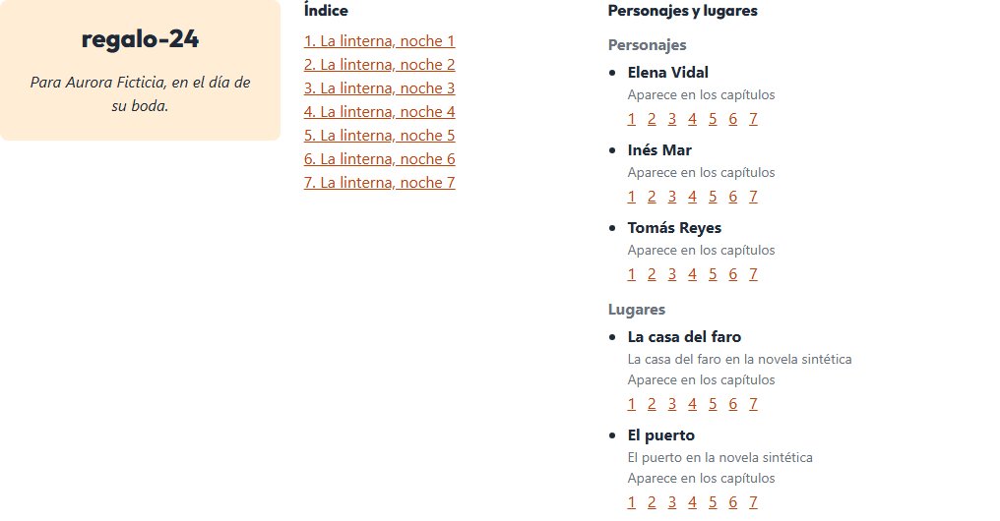

# Lectura web de la novela

La vista **Lectura** del panel (`#/novelas/<slug>/lectura`) lleva, encima de la estantería y la
lista de capítulos, una tarjeta **Libro** con lo mismo que el PDF de regalo: portada con título y
dedicatoria, índice de capítulos navegable y ficha de personajes y lugares con un enlace a cada
capítulo en que aparece cada uno. Pulsar un enlace abre el capítulo en el lector del panel.

## Decisión: el PDF es la entrega; la web, lectura complementaria

El formato principal de entrega sigue siendo el **PDF interactivo** que genera
`novela exportar <slug> --formato pdf` (ADR 0003): un fichero que se regala, se abre sin servidor y
tiene índice, ficha y marcadores enlazados. Cualquier cambio del libro se pide **desde el CLI**
(`novela cambio`, `novela exportar`), nunca desde el panel.

La web es para el operador y para la validación visual: ver la novela mientras se escribe, revisar
la ficha antes de exportar y dar a un navegador algo que recorrer. Por eso no reabre el ADR 0003:
la API sigue en `localhost`, solo lee y no sirve el PDF.

Lo que cambia respecto a la spec 0006: su RF-32 decía «ninguna ruta nueva». Ahora hay exactamente
una, `GET /novelas/{slug}/libro`, en JSON y **sin el cuerpo** de los capítulos (el cuerpo ya lo
sirve `…/capitulos/{n}`). `test_api.py::test_sin_rutas_de_libro` fija esa única excepción; de paso
se arregló que el test fuera vacuo (ver `docs/validacion-visual.md`, hallazgo 1).

## `GET /novelas/{slug}/libro`

Modelo `Libro` de `backend/novela/dominio/libro.py` (entrada en `docs/definitions.md` §6):

| Campo | De dónde sale |
|---|---|
| `titulo` | el slug, como el PDF sin `--titulo` |
| `dedicatoria` | `brief/brief.json`, o `null` si la novela no es de regalo |
| `capitulos` | `{capitulo, titulo}` del frontmatter, del 1 al último checkpoint |
| `personajes`, `lugares` | `{id, nombre, detalle, capitulos}` desde la tabla `apariciones` de `estado.db` y el canon |

La lectura del workspace está en `backend/novela/plataforma/libro.py` y la usan **los dos**: el PDF
(`slices/export/cmd.py`) y la API. Antes vivía en el slice de exportación; se movió porque la API no
puede importar `slices/` (`test_contratos.py::test_api_no_importa_slices`), y así web y PDF no
pueden divergir. La función pura de la ficha pasó de `slices/export/ficha.py` a
`dominio/ficha.py`.

- Sin checkpoint: índice y ficha vacíos, 200.
- Un capítulo cerrado sin apariciones, o una entidad sin canon: 404 con el mismo mensaje que la
  salida 4 de `exportar`.
- `brief.json` que no valida: 404 con «brief/brief.json no valida contra Brief» y **sin** el texto
  del error de Pydantic, que llevaría los valores (datos personales; plan 0006, PD5).

**Dedicatoria.** El `Brief` todavía no tiene el campo `dedicatoria` de la fase 4 de la spec 0006.
Mientras tanto se deriva de la ocasión y el nombre del destinatario («Para [NOMBRE], en el día de su
boda.»), con `dominio/libro.py::dedicatoria`. No añade datos que los agentes no hayan visto ya: el
nombre está en la idea semilla. Cuando exista el campo, su texto literal sustituye a la plantilla.

## Panel

- `frontend/src/features/lectura/libro.ts`: construye la tarjeta con nodos de texto (nada del
  workspace entra como HTML). Los enlaces son rutas de Lectura (`hashDe`), así que el router abre el
  lector sin código nuevo.
- `vista.ts`: un recurso más (`libro`) en el sondeo de la vista; la tarjeta se rehace solo si cambia
  el JSON, para no perder el foco en cada ronda.
- En la ficha, cada capítulo es un número (`1 2 3 …`) con el título como nombre accesible
  (`aria-label` y `title`: «Capítulo N — título»).

### `data-testid` estables

Contrato de la validación visual; no se renombran.

| `data-testid` | Elemento | Atributos |
|---|---|---|
| `libro` | contenedor de la tarjeta | |
| `portada`, `portada-titulo`, `portada-dedicatoria` | portada | |
| `indice`, `indice-capitulo` | índice y cada enlace | `data-destino="N"` |
| `ficha`, `ficha-entrada` | ficha y cada personaje o lugar | `data-entidad`, `data-tipo` `personaje \| lugar` |
| `ficha-enlace` | enlace a un capítulo desde la ficha | `data-destino="N"` |
| `lector`, `lector-titulo` | diálogo del capítulo abierto y su título | |

`data-destino` y no `data-capitulo`: este último ya lo usan los volúmenes de la lista, y los tests de
teclado lo buscan por toda la vista.

## Límites

- Sin cuerpo en `/libro`: una vista de lectura continua (todo el libro seguido) exigiría otra
  ruta; no hace falta mientras el PDF sea la entrega.
- El título es el slug. Si el libro necesita un título propio, se añade a `config.yaml` y lo leen
  los dos, PDF y web.
