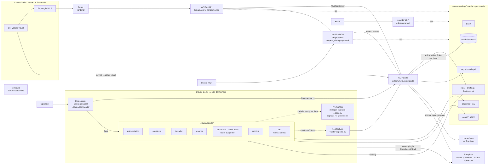
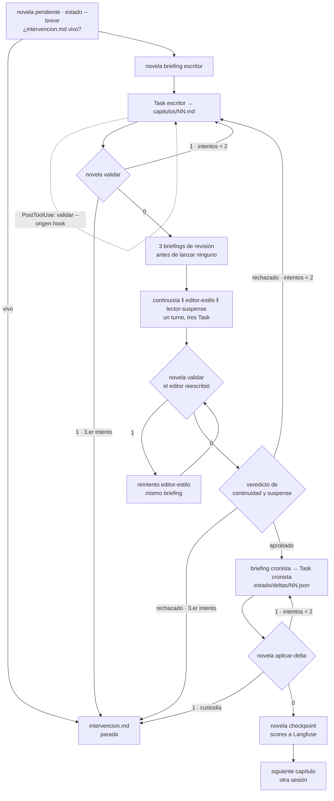
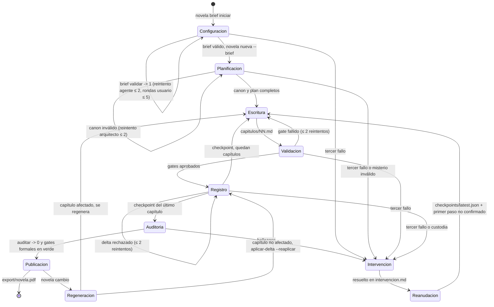

# Diagramas

Cinco vistas del harness.

## 1. Arquitectura

## 2. Bucle por capítulo

Cada reintento recibe solo las rutas de `qa/` que lo motivan. La cuenta sale de `harness.log`,
nunca de la conversación.

## 3. Esquema SQLite

Tal como está en `backend/novela/plataforma/esquema.sql`. No hay claves foráneas
declaradas: las relaciones son por id y las valida `aplicar-delta`. Las tablas marcadas
«append-only» tienen triggers que abortan `UPDATE` y `DELETE`.

```mermaid
erDiagram
  meta {
    TEXT clave PK
    TEXT valor
  }
  cursor {
    INTEGER id PK "siempre 1"
    INTEGER capitulo
    TEXT fase
    TEXT ultimo_paso
    INTEGER intento
  }
  personajes {
    TEXT id PK
    TEXT ubicacion
    TEXT estado_fisico
    TEXT estado_emocional
    TEXT condicion
    TEXT objetivo_activo
    INTEGER ultima_aparicion
  }
  libro_de_hechos {
    TEXT id PK "append-only"
    TEXT texto
    INTEGER capitulo
    TEXT cita
  }
  conocimiento {
    TEXT personaje "append-only"
    TEXT hecho
    INTEGER desde_capitulo
    TEXT cita
  }
  conocimiento_lector {
    TEXT hecho "append-only"
    INTEGER desde_capitulo
    TEXT cita
  }
  linea_temporal {
    TEXT escena PK "append-only"
    INTEGER capitulo
    TEXT inicio
    INTEGER duracion_min
    TEXT cita
  }
  relaciones {
    TEXT de PK
    TEXT a PK
    TEXT tipo
    REAL intensidad
    INTEGER desde
  }
  objetos {
    TEXT id PK
    TEXT poseedor
    TEXT ubicacion
    INTEGER capitulo_intro
    TEXT relevancia
  }
  hilos {
    TEXT id PK
    TEXT estado
    INTEGER abierto_en
    INTEGER cerrado_en
    TEXT descripcion
  }
  pistas {
    TEXT id PK "derivada"
    TEXT estado
    INTEGER plantada_en
    INTEGER pagada_en
  }
  tension_real {
    INTEGER capitulo PK "append-only"
    INTEGER valor
  }
  metricas {
    INTEGER id PK "derivada, una fila"
    INTEGER palabras_totales
    REAL desviacion_vs_plan
  }
  apariciones {
    TEXT entidad PK "append-only, spec 0006"
    TEXT tipo
    INTEGER capitulo PK
  }
  usos_de_hecho {
    TEXT hecho PK "append-only, spec 0007"
    INTEGER capitulo PK
    TEXT via PK
  }
  cronologia {
    TEXT evento PK "append-only, docs/formal/lean.md"
    INTEGER capitulo
    INTEGER momento
    INTEGER duracion_min
    TEXT lugar
    TEXT tras "JSON, ids de evento"
    TEXT cita
  }
  cronologia_personajes {
    TEXT evento PK "append-only"
    TEXT personaje PK
    TEXT papel PK "presente | excluido"
    INTEGER edad
  }
  prohibidas {
    TEXT termino PK "docs/guardrails.md"
    TEXT nivel PK "global | cliente | novela"
  }
  auditoria_policy {
    INTEGER id PK "append-only"
    TEXT momento
    TEXT origen
    TEXT decision
    TEXT nivel
    TEXT termino
    INTEGER capitulo
    TEXT detalle
  }

  personajes ||--o{ conocimiento : "sabe"
  libro_de_hechos ||--o{ conocimiento : "hecho"
  libro_de_hechos ||--o{ conocimiento_lector : "hecho"
  libro_de_hechos ||--o{ usos_de_hecho : "usado en"
  personajes ||--o{ relaciones : "de / a"
  personajes ||--o{ objetos : "poseedor"
  personajes ||--o{ apariciones : "entidad"
  cronologia ||--o{ cronologia_personajes : "evento"
  personajes ||--o{ cronologia_personajes : "personaje"
  prohibidas ||--o{ auditoria_policy : "termino y nivel"
```

`cronologia` la llena `aplicar-delta` desde `Delta.cronologia`; `prohibidas` y
`auditoria_policy` las escribe `policy_db`, no `aplicar-delta`.

## 4. Máquina de estados del flujo

Es el mismo flujo que modela `formal/tla/` ([`docs/formal/tla.md`](../formal/tla.md)).

## 5. Validadores

Dónde corre cada uno, dónde bloquea y qué score emite a Langfuse. Punto: **hook** (dentro de la
invocación del agente), **rol** (un agente revisor), **gate** (el CLI, antes de avanzar o de
publicar).

| Validador | Qué comprueba | Punto | Bloquea en | Score en Langfuse | Detalle |
|---|---|---|---|---|---|
| `vp_schema` | Brief y salidas de cada rol contra su esquema | gate: `validar`, `checkpoint` | `checkpoint` | `vp_schema` | `validators.md` §3.10 |
| `vp_longitud` | Palabras dentro del rango | hook `PostToolUse` + gate `validar` | `validar` | `vp_longitud` | ídem |
| `vp_pistas` | Pistas de la ficha presentes | hook + gate `validar` | `validar` | `vp_pistas` | ídem |
| `vp_hilos` | Ningún hilo se cierra sin abrirse | hook + gate `validar` | `validar` | `vp_hilos` | ídem |
| `vp_ids` | Ids referenciados existen | hook + gate `validar` | `validar` | `vp_ids` | ídem |
| `vp_nombres` | Nombres como en la story bible | hook + gate `validar` | `validar` | `vp_nombres` | ídem |
| `vp_prohibidas` | Términos vetados en tres niveles, con auditoría | hook + gate `validar`; `prohibidas comprobar` a mano | `validar` | `vp_prohibidas` en `checkpoint`; `guardrail_prohibidas` en `validar` | `guardrails.md` |
| `vp_cobertura` | Cada elemento del brief aparece en algún capítulo | gate: `checkpoint`, `auditar` | `auditar` | `vp_cobertura` (fracción) | `validators.md` §3.10 |
| Plan | Escaleta y fichas; ficha de canon por personaje del plan | gate `validar-plan` en `/novela-nueva` | reintento del `trazador` | — | `novela-nueva.md` |
| Continuidad | Capítulo contra hechos, línea temporal y canon | rol `continuista` | gate de revisión | `continuidad` | `architecture.md` §2.1 |
| Estilo | Capítulo contra `canon/estilo.md` | rol `editor-estilo` | no bloquea, corrige | `estilo` | ídem |
| Tensión y fair play | Curva, fair play, coherencia | rol `lector-suspense` | gate de revisión | `tension`, `fair_play`, `coherencia` | ídem |
| Longitud relativa | `1 − \|palabras/objetivo − 1\|` | gate `checkpoint` | no bloquea | `longitud` | `architecture.md` §10.5 |
| Delta | Esquema, cita literal, custodia, invariantes narrativos | gate `aplicar-delta` | `aplicar-delta` | — | `architecture.md` §7.6 |
| Policy de escritura y lectura | Quién escribe y lee dónde; misterio y base intocables | hook `PreToolUse` + `deny` | la herramienta | — (log `policy.jsonl`) | `architecture.md` §7.1 |
| Validación del brief | Esquema, faltantes, contradicciones, procedencia literal | gate `novela brief validar` | `/novela-nueva --brief` | — (sin trazado: datos personales) | `architecture.md` §8 |
| Auditoría | Pistas huérfanas, hilos sin cerrar, fair play | gate `novela auditar` | exportar | — | `architecture.md` §8 |
| `lean_cronologia` | Orden, edad, ubicuidad y exclusión en Lean 4 | gate `verificar-lean` en `/novela-auditar` | exportar: intervención | `lean_cronologia`, `lean_<invariante>` | `formal/lean.md` |
| `juez_*` | Continuidad, tono, arco, personajes, ritmo, personalización | rol `juez` + gate `novela juicio` en `/novela-auditar` | exportar: bajo el umbral, intervención | `juez_<criterio>` | `evaluacion/juez.md` |
| Acuerdo humano | Revisión humana contra el juez, criterio a criterio | `novela comparar-juicios`, a mano | no bloquea | `juez_acuerdo_humano` | ídem |
| `visual_lectura` | Portada, dedicatoria, índice, navegación y ficha en navegador | skill `validar-visual` (Playwright MCP) + `novela registrar-visual` | no bloquea | `visual_lectura` | `validacion-visual.md` |
| `prosa_*` | Repeticiones, legibilidad, léxico y estilo | `novela lint-prosa` a mano; LSP al editar | no bloquea, informa | `prosa_repeticiones`, `prosa_legibilidad`, `prosa_lexico`, `prosa_estilo` | `linters-prosa.md` |
| TLC | Nada se publica sin validar; reanudación sin pérdida; terminación | `test_tla.py` en `uv run pytest`, si hay java; no en CI | no bloquea | — | `formal/tla.md` |

El catálogo de los `vp_*` está en `backend/novela/dominio/validadores.py`, y un test comprueba
que coincide con `docs/validators.md` §3.10. Los que no son del catálogo están en §3.11.
