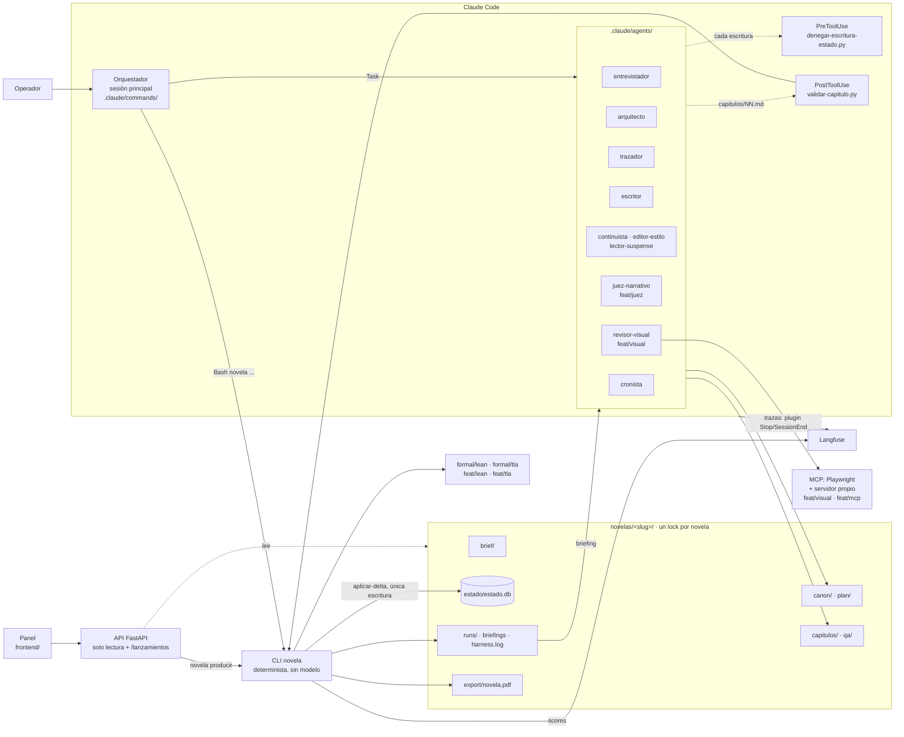
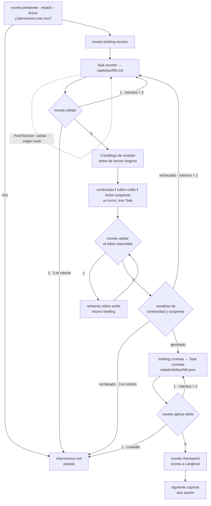
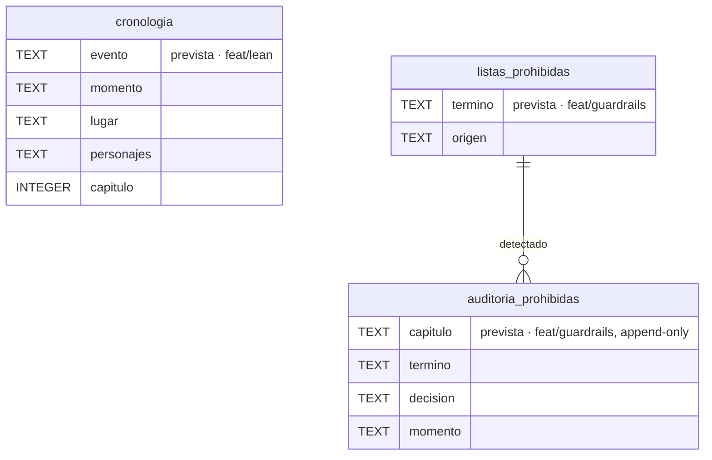
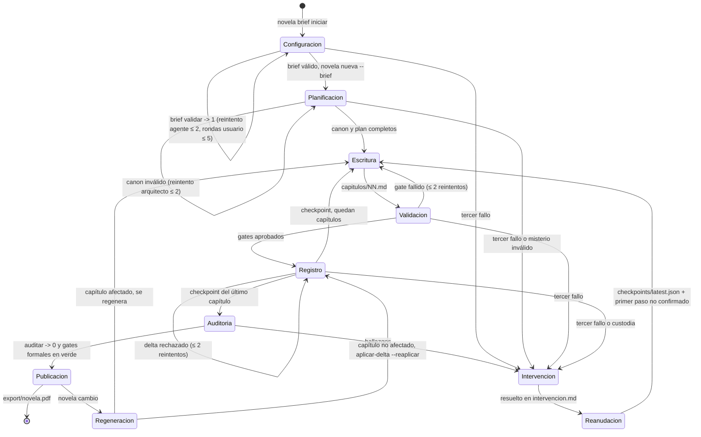

# Diagramas

Cinco vistas del harness. Las piezas que añaden otras ramas llevan su rama al lado.

## 1. Arquitectura

## 2. Bucle por capítulo

Cada reintento recibe solo las rutas de `qa/` que lo motivan. La cuenta sale de `harness.log`,
nunca de la conversación.

## 3. Esquema SQLite

Tal como está en `entrega`, en `backend/novela/plataforma/esquema.sql`. No hay claves foráneas
declaradas: las relaciones son por id y las valida `aplicar-delta`. Las tablas marcadas
«append-only» tienen triggers que abortan `UPDATE` y `DELETE`.

```mermaid
erDiagram
  meta {
    TEXT clave PK
    TEXT valor
  }
  cursor {
    INTEGER id PK "siempre 1"
    INTEGER capitulo
    TEXT fase
    TEXT ultimo_paso
    INTEGER intento
  }
  personajes {
    TEXT id PK
    TEXT ubicacion
    TEXT estado_fisico
    TEXT estado_emocional
    TEXT condicion
    TEXT objetivo_activo
    INTEGER ultima_aparicion
  }
  libro_de_hechos {
    TEXT id PK "append-only"
    TEXT texto
    INTEGER capitulo
    TEXT cita
  }
  conocimiento {
    TEXT personaje "append-only"
    TEXT hecho
    INTEGER desde_capitulo
    TEXT cita
  }
  conocimiento_lector {
    TEXT hecho "append-only"
    INTEGER desde_capitulo
    TEXT cita
  }
  linea_temporal {
    TEXT escena PK "append-only"
    INTEGER capitulo
    TEXT inicio
    INTEGER duracion_min
    TEXT cita
  }
  relaciones {
    TEXT de PK
    TEXT a PK
    TEXT tipo
    REAL intensidad
    INTEGER desde
  }
  objetos {
    TEXT id PK
    TEXT poseedor
    TEXT ubicacion
    INTEGER capitulo_intro
    TEXT relevancia
  }
  hilos {
    TEXT id PK
    TEXT estado
    INTEGER abierto_en
    INTEGER cerrado_en
    TEXT descripcion
  }
  pistas {
    TEXT id PK "derivada"
    TEXT estado
    INTEGER plantada_en
    INTEGER pagada_en
  }
  tension_real {
    INTEGER capitulo PK "append-only"
    INTEGER valor
  }
  metricas {
    INTEGER id PK "derivada, una fila"
    INTEGER palabras_totales
    REAL desviacion_vs_plan
  }
  apariciones {
    TEXT entidad PK "append-only, spec 0006"
    TEXT tipo
    INTEGER capitulo PK
  }
  usos_de_hecho {
    TEXT hecho PK "append-only, spec 0007"
    INTEGER capitulo PK
    TEXT via PK
  }

  personajes ||--o{ conocimiento : "sabe"
  libro_de_hechos ||--o{ conocimiento : "hecho"
  libro_de_hechos ||--o{ conocimiento_lector : "hecho"
  libro_de_hechos ||--o{ usos_de_hecho : "usado en"
  personajes ||--o{ relaciones : "de / a"
  personajes ||--o{ objetos : "poseedor"
  personajes ||--o{ apariciones : "entidad"
```

**Tras integrar `feat/lean` y `feat/guardrails`.** La integración añade tablas de cronología,
de listas prohibidas y de auditoría. Se dibujan como previstas: los nombres y columnas exactos
son los de [`docs/formal/lean.md`](../formal/lean.md) y [`docs/guardrails.md`](../guardrails.md).

## 4. Máquina de estados del flujo

Es el mismo flujo que modela `formal/tla/` ([`docs/formal/tla.md`](../formal/tla.md)).

## 5. Validadores

Dónde corre cada uno, dónde bloquea y qué score emite a Langfuse. Punto: **hook** (dentro de la
invocación del agente), **rol** (un agente revisor), **gate** (el CLI, antes de avanzar o de
publicar).

| Validador | Qué comprueba | Punto | Bloquea en | Score en Langfuse | Origen |
|---|---|---|---|---|---|
| `vp_schema` | Brief y salidas de cada rol contra su esquema | gate: `validar`, `checkpoint` | `checkpoint` | `vp_schema` | entrega |
| `vp_longitud` | Palabras dentro del rango | hook `PostToolUse` + gate `validar` | `validar` | `vp_longitud` | entrega |
| `vp_pistas` | Pistas de la ficha presentes | hook + gate `validar` | `validar` | `vp_pistas` | entrega |
| `vp_hilos` | Ningún hilo se cierra sin abrirse | hook + gate `validar` | `validar` | `vp_hilos` | entrega |
| `vp_ids` | Ids referenciados existen | hook + gate `validar` | `validar` | `vp_ids` | entrega |
| `vp_nombres` | Nombres como en la story bible | hook + gate `validar` | `validar` | `vp_nombres` | entrega |
| `vp_cobertura` | Cada elemento del brief aparece en algún capítulo | gate: `checkpoint`, `auditar` | `auditar` | `vp_cobertura` (fracción) | entrega |
| Continuidad | Capítulo contra hechos, línea temporal y canon | rol `continuista` | gate de revisión | `continuidad` | entrega |
| Estilo | Capítulo contra `canon/estilo.md` | rol `editor-estilo` | no bloquea, corrige | `estilo` | entrega |
| Tensión y fair play | Curva, fair play, coherencia | rol `lector-suspense` | gate de revisión | `tension`, `fair_play`, `coherencia` | entrega |
| Longitud relativa | `1 − \|palabras/objetivo − 1\|` | gate `checkpoint` | no bloquea | `longitud` | entrega |
| Delta | Esquema, cita literal, custodia, invariantes narrativos | gate `aplicar-delta` | `aplicar-delta` | — | entrega |
| Policy de escritura | Quién escribe dónde; misterio y base intocables | hook `PreToolUse` + `deny` | la herramienta | — | entrega |
| Validación del brief | Esquema, faltantes, contradicciones, procedencia literal | gate `novela brief validar` | `/novela-nueva --brief` | — (sin trazado: datos personales) | entrega |
| Auditoría | Pistas huérfanas, hilos sin cerrar, fair play | gate `novela auditar` | exportar | — | entrega |
| `vp_prohibidas` | Palabras y temas vetados, con audit log | hook + gate antes de publicar | publicar | `vp_prohibidas` | `feat/guardrails` |
| `lean_cronologia` | Ubicuidad, nacimiento y exclusión en Lean 4 | gate antes de cerrar y de publicar | publicar | `lean_cronologia` | `feat/lean` |
| `juez_*` | Continuidad, tono, arco, personajes, ritmo, personalización | rol `juez-narrativo` | no bloquea, informa | `juez_<criterio>` | `feat/juez` |
| `visual_lectura` | Índice, capítulos, ficha y portada en navegador | rol `revisor-visual` + gate `visual` | publicar | `visual_lectura` | `feat/visual` |
| `prosa_*` | Linters de prosa | gate, según `docs/linters-prosa.md` | según la rama | `prosa_<regla>` | `feat/prosa` |
| TLC | Nada se publica sin validar; reanudación sin pérdida; terminación | CI, job `tla` | el merge | — | `feat/tla` |

El catálogo de los `vp_*` está en `backend/novela/dominio/validadores.py`, y un test comprueba
que coincide con `docs/validators.md` §3.10. Los puntos exactos de lo que añaden otras ramas son
los de su documentación.
