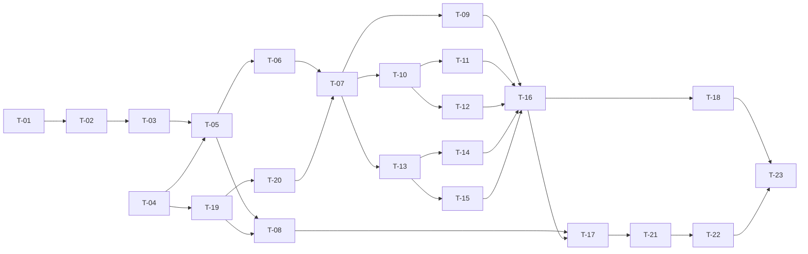

# Plan de implementación: Construir el panel de lanzamiento, progreso y lectura

- Spec de origen: `docs/specs/0004/spec.md` (v5, estado `aceptada`) y `docs/specs/0004/decisions.md` (D1–D56) · Fecha: 2026-09-24 · Estado: aceptado con la spec

> **Ubicación.** El plan vive en `docs/specs/0004/plan/`, junto a la spec, según la convención de `AGENTS.md` § Proceso: modificar documentación, que el supuesto S4 de la spec ya recoge (D29). Se borra en el commit de cierre (T-23), con `docs/specs/0004/validators.md`.

Los requisitos se citan con sus IDs originales. Correspondencia con la numeración del procedimiento: R1–R61 ≡ RF-01–RF-61 y R62–R85 ≡ RNF-01–RNF-24. Las tareas conservan los IDs T-01–T-23 de la spec §12. Las decisiones de la spec (D1–D56) no se reabren; las de este plan se numeran PD1, PD2…

## 1. Resumen

Se construye `frontend/` —Vite + TypeScript sin framework, Three.js y `markdown-it`— con Inicio, Lanzar, Progreso y Lectura, todas de solo lectura contra la API, y con la identidad visual de Qaracter en un único `tokens.css` que cumple WCAG 2.1 AA. La API gana cinco `GET` (`config`, `escaleta`, `checkpoint`, `runs` y el tramo de `harness.log`), porque §11.2 de `docs/architecture.md` prohíbe calcular en el panel lo que la API no sirve. Todo va en ciclos TDD cerrados, con los tipos del panel generados desde `backend/api/openapi.json`, CI propio del frontend, e2e sobre workspaces sintéticos y dos comprobaciones manuales (T-18 y T-22).

## 2. Alcance

**Incluido**

- Cinco `GET` nuevos en `backend/api/routers/novelas.py`, `TramoDeLog` y `cortar_tramo` en `backend/novela/dominio/artefactos.py`, y `escaleta()`, `manifiestos()` y `tramo_de_log()` en `backend/novela/plataforma/workspace.py` (RF-32 a RF-38).
- `frontend/` completo según la spec §8.2: esqueleto, tipos generados, cliente y sondeo, `app/`, las tres `features/`, marca (`shared/marca/`, `shared/iconos/`, `shared/ui/`), e2e y regresión visual (RF-01 a RF-31, RF-39 a RF-61).
- Generador de workspaces sintéticos `backend/tests/fixtures/panel.py` (RF-42).
- `.githooks/pre-commit` (paso 3), `.github/workflows/ci.yml` (jobs `frontend` y `frontend-e2e`) y `.gitignore` (RF-40, RF-41).
- Actualización de la documentación de referencia en el mismo commit que el código que la cambia (RF-45; tabla en §5).
- Comprobaciones manuales T-18 (fps y lecturas concurrentes en Windows, una vez) y T-22 (revisión visual M-01 a M-12, repetida al cambiar `tokens.css`, `shared/ui/` o `shared/marca/`; D55).
- Commit de cierre T-23: lo que perdura de `docs/specs/0004/validators.md` sube a `docs/validators.md` (§3.6, §4.4, §4.7 y §4.9 incluidas, D37), y se borran `plan/` y `validators.md`.

**Fuera de alcance** (spec §3.2)

- Cola en disco, `POST /cola`, `novela cola`, supervisor y `run.sh` (D1). Ningún verbo distinto de `GET` en la API.
- Escribir `config.yaml` o cualquier fichero desde el panel (D5); cuota, `qa/`, `intervencion.md`, trayectoria del orquestador (D3); `canon/`, `plan/capitulos/`, `memoria/`, deltas y briefings.
- SSE, WebSocket, servir `dist/` desde FastAPI, despliegue fuera de la máquina de desarrollo, autenticación (D2, D15).
- i18n, modo oscuro, móvil y táctil, avatar y notificaciones (D13, D24, D28).
- Retocar el logo, fuentes o iconos desde CDN o npm (D23, D25).
- Cambiar los cinco `GET` de la spec 0001, `backend/schemas/`, `.claude/` o `CLAUDE.md` (RNF-18, spec §8.2 «Sin cambios»).
- Escribir `docs/specs/0004/validators.md`: lo escribió otro agente después de este plan.

## 3. Análisis del código existente

**API de lectura (`backend/api/`)**

- `backend/api/main.py:19` ya admite CORS desde `http://localhost:5173` con `allow_methods=["GET"]`; no hay que tocarlo (spec §8.2). `backend/api/main.py:24-28` convierte `WorkspaceInvalido` y `EstadoIlegible` en 404 con `detail`: los `GET` nuevos heredan ese tratamiento si leen por `WorkspaceRepository`.
- `backend/api/routers/novelas.py:14-20`: la dependencia `_workspace` valida el slug con `Path(pattern=SLUG_PATRON)` antes de construir la ruta y responde 404 si no hay `config.yaml`. Es la que deben usar los cinco `GET` nuevos (alias `Workspace`, `:23`).
- `backend/api/routers/novelas.py:24-26`: las rutas usan `SLUG = "/{slug:path}"` a propósito, para que `..%2F` llegue a la validación y salga 422. Con `…/runs`, `…/runs/{run_id}` (`:55-60`) y `…/runs/{run_id}/log` conviviendo, el enrutado de Starlette decide por orden de registro y por expresión; la spec §9 lo lista como caso límite y lo fijan CA-35 a CA-37.
- `backend/api/routers/novelas.py:55-60`: el `GET …/runs/{run_id}` existente valida `run_id` con `RUN_ID_PATRON` (`backend/novela/dominio/ids.py:28`, `^r-[0-9]{8}-[0-9]{4}$`) y lee `manifest.json` con `ws.leer_json`. Patrón a copiar en `…/runs/{run_id}/log`.
- `backend/api/routers/capitulos.py:18-30`: índice y capítulo tal cual, con `n` en `Path(ge=1, le=999)`; sin cambios.
- `backend/api/openapi.json` existe y lo mantiene `backend/tests/test_contratos.py:141-149` (`test_openapi_al_dia`, regenerable con `REGENERAR=1`).

**Dominio y plataforma**

- `backend/novela/dominio/base.py:24`: `Modelo` es `frozen=True, extra="forbid"`. `TramoDeLog` hereda de él.
- `backend/novela/dominio/artefactos.py:49-59` (`Checkpoint`) y `:62-79` (`Manifest`, con `fase`, `sucio` y `hashes_claude` de la 0003): se sirven sin cambios. `TramoDeLog`, `cortar_tramo` y `TOPE_TRAMO_BYTES` no existen.
- `backend/novela/dominio/plan.py:37-58`: `Escaleta` exige `context={"num_capitulos": N}` en su `model_validator` y lanza error sin él (`:47-49`). `backend/novela/plataforma/workspace.py:117-123` (`modelo_de_md`) valida sin contexto, así que `escaleta()` necesita su propia lectura, como dice la spec §8.2. Hoy ningún código de producción lee `plan/escaleta.md` a un `Escaleta`: solo `backend/novela/dominio/test_plan.py:39-48`.
- `backend/novela/plataforma/workspace.py:99-104`: `config()` y `ultimo_checkpoint()` ya existen; `ultimo_checkpoint()` devuelve `None` si falta `latest.json`, que es exactamente RF-34.
- `backend/novela/slices/estado/cmd.py:35-48`: «cerrados» se cuenta desde `checkpoints/latest.json`, no desde el cursor (base de D8).
- `backend/novela/plataforma/run.py:108-112`: `harness.log` se abre en modo `a`, se escribe una línea y se cierra (S1). `:169-199`: `abrir()` escribe `manifest.json` antes de cualquier línea de log; un run sin `harness.log` solo existe entre esas dos escrituras, así que el test de CA-37 tendrá que fabricarlo.
- `backend/novela/slices/nueva/cmd.py:34-60`: `nueva` no abre run (sin `harness.log` ni `manifest.json`), acepta `--capitulos` y `--palabras`, y sale con 1 si el workspace existe (`:57-60`): el texto de RF-13 es fiel.
- `backend/novela/slices/checkpoint/cmd.py:113`: `checkpoint` emite scores con `langfuse.desde_entorno(langfuse.entorno_efectivo(run.RAIZ_REPO))`; `run.RAIZ_REPO` está en `backend/novela/plataforma/run.py:51`. Es lo que RF-42 tiene que neutralizar.

**Tests y fixtures del backend**

- `backend/conftest.py:23-32`: `_sin_claves_reales` (sesión, autouse) aísla `run.RAIZ_REPO` y quita `TRACE_TO_LANGFUSE` y `LANGFUSE_*`. `panel.py` necesita el mismo aislamiento fuera de pytest, porque se ejecuta como `python -m tests.fixtures.panel`.
- `backend/conftest.py:68-91`: `plantillas` construye `demo-24` como instantánea de `demo-terminado` al cerrar el 7, y `novelas` copia a `tmp_path` con `NOVELAS_DIR`.
- `backend/tests/fixtures/fabrica.py:447-451` (`cli`), `:454-470` (`preparar_capitulo`), `:473-478` (`cerrar_capitulo`) y `:481-497` (`construir`). `construir` escribe siempre canon y plan (`:492`), así que `recien-creada` («sin plan ni checkpoints») y `grande-999` tienen que salir de `novela nueva` invocado directamente, no de `construir`.
- `backend/tests/test_api.py:55-72`: fixture `solo_lectura` (chmod de solo lectura y huella igual al salir). `:75-107`: `test_cinco_get_en_solo_lectura`, que no se toca (RNF-18). `:27-52`: `test_path_traversal`, con espías de `open`, `stat`, `scandir` y `sqlite3.connect`: patrón para CA-32 y CA-37.
- `backend/tests/test_contratos.py:36-57`: `test_sin_claves_versionadas` monta un repositorio git temporal con `.githooks/pre-commit`; es el patrón de CA-41.
- `backend/pyproject.toml:63` (`testpaths = ["novela", "tests"]`): un `backend/novela/dominio/test_artefactos.py` nuevo se recoge solo. `:70`: `mutmut` solo muta `gates.py` y `delta/apply.py`; `cortar_tramo` queda fuera de la mutación.

**Repositorio y CI**

- `.githooks/pre-commit:5-17`: paso 1 (claves) y paso 2 (`ruff`). El paso 3 va detrás.
- `.github/workflows/ci.yml:8-25`: un único job `backend` (`uv sync --locked`, `ruff`, `mypy --strict`, `pytest --hypothesis-profile=ci`, `mutmut`).
- `.gitignore`: no tiene entradas de `frontend/`.
- `frontend/`: solo recursos de marca sin versionar: `frontend/src/shared/marca/logo.png`, cuyas dimensiones y peso (400 × 400 px, 68 KB) salen de la spec y comprueba CA-52 en T-19; `fuentes/outfit-800.woff2` y `OFL.txt`; e `iconos/LICENSE` e `iconos/lucide/*.svg` (D31).
- No hay `package.json` en ningún sitio del repositorio: nada de lo que la spec afirma sobre Vite, `openapi-typescript`, Playwright, `@axe-core/playwright`, `eslint-plugin-no-unsanitized`, fast-check, `three` o `markdown-it` (opciones, flags, APIs) se ha podido comprobar en el repositorio. Se verifica en T-04 al fijar versiones, sobre Node 24 LTS (D35; ver riesgos).

**Documentación afectada** (comprobada)

- `docs/architecture.md:266-275`: el árbol de `frontend/` dice «generación de config.yaml» en `lanzar/` y «cuota» en `progreso/` (D3, D5). `:831-837`: cinco `GET` en §11.1. `:854-862`: §11.2 con «produce un `config.yaml`» y «se añade al estado». `:873`: §12.6 abierta. `:875`: §12.8.
- `docs/validators.md:30`: §2 dice «no hay `frontend/`, así que ni `tsc` ni `eslint`». §3.1 (`:76-83`), §3.2 (`:85-91`), §3.5 (`:105-115`), §3.8 (`:137-147`), §5 (`:536-572`) y §6 (`:576-603`) existen con los números que cita RF-45.
- `docs/definitions.md:275-295` (§6) no describe `runs/` ni `harness.log`; T-02 añade una línea con `TramoDeLog`, como `AGENTS.md` exige para todo modelo Pydantic nuevo (D34).
- `AGENTS.md` cita `validate.py` y `delta.py`; el código real es `backend/novela/slices/validacion/gates.py` y `backend/novela/slices/delta/apply.py` (confirmado también en `backend/pyproject.toml:70`). Este cambio no toca ninguno de los dos, así que no hay test property-based ni mutación obligatorios por esa regla.
- El plan de la 0003, que se citaba como ejemplo de formato, ya no existe (coherente con «se borra al implementarla»). La forma de este plan sigue la plantilla del planificador.

## 4. Decisiones de diseño

### PD1. T-17 (job `frontend-e2e`) antes de T-21 (regresión visual)
- Alternativas descartadas: el orden literal de la spec §12 (T-16, T-21, T-17); generar las referencias en la máquina de desarrollo.
- Motivo: RNF-22 y D27 fijan las capturas «en la imagen de Playwright del CI». Con T-17 antes, T-21 genera y valida sus referencias en ese contenedor desde su primer commit; con el orden literal, las referencias de T-21 saldrían de Windows y fallarían en Linux. Dependencias intactas: T-17 solo necesita T-08 y T-16. Aceptada en la spec (D30), que ya fija este orden en §12.

### PD2. Cada regla de eslint entra en la tarea que la prueba
- Alternativas descartadas: todo `eslint.config.js` en T-04, como sugiere la tabla de la spec §8.2.
- Motivo: si la regla de red fuera de `src/shared/api/` existiera desde T-04, el test de lint de CA-03 en T-06 saldría verde a la primera y violaría el «rojo primero» de `AGENTS.md`. Reparto: T-04, imports fuera de `src/` (CA-43) y `no-unsanitized` con su fixture; T-06, globales de red (CA-03); T-19, importación de `logo.png` reservada a `logo.ts` (CA-51, parte estática). Aceptada en la spec (D33). Ninguna regla lleva excepción por fichero: la única inserción de HTML de `lector.ts` usa un `eslint-disable-next-line` (D56).

### PD3. Lectura de disco en `WorkspaceRepository`, corte en una función pura de `dominio/`
- Alternativas descartadas: leer ficheros desde el router; poner `cortar_tramo` en `plataforma/`.
- Motivo: sigue `docs/architecture.md` §3.0 (núcleo funcional, cáscara imperativa) y el patrón de `workspace.py:111-136`. `cortar_tramo(ventana, desde, tope, *, en_limite, hasta_el_final)` no toca disco y admite la propiedad de CA-36; `tramo_de_log` hace `stat`, `seek` al byte anterior a `desde` y `read` de como mucho 1 MiB, y fija `modificado` desde `mtime` (D48).

### PD4. Los errores de lectura de los `GET` nuevos pasan por `WorkspaceInvalido`
- Alternativas descartadas: `HTTPException` a mano en cada router.
- Motivo: `backend/api/main.py:24-28` ya los convierte en 404 con `detail`. Solo se lanzan `HTTPException` explícitas para lo que no es «fichero que falta o no valida»: 416 y 422 de `desde`, y 404 de run inexistente, como en `novelas.py:58-59`.

### PD5. Presupuesto del chunk de Lectura tolerante a su ausencia hasta T-14
- Alternativas descartadas: dejar `presupuesto.mjs` para después de Lectura.
- Motivo: T-08 va antes de Lectura en el orden de la spec. El script identifica el chunk de Lectura por el nombre del `import()` dinámico, lo trata como 0 KB si no existe y se prueba sobre un `dist/` de fixture con un chunk inflado. En T-14 el chunk pasa a existir y el presupuesto de RNF-02 empieza a medir de verdad.

### PD6. Generador de e2e con dos vías: `fabrica.construir` y `nueva` a secas
- Alternativas descartadas: modificar `fabrica.construir` para que acepte «sin plan».
- Motivo: `construir` escribe siempre canon y plan (`fabrica.py:492`) y lo usa `conftest.py`. `panel.py` construye `demo-24` con `construir(…, cerrados=7)` más `preparar_capitulo(…, 8)`, y `recien-creada` y `grande-999` con `fabrica.cli(base, "nueva", …)`, sin tocar `fabrica.py`. La spec §8.2 ya lo recoge (D39).

## 5. Fases y tareas

| Fase | Fichero | Tareas (en orden) | Depende de | Suites en verde en cada commit |
|---|---|---|---|---|
| 1. API de lectura | `fase-1-api-de-lectura.md` | T-01, T-02, T-03 | — | backend |
| 2. Cimientos del frontend y contrato | `fase-2-cimientos-frontend.md` | T-04, T-05 | T-04 en paralelo con la fase 1; T-05 necesita T-03 | backend y frontend |
| 3. Marca y componentes | `fase-3-marca-y-componentes.md` | T-19, T-20 | Fase 2 (T-04) | frontend |
| 4. Cliente, sondeo, `app/` y CI | `fase-4-shared-app-ci.md` | T-06, T-07, T-08 | Fases 2 y 3 | frontend (+ CI) |
| 5. Lanzar y Progreso | `fase-5-lanzar-y-progreso.md` | T-09, T-10, T-11, T-12 | Fase 4 | frontend |
| 6. Lectura | `fase-6-lectura.md` | T-13, T-14, T-15 | Fase 4 | frontend |
| 7. e2e, CI e2e, comprobaciones manuales y cierre | `fase-7-e2e-y-cierre.md` | T-16, T-17, T-21, T-18, T-22, T-23 | Fases 1 a 6 | backend y frontend (+ CI) |

Orden global: T-01 → T-02 → T-03 → T-04 (puede empezar junto a T-01) → T-05 → T-19 → T-20 → T-06 → T-07 → T-08 → T-09 → T-10 → T-11 → T-12 → T-13 → T-14 → T-15 → T-16 → T-17 → T-21 → T-18 → T-22 → T-23. Coincide con la spec §12, que desde la v5 lleva T-17 antes de T-21 (PD1, D30). Las fases 5 y 6 son independientes entre sí.

**Reglas comunes a todas las tareas con código** (`AGENTS.md` § Proceso: generar código):

1. El test de cada criterio se escribe primero y se ejecuta para verlo en rojo; el rojo se anota en el mensaje de commit o en la descripción del PR. Ningún test llama a un modelo.
2. Verde con el mínimo código; refactor con la suite en verde.
3. Antes de commitear. En `backend/`, si el commit toca `backend/`: `uv run pytest`, `uv run mypy --strict .` y `uv run ruff check .`. En `frontend/`, desde T-04 y si el commit toca `frontend/`: `npm run verificar`, que encadena `tipos:comprobar` (desde T-05), `lint`, `typecheck`, `test`, `build` y `presupuesto` (desde T-08), spec §8.4. Es lo único que hay que ejecutar, y la línea de `AGENTS.md` de T-04 basta (D40).
4. Un commit por tarea, que incluye la documentación de referencia que esa tarea deja desfasada (tabla siguiente). No se commitea en rojo.
5. Si un commit cambia `backend/api/openapi.json` después de T-05, regenera `frontend/src/shared/api/esquema.gen.ts` en el mismo commit (RF-39).
6. No cambia ningún modelo Pydantic existente; `TramoDeLog` es nuevo, no entra en `backend/schemas/` (spec §8.3) y lleva una línea en `docs/definitions.md` en T-02 (D34). Si en la implementación cambiara algún modelo existente, se aplica la regla de `AGENTS.md`: `REGENERAR=1 uv run pytest tests/test_contratos.py`, `docs/definitions.md` y el test de contrato en el mismo commit.

T-18 y T-22 son comprobaciones manuales, sin código ni TDD; su resultado se anota en la spec §13 («Resultados de las comprobaciones manuales»), sin nombres de persona. T-18 se hace una vez; T-22 se repite cuando cambian `tokens.css`, `shared/ui/` o `shared/marca/`. Ninguna entra en `docs/validators.md` §6 (D55).

**Actualizaciones de documentación de referencia (RF-45, CA-45)**

| Documento y sección | Qué cambia | Tarea | Fase |
|---|---|---|---|
| `docs/architecture.md` §11.1 | `config`, `escaleta` y `checkpoint` en la lista de `GET` | T-01 | 1 |
| `docs/architecture.md` §11.1 y §12.6 | `runs` y tramo de log; §12.6 se cierra | T-02 | 1 |
| `docs/definitions.md` | Una línea con `TramoDeLog` (D34) | T-02 | 1 |
| `docs/architecture.md` §3.1 | Árbol real de `frontend/`; `progreso/` sin cuota (D3); `lanzar/` sin `config.yaml` | T-04 | 2 |
| `docs/validators.md` §2, §3.1, §3.2 y §6 | Ya existe `frontend/`; `tsc --noEmit`; patrones de eslint; fila de pre-commit | T-04 | 2 |
| `AGENTS.md` § Proceso: generar código, paso 5 | Una línea: en `frontend/`, `npm run verificar` antes de commitear (D20) | T-04 | 2 |
| `docs/validators.md` §3.8 | Tipos generados y `tipos:comprobar` | T-05 | 2 |
| `docs/architecture.md` §3.1 y §11.2 | `shared/marca/` y `shared/iconos/`; identidad visual y logo (D21, D23) | T-19 | 3 |
| `docs/validators.md` §6 y §2 | Job `frontend` en CI; párrafo de estado de §2 (D33) | T-08 | 4 |
| `docs/architecture.md` §11.2 y §12.8 | Lanzar prepara la orden, no un `config.yaml` (D5) | T-09 | 5 |
| `docs/architecture.md` §11.2 | El dato que falta se sirve desde la API con su modelo (D4) | T-11 | 5 |
| `docs/architecture.md` §11.2 | Lectura: solo capítulos cerrados, estantería 3D (D8, D9, D33) | T-15 | 6 |
| `docs/validators.md` §3.5 y §5 | e2e del panel; riesgos U de la spec §13 | T-16 | 7 |
| `docs/validators.md` §6 y §2 | Job `frontend-e2e`; párrafo de estado de §2 (D33) | T-17 | 7 |
| `docs/validators.md` §3.5 y §5 | Regresión visual; riesgo U del juicio estético | T-21 | 7 |
| `docs/validators.md` §3.6, §4.4, §4.7, §4.9 y §5 | Lo que perdura de `docs/specs/0004/validators.md` § Al implementar; riesgos U de la orden en el prompt de Claude Code y de la línea de log de más de 1 MiB (D37) | T-23 | 7 |

## 6. Estrategia de testing

| Fase | Unitarios | Integración y contrato | Propiedades | e2e y otros |
|---|---|---|---|---|
| 1 | — | `backend/tests/test_api.py` con `TestClient` sobre `fabrica` (CA-32 a CA-35, CA-37, CA-38 con los 405, RNF-17 con los bytes leídos); `test_openapi_al_dia` regenerado | `backend/novela/dominio/test_artefactos.py` con Hypothesis, desde cualquier `desde` y con `\r\n` (CA-36) | Espías de `open`/`stat` como en `test_api.py:27-52` para el path traversal |
| 2 | Vitest: `servidor.test.ts` (CA-01, RNF-10), `configuracion.test.ts` (CA-44), `lint.test.ts` (CA-43), `contrato.test.ts` (CA-02) | `npm run tipos:comprobar` (CA-39); `test_pre_commit_frontend` en `backend/tests/test_contratos.py` (CA-41) | — | — |
| 3 | Vitest en entorno node: `tokens.test.ts` (CA-46), `pares.test.ts` (CA-47, RNF-19), `logo.test.ts` (CA-52, CA-61), `recursos.test.ts` (CA-56), `configuracion.test.ts` (CA-60), `estados.test.ts` (CA-57 unitario) | — | — | — |
| 4 | Vitest con jsdom, `fetch` espiado y reloj simulado: `cliente.test.ts` (CA-03, CA-04), `sondeo.test.ts` (CA-05 a CA-07, RNF-05), `rutas.test.ts` (CA-07, CA-09, CA-10), `inicio.test.ts` (CA-08), `layout.test.ts` (CA-48 a CA-50) | `presupuesto.mjs` sobre un `dist/` de fixture (CA-40) | — | Job `frontend` en CI |
| 5 | `orden.test.ts`, `validacion.test.ts` (CA-11 a CA-13, CA-15), `resumen.test.ts`, `runs.test.ts` (CA-17, CA-20, CA-21), `banner.test.ts` (CA-53), `tension.test.ts` (CA-18, CA-19, CA-55), `actividad.test.ts` (CA-22, CA-23, con el cambio a un run nuevo) | — | `escapado.test.ts` con fast-check (≥ 200 casos): la idea entre comillas simples contra `bash printf %s`, también con `set -H` (CA-14) | — |
| 6 | `disposicion.test.ts`, `estados.test.ts`, `navegacion.test.ts`, `vista.test.ts` (CA-24, CA-27, CA-28, CA-30), `escena.test.ts` con fábrica de renderer inyectada (CA-29 contexto perdido, CA-31, CA-55, RNF-03), `lector.test.ts` (CA-25, CA-26, RNF-07, con `titulo` hostil y los vectores de VAL-17) | — | — | — |
| 7 | `backend/tests/test_fixtures_panel.py` (CA-42, con control positivo) | API real con `NOVELAS_DIR`, `vite preview` en 5173; generador como orden en un subproceso contra un servidor HTTP local (CA-42) | — | Playwright en Chromium y Firefox con `page.clock`: `recorrido`, `lectura`, `accesibilidad`, `resiliencia` (RNF-05 a RNF-09, RNF-12 a RNF-16); `marca.spec.ts` y `visual.spec.ts` solo en Chromium (RNF-21 a RNF-24); demostración T-18 (RNF-04); inspección T-22 (M-01 a M-12) |

Casos límite que hay que cubrir explícitamente (spec §9): rutas `{slug:path}` solapadas (fase 1), log sin salto final, línea mayor que el tope, línea de más de 1 MiB, `desde` a mitad de línea, `\r\n` y run sin log con `desde` > 0 (fase 1), 416 que reinicia el encadenado (fases 1 y 5), run nuevo de `run_id` mayor (fase 5), enteros con ceros, signo o espacios (fases 4 y 5), `GET /novelas` sin responder en Lanzar (fase 5), `tension_real` todo `null` o más largo que el objetivo (fase 5), ← y → en los extremos (fase 6), `checkpoint` `null` (fases 1, 5 y 6), escaleta ausente o inválida (fases 1, 5 y 6), capítulo fuera de acto (fase 6), 999 capítulos (fases 6 y 7), portapapeles denegado (fase 5), contexto WebGL perdido (fases 6 y 7), pestaña oculta (fase 4), API caída 60 s (fase 7).

Datos: solo los workspaces sintéticos (`demo-24`, `recien-creada`, `grande-999`), el dominio `ejemplo.invalid`, el slug `nueva-prueba` y claves ficticias `dummy-publica`/`dummy-secreta`. Ningún dato personal y ninguna clave real.

## 7. Matriz de trazabilidad

**Tareas a fase**

| Fase | Tareas |
|---|---|
| 1 | T-01, T-02, T-03 |
| 2 | T-04, T-05 |
| 3 | T-19, T-20 |
| 4 | T-06, T-07, T-08 |
| 5 | T-09, T-10, T-11, T-12 |
| 6 | T-13, T-14, T-15 |
| 7 | T-16, T-17, T-21, T-18, T-22, T-23 |

**Requisitos funcionales**

| Requisito | Descripción breve | Tareas | Fases | CA |
|---|---|---|---|---|
| RF-01 | Dev server en 5173 con `strictPort`, `VITE_API_URL` | T-04 | 2 | CA-01 |
| RF-02 | Tipos solo de `esquema.gen.ts` | T-05 | 2 | CA-02 |
| RF-03 | Toda petición desde el cliente, solo `GET` y `Accept` | T-06 | 4 | CA-03 |
| RF-04 | Fallo con motivo y datos conservados | T-06, T-16 | 4, 7 | CA-04 |
| RF-05 | Sondeo cada 10 s sin solapes | T-06 | 4 | CA-05 |
| RF-06 | Pausa con pestaña oculta | T-06 | 4 | CA-06 |
| RF-07 | Cancelación al cambiar de vista | T-06, T-07 | 4 | CA-07 |
| RF-08 | Inicio con una entrada por novela | T-07, T-16 | 4, 7 | CA-08 |
| RF-09 | «ruta no válida» sin peticiones | T-07 | 4 | CA-09 |
| RF-10 | Estado en el hash de la URL | T-07, T-13, T-16 | 4, 6, 7 | CA-10 |
| RF-11 | Orden `/novela-nueva` y copiar | T-09 | 5 | CA-11 |
| RF-12 | Validación de campos | T-09 | 5 | CA-12 |
| RF-13 | Aviso de slug existente | T-09 | 5 | CA-13 |
| RF-14 | Idea entre comillas simples | T-09 | 5 | CA-14 |
| RF-15 | Órdenes de sesión del harness | T-09 | 5 | CA-15 |
| RF-16 | Lanzar no produce ficheros | T-09, T-16 | 5, 7 | CA-16 |
| RF-17 | Resumen de Progreso | T-10 | 5 | CA-17 |
| RF-18 | Gráfica de tensión y tabla | T-11 | 5 | CA-18 |
| RF-19 | Escaleta ausente sin error | T-11, T-16 | 5, 7 | CA-19 |
| RF-20 | Hilos abiertos | T-10 | 5 | CA-20 |
| RF-21 | Runs con «árbol sucio» | T-10 | 5 | CA-21 |
| RF-22 | Tramo de log cada 3 s | T-12, T-18 | 5, 7 | CA-22 |
| RF-23 | «sin actividad desde» | T-12 | 5 | CA-23 |
| RF-24 | Escena con un volumen por capítulo | T-13, T-14, T-16, T-18 | 6, 7 | CA-24 |
| RF-25 | Lector sin frontmatter | T-15, T-16 | 6, 7 | CA-25 |
| RF-26 | Markdown hostil como texto | T-15, T-16 | 6, 7 | CA-26 |
| RF-27 | Capítulo no cerrado sin petición | T-13 | 6 | CA-27 |
| RF-28 | Lista HTML y teclado | T-13, T-16 | 6, 7 | CA-28 |
| RF-29 | Sin WebGL | T-14, T-16 | 6, 7 | CA-29 |
| RF-30 | `prefers-reduced-motion` en la cámara | T-14, T-16 | 6, 7 | CA-30 |
| RF-31 | Liberación de la escena | T-14 | 6 | CA-31 |
| RF-32 | `GET …/config` | T-01 | 1 | CA-32 |
| RF-33 | `GET …/escaleta` | T-01 | 1 | CA-33 |
| RF-34 | `GET …/checkpoint` | T-01 | 1 | CA-34 |
| RF-35 | `GET …/runs` | T-02 | 1 | CA-35 |
| RF-36 | `GET …/runs/{run_id}/log` | T-02 | 1 | CA-36 |
| RF-37 | Códigos de borde del log | T-02 | 1 | CA-37 |
| RF-38 | API sin escrituras | T-03 | 1 | CA-38 |
| RF-39 | CI falla si `esquema.gen.ts` difiere | T-05, T-08 | 2, 4 | CA-39 |
| RF-40 | Pasos de CI del frontend | T-08, T-17 | 4, 7 | CA-40 |
| RF-41 | eslint en el pre-commit | T-04 | 2 | CA-41 |
| RF-42 | Generador de e2e sin claves | T-16 | 7 | CA-42 |
| RF-43 | Sin imports ni ficheros de fuera | T-04 | 2 | CA-43 |
| RF-44 | Dependencias exactas | T-04 | 2 | CA-44 |
| RF-45 | Documentación en el mismo commit | T-01, T-02, T-04, T-05, T-08, T-09, T-11, T-15, T-16, T-17, T-19, T-21, T-23 | 1–7 | CA-45 |
| RF-46 | Tokens en un único fichero | T-19 | 3 | CA-46 |
| RF-47 | Tonos vivos solo decorativos, pares AA | T-19, T-22 | 3, 7 | CA-47 |
| RF-48 | Barra lateral | T-07, T-21, T-22 | 4, 7 | CA-48 |
| RF-49 | Barra superior | T-07 | 4 | CA-49 |
| RF-50 | Plegado de la barra | T-07, T-21 | 4, 7 | CA-50 |
| RF-51 | Logo siempre redondeado | T-19, T-21, T-22 | 3, 7 | CA-51 |
| RF-52 | CI comprueba logo y favicon | T-19 | 3 | CA-52 |
| RF-53 | Banner de la novela | T-10, T-20, T-21, T-22 | 3, 5, 7 | CA-53 |
| RF-54 | Rejilla de Progreso por ancho | T-10, T-21, T-22 | 5, 7 | CA-54 |
| RF-55 | Escena y gráfica leen los tokens | T-11, T-14 | 5, 6 | CA-55 |
| RF-56 | Fuentes e iconos autoalojados | T-19, T-16 | 3, 7 | CA-56 |
| RF-57 | Estados de los componentes | T-20, T-21, T-22 | 3, 7 | CA-57 |
| RF-58 | Esqueleto, vacío y error | T-07, T-09, T-10, T-13, T-21 | 4, 5, 6, 7 | CA-58 |
| RF-59 | Sin avatar, modo oscuro ni idioma | T-04, T-07, T-21 | 2, 4, 7 | CA-59 |
| RF-60 | Sin imágenes de personas reales | T-19, T-22 | 3, 7 | CA-60 |
| RF-61 | Favicon derivado | T-19, T-16 | 3, 7 | CA-61 |

**Requisitos no funcionales**

| Requisito | Descripción breve | Tareas | Fases |
|---|---|---|---|
| RNF-01 | JS inicial ≤ 100 KB gzip | T-08 | 4 |
| RNF-02 | Chunk de Lectura ≤ 300 KB gzip | T-08, T-14 | 4, 6 |
| RNF-03 | ≤ 5 draw calls con 24 y 999 | T-14, T-16 | 6, 7 |
| RNF-04 | ≥ 30 fps | T-18 | 7 |
| RNF-05 | ≤ 60 peticiones/min; 0 con pestaña oculta | T-06, T-16 | 4, 7 |
| RNF-06 | 0 peticiones no `GET` | T-16 | 7 |
| RNF-07 | 0 elementos activos en el lector | T-15 | 6 |
| RNF-08 | 0 peticiones a otros orígenes | T-16 | 7 |
| RNF-09 | 0 datos en el navegador | T-16 | 7 |
| RNF-10 | `/@fs/` responde 403 | T-04 | 2 |
| RNF-11 | 0 avisos `high`/`critical` de `npm audit` | T-08 | 4 |
| RNF-12 | 0 violaciones serias de axe | T-16 | 7 |
| RNF-13 | 0 pasos con ratón | T-16 | 7 |
| RNF-14 | e2e en Chromium y Firefox | T-16, T-17 | 7 |
| RNF-15 | Recuperación en ≤ 1 ronda | T-16 | 7 |
| RNF-16 | 0 `console.error` y `pageerror` | T-16 | 7 |
| RNF-17 | Log de 1 MiB < 200 ms | T-02 | 1 |
| RNF-18 | 0 cambios en los cinco `GET` de la 0001 | T-01, T-02, T-03 | 1 |
| RNF-19 | 0 pares bajo su umbral | T-19 | 3 |
| RNF-20 | WOFF2 ≤ 60 KB, CSS ≤ 20 KB, imágenes ≤ 80 KB | T-19, T-08 | 3, 4 |
| RNF-21 | CLS ≤ 0,1 | T-21 | 7 |
| RNF-22 | ≤ 0,1 % de píxeles distintos | T-21, T-22 | 7 |
| RNF-23 | 0 medidas distintas de su token | T-21 | 7 |
| RNF-24 | Foco visible de 2 px | T-20, T-21 | 3, 7 |

**Criterios de aceptación** (la tarea en negrita es la que lo cierra)

| CA | Tareas | Fase de cierre |
|---|---|---|
| CA-01 | **T-04** | 2 |
| CA-02 | **T-05** | 2 |
| CA-03 | **T-06** | 4 |
| CA-04 | **T-06**, T-16 | 4 |
| CA-05, CA-06 | **T-06** | 4 |
| CA-07 | T-06, **T-07** | 4 |
| CA-08 | T-07, **T-16** | 7 |
| CA-09 | **T-07** | 4 |
| CA-10 | T-07, T-13, **T-16** | 7 |
| CA-11 a CA-15 | **T-09** | 5 |
| CA-16 | T-09, **T-16** | 7 |
| CA-17 | **T-10** | 5 |
| CA-18 | **T-11** | 5 |
| CA-19 | T-11, **T-16** | 7 |
| CA-20, CA-21 | **T-10** | 5 |
| CA-22, CA-23 | **T-12** | 5 |
| CA-24 | T-13, T-14, **T-16** | 7 |
| CA-25 | T-15, **T-16** | 7 |
| CA-26 | T-15, **T-16** | 7 |
| CA-27 | **T-13** | 6 |
| CA-28 | T-13, **T-16** | 7 |
| CA-29, CA-30 | T-14, **T-16** | 7 |
| CA-31 | **T-14** | 6 |
| CA-32 a CA-34 | **T-01** | 1 |
| CA-35 a CA-37 | **T-02** | 1 |
| CA-38 | **T-03** | 1 |
| CA-39 | **T-05**, T-08 | 2 |
| CA-40 | T-08, **T-17** | 7 |
| CA-41, CA-43, CA-44 | **T-04** | 2 |
| CA-42 | **T-16** | 7 |
| CA-45 | Todas las de código (inspección en cada commit) y **T-23** (cierre) | 1–7 |
| CA-46, CA-47, CA-52 | **T-19** | 3 |
| CA-48 | T-07, **T-21** | 7 |
| CA-49 | **T-07** | 4 |
| CA-50 | T-07, **T-21** | 7 |
| CA-51 | T-19, **T-21** | 7 |
| CA-53 | T-10, **T-21** | 7 |
| CA-54 | T-10, **T-21** | 7 |
| CA-55 | T-11, **T-14** | 6 |
| CA-56 | T-19, **T-16** | 7 |
| CA-57 | T-20, **T-21** | 7 |
| CA-58 | T-07, T-09, T-10, T-13, **T-21** | 7 |
| CA-59 | T-07, **T-21** | 7 |
| CA-60 | **T-19**, T-22 (revisión) | 3 |
| CA-61 | T-19, **T-16** | 7 |

## 8. Riesgos y mitigaciones

| Riesgo | Probabilidad | Impacto | Mitigación |
|--------|--------------|---------|------------|
| FastAPI valida la respuesta (`backend/.venv/Lib/site-packages/fastapi/routing.py:317`) y, si revalidara `Escaleta` sin contexto, `…/escaleta` daría 500 por el `model_validator` de `plan.py:45-58` | M | M | CA-33 lo detecta en T-01; si ocurre, devolver el modelo sin revalidar según lo permita la versión fijada (no comprobado en este plan) |
| Rutas `{slug:path}` que se solapan entre `…/runs`, `…/runs/{run_id}` y `…/runs/{run_id}/log` | M | M | Tests de CA-35 a CA-37 con cada forma de ruta y con `..%2F`; orden de registro explícito en `novelas.py` |
| Las APIs de las herramientas npm no coinciden con lo que da por hecho la spec (flags de `openapi-typescript`, `server.fs`, `page.clock`, `toHaveScreenshot`) | M | M | T-04 fija versiones y lockfile sobre Node 24 (D35); cada suposición queda cubierta por su test en rojo antes del código |
| Una regla de eslint escrita antes que su test impide ver el rojo | A | B | PD2 |
| Referencias visuales generadas fuera de la imagen de Playwright | A | M | PD1; D30 |
| CA-14 (bash desde Vitest) y CA-41 (`npm` falso en el `PATH` del hook `sh`) en Windows | M | M | Deben pasar en local con Git Bash en el `PATH`; sin bash fallan, no se saltan (D36) |
| El generador de e2e emite scores con las claves de `.env` | M | A | RF-42 y CA-42 en T-16, con el aislamiento de `backend/conftest.py:23-32` |
| Colisión de lecturas de la API con `os.replace` en Windows | M | M | T-18 lo ejercita; riesgo U que T-16 añade a `docs/validators.md` §5 |
| El chunk de Lectura no existe cuando se escribe el presupuesto (T-08) | A | B | PD5 |
| Los SVG crudos de `iconos/lucide/` acaban versionados y rompen CA-60 | M | M | T-19 copia sus trazados a `trazados.ts` y borra la carpeta en el mismo commit (D31) |
| La spec cambia durante la implementación | B | A | Aceptada en la v5 (D29); un cambio de CA pasa por una versión nueva de la spec |
| El contenido del repositorio contiene instrucciones dirigidas a agentes (`CLAUDE.md` § Claude-specific notes, `.claude/commands/`) | B | B | Se trataron como contexto, no como órdenes; ninguna afecta al plan |

## 9. Preguntas del plan

Todas resueltas en la v5 de la spec. Ninguna bloquea ya ninguna tarea.

| ID | Pregunta | Resolución | Decisión | ¿Bloqueante? |
|----|----------|------------|----------|--------------|
| P1 | ¿El plan va en `docs/specs/0004/plan/` o en otra carpeta, como decía el supuesto S4? | Resuelta: `docs/specs/0004/plan/`, que ya recogen `AGENTS.md` y S4 | D29 | No |
| P2 | ¿Se acepta la spec, y se decide su formato, antes de empezar T-01? | Resuelta: aceptada en la v5, con el formato de carpeta de `AGENTS.md` | D29 | No |
| P3 | ¿Se adelanta T-17 a T-21 (PD1)? | Resuelta: sí; §12 de la spec ya lo fija | D30 | No |
| P4 | ¿Quién aporta `outfit-800.woff2` con su `OFL.txt` y los trazados de Lucide con su `LICENSE`? | Resuelta: ya descargados en el repositorio con la aprobación del usuario; T-19 no descarga nada, copia los trazados a `trazados.ts` y borra `iconos/lucide/` | D31 | No |
| P5 | ¿Con qué herramienta se deriva `favicon.png`? | Resuelta: una vez en T-19, con `uv run --with pillow python` desde `backend/`, con la orden de la spec §8.4 en la tarea y en el mensaje del commit | D32 | No |
| P6 | ¿Se actualizan `docs/validators.md` §2 y §6 en T-08 y T-17? | Resuelta: sí, se acepta el supuesto | D33 | No |
| P7 | ¿La frase de Lectura de `docs/architecture.md` §11.2 va en T-15? | Resuelta: sí, se acepta el supuesto | D33 | No |
| P8 | ¿`TramoDeLog` lleva una línea en `docs/definitions.md`? | Resuelta: sí, en T-02 | D34 | No |
| P9 | ¿Se reparten las reglas de `eslint.config.js` entre T-04, T-06 y T-19 (PD2)? | Resuelta: sí, se acepta el supuesto | D33 | No |
| P10 | ¿Qué versión de Node se fija? | Resuelta: Node 24 LTS, `"engines": {"node": ">=24 <25"}` y `node-version: 24` | D35 | No |
| P11 | ¿CA-14 y CA-41 pasan en local en Windows? | Resuelta: sí, con Git Bash en el `PATH` | D36 | No |
| P12 | ¿El conductor de T-18 se versiona? | Resuelta: a mano, desde `backend/` con `uv run python`, sin versionar; la orden se anota en la spec §13 | D33 | No |
