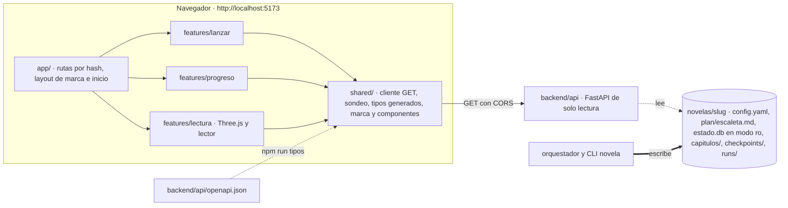

# 0004 — Construir el panel de lanzamiento, progreso y lectura

## 1. Resumen

Se construye `frontend/`, el panel web de solo lectura que `docs/architecture.md` §11.2 describe y que hoy no existe. Tiene tres pantallas: Lanzar prepara la orden que arranca una novela, Progreso muestra por dónde va y si el bucle sigue activo, y Lectura deja leer los capítulos cerrados recorriendo el libro en una escena 3D. Es para el operador humano del harness, que hoy solo puede seguir una novela desde la terminal, y lleva la identidad visual de Qaracter con un acabado que cumple WCAG 2.1 AA; para que las pantallas estén completas, la API de lectura gana cinco consultas sobre datos que ya están en disco.

## 2. Contexto y problema

**No hay panel.** `frontend/` solo contiene recursos de marca todavía sin versionar —el logo, `frontend/src/shared/marca/logo.png`, la fuente display con su licencia y los iconos de Lucide con la suya (ver D31)—, y `docs/validators.md` §2 lo registra: «no hay `frontend/`, así que ni `tsc` ni `eslint`». La API de la spec 0001 sí existe (`backend/api/`), con su OpenAPI commiteado en `backend/api/openapi.json` y un test que lo mantiene al día porque «de él salen los tipos del frontend» (`backend/tests/test_contratos.py::test_openapi_al_dia`), pero nada lo consume.

**Lo que el panel debe mostrar ya está escrito.** `docs/architecture.md` §11.2 fija tres pantallas —Lanzar, Progreso y Lectura— y §3.0 y §3.1 su estructura: `features/lanzar/`, `features/progreso/`, `features/lectura/`, `shared/` y `app/`. El stack es Vite + TypeScript + Three.js, de solo lectura y sin lógica de negocio (`docs/architecture.md` §2, `AGENTS.md` § Monorepo). `backend/api/main.py` ya admite por CORS el origen `http://localhost:5173`, solo con `GET`.

**La API no sirve tres datos que Progreso y Lectura necesitan**, y §11.2 prohíbe calcularlos en el frontend («Si necesita un dato que no está en el estado, se añade al estado, no se calcula en el frontend»):

1. El número de capítulos de la obra, que está en `config.yaml` (`parametros_obra.num_capitulos`).
2. La curva de tensión objetivo, que está en el frontmatter de `plan/escaleta.md` (`curva_tension_objetivo`).
3. Los capítulos cerrados. `novela estado --breve` los cuenta desde `checkpoints/latest.json` (`backend/novela/slices/estado/cmd.py`), no desde el cursor, y la API no sirve checkpoints.

**Con el estado solo, un capítulo en curso no se distingue de un bucle colgado.** `estado.db` cambia una vez por capítulo, en `aplicar-delta` (`docs/architecture.md` §12.6). El dato que los distingue está en `runs/<run_id>/harness.log`, que el CLI vuelca línea a línea (spec 0001, RF-27, comprobado por su CA-13), y §12.6 fija la dirección: dos `GET` más, el listado de runs y un tramo del log por desplazamiento en bytes.

**Tres pasajes de la documentación no encajan entre sí**, y esta spec los resuelve:

- §11.2 dice que el formulario de Lanzar «produce un `config.yaml`», pero ese fichero lo escribe `novela nueva` desde `config/default.yaml` y los flags (spec 0001 §5.0), `AGENTS.md` prohíbe editar `novelas/<slug>/` a mano y §12.8 admite que «nadie ha decidido quién manda, si ese `config.yaml` o los flags del comando». Un `config.yaml` generado por el panel no tendría consumidor (ver D5).
- §3.1 incluye la cuota entre lo que muestra `progreso/`, pero `novela budget` y `runs/quota.json` no existen: las specs 0001 (§1) y 0003 (§1) los dejan fuera (ver D3).
- §11.2 manda añadir al estado lo que falte, pero la configuración y el plan no son estado, y `AGENTS.md` § Las cuatro ramas de contexto prohíbe mezclarlos (ver D4).

**El panel tiene que llevar la marca de Qaracter** y verse profesional y pulido. Lo pidió el usuario, que aportó como referencia una captura de la plataforma interna de Qaracter. De ella salen la paleta, la estructura —barra lateral, barra superior, banner y tarjetas— y el estilo de la tipografía y los iconos, con valores medidos a ojo y aproximados (S6). El usuario aportó después el logo oficial: un PNG cuadrado de 400 × 400 px, sin transparencia en las esquinas, con la condición de que se use siempre con bordes redondeados (ver D23). No hay manual de marca, y la captura choca con restricciones que esta spec ya tenía:

- el blanco sobre el naranja de la marca (aprox. `#F97316`) da 2,8:1, y sobre el del botón primario (aprox. `#FB8C1E`), 2,4:1, por debajo del 4,5:1 de WCAG 2.1 AA que exige D12 (ver D22);
- el texto secundario (aprox. `#6B7280`) sobre el fondo de página (aprox. `#EEF1F5`) da 4,3:1, y el gris del borde de tarjeta (aprox. `#E5E7EB`) da 1,2:1 sobre blanco, por debajo del 3:1 que necesita el borde de un campo (ver D22);
- la plataforma tiene modo oscuro con conmutador y selector de idioma, pero el panel no guarda nada en el navegador (RNF-09) y sus textos solo están en español (D13) (ver D28);
- servir las fuentes o los iconos desde un CDN o como paquetes npm contradice RNF-08 y RF-44 (ver D25).

La captura contiene además nombres, fotos y cargos de personas reales: nada de ella se versiona ni se reproduce (RF-60).

**Por qué ahora.** El backend (0001) está implementado y `.claude/` (0003, aceptada en su v0.5) tiene pendiente la novela de humo de tres capítulos. El modo desatendido corre una sesión por capítulo sin nadie delante de la terminal (`AGENTS.md` § Proceso: ejecución), y el operador necesita seguirlo sin abrir `estado.db` ni leer `harness.log` a mano.

**Relación con otras specs.** La 0001 dejó los `GET` de §12.6 y la cola de §12.8 para specs posteriores (su §1); esta toma los primeros y deja fuera la segunda (ver D1, D2). La 0003 dejó el frontend fuera de su alcance (su §1). La 0002, en borrador, declara la trayectoria del orquestador y la carga de preguntas abiertas «candidatas al panel de progreso; fuera de esta spec» (su §14); aquí siguen fuera (ver D3). Si la 0002 cambia el frontmatter de las pistas (su §8, «ruptura»), cambian los tipos generados del panel y CI lo detecta (RF-39).

## 3. Objetivos y no objetivos

### 3.1 Objetivos

- **O-01** Existen las tres pantallas de §11.2 y una vista de inicio, que funcionan contra la API local sin que el panel emita ninguna petición distinta de `GET` (RNF-06).
- **O-02** El operador distingue un capítulo en curso de un bucle parado sin abrir una terminal: ve las últimas líneas de `harness.log` y la hora de su última escritura, como mucho 3 s después de que se produzca (ver D2).
- **O-03** El contrato API ↔ frontend no puede derivar: los tipos se generan desde el OpenAPI y CI falla ante cualquier diferencia (`docs/validators.md` §3.8).
- **O-04** El panel no abre vías nuevas de inyección, de fuga ni de lectura de disco: 0 elementos activos creados desde el texto del workspace, 0 peticiones a otros orígenes y 0 ficheros de fuera de `frontend/` servidos por el dev server (RNF-07, RNF-08, RNF-10).
- **O-05** Todo el panel se usa solo con teclado y sin WebGL, con 0 violaciones serias o críticas de axe-core (ver D12).
- **O-06** La documentación de referencia describe el panel y los cinco `GET` nuevos en el mismo commit que el código que los introduce.
- **O-07** El panel aplica la identidad visual de Qaracter —paleta, logo, tipografía, iconos y estructura de la captura— sin bajar de WCAG 2.1 AA: 0 pares de tokens por debajo de su umbral, 0 colores literales fuera de `tokens.css`, el logo siempre con bordes redondeados y cada vista y cada componente comprobados en sus estados frente a capturas de referencia aprobadas (ver D21, D22, D23, D27).

### 3.2 No objetivos

- La cola en disco, `POST /cola`, `novela cola tomar|cerrar`, el supervisor y `run.sh` de `docs/architecture.md` §12.8. La API sigue sin verbos de escritura (ver D1).
- Lanzar agentes, ejecutar órdenes o escribir `config.yaml` o cualquier otro fichero desde el panel (ver D5).
- Mostrar la cuota, los informes de `qa/`, los `intervencion.md`, la trayectoria del orquestador o la carga de preguntas abiertas (ver D3).
- Mostrar `canon/` —misterio incluido—, `plan/capitulos/`, `memoria/`, deltas o briefings. La API no los sirve y esta spec no los añade.
- SSE, WebSocket o cualquier transporte distinto del sondeo por `GET` (ver D2).
- Servir `frontend/dist` desde FastAPI, desplegar el panel fuera de la máquina de desarrollo o autenticar usuarios (ver D15).
- Editar o exportar la novela desde el panel: `novela exportar` sigue en el CLI.
- Cambiar los cinco `GET` de la spec 0001, sus parámetros o sus modelos de respuesta (RNF-18).
- Internacionalización (ver D13) y temas alternativos, incluido el modo oscuro (ver D28).
- Diseño para móvil y pantallas táctiles: el panel se usa en la máquina de desarrollo, junto a la API (supuesto S2 de §10).
- Los elementos de la plataforma de referencia que suponen usuarios: avatar, notificaciones y bienvenida personal (ver D24).
- Redibujar, vectorizar o retocar el logo, o descargarlo de la web: se usa el PNG aportado (ver D23).
- Servir fuentes o iconos desde un CDN o desde paquetes npm (ver D25).
- Un sistema de diseño reutilizable fuera de este panel: los tokens y los componentes son de `frontend/`.

## 4. Usuarios y escenarios

| Actor | Relación con el panel |
|---|---|
| Operador humano | Único usuario: prepara el arranque, sigue el bucle y lee los capítulos cerrados |
| Desarrollador del harness | Mantiene `frontend/` y los `GET` nuevos; CI y el pre-commit le avisan si el contrato o las reglas se rompen |
| Orquestador y los siete agentes | No usan el panel ni la API, y su trabajo no cambia. Ninguno tiene herramientas de red (`docs/architecture.md` §7.4) |
| API de lectura (`backend/api/`) | Sirve al panel; gana cinco `GET` y sigue sin escribir |
| Responsable de marca de Qaracter | Ha aportado, a través del usuario, el logo oficial y su condición de uso; aporta el manual de marca si existe y hace la revisión visual frente a la captura (T-22) |

- Como operador, quiero rellenar un formulario y copiar la orden `/novela-nueva` con la idea ya entrecomillada, junto con las órdenes que abren la sesión del harness, para arrancar una novela sin recordar la sintaxis.
- Como operador, quiero ver el cursor, los capítulos cerrados, la tensión real frente a la objetivo y las últimas líneas de `harness.log`, para saber si el bucle avanza o se ha parado.
- Como operador, quiero recorrer el libro en 3D y abrir cualquier capítulo cerrado, para leer la novela mientras se escribe.

## 5. Requisitos funcionales

Las rutas de la API se abrevian a partir de `/novelas/{slug}` (`…/estado`, `…/runs`). Los recursos que pide cada vista, los textos fijos del panel y los tokens, pares, medidas y componentes de la marca están en §8.4.

**Común**

| ID | Requisito (EARS) | Prioridad |
|----|------------------|-----------|
| RF-01 | El sistema debe servir el panel con `npm run dev` desde `frontend/` en `http://localhost:5173`, sin cambiar de puerto si está ocupado, y dirigir sus peticiones a la URL de `VITE_API_URL`, o a `http://127.0.0.1:8000` si no está definida (ver D15). | Must |
| RF-02 | El sistema debe tomar los tipos de toda respuesta de la API de `frontend/src/shared/api/esquema.gen.ts`, generado desde `backend/api/openapi.json`, sin declarar a mano ningún tipo que replique un esquema del OpenAPI. | Must |
| RF-03 | El sistema debe emitir toda petición de red desde el cliente de `frontend/src/shared/api/`, siempre con método `GET` y sin más cabecera que `Accept`. | Must |
| RF-04 | Si una petición a la API falla por red, por superar 5 s o con un código 404, 422 o 5xx, entonces el sistema debe mostrar el motivo —el `detail` de la respuesta cuando lo trae— y mantener en pantalla los últimos datos válidos de la vista, salvo en los casos con tratamiento propio de RF-19 y RF-22, y retirar el aviso en la siguiente ronda correcta: una ronda es correcta solo si todos sus recursos han respondido bien, y el 404 de RF-19 y el 416 de RF-22 cuentan como respuestas correctas (ver D10, D45). | Must |
| RF-05 | Mientras una vista esté visible, el sistema debe pedir cada 10 s los recursos que esa vista declara en §8.4, sin lanzar la petición de un recurso mientras siga en curso la anterior del mismo recurso (ver D10). | Must |
| RF-06 | Mientras la pestaña esté oculta, el sistema no debe lanzar peticiones de sondeo, y cuando vuelva a estar visible debe lanzar una ronda inmediata y retomar la cadencia. | Should |
| RF-07 | Cuando el operador cambie de vista, el sistema debe abortar las peticiones en curso y cancelar los temporizadores de la vista que abandona. | Should |
| RF-08 | El sistema debe mostrar en la vista de inicio una entrada por novela de `GET /novelas`, con su slug y su cursor, y enlaces a su Progreso, a su Lectura y a Lanzar. | Must |
| RF-09 | Si el slug de la ruta no casa `^[a-z0-9-]+$` o el capítulo de la ruta no casa `^[1-9][0-9]{0,2}$` —solo dígitos, sin ceros a la izquierda, sin signo ni espacios—, entonces el sistema debe mostrar «ruta no válida» sin lanzar ninguna petición y sin normalizar la ruta (ver D41). | Must |
| RF-10 | El sistema debe reflejar en el hash de la URL la vista, la novela y el capítulo abierto, de modo que al recargar la página se muestre la misma vista con el mismo capítulo. | Should |

**Lanzar**

| ID | Requisito (EARS) | Prioridad |
|----|------------------|-----------|
| RF-11 | Cuando el operador pida generar la orden con slug e idea —y, si quiere, capítulos y palabras totales—, el sistema debe mostrar `/novela-nueva <slug> --idea '<idea>'`, seguida de `--capitulos <N>` y `--palabras <P>` solo si esos campos se rellenaron, y ofrecer copiarla al portapapeles (ver D5, D6, D44). | Must |
| RF-12 | Si el slug no casa `^[a-z0-9-]+$`, la idea está vacía o solo contiene espacios en blanco Unicode (`\s`, incluidos tabuladores y saltos de línea), capítulos no casa `^[1-9][0-9]{0,2}$`, o palabras no casa `^[1-9][0-9]*$`, entonces el sistema debe mostrar el motivo junto al campo y no generar la orden, sin normalizar ningún valor (ver D41, D42). | Must |
| RF-13 | Si el slug coincide con el de una novela de `GET /novelas`, entonces el sistema debe avisar de que `novela nueva` saldrá con 1 sin tocar nada y no generar la orden; si `GET /novelas` no ha respondido o ha fallado, debe generar la orden sin esa comprobación y mostrar «no se ha podido comprobar si el slug ya existe» (ver D43). | Must |
| RF-14 | El sistema debe poner la idea entre comillas simples y sustituir en ella cada `'` por `'\''`, conservando los saltos de línea, de modo que `--idea '…'` sea un único argumento que bash, interactivo o no, con o sin expansión del historial, expande a la idea original (ver D44). | Must |
| RF-15 | Cuando el sistema muestre una orden generada, debe mostrar también las dos órdenes de apertura de la sesión interactiva del harness de `AGENTS.md` § Proceso: ejecución y la orden `/novela-continuar <slug>`, sin ejecutar ninguna. | Should |
| RF-16 | El sistema no debe producir `config.yaml` ni ningún otro fichero desde Lanzar, ni pedir a la API nada distinto de `GET /novelas` (ver D1, D5). | Must |

**Progreso**

| ID | Requisito (EARS) | Prioridad |
|----|------------------|-----------|
| RF-17 | El sistema debe mostrar en Progreso, tal como los sirve la API, el cursor (`capitulo`, `fase`, `ultimo_paso`, `intento`); los capítulos cerrados como `checkpoint.capitulo` de `parametros_obra.num_capitulos`, con 0 cuando `checkpoint` es `null`; `metricas.palabras_totales` junto a `parametros_obra.longitud_total_palabras`, y `metricas.desviacion_vs_plan` (ver D4, D8). | Must |
| RF-18 | El sistema debe dibujar en Progreso, por capítulo, `tension_real` frente a `curva_tension_objetivo`, con una banda por acto, una marca por cada uno de los cinco puntos de giro y una tabla con los mismos datos; un `null` de `tension_real` se marca «sin puntuar» y no se interpola, y un capítulo sin entrada en `tension_real` no tiene valor real; si todo `tension_real` es `null`, la tarjeta muestra el mismo estado que con `tension_real` vacío, con la curva objetivo dibujada, y si `tension_real` tiene más entradas que la curva objetivo, el eje x llega hasta el mayor de los dos tamaños (ver D4, D12, D46). | Must |
| RF-19 | Si `GET …/escaleta` responde 404, entonces el sistema debe dibujar solo `tension_real` e indicar «el plan todavía no tiene escaleta», sin aviso de error. | Should |
| RF-20 | El sistema debe listar en Progreso los hilos con `estado: "abierto"`, con su `id`, `abierto_en` y `descripcion`. | Must |
| RF-21 | El sistema debe listar en Progreso los manifiestos de `GET …/runs` con `run_id`, `fase`, `capitulo`, `creado`, `sha_commit` y `sucio`, y rotular «árbol sucio» los que tienen `sucio: true`. | Should |
| RF-22 | Mientras Progreso esté visible, el sistema debe pedir cada 3 s el tramo de `harness.log` del run de `run_id` mayor con `desde` igual al último `hasta` recibido, mostrar sus 50 últimas líneas y la hora de `modificado`, y volver a `desde=0` tras una respuesta 416; cuando `…/runs` traiga un run de `run_id` mayor, debe pasar a él con `desde=0` y reconstruir la lista. El operador no elige el run (ver D2, D10, D38). | Should |
| RF-23 | Cuando pasen más de 15 min desde el `modificado` del run de `run_id` mayor, el sistema debe rotular la actividad «sin actividad desde <hora>» (ver D10, D38). | Could |

**Lectura**

| ID | Requisito (EARS) | Prioridad |
|----|------------------|-----------|
| RF-24 | El sistema debe mostrar en Lectura una escena Three.js con un volumen por capítulo de `parametros_obra.num_capitulos`, en fila por número y con un hueco entre actos cuando hay escaleta, cada uno en uno de tres estados: cerrado (`n ≤ checkpoint.capitulo`), en curso (presente en el índice de `GET …/capitulos` y `n > checkpoint.capitulo`) o pendiente (ver D8, D9). | Must |
| RF-25 | Cuando el operador abra un capítulo cerrado —con clic, con Enter o desde la lista—, el sistema debe pedir `GET …/capitulos/{n}`, quitar el bloque de frontmatter inicial y mostrar el cuerpo, renderizado desde markdown, en una capa HTML encabezada por el `titulo` del índice, escrito como texto (ver D16, D56). | Must |
| RF-26 | Si el markdown de un capítulo contiene HTML, enlaces, imágenes, autoenlaces, referencias o URL sueltas, entonces el sistema debe mostrarlos como texto, sin crear elementos `script`, `iframe`, `img`, `a`, `object`, `embed` ni `svg`, ni atributos `on*` (ver D14, D56). | Must |
| RF-27 | Si el operador pide un capítulo que no está cerrado, entonces el sistema debe mostrar «capítulo no disponible todavía» sin pedirlo a la API (ver D8). | Must |
| RF-28 | El sistema debe ofrecer en Lectura una lista HTML de capítulos sincronizada con la selección de la escena, en la que ← y → mueven la selección —sin dar la vuelta: ← en el primer capítulo y → en el último no hacen nada—, Enter abre el capítulo seleccionado y Esc cierra el lector y devuelve el foco a la lista (ver D12, D47). | Must |
| RF-29 | Donde WebGL no esté disponible, el sistema debe mostrar Lectura solo con la lista HTML y el lector, con el aviso «vista 3D no disponible». | Must |
| RF-30 | Mientras `prefers-reduced-motion: reduce` esté activo, el sistema debe llevar la cámara al volumen seleccionado sin animación (ver D12). | Should |
| RF-31 | Cuando el operador salga de Lectura, el sistema debe liberar las geometrías, los materiales, las texturas y el renderer de la escena y retirar su `<canvas>` del DOM. | Should |

**API de lectura**

| ID | Requisito (EARS) | Prioridad |
|----|------------------|-----------|
| RF-32 | El sistema debe servir `GET /novelas/{slug}/config` con el modelo `Config` del `config.yaml` de la novela (ver D4). | Must |
| RF-33 | El sistema debe servir `GET /novelas/{slug}/escaleta` con el modelo `Escaleta` de `plan/escaleta.md`, validado con el `num_capitulos` de la novela, y responder 404 si el fichero falta o no valida (ver D4). | Must |
| RF-34 | El sistema debe servir `GET /novelas/{slug}/checkpoint` con el modelo `Checkpoint` de `checkpoints/latest.json`, o `null` si ese fichero no existe (ver D4, D8). | Must |
| RF-35 | El sistema debe servir `GET /novelas/{slug}/runs` con la lista de `Manifest` de `runs/*/manifest.json`, ordenada por `run_id` ascendente (ver D2). | Should |
| RF-36 | El sistema debe servir `GET /novelas/{slug}/runs/{run_id}/log?desde=<n>` con un `TramoDeLog` que contiene solo líneas completas de `harness.log` que empiezan en el primer límite de línea igual o posterior al byte `desde`, sin `\r\n` ni `\n` finales, hasta 65 536 bytes por respuesta salvo una primera línea más larga, que va sola y entera, y con `hasta` igual al byte siguiente a la última línea devuelta; para ello salta a `desde` sin leer desde el principio y lee como mucho 1 MiB, de modo que ninguna respuesta pasa de 1 MiB (ver D2, D17, D48). | Should |
| RF-37 | Si `desde` es negativo o no es un entero, entonces el sistema debe responder 422; si supera el tamaño del log, 416; si el run no existe, 404; y si el run existe sin `harness.log`, 200 con `lineas: []`, `desde` y `hasta` iguales al `desde` pedido, `tamano: 0` y `modificado: null`, para cualquier `desde` ≥ 0 (ver D17, D48). | Should |
| RF-38 | El sistema no debe escribir en el workspace al atender ningún `GET` de la API, ni exponer en ella operaciones distintas de `GET`: `POST`, `PUT`, `PATCH` y `DELETE` responden 405, y los `HEAD` y `OPTIONS` que Starlette y el middleware de CORS responden solos no cuentan (ver D49). | Must |

**Calidad y contrato**

| ID | Requisito (EARS) | Prioridad |
|----|------------------|-----------|
| RF-39 | Si `frontend/src/shared/api/esquema.gen.ts` difiere del que se genera desde `backend/api/openapi.json`, entonces el sistema debe fallar en CI. | Must |
| RF-40 | El sistema debe ejecutar en CI, sobre `frontend/`, `npm ci`, la comprobación de RF-39, `eslint`, `tsc --noEmit`, los tests unitarios, `vite build` con el presupuesto de tamaño, `npm audit --omit=dev --audit-level=high` y los e2e contra la API real sobre workspaces sintéticos (ver D18, D19). | Must |
| RF-41 | Cuando el índice de un commit contenga ficheros de `frontend/`, el sistema debe ejecutar `npm --prefix frontend run lint` desde `.githooks/pre-commit` y abortar el commit si falla (ver D20). | Should |
| RF-42 | El sistema no debe emitir scores ni leer el `.env` del repositorio al generar los workspaces sintéticos de los e2e: el generador apunta `RAIZ_REPO` a un directorio vacío y quita `TRACE_TO_LANGFUSE` y `LANGFUSE_*` de su entorno, como el fixture `_sin_claves_reales` de `backend/conftest.py` (ver D19). | Must |
| RF-43 | El sistema no debe importar desde `frontend/src/` ficheros de fuera de `frontend/src/` —en particular de `novelas/` o de `backend/`— ni servir desde el dev server de Vite ficheros de fuera de `frontend/`. | Must |
| RF-44 | El sistema debe declarar como dependencias de ejecución de `frontend/package.json` exactamente `three` y `markdown-it`, sin que ninguna dependencia de ese fichero sea un SDK o cliente de un proveedor de modelos (ver D13). | Must |
| RF-45 | El sistema debe describir el panel y los `GET` nuevos en la documentación de referencia en el mismo commit que el código que los introduce: `docs/architecture.md` §3.1, §11.1, §11.2, §12.6 y §12.8; `docs/validators.md` §2, §3.1, §3.2, §3.5, §3.8, §5 y §6; una línea de `TramoDeLog` en `docs/definitions.md`, y una línea en `AGENTS.md` § Proceso: generar código; y, en el commit de cierre (T-23), `docs/validators.md` §3.6, §4.4, §4.7 y §4.9 (ver D20, D33, D34, D37). | Must |

**Marca y acabado**

| ID | Requisito (EARS) | Prioridad |
|----|------------------|-----------|
| RF-46 | El sistema debe definir los colores, las familias tipográficas, los tamaños de letra, los radios, las sombras y los espaciados del panel como propiedades CSS en un único fichero, `frontend/src/shared/marca/tokens.css`, sin colores literales ni declaraciones `font-family` fuera de él, y los componentes solo deben usar sus roles semánticos (ver D21). | Must |
| RF-47 | El sistema debe reservar los tonos vivos de la marca —`--q-naranja-500` y `--q-cian-500`— a los roles decorativos (`--q-deco-*`) y al indicador del ítem activo, y usar en todo texto, icono con significado, borde de campo, serie de la gráfica y contorno de foco los roles de §8.4, cuyos pares declarados en `frontend/src/shared/marca/pares.ts` cumplen RNF-19 (ver D22). | Must |
| RF-48 | El sistema debe mostrar en todas las vistas una barra lateral fija de 270 px con el logo, un bloque «Navegación» con «Novelas» y «Lanzar», un bloque con el slug de la novela de la ruta y sus ítems «Progreso» y «Lectura» cuando la ruta tiene slug, y una zona inferior separada con el estado de la conexión con la API, derivado de las rondas de la vista sin peticiones propias y con «sin datos» en una ruta inválida; el ítem de la vista actual lleva `aria-current="page"`, el fondo `--q-nav-activo-fondo` y el indicador `--q-nav-indicador` (ver D22, D24, D50). | Must |
| RF-49 | El sistema debe mostrar en todas las vistas una barra superior con el botón de plegar la barra lateral, el título de la vista y la hora de la última ronda de sondeo correcta en el sentido de RF-04, que se conserva mientras las rondas fallan (ver D24, D45). | Should |
| RF-50 | Cuando el operador pulse el botón de plegar, el sistema debe reducir la barra lateral a 72 px con solo iconos, mantener el nombre de cada ítem como nombre accesible y cambiar el botón a «Desplegar barra lateral» con `aria-expanded="false"`, sin guardar el estado entre recargas (ver D24). | Should |
| RF-51 | El sistema debe mostrar el logo `frontend/src/shared/marca/logo.png` en un `` de `--q-tamano-logo`, junto al texto «Qaracter», dentro de un contenedor con `border-radius` `--q-radio-logo` (el 22 % del lado) que recorta la imagen, en cualquier sitio en que aparezca (ver D23). | Must |
| RF-52 | Si `logo.png` falta, no es un PNG, no mide 400 × 400 px o pesa más de 80 KB, o si `frontend/public/favicon.png` falta o no cumple RF-61, entonces el sistema debe fallar en CI (ver D23). | Must |
| RF-53 | El sistema debe encabezar Progreso y Lectura con un banner de la novela: el slug como titular en `--q-fuente-display`, un subtítulo en mayúsculas con el `subgenero` y el `num_capitulos` de su config y un chip por cada campo del cursor (`fase`, `capitulo`, `ultimo_paso`, `intento`), con todo el texto en la mitad izquierda, sobre el tramo de `--q-deco-banner-inicio` (ver D22, D24). | Should |
| RF-54 | Mientras la ventana mida 1280 px de ancho o más, el sistema debe presentar Progreso con una fila de cuatro tarjetas de métrica —capítulos cerrados, palabras, desviación e hilos abiertos— y una rejilla de dos columnas con las tarjetas de tensión, hilos, runs y actividad, y por debajo de 1280 px, la rejilla en una columna, sin desplazamiento horizontal en ningún ancho (ver D24). | Should |
| RF-55 | El sistema debe tomar los colores de la escena de Lectura y de la gráfica de tensión de los roles de `tokens.css`, leídos de las propiedades CSS computadas, sin valores propios (ver D21). | Must |
| RF-56 | El sistema debe servir las fuentes y los iconos desde `frontend/`: el cuerpo con la pila de fuentes del sistema, la tipografía display como WOFF2 autoalojado con su licencia junto al fichero y `font-display: swap`, y los iconos como trazados de Lucide copiados en `frontend/src/shared/iconos/` con su licencia y dibujados con `createElementNS` (ver D25, D26). | Must |
| RF-57 | El sistema debe dar a cada componente interactivo de §8.4 estilos distintos de reposo, hover, `focus-visible` y, donde aplique, deshabilitado, con el indicador de foco de RNF-24, transiciones de como mucho 150 ms que se desactivan con `prefers-reduced-motion: reduce` y un foco que sigue visible con `forced-colors: active` (ver D27). | Must |
| RF-58 | El sistema debe mostrar en cada vista un esqueleto con las medidas finales mientras llegan los primeros datos, el texto de vacío de §8.4 en cada tarjeta sin datos y el aviso de RF-04 ante un fallo (ver D27). | Must |
| RF-59 | El sistema no debe mostrar avatar, notificaciones, bienvenida personal, conmutador de modo oscuro ni selector de idioma, y debe declarar `color-scheme: light` y `lang="es"` (ver D24, D28). | Should |
| RF-60 | El sistema no debe versionar la captura de la plataforma interna de Qaracter ni imágenes, fixtures o textos con nombres, fotos o cargos de personas reales: las únicas imágenes de `frontend/` son `logo.png`, `favicon.png` y las referencias de regresión visual del panel sobre los workspaces sintéticos. | Must |
| RF-61 | El sistema debe usar como favicon `frontend/public/favicon.png`, derivado de `logo.png` a 64 × 64 px con las esquinas transparentes recortadas con el mismo radio proporcional de `--q-radio-logo`, enlazado desde `index.html` con `<link rel="icon" type="image/png">` (ver D23). | Should |

## 6. Requisitos no funcionales

| ID | Categoría | Requisito | Métrica | Umbral |
|----|-----------|-----------|---------|--------|
| RNF-01 | Rendimiento | JavaScript inicial del panel, sin el chunk de Lectura | Tamaño gzip de los chunks de `dist/assets/` que carga `index.html` | ≤ 100 KB (ver D11) |
| RNF-02 | Rendimiento | Chunk de Lectura: Three.js, `markdown-it`, escena y lector | Tamaño gzip | ≤ 300 KB (ver D11) |
| RNF-03 | Rendimiento | Coste de la escena independiente del número de capítulos | Draw calls por fotograma (`renderer.info.render.calls`) con 24 y con 999 capítulos | ≤ 5 (ver D11) |
| RNF-04 | Rendimiento | Fluidez de la escena en la máquina de desarrollo | Fotogramas por segundo, mediana de 10 s navegando `demo-24` | ≥ 30 (ver D11) |
| RNF-05 | Rendimiento | Carga del sondeo sobre la API | Peticiones por minuto de una pestaña visible en Progreso; peticiones con la pestaña oculta después de la ronda en curso | ≤ 60; 0 (ver D10, D11) |
| RNF-06 | Seguridad | El panel no pide escrituras | Peticiones con método distinto de `GET` durante el recorrido e2e completo | 0 |
| RNF-07 | Seguridad | El texto del workspace no se ejecuta en el navegador | Elementos `script`, `iframe`, `img`, `a`, `object`, `embed` y `svg` y atributos `on*` en el lector tras renderizar el capítulo hostil de CA-26 | 0 |
| RNF-08 | Privacidad y protección de datos | El panel no envía nada fuera de la máquina | Peticiones a orígenes distintos de `http://localhost:5173` y del de la API durante el recorrido e2e | 0 |
| RNF-09 | Privacidad y protección de datos | El panel no guarda datos de las novelas en el navegador | Entradas en `localStorage`, `sessionStorage`, IndexedDB y cookies tras el recorrido e2e | 0 |
| RNF-10 | Seguridad | El dev server no expone el repositorio | Ficheros de fuera de `frontend/` que `vite` sirve por `/@fs/` | 0 (responde 403) |
| RNF-11 | Seguridad | Dependencias de ejecución sin vulnerabilidades conocidas graves | Avisos `high` o `critical` de `npm audit --omit=dev` | 0 |
| RNF-12 | Accesibilidad | Inicio, Lanzar, Progreso y Lectura con el lector abierto | Violaciones de impacto `serious` o `critical` de axe-core con las reglas WCAG 2.1 A y AA | 0 (ver D12) |
| RNF-13 | Accesibilidad | Recorrido completo con teclado: abrir una novela, ver su progreso, abrir y cerrar un capítulo y copiar una orden | Pasos que exigen ratón | 0 (ver D12) |
| RNF-14 | Compatibilidad | Navegadores de la máquina de desarrollo | Specs e2e en verde en Chromium y en Firefox, con las versiones que fija el lockfile de Playwright | 100 % |
| RNF-15 | Disponibilidad | Recuperación tras una caída de la API de hasta 60 s | Rondas de sondeo, desde que la API vuelve, hasta mostrar datos nuevos sin recargar | ≤ 1 |
| RNF-16 | Observabilidad | El panel no falla en silencio | Mensajes `console.error` y eventos `pageerror` durante los e2e, sin contar los que emite el navegador por el fallo que provocan a propósito los escenarios sin WebGL, con `logo.png` que no carga y con la fuente display retrasada o fallida; un error del código del panel, Three.js incluido, cuenta siempre | 0 (ver D54) |
| RNF-17 | Rendimiento | Lectura del log por la API | Tiempo de `GET …/log?desde=0` sobre un `harness.log` de 1 MiB en `TestClient`; bytes de líneas por respuesta; bytes leídos de `harness.log` por petición, también con `desde` cerca del final de un log de 8 MiB | < 200 ms; ≤ 65 536 salvo una única línea mayor, y nunca más de 1 MiB; ≤ 1 MiB más el byte anterior a `desde` (ver D11, D17, D48) |
| RNF-18 | Compatibilidad | Los cinco `GET` de la spec 0001 | Cambios en sus rutas, parámetros o esquemas de respuesta en `backend/api/openapi.json` | 0 |
| RNF-19 | Accesibilidad | Contraste de la marca, incluidos el banner y los elementos no textuales, que axe no calcula | Pares de `pares.ts` por debajo de 4,5:1 (texto), 3:1 (texto grande) o 3:1 (no textual), calculados desde `tokens.css` con las transparencias compuestas sobre su fondo | 0 (ver D22) |
| RNF-20 | Rendimiento | Recursos de marca | Tamaño de los WOFF2 que carga el panel; tamaño gzip del CSS de `dist/assets/`; tamaño conjunto de `logo.png` y `favicon.png` en `dist/` | ≤ 60 KB; ≤ 20 KB; ≤ 80 KB (ver D23, D25, D52) |
| RNF-21 | Calidad visual | Estabilidad de la disposición al cargar | Cambio de disposición acumulado (CLS) de cada vista en Chromium, desde la navegación hasta los primeros datos | ≤ 0,1 (ver D27) |
| RNF-22 | Calidad visual | Regresión visual | Proporción de píxeles distintos de cada captura, por vista y estado y por componente y estado, frente a su referencia aprobada, en Chromium a 1440 × 900 en la imagen de Playwright del CI | ≤ 0,1 % (ver D27) |
| RNF-23 | Calidad visual | Fidelidad a las medidas de la marca | Valores computados de las medidas de §8.4 que difieren de su token | 0 (ver D27) |
| RNF-24 | Accesibilidad | Foco visible | Elementos interactivos que, enfocados con teclado, no muestran un `outline` de al menos 2 px en `--q-foco` o `--q-foco-sobre-oscuro` | 0 (ver D27) |

En todos los presupuestos de tamaño, 1 KB son 1 000 bytes (ver D52).

## 7. Criterios de aceptación

Los workspaces `demo-24`, `recien-creada` y `grande-999` son los sintéticos de §13, generados sin llamar a ningún modelo. «Reloj simulado» es el de Vitest en los unitarios y `page.clock` de Playwright en los e2e.

### CA-01 (cubre RF-01)
- **Dado** `frontend/` con sus dependencias instaladas por `npm ci` y el puerto 5173 ocupado por otro proceso
- **Cuando** se arranca el dev server con la configuración de `frontend/vite.config.ts`
- **Entonces** el arranque falla en vez de escuchar en otro puerto; con el puerto libre, escucha en `http://localhost:5173`; y sin `VITE_API_URL`, el cliente construye sus URL sobre `http://127.0.0.1:8000`

### CA-02 (cubre RF-02)
- **Dado** `backend/api/openapi.json` commiteado
- **Cuando** se ejecuta `npm run tipos:comprobar`
- **Entonces** sale con 0 sin diferencias en `src/shared/api/esquema.gen.ts`, y una búsqueda en `frontend/src/` fuera de ese fichero no encuentra declaraciones `interface` ni `type` con el nombre de ningún esquema de `components.schemas` del OpenAPI

### CA-03 (cubre RF-03)
- **Dado** el cliente de `frontend/src/shared/api/cliente.ts` con `fetch` sustituido por un espía
- **Cuando** se invoca cada una de sus funciones
- **Entonces** cada llamada lleva método `GET` y como única cabecera `Accept`; y `npm run lint` marca como error un fichero de fixture que usa `fetch`, `XMLHttpRequest`, `WebSocket` o `EventSource` fuera de `frontend/src/shared/api/`

### CA-04 (cubre RF-04)
- **Dado** Progreso de `demo-24` con los datos de una ronda correcta en pantalla
- **Cuando** la ronda siguiente de `GET …/estado` responde 404 con `{"detail": "no existe la novela demo-24"}`, o la red falla, o la respuesta tarda más de 5 s
- **Entonces** se muestra un aviso con ese `detail`, con «API no disponible en http://127.0.0.1:8000» o con «la API no respondió en 5 s», y el cursor y la gráfica de la ronda anterior siguen visibles; y en la siguiente ronda en que todos los recursos responden bien, el aviso desaparece

### CA-05 (cubre RF-05)
- **Dado** Progreso visible con el reloj simulado en t = 0
- **Cuando** el reloj avanza 30 s
- **Entonces** cada uno de los seis recursos de Progreso de §8.4 se ha pedido 4 veces; y si la petición de `estado` lanzada en t = 0 tarda 15 s, en t = 10 s no se lanza otra de `estado`

### CA-06 (cubre RF-06)
- **Dado** Progreso visible con el reloj simulado
- **Cuando** `document.visibilityState` pasa a `hidden` durante 60 s y después vuelve a `visible`
- **Entonces** no se lanza ninguna petición durante esos 60 s y, al volver, se lanza una ronda completa antes de que el reloj avance 100 ms

### CA-07 (cubre RF-07)
- **Dado** Progreso con peticiones en curso
- **Cuando** el operador navega a `#/novelas/demo-24/lectura`
- **Entonces** las señales de esas peticiones quedan abortadas y, con el reloj avanzado 30 s, no se lanza ninguna petición propia de Progreso (`…/estado`, `…/runs` ni `…/log`)

### CA-08 (cubre RF-08)
- **Dado** la API sobre los workspaces `demo-24` y `recien-creada`
- **Cuando** se abre `#/`
- **Entonces** hay dos entradas, cada una con su slug, `capitulo`, `fase` y `ultimo_paso`, y enlaces a `#/novelas/<slug>/progreso`, a `#/novelas/<slug>/lectura` y a `#/lanzar`

### CA-09 (cubre RF-09)
- **Dado** el panel cargado con un espía de red
- **Cuando** se navega a `#/novelas/..%2Fetc/progreso`, a `#/novelas/Demo/progreso`, a `#/novelas/demo-24/lectura/0`, a `#/novelas/demo-24/lectura/07`, a `#/novelas/demo-24/lectura/+3` o a `#/novelas/demo-24/lectura/1000`
- **Entonces** se muestra «ruta no válida», la ruta no se normaliza, la zona de estado de la barra lateral muestra «sin datos» y el espía no registra ninguna petición

### CA-10 (cubre RF-10)
- **Dado** el lector abierto en el capítulo 3 de `demo-24`
- **Cuando** se recarga la página
- **Entonces** la URL es `#/novelas/demo-24/lectura/3` y el lector vuelve a mostrar el capítulo 3

### CA-11 (cubre RF-11)
- **Dado** el formulario con slug `nueva-prueba`, idea `Un faro apagado.`, capítulos `3` y palabras `9000`
- **Cuando** se pulsa «Generar»
- **Entonces** la orden es exactamente `/novela-nueva nueva-prueba --idea 'Un faro apagado.' --capitulos 3 --palabras 9000` y «Copiar» la escribe en el portapapeles; con capítulos y palabras vacíos, la orden es `/novela-nueva nueva-prueba --idea 'Un faro apagado.'`

### CA-12 (cubre RF-12)
- **Dado** el formulario
- **Cuando** el slug es `Nueva_Prueba`, la idea son tres espacios o un tabulador y un salto de línea, capítulos vale `0`, `1000`, `2.5`, `07`, ` 3` o `+3`, o palabras vale `0`, `09000` o `-1`
- **Entonces** cada campo inválido muestra su motivo, ningún valor se normaliza y no se genera ninguna orden; y con capítulos `1` y palabras `1`, o con capítulos `999`, sí se genera

### CA-13 (cubre RF-13)
- **Dado** `GET /novelas` con la novela `demo-24`
- **Cuando** el slug del formulario es `demo-24`
- **Entonces** se muestra «ya existe una novela demo-24: novela nueva saldrá con 1 sin tocar nada» y no se genera ninguna orden; y si `GET /novelas` ha fallado o no ha respondido, la orden se genera junto al aviso «no se ha podido comprobar si el slug ya existe»

### CA-14 (cubre RF-14)
- **Dado** un generador de fast-check de ideas no vacías, con al menos 200 casos, que incluyen comillas simples y dobles, barras invertidas —también al final y ante un salto de línea—, `$`, `$(…)`, acentos graves, `!`, saltos de línea, tildes y eñes, y bash en el `PATH`, también en Windows con Git Bash (ver D36)
- **Cuando** se extrae de la orden el argumento `--idea '…'` y bash ejecuta `printf %s` con ese argumento, una vez tal cual y otra con `set -H` activado
- **Entonces** en las dos ejecuciones la salida de bash es exactamente la idea generada y no se ejecuta ninguna orden; y sin bash en el `PATH`, el test falla con un mensaje que lo nombra, sin saltarse

### CA-15 (cubre RF-15)
- **Dado** una orden generada para `nueva-prueba`
- **Cuando** se muestra
- **Entonces** bajo ella aparecen `export NOVELA_SESSION_ID=$(python -c "import uuid; print(uuid.uuid4())")`, `claude --session-id "$NOVELA_SESSION_ID" --setting-sources project,local --model opus` y `/novela-continuar nueva-prueba`, y ningún control de la vista ejecuta órdenes

### CA-16 (cubre RF-16)
- **Dado** el recorrido e2e de Lanzar: rellenar, generar y copiar
- **Cuando** termina
- **Entonces** no se ha producido ninguna descarga y las únicas peticiones a la API han sido `GET /novelas`

### CA-17 (cubre RF-17)
- **Dado** `demo-24`, con 7 capítulos cerrados, `num_capitulos` 24 y el cursor que sirve `GET …/estado`
- **Cuando** se abre su Progreso
- **Entonces** se muestran los cuatro campos del cursor tal cual, «cerrados: 7 de 24», `palabras_totales` junto a `longitud_total_palabras` y `desviacion_vs_plan`; y con `GET …/checkpoint` a `null`, «cerrados: 0 de 24»

### CA-18 (cubre RF-18)
- **Dado** `tension_real` `[4, 5, null, 6, 7]`, una `curva_tension_objetivo` de 6 valores, actos con capítulos `[1, 2]` y `[3, 4, 5, 6]` y los cinco puntos de giro
- **Cuando** se construye la serie de la gráfica
- **Entonces** la línea real tiene dos tramos, capítulos 1–2 y 4–5; el 3 lleva la marca «sin puntuar»; el 6 no tiene valor real; hay 2 bandas de acto y 5 marcas de giro; y la tabla tiene 6 filas, con «sin puntuar» en la 3 y «—» en la 6; con `tension_real` `[null, null]`, la tarjeta muestra «todavía no hay tensión puntuada» con la curva objetivo dibujada, como con `tension_real` vacío; y con 8 entradas reales y la curva de 6, el eje x y la tabla llegan al capítulo 8

### CA-19 (cubre RF-19)
- **Dado** `recien-creada`, sin `plan/escaleta.md`
- **Cuando** se abre su Progreso
- **Entonces** la gráfica solo tiene la serie real, aparece «el plan todavía no tiene escaleta» y el resto de la vista se muestra sin aviso de error

### CA-20 (cubre RF-20)
- **Dado** un estado con `hil-001` abierto en el capítulo 1 y `hil-002` cerrado
- **Cuando** se muestra Progreso
- **Entonces** la lista de hilos abiertos contiene solo `hil-001`, con `abierto_en` 1 y su `descripcion`

### CA-21 (cubre RF-21)
- **Dado** `GET …/runs` con dos manifiestos, el segundo con `sucio: true`
- **Cuando** se muestra Progreso
- **Entonces** la tabla tiene dos filas en orden de `run_id` con los seis campos, y solo la segunda lleva el texto «árbol sucio»

### CA-22 (cubre RF-22)
- **Dado** el run de `run_id` mayor con un `harness.log` de 120 líneas y el reloj simulado
- **Cuando** se abre Progreso y el reloj avanza 6 s
- **Entonces** la primera petición del tramo lleva `desde=0` y cada siguiente el `hasta` de la anterior, y se ven las 50 últimas líneas y la hora de `modificado`; y si una respuesta es 416, la petición siguiente vuelve a `desde=0` y la lista se reconstruye; y cuando `…/runs` trae un run de `run_id` mayor, la primera petición a su log lleva `desde=0`, las líneas mostradas son las de ese log y no se pide más el anterior

### CA-23 (cubre RF-23)
- **Dado** un tramo con `modificado` 16 min anterior al reloj simulado
- **Cuando** se muestra la actividad
- **Entonces** aparece «sin actividad desde <hora de modificado>»; con 14 min, no aparece

### CA-24 (cubre RF-24)
- **Dado** `demo-24` con `checkpoint.capitulo` 7, `capitulos/08.md` en el índice y una escaleta de 3 actos
- **Cuando** se abre Lectura
- **Entonces** la escena tiene 24 volúmenes (`data-volumenes="24"`): del 1 al 7 cerrados, el 8 en curso y del 9 al 24 pendientes; la función de disposición da una x estrictamente creciente con el número, y la distancia entre el último volumen de un acto y el primero del siguiente es mayor que entre dos volúmenes del mismo acto

### CA-25 (cubre RF-25)
- **Dado** Lectura de `demo-24`
- **Cuando** se selecciona el capítulo 3 y se pulsa Enter
- **Entonces** se pide `GET /novelas/demo-24/capitulos/3`, el lector muestra como encabezado el `titulo` del capítulo 3 del índice y su cuerpo en HTML, y el texto visible no contiene `run_id:` ni la línea `---` inicial del frontmatter; y con un índice de fixture cuyo `titulo` es ``, el `textContent` del encabezado es ese literal y el lector no contiene ningún `img`

### CA-26 (cubre RF-26)
- **Dado** un capítulo con `<script>alert(1)</script>`, ``, `<iframe src="http://ejemplo.invalid">`, `[pulsa](javascript:alert(1))`, ``, `<http://ejemplo.invalid>`, `[a][r]` con `[r]: javascript:alert(1)`, `![x][i]` con `[i]: http://ejemplo.invalid/x.png`, `http://ejemplo.invalid` suelto, `<svg onload=alert(1)>` y `[x](data:text/html,hola)`
- **Cuando** se renderiza en el lector, en jsdom y en el e2e con un espía de red
- **Entonces** el contenedor no tiene elementos `script`, `iframe`, `img`, `a`, `object`, `embed` ni `svg`, ningún atributo empieza por `on`, los once fragmentos aparecen como texto y no sale ninguna petición a `ejemplo.invalid`; y `lector.ts` tiene exactamente una inserción de HTML, alimentada por la salida de `markdown-it`, con un único `eslint-disable-next-line` de `no-unsanitized` y sin excepción por fichero en `eslint.config.js`

### CA-27 (cubre RF-27)
- **Dado** `demo-24` con `checkpoint.capitulo` 7
- **Cuando** se navega a `#/novelas/demo-24/lectura/8`
- **Entonces** se muestra «capítulo no disponible todavía» y no se pide `GET /novelas/demo-24/capitulos/8`

### CA-28 (cubre RF-28)
- **Dado** Lectura con el capítulo 3 seleccionado
- **Cuando** se pulsa →, después Enter y después Esc
- **Entonces** la selección pasa al 4 en la escena y en la lista (`aria-current` en el 4), Enter abre el lector del 4, y Esc lo cierra y deja el foco en el elemento 4 de la lista; y con el 1 seleccionado, ← lo deja en el 1, y con el 24, → lo deja en el 24

### CA-29 (cubre RF-29)
- **Dado** Chromium lanzado sin WebGL, o una escena que recibe `webglcontextlost`
- **Cuando** se abre Lectura de `demo-24`
- **Entonces** no queda ningún `<canvas>` de la escena, aparece «vista 3D no disponible», y la lista y el lector abren y cierran el capítulo 3

### CA-30 (cubre RF-30)
- **Dado** `prefers-reduced-motion: reduce` emulado
- **Cuando** se cambia la selección del 3 al 4
- **Entonces** la duración de la transición de cámara es 0 ms y, en el fotograma siguiente, la cámara ya apunta al volumen 4

### CA-31 (cubre RF-31)
- **Dado** Lectura montada con una fábrica de renderer inyectada que registra cada `dispose()`
- **Cuando** se navega a Progreso
- **Entonces** se ha llamado a `dispose()` de cada geometría, material y textura creados y del renderer, y no queda ningún `<canvas>` de la escena en el DOM

### CA-32 (cubre RF-32)
- **Dado** el workspace `demo-24`
- **Cuando** se pide `GET /novelas/demo-24/config`
- **Entonces** responde 200 con un documento que valida contra `Config` y es igual al modelo `Config` validado desde el `config.yaml` del workspace, valores por defecto incluidos, no al YAML literal (ver D53); `GET /novelas/no-existe/config` responde 404; y `GET /novelas/..%2F..%2Fetc/config` responde 422 sin abrir ningún fichero fuera de `backend/`

### CA-33 (cubre RF-33)
- **Dado** `demo-24` con su plan y `recien-creada` sin él
- **Cuando** se pide `GET /novelas/<slug>/escaleta` para cada uno
- **Entonces** `demo-24` responde 200 con `curva_tension_objetivo` de 24 valores y `recien-creada` responde 404

### CA-34 (cubre RF-34)
- **Dado** `demo-24` con 7 capítulos cerrados y `recien-creada` sin checkpoints
- **Cuando** se pide `GET /novelas/<slug>/checkpoint` para cada uno
- **Entonces** `demo-24` responde 200 con el contenido de su `checkpoints/latest.json`, con `capitulo: 7`, y `recien-creada` responde 200 con `null`

### CA-35 (cubre RF-35)
- **Dado** `demo-24`, con un run por capítulo cerrado
- **Cuando** se pide `GET /novelas/demo-24/runs`
- **Entonces** la respuesta tiene un `Manifest` por cada `runs/*/manifest.json`, ordenados por `run_id` ascendente

### CA-36 (cubre RF-36)
- **Dado** un contenido de `harness.log` generado por Hypothesis, con líneas UTF-8 que incluyen caracteres multibyte, líneas vacías, líneas terminadas en `\r\n` y líneas más largas que el tope, un tope de al menos 1 byte y un `desde` inicial arbitrario entre 0 y el tamaño
- **Cuando** se encadenan tramos desde ese `desde`, con el `hasta` de cada respuesta, hasta que una respuesta no trae líneas
- **Entonces** la concatenación de `lineas` es exactamente la lista de líneas completas del log, sin `\r\n` ni `\n` finales, que empiezan en el primer límite de línea igual o posterior al `desde` inicial; en cada tramo, `desde ≤ hasta ≤ tamano`, `hasta` es un límite de línea y ninguna línea contiene `\n`; y los bytes devueltos no pasan del tope salvo cuando el tramo es una única línea más larga que él; y, aparte de la propiedad, una línea de más de 1 MiB da un tramo sin líneas con `hasta` = `desde` + 1 MiB, y el tramo siguiente empieza en la línea posterior (ver D48)

### CA-37 (cubre RF-37)
- **Dado** `demo-24`
- **Cuando** se pide `…/log` con `desde=-1`, con `desde=abc`, con un `desde` mayor que el tamaño del log, con un `run_id` bien formado que no existe y con un run sin `harness.log`, con `desde=0` y con `desde=5`
- **Entonces** responde, en ese orden, 422, 422, 416, 404, 200 con `{"desde": 0, "hasta": 0, "tamano": 0, "modificado": null, "lineas": []}` y 200 con `{"desde": 5, "hasta": 5, "tamano": 0, "modificado": null, "lineas": []}`; con `desde` igual al tamaño, 200 sin líneas y con `hasta` igual a `tamano`; y `GET /novelas/demo-24/runs/..%2F..%2Fconfig.yaml/log` no responde 200 ni abre ningún fichero fuera de `backend/`

### CA-38 (cubre RF-38)
- **Dado** `demo-24` montado en solo lectura con el fixture `solo_lectura` de `backend/tests/test_api.py`
- **Cuando** se recorren los diez `GET` de §8.4 con parámetros que responden 200, y después se pide cada una de esas rutas con `POST`, `PUT`, `PATCH` y `DELETE`
- **Entonces** todos los `GET` responden 200, los otros cuatro métodos responden 405, la huella del workspace no cambia y el OpenAPI de la app no tiene ninguna operación distinta de `get` (ver D49)

### CA-39 (cubre RF-39)
- **Dado** un cambio en `backend/api/openapi.json` sin regenerar `esquema.gen.ts`
- **Cuando** se ejecuta `npm run tipos:comprobar`
- **Entonces** sale con un código distinto de 0 y nombra el fichero con diferencias

### CA-40 (cubre RF-40)
- **Dado** un push a cualquier rama
- **Cuando** corre `.github/workflows/ci.yml`
- **Entonces** los jobs `frontend` y `frontend-e2e` ejecutan cada paso de RF-40 y el workflow falla si falla cualquiera; y un chunk que excede su presupuesto de RNF-01 o RNF-02 hace salir a `npm run presupuesto` con un código distinto de 0

### CA-41 (cubre RF-41)
- **Dado** un repositorio git temporal con `.githooks/pre-commit` como hook y `npm` sustituido en el `PATH` por un script que registra sus argumentos y sale con 1
- **Cuando** se hace `git commit` con un fichero de `frontend/` en el índice, y después con solo ficheros fuera de `frontend/`
- **Entonces** el primer commit se aborta y el script registra `--prefix frontend run lint`; en el segundo, `npm` no se invoca; y el test pasa igual en Linux y en Windows con Git Bash en el `PATH`, comprobando que el registro del `npm` falso existe (ver D36)

### CA-42 (cubre RF-42)
- **Dado** el entorno con `TRACE_TO_LANGFUSE` a `true` y `LANGFUSE_PUBLIC_KEY`, `LANGFUSE_SECRET_KEY` y `LANGFUSE_BASE_URL` con los valores ficticios `dummy-publica`, `dummy-secreta` y `http://ejemplo.invalid`, `run.RAIZ_REPO` apuntando a un directorio con un `.env` de prueba con esos valores, el autouse `_sin_claves_reales` desactivado para este test y `langfuse.desde_entorno` sustituido por un registrador
- **Cuando** el test comprueba primero que ve esas claves en el entorno y ese `.env` en `run.RAIZ_REPO` (control positivo), y después `tests.fixtures.panel.generar(destino)` construye los tres workspaces
- **Entonces** el control positivo pasa; ningún entorno que recibe el registrador contiene `TRACE_TO_LANGFUSE` ni `LANGFUSE_*`, `run.RAIZ_REPO` apunta durante la generación a un directorio sin `.env`, y al terminar el entorno y `run.RAIZ_REPO` vuelven a su valor anterior; y ejecutado como orden (`python -m tests.fixtures.panel <destino>`) en un subproceso con esas variables y `LANGFUSE_BASE_URL` apuntando a un servidor HTTP local que cuenta peticiones, sale con 0, crea los tres workspaces y el servidor recibe 0 peticiones (ver D56)

### CA-43 (cubre RF-43)
- **Dado** un fichero de fixture de `src/` que importa `../../novelas/demo/canon/misterio.md?raw` y otro que importa desde `../../backend/`
- **Cuando** se ejecuta `npm run lint`
- **Entonces** los dos son error; y con el dev server de Vite arrancado desde su API, una vez con `frontend/` como directorio de trabajo y otra con la raíz del repositorio: `/@fs/<raíz>/frontend/src/main.ts` responde 200 (control positivo); `/@fs/<raíz>/AGENTS.md` responde 403; y `/@fs/<raíz>/novelas/demo-24/canon/misterio.md`, `/@fs/<raíz>/backend/api/main.py`, `/@fs/<raíz>/frontend/../AGENTS.md`, `/%2e%2e/AGENTS.md`, `/../AGENTS.md` y `/src/../../AGENTS.md?raw` no responden 200 y ningún cuerpo contiene `# AGENTS.md` ni texto del canon (ver D56)

### CA-44 (cubre RF-44)
- **Dado** `frontend/package.json`
- **Cuando** corre el test de dependencias
- **Entonces** `dependencies` tiene exactamente `three` y `markdown-it`, y ni `dependencies` ni `devDependencies` contienen `@anthropic-ai/*`, `openai`, `@google/generative-ai`, `langchain`, `@langchain/*` ni `ai`

### CA-45 (cubre RF-45)
- **Dado** cada commit que introduce código de esta spec
- **Cuando** se revisa
- **Entonces** actualiza las secciones de documentación que §12 asigna a su tarea y, desde el primero que crea `frontend/`, `docs/validators.md` §2 ya no dice que `frontend/` no existe; y el commit de cierre (T-23) actualiza `docs/validators.md` §3.6, §4.4, §4.7 y §4.9 (ver D37)

### CA-46 (cubre RF-46)
- **Dado** `frontend/src/`
- **Cuando** corre `frontend/src/shared/marca/tokens.test.ts`
- **Entonces** ningún fichero `.ts` ni `.css` que no sea un test ni `src/shared/marca/tokens.css` contiene un color literal —`#` con 3, 4, 6 u 8 cifras hexadecimales, `rgb(`, `rgba(`, `hsl(`, `hsla(`, `hwb(`, `lab(`, `lch(`, `oklch(`, cualquier color con nombre de CSS (`white`, `black`, `orange`, `gray`, `red`…) como valor, o un entero `0x` de 6 cifras— ni una declaración `font-family`, con `transparent`, `currentColor` e `inherit` como únicas palabras clave permitidas (ver D51); toda `var(--q-…)` que usan los componentes está definida en `tokens.css`; y ningún componente usa un primitivo de §8.4 en lugar de un rol

### CA-47 (cubre RF-47)
- **Dado** `tokens.css` y `frontend/src/shared/marca/pares.ts`
- **Cuando** corre `frontend/src/shared/marca/pares.test.ts`
- **Entonces** `--q-naranja-500` y `--q-cian-500`, fuera de su propia definición, solo aparecen en la definición de roles `--q-deco-*` y de `--q-nav-indicador`; ningún par de tipo `texto` o `texto-grande` usa un rol `--q-deco-*` como primer plano; y cada par cumple RNF-19

### CA-48 (cubre RF-48)
- **Dado** el panel sobre `demo-24`
- **Cuando** se abre `#/novelas/demo-24/progreso`, y después `#/`
- **Entonces** en la primera ruta la barra lateral, de 270 px, muestra el logo, «Novelas» y «Lanzar» y, bajo `demo-24`, «Progreso» y «Lectura»; solo «Progreso» lleva `aria-current="page"`, el fondo `--q-nav-activo-fondo` y el indicador; la zona inferior muestra «API conectada» y la URL de la API, o «API sin respuesta» con la API caída; y en `#/` no aparece el bloque de la novela

### CA-49 (cubre RF-49)
- **Dado** Progreso con el reloj simulado a las 10:00:00 y una ronda correcta en ese instante
- **Cuando** se muestra la barra superior y, 10 s después, una ronda falla
- **Entonces** contiene el botón «Plegar barra lateral», el título «Progreso» y «Actualizado a las 10:00:00», y la hora sigue siendo esa tras la ronda fallida

### CA-50 (cubre RF-50)
- **Dado** la barra lateral desplegada
- **Cuando** se pulsa «Plegar barra lateral» y después se recarga la página
- **Entonces** la barra mide 72 px y solo muestra iconos, cada ítem conserva su nombre accesible, el botón pasa a «Desplegar barra lateral» con `aria-expanded="false"`, y tras recargar la barra vuelve desplegada con `localStorage`, `sessionStorage` y las cookies vacíos

### CA-51 (cubre RF-51)
- **Dado** el panel en Chromium, con la barra lateral desplegada y después plegada
- **Cuando** se recorren todos los elementos `img` cuyo `src` apunta a `logo.png`
- **Entonces** cada uno lleva `alt="Qaracter"` y mide `--q-tamano-logo`, y en el estilo computado de su contenedor `border-top-left-radius`, `border-top-right-radius`, `border-bottom-left-radius` y `border-bottom-right-radius` son distintos de 0 e iguales al 22 % del lado, y `overflow` es `hidden` o `clip`, o `clip-path` no es `none`; y el píxel de la esquina superior izquierda del logo en una captura del elemento tiene el color del fondo de la barra lateral, no el del PNG

### CA-52 (cubre RF-52)
- **Dado** un `logo.png` de fixture que no es PNG, otro de 200 × 200 px, otro de 90 KB y la ausencia del fichero
- **Cuando** `frontend/src/shared/marca/logo.test.ts` les aplica la comprobación del logo
- **Entonces** los cuatro fallan con su motivo; el `logo.png` real pasa —firma PNG, 400 × 400 px y como mucho 80 000 bytes—; y la comprobación del favicon de CA-61 también corre en CI

### CA-53 (cubre RF-53)
- **Dado** Progreso de `demo-24`
- **Cuando** se muestra el banner
- **Entonces** su titular es `demo-24` en `--q-fuente-display`; el subtítulo, en mayúsculas, lleva la etiqueta del `subgenero` de su config y «24 CAPÍTULOS»; hay un chip por cada campo del cursor; y la caja de todo su texto queda dentro de la mitad izquierda del banner

### CA-54 (cubre RF-54)
- **Dado** Progreso de `demo-24`
- **Cuando** la ventana mide 1440 × 900 y después 1024 × 900
- **Entonces** a 1440 px hay una fila con las cuatro tarjetas de métrica y una rejilla de dos columnas con las tarjetas de tensión, hilos, runs y actividad; a 1024 px la rejilla tiene una columna; y en ningún ancho hay desplazamiento horizontal

### CA-55 (cubre RF-55)
- **Dado** el lector de tokens del panel alimentado con `tokens.css`
- **Cuando** se construyen la serie de la gráfica y los materiales de la escena, y después se cambia en el test el valor de `--q-primario`
- **Entonces** los colores de las series, las bandas y las marcas de la gráfica, de cada estado de volumen, del contorno de selección y del fondo de la escena son los de sus roles, y la serie real y los volúmenes cerrados pasan al valor nuevo sin tocar ningún otro fichero

### CA-56 (cubre RF-56)
- **Dado** el build de producción
- **Cuando** corren `frontend/src/shared/marca/recursos.test.ts` y el recorrido e2e
- **Entonces** las fuentes que carga el panel son `.woff2` servidos por `http://localhost:5173`, con `font-display: swap` y con su `OFL.txt` junto al original; los iconos son elementos `svg` creados con `createElementNS` desde `trazados.ts`, con la licencia ISC de Lucide en `frontend/src/shared/iconos/LICENSE`; y `frontend/package.json` sigue cumpliendo RF-44

### CA-57 (cubre RF-57)
- **Dado** cada componente interactivo de §8.4
- **Cuando** se captura en reposo, con el puntero encima, con foco de teclado y, donde aplica, deshabilitado, y se repite con `prefers-reduced-motion: reduce` y con `forced-colors: active`
- **Entonces** las capturas de cada estado difieren entre sí y coinciden con su referencia aprobada (RNF-22); con reduced motion, `transition-duration` vale 0 s; y con colores forzados, el foco sigue teniendo un `outline` visible

### CA-58 (cubre RF-58)
- **Dado** Inicio, Lanzar, Progreso y Lectura
- **Cuando** las respuestas se retrasan 2 s, cuando `GET /novelas` responde `[]`, cuando se abren Progreso y Lectura de `recien-creada` y cuando la API falla
- **Entonces** primero se ve un esqueleto con las medidas finales, después el texto de vacío de §8.4 en cada tarjeta sin datos y, ante el fallo, el aviso de RF-04; y cada situación coincide con su referencia aprobada (RNF-22)

### CA-59 (cubre RF-59)
- **Dado** cualquier vista
- **Cuando** se recorre el DOM
- **Entonces** no hay ningún elemento con `role="switch"`, ningún selector de idioma ni ningún elemento cuyo nombre accesible sea de avatar, notificaciones, bienvenida o modo oscuro; y `<html>` lleva `lang="es"` y `color-scheme: light`

### CA-60 (cubre RF-60)
- **Dado** el índice de git
- **Cuando** corre `frontend/src/configuracion.test.ts`
- **Entonces** las únicas imágenes (`.png`, `.jpg`, `.jpeg`, `.webp`, `.gif`, `.svg`, `.ico`) versionadas bajo `frontend/` son `src/shared/marca/logo.png`, `public/favicon.png` y las referencias que genera `frontend/e2e/visual.spec.ts`; y en la revisión de cada commit que añade referencias, ninguna muestra datos que no sean de los workspaces sintéticos

### CA-61 (cubre RF-61)
- **Dado** `frontend/public/favicon.png` e `index.html`
- **Cuando** corre `frontend/src/shared/marca/logo.test.ts` y el recorrido e2e carga el panel
- **Entonces** el favicon es un PNG de 64 × 64 px con canal alfa, los cuatro píxeles de esquina son transparentes y el píxel central es opaco; `index.html` lo enlaza con `<link rel="icon" type="image/png" href="/favicon.png">`; y la petición del favicon sale hacia `http://localhost:5173`

## 8. Diseño propuesto

### 8.1 Visión general

El panel es una aplicación de navegador sin servidor propio: Vite la sirve y toda su información llega de la API de lectura por `GET`. El backend sigue siendo lo único que toca `novelas/<slug>/`, y el panel no lee el disco ni siquiera a través del dev server (RF-43).



Dentro de `frontend/src/` rige la misma frontera que `docs/architecture.md` §3.0 fija para el backend. El cálculo de cada vista son funciones puras: la orden de Lanzar y el entrecomillado de la idea, las series de la gráfica, la disposición de la escena, los estados de los capítulos, el recorte del frontmatter y el encadenado de tramos. La cáscara imperativa —DOM, `fetch`, temporizadores y Three.js— se limita a `vista.ts`, `escena.ts` y `shared/`. Las funciones puras se prueban sin navegador; la cáscara, con jsdom o con Playwright. La vista de inicio vive en `app/`, que es navegación, y las tres pantallas de §11.2 siguen siendo las tres carpetas de `features/` (ver D13).

La marca es una capa más de `shared/`. `shared/marca/tokens.css` define los valores; `shared/ui/` los componentes, que solo usan roles semánticos; y las vistas componen esos componentes. La escena y la gráfica leen los mismos roles de las propiedades CSS computadas (RF-55), de modo que pasar a los valores de un manual de marca es cambiar un fichero (ver D21). El logo es el único recurso de la marca que no es un token: es el PNG aportado, que se muestra siempre dentro de un contenedor redondeado (ver D23).

### 8.2 Componentes afectados

**Nuevos en `frontend/`** (ver D13, D18):

| Ruta | Contenido |
|---|---|
| `frontend/package.json`, `frontend/package-lock.json` | Scripts de §8.4; `dependencies` exactamente `three` y `markdown-it`; `"engines": {"node": ">=24 <25"}`, Node 24 LTS (ver D35) |
| `frontend/index.html`, `frontend/src/main.ts` | Punto de entrada; `index.html` enlaza el favicon (RF-61) |
| `frontend/vite.config.ts` | Servidor y preview en `localhost:5173` con `strictPort`, `server.fs.strict` y `server.fs.allow: ['.']`, configuración de Vitest |
| `frontend/tsconfig.json` | `strict: true` |
| `frontend/eslint.config.js` | Globales de red prohibidas fuera de `src/shared/api/`, imports prohibidos fuera de `src/`, importación de `logo.png` reservada a `logo.ts` y `eslint-plugin-no-unsanitized`, sin excepciones por fichero. Cada regla entra en la tarea que la prueba: T-04 las de imports y `no-unsanitized`, T-06 la de red y T-19 la del logo (ver D33) |
| `frontend/playwright.config.ts` | Proyectos `chromium` y `firefox`; servidores web de §13 |
| `frontend/scripts/presupuesto.mjs` | Mide en gzip los chunks de `dist/assets/` contra RNF-01 y RNF-02, y los WOFF2, el CSS y las imágenes de marca contra RNF-20 |
| `frontend/src/app/{rutas,layout,inicio}.ts` | Rutas por hash, validación de slug y capítulo, barra lateral y barra superior de marca, vista de inicio |
| `frontend/src/shared/api/esquema.gen.ts` | Generado por `npm run tipos`; no se edita a mano |
| `frontend/src/shared/api/{cliente,errores}.ts` | Una función por `GET`, plazo de 5 s, `ErrorDeApi` |
| `frontend/src/shared/sondeo.ts` | Cadencias, pausa con la pestaña oculta, cancelación por vista |
| `frontend/src/shared/marca/tokens.css` | Primitivos, roles semánticos y medidas de §8.4; único fichero con colores y familias tipográficas |
| `frontend/src/shared/marca/pares.ts` | Pares de roles en uso, con su tipo, para RNF-19 |
| `frontend/src/shared/marca/logo.ts` | Componente del logo, el único que muestra `logo.png`, siempre en su contenedor redondeado; comprobación del PNG y del favicon |
| `frontend/public/favicon.png` | Favicon de 64 × 64 px derivado de `logo.png` con las esquinas transparentes (RF-61) |
| `frontend/src/shared/iconos/trazados.ts` | Trazados de los doce iconos de §8.4, copiados de `iconos/lucide/*.svg`, con el origen y la versión (`lucide-static` 1.48.0) en su cabecera (ver D31) |
| `frontend/src/shared/ui/` | Componentes de §8.4 —botones, campo, tarjeta, tarjeta de métrica, subtarjeta, chip, etiqueta, banner, esqueleto, texto de vacío, aviso y tabla— con sus estados |
| `frontend/src/features/lanzar/{vista,orden,validacion}.ts` | Formulario, orden y entrecomillado de la idea (`escapado.ts`) |
| `frontend/src/features/progreso/{vista,resumen,tension,actividad,runs}.ts` | Resumen, gráfica, hilos, runs y actividad |
| `frontend/src/features/lectura/{vista,escena,disposicion,estados,lector,navegacion}.ts` | Escena, lista, teclado y lector |
| `frontend/src/**/*.test.ts` | Unitarios junto a su módulo, como el test de cada slice del backend |
| `frontend/e2e/*.spec.ts`, `frontend/test/fixtures/lint/` | e2e de §13 y ficheros con usos prohibidos para CA-03 y CA-43 |
| `frontend/e2e/visual.spec.ts` y sus referencias, `frontend/e2e/marca.spec.ts` | Regresión visual y comprobaciones de marca de §13 |

**Existente sin versionar**, aportado por el usuario o descargado con su aprobación (ver D31):

| Ruta | Contenido | En T-19 |
|---|---|---|
| `frontend/src/shared/marca/logo.png` | Logo oficial | Se versiona tal cual, sin retocar |
| `frontend/src/shared/marca/fuentes/outfit-800.woff2` | 14 048 bytes, subconjunto latino, de `@fontsource/outfit` 5.3.0 (`files/outfit-latin-800-normal.woff2`) | Se versiona tal cual |
| `frontend/src/shared/marca/fuentes/OFL.txt` | Licencia del mismo paquete | Se versiona tal cual |
| `frontend/src/shared/iconos/LICENSE` | Licencia ISC de `lucide-static` 1.48.0 | Se versiona tal cual |
| `frontend/src/shared/iconos/lucide/*.svg` | Los doce iconos de §8.4, de `lucide-static` 1.48.0, sin scripts ni referencias externas | Sus trazados pasan a `trazados.ts` y la carpeta se borra en el mismo commit, sin versionarse (RF-60) |

**Nuevos en `backend/`**:

| Ruta | Contenido |
|---|---|
| `backend/tests/fixtures/panel.py` | `generar(destino)` y `python -m tests.fixtures.panel <destino>`: los tres workspaces de §13, sin claves (RF-42); `demo-24` con `fabrica.construir` y `fabrica.preparar_capitulo`, y `recien-creada` y `grande-999` con `novela nueva` invocado con `fabrica.cli`, sin tocar `fabrica.py` (ver D39) |
| `backend/novela/dominio/test_artefactos.py` | Propiedad de `cortar_tramo` (CA-36) |
| `backend/tests/test_fixtures_panel.py` | CA-42 |

**Modificados**:

| Ruta | Cambio |
|---|---|
| `backend/api/routers/novelas.py` | Los cinco `GET` de §8.4, con la dependencia `_workspace` existente |
| `backend/novela/dominio/artefactos.py` | `TramoDeLog`, `cortar_tramo`, `TOPE_TRAMO_BYTES` y `TOPE_LECTURA_BYTES` |
| `backend/novela/plataforma/workspace.py` | `escaleta()`, que valida con `context={"num_capitulos": …}` porque `modelo_de_md` no pasa contexto; `manifiestos()`; `tramo_de_log(run_id, desde)`, que salta con `seek` al byte anterior a `desde` y lee como mucho 1 MiB (ver D48) |
| `backend/api/openapi.json` | Regenerado con `REGENERAR=1 uv run pytest tests/test_contratos.py` |
| `backend/tests/test_api.py` | Tests de CA-32 a CA-38 y de RNF-17 |
| `backend/tests/test_contratos.py` | Test del paso nuevo del pre-commit (CA-41) |
| `.githooks/pre-commit` | Paso 3: `npm --prefix frontend run lint` si el índice tiene ficheros de `frontend/` (ver D20) |
| `.github/workflows/ci.yml` | Jobs `frontend` y `frontend-e2e` |
| `.gitignore` | `frontend/node_modules/`, `frontend/dist/`, `frontend/.env*`, `frontend/test-results/`, `frontend/playwright-report/` |
| `AGENTS.md` | Una línea en § Proceso: generar código, paso 5: en `frontend/`, `npm run verificar` antes de commitear (ver D20, D40) |
| `docs/definitions.md` | Una línea con `TramoDeLog`, en T-02 (ver D34) |
| `docs/architecture.md` | §3.1 (árbol real de `frontend/`, con `shared/marca/` y `shared/iconos/`, y comentario de `progreso/` sin cuota, ver D3), §11.1 (diez `GET`), §11.2 (pantallas reales; el formulario prepara la orden, ver D5; el dato que falta se sirve desde la API con su modelo, ver D4; identidad visual y logo, ver D21 y D23), §12.6 (se cierra) y §12.8 (la frase sobre el `config.yaml` del formulario) |
| `docs/validators.md` | §2 (qué corre), §3.1 (`tsc --noEmit`), §3.2 (patrones del frontend), §3.5 (e2e y regresión visual del panel), §3.8 (tipos generados y su comprobación), §5 (riesgos U de §13, juicio estético incluido) y §6 (pre-commit y CI del frontend); y en el commit de cierre, §3.6 (propiedades del entrecomillado de la idea y de `cortar_tramo`), §4.4 (guardarraíles del panel), §4.7 (jobs y presupuestos) y §4.9 (la amenaza 2 llevada al navegador) (ver D37) |

**Sin cambios**: `backend/api/main.py` (el CORS ya admite `http://localhost:5173` con `GET`), `backend/api/routers/capitulos.py` y los cinco `GET` existentes, `.claude/` entero, `backend/schemas/` y `CLAUDE.md`.

### 8.3 Modelo de datos

**Backend.** Un modelo nuevo en `backend/novela/dominio/artefactos.py`, la rama de artefactos en disco:

| Campo de `TramoDeLog` | Tipo | Significado |
|---|---|---|
| `desde` | entero ≥ 0 | Desplazamiento pedido, en bytes |
| `hasta` | entero ≥ `desde` | Byte siguiente a la última línea devuelta; el cliente lo usa como siguiente `desde` |
| `tamano` | entero ≥ `hasta`, salvo en un run sin `harness.log` | Tamaño de `harness.log` al leerlo; 0 si el run no tiene log, y entonces `hasta` = `desde` |
| `modificado` | texto ISO 8601 con zona, o `null` | `mtime` de `harness.log`; `null` si el run no tiene log |
| `lineas` | lista de texto | Líneas completas, sin `\r\n` ni `\n` finales, decodificadas como UTF-8 con sustitución de bytes inválidos |

`tramo_de_log` salta con `seek` al byte anterior a `desde` (o a 0) y lee como mucho `TOPE_LECTURA_BYTES` (1 048 576) a partir de `desde`, sin leer nunca desde el principio. `desde` es un límite de línea si vale 0 o si el byte anterior es `\n`.

`cortar_tramo(ventana: bytes, desde: int, tope: int, *, en_limite: bool, hasta_el_final: bool) -> tuple[list[str], int]` es una función pura: recibe esa ventana, si `desde` es un límite de línea y si la ventana llega al final del fichero, y devuelve las líneas y `hasta`:

- si `desde` no es un límite de línea, descarta los bytes hasta el primer `\n` inclusive;
- corta en el último `\n` de los primeros `tope` bytes; si no hay ninguno, en el primer `\n` de la ventana, de modo que una línea más larga que el tope va sola y entera;
- si no hay ningún `\n`, no devuelve líneas: `hasta` = `desde` si la ventana llega al final (la línea incompleta espera a completarse), y `hasta` = `desde` + 1 MiB si no, de modo que una línea de más de 1 MiB se salta en lugar de bloquear el encadenado;
- quita de cada línea el `\n` final y, si lo hay, el `\r` anterior.

Cortar en el servidor impide partir un carácter UTF-8 al serializar a JSON (ver D17, D48).

No hay migraciones ni cambios en `estado.db`. `TramoDeLog` no entra en `backend/schemas/`: no es contrato de ningún agente, como tampoco lo son `Manifest` ni `Checkpoint` (spec 0003 §8). Sí lleva una línea en `docs/definitions.md`, como todo modelo Pydantic nuevo (ver D34). `Config`, `Escaleta`, `Checkpoint` y `Manifest` se sirven sin cambios (ver D4).

**Frontend.** Nada persiste en el navegador (RNF-09), tampoco el estado plegado de la barra lateral. Los modelos de vista viven en memoria y se construyen desde los tipos de `esquema.gen.ts`:

- `SerieDeTension`: `objetivo` por capítulo, tramos de `real` separados en cada `null`, capítulos «sin puntuar», bandas de acto y marcas de giro.
- `EstadoDeVolumen`: `cerrado | en_curso | pendiente`.
- `Registro`: `run_id` que sigue —siempre el mayor—, `desde` siguiente, las 50 últimas líneas y `modificado`.

Los tokens de la marca no son un modelo de datos: son el contrato de §8.4 entre la marca y los componentes.

### 8.4 Interfaces y contratos

**API — `GET` nuevos**, de solo lectura, con los modelos de `backend/novela/dominio/` como modelos de respuesta. El slug se valida contra `SLUG_PATRON` antes de construir ninguna ruta y el `run_id` contra `RUN_ID_PATRON`, como en los `GET` existentes; `WorkspaceInvalido` sigue saliendo como 404 con su `detail` (`backend/api/main.py`).

| Método y ruta | Respuesta | Status | Marca |
|---|---|---|---|
| `GET /novelas/{slug}/config` | `Config` | 200 · 404 · 422 | nuevo |
| `GET /novelas/{slug}/escaleta` | `Escaleta` | 200 · 404 si falta o no valida · 422 | nuevo |
| `GET /novelas/{slug}/checkpoint` | `Checkpoint` o `null` | 200 · 404 · 422 | nuevo |
| `GET /novelas/{slug}/runs` | lista de `Manifest` por `run_id` ascendente | 200 · 404 · 422 | nuevo |
| `GET /novelas/{slug}/runs/{run_id}/log?desde=<n>` | `TramoDeLog`; `desde` vale 0 si se omite; tope de 65 536 bytes de líneas y lectura de como mucho 1 MiB desde `desde` | 200 · 404 · 416 · 422 | nuevo |
| Los cinco `GET` de la spec 0001 | Sin cambios | Sin cambios | compatible |

**Rutas del panel**, por hash (ver D13):

| Ruta | Vista |
|---|---|
| `#/` | Inicio |
| `#/lanzar` | Lanzar |
| `#/novelas/<slug>/progreso` | Progreso |
| `#/novelas/<slug>/lectura` | Lectura |
| `#/novelas/<slug>/lectura/<n>` | Lectura con el capítulo `n` abierto; `n` casa `^[1-9][0-9]{0,2}$` (ver D41) |
| Cualquier otra | «ruta no válida» |

**Recursos por vista** (ver D10, D45, D50). Plazo de 5 s por petición; nunca dos peticiones del mismo recurso a la vez; sin sondeo con la pestaña oculta. Una ronda es correcta si todos sus recursos responden bien, con el 404 de `…/escaleta` y el 416 del log como respuestas correctas. El estado de la API de la barra lateral y la hora de la barra superior se derivan de estas rondas, sin peticiones propias.

| Vista | Cada 10 s | Cada 3 s | A demanda |
|---|---|---|---|
| Inicio | `GET /novelas` | — | — |
| Lanzar | `GET /novelas` | — | — |
| Progreso | `…/estado`, `…/config`, `…/escaleta`, `…/checkpoint`, `…/capitulos`, `…/runs` | `…/runs/{run_id}/log` del run de `run_id` mayor (ver D38) | — |
| Lectura | `…/config`, `…/escaleta`, `…/checkpoint`, `…/capitulos` | — | `…/capitulos/{n}` al abrir un capítulo cerrado |

**Cliente** (`frontend/src/shared/api/cliente.ts`). Una función por `GET`, tipada desde `esquema.gen.ts`, con `method: 'GET'`, cabecera `Accept` y una señal que combina la de la vista con el plazo de 5 s. Los fallos se devuelven como `ErrorDeApi = {tipo: 'red' | 'tiempo' | 'http', status?: number, detalle: string}`. Es el único módulo que usa `fetch` (RF-03).

**Orden de Lanzar** (ver D5, D6, D44):

```
/novela-nueva <slug> --idea '<idea entrecomillada>' [--capitulos <N>] [--palabras <P>]
```

La idea va entre comillas simples y cada `'` de la idea se sustituye por `'\''`: dentro de comillas simples bash no interpreta `$`, `` ` ``, `\`, `!` ni los saltos de línea, con o sin expansión del historial. D7, con comillas dobles y escapado, queda sustituida. `--palabras` es la longitud total de la obra. Debajo se muestran, tal como están en `AGENTS.md` § Proceso: ejecución, las órdenes que abren la sesión interactiva del harness y la de continuación:

```
export NOVELA_SESSION_ID=$(python -c "import uuid; print(uuid.uuid4())")
claude --session-id "$NOVELA_SESSION_ID" --setting-sources project,local --model opus
/novela-continuar <slug>
```

Copiar usa `navigator.clipboard.writeText`; si no está disponible o se deniega, el texto queda seleccionado en un campo de solo lectura con «pulsa Ctrl+C para copiar». Si `GET /novelas` no ha respondido o ha fallado, la orden se genera con el aviso «no se ha podido comprobar si el slug ya existe» (ver D43).

**Gráfica de tensión** (ver D21, D46): serie real continua en `--q-primario`, serie objetivo discontinua en `--q-icono-cian`, bandas de acto en `--q-secundario-fondo` rotuladas «Acto N», y marcas de giro en `--q-texto-secundario`. Real y objetivo se distinguen por el color y por el trazo, nunca solo por el color. El eje x llega hasta el mayor de los tamaños de `tension_real` y de la curva objetivo; con `tension_real` vacío o todo `null`, la tarjeta muestra «todavía no hay tensión puntuada» con la curva objetivo dibujada.

**Escena de Lectura** (ver D9):

- Un `InstancedMesh` con un volumen por capítulo, coloreado por estado con `setColorAt` —cerrado en `--q-primario`, en curso en `--q-icono-cian` y pendiente en `--q-pendiente`—; el estado se repite como texto en la lista HTML, de modo que nunca se comunica solo por color.
- Disposición: x = (n − 1) × 1,2 + a × 2,0 unidades, con `a` el número de actos anteriores al del capítulo; sin escaleta, o para un capítulo que no figura en ningún acto, no se suma hueco por ese acto.
- Una malla de contorno para la selección, en `--q-deco-seleccion`, y un plano de suelo sobre el fondo `--q-fondo-pagina`: como mucho 5 objetos dibujables (RNF-03).
- Cámara en perspectiva que apunta al volumen seleccionado, con una transición de 400 ms, o de 0 ms con `prefers-reduced-motion: reduce`.
- Selección con clic (raycasting sobre el `InstancedMesh`), con ← y → —sin dar la vuelta en los extremos (ver D47)— y desde la lista HTML.
- El contenedor expone `data-volumenes`, `data-seleccion` y `data-draw-calls` (`renderer.info.render.calls` del último fotograma) para los e2e.
- Three.js, `markdown-it`, la escena y el lector se cargan con `import()` al entrar en Lectura, en su propio chunk (RNF-02).
- El renderer se crea con una fábrica inyectable, que permite probar la liberación sin WebGL (CA-31). Ante `webglcontextlost`, la escena se retira y queda la lista (§9).
- Los colores se leen con un lector de tokens inyectable: en el navegador, de las propiedades CSS computadas; en los tests, de `tokens.css` (CA-55).

**Lector** (ver D14, D16, D56):

- Si el texto empieza por una línea `---`, quita todo hasta la siguiente línea `---` inclusive.
- `markdown-it` con `html: false`, `linkify: false` y las reglas `link`, `image`, `autolink` y `reference` desactivadas, de modo que enlaces, imágenes, autoenlaces, definiciones de referencia y URL sueltas quedan como texto. Su salida es el único HTML que inserta el panel, y solo lo inserta `features/lectura/lector.ts`, en una única sentencia marcada con un único `eslint-disable-next-line` de `no-unsanitized`; no hay excepción por fichero. El resto escribe con `textContent` y `createElement`, y `eslint-plugin-no-unsanitized` lo hace cumplir.
- El encabezado es el `titulo` del índice, escrito con `textContent`.
- Se presenta como diálogo modal, en `--q-fuente-cuerpo` a `--q-texto-cuerpo` y con líneas de como mucho `--q-ancho-lectura`.

**Mensajes fijos del panel**:

| Situación | Texto |
|---|---|
| Ruta inválida | «ruta no válida» |
| Error de red | «API no disponible en <url>» |
| Plazo agotado | «la API no respondió en 5 s» |
| Escaleta ausente | «el plan todavía no tiene escaleta» |
| Capítulo no cerrado | «capítulo no disponible todavía» |
| Sin WebGL | «vista 3D no disponible» |
| Actividad detenida | «sin actividad desde <hora>» |
| Manifiesto con árbol sucio | «árbol sucio» |
| `null` en `tension_real` | «sin puntuar» |
| Slug existente | «ya existe una novela <slug>: novela nueva saldrá con 1 sin tocar nada» |
| Capítulos cerrados | «cerrados: <n> de <total>» |
| Novela sin runs | «sin runs todavía» |
| Run sin `harness.log` | «sin actividad registrada» |
| Portapapeles no disponible | «pulsa Ctrl+C para copiar» |
| Logo | «Qaracter», como texto alternativo del logo y como nombre junto a él |
| Botón de plegar | «Plegar barra lateral» y «Desplegar barra lateral» |
| Estado de la API | «API conectada» y «API sin respuesta»; «sin datos» en una ruta inválida |
| Lanzar sin la lista de novelas | «no se ha podido comprobar si el slug ya existe» |
| Última ronda correcta | «Actualizado a las <hora>» |
| Inicio sin novelas | «todavía no hay novelas: lanza la primera» |
| Sin hilos abiertos | «no hay hilos abiertos» |
| Sin tensión puntuada | «todavía no hay tensión puntuada» |
| Lectura sin capítulos cerrados | «ningún capítulo cerrado todavía» |

**Scripts de `frontend/package.json`**:

| Script | Qué ejecuta |
|---|---|
| `dev` | `vite`, en `localhost:5173` con `strictPort` |
| `build` | `tsc --noEmit` y `vite build` |
| `preview` | `vite preview --port 5173 --strictPort` |
| `tipos` | `openapi-typescript ../backend/api/openapi.json -o src/shared/api/esquema.gen.ts` |
| `tipos:comprobar` | `tipos` y `git diff --exit-code src/shared/api/esquema.gen.ts` |
| `lint` | `eslint .` |
| `typecheck` | `tsc --noEmit` |
| `test` | `vitest run` |
| `presupuesto` | `node scripts/presupuesto.mjs` |
| `e2e` | `playwright test` |
| `verificar` | `tipos:comprobar` (desde T-05), `lint`, `typecheck`, `test`, `build` y `presupuesto` (desde T-08), en ese orden y parando en el primero que falle: es todo lo que se ejecuta en `frontend/` antes de commitear, así que la línea de `AGENTS.md` de D20 basta (ver D40) |

**Configuración**: `VITE_API_URL`, opcional. Es la única variable del panel, y nada secreto pasa por `VITE_*`, que Vite incrusta en el bundle.

**Pre-commit** (`.githooks/pre-commit`, ver D20): tras la búsqueda de claves y `ruff`, si `git diff --cached --name-only -- frontend/` no está vacío, ejecuta `npm --prefix frontend run lint` y sale con su código.

**Marca** (ver D21 a D28). Todos los valores de color y medida salen de la captura de la plataforma interna de Qaracter aportada por el usuario, medidos a ojo, y son aproximados; si existe un manual de marca, sus valores sustituyen a los de `tokens.css` (S6). El logo no aporta tokens: su degradado (aprox. de `#FFA51C` a `#FF7A30`) está dentro de la imagen y no cambia ningún primitivo (ver D23).

*Primitivos*, que ningún componente usa directamente:

| Token | Valor aproximado | Origen |
|---|---|---|
| `--q-pizarra-800` | `#2D3748` | Fondo de la barra lateral |
| `--q-pizarra-600` | `#4A5568` | Separadores de la barra lateral, «algo más claros»; sin medir |
| `--q-naranja-500` | `#F97316` | Naranja de marca: ítem activo y banner. El botón primario de la captura, aprox. `#FB8C1E`, se unifica con este token |
| `--q-naranja-700` | `#C2410C` | Derivado para AA (D22); no está en la captura |
| `--q-naranja-100` | `#FFEDD5` | Tinte del cuadrado de icono naranja |
| `--q-cian-500` | `#0EA5E9` | Acento secundario |
| `--q-cian-700` | `#0369A1` | Derivado para AA (D22); no está en la captura |
| `--q-cian-100` | `#E0F2FE` | Tinte del cuadrado de icono cian |
| `--q-marron-900` | `#7C3A12` | Inicio del degradado del banner |
| `--q-ambar-400` | `#F0A04B` | Final del degradado del banner |
| `--q-crema-100` | `#FDE9CF` | Subtítulo del banner, «color crema»; sin medir |
| `--q-gris-50` | `#EEF1F5` | Fondo del contenido y de la barra superior |
| `--q-gris-100` | `#F3F4F6` | Etiquetas y botón secundario |
| `--q-gris-200` | `#E5E7EB` | Borde de tarjeta |
| `--q-gris-500` | `#6B7280` | Texto secundario |
| `--q-gris-800` | `#1F2937` | Texto principal |
| `--q-blanco` | `#FFFFFF` | Tarjetas y texto sobre fondos oscuros |

*Roles semánticos*, los únicos que usan los componentes:

| Rol | Valor | Uso |
|---|---|---|
| `--q-fondo-pagina` | `--q-gris-50` | Fondo del contenido, de la barra superior y de la escena |
| `--q-fondo-tarjeta` | `--q-blanco` | Tarjetas, subtarjetas y chip de contador |
| `--q-borde-tarjeta` | `--q-gris-200` | Borde de tarjeta y de subtarjeta; decorativo |
| `--q-borde-campo` | `--q-gris-500` | Borde de los campos del formulario |
| `--q-texto` | `--q-gris-800` | Texto principal |
| `--q-texto-secundario` | `--q-gris-500` | Metadatos y fechas, solo sobre `--q-fondo-tarjeta`; marcas de giro |
| `--q-primario` | `--q-naranja-700` | Botón primario, serie real de la gráfica y volúmenes cerrados |
| `--q-texto-sobre-primario` | `--q-blanco` | Texto del botón primario y del ítem activo |
| `--q-secundario-fondo` | `--q-gris-100` | Botón secundario, etiquetas, esqueletos y bandas de acto |
| `--q-nav-fondo` | `--q-pizarra-800` | Barra lateral |
| `--q-nav-texto` | `--q-blanco` | Texto e iconos de la barra lateral |
| `--q-nav-separador` | `--q-pizarra-600` | Separadores de la barra lateral; decorativo |
| `--q-nav-activo-fondo` | `--q-naranja-700` | Fondo del ítem activo |
| `--q-nav-indicador` | `--q-naranja-500` | Barra indicadora del ítem activo |
| `--q-foco` | `--q-naranja-700` | Contorno de foco sobre fondos claros |
| `--q-foco-sobre-oscuro` | `--q-blanco` | Contorno de foco en la barra lateral y en el banner |
| `--q-icono-naranja`, `--q-tinte-naranja` | `--q-naranja-700`, `--q-naranja-100` | Cuadrado de icono naranja y aviso de error |
| `--q-icono-cian`, `--q-tinte-cian` | `--q-cian-700`, `--q-cian-100` | Cuadrado de icono cian, serie objetivo y volúmenes en curso |
| `--q-pendiente` | `--q-gris-200` | Volúmenes pendientes |
| `--q-deco-banner-inicio`, `--q-deco-banner-fin` | `--q-marron-900`, `--q-ambar-400` | Degradado del banner, que mantiene el color de inicio hasta la mitad del ancho |
| `--q-deco-teselas` | `--q-naranja-500` al 35 % | Teselas de la mitad derecha del banner |
| `--q-deco-seleccion` | `--q-naranja-500` | Contorno de selección de la escena |
| `--q-banner-texto`, `--q-banner-subtitulo` | `--q-blanco`, `--q-crema-100` | Titular y subtítulo del banner |
| `--q-chip-fondo`, `--q-chip-borde` | `--q-blanco` al 15 %, `--q-blanco` | Chips del banner |

La atención y el error usan el tinte naranja con icono y texto; la paleta no gana un rojo ni un verde (ver D21).

*Pares declarados* en `pares.ts`, con el contraste calculado sobre los valores aproximados (ver D22). El test lo recalcula desde `tokens.css` en cada ejecución. El logo no entra en los pares: el texto y la marca de un logotipo no tienen requisito de contraste en WCAG 2.1, y el nombre «Qaracter» que lo acompaña va en `--q-nav-texto` sobre `--q-nav-fondo`.

| Primer plano | Fondo | Tipo | Contraste | Umbral |
|---|---|---|---|---|
| `--q-texto` | `--q-fondo-tarjeta` | texto | 14,68:1 | 4,5:1 |
| `--q-texto` | `--q-fondo-pagina` | texto | 12,96:1 | 4,5:1 |
| `--q-texto` | `--q-secundario-fondo` | texto | 13,34:1 | 4,5:1 |
| `--q-texto` | `--q-tinte-naranja` | texto | 12,81:1 | 4,5:1 |
| `--q-texto-secundario` | `--q-fondo-tarjeta` | texto | 4,84:1 | 4,5:1 |
| `--q-texto-sobre-primario` | `--q-primario` | texto | 5,18:1 | 4,5:1 |
| `--q-texto-sobre-primario` | `--q-nav-activo-fondo` | texto | 5,18:1 | 4,5:1 |
| `--q-nav-texto` | `--q-nav-fondo` | texto | 11,99:1 | 4,5:1 |
| `--q-banner-texto` | `--q-deco-banner-inicio` | texto | 8,50:1 | 4,5:1 |
| `--q-banner-subtitulo` | `--q-deco-banner-inicio` | texto | 7,18:1 | 4,5:1 |
| `--q-banner-texto` | `--q-chip-fondo` compuesto sobre `--q-deco-banner-inicio` | texto | 5,78:1 | 4,5:1 |
| `--q-icono-naranja` | `--q-tinte-naranja` | no textual | 4,52:1 | 3:1 |
| `--q-icono-cian` | `--q-tinte-cian` | no textual | 5,17:1 | 3:1 |
| `--q-nav-indicador` | `--q-nav-fondo` | no textual | 4,28:1 | 3:1 |
| `--q-borde-campo` | `--q-fondo-tarjeta` | no textual | 4,84:1 | 3:1 |
| `--q-foco` | `--q-fondo-tarjeta` | no textual | 5,18:1 | 3:1 |
| `--q-foco` | `--q-fondo-pagina` | no textual | 4,57:1 | 3:1 |
| `--q-foco-sobre-oscuro` | `--q-nav-fondo` | no textual | 11,99:1 | 3:1 |
| `--q-foco-sobre-oscuro` | `--q-deco-banner-inicio` | no textual | 8,50:1 | 3:1 |
| `--q-primario` | `--q-fondo-tarjeta` | no textual (serie real) | 5,18:1 | 3:1 |
| `--q-icono-cian` | `--q-fondo-tarjeta` | no textual (serie objetivo) | 5,93:1 | 3:1 |

*Medidas*, también en `tokens.css`. El umbral de 1280 px de RF-54 va en la media query, porque una media query no puede leer propiedades CSS.

| Token | Valor | Uso |
|---|---|---|
| `--q-ancho-barra` | 270 px | Barra lateral desplegada |
| `--q-ancho-barra-plegada` | 72 px; sin medir | Barra lateral plegada |
| `--q-margen-contenido` | 48 px | Márgenes del contenido |
| `--q-hueco` | 24 px; sin medir | Separación entre tarjetas |
| `--q-relleno-tarjeta` | 28 px | Relleno de las tarjetas |
| `--q-radio-tarjeta` | 16 px | Tarjetas y banner |
| `--q-radio-control` | 8 px | Ítems de navegación y botones |
| `--q-radio-pildora` | 9999 px | Chips y etiquetas |
| `--q-tamano-logo` | 40 px, desplegada y plegada | Logo de la barra lateral |
| `--q-radio-logo` | 22 % del lado: 8,8 px a 40 px y 14 px a 64 px | Contenedor del logo y esquinas del favicon |
| `--q-texto-titulo-pagina` | 22 px, peso 500 | Título de la barra superior |
| `--q-texto-titulo-tarjeta` | 24 px, peso 500 | Título de tarjeta |
| `--q-texto-cuerpo` | 16 px | Cuerpo y lector |
| `--q-texto-meta` | 14 px | Metadatos y fechas |
| `--q-texto-etiqueta` | 12 px, peso 600 | Etiquetas |
| `--q-texto-metrica` | 32 px, peso 700 | Número de las tarjetas de métrica |
| `--q-texto-banner` | 40 px, peso 800; tamaño sin medir | Titular del banner, en `--q-fuente-display` |
| `--q-texto-banner-subtitulo` | 13 px, mayúsculas, espaciado de 0,08 em; sin medir | Subtítulo del banner |
| `--q-trazo-icono` | 1,75 px | Iconos, entre 1,5 y 2 px en la captura |
| `--q-tamano-icono` | 20 px; sin medir | Iconos |
| `--q-cuadro-icono` | 40 px con radio de 12 px; sin medir | Cuadrado de icono con tinte |
| `--q-ancho-lectura` | 70 caracteres | Longitud máxima de línea del lector |
| `--q-contorno-foco` | 2 px, con 2 px de separación | Indicador de foco (RNF-24) |
| `--q-transicion` | 150 ms; 0 con `prefers-reduced-motion: reduce` | Hover y foco |
| `--q-sombra-tarjeta`, `--q-sombra-boton` | De 1 a 3 px de desenfoque, con el texto principal al 8 % | Tarjetas y botón secundario |
| `--q-fuente-cuerpo` | `system-ui, "Segoe UI", Roboto, "Helvetica Neue", Arial, sans-serif` | Cuerpo |
| `--q-fuente-display` | `"Outfit", var(--q-fuente-cuerpo)` | Titular del banner (D26) |
| `--q-fuente-mono` | `ui-monospace, "Cascadia Mono", Consolas, monospace` | Orden de Lanzar y líneas del log |

*Tipografía, iconos y logo* (ver D23, D25, D26):

- Cuerpo en `--q-fuente-cuerpo`, sin descargar nada.
- Titular del banner en Outfit, peso 800: `frontend/src/shared/marca/fuentes/outfit-800.woff2`, en un subconjunto latino que cubre el español, con `font-display: swap` y `OFL.txt` al lado. El `@font-face` está en `tokens.css`.
- Iconos de Lucide, con trazo `--q-trazo-icono` y `stroke="currentColor"`: sus trazados, copiados de `iconos/lucide/*.svg` (`lucide-static` 1.48.0) a `frontend/src/shared/iconos/trazados.ts`, con el origen y la versión en su cabecera y la licencia ISC de Lucide en `LICENSE`, se dibujan con `createElementNS`. La carpeta `iconos/lucide/` se borra en el mismo commit y nunca se versiona (ver D31). Junto a un texto llevan `aria-hidden="true"`. Asignación: Novelas `library`, Lanzar `rocket`, Progreso `activity`, Lectura `book-open`, plegar `panel-left`, tensión `chart-line`, hilos `list-tree`, runs `history`, actividad `terminal`, copiar `copy`, aviso `circle-alert` y API `plug`.
- Logo: `frontend/src/shared/marca/logo.png`, el PNG oficial de 400 × 400 px y 68 KB, sin retocar. Solo lo muestra `logo.ts`, en un `` de `--q-tamano-logo` dentro de un contenedor con `border-radius: var(--q-radio-logo)` y `overflow: hidden`; así ningún uso puede quedar sin redondear. Junto a él va el texto «Qaracter» en `--q-nav-texto` y negrita. Con la barra plegada queda solo el logo, a 40 px, con «Qaracter» como nombre accesible.
- Favicon: `frontend/public/favicon.png`, de 64 × 64 px, derivado una vez de `logo.png` y commiteado, con las esquinas recortadas al 22 % del lado y transparentes, porque un favicon no admite CSS. `index.html` lo enlaza con `<link rel="icon" type="image/png" href="/favicon.png">`. Se deriva en T-19 con esta orden, desde `backend/`, sin añadir ninguna dependencia al proyecto, y la orden se copia en el mensaje del commit (ver D32):

  ```bash
  uv run --with pillow python -c "from PIL import Image, ImageDraw; s=64; r=round(s*0.22); im=Image.open('../frontend/src/shared/marca/logo.png').convert('RGBA').resize((s, s), Image.LANCZOS); m=Image.new('L', (s, s), 0); ImageDraw.Draw(m).rounded_rectangle((0, 0, s - 1, s - 1), radius=r, fill=255); im.putalpha(m); im.save('../frontend/public/favicon.png')"
  ```

*Estructura* (ver D24):

- **Barra lateral** de `--q-ancho-barra` sobre `--q-nav-fondo`: el logo arriba; el bloque «Navegación» con «Novelas» y «Lanzar»; con una novela en la ruta, un bloque titulado con su slug y los ítems «Progreso» y «Lectura»; y abajo, separada, la zona con el estado de la API: icono, «API conectada» o «API sin respuesta», y la URL, según la última ronda de la vista, o «sin datos» en una ruta inválida (ver D50). El ítem activo lleva `--q-nav-activo-fondo`, texto `--q-texto-sobre-primario`, una barra de 4 px en `--q-nav-indicador` a la izquierda y `aria-current="page"`. Los ítems tienen radio `--q-radio-control`.
- **Barra superior** sobre `--q-fondo-pagina`: el botón de plegar, con `aria-expanded` y `aria-controls`; el título de la vista —«Novelas», «Lanzar», «Progreso» o «Lectura»— en `--q-texto-titulo-pagina`; y a la derecha, «Actualizado a las <hora>». No hay avatar, notificaciones ni bienvenida.
- **Banner** de la novela en Progreso y Lectura, con radio `--q-radio-tarjeta`: degradado de `--q-deco-banner-inicio` a `--q-deco-banner-fin`, que mantiene el inicio hasta la mitad; teselas de cuartos de círculo y cuadrados en `--q-deco-teselas`, solo en la mitad derecha; en la mitad izquierda, el titular, el subtítulo y los chips del cursor —«Fase», «Capítulo», «Último paso» e «Intento», con icono—. Un titular largo se parte en líneas dentro de su mitad, sin truncar. La etiqueta del subgénero sale de una tabla exhaustiva sobre el tipo generado, que `tsc` comprueba si el backend añade un valor.
- **Progreso**: la fila de tarjetas de métrica —«Capítulos cerrados», «Palabras», «Desviación» e «Hilos abiertos»—, con el número en `--q-texto-metrica`, la etiqueta en `--q-texto-secundario` y un cuadrado de icono; y la rejilla de tarjetas —«Tensión», «Hilos abiertos», «Runs» y «Actividad»—. Cada tarjeta lleva en su cabecera un cuadrado de icono naranja o cian y, cuando lista elementos, un chip de contador. Hilos y runs son subtarjetas con título e icono, metadatos, fecha en `--q-texto-meta` y etiquetas: `fase` y «árbol sucio» en los runs, «abierto en N» en los hilos. La actividad muestra las líneas del log en `--q-fuente-mono`.
- **Lectura**: el banner, una tarjeta con la escena a todo el ancho, una tarjeta con la lista de capítulos y el lector como diálogo.
- **Inicio**: una subtarjeta por novela, con su slug e icono, los metadatos del cursor, una etiqueta con el capítulo y los botones secundarios «Ver progreso →» y «Leer →»; arriba, el botón primario «Lanzar una novela».
- **Lanzar**: una tarjeta con el formulario, el botón primario «Generar orden» y el bloque de la orden en `--q-fuente-mono` con el botón secundario «Copiar», deshabilitado mientras no haya orden.

*Componentes interactivos y estados* (ver D27): botón primario, botón secundario («… →», con la flecha a la derecha y sombra `--q-sombra-boton`), ítem de navegación, campo de formulario, entrada de novela, elemento de la lista de capítulos, botón de plegar y botón de cerrar del lector. Cada uno tiene reposo, hover, `focus-visible` —`outline` de `--q-contorno-foco` en `--q-foco` o `--q-foco-sobre-oscuro`, según el fondo— y, donde aplica, deshabilitado. Las vistas tienen carga —esqueletos en `--q-secundario-fondo` con las medidas finales—, vacío, error y datos. Las transiciones duran `--q-transicion`. Se usa `outline`, y no `box-shadow`, para que el foco siga visible con `forced-colors: active`.

### 8.5 Flujo principal

1. El operador arranca la API (`cd backend && uv run uvicorn api.main:app --reload`) y el panel (`cd frontend && npm run dev`) y abre `http://localhost:5173`.
2. Inicio pide `GET /novelas` y lista las novelas con su cursor.
3. En Lanzar rellena slug, idea, capítulos y palabras. El panel valida los campos, comprueba el slug contra la lista y muestra la orden `/novela-nueva …` con las órdenes de la sesión del harness. El operador abre la sesión, pega la orden y `novela nueva` crea el workspace; en la siguiente ronda, como mucho 10 s después, la novela aparece en Inicio.
4. El operador lanza el bucle desatendido de `AGENTS.md` fuera del panel.
5. En Progreso, el panel pide cada 10 s los seis recursos de la vista y cada 3 s el tramo nuevo de `harness.log` del run de `run_id` mayor. Muestra cursor, cerrados, palabras, tensión real frente a objetivo con actos y giros, hilos abiertos, runs y las últimas líneas del log con su hora.
6. En Lectura, la escena muestra un volumen por capítulo. El operador selecciona uno cerrado con → y lo abre con Enter; el panel pide `GET …/capitulos/{n}`, quita el frontmatter y muestra el texto. Esc cierra el lector.
7. Al salir de Lectura, la escena libera sus recursos; al ocultar la pestaña, el sondeo se detiene hasta que vuelve a estar visible.

## 9. Casos límite y gestión de errores

| Caso | Comportamiento esperado | Requisito relacionado |
|------|-------------------------|-----------------------|
| API caída o sin arrancar | «API no disponible en <url>», se conservan los datos y se reintenta en la ronda siguiente | RF-04 |
| Panel abierto en `http://127.0.0.1:5173` en lugar de `http://localhost:5173` | El CORS de la API lo bloquea; el aviso de red indica abrir `http://localhost:5173` | RF-01, RF-04 |
| Respuesta más lenta que la cadencia | No se lanza otra petición del mismo recurso hasta que termina | RF-05 |
| Respuesta tras más de 5 s | Se aborta y se muestra «la API no respondió en 5 s» | RF-04 |
| Novela inexistente: 404 en `…/estado` | Aviso con el `detail`; la vista sigue sondeando, por si la novela se crea | RF-04 |
| `GET …/capitulos` responde 404 porque un capítulo en curso no valida su frontmatter | Aviso con el `detail`; se conservan el índice y la escena anteriores | RF-04, RF-24 |
| Un `manifest.json` que no valida hace responder 404 a `GET …/runs` | Aviso con el `detail`; se conserva la lista anterior | RF-04, RF-21 |
| Escaleta ausente o inválida | Progreso dibuja solo la serie real con su aviso; Lectura coloca los volúmenes sin huecos de acto | RF-19, RF-24 |
| `checkpoint` es `null` | «cerrados: 0 de <total>»; ningún capítulo es legible | RF-17, RF-24 |
| `null` en `tension_real` | Marca «sin puntuar», sin interpolar | RF-18 |
| Capítulo que no figura en ningún acto | Se coloca por su número, sin hueco adicional | RF-24 |
| Novela sin runs | «sin runs todavía» y ninguna petición de log | RF-21, RF-22 |
| Aparece un run de `run_id` mayor | Progreso pasa a su log con `desde=0` y deja de pedir el anterior | RF-22 |
| Run sin `harness.log` | Tramo vacío con `modificado: null`, `desde` y `hasta` iguales al pedido, y «sin actividad registrada» | RF-22, RF-37 |
| `desde` mayor que el tamaño del log: 416 | El cliente vuelve a `desde=0` y reconstruye la lista, sin aviso | RF-22, RF-37 |
| `desde` a mitad de línea | La respuesta empieza en la línea siguiente | RF-36 |
| Log de muchos MiB | La API salta a `desde` y lee como mucho 1 MiB por petición | RF-36, RNF-17 |
| Línea de log mayor que el tope | Se devuelve sola y entera, si termina dentro del MiB leído | RF-36 |
| Línea de log de más de 1 MiB | Tramo sin líneas con `hasta` = `desde` + 1 MiB; el encadenado la salta | RF-36 |
| Log escrito con `\r\n` | Las líneas se devuelven sin `\r\n` | RF-36 |
| Log sin salto de línea final | La línea incompleta no se devuelve hasta que se complete | RF-36 |
| Slug ya existente | Aviso y ninguna orden | RF-13 |
| `GET /novelas` sin responder o fallido en Lanzar | La orden se genera con «no se ha podido comprobar si el slug ya existe» | RF-13 |
| Capítulos o palabras con ceros a la izquierda, signo o espacios | Error de validación, sin normalizar | RF-12 |
| Idea hecha solo de espacios, tabuladores o saltos de línea | Cuenta como vacía | RF-12 |
| Idea con `'`, `"`, `\`, `$`, `` ` ``, `!` o saltos de línea | Va entre comillas simples, con cada `'` como `'\''`, y bash la devuelve igual, también con `set -H` | RF-14 |
| Idea de varias páginas | Sin truncar; se copia entera | RF-11 |
| Portapapeles no disponible o denegado | Texto seleccionado en un campo de solo lectura con «pulsa Ctrl+C para copiar» | RF-11 |
| Ruta con slug o capítulo inválidos | «ruta no válida» sin peticiones; el estado de la API muestra «sin datos» | RF-09, RF-48 |
| ← en el primer capítulo o → en el último | No hacen nada | RF-28 |
| Un recurso de la ronda falla | Aviso de RF-04; «Actualizado a las …» conserva la hora anterior hasta la siguiente ronda correcta | RF-04, RF-49 |
| Capítulo pedido que no está cerrado | «capítulo no disponible todavía» sin petición | RF-27 |
| Markdown con HTML, enlaces o imágenes | Se muestra como texto | RF-26 |
| Navegador sin WebGL | Lista HTML y lector con «vista 3D no disponible» | RF-29 |
| Contexto WebGL perdido durante la sesión | Se retira la escena y queda la lista HTML con el mismo aviso | RF-29 |
| Novela de 999 capítulos | La misma escena, con como mucho 5 draw calls | RF-24 |
| Pestaña oculta | Sin sondeo; al volver, ronda inmediata | RF-06 |
| Dos pestañas abiertas | Cada una sondea por su cuenta; RNF-05 se mide por pestaña | RF-05 |
| Cambia `backend/api/openapi.json`, por ejemplo por la ruptura de frontmatter que propone la 0002 | CI falla hasta regenerar los tipos, y `tsc` falla si el panel usa un campo que ya no existe | RF-39 |
| Rutas con `{slug:path}` que podrían solaparse: `…/runs`, `…/runs/{run_id}` y `…/runs/{run_id}/log` | Cada petición llega a su endpoint; los tests de CA-35 a CA-37 lo fijan | RF-35, RF-36, RF-37 |
| Commit con ficheros de `frontend/` sin `npm` o sin `node_modules` | El pre-commit sale con el error de `npm` y el commit se aborta | RF-41 |
| `logo.png` ausente, sustituido por otro formato o con otras dimensiones o peso | CI falla con el motivo; no hay sustituto | RF-52 |
| Un uso nuevo del logo fuera de `logo.ts` | eslint lo rechaza: solo `logo.ts` puede importar `logo.png`, y CA-51 recorre todas sus apariciones | RF-51 |
| `logo.png` no carga en el navegador | El texto «Qaracter» sigue a su lado y el `alt` nombra el logo; el contenedor conserva su tamaño y su radio | RF-51 |
| Favicon sin esquinas transparentes | CI falla (CA-61) | RF-61 |
| La fuente display no carga | `font-display: swap`: el titular se muestra con `--q-fuente-cuerpo` sin bloquear el texto | RF-56 |
| Ventana de menos de 1280 px | La rejilla de Progreso pasa a una columna; la barra lateral se puede plegar | RF-54, RF-50 |
| Barra lateral plegada y página recargada | Vuelve desplegada: el estado no se guarda | RF-50 |
| Slug largo en el banner | Se parte en líneas dentro de la mitad izquierda, sin truncar | RF-53 |
| `forced-colors: active` | Foco e indicadores con `outline` y bordes, que el sistema respeta | RF-57 |
| `prefers-reduced-motion: reduce` | Sin transiciones de hover y foco, sin animación en los esqueletos y sin animación de cámara | RF-57, RF-58, RF-30 |
| Sistema operativo en modo oscuro | El panel se muestra en claro (`color-scheme: light`) | RF-59 |
| Un cambio de `tokens.css` deja un par por debajo de su umbral | CI falla hasta corregir el valor o el par | RF-47 |
| `tension_real` vacío o todo `null` | «todavía no hay tensión puntuada» en la tarjeta de tensión, con la curva objetivo dibujada | RF-18, RF-58 |
| `tension_real` con más entradas que la curva objetivo | El eje x llega hasta el mayor de los dos tamaños | RF-18 |

## 10. Dependencias y supuestos

**Dependencias**

- **Spec 0001** (implementada): la API, los modelos de dominio, `backend/tests/fixtures/fabrica.py`, `test_openapi_al_dia` y el fixture `solo_lectura`.
- **Spec 0003** (aceptada, v0.5): los campos `fase`, `sucio` y `hashes_claude` de `Manifest`, que el panel muestra, y las órdenes de la sesión del harness que Lanzar reproduce. Esta spec no cambia nada de `.claude/`.
- **Spec 0002** (borrador): si se implementa su cambio del frontmatter de pistas (su §8, «ruptura»), los tipos se regeneran en su mismo commit, porque RF-39 lo exige.
- Node.js 24 LTS y npm, que `AGENTS.md` § Proceso: ejecución ya usa (`npm install`, `npm run dev`) (ver D18, D35).
- Git Bash en el `PATH` de la máquina de desarrollo Windows, para CA-14 y CA-41 (ver D36).
- `uv`, ya en el `PATH` de usuario, para derivar el favicon con Pillow sin añadirlo al proyecto (ver D32).
- Navegadores de escritorio con WebGL 2 para la escena; sin él, RF-29.
- **Logo oficial de Qaracter**: `frontend/src/shared/marca/logo.png`, ya en el repositorio y pendiente de versionar (S7). **Fuente e iconos**: ya descargados en `frontend/src/shared/marca/fuentes/` y `frontend/src/shared/iconos/`, con sus licencias (ver D31). **Responsable de marca**: el manual de marca, si existe (S6).

**Supuestos**

- **S1.** `harness.log` se vuelca línea a línea, como exige la spec 0001 (RF-27) y comprueba su CA-13.
- **S2.** La API corre en la máquina del operador, en `127.0.0.1:8000`, el valor por defecto de uvicorn, y el panel en `localhost:5173`. Ninguno se expone en red.
- **S3.** El orquestador copia el argumento `--idea '…'` tal como llega al construir la orden `novela nueva` (paso 1 de `.claude/commands/novela-nueva.md`), y bash lo recibe entre comillas simples (ver D44).
- **S4.** El plan de implementación está en `docs/specs/0004/plan/` —`README.md` y un fichero por fase— y los validadores en `docs/specs/0004/validators.md`, como fija `AGENTS.md` § Proceso: modificar documentación. Los dos parten de §12 y se borran en el commit de cierre (T-23), después de subir a `docs/validators.md` lo que perdura (ver D29).
- **S5.** Esta spec sigue el formato de carpeta de `AGENTS.md` —`docs/specs/0004/` con `spec.md`, `decisions.md`, `plan/` y `validators.md`— y está en estado `aceptada`, versión 5 (ver D29). La sección 15, «Preguntas abiertas», falta a propósito: el formato la elimina al integrar sus preguntas como decisiones en `decisions.md`, y la numeración conserva la 16.
- **S6.** Los colores y medidas de §8.4 salen de la captura de la plataforma interna de Qaracter aportada por el usuario, medidos a ojo: son aproximados. Si existe un manual de marca, sus valores sustituyen a los de `tokens.css` sin tocar ningún otro fichero, y los pares se recalculan en CI.
- **S7.** El logo es el PNG que aportó el usuario, y su uso en el panel, una herramienta interna, está autorizado con una única condición: bordes redondeados en cualquier uso. El radio del 22 % del lado sale de la captura y lo sustituye el del manual si existe.
- **S8.** La tipografía display es provisional (D26) hasta que el manual fije la de la marca y su licencia permita autoalojarla.
- **S9.** La marca admite los tonos oscuros derivados de su naranja y de su cian para cumplir AA (D22). Si el manual define tonos accesibles propios, los sustituyen.

## 11. Riesgos

| Riesgo | Probabilidad (A/M/B) | Impacto (A/M/B) | Mitigación |
|--------|----------------------|-----------------|------------|
| En Windows, una lectura de la API coincide con el `os.replace` de `atomic.py` sobre el mismo fichero y la escritura falla (`docs/validators.md` §3.5) | M | M | Cadencias de 10 s y 3 s, cuerpos de capítulo solo a demanda y los reintentos acotados de `atomic.py`; T-18 lo ejercita en la máquina de desarrollo |
| El contrato cambia —por ejemplo, la ruptura de frontmatter de la 0002— y el panel usa un campo retirado | M | M | Tipos generados, `tipos:comprobar` y `tsc --noEmit` en CI (RF-39, RF-40) |
| CI renderiza WebGL por software: los draw calls se prueban, el rendimiento en una GPU real no | A | B | RNF-04 como demostración en T-18; riesgo U en `docs/validators.md` §5 |
| Pruebas de sondeo inestables por depender del tiempo real | M | M | Reloj simulado en Vitest y `page.clock` en Playwright; esperas por estado del DOM, nunca por tiempo |
| El panel muestra textos que escriben agentes que conocen el misterio, como las descripciones de hilos: el operador puede leer por adelantado parte de la trama | A | B | Progreso no muestra `funcion_dramatica` (ver D4). No afecta al invariante 3: ningún agente consume la API ni el panel |
| La API no autentica: otro proceso de la máquina puede leer las novelas | B | M | Solo en `127.0.0.1`; el CORS impide leer las respuestas desde otros orígenes del navegador; riesgo U en `docs/validators.md` §5 |
| Una dependencia npm vulnerable o comprometida | M | M | Dos dependencias de ejecución (RF-44), lockfile con `npm ci` y `npm audit` en CI (RNF-11) |
| Un fallo del dev server de Vite en `server.fs` expone ficheros del repositorio, `novelas/` incluido | B | M | `server.fs.allow` limitado a `frontend/`, `host: 'localhost'`, test de 403 (RF-43) y `npm audit` |
| El orquestador reescribe el argumento `--idea` y altera la idea | B | M | El procedimiento pasa los argumentos tal como llegan (S3), y el operador ve la idea entera en la orden |
| El prompt de Claude Code, donde se pega `/novela-nueva`, trata la orden de otra forma que bash | M | M | Fuera del alcance (D44): CA-14 garantiza la semántica de bash, interactivo y no interactivo; riesgo U en §13 |
| El backend crece más allá de lo que necesita el panel | M | B | Solo los cinco `GET` de §8.4, con los modelos de dominio tal cual y sin DTOs (`docs/architecture.md` §3.0) |
| Construir los workspaces del e2e cierra capítulos con el CLI real, y `checkpoint` emitiría scores con las claves reales de `.env` | M | A | RF-42: el generador aísla `RAIZ_REPO` y el entorno, como `backend/conftest.py` |
| Los valores aproximados de la captura difieren de los del manual de marca | A | M | Un único fichero de tokens (D21): cambiarlos no toca componentes, y los pares se recalculan en CI |
| El manual de marca no admite los tonos derivados para AA | M | M | Queda la alternativa (b) de D22, texto oscuro sobre el naranja vivo, sin cambiar la estructura de tokens; se decide con el responsable de marca (S9) |
| Falsos positivos de la regresión visual por diferencias de render | M | M | Solo Chromium, en la imagen de Playwright del CI, con el canvas y las horas enmascarados, el reloj fijo y la fuente display autoalojada |
| El logo aparece en algún uso nuevo sin bordes redondeados, contra la condición de uso | M | M | Un único componente, `logo.ts`, que eslint obliga a usar; CA-51 recorre todas las apariciones, CA-61 el favicon y M-12 lo revisa a mano |
| El logo se versiona retocado o recomprimido | B | M | CA-52 fija firma, dimensiones y peso; T-19 lo versiona tal cual lo aportó el usuario |
| La licencia de la fuente o de los iconos no permite su uso | B | M | Solo OFL e ISC, con la licencia junto a cada fichero; CA-56 comprueba que está |
| Una captura de referencia o un fixture muestra datos de personas reales | B | A | Solo capturas del panel sobre los workspaces sintéticos; RF-60 y el punto M-11 de la revisión manual |

## 12. Plan de implementación

Cada tarea de código es un ciclo TDD cerrado y un commit (`AGENTS.md` § Proceso: generar código): el test en rojo antes del código. T-18 y T-22 son comprobaciones manuales: no llevan código ni TDD, y su resultado se anota en §13. T-18 se hace una vez, al cerrar la spec; T-22 se repite cada vez que cambian `tokens.css`, `shared/ui/` o `shared/marca/` (ver D55). T-23 es el commit de cierre. La documentación de cada tarea va en su mismo commit.

Orden de ejecución: T-01, T-02, T-03, T-04, T-05, T-19, T-20, T-06, T-07, T-08, T-09 a T-15, T-16, T-17, T-21, T-18, T-22 y T-23. T-17 va antes de T-21 para que las referencias visuales se generen desde el principio en la imagen de Playwright del CI (ver D30). Las tareas del backend van primero, porque de su OpenAPI salen los tipos, y T-04 puede empezar en paralelo. Desde T-20, cada vista se construye con los tokens y los componentes de T-19 y T-20, y cierra en su propia tarea sus estados de carga, vacío y error (RF-58).

| ID | Tarea | Cubre | Verificación |
|----|-------|-------|--------------|
| T-01 | Backend: `GET …/config`, `…/escaleta` y `…/checkpoint`, y `WorkspaceRepository.escaleta()` con el contexto de `num_capitulos`. Regenera `backend/api/openapi.json`. Documentación: `docs/architecture.md` §11.1 | RF-32, RF-33, RF-34, RF-45 | CA-32 a CA-34 en verde; `uv run pytest` completo, `mypy --strict` y `ruff` en verde |
| T-02 | Backend: `TramoDeLog`, `cortar_tramo`, `TOPE_TRAMO_BYTES` y `TOPE_LECTURA_BYTES`; `WorkspaceRepository.manifiestos()` y `tramo_de_log()`, que salta a `desde` y lee como mucho 1 MiB; `GET …/runs` y `GET …/runs/{run_id}/log`. Documentación: `docs/architecture.md` §11.1 y §12.6, que se cierra, y la línea de `TramoDeLog` en `docs/definitions.md` (ver D34, D48) | RF-35, RF-36, RF-37, RF-45 | CA-35 a CA-37 y RNF-17 en verde; OpenAPI regenerado |
| T-03 | Backend: test de solo lectura de los diez `GET` con `solo_lectura`, con `POST`, `PUT`, `PATCH` y `DELETE` a 405, sin tocar `test_cinco_get_en_solo_lectura` | RF-38 | CA-38 en verde; el diff de `openapi.json` solo añade rutas y esquemas (RNF-18) |
| T-04 | Frontend: esqueleto de `frontend/` (`package.json` con `"engines": {"node": ">=24 <25"}`, lockfile, `vite.config.ts`, `tsconfig.json`, `eslint.config.js` con las reglas de imports y `no-unsanitized`, `index.html`, `src/main.ts`), `.gitignore`, paso 3 de `.githooks/pre-commit` y la línea de `AGENTS.md`. `servidor.test.ts` con el control positivo y las variantes de ruta de CA-43. Documentación: `docs/architecture.md` §3.1 y `docs/validators.md` §2, §3.1, §3.2 y §6 (ver D33, D35, D56) | RF-01, RF-41, RF-43, RF-44, RF-45 | CA-01, CA-41, CA-43 y CA-44 en verde, CA-41 también en Windows con Git Bash; `npm run verificar` en verde |
| T-05 | Tipos: scripts `tipos` y `tipos:comprobar`, `esquema.gen.ts` commiteado y test de CA-02. Documentación: `docs/validators.md` §3.8. Necesita T-03 | RF-02, RF-39, RF-45 | CA-02 y CA-39 en verde |
| T-06 | `shared/`: cliente `GET` con plazo de 5 s y `ErrorDeApi`, planificador de sondeo con pausa por visibilidad, cancelación por vista y rondas correctas, aviso de error que conserva los datos y desaparece en la siguiente ronda correcta, y la regla de eslint de red fuera de `src/shared/api/` (ver D33, D45) | RF-03, RF-04, RF-05, RF-06, RF-07 | CA-03 a CA-07 en verde |
| T-07 | `app/`: rutas por hash y validación de slug y capítulo; layout de marca con la barra lateral, la barra superior, el plegado y el estado de la API derivado de las rondas; Inicio con sus estados de carga, vacío y error. Necesita T-20 (ver D41, D50) | RF-07, RF-08, RF-09, RF-10, RF-48, RF-49, RF-50, RF-58, RF-59 | CA-08 y CA-10 en su parte unitaria, CA-09 y CA-49, y CA-48 y CA-50 en su parte unitaria, en verde |
| T-08 | CI: job `frontend` en `.github/workflows/ci.yml`, con `node-version: 24` en `actions/setup-node` (`npm ci`, `tipos:comprobar`, `lint`, `typecheck`, `test`, `build`, `presupuesto`, `npm audit --omit=dev --audit-level=high`), y `scripts/presupuesto.mjs`, que mide también los WOFF2, el CSS y las imágenes de marca, con 1 KB = 1 000 bytes; `build` y `presupuesto` entran en `verificar`. Documentación: `docs/validators.md` §6 y el párrafo de estado de §2 (ver D33, D35, D40, D52) | RF-39, RF-40, RF-45 | CA-40 en su parte `frontend` y RNF-20 en verde; en una rama de prueba, un chunk inflado a propósito hace fallar el job |
| T-09 | Lanzar: validación, aviso de slug existente y de comprobación imposible, orden, comillas simples con su propiedad contra bash, copiar con alternativa, órdenes de sesión y estados de carga, vacío y error. Documentación: `docs/architecture.md` §11.2 y §12.8, con el formulario que prepara la orden (ver D41 a D44) | RF-11, RF-12, RF-13, RF-14, RF-15, RF-16, RF-45, RF-58 | CA-11 a CA-15 en verde, CA-14 también en Windows con Git Bash; CA-16 se cierra en T-16 |
| T-10 | Progreso: banner de la novela, fila de métricas y rejilla de tarjetas; resumen (cursor, cerrados, palabras y desviación), hilos abiertos y runs, con sus estados de carga, vacío y error | RF-17, RF-20, RF-21, RF-53, RF-54, RF-58 | CA-17, CA-20, CA-21 y CA-53 en su parte unitaria, en verde |
| T-11 | Progreso: serie de tensión como función pura, SVG con bandas y giros en los colores de los tokens, tabla equivalente, escaleta ausente, `tension_real` todo `null` y eje x hasta el mayor de los dos tamaños. Documentación: `docs/architecture.md` §11.2, con el dato que falta servido desde la API (ver D46) | RF-18, RF-19, RF-45, RF-55 | CA-18, CA-19 y CA-55 en su parte unitaria, en verde |
| T-12 | Progreso: actividad del run de `run_id` mayor, con el encadenado de tramos, el cambio a un run nuevo con `desde=0`, las 50 líneas, `modificado`, el 416 y «sin actividad» (ver D38) | RF-22, RF-23 | CA-22 y CA-23 en verde |
| T-13 | Lectura: disposición y estados como funciones puras, lista HTML, teclado sin vuelta en los extremos, «capítulo no disponible todavía», ruta del capítulo y estados de carga, vacío y error (ver D47) | RF-10, RF-24, RF-27, RF-28, RF-58 | CA-24 en su parte unitaria, CA-27 y CA-28 en verde |
| T-14 | Lectura: escena Three.js cargada con `import()` —`InstancedMesh`, selección, cámara, `prefers-reduced-motion`, liberación, sin WebGL, contexto perdido y colores de los tokens— | RF-24, RF-29, RF-30, RF-31, RF-55 | CA-30, CA-31 y CA-55 en su parte unitaria, en verde; CA-24 y CA-29 se cierran en T-16 |
| T-15 | Lectura: lector, con el recorte del frontmatter, `markdown-it` configurado según §8.4 —también sin `autolink` ni `reference`—, el título del índice con `textContent` y una única inserción de HTML con su `eslint-disable-next-line`. Documentación: `docs/architecture.md` §11.2, con la Lectura de capítulos cerrados en una estantería 3D (ver D33, D56) | RF-25, RF-26, RF-45 | CA-25 y CA-26 en su parte unitaria, en verde; los dos se cierran en T-16 |
| T-16 | e2e: `backend/tests/fixtures/panel.py` con sus tres workspaces y su test, con control positivo y ejecución como orden, `playwright.config.ts` y las specs de recorrido, lectura, accesibilidad y resiliencia. Documentación: `docs/validators.md` §3.5 y §5 (ver D54, D56) | RF-08, RF-10, RF-16, RF-19, RF-24, RF-25, RF-26, RF-28, RF-29, RF-30, RF-42, RF-45, RF-56, RF-61 | CA-08, CA-10, CA-16, CA-19, CA-24, CA-25, CA-28, CA-29, CA-30, CA-42, y CA-26, CA-56 y CA-61 en su parte e2e, en verde; RNF-03, RNF-05 a RNF-09 y RNF-12 a RNF-16 en verde |
| T-17 | CI: job `frontend-e2e`, con uv, Node 24 (`node-version: 24`), los navegadores de Playwright y el generador de T-16, en la imagen oficial de Playwright para que las capturas de T-21 sean reproducibles. Documentación: `docs/validators.md` §6 y el párrafo de estado de §2 (ver D33, D35) | RF-40, RF-45 | CA-40 en su parte e2e |
| T-18 | Demostración en la máquina de desarrollo, una sola vez, al cerrar la spec: Progreso y Lectura abiertos sobre un workspace del generador de T-16 mientras un conductor a mano, desde `backend/` con `uv run python` y sin versionar, cierra capítulos con `fabrica.cerrar_capitulo` y el CLI real; se miden los fps de la escena y se busca `PermissionError` en `harness.log`. La orden del conductor y el resultado se anotan en §13 de esta spec (ver D33, D55) | RF-22, RF-24 | RNF-04 ≥ 30 fps; ninguna escritura agota sus reintentos |
| T-19 | Marca: `tokens.css` con los primitivos, los roles y las medidas de §8.4; `pares.ts` y su test de contraste; test de literales y de tokens definidos; versiona `outfit-800.woff2` y `OFL.txt`, ya descargados; copia los trazados de `iconos/lucide/*.svg` a `trazados.ts`, con el origen y la versión en su cabecera, versiona `iconos/LICENSE` y borra `iconos/lucide/` en el mismo commit, sin descargar nada; `logo.png` versionado tal cual, `logo.ts` con su contenedor redondeado y la regla de eslint que reserva a ese módulo la importación del PNG; `favicon.png` derivado con la orden de §8.4 y enlazado; comprobación del PNG y del favicon; test de imágenes versionadas. El mensaje del commit lleva el origen y la versión de la fuente y de los iconos y la orden del favicon. Documentación: `docs/architecture.md` §3.1 y §11.2. Necesita T-04 (ver D31, D32) | RF-45, RF-46, RF-47, RF-51, RF-52, RF-56, RF-60, RF-61 | CA-46, CA-47, CA-52 y CA-60, y CA-56 y CA-61 en su parte unitaria, en verde; RNF-19 en verde |
| T-20 | `shared/ui/`: botones, campo, tarjeta, tarjeta de métrica, subtarjeta, chip, etiqueta, banner, esqueleto, texto de vacío y aviso, con sus estados de reposo, hover, `focus-visible` y deshabilitado, sus transiciones y su comportamiento con `prefers-reduced-motion` y `forced-colors`. Necesita T-19 | RF-57 | CA-57 en su parte unitaria, en verde |
| T-21 | e2e de marca: `frontend/e2e/visual.spec.ts`, con una captura por vista y estado y por componente y estado, y `frontend/e2e/marca.spec.ts`, con las medidas computadas, el foco, el CLS, los colores forzados, el plegado, el redondeo del logo, la disposición por ancho y la ausencia de los elementos de RF-59. Documentación: `docs/validators.md` §3.5 y §5. Necesita T-16 y T-17 (ver D30) | RF-45, RF-48, RF-50, RF-51, RF-53, RF-54, RF-57, RF-58, RF-59 | CA-48, CA-50, CA-51, CA-53, CA-54, CA-57, CA-58 y CA-59 en verde; RNF-21 a RNF-24 en verde; referencias pendientes de aprobar en T-22 |
| T-22 | Revisión visual manual frente a la captura, que el revisor consulta fuera del repositorio, con la lista de comprobación de §13; aprueba las referencias de T-21. El resultado se anota en §13 de esta spec. Se repite cada vez que cambian `tokens.css`, `shared/ui/` o `shared/marca/` (ver D55) | RF-47, RF-48, RF-51, RF-53, RF-54, RF-57, RF-60 | Los 12 puntos de la lista, conformes o con la desviación aceptada y su motivo |
| T-23 | Cierre de la spec: sube a `docs/validators.md` lo que perdura de `docs/specs/0004/validators.md` § Al implementar, incluidas §3.6, §4.4, §4.7 y §4.9; borra `docs/specs/0004/plan/` y `docs/specs/0004/validators.md`; y pasa esta spec a `implementada` con el sha del commit. Necesita T-18 y T-22 (ver D29, D37) | RF-45 | CA-45 en su parte de cierre; ninguna de las frases desfasadas que §2 enumera sobrevive en `docs/architecture.md` ni en `docs/validators.md` |

## 13. Estrategia de pruebas

Ningún test llama a un modelo (`AGENTS.md` § Proceso: generar código). Todos los datos son sintéticos (ver D19):

- `demo-24`: `fabrica.DEMO` con 7 capítulos cerrados y el capítulo 8 preparado sin aplicar, en curso.
- `recien-creada`: solo `novela nueva`, sin plan ni checkpoints.
- `grande-999`: solo `novela nueva --capitulos 999`, para la escena de 999 volúmenes.
- Cadenas hostiles con el dominio reservado `ejemplo.invalid`, el slug `nueva-prueba` y claves con valores ficticios (`dummy-publica`, `dummy-secreta`). Ningún dato personal y ninguna clave real.
- PNG de fixture generados por el test para CA-52: uno que no es PNG, uno de 200 × 200 px y uno de 90 KB. El `logo.png` real solo se lee, nunca se modifica.
- Las capturas de referencia solo muestran el panel sobre esos workspaces. La captura de la plataforma interna de Qaracter no se versiona ni se usa como referencia automática (RF-60).

El generador `backend/tests/fixtures/panel.py` construye los tres workspaces con el CLI real y agentes falsos, y aísla `RAIZ_REPO` y el entorno (RF-42).

**Niveles**

| Nivel | Herramienta | Qué prueba | Criterios |
|---|---|---|---|
| Unitario del frontend | Vitest con jsdom, `fetch` y reloj simulados (ver D18) | Funciones puras de §8.1, DOM de cada vista, cliente, sondeo, configuración de Vite, dependencias y reglas de eslint sobre ficheros de fixture | CA-01 a CA-07, CA-09, CA-11 a CA-15, CA-17 a CA-28, CA-30, CA-31, CA-43, CA-44 |
| Unitario de marca | Vitest, en entorno node para leer ficheros | Literales y tokens definidos, pares de contraste, logo PNG y favicon, fuentes e iconos con su licencia, imágenes versionadas, layout, banner y estados de los componentes | CA-46, CA-47, CA-49, CA-52, CA-55, CA-60, y CA-48, CA-50, CA-53, CA-56, CA-57 y CA-61 en su parte unitaria |
| Propiedades | fast-check en el frontend; Hypothesis en el backend | Idea entre comillas simples contra bash, también con `set -H`; encadenado de tramos desde cualquier `desde` | CA-14, CA-36 |
| Integración del backend | pytest con `TestClient` sobre `fabrica`; subproceso para el generador | Los cinco `GET` nuevos, sus códigos, el path traversal, la solo lectura y los 405; el generador de e2e sin claves, en proceso y como orden | CA-32 a CA-38, CA-42 |
| Contrato | `test_openapi_al_dia` y `npm run tipos:comprobar` | OpenAPI ↔ código ↔ tipos del frontend | CA-02, CA-39 |
| e2e | Playwright en Chromium y Firefox, API real con `NOVELAS_DIR`, `vite preview` en el puerto 5173, `page.clock` y `@axe-core/playwright` | Recorridos, red, almacenamiento, consola, escena, capítulo hostil, favicon, accesibilidad y resiliencia | CA-08, CA-10, CA-16, CA-19, CA-24, CA-25, CA-26, CA-28, CA-29, CA-30, CA-56, CA-61 |
| e2e de marca | Playwright en Chromium | Medidas computadas, foco, CLS, colores forzados, plegado, redondeo del logo, disposición por ancho y ausencia de elementos | CA-48, CA-50, CA-51, CA-54, CA-59 |
| Regresión visual | `toHaveScreenshot` de Playwright en Chromium, en la imagen oficial de Playwright del job `frontend-e2e`, a 1440 × 900, con el canvas y las horas enmascarados y el reloj fijado (ver D27) | Cada vista en datos, carga, vacío y error, y cada componente interactivo en sus estados | CA-53, CA-57, CA-58 |
| Estático | `tsc --noEmit` estricto, eslint, `npm audit` y `npm run presupuesto` | Tipos, usos prohibidos, vulnerabilidades y tamaños | CA-03, CA-40, CA-43 |
| Pre-commit | `.githooks/pre-commit` en un repositorio temporal con `npm` falso | Paso de eslint | CA-41 |
| Demostración | Máquina de desarrollo, T-18 | fps y lecturas concurrentes con escrituras en Windows | RNF-04 |
| Revisión visual manual | Inspección frente a la captura, fuera del repositorio, T-22 | Lista de comprobación de abajo y aprobación de las referencias | M-01 a M-12 |
| Revisión en el commit | Inspección, también del commit de cierre (T-23) | Documentación de referencia | CA-45 |

La comprobación de draw calls, el e2e de marca y la regresión visual solo corren en Chromium. Firefox ejecuta los mismos recorridos sin ellos. Los estados de carga, vacío y error usan `page.route` solo para retrasar, vaciar o hacer fallar respuestas, nunca para inventar datos.

**Verificación de los requisitos no funcionales**

| RNF | Verificación | Tarea |
|---|---|---|
| RNF-01, RNF-02 | `npm run presupuesto` sobre `dist/`, en el job `frontend` | T-08 |
| RNF-03 | `frontend/src/features/lectura/escena.test.ts` (objetos dibujables con 24 y 999 volúmenes) y `frontend/e2e/lectura.spec.ts` (`data-draw-calls` en Chromium con `demo-24` y `grande-999`) | T-14, T-16 |
| RNF-04 | Demostración | T-18 |
| RNF-05 | `frontend/src/shared/sondeo.test.ts`, con el recuento sobre reloj simulado, y `frontend/e2e/recorrido.spec.ts` | T-06, T-16 |
| RNF-06, RNF-08 | `frontend/e2e/recorrido.spec.ts`, con un espía de todas las peticiones | T-16 |
| RNF-07 | `frontend/src/features/lectura/lector.test.ts` (CA-26) y `frontend/e2e/lectura.spec.ts`, con el espía de red | T-15, T-16 |
| RNF-09 | `frontend/e2e/recorrido.spec.ts`: almacenamiento y cookies al terminar | T-16 |
| RNF-10 | `frontend/src/servidor.test.ts` | T-04 |
| RNF-11 | `npm audit --omit=dev --audit-level=high` en el job `frontend` | T-08 |
| RNF-12, RNF-13 | `frontend/e2e/accesibilidad.spec.ts`: axe en las cuatro vistas y recorrido solo con teclado | T-16 |
| RNF-14 | Proyectos `chromium` y `firefox` de `frontend/playwright.config.ts` | T-16, T-17 |
| RNF-15 | `frontend/e2e/resiliencia.spec.ts`: rutas abortadas 60 s con `page.clock` | T-16 |
| RNF-16 | Escucha de `console` y `pageerror` en todas las specs e2e, con una lista cerrada de exclusiones para los mensajes del navegador en los tres escenarios de D54 | T-16 |
| RNF-17 | `backend/tests/test_api.py::test_log_rendimiento`, con un espía de lectura que suma los bytes leídos | T-02 |
| RNF-18 | `test_cinco_get_en_solo_lectura` sin cambios y revisión del diff de `backend/api/openapi.json` | T-03 |
| RNF-19 | `frontend/src/shared/marca/pares.test.ts` | T-19 |
| RNF-20 | `npm run presupuesto`, que mide también los WOFF2, el CSS y `logo.png` con `favicon.png` | T-08 |
| RNF-21 | `frontend/e2e/marca.spec.ts`: `PerformanceObserver` de `layout-shift` en Chromium | T-21 |
| RNF-22 | `frontend/e2e/visual.spec.ts` con `maxDiffPixelRatio` de 0,001 | T-21, T-22 |
| RNF-23 | `frontend/e2e/marca.spec.ts`: `getComputedStyle` de los elementos que usan cada medida de §8.4 | T-21 |
| RNF-24 | `frontend/e2e/marca.spec.ts`: recorrido con Tab por todos los elementos interactivos | T-21 |

**Métodos de `docs/validators.md` que cubren este cambio**

| # | Método | Clase | Aplicación | Criterios |
|---|---|---|---|---|
| 1 | Type checking | A | `tsc --noEmit` estricto sobre `frontend/`; `mypy --strict` sobre los cambios del backend | CA-40 |
| 2 | Static analysis / SAST | A | eslint con red fuera del cliente, imports fuera de `src/`, importación de `logo.png` fuera de `logo.ts` y `no-unsanitized`; literales de color fuera de `tokens.css`; `ruff` en el backend | CA-03, CA-41, CA-43, CA-46 |
| 5 | Unit / integration testing | T | Vitest con jsdom; pytest con `TestClient` sobre `fabrica`; regresión visual con Playwright | CA-01 a CA-38, salvo los de e2e; CA-46 a CA-61 |
| 6 | Property-based testing | T | Idea entre comillas simples (fast-check) y encadenado de tramos (Hypothesis); `docs/validators.md` §3.6 los recoge en el commit de cierre (ver D37) | CA-14, CA-36 |
| 8 | Contract testing | T + A | OpenAPI ↔ código (`test_openapi_al_dia`) y OpenAPI ↔ tipos (`tipos:comprobar`) | CA-02, CA-39 |
| 13 | Guardrails | A | `server.fs.allow` con control positivo, cliente único de solo `GET`, render sin HTML crudo con un único sumidero en `lector.ts`, logo PNG con firma, dimensiones y peso fijos; en `docs/validators.md` §4.4 desde el commit de cierre | CA-26, CA-43, CA-52 |
| 16 | CI/CD integration | T | Jobs `frontend` y `frontend-e2e`; paso de eslint del pre-commit; presupuestos; en `docs/validators.md` §4.7 desde el commit de cierre | CA-40, CA-41 |
| 18 | Red-teaming / adversarial | I + T | La amenaza 2 de §4.9, inyección por contenido del workspace, llevada al navegador con un capítulo hostil que incluye autoenlaces, referencias, URL sueltas, `svg` y `data:`; en `docs/validators.md` §4.9 desde el commit de cierre | CA-26 |
| — | Demostración | D | fps y lecturas concurrentes con escrituras en Windows | RNF-04 |
| — | Inspección | I | Revisión visual frente a la captura (T-22) | M-01 a M-12 |

No aplican los métodos 3, 4, 7, 9 a 12, 14, 15, 17 y 19 a 28: ninguno verifica el panel ni la API de lectura.

**Riesgos aceptados (U)**, que T-16, T-21 y T-23 añaden a `docs/validators.md` §5 con su condición de revisión:

- **La calidad visual y la usabilidad de la escena** solo se juzgan por inspección y demostración: ningún test dice si el libro se recorre bien. *Revisar si el operador deja de usar Lectura en favor de la lista HTML.*
- **CI renderiza WebGL por software**: prueba los draw calls, no los fps en una GPU real. *Revisar si RNF-04 falla en la máquina de desarrollo.*
- **La API no autentica**: cualquier proceso local puede leer las novelas. Aceptado mientras corra en `127.0.0.1` en la máquina de desarrollo, como §5.6 acepta el sandbox. *Revisar si la API se expone en red.*
- **La colisión de lecturas de la API con escrituras atómicas en Windows** no se reproduce en CI, que corre en Linux; la cubren los reintentos de `atomic.py` y T-18. *Revisar si `harness.log` registra un `PermissionError` con el panel abierto.*
- **El juicio estético** —si el panel «se ve profesional»— solo tiene inspección (I). Las comprobaciones de D27 reducen lo que queda a juicio, no lo eliminan. *Revisar si la revisión de T-22 encuentra desviaciones que ninguna comprobación automática había detectado.*
- **La orden de Lanzar pegada en el prompt de Claude Code** queda fuera del alcance: CA-14 garantiza la semántica de bash, interactivo y no interactivo, no la del prompt (ver D44). *Revisar si una idea llega alterada a `novela nueva`.*
- **Una línea de `harness.log` de más de 1 MiB** no llega al panel: el encadenado la salta para no bloquearse (ver D48). *Revisar si el CLI empieza a escribir líneas de ese tamaño.*

T-18 y T-22 son manuales y no entran en `docs/validators.md` §6 (ver D55).

**Lista de comprobación de la revisión visual** (manual, T-22). El revisor consulta la captura fuera del repositorio y marca cada punto como conforme, no conforme o desviación aceptada con su motivo:

| # | Comprobación | Referencia |
|---|---|---|
| M-01 | La paleta de cada vista se reconoce como la de la captura: barra lateral pizarra; naranja en el logo, el ítem activo, el botón primario y el banner; fondo gris azulado y tarjetas blancas | Captura |
| M-02 | Jerarquía tipográfica: titular del banner en display gruesa; títulos de tarjeta, cuerpo y metadatos con los tamaños de §8.4 | §8.4, medidas |
| M-03 | Espaciado y alineación: márgenes de 48 px, relleno de 28 px, rejilla alineada y ningún elemento pegado al borde | §8.4, medidas |
| M-04 | Radios y sombras coherentes: 16 px en tarjetas y banner, 8 px en ítems y botones, píldoras en chips y etiquetas, sombras suaves | §8.4, medidas |
| M-05 | Iconos de una sola familia, con trazo uniforme, alineados con su texto y con el tinte de su tarjeta | Captura |
| M-06 | Banner con degradado, teselas solo en la mitad derecha, texto en la mitad izquierda y chips del cursor | Captura |
| M-07 | Hover, foco, deshabilitado, carga, vacío y error se distinguen entre sí y siguen la paleta | Referencias de T-21 |
| M-08 | La escena 3D y la gráfica usan la misma paleta que el resto del panel | §8.4 |
| M-09 | El logo es el PNG oficial, sin deformar ni pixelar a 40 px, con el texto «Qaracter» a su lado como en la captura | D23 |
| M-10 | No aparece ningún elemento de la plataforma que no aplica: avatar, notificaciones, bienvenida, modo oscuro ni idioma | RF-59 |
| M-11 | Ninguna referencia visual ni fixture muestra nombres, fotos ni cargos de personas reales, y la captura no está en el repositorio | RF-60 |
| M-12 | El logo lleva bordes redondeados en todos sus usos —barra lateral desplegada, barra lateral plegada y favicon en la pestaña del navegador—, con un radio proporcional como el de la captura | D23, RF-51, RF-61 |

**Resultados de las comprobaciones manuales.** Se anotan aquí al cerrarse T-18 —la orden exacta del conductor, la mediana de fps, la versión del navegador, el recuento de `PermissionError` y la fecha— y cada vez que se hace T-22 —cada punto de la lista, el rol del revisor, sin su nombre, y la fecha de aprobación de las referencias—.

## 14. Matriz de trazabilidad

| RF | Criterios de aceptación | Tareas | Tests |
|----|-------------------------|--------|-------|
| RF-01 | CA-01 | T-04 | `frontend/src/servidor.test.ts`, `frontend/src/shared/api/cliente.test.ts` (unitario) |
| RF-02 | CA-02 | T-05 | `frontend/src/contrato.test.ts` (unitario); `npm run tipos:comprobar` (contrato) |
| RF-03 | CA-03 | T-06 | `frontend/src/shared/api/cliente.test.ts` (unitario); `frontend/src/lint.test.ts` (estático) |
| RF-04 | CA-04 | T-06 | `frontend/src/shared/api/cliente.test.ts`, `frontend/src/features/progreso/vista.test.ts` (unitario); `frontend/e2e/resiliencia.spec.ts` (e2e) |
| RF-05 | CA-05 | T-06 | `frontend/src/shared/sondeo.test.ts` (unitario) |
| RF-06 | CA-06 | T-06 | `frontend/src/shared/sondeo.test.ts` (unitario) |
| RF-07 | CA-07 | T-06, T-07 | `frontend/src/shared/sondeo.test.ts`, `frontend/src/app/rutas.test.ts` (unitario) |
| RF-08 | CA-08 | T-07, T-16 | `frontend/src/app/inicio.test.ts` (unitario); `frontend/e2e/recorrido.spec.ts` (e2e) |
| RF-09 | CA-09 | T-07 | `frontend/src/app/rutas.test.ts` (unitario) |
| RF-10 | CA-10 | T-07, T-13, T-16 | `frontend/src/app/rutas.test.ts` (unitario); `frontend/e2e/recorrido.spec.ts` (e2e) |
| RF-11 | CA-11 | T-09 | `frontend/src/features/lanzar/orden.test.ts` (unitario) |
| RF-12 | CA-12 | T-09 | `frontend/src/features/lanzar/validacion.test.ts` (unitario) |
| RF-13 | CA-13 | T-09 | `frontend/src/features/lanzar/validacion.test.ts` (unitario) |
| RF-14 | CA-14 | T-09 | `frontend/src/features/lanzar/escapado.test.ts` (propiedades) |
| RF-15 | CA-15 | T-09 | `frontend/src/features/lanzar/orden.test.ts` (unitario) |
| RF-16 | CA-16 | T-09, T-16 | `frontend/e2e/recorrido.spec.ts` (e2e) |
| RF-17 | CA-17 | T-10 | `frontend/src/features/progreso/resumen.test.ts` (unitario) |
| RF-18 | CA-18 | T-11 | `frontend/src/features/progreso/tension.test.ts` (unitario) |
| RF-19 | CA-19 | T-11, T-16 | `frontend/src/features/progreso/tension.test.ts` (unitario); `frontend/e2e/recorrido.spec.ts` (e2e) |
| RF-20 | CA-20 | T-10 | `frontend/src/features/progreso/resumen.test.ts` (unitario) |
| RF-21 | CA-21 | T-10 | `frontend/src/features/progreso/runs.test.ts` (unitario) |
| RF-22 | CA-22 | T-12, T-18 | `frontend/src/features/progreso/actividad.test.ts` (unitario); demostración de T-18 |
| RF-23 | CA-23 | T-12 | `frontend/src/features/progreso/actividad.test.ts` (unitario) |
| RF-24 | CA-24 | T-13, T-14, T-16, T-18 | `frontend/src/features/lectura/disposicion.test.ts`, `frontend/src/features/lectura/estados.test.ts` (unitario); `frontend/e2e/lectura.spec.ts` (e2e) |
| RF-25 | CA-25 | T-15, T-16 | `frontend/src/features/lectura/lector.test.ts` (unitario); `frontend/e2e/lectura.spec.ts` (e2e) |
| RF-26 | CA-26 | T-15, T-16 | `frontend/src/features/lectura/lector.test.ts` (unitario); `frontend/src/lint.test.ts` (estático, un único sumidero); `frontend/e2e/lectura.spec.ts` (e2e, espía de red) |
| RF-27 | CA-27 | T-13 | `frontend/src/features/lectura/vista.test.ts` (unitario) |
| RF-28 | CA-28 | T-13, T-16 | `frontend/src/features/lectura/navegacion.test.ts` (unitario); `frontend/e2e/accesibilidad.spec.ts` (e2e) |
| RF-29 | CA-29 | T-14, T-16 | `frontend/src/features/lectura/escena.test.ts` (unitario, contexto perdido); `frontend/e2e/lectura.spec.ts` (e2e, sin WebGL) |
| RF-30 | CA-30 | T-14, T-16 | `frontend/src/features/lectura/disposicion.test.ts` (unitario); `frontend/e2e/lectura.spec.ts` (e2e) |
| RF-31 | CA-31 | T-14 | `frontend/src/features/lectura/escena.test.ts` (unitario) |
| RF-32 | CA-32 | T-01 | `backend/tests/test_api.py::test_config` (integración) |
| RF-33 | CA-33 | T-01 | `backend/tests/test_api.py::test_escaleta` (integración) |
| RF-34 | CA-34 | T-01 | `backend/tests/test_api.py::test_checkpoint` (integración) |
| RF-35 | CA-35 | T-02 | `backend/tests/test_api.py::test_runs` (integración) |
| RF-36 | CA-36 | T-02 | `backend/novela/dominio/test_artefactos.py::test_cortar_tramo_property` (propiedades), `backend/tests/test_api.py::test_log_encadenado` (integración) |
| RF-37 | CA-37 | T-02 | `backend/tests/test_api.py::test_log_codigos` (integración) |
| RF-38 | CA-38 | T-03 | `backend/tests/test_api.py::test_get_del_panel_en_solo_lectura` (integración) |
| RF-39 | CA-39 | T-05, T-08 | `npm run tipos:comprobar` en el job `frontend` (contrato) |
| RF-40 | CA-40 | T-08, T-17 | Jobs `frontend` y `frontend-e2e` de `.github/workflows/ci.yml`; `frontend/scripts/presupuesto.mjs` (CI) |
| RF-41 | CA-41 | T-04 | `backend/tests/test_contratos.py::test_pre_commit_frontend` (pre-commit) |
| RF-42 | CA-42 | T-16 | `backend/tests/test_fixtures_panel.py::test_generador_sin_claves` (unitario, con control positivo) y `::test_generador_como_orden` (integración, subproceso) |
| RF-43 | CA-43 | T-04 | `frontend/src/lint.test.ts` (estático), `frontend/src/servidor.test.ts` (unitario) |
| RF-44 | CA-44 | T-04 | `frontend/src/configuracion.test.ts` (unitario) |
| RF-45 | CA-45 | T-01, T-02, T-04, T-05, T-08, T-09, T-11, T-15, T-16, T-17, T-19, T-21, T-23 | Revisión en el commit (inspección) |
| RF-46 | CA-46 | T-19 | `frontend/src/shared/marca/tokens.test.ts` (unitario) |
| RF-47 | CA-47 | T-19, T-22 | `frontend/src/shared/marca/pares.test.ts` (unitario); revisión visual manual de T-22 |
| RF-48 | CA-48 | T-07, T-21, T-22 | `frontend/src/app/layout.test.ts` (unitario); `frontend/e2e/marca.spec.ts` (e2e); revisión visual manual de T-22 |
| RF-49 | CA-49 | T-07 | `frontend/src/app/layout.test.ts` (unitario) |
| RF-50 | CA-50 | T-07, T-21 | `frontend/src/app/layout.test.ts` (unitario); `frontend/e2e/marca.spec.ts` (e2e) |
| RF-51 | CA-51 | T-19, T-21, T-22 | `frontend/src/lint.test.ts` (estático, importación reservada a `logo.ts`); `frontend/e2e/marca.spec.ts` (e2e, estilo computado y esquina recortada); revisión visual manual de T-22 (M-12) |
| RF-52 | CA-52 | T-19 | `frontend/src/shared/marca/logo.test.ts` (unitario, sobre fixtures y sobre el logo real en CI) |
| RF-53 | CA-53 | T-10, T-21, T-22 | `frontend/src/shared/ui/banner.test.ts` (unitario); `frontend/e2e/visual.spec.ts` (regresión visual); revisión visual manual de T-22 |
| RF-54 | CA-54 | T-10, T-21, T-22 | `frontend/e2e/marca.spec.ts` (e2e); revisión visual manual de T-22 |
| RF-55 | CA-55 | T-11, T-14 | `frontend/src/features/progreso/tension.test.ts`, `frontend/src/features/lectura/escena.test.ts` (unitario) |
| RF-56 | CA-56 | T-19, T-16 | `frontend/src/shared/marca/recursos.test.ts` (unitario); `frontend/e2e/recorrido.spec.ts` (e2e) |
| RF-57 | CA-57 | T-20, T-21, T-22 | `frontend/src/shared/ui/estados.test.ts` (unitario); `frontend/e2e/visual.spec.ts` (regresión visual); revisión visual manual de T-22 |
| RF-58 | CA-58 | T-07, T-09, T-10, T-13, T-21 | `frontend/e2e/visual.spec.ts` (regresión visual) |
| RF-59 | CA-59 | T-07, T-21 | `frontend/e2e/marca.spec.ts` (e2e) |
| RF-60 | CA-60 | T-19, T-22 | `frontend/src/configuracion.test.ts` (unitario); revisión visual manual de T-22 |
| RF-61 | CA-61 | T-19, T-16 | `frontend/src/shared/marca/logo.test.ts` (unitario); `frontend/e2e/recorrido.spec.ts` (e2e); revisión visual manual de T-22 (M-12) |

## 16. Decisiones

Ver decisions.md

- D1 — Arranque sin cola ni escritura en la API
- D2 — Actividad en vivo con dos GET de solo lectura
- D3 — Progreso sin cuota, QA, intervenciones ni trayectoria
- D4 — Config, escaleta y checkpoint servidos tal cual
- D5 — Lanzar prepara solo la orden
- D6 — Campos del formulario
- D7 — Escapado de la idea (sustituida por D44)
- D8 — Capítulos cerrados y legibles
- D9 — Escena de Lectura como estantería
- D10 — Cadencias y plazos
- D11 — Presupuestos numéricos
- D12 — Accesibilidad
- D13 — TypeScript sin framework de UI
- D14 — Render seguro del capítulo
- D15 — Conexión con la API y servicio del panel
- D16 — El frontmatter del capítulo lo quita el panel
- D17 — Contrato del tramo de log
- D18 — Herramientas de verificación del frontend
- D19 — Datos de los e2e
- D20 — Verificación del frontend antes de commitear
- D21 — Tokens de marca en un único fichero
- D22 — Contraste AA con la paleta de la marca
- D23 — Logo oficial en PNG, siempre con bordes redondeados
- D24 — Estructura de la plataforma adaptada al panel
- D25 — Fuentes e iconos servidos desde frontend/
- D26 — Tipografía display provisional
- D27 — Verificación de «profesional y pulido»
- D28 — Sin modo oscuro ni selector de idioma
- D29 — Spec aceptada, con el formato de carpeta de AGENTS.md
- D30 — T-17 antes de T-21
- D31 — Recursos de terceros ya descargados
- D32 — Favicon derivado con Pillow sin añadir dependencias
- D33 — Supuestos provisionales del plan aceptados
- D34 — TramoDeLog en docs/definitions.md
- D35 — Node 24 LTS
- D36 — CA-14 y CA-41 pasan en local en Windows
- D37 — RF-45 incluye §3.6, §4.4, §4.7 y §4.9 de docs/validators.md
- D38 — Progreso sigue siempre el run de run_id mayor
- D39 — §8.2 sigue a PD6
- D40 — npm run verificar encadena todo lo que se ejecuta antes de commitear
- D41 — Enteros solo con dígitos
- D42 — Idea vacía
- D43 — Lanzar sin la respuesta de GET /novelas
- D44 — La idea va entre comillas simples (sustituye a D7)
- D45 — Qué es una ronda correcta
- D46 — Gráfica sin tensión puntuada o con más entradas reales que objetivo
- D47 — La navegación de Lectura no da la vuelta
- D48 — Semántica de desde en …/log
- D49 — HEAD y OPTIONS no cuentan como métodos distintos de GET
- D50 — El estado de la API se deriva de las rondas de la vista
- D51 — Qué es un color literal
- D52 — KB son 1 000 bytes
- D53 — CA-32 compara el modelo validado
- D54 — Errores de consola provocados a propósito
- D55 — Cadencia de T-18 y T-22
- D56 — Hallazgos de diseño incorporados como criterios
