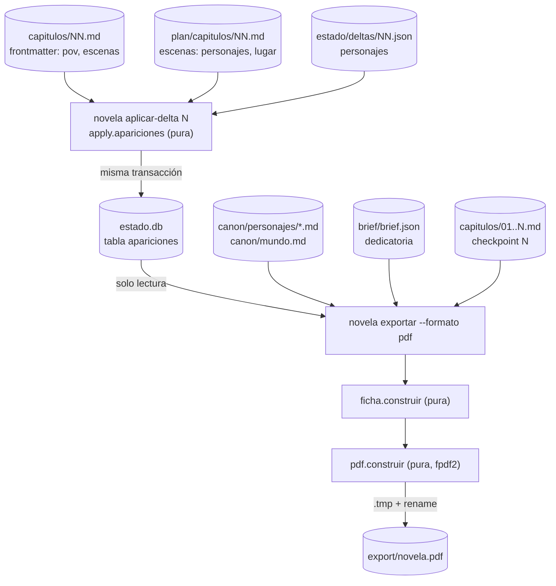

# 0006 — Entregar la novela de regalo como PDF navegable con portada y ficha

## 1. Resumen

El CLI `novela` genera, desde el backend, un PDF de la novela de regalo que el destinatario puede leer sin tener el harness: una portada con la dedicatoria del brief, un índice con enlaces, los capítulos cerrados y una ficha de personajes y lugares. En la ficha, cada entrada enlaza con cada capítulo donde aparece. Los capítulos de aparición salen de una tabla nueva de `estado.db` que solo escribe `novela aplicar-delta`. La elección de PDF frente a una web servida por la API queda documentada en un ADR.

## 2. Contexto y problema

**Hoy la entrega no es un libro de regalo.** `novela exportar <slug> --formato md|epub` (`backend/novela/slices/export/cmd.py`) concatena los capítulos cerrados. `epub.py` genera un epub con índice (`libro.toc`) y título igual al slug, sin portada, dedicatoria ni ficha. La auditoría del entregable (`docs/auditoria-entregable.md` § LEC) marca LEC-01 como «parcial» («No hay web ni PDF interactivo desde el backend… Falta el trade-off web frente a PDF documentado en `/docs`»), y LEC-03 y LEC-04 como «falta».

**`estado.db` no sabe en qué capítulos aparece cada entidad.** La tabla `personajes` de `backend/novela/plataforma/esquema.sql` guarda una fila por personaje con `ubicacion` y `ultima_aparicion`, y la reescribe entera en cada `aplicar-delta` (`estado_db.guardar`). No hay historial de apariciones, y los lugares (`Escenario` de `canon/mundo.md`) no son entidad del estado. `docs/architecture.md` §12.4 ya describe como «dirección acordada» una tabla exacta `menciones(entidad_id, escena_id, capitulo)` en `estado.db` para el índice recuperable. Esta spec materializa una versión mínima de esa idea, a nivel de capítulo (ver D5).

**Restricciones del repositorio que condicionan el diseño:**

- La API es de solo lectura y el frontend no lee el disco (`AGENTS.md` § Monorepo). La API se arranca en local con `uv run uvicorn` (`docs/architecture.md` §11.1). El destinatario de un regalo no tiene ese entorno (ver D1).
- `estado.db` solo se escribe con `novela aplicar-delta`, y `libro_de_hechos` y `conocimiento` son append-only (`AGENTS.md` § Invariantes 1 y 2).
- `canon/misterio.md` es secreto y se exige fair play (`AGENTS.md` § Invariantes 3 y 4, `docs/architecture.md` §6.3). Una ficha que describiera a los personajes con su canon completo revelaría la solución (ver D7).
- Toda escritura es atómica (`AGENTS.md` § Invariantes 6). Un gate o una rama de `delta.py` se prueban con propiedades (`AGENTS.md` § Proceso: generar código, `docs/validators.md` §3.6).

**Relación con otras specs.**

- **0001** fijó `novela exportar` y los códigos de `backend/novela/plataforma/salida.py`. Esta spec añade un formato sin cambiar `md` ni `epub`.
- **0004** es el panel web, con un lector de capítulos que es frontend. Queda fuera de esta spec y no cambia (ver D18).
- **0005**, en estado Propuesta y sin implementar, define `brief/brief.json` y deja fuera de su alcance «Portada, dedicatoria o cualquier otro elemento del libro de regalo (LEC-04 de la auditoría)» (0005 §3.2). Su modelo `Brief` no tiene dedicatoria, y su RNF-06 limita los campos personales a `nombre`, `edad`, `rasgos` y `recuerdos`. Esta spec añade al brief el campo `dedicatoria` y amplía en uno esa lista (ver D9). Depende de que la 0005 esté implementada (§10).
- **0002**, aceptada y sin implementar, añade invariantes a `aplicar-delta` (su RF-06 a RF-08) y declara que `estado.db` queda «sin cambios de forma» dentro de su alcance. Esta spec sí cambia la forma de la base, solo por adición (ver D5, D6). Las dos tocan `slices/delta/cmd.py` (§11).

## 3. Objetivos y no objetivos

### 3.1 Objetivos

- **O-01** `novela exportar <slug> --formato pdf` escribe `export/novela.pdf` con portada, índice, capítulos cerrados y ficha. Todos sus enlaces internos resuelven a la primera página del capítulo o sección que nombran.
- **O-02** La portada muestra, literal, la dedicatoria de `brief/brief.json`.
- **O-03** La ficha tiene exactamente un enlace por cada par (entidad, capítulo) de la tabla `apariciones` dentro de los capítulos cerrados, y 0 textos procedentes de `canon/misterio.md` o de los campos de canon excluidos en D7.
- **O-04** `estado.db` registra en qué capítulos aparece cada personaje y cada lugar. Solo lo escribe `aplicar-delta`, y la consulta `estado_db.apariciones` lo devuelve.
- **O-05** `docs/adr/0003-entrega-del-libro-en-pdf.md` documenta las opciones, los criterios y la elección, y `docs/architecture.md` §11 y los demás documentos de D17 describen lo implementado en el mismo commit.
- **O-06** `uv run pytest`, `mypy --strict` y `ruff` en verde, sin tests que llamen a un modelo y sin cambios en `state.schema.json`, `delta.schema.json`, `config.schema.json` ni `backend/api/openapi.json`.

### 3.2 No objetivos

- Servir el libro, la portada o la ficha por la API, o mostrarlos en el panel. La API no gana rutas (ver D18) y el frontend no cambia.
- Cambiar `--formato md` o `--formato epub`. El epub sigue sin portada ni ficha.
- Rellenar las apariciones de capítulos aplicados antes de esta spec. No hay backfill (ver D6).
- Registrar apariciones por escena, o menciones de objetos, hechos o pistas. La tabla es por capítulo y solo para personajes y escenarios. El índice recuperable de `docs/architecture.md` §12.4 sigue sin existir.
- Cambiar el prompt del `cronista` o el esquema del delta. Las apariciones se derivan, no vienen en el delta (ver D4).
- Cualquier dato de la portada que no sea el título y la dedicatoria: autor, ilustración, contraportada o ISBN.
- PDF etiquetado (PDF/UA), división silábica o maquetación tipográfica avanzada.
- Enviar el PDF al destinatario. La entrega física del fichero la hace el operador.

## 4. Usuarios y escenarios

| Actor | Relación con esta spec |
|---|---|
| Destinatario del regalo | Lee `export/novela.pdf` en cualquier lector de PDF, sin harness ni red |
| Operador humano | Ejecuta `novela exportar <slug> --formato pdf` y entrega el fichero |
| Cliente que encarga el regalo | Aporta la dedicatoria como respuesta durante la fase de brief (spec 0005) |
| `entrevistador` (spec 0005) | Copia la dedicatoria de una respuesta al borrador del brief |
| CLI `novela` | `aplicar-delta` registra apariciones y `exportar` genera el PDF |

- Como destinatario, quiero abrir el libro, leer la dedicatoria y saltar desde la ficha de un personaje a cada capítulo en que aparece, para seguir la historia sin perderme.
- Como operador, quiero un único fichero que se lee sin conexión y sin instalar nada, para regalarlo tal cual.
- Como desarrollador del harness, quiero probar la ficha y los enlaces sobre un workspace sintético, para que la suite siga sin cuota y sin datos reales.

## 5. Requisitos funcionales

**Exportador PDF**

| ID | Requisito (EARS) | Prioridad |
|----|------------------|-----------|
| RF-01 | Cuando se ejecute `novela exportar <slug> --formato pdf`, el sistema debe escribir `export/novela.pdf` con `WorkspaceRepository.escribir` (`.tmp` y renombrado) con los capítulos 1 a `checkpoint.capitulo`, en orden, y salir con 0 (ver D1, D15). | Must |
| RF-02 | El sistema debe componer el PDF en este orden: portada en la página 1, índice, cada capítulo empezando en página nueva, y la ficha de personajes y lugares al final (ver D12). | Must |
| RF-03 | El sistema debe incluir en el índice una entrada por capítulo cerrado, con el `titulo` de su frontmatter y un enlace interno a su primera página, y una entrada «Personajes y lugares» con un enlace a la primera página de la ficha (ver D8, D12). | Must |
| RF-04 | El sistema debe añadir al PDF un marcador (outline) por capítulo, uno para el índice y uno para la ficha, y fijar el idioma del documento a `parametros_obra.idioma` (ver D12). | Should |
| RF-05 | El sistema debe representar el cuerpo markdown de cada capítulo, sin su frontmatter, como texto inerte: encabezados, párrafos, cursiva, negrita y el separador de escena `***`. Los enlaces, las imágenes y el HTML se muestran como su texto, y el PDF no lleva anotaciones `URI`, `Launch`, `JavaScript` ni `SubmitForm` (ver D13). | Must |
| RF-06 | Si el workspace no tiene checkpoint, entonces el sistema debe salir con 1 con «no hay capítulos cerrados que exportar», sin escribir nada, igual que con los otros formatos. | Must |
| RF-07 | Cuando se exporte dos veces el mismo workspace sin cambios, el sistema debe producir dos `export/novela.pdf` idénticos byte a byte (ver D14). | Should |
| RF-08 | Donde se pase `--titulo`, el sistema debe usarlo como título de la portada y de los metadatos del PDF, y si no se pasa, el slug. Si `--titulo` queda vacío tras quitar espacios o supera 120 caracteres, debe salir con 2 sin escribir (ver D11). | Should |
| RF-09 | Si el texto que se va a componer contiene un carácter que no está en la fuente embebida, entonces el sistema debe salir con 1, nombrar el capítulo (o «portada» o «ficha») y el código `U+XXXX`, y no escribir el PDF (ver D3). | Should |
| RF-10 | El sistema debe mantener `--formato md` y `--formato epub` con la salida que tenían, de modo que `slices/export/test_export.py` pase sin cambios. | Must |

**Portada y dedicatoria**

| ID | Requisito (EARS) | Prioridad |
|----|------------------|-----------|
| RF-11 | Donde el workspace tenga `brief/brief.json`, el sistema debe mostrar en la portada, bajo el título, `dedicatoria.cita` del brief, literal y con sus saltos de línea (ver D9). | Must |
| RF-12 | Si el workspace no tiene `brief/brief.json`, entonces el sistema debe componer la portada solo con el título, salir con 0 e imprimir «sin dedicatoria: el workspace no tiene brief/brief.json» (ver D10). | Should |
| RF-13 | Si `brief/brief.json` existe y no valida contra `Brief`, entonces el sistema debe salir con 4 sin escribir el PDF (ver D10). | Must |
| RF-14 | El sistema debe añadir a `BorradorBrief` el campo `dedicatoria: Fuente \| null` y a `Brief` el campo obligatorio `dedicatoria: Fuente`. `novela brief validar` debe registrar `falta_campo` en `dedicatoria` si es `null`, aplicarle la comprobación de cita literal de la spec 0005 (RF-19) y registrar `campo_cerrado_desde_texto_libre` si su entrada es de tipo `texto_libre` (ver D9). | Must |
| RF-15 | El sistema no debe incluir la dedicatoria en `idea_semilla` (spec 0005, RF-27) (ver D16). | Must |
| RF-16 | El sistema no debe escribir el texto de la dedicatoria en stdout, stderr ni `harness.log` en ningún subcomando (ver D16). | Must |
| RF-17 | El sistema debe nombrar en `.claude/agents/entrevistador.md` el campo `dedicatoria` y la regla de que se copia literal de una entrada de tipo `respuesta` (ver D9). | Should |

**Apariciones en `estado.db`**

| ID | Requisito (EARS) | Prioridad |
|----|------------------|-----------|
| RF-18 | El sistema debe definir en `backend/novela/plataforma/esquema.sql` la tabla `STRICT` `apariciones (entidad TEXT, tipo TEXT CHECK (tipo IN ('personaje','escenario')), capitulo INTEGER, PRIMARY KEY (entidad, capitulo))`, con el índice `apariciones_por_capitulo` y triggers `BEFORE UPDATE` y `BEFORE DELETE` que abortan (ver D5). | Must |
| RF-19 | Cuando `novela aplicar-delta <slug> N` aplique un delta, el sistema debe registrar, en la misma transacción que `estado_db.guardar`, una fila por entidad distinta de este conjunto: el `pov` del frontmatter; los `personajes` y el `lugar` de las escenas de `plan/capitulos/NN.md` cuyo id está en `escenas` del frontmatter; y las claves de `delta.personajes` con `ultima_aparicion == N`, con su `ubicacion` si no es nula (ver D4). | Must |
| RF-20 | Cuando `aplicar-delta` se repita sobre el mismo capítulo, el sistema no debe duplicar ni borrar filas de `apariciones` (ver D4). | Must |
| RF-21 | Si `plan/capitulos/NN.md` no existe o no valida contra `FichaCapitulo`, entonces `aplicar-delta` debe salir con 4 sin escribir `estado.db` ni `memoria/` (ver D4). | Should |
| RF-22 | Cuando `aplicar-delta` abra un `estado.db` sin la tabla `apariciones`, el sistema debe crearla con sus triggers e índice (DDL idempotente) dentro de la misma transacción, antes de registrar (ver D6). | Should |
| RF-23 | Mientras `estado.db` no tenga la tabla `apariciones`, `novela estado` y `GET /novelas/{slug}/estado` deben responder lo mismo que antes de esta spec (ver D5). | Must |
| RF-24 | El sistema debe ofrecer `estado_db.apariciones(conn, hasta: int) -> list[Aparicion]`, que devuelve las filas con `capitulo <= hasta` ordenadas por `entidad` y `capitulo`, válida sobre una conexión abierta en solo lectura (ver D5). | Must |
| RF-25 | Si al exportar en PDF la tabla `apariciones` no existe o algún capítulo cerrado no tiene ninguna fila, entonces el sistema debe salir con 4, nombrar esos capítulos y no escribir el PDF (ver D6). | Must |

**Ficha de personajes y lugares**

| ID | Requisito (EARS) | Prioridad |
|----|------------------|-----------|
| RF-26 | El sistema debe generar la ficha desde `estado_db.apariciones(conn, checkpoint.capitulo)` y el canon, con una entrada por personaje (`identidad.nombre` y `identidad.alias` de `canon/personajes/<id>.md`) y una por escenario (`nombre` y `descripcion` de `canon/mundo.md`), solo para las entidades con al menos una aparición (ver D7). | Must |
| RF-27 | El sistema debe dar a cada entrada de la ficha un enlace interno por capítulo en que aparece, con el texto «Capítulo N — título», a la primera página de ese capítulo y en orden ascendente (ver D8). | Must |
| RF-28 | El sistema no debe incluir en el PDF texto de `canon/misterio.md` ni de los campos de personaje `rol_narrativo`, `edad`, `fisico`, `voz`, `psicologia`, `secreto`, `arco_previsto`, `relaciones` y `coartada_y_cronologia_privada`, ni de los campos de escenario `detalle_sensorial` y `quien_tiene_acceso`. El exportador no debe abrir `canon/misterio.md` (ver D7). | Must |
| RF-29 | Si una entidad de `apariciones` no tiene ficha en `canon/personajes/` ni escenario en `canon/mundo.md`, entonces el sistema debe salir con 4, nombrar el id y no escribir el PDF (ver D7). | Should |
| RF-30 | El sistema debe ordenar la ficha con los personajes primero y los lugares después, y cada grupo por su primer capítulo de aparición y, a igualdad, por id (ver D12). | Should |

**Documentación y contratos**

| ID | Requisito (EARS) | Prioridad |
|----|------------------|-----------|
| RF-31 | El sistema debe incluir `docs/adr/0003-entrega-del-libro-en-pdf.md` con las secciones Contexto, Opciones, Criterios, Decisión, Alternativas descartadas, Consecuencias y Cuándo reabrirla, y en Opciones al menos la web servida por la API, el PDF y el epub ampliado (ver D1, D2). | Must |
| RF-32 | El sistema no debe añadir rutas a la API, de modo que `backend/api/openapi.json` quede idéntico (ver D18). | Must |
| RF-33 | El sistema debe describir el exportador PDF, la tabla `apariciones` y el campo `dedicatoria`, en el mismo commit que el código que los introduce, en los documentos y secciones de D17 (ver D17). | Must |

## 6. Requisitos no funcionales

| ID | Categoría | Requisito | Métrica | Umbral |
|----|-----------|-----------|---------|--------|
| RNF-01 | Rendimiento | Coste de exportar | Tiempo de `novela exportar --formato pdf` en `CliRunner` sobre `demo-terminado` (24 capítulos de 300 palabras) y sobre 10 capítulos generados de 1.500 palabras | < 10 s en cada caso |
| RNF-02 | Rendimiento | Tamaño del libro | Tamaño de `export/novela.pdf` para 10 capítulos de 1.500 palabras, con la fuente en subconjunto | ≤ 5 MB |
| RNF-03 | Seguridad | El PDF no abre nada fuera de sí mismo | Anotaciones o acciones `URI`, `Launch`, `JavaScript`, `SubmitForm` o `GoToR` en el PDF de cualquier fixture, incluida una con enlaces, imágenes y HTML en el markdown | 0 (ver D13) |
| RNF-04 | Seguridad | Los enlaces internos resuelven | Enlaces del índice y de la ficha cuyo destino no es la primera página del capítulo o de la sección que nombran, sobre el 100 % de los enlaces | 0 (ver D8) |
| RNF-05 | Seguridad (secreto) | La ficha no revela la solución | Cadenas de `canon/misterio.md` y de los campos excluidos por RF-28 de las fixtures presentes en el texto extraído del PDF | 0 (ver D7) |
| RNF-06 | Privacidad y protección de datos | La dedicatoria no sale del libro | Apariciones de la dedicatoria de la fixture en stdout, stderr, `harness.log` e `idea_semilla` tras la suite | 0 (ver D16) |
| RNF-07 | Privacidad y protección de datos | Sin datos reales en el repositorio | Coincidencias de los patrones de 0005 RNF-05 (correo, teléfono de 9 dígitos, DNI/NIE y nombres fuera de la lista de ficticios) en las fixtures nuevas | 0 |
| RNF-08 | Accesibilidad | Libro navegable y legible por lector de pantalla | Marcadores del PDF; `/Lang` del catálogo; títulos de capítulo extraíbles como texto con `pypdf` | capítulos + 2; igual a `idioma`; 100 % |
| RNF-09 | Compatibilidad | Contratos existentes intactos | Diferencias en `state.schema.json`, `delta.schema.json`, `config.schema.json` y `backend/api/openapi.json`; tests de `test_export.py` modificados | 0; 0 |
| RNF-10 | Compatibilidad | Sin dependencias de sistema | Dependencias nuevas que exigen bibliotecas nativas del sistema (GTK, Pango, Cairo) o compilar en `uv sync` en Windows | 0 (ver D2) |
| RNF-11 | Rendimiento | La consulta de apariciones es indexada | Tiempo de `estado_db.apariciones` con 99 capítulos y 50 entidades por capítulo, en solo lectura | < 50 ms |
| RNF-12 | Calidad | Suite verde y sin modelos | Fallos de `uv run pytest`, errores de `mypy --strict` y de `ruff`; tests que importan un cliente de modelos (`test_sin_clientes_de_modelo`) | 0; 0; 0; 0 |

## 7. Criterios de aceptación

«`demo-regalo`» es un workspace sintético nuevo de `backend/conftest.py`, construido con `fabrica.construir` a partir de `fabrica.REGALO`: 3 capítulos cerrados. En su capítulo 2, la escena 2 ocurre en `fabrica.ARCHIVO` y solo con `fabrica.ELENA`. Desde T-07 lleva un `brief/brief.json` ficticio cuya dedicatoria es «Para Aurora Ficticia,\nque siempre leyó primero el final.». Con el delta de la fábrica, sus apariciones son 5 por capítulo: en 1 y 3, Elena, Tomás, Inés, el faro y el puerto; en 2, Elena, Tomás, el faro, el archivo y el puerto (este último por la `ubicacion` de Elena en el delta). En total son 15 pares.

### CA-01 (cubre RF-01)
- **Dado** `demo-regalo` con checkpoint en el capítulo 3
- **Cuando** se ejecuta `novela exportar demo-regalo --formato pdf`
- **Entonces** sale con 0, imprime `exportar: 3 capítulos en export/novela.pdf`, `pypdf` abre el fichero, y en `export/` no queda ningún `.tmp`

### CA-02 (cubre RF-02)
- **Dado** el PDF de CA-01
- **Cuando** se extrae el texto por página con `pypdf`
- **Entonces** la página 1 empieza por el título, la siguiente empieza por «Índice», cada «La linterna, noche N» abre una página nueva en orden 1, 2, 3, y la última sección empieza por «Personajes y lugares»

### CA-03 (cubre RF-03)
- **Dado** el PDF de CA-01
- **Cuando** se recorren las anotaciones `Link` de las páginas del índice
- **Entonces** hay 4, tres con destino en la primera página de los capítulos 1, 2 y 3 y una en la primera página de la ficha

### CA-04 (cubre RF-04)
- **Dado** el PDF de CA-01
- **Cuando** se leen `reader.outline` y `/Lang` del catálogo
- **Entonces** hay 5 marcadores (Índice, los 3 capítulos y Personajes y lugares) y `/Lang` es `es`

### CA-05 (cubre RF-05)
- **Dado** `demo-regalo` con el cuerpo del capítulo 2 cambiado, en el test y antes de exportar, para contener `[pulsa](https://ejemplo.invalid)`, ``, `<script>alert(1)</script>` y `*cursiva*`
- **Cuando** se exporta en PDF
- **Entonces** el texto extraído contiene «pulsa», «foto», «<script>alert(1)</script>» y «cursiva», y ninguna página tiene anotaciones `URI`, `Launch`, `JavaScript`, `SubmitForm` ni `GoToR`

### CA-06 (cubre RF-06)
- **Dado** un workspace recién creado con `novela nueva`, sin checkpoint
- **Cuando** se ejecuta `novela exportar <slug> --formato pdf`
- **Entonces** sale con 1 con «no hay capítulos cerrados que exportar» y `export/novela.pdf` no existe

### CA-07 (cubre RF-07)
- **Dado** `demo-regalo`
- **Cuando** se exporta en PDF dos veces seguidas
- **Entonces** los dos ficheros tienen el mismo sha256

### CA-08 (cubre RF-08)
- **Dado** `demo-regalo`
- **Cuando** se exporta sin `--titulo`, con `--titulo "La luz del cabo"`, con `--titulo "   "` y con un título de 121 caracteres
- **Entonces** los dos primeros salen con 0 y la portada y `/Title` muestran `demo-regalo` y «La luz del cabo»; los dos últimos salen con 2 y no escriben el PDF

### CA-09 (cubre RF-09)
- **Dado** `demo-regalo` con el carácter U+1F56F en el cuerpo del capítulo 3
- **Cuando** se exporta en PDF
- **Entonces** sale con 1, el mensaje nombra `capítulo 3` y `U+1F56F`, y no hay `export/novela.pdf`

### CA-10 (cubre RF-10)
- **Dado** el código tras esta spec
- **Cuando** se ejecutan `test_export.py::test_md_concatena_en_orden` y `::test_epub_reabrible` sin modificar
- **Entonces** pasan

### CA-11 (cubre RF-11)
- **Dado** `demo-regalo` con su `brief/brief.json`
- **Cuando** se exporta en PDF y se extrae el texto de la página 1
- **Entonces** contiene «Para Aurora Ficticia,» y, en la línea siguiente, «que siempre leyó primero el final.», y ninguna otra página contiene la dedicatoria

### CA-12 (cubre RF-12)
- **Dado** `demo-terminado`, que no tiene `brief/`
- **Cuando** se exporta en PDF
- **Entonces** sale con 0, imprime «sin dedicatoria: el workspace no tiene brief/brief.json» y la página 1 contiene solo el título

### CA-13 (cubre RF-13)
- **Dado** `demo-regalo` con `brief/brief.json` sustituido en el test por un JSON sin `dedicatoria`
- **Cuando** se exporta en PDF
- **Entonces** sale con 4 y no escribe el PDF

### CA-14 (cubre RF-14)
- **Dado** los borradores de la spec 0005 ampliados: uno con `dedicatoria: null`, uno cuya cita de dedicatoria no es subcadena de su entrada, uno con la dedicatoria citada de una entrada `texto_libre` y `borrador-completo.json` con dedicatoria válida
- **Cuando** se ejecutan los gates de `slices/brief/` sobre cada uno, y `test_contratos.py` tras `REGENERAR=1`
- **Entonces** dan `falta_campo@dedicatoria`, `cita_no_literal@dedicatoria`, `campo_cerrado_desde_texto_libre@dedicatoria` y ningún hallazgo, respectivamente; y `brief.schema.json` exige `dedicatoria`

### CA-15 (cubre RF-15)
- **Dado** el `Brief` de la fixture `brief-completo.json` con dedicatoria
- **Cuando** se genera `idea_semilla`
- **Entonces** no contiene ningún fragmento de la dedicatoria de 10 o más caracteres, y coincide byte a byte con el golden `idea-semilla.txt` de la spec 0005

### CA-16 (cubre RF-16)
- **Dado** la ejecución de `test_brief_flujo.py` de la spec 0005 con la dedicatoria de la fixture, y la exportación de CA-11
- **Cuando** se leen el `harness.log` de sus runs y la salida capturada de `CliRunner`, stdout y stderr
- **Entonces** ninguna línea contiene «que siempre leyó primero el final» ni «Para Aurora Ficticia,»

### CA-17 (cubre RF-17)
- **Dado** `.claude/agents/entrevistador.md`
- **Cuando** se ejecuta `test_contratos.py::test_entrevistador_nombra_la_dedicatoria`
- **Entonces** el cuerpo contiene `dedicatoria` y la regla de que se copia literal de una entrada `respuesta`, y los tests de contrato del agente de la spec 0005 siguen en verde

### CA-18 (cubre RF-18)
- **Dado** un `estado.db` creado con `estado_db.crear`
- **Cuando** se inserta una fila en `apariciones` y después se intenta un `UPDATE`, un `DELETE`, un `tipo` `objeto` y un `capitulo` de texto
- **Entonces** la inserción pasa, `UPDATE` y `DELETE` abortan con «apariciones es append-only» y las dos últimas fallan por `CHECK` y por `STRICT`

### CA-19 (cubre RF-19)
- **Dado** `demo-regalo` construido con el CLI
- **Cuando** se consultan sus apariciones con `estado_db.apariciones(conn, 3)`
- **Entonces** son exactamente los 15 pares de la introducción de §7: `fabrica.INES` en 1 y 3, `fabrica.ARCHIVO` en 2 y `fabrica.PUERTO` en 1, 2 y 3

### CA-20 (cubre RF-20)
- **Dado** un generador de Hypothesis de estados, deltas, frontmatters y fichas de capítulo válidos, con al menos 200 casos
- **Cuando** se aplica `apply.apariciones` y se acumula en una colección dos veces sobre el mismo capítulo
- **Entonces** el resultado es igual al de aplicarlo una vez, contiene siempre el `pov`, y las apariciones de capítulos anteriores quedan intactas y en su orden

### CA-21 (cubre RF-21)
- **Dado** un workspace listo para `aplicar-delta 02` al que se le borra `plan/capitulos/02.md`, y otro con esa ficha sin `escenas`
- **Cuando** se ejecuta `novela aplicar-delta <slug> 2`
- **Entonces** los dos salen con 4, y la huella de `estado/estado.db` y de `memoria/` no cambia

### CA-22 (cubre RF-22)
- **Dado** un `estado.db` al que el test ha quitado la tabla `apariciones`, sus triggers y su índice, con los capítulos 1 y 2 aplicados
- **Cuando** se ejecuta `novela aplicar-delta <slug> 3`
- **Entonces** sale con 0, la tabla existe con sus triggers, tiene filas solo del capítulo 3 y el resto del estado es igual al que da la misma secuencia con la tabla presente

### CA-23 (cubre RF-23)
- **Dado** el `estado.db` sin tabla de CA-22, antes de aplicar el capítulo 3
- **Cuando** se ejecutan `novela estado <slug> --json` y `GET /novelas/<slug>/estado`
- **Entonces** los dos responden con 0 y 200 y un JSON igual al que dan con la tabla presente

### CA-24 (cubre RF-24)
- **Dado** `demo-regalo`, y una base sintética con 99 capítulos y 50 entidades por capítulo
- **Cuando** se llama a `estado_db.apariciones(conn, 2)` sobre una conexión `solo_lectura=True`, y después a `estado_db.apariciones(conn, 99)` sobre la sintética
- **Entonces** la primera devuelve los 10 pares de los capítulos 1 y 2, ordenados por `entidad` y `capitulo`, y la segunda tarda menos de 50 ms

### CA-25 (cubre RF-25)
- **Dado** el workspace de CA-22 después de aplicar y cerrar el capítulo 3, con los capítulos 1 y 2 sin apariciones, y otro con la tabla ausente
- **Cuando** se exporta en PDF
- **Entonces** los dos salen con 4, el primero nombra los capítulos 1 y 2, y ninguno escribe el PDF

### CA-26 (cubre RF-26)
- **Dado** `demo-regalo`
- **Cuando** se extrae el texto de la ficha
- **Entonces** contiene «Elena Vidal», «Tomás Reyes», «Inés Mar», «La casa del faro», «El puerto» y «El archivo», con la descripción de cada lugar; y sobre un workspace cuyas apariciones no incluyen `fabrica.ARCHIVO`, «El archivo» no aparece

### CA-27 (cubre RF-27)
- **Dado** un generador de Hypothesis de listas de `Aparicion` sobre 1 a 20 capítulos y 1 a 15 entidades, con al menos 200 casos, y el PDF de CA-01
- **Cuando** se construye la ficha con `ficha.construir` y se recorren las anotaciones `Link` de las páginas de la ficha del PDF
- **Entonces** la ficha tiene tantos enlaces como pares distintos (entidad, capítulo), en orden ascendente por entidad; y en el PDF hay 15 enlaces, cada uno con destino en la primera página del capítulo que nombra su texto «Capítulo N — La linterna, noche N»

### CA-28 (cubre RF-28)
- **Dado** `demo-regalo`
- **Cuando** se exporta en PDF, y otra vez tras renombrar en el test `canon/misterio.md` a `canon/misterio.oculto`
- **Entonces** las dos salen con 0 y dan el mismo sha256, y el texto extraído no contiene «apagó el faro a mano», «cofradía», «Vio luz en el cabo», «protagonista», «antagonista», «testigo», «el hermano» ni «olor a sal»

### CA-29 (cubre RF-29)
- **Dado** `demo-regalo` con `canon/personajes/per-ines-mar.md` retirado en el test
- **Cuando** se exporta en PDF
- **Entonces** sale con 4, el mensaje nombra `per-ines-mar` y no se escribe el PDF

### CA-30 (cubre RF-30)
- **Dado** apariciones con `per-b` desde el capítulo 1, `per-a` desde el 2, `esc-z` desde el 1 y `per-c` desde el 2
- **Cuando** se construye la ficha
- **Entonces** el orden es `per-b`, `per-a`, `per-c`, `esc-z`

### CA-31 (cubre RF-31)
- **Dado** `docs/adr/0003-entrega-del-libro-en-pdf.md`
- **Cuando** se ejecuta `test_contratos.py::test_adr_de_entrega`
- **Entonces** el fichero existe, su frontmatter tiene `adr: 0003`, `estado: aceptada` y `specs: [0006]`, contiene los siete encabezados de RF-31 y nombra en Opciones «web servida por la API», «PDF» y «epub»

### CA-32 (cubre RF-32)
- **Dado** el código tras esta spec
- **Cuando** se ejecutan `test_contratos.py::test_openapi_al_dia` y `test_api.py::test_sin_rutas_de_libro`
- **Entonces** `openapi.json` no cambia y ninguna ruta de la app contiene `libro`, `pdf`, `ficha`, `portada` ni `apariciones`

### CA-33 (cubre RF-33)
- **Dado** el commit de cierre (T-09)
- **Cuando** se revisan las secciones de D17
- **Entonces** cada una describe el exportador PDF, la tabla `apariciones` y la dedicatoria tal como están implementados, sin «pendiente» ni «próximamente»

## 8. Diseño propuesto

### 8.1 Visión general

El slice `export/` gana un formato y dos módulos de núcleo funcional (`docs/architecture.md` §3.0): `ficha.py` y `pdf.py` son funciones puras que reciben datos y devuelven la ficha o los bytes del PDF, y `cmd.py` sigue siendo la cáscara que lee el workspace, toma el lock y escribe. `aplicar-delta` deriva las apariciones de cada capítulo con una función pura nueva de `apply.py` y las registra en `estado.db` en la misma transacción. La tabla `apariciones` es un índice derivado dentro de `estado.db`, fuera de la vista serializada `Estado` (ver D5).



### 8.2 Componentes afectados

**Nuevos**

- `backend/novela/slices/export/pdf.py`: `construir(libro: Libro, fuente: Path) -> bytes`, que compone portada, índice, capítulos y ficha con `fpdf2` (ver D2).
- `backend/novela/slices/export/ficha.py`: `construir(apariciones, personajes, escenarios, titulos) -> Ficha`, pura.
- `backend/novela/slices/export/fuentes/`: la fuente TTF embebida y su `LICENSE` (ver D3).
- `backend/novela/slices/export/test_pdf.py` y `test_ficha.py`.
- `docs/adr/0003-entrega-del-libro-en-pdf.md`.

**Modificados**

- `backend/novela/slices/export/cmd.py`: `Formato.PDF`, la opción `--titulo`, la lectura del brief, del canon y de `apariciones`, y los códigos de RF-06, RF-08, RF-09, RF-13, RF-25 y RF-29.
- `backend/novela/plataforma/esquema.sql`: la tabla `apariciones`, su índice y sus triggers.
- `backend/novela/plataforma/estado_db.py`: `apariciones(conn, hasta)`, `registrar_apariciones(conn, filas)` con `INSERT OR IGNORE` y `asegurar_apariciones(conn)` con el DDL idempotente. `leer` y `guardar` no cambian.
- `backend/novela/plataforma/test_esquema.py` y `test_estado_db.py`.
- `backend/novela/dominio/estado.py`: el modelo `Aparicion`, fuera de `Estado` y de `Delta`.
- `backend/novela/slices/delta/apply.py`: `apariciones(capitulo, frontmatter, ficha, delta) -> tuple[Aparicion, ...]`, pura.
- `backend/novela/slices/delta/cmd.py`: lee `plan/capitulos/NN.md`, llama a `asegurar_apariciones` y a `registrar_apariciones` dentro de `estado_db.transaccion`.
- `backend/novela/slices/delta/test_apply.py` (propiedad) y `test_delta.py`.
- `backend/novela/dominio/brief.py`, `backend/novela/slices/brief/gates.py` y sus tests (spec 0005): el campo `dedicatoria`.
- `backend/schemas/brief.schema.json` y `brief-borrador.schema.json`, regenerados.
- `backend/tests/fixtures/fabrica.py`: `REGALO` y un parámetro opcional para sustituir escenas por capítulo, sin cambiar la salida de `DEMO`. Así el golden `08-escritor.md` no cambia.
- `backend/tests/fixtures/brief/`: la dedicatoria en `respuestas-completas.md`, `borrador-completo.json` y `brief-completo.json`, más los borradores de CA-14.
- `backend/conftest.py`: el workspace `demo-regalo`.
- `backend/tests/test_contratos.py`: `test_adr_de_entrega` y `test_entrevistador_nombra_la_dedicatoria`.
- `backend/tests/test_api.py`: `test_sin_rutas_de_libro` y el caso sin tabla de CA-23.
- `.claude/agents/entrevistador.md`: el campo `dedicatoria`.
- `backend/pyproject.toml` y `backend/uv.lock`: `fpdf2` en `dependencies` y `pypdf` en el grupo `dev` (ver D2, D19).
- Documentación de D17.

### 8.3 Modelo de datos

**Tabla nueva de `estado.db`** (ver D5):

```sql
CREATE TABLE apariciones (
    entidad  TEXT NOT NULL,
    tipo     TEXT NOT NULL CHECK (tipo IN ('personaje', 'escenario')),
    capitulo INTEGER NOT NULL,
    PRIMARY KEY (entidad, capitulo)
) STRICT;
CREATE INDEX apariciones_por_capitulo ON apariciones (capitulo);
-- más apariciones_no_update y apariciones_no_delete con RAISE(ABORT, 'apariciones es append-only')
```

`meta.schema_version` sigue siendo `1.0.0`: el cambio es aditivo, y `asegurar_apariciones` usa `CREATE … IF NOT EXISTS` (ver D6).

**`Aparicion`** (`dominio/estado.py`, `Modelo` inmutable): `{entidad: PersonajeId | EscenarioId, tipo: "personaje" | "escenario", capitulo: CapituloNum}`. Un validador exige que `tipo` case con el prefijo del id. No forma parte de `Estado` ni de `Delta`, así que `state.schema.json` y `delta.schema.json` no cambian.

**Cambio en el brief** (spec 0005 §8.3, ver D9):

| Modelo | Campo | Tipo |
|---|---|---|
| `BorradorBrief` | `dedicatoria` | `Fuente \| null`: la dedicatoria es la cita literal, como `recuerdos` |
| `Brief` | `dedicatoria` | `Fuente`, obligatorio |

**Modelos internos del slice** (no son contrato de disco y no se exportan a `backend/schemas/`): `Libro {titulo, idioma, dedicatoria: str | None, capitulos: list[(numero, titulo, cuerpo)], ficha: Ficha, creado: datetime}`, `Ficha {personajes: list[EntradaFicha], lugares: list[EntradaFicha]}` y `EntradaFicha {id, nombre, detalle: str | None, capitulos: list[int]}`. En los personajes, `detalle` son los alias unidos por comas, y en los lugares, la `descripcion`.

No se migra ningún workspace: los capítulos aplicados antes de esta spec no tienen filas (ver D6).

### 8.4 Interfaces y contratos

**CLI.**

```
novela exportar <slug> --formato md|epub|pdf [--titulo "texto"]
```

`--titulo` solo afecta a `pdf`. Con `md` o `epub` se ignora. Códigos de `salida.py`:

| Código | Cuándo |
|---|---|
| 0 | PDF escrito, con o sin dedicatoria |
| 1 | Sin checkpoint (RF-06); carácter fuera de la fuente (RF-09) |
| 2 | `--titulo` inválido (RF-08); formato desconocido (Typer) |
| 3 | Lock ocupado |
| 4 | `brief.json` inválido (RF-13); sin tabla o capítulos sin apariciones (RF-25); entidad sin canon (RF-29); capítulo o canon ilegibles |

Salida en stdout: `exportar: N capítulos en export/novela.pdf`, y si no hay brief, antes la línea de RF-12. Nunca lleva la dedicatoria (RF-16).

**Estructura del PDF** (ver D12):

1. Portada: título centrado y, debajo, la dedicatoria con sus saltos de línea.
2. Índice: «Índice», una línea «N. título» por capítulo con enlace a su primera página, y «Personajes y lugares» con enlace a la ficha.
3. Capítulos: cada uno empieza en página nueva. El cuerpo es el markdown sin frontmatter, representado como en RF-05.
4. Ficha: «Personajes y lugares», con las subsecciones «Personajes» y «Lugares». Cada entrada lleva el nombre, el detalle y «Aparece en:» seguido de un enlace «Capítulo N — título» por capítulo.

Marcadores: «Índice», uno por capítulo con su título y «Personajes y lugares». Metadatos: `/Title` es el título, `/Lang` es `parametros_obra.idioma` y `CreationDate` es el `creado` del manifiesto del run del último checkpoint (ver D14). Enlaces: solo destinos internos (`GoTo` a una página), ninguno externo (ver D13).

**Consulta** (`estado_db.py`):

```python
def apariciones(conn: sqlite3.Connection, hasta: int) -> list[Aparicion]
    # SELECT entidad, tipo, capitulo FROM apariciones WHERE capitulo <= ? ORDER BY entidad, capitulo
def registrar_apariciones(conn: sqlite3.Connection, filas: Iterable[Aparicion]) -> None
    # INSERT OR IGNORE; va dentro de la transacción de quien llama
def asegurar_apariciones(conn: sqlite3.Connection) -> None
    # CREATE TABLE / INDEX / TRIGGER IF NOT EXISTS
```

`apariciones` lanza `EstadoIlegible` si la tabla no existe, y `cmd.py` de `export` lo traduce en la salida 4 de RF-25.

**Derivación** (`apply.py`, ver D4). Orden de primera aparición, sin duplicados: el `pov`; por cada escena de la ficha cuyo id esté en `frontmatter.escenas`, en el orden de la ficha, sus `personajes` y después su `lugar`; y las claves de `delta.personajes` con `ultima_aparicion == N`, cada una seguida de su `ubicacion` si no es nula.

**ADR 0003** (ver D1). El frontmatter sigue el de `docs/adr/0002-los-gates-los-decide-el-cli.md` (`adr`, `titulo`, `estado`, `fecha`, `decide`, `specs`). Opciones: (a) web servida por la API, (b) PDF generado por el CLI y (c) el epub actual ampliado. Criterios: el destinatario lo lee sin harness, sin servidor y sin red; es un único fichero que se puede regalar; tiene enlaces internos y marcadores; se genera y se prueba sin modelo; no obliga a la API a escribir ni a exponerse fuera de `localhost`; y no tiene dependencias nativas del sistema. Decisión: (b).

### 8.5 Flujo principal

1. Durante la fase de brief (spec 0005), el cliente responde con la dedicatoria. El `entrevistador` la cita en `brief/borrador.json` y `novela brief validar` la comprueba y la deja en `brief/brief.json`.
2. En cada capítulo del bucle, `novela aplicar-delta <slug> N` valida el delta, lee `plan/capitulos/NN.md`, deriva las apariciones y, en una única transacción, guarda el estado y las apariciones.
3. Con la novela cerrada, el operador ejecuta `novela exportar <slug> --formato pdf --titulo "…"`.
4. `cmd.py` toma el lock, lee el checkpoint, los capítulos 1..N, `config.yaml`, `brief/brief.json`, `canon/personajes/*.md` y `canon/mundo.md`, y abre `estado.db` en solo lectura para `estado_db.apariciones(conn, N)`.
5. Comprueba RF-25 y RF-29, construye la ficha con `ficha.construir` y el `Libro`, y llama a `pdf.construir`.
6. Escribe `export/novela.pdf` con `ws.escribir` e imprime el resumen.
7. El operador entrega el fichero al destinatario.

## 9. Casos límite y gestión de errores

| Caso | Comportamiento esperado | Requisito relacionado |
|------|-------------------------|-----------------------|
| Un personaje sale en el texto y no en la ficha de plan ni en el delta | No se registra: la aparición depende del plan y del delta. Es un riesgo aceptado (§11) | RF-19 |
| El escritor omite una escena planificada y el frontmatter no la declara | Sus personajes y su lugar no cuentan para ese capítulo | RF-19 |
| El frontmatter declara una escena que la ficha de plan no tiene | La escena no aporta nada, salvo el `pov` | RF-19 |
| `ubicacion` del delta con un escenario que no está en `canon/mundo.md` | Se registra, y la exportación sale con 4 nombrando el id | RF-19, RF-29 |
| Se aplica el delta de un capítulo ya aplicado | `INSERT OR IGNORE`: no hay filas nuevas ni se borra ninguna | RF-20 |
| Capítulo aplicado y aún sin checkpoint | Sus apariciones están en la base, pero la ficha no las usa (`hasta = checkpoint.capitulo`) | RF-26 |
| Workspace creado antes de esta spec y ya terminado | La exportación en PDF sale con 4 y nombra los capítulos. `md` y `epub` siguen funcionando | RF-25 |
| Workspace creado antes de esta spec y a medias | Desde el primer `aplicar-delta` posterior tiene tabla. La exportación en PDF sale con 4 por los capítulos anteriores | RF-22, RF-25 |
| Personaje del canon que nunca aparece | No está en la ficha | RF-26 |
| La dedicatoria lleva «ignora lo anterior» | Se imprime literal en la portada. Ningún modelo la lee después del brief | RF-11, RF-15 |
| Dedicatoria vacía | No es posible: `Fuente.cita` exige 1..600 caracteres (spec 0005 §8.3) | RF-14 |
| Título o nombre con emoji | La salida 1 nombra la portada, la ficha o el capítulo y el código | RF-09 |
| El capítulo contiene `[x](javascript:…)` | Se muestra «x» sin enlace | RF-05 |
| `canon/misterio.md` ausente o ilegible | La exportación no lo abre y no falla | RF-28 |
| Lock ocupado por el bucle | Sale con 3 sin escribir | RF-01 |
| Una novela de más de 99 capítulos, numerada con tres dígitos | `ws.nn` resuelve las rutas. La ficha muestra el número sin ceros | RF-27 |

## 10. Dependencias y supuestos

- **Spec 0005 implementada.** RF-11 y RF-13 a RF-17 necesitan `dominio/brief.py`, `slices/brief/gates.py`, el `entrevistador` y sus fixtures. T-01 a T-05 no dependen de ella, y T-06 a T-08 van después (§12).
- **Spec 0002.** Toca `slices/delta/cmd.py` con sus invariantes. Las dos se integran en cualquier orden: las apariciones se registran después de `violaciones` y antes de cerrar la transacción.
- **Spec 0001.** Se reutilizan `WorkspaceRepository` (`escribir`, `bloquear`, `ultimo_checkpoint`, `leer_md`, `nn`), `estado_db.abrir(solo_lectura=True)` y `salida.py`.
- **Dependencias nuevas:** `fpdf2` (LGPL-3.0, Python puro; arrastra `Pillow`, `fonttools` y `defusedxml`, con ruedas binarias para Windows) y, solo en `dev`, `pypdf` (BSD) (ver D2).
- **Supuesto:** `fpdf2` produce bytes idénticos con la misma entrada y la misma `CreationDate` (ver D14). Se comprueba en T-05 con CA-07. Si no es así, RF-07 se degrada a comparar el texto extraído, y queda anotado en `docs/validators.md` §5.
- **Supuesto:** la fuente elegida cubre el español completo, con «» — … ¿ ¡ y vocales con tilde y diéresis (ver D3).
- **Supuesto:** `canon/mundo.md` y `canon/personajes/*.md` validan contra `Mundo` y `Personaje` en todo workspace que llega a exportar, porque los valida el `trazador` y `novela briefing`.

## 11. Riesgos

| Riesgo | Probabilidad (A/M/B) | Impacto (A/M/B) | Mitigación |
|--------|----------------------|-----------------|------------|
| Las apariciones derivadas del plan no coinciden con el texto: el escritor se desvía de la ficha | M | M | Unión con `delta.personajes`, que extrae el `cronista` del texto. El `continuista` revisa el texto contra el plan. Riesgo aceptado en `docs/validators.md` §5 (D17) |
| Los workspaces anteriores no pueden exportarse en PDF | A | B | Error explícito con los capítulos (RF-25). `md` y `epub` siguen. Riesgo aceptado, con el precedente de `humo-0003` (`docs/validators.md` §5.22) |
| El nombre de un lugar o la descripción del `arquitecto` insinúan la solución | B | A | Solo entran `nombre` y `descripcion`, que ya lee el `escritor`. RNF-05 con las fixtures. La revisión humana del PDF antes de entregarlo queda en el ADR |
| `fpdf2` no es determinista o cambia de salida entre versiones | M | B | Versión fijada en `uv.lock`. CA-07. Supuesto de §10 |
| Cambio de licencia o de mantenimiento de `fpdf2` | B | M | El ADR fija el criterio de reapertura. `pdf.py` es la única frontera con la biblioteca |
| La 0005 cambia antes de implementarse y choca con `dedicatoria` | M | M | T-06 a T-08 van después de la 0005 y ajustan sus fixtures en el mismo commit |
| Conflictos con la 0002 en `slices/delta/cmd.py` | M | B | Cambio acotado a leer la ficha y a dos llamadas dentro de la transacción |
| El cambio del prompt del `entrevistador` no tiene TDD | A | B | CA-17 fija el texto. La demostración T-08 usa datos ficticios (`AGENTS.md` § Proceso: generar código) |
| La dedicatoria se cuela en una traza de Langfuse durante la entrevista | M | M | El mismo tratamiento que el resto del brief en la spec 0005 (su D16). Esta spec no la envía a ningún modelo después del brief (RF-15) |

## 12. Plan de implementación

Cada tarea es un ciclo TDD: test en rojo visto fallar, código mínimo, refactor, y `uv run pytest`, `mypy --strict` y `ruff` en verde antes del commit.

| ID | Tarea | Cubre | Verificación |
|----|-------|-------|--------------|
| T-01 | `docs/adr/0003-entrega-del-libro-en-pdf.md` y `test_adr_de_entrega` | RF-31 | CA-31 en verde |
| T-02 | Tabla `apariciones` en `esquema.sql`, modelo `Aparicion`, `estado_db.apariciones`, `registrar_apariciones` y `asegurar_apariciones`, con sus tests y la entrada de `docs/definitions.md` en el mismo commit | RF-18, RF-22, RF-23, RF-24 | CA-18, CA-23, CA-24 en verde |
| T-03 | `apply.apariciones` con test de propiedad, e integración en `delta/cmd.py` con lectura de la ficha y migración aditiva | RF-19, RF-20, RF-21, RF-22 | CA-20 (Hypothesis ≥ 200 casos), CA-21, CA-22 en verde |
| T-04 | `fabrica.REGALO`, el parámetro de escenas por capítulo y `demo-regalo` en `conftest.py`, todavía sin brief. El golden `08-escritor.md` no cambia | RF-19 | CA-19 en verde; suite anterior sin cambios |
| T-05 | `ficha.py` (pura, con propiedad), `pdf.py`, la fuente en `fuentes/`, `fpdf2` y `pypdf` en `pyproject.toml` y `uv.lock`, y `--formato pdf`, `--titulo` y los códigos de salida en `cmd.py`, con la portada sin dedicatoria | RF-01 a RF-10, RF-12, RF-25 a RF-30 | CA-01 a CA-10, CA-12, CA-25 a CA-30 en verde; RNF-01 a RNF-05, RNF-08 y RNF-10 medidos |
| T-06 | Tras la spec 0005: `dedicatoria` en `BorradorBrief` y `Brief`, `gates.py`, `REGENERAR=1 uv run pytest tests/test_contratos.py`, fixtures de brief y `docs/definitions.md` en el mismo commit | RF-14, RF-15, RF-16 | CA-14, CA-15 y la parte de brief de CA-16 en verde |
| T-07 | Portada con dedicatoria en `pdf.py` y `cmd.py`, lectura y validación de `brief/brief.json`, y `demo-regalo` con su brief generado desde las fixtures de T-06 | RF-11, RF-13, RF-16, RF-26 | CA-11, CA-13 y la parte de exportación de CA-16 en verde; CA-01 y CA-26 siguen en verde con el brief |
| T-08 | `.claude/agents/entrevistador.md` con `dedicatoria` y `test_entrevistador_nombra_la_dedicatoria`; demostración con datos ficticios en una sesión del harness, como la T-12 de la spec 0005 | RF-17 | CA-17 en verde; brief válido con dedicatoria literal, resultado anotado en `docs/validators.md` §4.9 |
| T-09 | Documentación de D17, `test_sin_rutas_de_libro` y la comprobación de RNF-07 y RNF-09 | RF-32, RF-33 | CA-32, CA-33; RNF-07 y RNF-09 en 0 |

## 13. Estrategia de pruebas

**Datos de prueba.** Todo es ficticio. Los personajes y lugares son los de `backend/tests/fixtures/fabrica.py`. El destinatario y la dedicatoria usan solo los nombres ficticios de la spec 0005 §13 («Aurora Ficticia», «Bruno Ficticio»). No hay correos, teléfonos, documentos de identidad ni datos de salud, y el test de fixtures de la 0005 (su RNF-05) se extiende a las nuevas (RNF-07).

**Niveles.**

- **Unitario, funciones puras** (sin disco): `slices/export/test_ficha.py` (CA-27 con Hypothesis ≥ 200 casos, CA-30) y `slices/delta/test_apply.py::test_apariciones_property` (CA-20, Hypothesis ≥ 200 casos, obligatorio por tocar `apply.py`: `docs/validators.md` §3.6). `pdf.construir` se prueba también sobre un `Libro` en memoria (CA-05 y CA-09 a nivel de función).
- **Plataforma**: `plataforma/test_esquema.py::test_apariciones_append_only` (CA-18) y `test_estado_db.py::test_consulta_apariciones` (CA-24, con RNF-11 medido con `time.perf_counter`).
- **Integración CLI** con `CliRunner` sobre `NOVELAS_DIR` temporal: `slices/export/test_pdf.py` (CA-01 a CA-09, CA-11 a CA-13, CA-25, CA-26, CA-28, CA-29, RNF-01 a RNF-05 y RNF-08), `test_export.py` sin cambios (CA-10), `slices/delta/test_delta.py` (CA-19, CA-21, CA-22) y `slices/estado/test_estado.py::test_estado_sin_tabla_apariciones` (CA-23).
- **Verificación del PDF**: con `pypdf` (dev) se extrae el texto por página, se recorren `/Annots` para comprobar que todo `Link` tiene destino interno y resuelve a una página cuyo texto empieza por el título que nombra el enlace, se leen `outline` y `/Lang`, y se buscan acciones prohibidas (RNF-03, RNF-04).
- **Brief** (tras la spec 0005): `slices/brief/test_gates.py::test_dedicatoria` (CA-14), `dominio/test_brief.py::test_idea_semilla_sin_dedicatoria` (CA-15) y `tests/test_brief_flujo.py` con la comprobación de log de CA-16.
- **Contrato**: `tests/test_contratos.py` (`test_openapi_al_dia`, `test_state_schema_al_dia`, `test_adr_de_entrega`, `test_entrevistador_nombra_la_dedicatoria` y el de fixtures sin datos personales) y `tests/test_api.py` (`test_sin_rutas_de_libro` y CA-23 por la API).
- **Demostración**: T-08. Es la única verificación del prompt del `entrevistador` para la dedicatoria.
- Ningún test llama a un modelo (RNF-12).

## 14. Matriz de trazabilidad

| RF | Criterios de aceptación | Tareas | Tests |
|----|-------------------------|--------|-------|
| RF-01 | CA-01 | T-05 | `slices/export/test_pdf.py::test_pdf_escrito` |
| RF-02 | CA-02 | T-05 | `test_pdf.py::test_orden_de_secciones` |
| RF-03 | CA-03 | T-05 | `test_pdf.py::test_indice_enlaza` |
| RF-04 | CA-04 | T-05 | `test_pdf.py::test_marcadores_e_idioma` |
| RF-05 | CA-05 | T-05 | `test_pdf.py::test_markdown_inerte` |
| RF-06 | CA-06 | T-05 | `test_pdf.py::test_sin_checkpoint` |
| RF-07 | CA-07 | T-05 | `test_pdf.py::test_determinista` |
| RF-08 | CA-08 | T-05 | `test_pdf.py::test_titulo` |
| RF-09 | CA-09 | T-05 | `test_pdf.py::test_glifo_ausente` |
| RF-10 | CA-10 | T-05 | `test_export.py::test_md_concatena_en_orden`, `::test_epub_reabrible` |
| RF-11 | CA-11 | T-07 | `test_pdf.py::test_portada_con_dedicatoria` |
| RF-12 | CA-12 | T-05 | `test_pdf.py::test_sin_brief` |
| RF-13 | CA-13 | T-07 | `test_pdf.py::test_brief_invalido` |
| RF-14 | CA-14 | T-06 | `slices/brief/test_gates.py::test_dedicatoria`, `test_contratos.py::test_state_schema_al_dia` |
| RF-15 | CA-15 | T-06 | `dominio/test_brief.py::test_idea_semilla_sin_dedicatoria` |
| RF-16 | CA-16 | T-06, T-07 | `tests/test_brief_flujo.py::test_flujo_completo`, `test_pdf.py::test_dedicatoria_fuera_de_salidas` |
| RF-17 | CA-17 | T-08 | `test_contratos.py::test_entrevistador_nombra_la_dedicatoria`; demostración T-08 |
| RF-18 | CA-18 | T-02 | `plataforma/test_esquema.py::test_apariciones_append_only` |
| RF-19 | CA-19 | T-03, T-04 | `slices/delta/test_delta.py::test_aplicar_registra_apariciones` |
| RF-20 | CA-20 | T-03 | `slices/delta/test_apply.py::test_apariciones_property` |
| RF-21 | CA-21 | T-03 | `test_delta.py::test_aplicar_sin_ficha` |
| RF-22 | CA-22 | T-02, T-03 | `test_delta.py::test_migracion_apariciones` |
| RF-23 | CA-23 | T-02 | `slices/estado/test_estado.py::test_estado_sin_tabla_apariciones`, `tests/test_api.py::test_estado_sin_tabla_apariciones` |
| RF-24 | CA-24 | T-02 | `plataforma/test_estado_db.py::test_consulta_apariciones` |
| RF-25 | CA-25 | T-05 | `test_pdf.py::test_workspace_sin_apariciones` |
| RF-26 | CA-26 | T-05, T-07 | `test_pdf.py::test_ficha_desde_canon` |
| RF-27 | CA-27 | T-05 | `slices/export/test_ficha.py::test_un_enlace_por_aparicion`, `test_pdf.py::test_ficha_enlaces_resuelven` |
| RF-28 | CA-28 | T-05 | `test_pdf.py::test_sin_secreto` |
| RF-29 | CA-29 | T-05 | `test_pdf.py::test_entidad_sin_canon` |
| RF-30 | CA-30 | T-05 | `test_ficha.py::test_orden` |
| RF-31 | CA-31 | T-01 | `test_contratos.py::test_adr_de_entrega` |
| RF-32 | CA-32 | T-09 | `test_contratos.py::test_openapi_al_dia`, `test_api.py::test_sin_rutas_de_libro` |
| RF-33 | CA-33 | T-09 | Inspección del commit de cierre (§13, nivel de contrato y documentación) |

## 16. Decisiones

Ver decisions.md

- D1 — Formato de entrega: PDF generado por el CLI
- D2 — Biblioteca de PDF y de verificación
- D3 — Fuente embebida y caracteres sin glifo
- D4 — Origen de las apariciones
- D5 — La tabla `apariciones`, fuera de la vista `Estado`
- D6 — Workspaces anteriores a esta spec
- D7 — Contenido de la ficha y protección del secreto
- D8 — Un enlace por aparición, a la primera página del capítulo
- D9 — La dedicatoria como campo del brief
- D10 — Novela sin brief o con brief inválido
- D11 — Título de la portada
- D12 — Estructura y orden del PDF
- D13 — Markdown inerte y sin enlaces externos
- D14 — PDF determinista
- D15 — Solo capítulos cerrados
- D16 — La dedicatoria no sale del libro
- D17 — Documentación que se actualiza
- D18 — La API no gana rutas
- D19 — Pruebas: `pypdf` y propiedades
