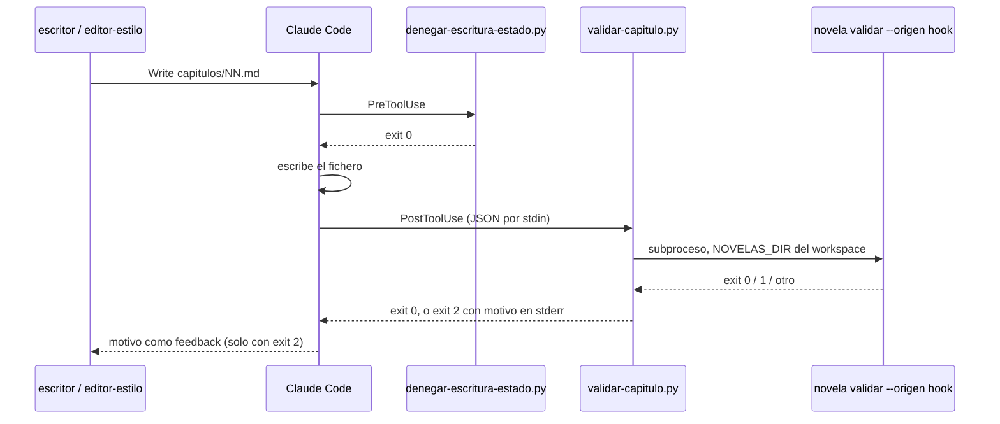

# 0008 — Validar el capítulo con un hook PostToolUse en cuanto se escribe

## 1. Resumen

Un hook `PostToolUse` versionado en `.claude/hooks/` ejecuta `novela validar` cada vez que el `escritor` o el `editor-estilo` escriben `novelas/<slug>/capitulos/NN.md`. Si hay hallazgos, se los devuelve al agente como feedback bloqueante dentro de su misma invocación. Así el gate mecánico corre siempre, lo llame o no el orquestador, y el requisito HAR-04 del entregable pasa a tener evidencia en `.claude/settings.json`, en un script y en sus tests.

## 2. Contexto y problema

Hoy `.claude/settings.json` registra un solo hook: el `PreToolUse` de política `.claude/hooks/denegar-escritura-estado.py`, probado en `backend/tests/test_hook.py` (`docs/architecture.md` §7.1). `novela validar <slug> <cap>` (`backend/novela/slices/validacion/cmd.py`) solo se ejecuta cuando el orquestador lo llama en los pasos 3 y 5 de `.claude/commands/novela-continuar.md`. Si la sesión principal se salta un paso, lo que la protege es la custodia de `aplicar-delta` (`docs/validators.md` §4.17, F-30), que actúa al final del capítulo, cuando las tres revisiones ya se han pagado. `docs/validators.md` §5.8 reconoce que el procedimiento no es código y que su cumplimiento solo lo cubre la novela de humo.

La auditoría del entregable (`docs/auditoria-entregable.md`, fila HAR-04) marca el requisito como «falta»: «Ningún hook de `.claude/settings.json` valida el capítulo: el único hook es de policy».

Hay tres restricciones que vienen del diseño actual:

- `novela validar` escribe una línea `validar NN -> <código>` en `runs/<run_id>/harness.log`, y el procedimiento cuenta los intentos del gate mecánico sumando las líneas `validar NN -> 1` (`.claude/commands/novela-continuar.md` § Cuenta de intentos). Si una validación lanzada por el hook dejara una línea igual, gastaría intentos que el orquestador no ha usado.
- El hook existente solo usa stdlib y no importa `backend/`, porque corre fuera del venv (docstring de `.claude/hooks/denegar-escritura-estado.py`). El hook nuevo tiene la misma restricción.
- En `PostToolUse` la escritura ya se ha hecho: un exit 2 no la deshace, solo devuelve el motivo al modelo. «Bloqueante» quiere decir aquí que el agente recibe el rechazo antes de terminar su turno.

Solapamientos y coherencia con otras specs:

- **0003** (implementada) creó el hook `PreToolUse`, `settings.json` y su test de contrato (CA-06 en `test_contratos.py::test_settings_de_claude`). Esta spec añade un segundo registro sin tocar el primero.
- **0001** (implementada) define `validar` y la custodia: `qa/NN-validacion.json` con el sha256 del fichero validado.
- **0002** (aceptada, sin implementar) añade `validar --final` y `novela gate`, que cuenta sus propias líneas `gate NN <tipo> -> 1` (spec 0002 §8, «Cuenta» y «Repetición»). Ver D12.
- **0007** (propuesta) añade el hallazgo `regeneracion_altera_contrato` a `validar` (RF-31) y casos en `test_hook.py` (RF-23). El hook reenvía cualquier hallazgo sin conocer sus tipos, y no se activa con rutas bajo `versiones/`.

## 3. Objetivos y no objetivos

### 3.1 Objetivos

- **O-01.** Toda escritura correcta del `escritor` o del `editor-estilo` sobre `capitulos/NN.md` dispara `novela validar` sin que intervenga el orquestador.
- **O-02.** Un capítulo con hallazgos vuelve al agente que lo escribió, dentro de la misma invocación, con el detalle suficiente para corregirlo.
- **O-03.** Las validaciones del hook no cambian la cuenta de intentos del procedimiento ni su tabla de reanudación.
- **O-04.** El hook falla cerrado y queda cubierto por tests de subproceso y por el test de contrato de `.claude/`, con `uv run pytest`, `mypy --strict` y `ruff` en verde.
- **O-05.** `docs/validators.md` §6 recoge el nuevo punto de ejecución.

### 3.2 No objetivos

- No se modifican `.claude/commands/novela-continuar.md` ni `novela-nueva.md`: los pasos 3 y 5 siguen llamando a `novela validar` como gate que cuenta (ver D7).
- No se modifican los prompts de ningún agente de `.claude/agents/`.
- No se añade un hook `SubagentStop` (ver D1).
- No se cambia ningún modelo Pydantic, esquema de `backend/schemas/` ni `InformeQA`.
- No se validan con este hook `plan/`, `canon/`, `qa/` ni `estado/deltas/`.
- No se implementa `validar --final` ni `novela gate`, que son de la spec 0002 (ver D12).
- No se limita desde el hook el número de autocorrecciones dentro de una invocación (ver D8).
- No se deshace la escritura rechazada: `PostToolUse` no puede.
- No se tocan `.claude/hooks/denegar-escritura-estado.py`, `.claude/settings.local.json` ni la API.

## 4. Usuarios y escenarios

Actores: el `escritor` y el `editor-estilo` (subagentes que escriben el capítulo), el orquestador (sesión principal), la persona que desarrolla el harness y la que audita el entregable.

- Como `escritor`, quiero enterarme de que al capítulo le falta una pista del plan en cuanto lo escribo, para corregirlo en la misma invocación y no gastar un reintento del gate.
- Como orquestador, quiero que la validación ocurra aunque yo me salte un paso, sin que eso altere mi cuenta de intentos en `harness.log`.
- Como persona que audita el entregable, quiero ver en `.claude/settings.json` un hook que valida el capítulo, con su script versionado y sus tests, para marcar HAR-04 como cumplido.

## 5. Requisitos funcionales

| ID | Requisito (EARS) | Prioridad |
|----|------------------|-----------|
| RF-01 | Cuando un `Write`, `Edit` o `MultiEdit` termina con éxito sobre una ruta que, normalizada contra `cwd`, acaba en `novelas/<slug>/capitulos/<NN>.md` (NN de 2 o 3 dígitos), y el `agent_type` de la entrada es `escritor`, `editor-estilo` o no viene, el hook debe ejecutar `novela validar <slug> <NN como entero> --origen hook` con `NOVELAS_DIR` igual al directorio `novelas` de esa ruta y el resto del entorno heredado (ver D2, D9). | Must |
| RF-02 | Cuando `novela validar` sale con 0, el hook debe salir con 0 sin escribir nada en stdout ni en stderr. | Must |
| RF-03 | Cuando `novela validar` sale con 1, el hook debe salir con 2 y escribir en stderr un mensaje que empiece por `validar-capitulo:`, nombre `qa/NN-validacion.json` y liste cada hallazgo de ese informe con `tipo`, `gravedad`, `ubicacion` y `descripcion`, con un máximo de 4.000 caracteres (ver D5). | Must |
| RF-04 | Si la entrada no es JSON, si falta `tool_input.file_path` o no es texto, si `novela` no resuelve en el `PATH`, si `novela validar` sale con un código distinto de 0 y 1 o tarda más de 45 s, o si tras un 1 no existe `qa/<NN tal como se escribió>-validacion.json`, entonces el hook debe salir con 2 y escribir en stderr un mensaje que empiece por `validar-capitulo: fallo del harness, no del capítulo`, con la causa en una línea y la indicación de no reescribir el capítulo y terminar informando (ver D6, D13). | Must |
| RF-05 | Si la ruta no acaba en `novelas/<slug>/capitulos/<NN>.md`, si `tool_name` no es `Write`, `Edit` ni `MultiEdit`, o si `agent_type` es un valor distinto de `escritor` y `editor-estilo`, entonces el hook debe salir con 0 sin ejecutar `novela` (ver D2). | Must |
| RF-06 | `novela validar` debe aceptar la opción `--origen` con los valores `orquestador` (por defecto) y `hook`. Con `hook`, debe registrar su línea de `harness.log` con la orden `validar-hook NN`, y la línea no debe contener la subcadena `validar NN -> `. Todo lo demás (código de salida, `qa/NN-validacion.json`, `capitulo_sha256` y salida estándar) debe ser idéntico al de `orquestador` (ver D3, D4). | Must |
| RF-07 | Si `--origen` recibe un valor distinto de `orquestador` o `hook`, entonces `novela validar` debe salir con 2 sin escribir `qa/` ni `harness.log`. | Should |
| RF-08 | El script `.claude/hooks/validar-capitulo.py` solo debe importar módulos de la biblioteca estándar, no debe importar `novela` ni nada de `backend/` y no debe escribir ningún fichero. Las únicas escrituras de la cadena son las que ya hace `novela validar`: `qa/NN-validacion.json`, `harness.log` y el lock `estado/state.lock` (ver D10). | Must |
| RF-09 | `.claude/settings.json` debe registrar en `hooks.PostToolUse` una entrada con `matcher` `Write\|Edit\|MultiEdit` y una orden `python "$CLAUDE_PROJECT_DIR/.claude/hooks/validar-capitulo.py"` con `timeout` de 60 s. El registro `PreToolUse`, `permissions` y `.claude/settings.local.json` no deben cambiar (ver D13). | Must |
| RF-10 | Si `.claude/hooks/validar-capitulo.py` no existe, entonces `novela comprobar-entorno` debe informar del hallazgo `falta .claude/hooks/validar-capitulo.py` y salir con el mismo código que para el hook `PreToolUse` ausente (ver D11). | Should |
| RF-11 | En el mismo commit que el código, el repositorio debe describir el hook en `docs/validators.md` §6 (fila nueva «Cada escritura de `capitulos/NN.md` por el `escritor` o el `editor-estilo`»), en §4.17 (filas de fallo nuevas con estado `activo` o `propuesto`), y en `docs/architecture.md` §3.1 (árbol) y §7.1 (hooks), además de la opción `--origen` donde `architecture.md` documente `validar`. | Must |

## 6. Requisitos no funcionales

| ID | Categoría | Requisito | Métrica | Umbral |
|----|-----------|-----------|---------|--------|
| RNF-01 | Rendimiento | Coste del hook en escrituras fuera de alcance (RF-05), que pagan todas las escrituras de cualquier sesión | Mediana del tiempo de pared del subproceso en 20 ejecuciones | ≤ 300 ms |
| RNF-02 | Rendimiento | Coste del hook al validar un capítulo del fixture `demo-24` | Mediana del tiempo de pared del subproceso en 5 ejecuciones | ≤ 3.000 ms |
| RNF-03 | Seguridad | El hook no escribe bajo `estado/` | Ficheros nuevos o modificados bajo `estado/` tras una ejecución, sin contar `state.lock`, y sha256 de `estado.db` antes y después | 0 ficheros; sha256 idéntico |
| RNF-04 | Privacidad del secreto | El feedback no lleva prosa del capítulo ni texto del canon, y no satura el contexto del agente | Longitud de stderr; subcadenas del cuerpo del capítulo de 8 palabras o más presentes en stderr | ≤ 4.000 caracteres; 0 subcadenas |
| RNF-05 | Compatibilidad | Solo stdlib (RF-08) | Módulos importados por el script fuera de `sys.stdlib_module_names` | 0 |
| RNF-06 | Calidad | La suite y los analizadores en verde, sin llamadas a modelo | Tests fallidos en `uv run pytest`; errores de `mypy --strict` y de `ruff`; clientes de modelo detectados por `test_sin_clientes_de_modelo` | 0 en los cuatro |

## 7. Criterios de aceptación

### CA-01 (cubre RF-01, RF-02, RF-06)
- **Dado** el workspace `demo-24` del fixture con un `capitulos/08.md` válido y `NOVELA_RUN_ID` fijado
- **Cuando** el script recibe por stdin una entrada `PostToolUse` con `tool_name: Write`, `tool_input.file_path` igual a la ruta absoluta de `capitulos/08.md` y `agent_type: escritor`
- **Entonces** sale con 0, stdout y stderr están vacíos, la última línea de `harness.log` contiene `validar-hook 08 -> 0` y ninguna línea contiene `validar 08 -> `, y `qa/08-validacion.json` dice `aprobado` con el `capitulo_sha256` del fichero

### CA-02 (cubre RF-01, RF-03, RNF-04)
- **Dado** el mismo workspace con un `capitulos/08.md` cuyo frontmatter deja `pistas_plantadas` vacío mientras el plan manda plantar `pis-004`
- **Cuando** el script recibe la misma entrada que en CA-01
- **Entonces** sale con 2, stderr empieza por `validar-capitulo:`, contiene `qa/08-validacion.json` y `pis-004`, mide como mucho 4.000 caracteres y no contiene ninguna subcadena de 8 palabras del cuerpo, y la última línea de `harness.log` contiene `validar-hook 08 -> 1`

### CA-03 (cubre RF-01)
- **Dado** el capítulo inválido de CA-02
- **Cuando** el script recibe, en tres ejecuciones, un `Edit` con `agent_type: editor-estilo`, un `MultiEdit` con `agent_type: escritor` y un `Write` sin `agent_type`
- **Entonces** las tres salen con 2 y añaden una línea `validar-hook 08 -> 1` a `harness.log`

### CA-04 (cubre RF-05, RNF-01)
- **Dado** el workspace `demo-24`
- **Cuando** el script recibe escrituras sobre `qa/08-estilo.json`, `versiones/v1/capitulos/01.md`, `capitulos/08.md.tmp` y una ruta fuera de `novelas/`, una escritura sobre `capitulos/08.md` con `agent_type: Explore` y una entrada con `tool_name: Read`
- **Entonces** todas salen con 0 sin salida, `harness.log` no gana ninguna línea y la mediana de 20 ejecuciones fuera de alcance es ≤ 300 ms

### CA-05 (cubre RF-04)
- **Dado** el workspace `demo-24`
- **Cuando** el script recibe texto que no es JSON, un `Write` sin `file_path`, un `Write` válido con un `PATH` del que se ha quitado `novela`, un capítulo de un slug sin workspace (`novela` sale con 4), un capítulo `99.md` fuera del rango de la novela (sale con 2) o un capítulo válido mientras el test tiene tomado `estado/state.lock` (sale con 3)
- **Entonces** cada caso sale con 2 y stderr empieza por `validar-capitulo: fallo del harness, no del capítulo`

### CA-06 (cubre RF-04)
- **Dado** el workspace `demo-24`, cuyo ancho de capítulo es de dos dígitos, y un fichero `capitulos/008.md`
- **Cuando** el script recibe un `Write` sobre `capitulos/008.md` con `agent_type: escritor`
- **Entonces** sale con 2, stderr empieza por `validar-capitulo: fallo del harness, no del capítulo` y nombra `qa/008-validacion.json` como ausente

### CA-07 (cubre RF-06)
- **Dado** el workspace `demo-24` con un `capitulos/08.md` válido
- **Cuando** se ejecuta `novela validar demo-24 8` y después `novela validar demo-24 8 --origen hook`
- **Entonces** las dos salen con 0 y la misma salida estándar, las dos escriben un `qa/08-validacion.json` con el mismo contenido, la primera línea que añaden a `harness.log` contiene `validar 08 -> 0` y la segunda contiene `validar-hook 08 -> 0` sin la subcadena `validar 08 -> `

### CA-08 (cubre RF-07)
- **Dado** el workspace `demo-24`
- **Cuando** se ejecuta `novela validar demo-24 8 --origen otro`
- **Entonces** sale con 2 y ni `qa/08-validacion.json` ni `harness.log` cambian

### CA-09 (cubre RF-08, RNF-03, RNF-05)
- **Dado** el script `.claude/hooks/validar-capitulo.py`
- **Cuando** el test analiza con `ast` sus imports y ejecuta los casos de CA-01 y CA-02 tomando una instantánea de `estado/` antes y después
- **Entonces** todos los módulos importados están en `sys.stdlib_module_names`, ninguno es `novela`, y bajo `estado/` no hay ficheros nuevos ni modificados salvo `state.lock`, con el sha256 de `estado.db` sin cambios

### CA-10 (cubre RF-09)
- **Dado** `.claude/settings.json`
- **Cuando** corre `test_contratos.py`
- **Entonces** hay exactamente un registro `PostToolUse` con `matcher` `Write|Edit|MultiEdit`, una sola orden que empieza por `python `, nombra `$CLAUDE_PROJECT_DIR/.claude/hooks/validar-capitulo.py` y ese fichero existe, `timeout` vale 60, y siguen pasando sin cambios las aserciones de CA-06 de la spec 0003 sobre `permissions` y `PreToolUse`

### CA-11 (cubre RF-10)
- **Dado** un repositorio sintético sin `.claude/hooks/validar-capitulo.py`
- **Cuando** se ejecuta `novela comprobar-entorno`
- **Entonces** la salida contiene `falta .claude/hooks/validar-capitulo.py`, y con el fichero presente ese hallazgo no aparece

### CA-12 (cubre RF-11)
- **Dado** el commit que implementa la spec
- **Cuando** se revisa el diff de `docs/`
- **Entonces** `docs/validators.md` §6 tiene la fila del nuevo punto de ejecución, §4.17 tiene sus filas de fallo, y `docs/architecture.md` §3.1 y §7.1 nombran `validar-capitulo.py` y su registro `PostToolUse`

## 8. Diseño propuesto

### 8.1 Visión general



El hook es un segundo punto de ejecución del mismo gate. No sustituye a los pasos 3 y 5 del procedimiento, que siguen siendo los que cuentan intentos (ver D7). Como la validación del hook escribe `qa/NN-validacion.json` igual que cualquier otra, la custodia de `aplicar-delta` queda satisfecha aunque el orquestador se salte el paso 5, siempre que la última escritura del capítulo pase (ver D4).

### 8.2 Componentes afectados

Nuevos:
- `.claude/hooks/validar-capitulo.py`: el hook.
- `backend/tests/test_hook_validacion.py`: tests del hook como subproceso (ver D14).

Modificados:
- `.claude/settings.json`: registro `PostToolUse`.
- `backend/novela/slices/validacion/cmd.py`: opción `--origen`.
- `backend/novela/slices/validacion/test_validacion.py`: CA-07 y CA-08.
- `backend/tests/test_contratos.py`: CA-10.
- `backend/novela/slices/entorno/comprobaciones.py`, `backend/novela/slices/entorno/cmd.py` y `backend/novela/slices/entorno/test_entorno.py`: CA-11.
- `docs/validators.md` §4.17 y §6, y `docs/architecture.md` §3.1, §7.1 y la descripción de `validar`.

Sin cambios: `.claude/hooks/denegar-escritura-estado.py`, `.claude/settings.local.json`, `.claude/agents/*.md`, `.claude/commands/*.md`, `backend/schemas/`, `backend/api/` y `frontend/`. `hashes_claude` del manifiesto ya incluye `.claude/hooks/*` (`backend/novela/plataforma/run.py`), así que el script nuevo queda atribuido sin tocar código.

### 8.3 Modelo de datos

No aplica: no cambia ningún modelo de `backend/novela/dominio/` ni ningún esquema. La única novedad persistida es el texto de la orden en la línea de `harness.log` (`validar-hook NN`), que no es contrato de ningún agente (`docs/definitions.md`, entrada `runs/<run_id>/`).

### 8.4 Interfaces y contratos

**Registro en `.claude/settings.json`** (se añade junto a `PreToolUse`):

```json
"PostToolUse": [
  {
    "matcher": "Write|Edit|MultiEdit",
    "hooks": [
      {
        "type": "command",
        "command": "python \"$CLAUDE_PROJECT_DIR/.claude/hooks/validar-capitulo.py\"",
        "timeout": 60
      }
    ]
  }
]
```

**Entrada del hook** (stdin, JSON de Claude Code): se leen solo `tool_name`, `tool_input.file_path`, `cwd` y `agent_type`, nunca el resto de `tool_input` ni `tool_response`, siguiendo la regla del hook existente. El stdin se lee como bytes, igual que en `denegar-escritura-estado.py`.

**Ruta:** se normaliza con `os.path.normpath(os.path.join(cwd, ruta))` y `\` → `/`. Se busca la última aparición de `/novelas/<slug>/capitulos/<NN>.md` al final de la ruta, con `NN` = `\d{2,3}` y sin distinguir mayúsculas al comparar los literales. Se conservan la grafía original del directorio `novelas` para `NOVELAS_DIR` y la del slug para la orden. La validación del slug la hace el CLI.

**Invocación:** `[shutil.which("novela"), "validar", slug, str(int(NN)), "--origen", "hook"]`, con `env = os.environ | {"NOVELAS_DIR": <dir novelas>}`, `capture_output`, `timeout=45` y sin shell (ver D9, D13).

**Salida del hook:**

| Situación | Código | stderr |
|---|---|---|
| Fuera de alcance (RF-05) | 0 | vacío |
| `validar` → 0 | 0 | vacío |
| `validar` → 1 | 2 | `validar-capitulo: capitulos/NN.md rechazado por novela validar (<n> hallazgos en qa/NN-validacion.json). Corrige el capítulo y vuelve a escribirlo:` y una línea `- <tipo> (<gravedad>) <ubicacion o «sin ubicación»>: <descripcion>` por hallazgo; truncado a 4.000 caracteres con `…` |
| Fallo del harness (RF-04) | 2 | `validar-capitulo: fallo del harness, no del capítulo: <causa en una línea>. No reescribas el capítulo: termina e informa.` |

**CLI:** `novela validar <slug> <cap> [--origen orquestador|hook]`. Con `hook`, `run.registro("validar-hook", nn)` en lugar de `run.registro("validar", nn)`. Los códigos de salida no cambian.

### 8.5 Flujo principal

1. El `escritor` escribe `capitulos/08.md` con `Write`. El `PreToolUse` lo permite (regla 2, salida propia).
2. Claude Code ejecuta el `PostToolUse` con la entrada JSON.
3. El hook comprueba `tool_name`, extrae la ruta, la normaliza y detecta `novelas/demo/capitulos/08.md`. `agent_type` es `escritor`.
4. Resuelve `novela` en el `PATH` y ejecuta `novela validar demo 8 --origen hook` con `NOVELAS_DIR` apuntando a `…/novelas`.
5. `validar` toma el lock, reutiliza el run abierto del capítulo, escribe `qa/08-validacion.json` y la línea `validar-hook 08 -> 1 · …`, y sale con 1.
6. El hook lee `qa/08-validacion.json`, compone el mensaje con los hallazgos y sale con 2.
7. Claude Code entrega el mensaje al `escritor`, que corrige y vuelve a escribir el capítulo. Se repiten los pasos 2 a 5 hasta que `validar` sale con 0 y el hook con 0 sin salida.
8. El `escritor` termina. El orquestador ejecuta su paso 3 (`novela validar` sin `--origen`), que deja `validar 08 -> 0` y sigue el procedimiento de siempre.

## 9. Casos límite y gestión de errores

| Caso | Comportamiento esperado | Requisito relacionado |
|------|-------------------------|-----------------------|
| El `editor-estilo` hace varios `Edit` seguidos y los intermedios no pasan | Cada `Edit` valida y recibe su feedback. Las líneas `validar-hook` no cuentan intentos | RF-01, RF-06 |
| Escritura sin `agent_type` sobre un capítulo (la sesión principal ya la deniega el `PreToolUse`, regla 3; solo pasaría si Claude Code dejara de mandar el campo) | Se valida (falla cerrado) | RF-01 |
| `agent_type` de desarrollo (`Explore`, `general-purpose`) sobre una ruta `…/novelas/<slug>/capitulos/NN.md` | Sale con 0 sin validar | RF-05 |
| `capitulos/008.md` en un workspace de dos dígitos | `validar` valida `08.md` y escribe `qa/08-validacion.json`. El hook no encuentra `qa/008-validacion.json` y lo trata como fallo del harness | RF-04 |
| Ruta bajo `versiones/vN/capitulos/` (spec 0007) | Fuera de alcance: `<slug>` no puede contener `/` | RF-05 |
| `novela validar` sale con 2, 3 o 4, o con un traceback | Fallo del harness, exit 2 | RF-04 |
| `novela` no está en el `PATH` (F-50, F-57) | Fallo del harness, exit 2 | RF-04 |
| `validar` no termina en 45 s | Se mata el subproceso: fallo del harness, exit 2, antes de que Claude Code mate el hook a los 60 s y lo trate como no bloqueante | RF-04 |
| `python` no resuelve o la ruta del script está mal | Claude Code recibe un código distinto de 2 y sigue: falla abierto. Lo detecta `comprobar-entorno` (RF-10), y los pasos 3 y 5 del procedimiento siguen validando | RF-09, RF-10 |
| La escritura falla (p. ej. la deniega el `PreToolUse`) | Claude Code no ejecuta `PostToolUse` para herramientas que fallan: no hay validación ni línea | RF-01 |
| `qa/NN-validacion.json` ilegible tras un 1 | Fallo del harness, exit 2 | RF-04 |
| Informe con muchos hallazgos | Mensaje truncado a 4.000 caracteres. El informe completo sigue en `qa/` | RF-03 |

## 10. Dependencias y supuestos

Dependencias:
- Spec 0001: `novela validar`, `qa/NN-validacion.json` y la custodia.
- Spec 0003: registro de hooks en `settings.json`, `test_settings_de_claude`, `comprobar-entorno` y el patrón de subproceso de `test_hook.py`.
- Fixture `demo-24` y `tests.fixtures.fabrica`, que ya usa `backend/novela/slices/validacion/test_validacion.py`.
- Spec 0002 (sin implementar): la spec que implemente `validar --final` decide si el hook del `editor-estilo` debe pasarlo (ver D12).
- Spec 0007 (propuesta): sus cambios en `validar` llegan al hook sin tocarlo.

Supuestos (no contractuales en Claude Code, `docs/validators.md` §5.10; los verifica la demostración T-07):
- **Supuesto:** la entrada de `PostToolUse` trae `tool_name`, `tool_input.file_path` y `cwd`, y dentro de un subagente trae `agent_type` igual que `PreToolUse` (F-12).
- **Supuesto:** con exit 2 en `PostToolUse`, Claude Code entrega stderr al modelo que invocó la herramienta, también cuando es un subagente.
- **Supuesto:** los hooks de proyecto se ejecutan dentro de los subagentes, como ya ocurre con el `PreToolUse` (`docs/validators.md` §4.17, F-12 y F-17).
- **Supuesto:** con `uv run pytest`, `novela` resuelve en el `PATH` del subproceso del test, porque `uv run` antepone el directorio de scripts del venv.

## 11. Riesgos

| Riesgo | Probabilidad (A/M/B) | Impacto (A/M/B) | Mitigación |
|--------|----------------------|-----------------|------------|
| `PostToolUse` no trae `agent_type` en subagentes | M | B | Sin `agent_type` se valida igualmente (RF-01), así que el hook no se apaga. T-07 lo observa |
| El agente entra en un bucle de autocorrección dentro de una invocación y gasta cuota de opus | B | A | El gate del orquestador sigue contando; T-07 mide cuántas líneas `validar-hook NN -> 1` deja cada invocación. Se reabre si alguna pasa de 3 (ver D8) |
| Feedback ruidoso en los `Edit` intermedios del `editor-estilo` | M | M | Las líneas no cuentan (RF-06). T-07 lo mide. Si molesta, la alternativa es `SubagentStop` en otra spec (ver D1) |
| El hook falla abierto porque `python` o el script no resuelven | B | M | `comprobar-entorno` (RF-10 y la comprobación de `python` que ya existe). Los pasos 3 y 5 siguen validando |
| Contención del lock con una orden `novela` manual en paralelo | B | B | Exit 3 → fallo del harness con causa. El agente termina y el orquestador reintenta según su procedimiento |
| El feedback filtra el misterio al `escritor` | B | A | Solo se reenvían campos de `qa/NN-validacion.json`, que el procedimiento ya pasa al `escritor` en reintento (paso 3). Nunca se reenvía prosa ni canon (RNF-04) |
| Con la spec 0002, una línea `validar-hook` entre dos llamadas iguales a `novela gate` rompe la repetición idempotente (spec 0002 RNF-04) | B | B | Solo ocurre si el capítulo se reescribió entre medias, y entonces las entradas del gate también han cambiado (ver D12) |

## 12. Plan de implementación

| ID | Tarea | Cubre | Verificación |
|----|-------|-------|--------------|
| T-01 | Opción `--origen` en `novela validar`: CA-07 y CA-08 en `test_validacion.py`, vistos en rojo, y después `cmd.py` | RF-06, RF-07 | CA-07 y CA-08 en verde. `test_sesion_en_el_log` sin cambios y en verde |
| T-02 | `backend/tests/test_hook_validacion.py` con CA-01 a CA-06 y CA-09 en rojo, y después `.claude/hooks/validar-capitulo.py` | RF-01, RF-02, RF-03, RF-04, RF-05, RF-08 | CA-01 a CA-06 y CA-09 en verde, RNF-01 a RNF-05 medidos en los tests |
| T-03 | Registro `PostToolUse` en `.claude/settings.json` y CA-10 en `test_contratos.py` | RF-09 | CA-10 en verde. `git diff` no muestra `.claude/settings.local.json` |
| T-04 | Hallazgo del hook ausente en `comprobar-entorno` | RF-10 | CA-11 en verde en `test_entorno.py` |
| T-05 | `docs/validators.md` §6 y §4.17, y `docs/architecture.md` §3.1, §7.1 y la descripción de `validar`, en el commit de T-02/T-03 | RF-11 | CA-12 por revisión del diff |
| T-06 | Cierre: `uv run pytest` completo, `mypy --strict` (incluido el hook) y `ruff` | RF-01 a RF-11 | RNF-06: cero fallos y cero errores |
| T-07 | Demostración: un capítulo de una novela de humo en una sesión del harness (`--setting-sources project,local`) | RF-01, RF-03, RF-09 | El `harness.log` del run tiene al menos una línea `validar-hook NN -> ` con `sesion=`, y el procedimiento cuenta igual que sin hook. Resultado anotado en `docs/validators.md` §4.17 |

## 13. Estrategia de pruebas

- **Unitario / integración de subproceso** (`backend/tests/test_hook_validacion.py`): el script se ejecuta con `sys.executable`, como en `test_hook.py`, con la entrada JSON por stdin y `NOVELA_RUN_ID` fijado. El script llama al `novela` real contra el workspace `demo-24` de `tmp_path`. Casos: `test_capitulo_valido` (CA-01), `test_capitulo_invalido` (CA-02), `test_herramientas_y_roles_que_validan` (CA-03), `test_fuera_de_alcance` (CA-04, con la medida de RNF-01), `test_falla_cerrado` (CA-05), `test_ancho_de_capitulo` (CA-06), `test_solo_stdlib_y_sin_estado` (CA-09) y `test_rendimiento` (RNF-02). Datos siempre del fixture sintético, sin nombres reales.
- **Unitario del CLI** (`backend/novela/slices/validacion/test_validacion.py`): `test_origen_hook_en_el_log` (CA-07) y `test_origen_invalido` (CA-08).
- **Contrato** (`backend/tests/test_contratos.py`): `test_settings_de_claude` sigue igual y `test_hook_de_validacion_registrado` es nuevo (CA-10).
- **Unitario de entorno** (`backend/novela/slices/entorno/test_entorno.py`): `test_hook_de_validacion_ausente` (CA-11).
- **Análisis**: `mypy --strict` y `ruff` sobre el script (`docs/validators.md` §2 ya los aplica al hook). El `timeout` de 45 s se comprueba leyendo el código: probarlo en ejecución costaría 45 s por test.
- **Revisión (I)**: CA-12 sobre el diff de `docs/`.
- **Demostración (D)**: T-07, en una sesión real de Claude Code. Es la única prueba de los supuestos de §10. Ningún test de `pytest` llama a un modelo.

## 14. Matriz de trazabilidad

| RF | Criterios de aceptación | Tareas | Tests |
|----|-------------------------|--------|-------|
| RF-01 | CA-01, CA-02, CA-03 | T-02, T-06, T-07 | `test_hook_validacion.py::test_capitulo_valido`, `::test_capitulo_invalido`, `::test_herramientas_y_roles_que_validan`; demostración T-07 |
| RF-02 | CA-01 | T-02, T-06 | `test_hook_validacion.py::test_capitulo_valido` |
| RF-03 | CA-02 | T-02, T-06, T-07 | `test_hook_validacion.py::test_capitulo_invalido`; demostración T-07 |
| RF-04 | CA-05, CA-06 | T-02, T-06 | `test_hook_validacion.py::test_falla_cerrado`, `::test_ancho_de_capitulo` |
| RF-05 | CA-04 | T-02, T-06 | `test_hook_validacion.py::test_fuera_de_alcance` |
| RF-06 | CA-01, CA-07 | T-01, T-06 | `test_validacion.py::test_origen_hook_en_el_log`; `test_hook_validacion.py::test_capitulo_valido` |
| RF-07 | CA-08 | T-01, T-06 | `test_validacion.py::test_origen_invalido` |
| RF-08 | CA-09 | T-02, T-06 | `test_hook_validacion.py::test_solo_stdlib_y_sin_estado` |
| RF-09 | CA-10 | T-03, T-06, T-07 | `test_contratos.py::test_hook_de_validacion_registrado`, `::test_settings_de_claude`; demostración T-07 |
| RF-10 | CA-11 | T-04, T-06 | `test_entorno.py::test_hook_de_validacion_ausente` |
| RF-11 | CA-12 | T-05, T-06 | Revisión (I) del diff de `docs/` |

## 16. Decisiones

Ver decisions.md
- D1 — PostToolUse y no SubagentStop
- D2 — Quién dispara la validación
- D3 — Que las validaciones del hook no cuenten como intentos
- D4 — El hook escribe el informe de validación como cualquier otra
- D5 — Contenido del feedback
- D6 — Qué significa fallar cerrado en PostToolUse
- D7 — Los pasos 3 y 5 del procedimiento no cambian
- D8 — Sin límite de autocorrecciones en el hook
- D9 — Cómo encuentra el hook a `novela` y al workspace
- D10 — Alcance de «no se escribe nada bajo estado/»
- D11 — `comprobar-entorno` vigila el hook nuevo
- D12 — Coherencia con la spec 0002
- D13 — Tiempos límite
- D14 — Fichero de test propio
