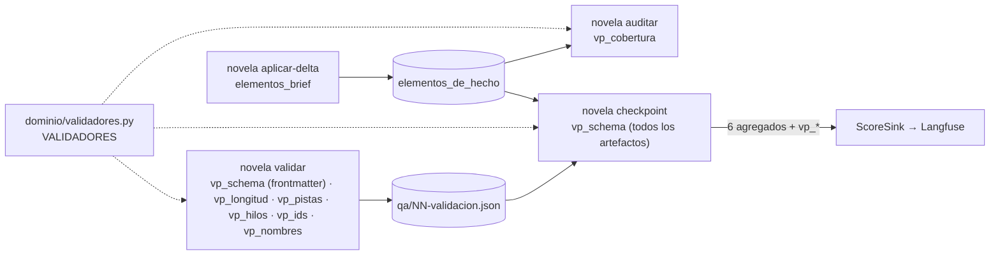

# 0009 — Completar los validadores programáticos del capítulo y emitir un score por validador

## 1. Resumen

Se completan los validadores programáticos de la novela personalizada de regalo y se les da una identidad estable. Hay tres comprobaciones nuevas y deterministas: que el brief y las salidas de cada rol cumplen su esquema (`vp_schema`), que el nombre del destinatario y los de los personajes se escriben exactamente como en la story bible (`vp_nombres`), y que cada elemento personalizado obligatorio del brief aparece en al menos un capítulo según `libro_de_hechos` (`vp_cobertura`). Cada validador, nuevo o existente, tiene un nombre, un punto de ejecución concreto y un score propio en Langfuse. `docs/validators.md` los recoge en una tabla nombre → punto de ejecución → score.

## 2. Contexto y problema

**Estado actual.** `backend/novela/slices/validacion/gates.py` ejecuta en `novela validar` cinco gates puros: frontmatter, longitud, pistas, hilos e ids. `backend/schemas/` cubre capítulo, delta, informe de QA, canon y plan, y `backend/tests/test_contratos.py` comprueba que coinciden con el código. `backend/novela/slices/checkpoint/cmd.py` emite seis scores agregados (`coherencia`, `continuidad`, `tension`, `longitud`, `fair_play`, `estilo`) por `backend/novela/plataforma/langfuse.py`, con las claves del entorno o de `.env` (`docs/architecture.md` §10.1 y §10.5). `docs/validators.md` §6 lista qué corre en cada punto, pero ningún validador tiene nombre propio ni score propio.

**Qué dice la auditoría del entregable** (`docs/auditoria-entregable.md` § VP):

- VP-01 «parcial»: no hay brief ni esquema del brief.
- VP-02 «parcial»: `gates.py::_ids` valida ids, pero no se comprueba la grafía del nombre del destinatario ni de los personajes.
- VP-04 «falta»: no se comprueba que cada elemento personalizado obligatorio del brief aparezca en algún capítulo según la tabla de hechos.
- VP-07 «parcial»: solo se emiten 6 métricas agregadas y no hay una tabla validador → punto de ejecución → score.

OBS-04 añade que no se emiten como scores los gates de `validar`.

**Por qué ahora.** El producto es la novela de regalo de la spec 0005. Un nombre del destinatario mal escrito o un recuerdo del cliente que no aparece son los dos defectos que el cliente ve primero, y hoy ningún gate los detecta.

**Restricciones del repositorio que condicionan el diseño:**

- Tocar un gate de `validate.py` exige un test property-based (`AGENTS.md` § Proceso: generar código; `docs/validators.md` §3.6), y `mutmut` corre solo sobre `novela/slices/validacion/gates.py` y `novela/slices/delta/apply.py` (`backend/pyproject.toml` § `tool.mutmut`).
- Ningún test llama a un modelo ni a la red (`docs/validators.md` §3.5). `test_checkpoint.py` y `test_langfuse.py` sustituyen `urlopen` y `socket.create_connection`.
- Las claves de Langfuse solo salen del entorno o de `.env`, que git ignora (`AGENTS.md` § Nunca; `CLAUDE.md` § Claves y trazado).
- Lo barato va primero: `novela validar` corre antes de los revisores (`docs/validators.md` §6, «Regla de orden»).
- Un cambio de modelo Pydantic regenera `backend/schemas/` y actualiza `docs/definitions.md` en el mismo commit (`AGENTS.md` § Proceso: generar código).
- `libro_de_hechos` es append-only por trigger (`AGENTS.md` § Invariantes 2; `backend/novela/plataforma/esquema.sql`), así que el vínculo entre un recuerdo y un hecho no se puede añadir modificando filas existentes.

**Relación con otras specs.**

- **0005** (Propuesta, sin implementar) define `Brief`, `brief.schema.json` y `brief/brief.json` (su RF-28 y §8.3). Esta spec los consume y no los redefine (ver D1). Todo lo que lee el brief depende de que la 0005 esté implementada (§10).
- **0006** (Propuesta) añade `dedicatoria` al brief, que no es un elemento que deba aparecer en un capítulo (ver D7). También añade la tabla `apariciones` con un patrón que esta spec reutiliza.
- **0007** (Propuesta) añade `Delta.hechos_usados` y la tabla `usos_de_hecho`, y da versión al id de score (su RF-43). Esta spec sigue el mismo patrón de tabla aparte y append-only (ver D8), conserva su formato de id (ver D14) y toca los mismos ficheros: `estado.py`, `esquema.sql`, `slices/delta/` y `checkpoint/cmd.py` (§11).
- **0008** (Propuesta) ejecuta `novela validar` desde un hook `PostToolUse` y enumera en su RF-08 las únicas escrituras de `validar`. `vp_nombres` corre dentro de `validar` sin añadir escrituras (ver D16).
- **0002** (aceptada, sin implementar) añade `lexico_vetado` (VP-05), cambia el origen del score `estilo` y añade scores propios. Cuando se implemente, registrará su validador en el catálogo de esta spec (ver D16).

## 3. Objetivos y no objetivos

### 3.1 Objetivos

- **O-01** Hay un catálogo en código con siete validadores programáticos (`vp_schema`, `vp_longitud`, `vp_pistas`, `vp_hilos`, `vp_ids`, `vp_nombres`, `vp_cobertura`). Cada uno tiene un punto de ejecución concreto y los tipos de hallazgo que produce, y cada tipo de hallazgo de estos gates pertenece a exactamente un validador.
- **O-02** `novela checkpoint` rechaza un capítulo cuyas salidas de rol o cuyo brief no validan contra su modelo, y nombra el artefacto y el campo.
- **O-03** `novela validar` rechaza un capítulo con una variante no exacta del nombre de un personaje del canon o del destinatario del brief.
- **O-04** `novela auditar` rechaza una novela con brief en la que el nombre del destinatario o algún recuerdo del brief no aparece en ningún capítulo según `libro_de_hechos`.
- **O-05** `novela checkpoint` emite por el `ScoreSink` un score por validador con su nombre, además de los seis actuales. Un test con un sink falso lo comprueba sin red.
- **O-06** `docs/validators.md` tiene la tabla nombre → punto de ejecución → score, y un test falla si deja de coincidir con el catálogo.
- **O-07** `uv run pytest`, `mypy --strict` y `ruff` pasan en verde, y `mutmut` no deja supervivientes en `gates.py`.

### 3.2 No objetivos

- Definir el modelo `Brief` o su esquema. Son de la spec 0005 (ver D1).
- Emitir scores desde `novela validar`, `novela aplicar-delta` o `novela auditar`. Solo `checkpoint` sale a la red (ver D10, D11).
- Medir en Langfuse los fallos intermedios de un validador (intentos rechazados antes del definitivo) (ver D11).
- Dar score a las precondiciones de `aplicar-delta` (custodia, citas, hilos contra frontmatter). Bloquean antes del checkpoint y siempre valdrían 1 (ver D12).
- Comprobar la grafía por distancia de edición («Elana» por «Elena») o nombres en minúscula (ver D4).
- Comprobar que los `rasgos` del destinatario o la `dedicatoria` aparecen en los capítulos (ver D7).
- Planificar en qué capítulo aparece cada recuerdo, o comprobar la cobertura sobre el plan antes del capítulo 1. Queda para `validar-plan` de la spec 0002 (§11).
- Implementar `lexico_vetado` (VP-05) o la validación visual (VP-06).
- Cambiar `state.schema.json`, `backend/api/openapi.json` o `frontend/src/shared/api/esquema.gen.ts`, o añadir rutas a la API (RNF-09).
- Rellenar `elementos_de_hecho` en workspaces anteriores a esta spec.

## 4. Usuarios y escenarios

| Actor | Relación con esta spec |
|---|---|
| Cliente que encarga el regalo | Espera ver el nombre del destinatario bien escrito y sus recuerdos en la novela. No usa el harness |
| Operador humano | Lanza la novela y consulta los scores por validador en Langfuse |
| Orquestador (sesión principal) | Sigue `/novela-continuar`; un 1 de `validar` reintenta, uno de `checkpoint` escribe `intervencion.md` |
| `escritor`, `editor-estilo` | Reciben en `qa/NN-validacion.json` los hallazgos de `vp_nombres` en un reintento |
| `cronista` | Vincula en el delta cada recuerdo del brief con el hecho del capítulo que lo contiene |
| Persona que audita el entregable | Comprueba VP-01, VP-02, VP-04 y VP-07 en el código, los tests y `docs/validators.md` |

- Como operador, quiero ver en Langfuse un score por validador con un nombre estable, para saber qué validador falla en qué capítulo sin abrir `qa/`.
- Como cliente, quiero que el nombre del destinatario aparezca siempre con su grafía y que cada recuerdo que conté esté en algún capítulo, para que el regalo sea personal.
- Como desarrollador del harness, quiero que cada gate nuevo tenga propiedades de Hypothesis y resista `mutmut`, para que ninguno sea decorativo.

## 5. Requisitos funcionales

**Catálogo**

| ID | Requisito (EARS) | Prioridad |
|----|------------------|-----------|
| RF-01 | El sistema debe definir en `backend/novela/dominio/validadores.py` el catálogo `VALIDADORES` con siete entradas, una por validador: `vp_schema`, `vp_longitud`, `vp_pistas`, `vp_hilos`, `vp_ids`, `vp_nombres` y `vp_cobertura`. Cada entrada debe declarar sus puntos de ejecución, el punto en que bloquea, los `TipoHallazgo` que produce y la regla de su valor, según la tabla de §8.4 (ver D12, D13). | Must |
| RF-02 | El sistema debe asignar cada uno de los tipos `frontmatter_invalido`, `esquema_invalido`, `longitud_fuera_de_rango`, `pista_ausente`, `hilo_cerrado_sin_abrir`, `id_inexistente`, `nombre_mal_escrito` y `elemento_sin_cubrir` a exactamente un validador del catálogo con `validador_de(tipo)`, que debe devolver `None` para el resto de tipos (ver D12). | Must |

**`vp_schema` (VP-01)**

| ID | Requisito (EARS) | Prioridad |
|----|------------------|-----------|
| RF-03 | Cuando se ejecute `novela checkpoint <slug> <cap>`, antes de escribir el checkpoint, el sistema debe validar contra su modelo cada artefacto de la tabla de `vp_schema` de §8.4 y registrar un hallazgo `esquema_invalido` por artefacto que no valide o que sea obligatorio y no exista, con la ruta del artefacto en `referencia` y las rutas de campo del error en `ubicacion` (ver D2). | Must |
| RF-04 | Donde exista `brief/brief.json`, `vp_schema` debe validarlo contra el modelo `Brief` de la spec 0005 (ver D1). | Must |
| RF-05 | Si `vp_schema` registra algún hallazgo, entonces `novela checkpoint` debe salir con 1 sin escribir `checkpoints/NN.json` ni `checkpoints/latest.json`, emitir el score `vp_schema` con valor 0,0, escribir cada hallazgo en stderr y dejar en `harness.log` una línea `checkpoint NN -> 1 · vp_schema: esquema_invalido@<ruta>:<campo>; …` sin valores de los artefactos (ver D3, D19). | Must |

**`vp_nombres` (VP-02)**

| ID | Requisito (EARS) | Prioridad |
|----|------------------|-----------|
| RF-06 | El sistema debe construir las formas canónicas de `vp_nombres` con los tokens de `identidad.nombre` y de cada `identidad.alias` de `canon/personajes/*.md` y, donde exista `brief/brief.json`, de `destinatario.nombre.valor`. Solo cuenta un token de 3 o más letras cuyo primer carácter sea mayúscula (ver D4, D17). | Must |
| RF-07 | Cuando se ejecute `novela validar`, el sistema debe registrar un hallazgo `nombre_mal_escrito` de gravedad `alta` por cada forma distinta del cuerpo que sea variante de un token canónico según la regla de D4. El hallazgo debe llevar en `referencia` el id del personaje o `destinatario`, y en `ubicacion` las líneas del cuerpo donde aparece (ver D4, D6). | Must |
| RF-08 | Si un token canónico de `canon/personajes/<id>.md` es variante de un token de `destinatario.nombre.valor` según D4, entonces `vp_nombres` debe registrar un hallazgo `nombre_mal_escrito` con `referencia` `<id>` y `ubicacion` `canon/personajes/<id>.md` (ver D5). | Should |

**`vp_cobertura` (VP-04)**

| ID | Requisito (EARS) | Prioridad |
|----|------------------|-----------|
| RF-09 | El sistema debe derivar de un `Brief`, con la función pura `elementos_obligatorios(brief)`, la lista ordenada de elementos obligatorios: `destinatario.nombre` y `recuerdos[i]` para cada recuerdo, con `i` desde 0 en el orden del brief (ver D7, D9). | Must |
| RF-10 | El sistema debe añadir a `Delta` el campo `elementos_brief: list[ElementoCubierto]`, con `[]` por defecto, donde `ElementoCubierto` es `{elemento: ^recuerdos\[\d{1,2}\]$, hecho: HechoId}` (ver D8, D9). | Must |
| RF-11 | Cuando `novela aplicar-delta <slug> N` aplique un delta, el sistema debe registrar en la tabla `elementos_de_hecho` una fila `(elemento, hecho, N)` por cada entrada de `elementos_brief`, en la misma transacción que `estado_db.guardar`, sin duplicar filas al repetirse. Si la tabla no existe, debe crearla antes con su índice y sus triggers append-only (ver D8). | Must |
| RF-12 | Si una entrada de `elementos_brief` nombra un elemento que no está en `elementos_obligatorios` del brief, o si el workspace no tiene brief y la lista no está vacía, entonces `aplicar-delta` debe salir con 1 y la causa `elemento_inexistente` sin escribir estado. Si la entrada nombra un hecho que no está en el `libro_de_hechos` del mismo delta, debe hacer lo mismo con la causa `hecho_ajeno` (ver D8, D17). | Must |
| RF-13 | Cuando se ejecute `novela auditar` sobre un workspace con `brief/brief.json`, el sistema debe registrar en `qa/auditoria.json` un hallazgo `elemento_sin_cubrir` de gravedad `alta`, con la ruta del elemento en `referencia`, por cada elemento obligatorio no cubierto, y salir con 1. El nombre está cubierto si sus palabras aparecen como secuencia de palabras completas, tras NFC, en la `cita` de algún hecho de `libro_de_hechos`. Un recuerdo está cubierto si tiene al menos una fila en `elementos_de_hecho` (ver D7, D8, D10). | Must |
| RF-14 | Donde exista `brief/brief.json`, `novela briefing <slug> <cap> cronista` debe incluir la capa `elementos_brief`, con una línea `recuerdos[i]: «<cita>»` por recuerdo. El cuerpo de `.claude/agents/cronista.md` debe indicar que se vincula un recuerdo solo con un hecho nuevo del mismo delta que lo contiene, y nunca un elemento que no esté en esa capa (ver D18). | Must |

**Scores (VP-07)**

| ID | Requisito (EARS) | Prioridad |
|----|------------------|-----------|
| RF-15 | Cuando `novela checkpoint` cierre un capítulo, el sistema debe emitir por el `ScoreSink`, además de los seis scores actuales, un score por validador del catálogo con su nombre. El valor de `vp_schema` es el resultado de RF-03, 1,0 o 0,0. El de `vp_longitud`, `vp_pistas`, `vp_hilos`, `vp_ids` y `vp_nombres` es 1,0 si `qa/NN-validacion.json` no tiene ningún hallazgo de sus tipos y 0,0 si lo tiene. El de `vp_cobertura` es la fracción de elementos obligatorios cubiertos hasta el capítulo, redondeada a 4 decimales (ver D11, D12, D14). | Must |
| RF-16 | Mientras el workspace no tenga `brief/brief.json`, el sistema debe ejecutar `vp_nombres` solo con las formas del canon, no evaluar `vp_cobertura` en `auditar` y no emitir el score `vp_cobertura` (ver D17). | Must |
| RF-17 | El sistema debe emitir cada score `vp_*` con el mismo formato de id que los scores actuales (`{slug}-{run_id}-{NN}-{nombre}`, con la versión de la spec 0007 donde aplique) y el comentario `<slug>, capítulo <N>`. Ni el id, ni el nombre, ni el comentario pueden contener valores del brief ni texto del capítulo (ver D14, D19). | Must |
| RF-18 | Si el `ScoreSink` devuelve fallos, entonces `novela checkpoint` debe salir con el mismo código que sin fallos, conservar el checkpoint escrito y dejar el fallo en `harness.log`, igual que con los seis scores actuales (ver D14). | Must |

**Documentación y contratos**

| ID | Requisito (EARS) | Prioridad |
|----|------------------|-----------|
| RF-19 | El sistema debe describir en `docs/validators.md` §3.10 una tabla con una fila por validador (validador, qué comprueba, punto de ejecución, dónde bloquea, tipos de hallazgo, score y valor, test), actualizar las filas de §6 afectadas y el párrafo de estado de §2. `test_contratos.py::test_tabla_de_validadores` debe fallar si los nombres o los puntos de la tabla difieren de `VALIDADORES` (ver D15). | Must |
| RF-20 | El sistema debe regenerar `delta.schema.json` y `qa-informe.schema.json`, y actualizar en el mismo commit que cada cambio de código `docs/definitions.md` (§4, §6 y §9) y `docs/architecture.md` (§3.0, §7.1, §7.3, §7.6 y §10.5) (ver D13, D15). | Must |

## 6. Requisitos no funcionales

| ID | Categoría | Requisito | Métrica | Umbral |
|----|-----------|-----------|---------|--------|
| RNF-01 | Rendimiento | `vp_nombres` no encarece `validar` | Mediana de 20 ejecuciones de `gates.nombres` sobre un cuerpo de 5.000 palabras con 50 formas canónicas | ≤ 100 ms |
| RNF-02 | Rendimiento | `vp_schema` no encarece `checkpoint` | Diferencia de la mediana de 5 ejecuciones de `novela checkpoint` sobre `demo-24`, capítulo 8, con `SinkNulo`, antes y después de esta spec | ≤ 500 ms |
| RNF-03 | Disponibilidad | Un Langfuse colgado no retiene el cierre con más scores | Llamadas a `urlopen` y tiempo de `checkpoint` cuando la primera llamada agota `TIMEOUT_S` | 1 llamada; ≤ `TIMEOUT_S` + 1 s |
| RNF-04 | Seguridad | Sin claves ni red en la suite | Claves en ficheros versionados según `.githooks/pre-commit`; conexiones abiertas por la suite con `socket.create_connection` bloqueado | 0; 0 |
| RNF-05 | Privacidad y protección de datos | Ni los scores ni el log llevan datos del brief | Apariciones del nombre ficticio del destinatario y de las citas de recuerdos de las fixtures en los cuerpos de score capturados y en `harness.log` tras la suite | 0 |
| RNF-06 | Calidad | Suite y analizadores en verde | Fallos de `uv run pytest`; errores de `mypy --strict` y de `ruff`; tests que importan un cliente de modelos (`test_sin_clientes_de_modelo`) | 0; 0; 0 |
| RNF-07 | Calidad | Ningún gate decorativo | Mutantes supervivientes de `mutmut` en `novela/slices/validacion/gates.py`, en CI | 0 |
| RNF-08 | Calidad | Propiedades con muestra suficiente | Casos de Hypothesis por propiedad nueva (`max_examples`) | ≥ 200 (ver D20) |
| RNF-09 | Compatibilidad | Contratos ajenos intactos | Diferencias en `backend/schemas/state.schema.json`, `backend/api/openapi.json` y `frontend/src/shared/api/esquema.gen.ts` | 0 |
| RNF-10 | Observabilidad | Un score por validador | Scores `vp_*` emitidos por un `checkpoint` correcto | 7 con brief; 6 sin brief |

## 7. Criterios de aceptación

Las fixtures son ficticias. El destinatario de los briefs de prueba se llama «Aurora Ficticia», el mismo nombre ficticio que usa la spec 0005 (§13). «`SinkEspia`» es un `ScoreSink` de test que guarda cada `(nombre, valor)` recibido y que el test inyecta sustituyendo `langfuse.desde_entorno`.

### CA-01 (cubre RF-01)
- **Dado** `backend/novela/dominio/validadores.py`
- **Cuando** se ejecuta `dominio/test_validadores.py::test_catalogo`
- **Entonces** `VALIDADORES` tiene exactamente los siete nombres de RF-01, sin repetir. Cada entrada tiene al menos un punto, su punto de bloqueo está entre sus puntos y su regla de valor es `binario`, salvo `vp_cobertura`, que es `fraccion`

### CA-02 (cubre RF-02)
- **Dado** todos los valores de `TipoHallazgo`
- **Cuando** se ejecuta `dominio/test_validadores.py::test_tipos_asignados_una_vez`
- **Entonces** los ocho tipos de RF-02 devuelven el validador de la tabla de §8.4, ningún tipo aparece en dos validadores y los tipos del `continuista`, el `editor-estilo`, el `lector-suspense` y los cuatro de `auditar` anteriores a esta spec devuelven `None`

### CA-03 (cubre RF-03)
- **Dado** un generador de Hypothesis de conjuntos de documentos válidos para las rutas de la tabla de `vp_schema`, construidos con `tests/estrategias.py`, y una mutación que añade un campo extra, borra un campo obligatorio o cambia el tipo de un campo en un documento elegido al azar
- **Cuando** se ejecuta `gates.esquemas` en `test_gates.py::test_esquemas_property`
- **Entonces** sin mutación devuelve `[]`. Con mutación devuelve exactamente un hallazgo `esquema_invalido` cuya `referencia` es la ruta del documento mutado. Un documento opcional ausente no da hallazgo y uno obligatorio ausente da uno

### CA-04 (cubre RF-04)
- **Dado** `demo-24` con el capítulo 8 aplicado y un `brief/brief.json` de fixture con el campo extra `instrucciones`
- **Cuando** se ejecuta `novela checkpoint demo-24 8`
- **Entonces** sale con 1 y el único hallazgo tiene `referencia` `brief/brief.json` y `ubicacion` `instrucciones`; con el brief de fixture válido sale con 0

### CA-05 (cubre RF-05)
- **Dado** `demo-24` con el capítulo 8 aplicado, un `qa/08-estilo.json` sin `veredicto` y `SinkEspia`
- **Cuando** se ejecuta `test_checkpoint.py::test_vp_schema_rechaza_y_emite_cero`
- **Entonces** `checkpoint` sale con 1, no existe `checkpoints/08.json`, `checkpoints/latest.json` es igual byte a byte al anterior, el sink recibió exactamente `[("vp_schema", 0.0)]`, stderr nombra `qa/08-estilo.json` y `veredicto`, y la última línea de `harness.log` contiene `checkpoint 08 -> 1 · vp_schema: esquema_invalido@qa/08-estilo.json:veredicto`

### CA-06 (cubre RF-06, RF-07)
- **Dado** un generador de Hypothesis de formas canónicas (tokens de 3 a 12 letras con mayúscula inicial y diacríticos opcionales) y de cuerpos compuestos por esas formas exactas y por palabras de relleno en minúscula cuyo plegado no coincide con ninguna forma
- **Cuando** se ejecuta `gates.nombres` en `test_gates.py::test_nombres_property`
- **Entonces** devuelve `[]`. Si se sustituye una ocurrencia por una variante (se quita o se añade un diacrítico, o cambia la caja de una letra que no es la inicial), devuelve exactamente un hallazgo `nombre_mal_escrito` con la `referencia` de esa forma y la línea de la ocurrencia en `ubicacion`. Si la variante empieza por minúscula o está entera en mayúsculas, devuelve `[]`

### CA-07 (cubre RF-07)
- **Dado** en `test_gates.py::test_nombres_casos_fijos` las formas `Elena Vidal` (`per-elena-vidal`) y `Muñoz` (`per-munoz`), y un cuerpo con las líneas «Elena Vídal llegó.», «Munoz calló.», «elena», «¡ELENA!» y «Elena Vidal»
- **Cuando** se ejecuta `gates.nombres`
- **Entonces** devuelve exactamente dos hallazgos: `per-elena-vidal` con `ubicacion` `línea 1` y `per-munoz` con `línea 2`. Además, en `test_validacion.py::test_validar_nombres`, un capítulo 08 de `demo-24` con una variante con diacrítico añadido del nombre de su `pov` hace salir a `novela validar` con 1 con `nombre_mal_escrito` en `qa/08-validacion.json`

### CA-08 (cubre RF-08)
- **Dado** un brief con `destinatario.nombre.valor` «Aurora Ficticia» y un personaje `per-aurora` con `identidad.nombre` «Aurora Fictícia»
- **Cuando** se ejecuta `gates.nombres` en `test_gates.py::test_nombres_conflicto_canon`
- **Entonces** devuelve un hallazgo `nombre_mal_escrito` con `referencia` `per-aurora` y `ubicacion` `canon/personajes/per-aurora.md`; con el nombre del canon igual al del brief, ninguno

### CA-09 (cubre RF-09)
- **Dado** un `Brief` de fixture con tres recuerdos
- **Cuando** se llama dos veces a `elementos_obligatorios`
- **Entonces** las dos devuelven `("destinatario.nombre", "recuerdos[0]", "recuerdos[1]", "recuerdos[2]")`, con el texto de cada uno, en ese orden

### CA-10 (cubre RF-10)
- **Dado** un delta sin `elementos_brief`, uno con `[{elemento: "recuerdos[0]", hecho: "hec-014"}]` y otros con `elemento` `recuerdos[x]` y `destinatario.nombre`
- **Cuando** se validan contra `Delta` y se ejecuta `test_contratos.py`
- **Entonces** los dos primeros validan (el primero con `elementos_brief == []`), los otros dos no, y `delta.schema.json` coincide con el regenerado

### CA-11 (cubre RF-11)
- **Dado** un generador de Hypothesis de deltas cuyos `elementos_brief` citan hechos del propio delta y elementos del brief de fixture, y una base con y otra sin la tabla `elementos_de_hecho`
- **Cuando** se aplica cada delta dos veces en `delta/test_apply.py::test_elementos_brief_property`
- **Entonces** las filas de `elementos_de_hecho` son exactamente las entradas del delta con su capítulo y no se duplican. La tabla existe al terminar en los dos casos, y un `UPDATE` o un `DELETE` sobre ella aborta con «elementos_de_hecho es append-only»

### CA-12 (cubre RF-12)
- **Dado** un workspace con un brief de tres recuerdos y tres deltas: uno con `recuerdos[7]`, otro con un `hecho` de un capítulo anterior y otro con `elementos_brief` no vacío sobre un workspace sin brief
- **Cuando** se ejecuta `novela aplicar-delta` con cada uno
- **Entonces** salen con 1 con las causas `elemento_inexistente`, `hecho_ajeno` y `elemento_inexistente`, y el sha256 de `estado/estado.db` no cambia

### CA-13 (cubre RF-13)
- **Dado** un generador de Hypothesis de listas de elementos, citas de hechos y vínculos en `test_gates.py::test_cobertura_property`, más casos fijos: el nombre «Aurora Ficticia» en la cita «dijo Aurora Ficticia» y en la cita «las Auroras Ficticias»
- **Cuando** se ejecutan `gates.cobertura` y, sobre un workspace de fixture con brief en el que `recuerdos[1]` no tiene vínculo, `novela auditar`
- **Entonces** las referencias de los hallazgos son exactamente los elementos no cubiertos y `gates.fraccion_cubierta` es cubiertos / total. La primera cita cubre el nombre y la segunda no. `auditar` sale con 1 con un único `elemento_sin_cubrir` sobre `recuerdos[1]` en `qa/auditoria.json`

### CA-14 (cubre RF-14)
- **Dado** un workspace con brief y otro sin él
- **Cuando** se ejecuta `novela briefing <slug> 8 cronista` en cada uno y `test_contratos.py::test_agentes_nombran_sus_salidas`
- **Entonces** el primer briefing contiene la capa `elementos_brief` con una línea `recuerdos[i]: «…»` por recuerdo, el segundo no la contiene, y `.claude/agents/cronista.md` nombra `elementos_brief`

### CA-15 (cubre RF-15)
- **Dado** un workspace de fixture con brief, el capítulo 8 aplicado, dos de cuatro elementos cubiertos y `SinkEspia`
- **Cuando** se ejecuta `test_checkpoint.py::test_checkpoint_emite_un_score_por_validador`, y otra vez con un `qa/08-validacion.json` válido que contiene un hallazgo `longitud_fuera_de_rango`
- **Entonces** el sink recibe los seis scores actuales más los siete `vp_*`, con `vp_cobertura` 0,5 y el resto de `vp_*` 1,0. En la segunda ejecución, `vp_longitud` es 0,0

### CA-16 (cubre RF-16)
- **Dado** `demo-24`, sin brief, con el capítulo 8 aplicado, y `SinkEspia`
- **Cuando** se ejecutan `checkpoint`, `validar` y `auditar`
- **Entonces** el sink recibe seis scores `vp_*` sin `vp_cobertura`, `vp_nombres` usa solo las formas del canon y `qa/auditoria.json` no tiene ningún `elemento_sin_cubrir`

### CA-17 (cubre RF-17)
- **Dado** el workspace de CA-15, `TRACE_TO_LANGFUSE=true`, claves de prueba y `urlopen` sustituido por uno que captura cada petición
- **Cuando** se ejecuta `test_checkpoint.py::test_scores_sin_datos_personales`
- **Entonces** cada cuerpo `vp_*` tiene un `id` que casa `^<slug>-<run_id>-08-vp_[a-z]+$` y el `comment` `<slug>, capítulo 8`, y ningún cuerpo contiene «Aurora», «Ficticia» ni ninguna cita de recuerdo de la fixture

### CA-18 (cubre RF-18)
- **Dado** el workspace de CA-15 y `urlopen` que lanza `URLError` en la primera llamada
- **Cuando** se ejecuta `checkpoint`
- **Entonces** sale con 0, `checkpoints/08.json` existe, `urlopen` se llamó una vez y `harness.log` contiene `checkpoint 08 -> 0 · Langfuse no recibió`

### CA-19 (cubre RF-19)
- **Dado** `docs/validators.md` con la tabla de §3.10
- **Cuando** se ejecuta `test_contratos.py::test_tabla_de_validadores`
- **Entonces** los nombres y puntos de ejecución de la tabla son los de `VALIDADORES`; si se borra una fila o se cambia un punto en una copia temporal del documento, el test falla

### CA-20 (cubre RF-20)
- **Dado** el commit de cierre (T-12)
- **Cuando** se ejecutan `uv run pytest tests/test_contratos.py` y `git diff` contra el commit anterior a la spec, y se revisan las secciones de RF-20
- **Entonces** `delta.schema.json` y `qa-informe.schema.json` coinciden con el código, `state.schema.json`, `openapi.json` y `esquema.gen.ts` no cambian, y cada sección describe lo implementado, sin «pendiente» ni «próximamente»

## 8. Diseño propuesto

### 8.1 Visión general

Los validadores siguen en los tres puntos que ya existen. Lo nuevo es que cada uno tiene nombre y que el checkpoint emite su resultado. Los gates nuevos son funciones puras en `slices/validacion/gates.py`, con lo que quedan dentro de `mutmut`. El catálogo vive en `dominio/` porque lo leen tres slices.



### 8.2 Componentes afectados

**Nuevos**

- `backend/novela/dominio/validadores.py`: `NombreValidador`, `Punto`, `Validador`, `VALIDADORES` y `validador_de`.
- `backend/novela/dominio/test_validadores.py`.
- Fixture de workspace con brief ficticio en `backend/tests/fixtures/` (generado con `fabrica.py`), con recuerdos cubiertos y sin cubrir.

**Modificados**

- `backend/novela/slices/validacion/gates.py`: `FormaCanonica`, `nombres`, `esquemas`, `cobertura` y `fraccion_cubierta`; `Contexto` gana `formas`; `validar` añade `nombres` tras `_ids`.
- `backend/novela/slices/validacion/test_gates.py`: propiedades y casos fijos de los tres gates.
- `backend/novela/slices/validacion/cmd.py` y `test_validacion.py`: lee `canon/personajes/*.md` completos y `brief/brief.json` si existe.
- `backend/novela/dominio/qa.py`: `TipoHallazgo` gana `esquema_invalido`, `nombre_mal_escrito` y `elemento_sin_cubrir`.
- `backend/novela/dominio/estado.py`: `ElementoCubierto` y `Delta.elementos_brief`.
- `backend/novela/dominio/brief.py` (de la spec 0005): `elementos_obligatorios`.
- `backend/novela/plataforma/esquema.sql` y `estado_db.py`: tabla `elementos_de_hecho`, `asegurar_elementos`, `registrar_elementos` y `elementos_cubiertos`, con tests en `test_estado_db.py`.
- `backend/novela/slices/delta/` (`cmd.py`, `violaciones.py`, `apply.py`) y sus tests: rechazos de RF-12 y registro de RF-11.
- `backend/novela/slices/checkpoint/cmd.py` y `test_checkpoint.py`: `vp_schema`, `calcular_scores_validadores` y emisión. `test_checkpoint_emite_los_seis_scores` pasa a `test_checkpoint_emite_un_score_por_validador`, y `test_claves_desde_env` deja de esperar 6 URLs.
- `backend/novela/slices/auditoria/cmd.py` y `test_auditoria.py`: `vp_cobertura`.
- `backend/config/recipes.yaml`, `backend/novela/slices/briefing/recipes.py` y `assemble.py`, con sus tests: capa `elementos_brief` del `cronista`.
- `.claude/agents/cronista.md`: regla de `elementos_brief`.
- `backend/schemas/delta.schema.json` y `qa-informe.schema.json`, regenerados.
- `backend/tests/test_contratos.py`: `test_tabla_de_validadores`.
- `docs/validators.md`, `docs/definitions.md` y `docs/architecture.md`, en las secciones de RF-19 y RF-20.

### 8.3 Modelo de datos

**`ElementoCubierto`** (hereda de `Modelo`, `frozen`, `extra="forbid"`): `{elemento: str ^recuerdos\[\d{1,2}\]$, hecho: HechoId}`.

**`Delta.elementos_brief`**: `list[ElementoCubierto] = []`. `Hecho` y `Estado` no cambian, así que `state.schema.json` tampoco (ver D8).

**`TipoHallazgo`**: tres valores nuevos, `esquema_invalido`, `nombre_mal_escrito` y `elemento_sin_cubrir`. `Productor` no cambia: `checkpoint` no escribe `InformeQA`.

**Tabla `elementos_de_hecho`** en `esquema.sql`, creada también de forma idempotente por `aplicar-delta` (patrón de la spec 0007, RF-05):

```sql
CREATE TABLE IF NOT EXISTS elementos_de_hecho (
    elemento TEXT NOT NULL,
    hecho    TEXT NOT NULL,
    capitulo INTEGER NOT NULL,
    PRIMARY KEY (elemento, hecho)
) STRICT;
CREATE INDEX IF NOT EXISTS elementos_por_capitulo ON elementos_de_hecho (capitulo);
CREATE TRIGGER IF NOT EXISTS elementos_de_hecho_no_update BEFORE UPDATE ON elementos_de_hecho
BEGIN SELECT RAISE(ABORT, 'elementos_de_hecho es append-only'); END;
CREATE TRIGGER IF NOT EXISTS elementos_de_hecho_no_delete BEFORE DELETE ON elementos_de_hecho
BEGIN SELECT RAISE(ABORT, 'elementos_de_hecho es append-only'); END;
```

Queda fuera de la vista `Estado`, como `usos_de_hecho` (0007) y `apariciones` (0006). No hay backfill.

### 8.4 Interfaces y contratos

**Catálogo** (`dominio/validadores.py`):

```python
NombreValidador = Literal["vp_schema", "vp_longitud", "vp_pistas", "vp_hilos",
                          "vp_ids", "vp_nombres", "vp_cobertura"]
Punto = Literal["validar", "checkpoint", "auditar"]

@dataclass(frozen=True)
class Validador:
    nombre: NombreValidador
    puntos: tuple[Punto, ...]
    bloquea_en: Punto
    tipos: tuple[TipoHallazgo, ...]
    valor: Literal["binario", "fraccion"]

VALIDADORES: tuple[Validador, ...]
def validador_de(tipo: TipoHallazgo) -> NombreValidador | None: ...
```

| Validador | Qué comprueba | Puntos | Bloquea en | Tipos | Valor del score |
|---|---|---|---|---|---|
| `vp_schema` | Brief y salidas de cada rol contra su modelo | `validar` (frontmatter), `checkpoint` (todos) | `checkpoint` | `frontmatter_invalido`, `esquema_invalido` | binario, resultado de RF-03 |
| `vp_longitud` | Palabras del cuerpo en `min..max` | `validar` | `validar` | `longitud_fuera_de_rango` | binario |
| `vp_pistas` | Pistas del plan declaradas | `validar` | `validar` | `pista_ausente` | binario |
| `vp_hilos` | Ningún hilo se cierra sin abrirse | `validar` | `validar` | `hilo_cerrado_sin_abrir` | binario |
| `vp_ids` | Ids citados existen | `validar` | `validar` | `id_inexistente` | binario |
| `vp_nombres` | Grafía exacta de nombres | `validar` | `validar` | `nombre_mal_escrito` | binario |
| `vp_cobertura` | Elementos obligatorios del brief en `libro_de_hechos` | `checkpoint` (fracción), `auditar` (gate) | `auditar` | `elemento_sin_cubrir` | fracción cubiertos / total |

`validar` corre en los pasos 3 y 5 de `.claude/commands/novela-continuar.md`, antes de los revisores y después del `editor-estilo`. Si la spec 0008 está implementada, corre también en su hook `PostToolUse`. La tabla de `docs/validators.md` §3.10 nombra solo los puntos que existan al cerrar la spec (ver D15, D16).

**Artefactos de `vp_schema`** (capítulo NN):

| Artefacto | Rol | Modelo | Obligatorio |
|---|---|---|---|
| `canon/premisa.md`, `mundo.md`, `misterio.md`, `estilo.md` | `arquitecto` | `Premisa`, `Mundo`, `Misterio`, `Estilo` | sí |
| `canon/personajes/*.md` | `arquitecto` | `Personaje` | cada fichero presente |
| `plan/escaleta.md` | `trazador` | `Escaleta` | sí |
| `plan/capitulos/NN.md` | `trazador` | `FichaCapitulo` | sí |
| frontmatter de `capitulos/NN.md` | `escritor`, `editor-estilo` | `FrontmatterCapitulo` | sí |
| `qa/NN-validacion.json` | CLI `validar` | `InformeQA` | sí |
| `qa/NN-continuidad.json`, `qa/NN-estilo.json`, `qa/NN-suspense.json` | `continuista`, `editor-estilo`, `lector-suspense` | `InformeQA` | no |
| `estado/deltas/NN.json` | `cronista` | `Delta` | sí |
| `brief/brief.json` | CLI `novela brief` (0005) | `Brief` | no; si existe, se valida |

**Gates nuevos** (`slices/validacion/gates.py`, puros):

```python
@dataclass(frozen=True)
class FormaCanonica:
    referencia: str   # per-… o "destinatario"
    texto: str        # nombre o alias, NFC
    origen: str       # "canon/personajes/<id>.md" o "brief/brief.json"

def nombres(cuerpo: str, formas: Sequence[FormaCanonica]) -> list[Hallazgo]
def esquemas(documentos: Mapping[str, tuple[type[BaseModel], object | None, bool]]) -> list[Hallazgo]
    # ruta → (modelo, datos ya leídos o None si no existe, obligatorio)
def cobertura(elementos: Sequence[tuple[str, str]], citas: Sequence[str],
              vinculados: frozenset[str]) -> list[Hallazgo]
def fraccion_cubierta(elementos: Sequence[tuple[str, str]], citas: Sequence[str],
                      vinculados: frozenset[str]) -> float
```

**Regla de grafía de `vp_nombres`** (D4). Se usa `plegar(t) = casefold(NFD(t) sin marcas combinantes)`. Un token es una secuencia máxima de letras Unicode (`[^\W\d_]+`) del cuerpo en NFC. Un token `t` del cuerpo es variante si cumple las cuatro condiciones:

1. `t` no es ninguno de los tokens canónicos.
2. `plegar(t) == plegar(c)` para algún token canónico `c`.
3. `t[0]` es mayúscula.
4. `t` no está entero en mayúsculas.

Se da un hallazgo por forma variante distinta, con `ubicacion` `línea a, b, …` (líneas del cuerpo, desde 1) y `descripcion` `«<t>» no es la grafía de <referencia>: «<c>»`.

**Delta** (`estado/deltas/NN.json`), campo nuevo:

```json
"elementos_brief": [{"elemento": "recuerdos[0]", "hecho": "hec-014"}]
```

**Consultas** (`estado_db.py`): `asegurar_elementos(conn)` crea la tabla sin `COMMIT` implícito. `registrar_elementos(conn, capitulo, entradas)` usa `INSERT OR IGNORE`. `elementos_cubiertos(conn) -> frozenset[str]` funciona en solo lectura y devuelve `frozenset()` si la tabla no existe.

**Códigos.** `checkpoint`: 1 con hallazgos de `vp_schema`, sin reintento según `.claude/commands/novela-continuar.md` § Códigos. `aplicar-delta`: 1 con `elemento_inexistente` o `hecho_ajeno`, con reintento del `cronista`. `auditar`: 1 con `elemento_sin_cubrir`. `validar`: 1 con `nombre_mal_escrito`.

**Scores.** Payload igual al actual de `SinkLangfuse`. `name` es el nombre del validador. `id` es `{slug}-{run_id}-{NN}-{nombre}`, o el versionado de la spec 0007. `comment` es `<slug>, capítulo <N>`. Orden de emisión: los seis actuales y después los `vp_*` en el orden de `VALIDADORES`.

**Receta del `cronista`**: capa `elementos_brief` tras `estado`, solo con brief:

```
Elementos del brief que puedes vincular (solo con un hecho nuevo de este delta que los contenga):
recuerdos[0]: «<cita>»
recuerdos[1]: «<cita>»
```

### 8.5 Flujo principal

1. `novela briefing <slug> <cap> escritor` → `escritor` escribe `capitulos/NN.md`.
2. `novela validar`: los cinco gates actuales más `vp_nombres`. Con hallazgos, sale con 1 y el `escritor` reintenta con `qa/NN-validacion.json`.
3. Revisores, `novela validar` otra vez tras el `editor-estilo` y gate de revisión, sin cambios.
4. `novela briefing … cronista` incluye `elementos_brief`. El `cronista` escribe el delta con `elementos_brief`.
5. `novela aplicar-delta`: comprueba RF-12, aplica y registra `elementos_de_hecho` en la misma transacción.
6. `novela checkpoint`: `vp_schema` sobre los artefactos de §8.4. Si pasa, escribe el checkpoint, calcula los seis scores y los siete `vp_*` y los emite.
7. Tras el último capítulo, `novela auditar`: las cuatro comprobaciones actuales más `vp_cobertura`.

## 9. Casos límite y gestión de errores

| Caso | Comportamiento esperado | Requisito relacionado |
|------|-------------------------|-----------------------|
| Nombre canónico de 1 o 2 letras («Li») | No se comprueba | RF-06 |
| Nombre que es palabra común escrito en minúscula («rosa» por «Rosa») | Sin hallazgo: empieza por minúscula | RF-07 |
| Nombre gritado en un diálogo («¡ELENA!») | Sin hallazgo: está entero en mayúsculas | RF-07 |
| Alias en minúscula («la jefa») | Sus tokens no son canónicos | RF-06 |
| Dos personajes cuyos nombres difieren solo en una tilde | Las dos formas son exactas; sin hallazgo | RF-07 |
| Un fichero de `canon/personajes/` no valida | `validar` sale con 4, porque ahora lee el fichero entero y no solo su nombre | RF-06 |
| El canon escribe el nombre del destinatario con otra tilde | Hallazgo de canon en cada `validar`; el `escritor` no puede arreglarlo y al tercer intento el bucle escribe `intervencion.md` | RF-08 |
| `qa/NN-validacion.json` no valida | `vp_schema` falla y `checkpoint` sale con 1; los cinco scores derivados de ese informe no se emiten | RF-05, RF-15 |
| Falta `qa/NN-estilo.json` (política de cuota) | No es hallazgo de `vp_schema` | RF-03 |
| Workspace con brief anterior a esta spec, sin tabla | `elementos_cubiertos` devuelve vacío; `auditar` informa de todos los recuerdos | RF-13 |
| Un recuerdo vinculado a dos hechos | Dos filas; cubierto | RF-11, RF-13 |
| Se repite `aplicar-delta`, o se reaplica con `--reaplicar` (0007) | `INSERT OR IGNORE`: sin duplicados | RF-11 |
| El `cronista` vincula un recuerdo a un hecho de otro capítulo | `hecho_ajeno`, reintento del `cronista` | RF-12 |
| El nombre del destinatario solo aparece en el texto de un hecho y no en su `cita` | No cubierto: la `cita` es lo único literal del capítulo | RF-13 |
| Langfuse caído | Un intento, el checkpoint queda escrito y el fallo en `harness.log` | RF-18 |
| El hook de la 0008 ejecuta `validar` | `vp_nombres` corre igual y no escribe ficheros nuevos | RF-07 |

## 10. Dependencias y supuestos

- **Spec 0005 implementada** antes de T-04 (lectura del brief en `validar`), T-06 (brief en `vp_schema`), T-07, T-08, T-09 y T-10. T-01, T-02, T-03, T-05 y T-11 (sin `vp_cobertura`) no dependen de ella.
- **Spec 0007.** Si se implementa antes, `vp_*` usa su id versionado. Las dos añaden campos a `Delta` con `[]` por defecto y tablas append-only creadas en `aplicar-delta`. El orden de creación es indiferente porque las dos son idempotentes.
- **Spec 0002.** Al implementarse, `lexico_vetado` añade `vp_lexico` al catálogo. `test_tipos_asignados_una_vez` lo exige (ver D16).
- **Spec 0008.** Si está implementada al cerrar esta spec, `docs/validators.md` §3.10 cita su hook como punto de `validar`.
- **Supuesto:** el `arquitecto` copia el nombre del destinatario literal desde `idea_semilla` (spec 0005 RF-27), así que el conflicto de RF-08 es raro.
- **Supuesto:** el `cronista` (haiku) sabe vincular un recuerdo con un hecho del delta con la capa de RF-14. Se comprueba en la novela de humo de T-10.

## 11. Riesgos

| Riesgo | Probabilidad (A/M/B) | Impacto (A/M/B) | Mitigación |
|--------|----------------------|-----------------|------------|
| El `cronista` vincula un recuerdo a un hecho que no lo contiene y la cobertura pasa en falso | M | A | El hecho debe ser del mismo delta y tener `cita` literal (RF-12). Se revisa en la novela de humo. Queda como riesgo aceptado nuevo en `docs/validators.md` §5 |
| Los scores `vp_*` de `validar` casi siempre valen 1,0, porque la custodia exige el último `validar` aprobado | A | B | Documentado en D11. Condición de revisión: si hace falta la tasa de fallo por validador, pasar a la fracción de intentos |
| La falta de un recuerdo se detecta al cierre, cuando la novela ya está escrita | M | A | `vp_cobertura` parcial en cada checkpoint. El gate sobre el plan es de `validar-plan` (0002) |
| Falsos positivos de `vp_nombres` gastan reintentos del `escritor` | B | M | Regla conservadora de D4 y casos fijos de CA-07. Se revisa en la novela de humo |
| La 0005 no se implementa y todo lo que lee el brief queda bloqueado | M | A | Orden de tareas de §10: primero lo que no depende del brief |
| Conflictos de fusión con la 0007 en `estado.py`, `esquema.sql`, `slices/delta/` y `checkpoint/cmd.py` | M | M | Campos con valor por defecto, DDL idempotente y tests de las dos specs en la suite |
| Importar `slices/validacion/gates.py` desde `checkpoint` y `auditoria` erosiona la regla de slices de `docs/architecture.md` §3.0 | B | B | Excepción acotada y documentada en §3.0 (D13) |
| Más scores alargan el cierre con Langfuse lento | B | M | El sink para al primer fallo (RNF-03) |

## 12. Plan de implementación

| ID | Tarea | Cubre | Verificación |
|----|-------|-------|--------------|
| T-01 | Catálogo `dominio/validadores.py` con `validador_de` y sus tests | RF-01, RF-02 | CA-01 y CA-02 en verde, vistos antes en rojo |
| T-02 | Tipos nuevos en `TipoHallazgo`, regenerar `qa-informe.schema.json` y actualizar `docs/definitions.md` y `architecture.md` §7.3 | RF-02, RF-20 | `test_contratos.py` en verde |
| T-03 | Gate `nombres` con propiedades y casos fijos | RF-06, RF-07, RF-08 | CA-06, CA-07 (gate) y CA-08; `mutmut` sin supervivientes |
| T-04 | `validar` lee personajes completos y brief, y ejecuta `nombres` | RF-06, RF-07, RF-16 | CA-07 (`test_validar_nombres`) y CA-16 (validar) |
| T-05 | Gate `esquemas` con propiedades | RF-03 | CA-03; `mutmut` sin supervivientes |
| T-06 | `vp_schema` en `checkpoint`: artefactos de §8.4, salida 1, score 0,0 y línea de log | RF-03, RF-04, RF-05 | CA-04 y CA-05 |
| T-07 | `elementos_obligatorios` en `dominio/brief.py` | RF-09 | CA-09 |
| T-08 | `Delta.elementos_brief`, `delta.schema.json`, tabla `elementos_de_hecho`, registro y rechazos en `aplicar-delta`; docs §4 y §7.1, §7.6 | RF-10, RF-11, RF-12, RF-20 | CA-10, CA-11 (property) y CA-12 |
| T-09 | Gates `cobertura` y `fraccion_cubierta`, y `vp_cobertura` en `auditar` | RF-13, RF-16 | CA-13 y CA-16 (auditar); `mutmut` sin supervivientes |
| T-10 | Capa `elementos_brief` en la receta y cambio de `.claude/agents/cronista.md`; novela de humo de 3 capítulos con brief ficticio | RF-14 | CA-14; en la novela de humo, al menos un recuerdo con fila en `elementos_de_hecho` y scores comparados con la anterior |
| T-11 | Emisión de `vp_*` en `checkpoint` con `SinkEspia`; ajustar `test_claves_desde_env` | RF-15, RF-16, RF-17, RF-18 | CA-15, CA-16 (checkpoint), CA-17 y CA-18 |
| T-12 | `docs/validators.md` §2, §3.10, §5 y §6, `architecture.md` §3.0 y §10.5, `definitions.md` §9, y `test_tabla_de_validadores` | RF-19, RF-20 | CA-19 y CA-20; `uv run pytest`, `mypy --strict`, `ruff` y `mutmut` en verde |

Cada tarea actualiza en su commit los documentos de referencia que deja desfasados (`AGENTS.md` § Proceso: modificar documentación). T-12 cierra la tabla y comprueba el conjunto.

## 13. Estrategia de pruebas

- **Unitarios y property-based** (`slices/validacion/test_gates.py`, `max_examples ≥ 200`): `test_nombres_property`, `test_nombres_casos_fijos`, `test_nombres_conflicto_canon`, `test_esquemas_property`, `test_esquemas_casos_fijos`, `test_cobertura_property` y `test_cobertura_casos_fijos` cubren CA-03, CA-06, CA-07, CA-08 y CA-13. Los casos fijos existen para `mutmut`, como `test_casos_fijos_de_cada_gate`.
- **Unitarios de dominio**: `dominio/test_validadores.py` (CA-01, CA-02) y el test de `elementos_obligatorios` en `dominio/test_brief.py` (CA-09).
- **Delta** (property-based, por la regla de `delta.py`): `delta/test_apply.py::test_elementos_brief_property` (CA-11); `delta/test_delta.py::test_elementos_rechazados` (CA-12); `plataforma/test_estado_db.py::test_elementos_de_hecho_append_only` (CA-11).
- **Integración con `CliRunner`** sobre `demo-24` y el workspace de fixture con brief: `validacion/test_validacion.py::test_validar_nombres` (CA-07); `checkpoint/test_checkpoint.py::test_vp_schema_rechaza_y_emite_cero`, `::test_checkpoint_emite_un_score_por_validador`, `::test_sin_brief_sin_cobertura`, `::test_scores_sin_datos_personales` y `::test_langfuse_caido_no_impide_cerrar` (CA-04, CA-05, CA-15 a CA-18); `auditoria/test_auditoria.py::test_cobertura_al_cierre` (CA-13, CA-16); `briefing/test_briefing.py::test_capa_elementos_brief` (CA-14).
- **Contrato**: `tests/test_contratos.py` para esquemas regenerados, agentes y `test_tabla_de_validadores` (CA-10, CA-14, CA-19, CA-20).
- **Sin red**: todos los tests de scores sustituyen `langfuse.desde_entorno` por `SinkEspia` o `urlopen` por un capturador, con `socket.create_connection` bloqueado (RNF-04).
- **Mutación** en CI: `uv run mutmut run` sobre `gates.py` (RNF-07).
- **Demostración** (T-10): novela de humo de 3 capítulos con un brief ficticio, sin datos reales. Comprueba RF-14 y los scores en Langfuse.
- **Datos de prueba**: siempre ficticios. Destinatario «Aurora Ficticia», personajes de `demo-24` y claves `publica-de-prueba` y `secreta-de-prueba` partidas como en `test_checkpoint.py`.

## 14. Matriz de trazabilidad

| RF | Criterios de aceptación | Tareas | Tests |
|----|-------------------------|--------|-------|
| RF-01 | CA-01 | T-01 | `dominio/test_validadores.py::test_catalogo` |
| RF-02 | CA-02 | T-01, T-02 | `dominio/test_validadores.py::test_tipos_asignados_una_vez` |
| RF-03 | CA-03 | T-05, T-06 | `validacion/test_gates.py::test_esquemas_property`, `::test_esquemas_casos_fijos` |
| RF-04 | CA-04 | T-06 | `checkpoint/test_checkpoint.py::test_vp_schema_brief` |
| RF-05 | CA-05 | T-06 | `checkpoint/test_checkpoint.py::test_vp_schema_rechaza_y_emite_cero` |
| RF-06 | CA-06 | T-03, T-04 | `validacion/test_gates.py::test_nombres_property` |
| RF-07 | CA-06, CA-07 | T-03, T-04 | `validacion/test_gates.py::test_nombres_casos_fijos`, `validacion/test_validacion.py::test_validar_nombres` |
| RF-08 | CA-08 | T-03 | `validacion/test_gates.py::test_nombres_conflicto_canon` |
| RF-09 | CA-09 | T-07 | `dominio/test_brief.py::test_elementos_obligatorios` |
| RF-10 | CA-10 | T-08 | `tests/test_contratos.py` (esquemas), `dominio/test_estado.py::test_elementos_brief` |
| RF-11 | CA-11 | T-08 | `delta/test_apply.py::test_elementos_brief_property`, `plataforma/test_estado_db.py::test_elementos_de_hecho_append_only` |
| RF-12 | CA-12 | T-08 | `delta/test_delta.py::test_elementos_rechazados` |
| RF-13 | CA-13 | T-09 | `validacion/test_gates.py::test_cobertura_property`, `::test_cobertura_casos_fijos`, `auditoria/test_auditoria.py::test_cobertura_al_cierre` |
| RF-14 | CA-14 | T-10 | `briefing/test_briefing.py::test_capa_elementos_brief`, `tests/test_contratos.py::test_agentes_nombran_sus_salidas`, novela de humo |
| RF-15 | CA-15 | T-11 | `checkpoint/test_checkpoint.py::test_checkpoint_emite_un_score_por_validador` |
| RF-16 | CA-16 | T-04, T-09, T-11 | `checkpoint/test_checkpoint.py::test_sin_brief_sin_cobertura`, `auditoria/test_auditoria.py::test_cobertura_al_cierre` |
| RF-17 | CA-17 | T-11 | `checkpoint/test_checkpoint.py::test_scores_sin_datos_personales` |
| RF-18 | CA-18 | T-11 | `checkpoint/test_checkpoint.py::test_langfuse_caido_no_impide_cerrar` |
| RF-19 | CA-19 | T-12 | `tests/test_contratos.py::test_tabla_de_validadores` |
| RF-20 | CA-20 | T-02, T-08, T-12 | `tests/test_contratos.py`, revisión del commit de cierre |

## 16. Decisiones

Ver decisions.md

- D1 — El esquema del brief es el de la spec 0005
- D2 — `vp_schema` corre en `checkpoint` sobre las salidas de todos los roles
- D3 — Un fallo de `vp_schema` para el checkpoint y emite 0
- D4 — Regla de grafía exacta por tokens y plegado
- D5 — Conflicto entre el canon y el brief
- D6 — `vp_nombres` corre en `validar` y bloquea
- D7 — Elementos obligatorios: nombre del destinatario y recuerdos
- D8 — Vínculo recuerdo → hecho por delta y tabla aparte
- D9 — Identificadores de elemento como rutas de campo
- D10 — `vp_cobertura` bloquea en `auditar` y puntúa en `checkpoint`
- D11 — Valor de los scores: resultado sobre el artefacto final
- D12 — Qué validadores tienen score
- D13 — Catálogo en `dominio/` y gates en `slices/validacion/gates.py`
- D14 — Nombres `vp_*` e id de score
- D15 — Tabla en `docs/validators.md` §3.10 comprobada por test
- D16 — Coexistencia con las specs 0002 y 0008
- D17 — Workspace sin brief
- D18 — El `cronista` recibe los recuerdos en una capa propia
- D19 — Sin datos del brief en scores ni en el log
- D20 — Casos de Hypothesis por propiedad
