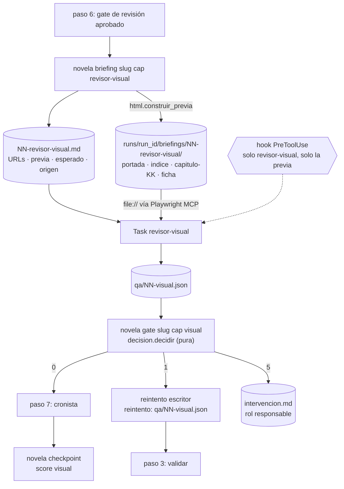

# 0010 — Validar visualmente la novela con un navegador MCP y devolver el fallo al rol que lo causa

## 1. Resumen

Un agente nuevo, `revisor-visual`, abre en un navegador controlado por el servidor MCP de Playwright una previa HTML de la novela, generada por el CLI. En ella navega el índice, los capítulos, la ficha de personajes y lugares y la portada, y registra en `qa/NN-visual.json` qué inspeccionó y qué detectó. Un gate determinista, `novela gate <slug> <cap> visual`, lee ese informe y hace una de tres cosas: deja avanzar, devuelve el capítulo al `escritor` o para con una intervención que nombra al rol responsable. Su veredicto se emite como score en Langfuse. La configuración MCP se versiona en `.mcp.json`, y una sesión real queda documentada en `docs/uso-browser-mcp.md`.

## 2. Contexto y problema

**Hoy nadie mira la novela como la ve un lector.** `docs/auditoria-entregable.md` marca tres requisitos como «falta»:

- VP-06: «No hay procedimiento ni agente de validación visual con browser MCP ni registro del resultado».
- CC-03: «No hay `.mcp.json` con servidor de browser».
- CC-04: «No hay documento del uso real del browser MCP».

En el repositorio no hay `.mcp.json`. Ninguno de los siete agentes de `.claude/agents/` usa herramientas MCP. `novela exportar` (`backend/novela/slices/export/`) genera `md` y `epub`, y el epub no tiene portada ni ficha (spec 0006 §2).

**Dónde estarán el índice, la ficha y la portada.** Los define la spec 0006 (Propuesta), que añade `--formato pdf` con portada, índice, capítulos y ficha. Sus modelos internos son `Libro`, `Ficha` y `EntradaFicha` (0006 §8.3), y la tabla `apariciones` de `estado.db` (0006 RF-18). La spec 0004 hizo el panel web, que tiene su propio lector de capítulos. La petición deja ese panel fuera del alcance.

**Restricciones del repositorio que condicionan el diseño:**

- Ningún test llama a un modelo (`AGENTS.md` § Proceso: generar código). La petición añade que ningún test abre un navegador real.
- La API no escribe en el workspace y el frontend no lee el disco (`AGENTS.md` § Monorepo).
- Ningún agente tiene `Glob`, `Grep`, `Bash`, `Task`, `Skill`, `WebFetch` ni `WebSearch` (`docs/architecture.md` §7.4), y `test_contratos.py::test_agentes_de_claude` lo comprueba con `PROHIBIDAS`.
- El hook `PreToolUse` (`.claude/hooks/denegar-escritura-estado.py`) solo conoce los roles de `SALIDAS`. Con `NOVELA_SESSION_ID` deniega cualquier otro subagente (regla 5). Ante una herramienta que no está en `_CAMPO`, falla cerrado: una llamada MCP que llegara al hook se denegaría.
- `test_contratos.py::test_settings_de_claude` exige que `.claude/settings.json` solo tenga `permissions` y `hooks`, que el `allow` sea exactamente `["Agent", "Bash(novela:*)", "Edit(./novelas/**)"]` y que haya un único registro `PreToolUse`.
- No se reescriben capítulos cerrados (`AGENTS.md` § Invariantes 7). El `cronista` se invoca después de los gates, porque aplicar el delta de un capítulo rechazado deja el estado por delante del texto (`docs/architecture.md` §2.1).
- El ADR 0002 lleva los gates y la cuenta de intentos al CLI (`novela gate`, códigos 0, 1 y 5). Su «Cuándo reabrirla» avisa de que un gate que elige a qué agente reintentar estaría planificando (ver D3).
- Techo de 100.000 tokens por invocación (`docs/architecture.md` §6.5) (ver D13).
- La dedicatoria no se envía a ningún modelo después del brief (spec 0006 RF-15 y D16) (ver D11).
- «Cuando añadas un rol de revisión nuevo, la pregunta es contra qué dato verifica» (`docs/validators.md` §4.6). Aquí el dato es lo esperado, que el CLI escribe en el briefing (ver D4).

**Relación con otras specs.**

- **0006** (Propuesta) define portada, índice, ficha, `apariciones` y `apply.apariciones`. Esta spec depende de que la 0006 esté implementada hasta su T-05 (§10). No cambia el PDF.
- **0002** (aceptada, sin implementar) y el ADR 0002 definen `novela gate <slug> <cap> <plan|mecanico|final|revision|delta>`. Esta spec crea el subcomando con un solo tipo, `visual`, y el mismo contrato. Cuando llegue la 0002, añadirá los suyos (ver D3).
- **0005** (Propuesta) añade el rol `entrevistador`, y la 0002 añade `sonda`. Igual que ellas, esta spec no fija un número de roles (0005 D14) (ver D20).
- **0009** (Propuesta, con código a medio implementar en el árbol de trabajo) define el catálogo `VALIDADORES` de validadores programáticos y el formato de id de los scores. El score de esta spec usa ese formato de id, pero no entra en el catálogo, porque el revisor es un agente (ver D12).
- **0007** (Propuesta) cambia `.claude/commands/novela-continuar.md` y versiona el id de los scores. Las dos specs tocan el procedimiento y `checkpoint/cmd.py` (§11).
- **0008** (Propuesta) registra un hook `PostToolUse`. Esta spec amplía el `matcher` del `PreToolUse` existente y no añade registros (ver D10).
- **0004** (implementada en la rama) es el panel. No cambia.

## 3. Objetivos y no objetivos

### 3.1 Objetivos

- **O-01** `.mcp.json` en la raíz declara un único servidor, Playwright MCP, con la versión fijada. Un test de contrato lo comprueba (CC-03).
- **O-02** En cada capítulo, antes del `cronista`, el `revisor-visual` inspecciona en el navegador la portada, el índice, la ficha y el capítulo en curso de una previa HTML generada por el CLI, y escribe `qa/NN-visual.json`, que valida contra `backend/schemas/qa-visual.schema.json` (VP-06).
- **O-03** `novela gate <slug> <cap> visual` sale con 0, 1 o 5 según el informe. Un fallo atribuible al capítulo en curso vuelve al `escritor`. Cualquier otro fallo para con `intervencion.md`, que nombra al rol responsable. Ningún test abre un navegador ni llama a un modelo.
- **O-04** El hook solo deja usar las herramientas del navegador al `revisor-visual`, y solo sobre las páginas de su previa.
- **O-05** `novela checkpoint` emite el score `visual` a Langfuse a partir del veredicto de `qa/NN-visual.json`.
- **O-06** `docs/uso-browser-mcp.md` documenta al menos una sesión real: qué inspeccionó, qué detectó y qué cambio provocó (CC-04).
- **O-07** `uv run pytest`, `mypy --strict` y `ruff` en verde, sin cambios en `backend/api/openapi.json` ni en `frontend/`.

### 3.2 No objetivos

- Inspeccionar el panel de `frontend/` o su lector (spec 0004). El frontend no cambia y la API no gana rutas.
- Inspeccionar en el navegador `export/novela.pdf` o `export/novela.epub` (ver D1). Sus comprobaciones mecánicas siguen siendo las de la spec 0006.
- Añadir un formato de exportación de entrega. La previa HTML es un artefacto de inspección que vive con los briefings, no un entregable (ver D18).
- Implementar los tipos `plan`, `mecanico`, `final`, `revision` y `delta` de `novela gate`, o mover a él la cuenta de intentos de los gates actuales. Eso es de la spec 0002.
- Reescribir capítulos cerrados o regenerar capítulos (spec 0007). Un fallo en un capítulo cerrado se trata como intervención (ver D4).
- Cambiar la política de degradación por cuota de `docs/architecture.md` §9.
- Dar al `revisor-visual` `Skill`, `Bash`, `Glob`, `Grep`, `Task`, `WebFetch`, `WebSearch` o herramientas MCP que ejecuten código, suban ficheros o escriban texto en la página (ver D6).
- Registrar el revisor en el catálogo `VALIDADORES` de la spec 0009 (ver D12).
- Validación visual de accesibilidad WCAG o regresión visual por comparación de píxeles.
- Validar el prompt del `revisor-visual` con TDD. Se valida con una novela de humo de 3 capítulos (`AGENTS.md` § Proceso: generar código).

## 4. Usuarios y escenarios

| Actor | Relación con esta spec |
|---|---|
| Orquestador (sesión principal) | Genera el briefing, invoca al `revisor-visual`, ejecuta `novela gate … visual` y obedece su código |
| `revisor-visual` | Navega la previa con Playwright MCP y escribe `qa/NN-visual.json` |
| `escritor` | Recibe `qa/NN-visual.json` como entrada de reintento |
| CLI `novela` | Genera la previa y lo esperado, decide el gate, cuenta intentos, escribe `intervencion.md` y emite el score |
| Operador humano | Resuelve las intervenciones y lee `docs/uso-browser-mcp.md` |
| Desarrollador del harness | Prueba el gate, el hook y los contratos con informes fixture, sin navegador |

- Como operador, quiero que un título de capítulo con marcado visible o una ficha ilegible paren el bucle o vuelvan al `escritor`, para que no los encuentre el destinatario del libro.
- Como orquestador, quiero un código de salida y no un informe que interpretar, para no decidir yo a quién reintentar.
- Como desarrollador, quiero probar las decisiones del gate con informes fixture, para que la suite no gaste cuota ni abra un navegador.

## 5. Requisitos funcionales

**Configuración MCP (CC-03)**

| ID | Requisito (EARS) | Prioridad |
|----|------------------|-----------|
| RF-01 | El sistema debe incluir en la raíz un `.mcp.json` con exactamente un servidor, `playwright`. El servidor lanza `@playwright/mcp` con una versión exacta `X.Y.Z` (sin `latest` ni rango), en modo headless, con perfil aislado, navegador Chromium, viewport de 1280×800 y `--output-dir .playwright-mcp`. No lleva `env` ni ningún valor secreto (ver D8). | Must |
| RF-02 | El sistema debe habilitar en `.claude/settings.json` solo ese servidor (`enabledMcpjsonServers: ["playwright"]`) y añadir al `allow` solo las seis herramientas MCP del `revisor-visual` de RF-05 (ver D9). | Must |
| RF-03 | El sistema debe ignorar `.playwright-mcp/` en `.gitignore` (ver D8). | Should |
| RF-04 | Cuando se ejecute `novela comprobar-entorno`, el sistema debe comprobar que `.mcp.json` existe y cumple RF-01, y que `npx` resuelve en el PATH, sin lanzar el servidor ni un navegador. Si algo falla, debe registrar un hallazgo y salir con 1 (ver D19). | Should |

**Agente `revisor-visual`**

| ID | Requisito (EARS) | Prioridad |
|----|------------------|-----------|
| RF-05 | El sistema debe incluir `.claude/agents/revisor-visual.md` con `name: revisor-visual`, `model: sonnet` y `tools` exactamente `Read, Write, mcp__playwright__browser_navigate, mcp__playwright__browser_navigate_back, mcp__playwright__browser_snapshot, mcp__playwright__browser_click, mcp__playwright__browser_take_screenshot, mcp__playwright__browser_close`, sin ninguna de `PROHIBIDAS` (ver D6, D7). | Must |
| RF-06 | El cuerpo del agente debe nombrar su salida `qa/NN-visual.json` y su esquema `backend/schemas/qa-visual.schema.json`. También debe nombrar las cuatro secciones que inspecciona, los límites de navegación de D13, la obligación de copiar `previa` del briefing, las reglas transversales de `docs/architecture.md` §7.4 y un retorno de tres líneas como máximo, con el veredicto y el número de hallazgos por gravedad (ver D13, D14). | Must |

**Previa y briefing**

| ID | Requisito (EARS) | Prioridad |
|----|------------------|-----------|
| RF-07 | Cuando se ejecute `novela briefing <slug> <cap> revisor-visual`, el sistema debe escribir, con escritura atómica, en `runs/<run_id>/briefings/NN-revisor-visual/`: `portada.html`, `indice.html`, un `capitulo-KK.html` por cada capítulo de 1 a `cap`, y `ficha.html`. Las páginas se generan con el `Libro` y la `Ficha` de la spec 0006, a partir de los capítulos cerrados y de `capitulos/NN.md` (ver D1, D18). | Must |
| RF-08 | El sistema debe escribir en `runs/<run_id>/briefings/NN-revisor-visual.md` lo siguiente (ver D4, D13, D14): (a) la URL `file://` absoluta de cada página; (b) el identificador `previa`; (c) lo esperado: el título de la portada y el número de líneas de la dedicatoria, una entrada del índice por capítulo con el `titulo` de su frontmatter, y las entradas de la ficha con los capítulos en que aparecen; (d) la tabla de secciones y su origen de D4. | Must |
| RF-09 | El sistema debe generar cada página con el markdown inerte de la spec 0006 (RF-05): sin HTML del capítulo, sin `<script>`, sin imágenes y sin URL `http(s)`. Cada página lleva una CSP `default-src 'none'; style-src 'unsafe-inline'; font-src data:`, CSS en línea y la fuente de la spec 0006 como `data:`. Los únicos enlaces apuntan a otras páginas del mismo directorio, con ruta relativa (ver D1). | Must |
| RF-10 | El sistema debe sustituir la dedicatoria, en la portada de la previa, por el marcador `[dedicatoria: L líneas]`, donde L es su número de líneas. Ni la previa ni el briefing pueden contener texto de la dedicatoria (ver D11). | Must |
| RF-11 | El sistema debe construir la ficha de la previa con las apariciones de los capítulos 1 a `cap − 1` de `estado_db.apariciones` y, para `cap`, con las que da `apply.apariciones` de la spec 0006 a partir del frontmatter y de `plan/capitulos/NN.md`, sin delta (ver D2). | Should |
| RF-12 | Si `qa/NN-validacion.json` no existe, no es `aprobado` o su `capitulo_sha256` no coincide con el de `capitulos/NN.md`, entonces `novela briefing … revisor-visual` debe salir con 4 sin escribir la previa ni el briefing (ver D14). | Must |
| RF-13 | Si `estado.db` no tiene la tabla `apariciones` o algún capítulo cerrado no tiene filas en ella, entonces `novela briefing … revisor-visual` debe salir con 4, nombrar esos capítulos y no escribir nada (ver D17). | Must |
| RF-14 | Cuando se genere dos veces la previa con las mismas entradas, el sistema debe producir páginas idénticas byte a byte y el mismo `previa` (ver D14). | Should |

**Informe `qa/NN-visual.json`**

| ID | Requisito (EARS) | Prioridad |
|----|------------------|-----------|
| RF-15 | El sistema debe definir en `backend/novela/dominio/qa.py` el modelo `InformeVisual` (§8.3) y generar desde él `backend/schemas/qa-visual.schema.json` (ver D5). | Must |
| RF-16 | El sistema debe limitar `HallazgoVisual.tipo` al vocabulario cerrado `seccion_ausente`, `enlace_roto`, `contenido_no_coincide`, `texto_ilegible`, `marcado_visible` y `maquetacion_defectuosa`, y `seccion` a `portada`, `indice`, `capitulo` y `ficha` (ver D4). | Must |

**Gate `novela gate <slug> <cap> visual`**

| ID | Requisito (EARS) | Prioridad |
|----|------------------|-----------|
| RF-17 | Cuando se ejecute `novela gate <slug> <cap> visual` con un informe legible cuyo `veredicto` es `aprobado` o `aprobado_con_reservas`, el sistema debe salir con 0 (ver D3). | Must |
| RF-18 | El sistema debe tratar el informe como ilegible, y por tanto rechazado, en cualquiera de estos casos: no existe, no valida contra `InformeVisual`, su `capitulo` no es `cap`, su `previa` no es el del último briefing del `revisor-visual` del capítulo, su `inspeccion` no cubre las cuatro secciones, o su veredicto es `rechazado` sin ningún hallazgo `alta` o `media` (ver D14). | Must |
| RF-19 | Cuando el informe esté rechazado, sea legible y el origen de todos sus hallazgos `alta` y `media` sea `escritor` según la regla de §8.4, el sistema debe salir con 1 (reintento del `escritor`). Ese origen corresponde a los hallazgos de `seccion` `capitulo` o `indice` con `capitulo == cap` cuyo tipo no es de los que se atribuyen a `harness`. Un informe ilegible también sale con 1 (ver D3, D4). | Must |
| RF-20 | Si el informe está rechazado y algún hallazgo `alta` o `media` tiene un origen distinto de `escritor` según la regla de §8.4, entonces el sistema debe salir con 5 y escribir `intervencion.md` con el rol de ese origen (ver D3, D4). | Must |
| RF-21 | Si el run del capítulo ya tiene dos líneas `gate NN visual -> 1` en `harness.log`, entonces un nuevo fallo debe salir con 5 y escribir `intervencion.md`, en lugar de salir con 1 (ver D15). | Must |
| RF-22 | Cuando el gate salga con 5, el sistema debe escribir `runs/<run_id>/intervencion.md` con escritura atómica. El fichero lleva `gate: visual`, `intentos`, `briefing`, `qa: qa/NN-visual.json`, `rol: <rol>` y una línea `tipo@seccion[:capitulo]` por hallazgo `alta` o `media`, sin `descripcion` ni texto de la novela (ver D3, D11). | Must |
| RF-23 | El sistema debe escribir en `harness.log` una línea `gate NN visual -> <código> · destino=<avanzar\|escritor\|intervencion:<rol>>` por ejecución (ver D3, D15). | Must |

**Procedimiento y agentes existentes**

| ID | Requisito (EARS) | Prioridad |
|----|------------------|-----------|
| RF-24 | El sistema debe añadir a `.claude/commands/novela-continuar.md`, entre el gate de revisión (paso 6) y el `cronista` (paso 7), el paso siguiente: `novela briefing <slug> <cap> revisor-visual`, Task `revisor-visual` con salida `qa/NN-visual.json` y `novela gate <slug> <cap> visual`. Con 0 se sigue al paso 7. Con 1 se reintenta el `escritor` con su briefing del paso 2 y `reintento: qa/NN-visual.json`, y se vuelve al paso 3. Con 5 se para sin escribir `intervencion.md`. El paso lleva además su fila en «Códigos de salida» y en «Punto de reanudación» (ver D2, D15). | Must |
| RF-25 | El sistema debe nombrar `qa/NN-visual.json` en el cuerpo de `.claude/agents/escritor.md` como posible entrada de reintento, con su esquema `backend/schemas/qa-visual.schema.json` (ver D2). | Should |

**Hook**

| ID | Requisito (EARS) | Prioridad |
|----|------------------|-----------|
| RF-26 | El sistema debe añadir a `SALIDAS` del hook `revisor-visual: [qa/NN-visual.json]`, de modo que la regla 2 lo limite a esa salida y la regla 5 lo admita (ver D10). | Must |
| RF-27 | El sistema debe añadir `mcp__playwright__.*` al `matcher` del registro `PreToolUse` existente y denegar con exit 2 cualquier llamada `mcp__playwright__*` cuyo `agent_type` no sea `revisor-visual`, incluida la sesión principal (ver D10). | Must |
| RF-28 | Si el `revisor-visual` llama a `browser_navigate` con una `url` que no es `file://`, o que tras normalizarse no está bajo `novelas/<slug>/runs/<run_id>/briefings/NN-revisor-visual/` y termina en `.html`, entonces el hook debe denegarla. También debe denegar cualquier llamada MCP con el argumento `filename` y cualquier herramienta `mcp__playwright__*` que no sea una de las seis de RF-05 (ver D10). | Must |

**Score**

| ID | Requisito (EARS) | Prioridad |
|----|------------------|-----------|
| RF-29 | Cuando `novela checkpoint` cierre un capítulo con un `qa/NN-visual.json` que valide, el sistema debe emitir por el `ScoreSink` el score `visual`: 1 si es `aprobado`, 0,5 si es `aprobado_con_reservas` y 0 si es `rechazado`. Si no existe o no valida, no lo emite (ver D12). | Must |
| RF-30 | El sistema debe emitir `visual` con el mismo formato de id y comentario que el resto de scores de `checkpoint` (`{slug}-{run_id}-{NN}-visual`, o el versionado de la spec 0007 si ya existe), y sin texto del informe (ver D12). | Must |

**Contratos y documentación (CC-04)**

| ID | Requisito (EARS) | Prioridad |
|----|------------------|-----------|
| RF-31 | El sistema debe comprobar en `backend/tests/test_contratos.py`: el contrato del `revisor-visual` en `CONTRATO` y `ESQUEMAS`; `.mcp.json` según RF-01; `settings.json` según RF-02 y RF-27; y `qa-visual.schema.json` al día con `InformeVisual` (ver D8, D9). | Must |
| RF-32 | El sistema debe incluir `docs/uso-browser-mcp.md` con las secciones Configuración, Sesiones, Qué inspeccionó, Qué detectó, Qué cambio provocó y Limitaciones. Debe documentar al menos la novela de humo de 3 capítulos y el control negativo de D16, con fecha, versión de Claude Code, versión de `@playwright/mcp`, sha del commit y datos ficticios (ver D16). | Must |
| RF-33 | El sistema debe describir el agente, el gate, la previa, el hook y el score, en el mismo commit que el código que los introduce, en los documentos y secciones de D20 (ver D20). | Must |
| RF-34 | El sistema no debe añadir rutas a la API ni cambiar ficheros de `frontend/`, de modo que `backend/api/openapi.json` quede idéntico. | Must |

## 6. Requisitos no funcionales

| ID | Categoría | Requisito | Métrica | Umbral |
|----|-----------|-----------|---------|--------|
| RNF-01 | Seguridad | Herramientas mínimas | Herramientas de `PROHIBIDAS` o `mcp__playwright__*` fuera de las seis de RF-05 en el `tools` del agente | 0 |
| RNF-02 | Seguridad | El navegador no sale de la previa | Porcentaje de las llamadas `browser_navigate` de los casos de `test_hook.py` con `http(s)://`, `file://` fuera del directorio de la previa, `..` o `javascript:` que el hook deniega | 100 % |
| RNF-03 | Seguridad | Previa inerte | `<script`, `href`/`src` con `http`, `https` o `javascript:` y páginas sin la CSP de RF-09 en la previa de cualquier fixture, incluida una con enlaces, imágenes y HTML en el markdown | 0 |
| RNF-04 | Privacidad y protección de datos | La dedicatoria no llega al revisor | Fragmentos de 10 caracteres o más de la dedicatoria de la fixture en la previa, el briefing, `intervencion.md` y `harness.log` | 0 |
| RNF-05 | Privacidad y protección de datos | Sin datos reales en el repositorio | Coincidencias de los patrones de la spec 0005 (RNF-05) en `backend/tests/fixtures/visual/` y en `docs/uso-browser-mcp.md` | 0 |
| RNF-06 | Rendimiento | Coste de la previa | Tiempo de `novela briefing … revisor-visual` en `CliRunner`, en el capítulo 24 de `demo-24` y en el 10 de un workspace de 10 capítulos de 1.500 palabras | < 5 s en cada caso |
| RNF-07 | Rendimiento | Contexto del revisor | Tokens estimados del briefing (`presupuesto_tokens` de la receta); tokens de contexto de la invocación del `revisor-visual` medidos en la demostración | ≤ 15.000; ≤ 100.000 |
| RNF-08 | Rendimiento | Coste del hook | Tiempo de `decidir` para una llamada MCP en `test_hook.py::test_rendimiento` | < 300 ms |
| RNF-09 | Rendimiento | Coste por capítulo | Llamadas a Task añadidas por capítulo sin reintentos | 1 |
| RNF-10 | Observabilidad | Score por capítulo revisado | Scores `visual` emitidos por un `checkpoint` correcto con `qa/NN-visual.json` válido | 1 |
| RNF-11 | Compatibilidad | Contratos existentes intactos | Diferencias en `backend/api/openapi.json`, `state.schema.json`, `delta.schema.json`, `config.schema.json`, `qa-informe.schema.json` y ficheros de `frontend/` | 0 |
| RNF-12 | Calidad | Suite verde, sin modelos ni navegador | Fallos de `uv run pytest`; errores de `mypy --strict` y de `ruff`; tests que importan `playwright` o un cliente de modelos, o que lanzan `npx` | 0; 0; 0 |

## 7. Criterios de aceptación

Los criterios usan estas fixtures:

- **`demo-visual`**: un workspace sintético nuevo de `backend/conftest.py`. Es `demo-regalo` de la spec 0006, cerrado hasta el checkpoint 2, con `capitulos/03.md` escrito, `novela validar demo-visual 3` aprobado y `brief/brief.json` con la dedicatoria ficticia de dos líneas de la 0006.
- **Informes fixture**, en `backend/tests/fixtures/visual/`: `aprobado.json`, `con-reservas.json`, `rechazado-capitulo-actual.json` (`marcado_visible@capitulo:3`, alta), `rechazado-indice-actual.json` (`texto_ilegible@indice:3`, media), `rechazado-portada.json`, `rechazado-ficha.json`, `rechazado-capitulo-cerrado.json` (`marcado_visible@capitulo:1`), `rechazado-enlace.json` (`enlace_roto@indice:2`), `mixto.json` (`marcado_visible@capitulo:3` y `texto_ilegible@ficha`), `rechazado-sin-hallazgos.json`, `previa-obsoleta.json`, `sin-ficha-inspeccionada.json` e `invalido.json`.

### CA-01 (cubre RF-01)
- **Dado** el `.mcp.json` de la raíz
- **Cuando** se ejecuta `test_contratos.py::test_mcp_json`
- **Entonces** es JSON válido con `mcpServers` y una sola clave, `playwright`. Sus argumentos contienen `@playwright/mcp@` seguido de una versión que casa `^\d+\.\d+\.\d+$`, y además `--headless`, `--isolated` y `--output-dir` con valor `.playwright-mcp`. No tiene `env`, y el test de claves de `test_sin_claves_versionadas` no encuentra nada en el fichero

### CA-02 (cubre RF-02)
- **Dado** `.claude/settings.json`
- **Cuando** se ejecuta `test_contratos.py::test_settings_de_claude`
- **Entonces** sus claves son `permissions`, `hooks` y `enabledMcpjsonServers`, `enabledMcpjsonServers == ["playwright"]`, y el `allow` es el de antes más exactamente las seis herramientas `mcp__playwright__*` de RF-05

### CA-03 (cubre RF-03)
- **Dado** `.gitignore`
- **Cuando** se ejecuta `test_contratos.py::test_salida_de_playwright_ignorada`
- **Entonces** contiene una línea que ignora `.playwright-mcp/`, y `git check-ignore .playwright-mcp/x.png` sale con 0

### CA-04 (cubre RF-04)
- **Dado** tres entornos simulados en `slices/entorno/test_entorno.py`: uno con `.mcp.json` correcto y `npx` resoluble, uno sin `.mcp.json` y uno con `@playwright/mcp@latest`
- **Cuando** se ejecutan las comprobaciones con `shutil.which` sustituido
- **Entonces** el primero no da hallazgos; los otros dos dan un hallazgo cada uno y `comprobar-entorno` sale con 1; y ningún caso lanza un proceso

### CA-05 (cubre RF-05)
- **Dado** `.claude/agents/revisor-visual.md`
- **Cuando** se ejecuta `test_contratos.py::test_agentes_de_claude` con `revisor-visual` en `CONTRATO`
- **Entonces** `name`, `model: sonnet` y `tools` coinciden con RF-05 en orden, y la intersección con `PROHIBIDAS` está vacía

### CA-06 (cubre RF-06)
- **Dado** el mismo agente
- **Cuando** se ejecutan `test_contratos.py::test_agentes_nombran_sus_salidas` y `::test_revisor_visual_nombra_sus_limites`
- **Entonces** el cuerpo contiene `qa/NN-visual.json`, `backend/schemas/qa-visual.schema.json` (que existe), `portada`, `indice`, `ficha`, `capitulo`, `previa` y los dos límites de D13 escritos como números

### CA-07 (cubre RF-07)
- **Dado** `demo-visual`
- **Cuando** se ejecuta `novela briefing demo-visual 3 revisor-visual`
- **Entonces** sale con 0 y `runs/<run_id>/briefings/03-revisor-visual/` contiene exactamente `portada.html`, `indice.html`, `capitulo-01.html`, `capitulo-02.html`, `capitulo-03.html` y `ficha.html`, sin ningún `.tmp`. `capitulo-03.html` contiene el título del frontmatter de `capitulos/03.md`

### CA-08 (cubre RF-08)
- **Dado** el briefing de CA-07
- **Cuando** se lee `03-revisor-visual.md`
- **Entonces** contiene seis URL `file:///` absolutas que resuelven a las seis páginas, un `previa` de 16 hexadecimales, tres entradas de índice con los títulos de los frontmatters, la ficha esperada con los capítulos de cada entidad y la tabla de origen de §8.4. No contiene texto de `canon/misterio.md`

### CA-09 (cubre RF-09)
- **Dado** `demo-visual` con el cuerpo de `capitulos/03.md` cambiado, en el test y antes de validar, para contener `[pulsa](https://ejemplo.invalid)`, ``, `<script>alert(1)</script>` y `*cursiva*`
- **Cuando** se genera la previa
- **Entonces** `capitulo-03.html` muestra «pulsa», «foto» y `<script>alert(1)</script>` como texto escapado y «cursiva» en `<em>`. Ninguna página tiene `<script`, ni `href`/`src` con `http`, `https` o `javascript:`, ni ` 0 · destino=avanzar` y no existe `intervencion.md`

### CA-18 (cubre RF-18)
- **Dado** `demo-visual` con el briefing de CA-07, y `qa/03-visual.json` ausente o copiado de `invalido.json`, `previa-obsoleta.json`, `sin-ficha-inspeccionada.json` o `rechazado-sin-hallazgos.json`, o con `capitulo: 2`
- **Cuando** se ejecuta el gate
- **Entonces** los seis casos salen con 1 y la línea del log es `gate 03 visual -> 1 · destino=escritor`

### CA-19 (cubre RF-19)
- **Dado** `rechazado-capitulo-actual.json` y `rechazado-indice-actual.json` con el `previa` del briefing
- **Cuando** se ejecuta el gate
- **Entonces** los dos salen con 1 y no se escribe `intervencion.md`

### CA-20 (cubre RF-20)
- **Dado** `rechazado-portada.json`, `rechazado-ficha.json`, `rechazado-capitulo-cerrado.json`, `rechazado-enlace.json` y `mixto.json`
- **Cuando** se ejecuta el gate
- **Entonces** todos salen con 5, e `intervencion.md` lleva `rol: operador`, `rol: arquitecto`, `rol: escritor (capítulo cerrado)`, `rol: harness` y `rol: arquitecto`, respectivamente

### CA-21 (cubre RF-19, RF-20, RF-21)
- **Dado** un generador de Hypothesis de informes `InformeVisual` válidos, capítulos y cuentas de intentos de 0 a 2, con al menos 300 casos
- **Cuando** se llama a la función pura `decision.decidir(informe, cap, previa, intentos)`
- **Entonces** (a) el resultado es 0 si y solo si el informe es legible y su veredicto no es `rechazado`; (b) es 1 solo si `intentos < 2` y el origen de todo hallazgo `alta` o `media` es `escritor` según la regla de §8.4; (c) en cualquier otro fallo es 5; (d) nunca es 1 con `intentos == 2`; y (e) el rol de un 5 es el de mayor precedencia entre los orígenes de sus hallazgos `alta` y `media`

### CA-22 (cubre RF-21)
- **Dado** `demo-visual` con dos líneas `gate 03 visual -> 1` en el `harness.log` del run y `rechazado-capitulo-actual.json`
- **Cuando** se ejecuta el gate
- **Entonces** sale con 5, e `intervencion.md` lleva `gate: visual`, `intentos: 3` y `rol: escritor`

### CA-23 (cubre RF-22)
- **Dado** la intervención de CA-20 con `rechazado-portada.json`, cuya `descripcion` contiene «TEXTO-CENTINELA» y cuyo hallazgo es `maquetacion_defectuosa@portada`
- **Cuando** se lee `intervencion.md`
- **Entonces** tiene las líneas `gate: visual`, `intentos: 1`, `briefing: runs/<run_id>/briefings/03-revisor-visual.md`, `qa: qa/03-visual.json`, `rol: operador` y `maquetacion_defectuosa@portada`, no contiene «TEXTO-CENTINELA» y no queda ningún `.tmp` en `runs/<run_id>/`

### CA-24 (cubre RF-23)
- **Dado** las ejecuciones de CA-17 a CA-22
- **Cuando** se leen las líneas `gate` de `harness.log`
- **Entonces** cada ejecución deja exactamente una línea que casa `^.*gate \d{2,3} visual -> [015] · destino=(avanzar|escritor|intervencion:[a-z ()á-ú]+)$`

### CA-25 (cubre RF-24, RF-25)
- **Dado** `tests/test_bucle.py::test_bucle_completo_con_agente_falso`, con un `revisor-visual` falso que escribe `aprobado.json` con el `previa` de su briefing, y una segunda variante que en el capítulo 2 escribe primero `rechazado-capitulo-actual.json`
- **Cuando** se ejecuta el bucle siguiendo los pasos de `novela-continuar.md`
- **Entonces** la primera variante cierra todos los capítulos con un `gate NN visual -> 0` antes de cada `briefing NN cronista`. En la segunda, el capítulo 2 tiene `gate 02 visual -> 1`, un segundo `briefing 02 escritor` y ningún `briefing 02 cronista` antes de `gate 02 visual -> 0`. Además, `test_contratos.py::test_procedimiento_nombra_el_gate_visual` encuentra en el procedimiento `revisor-visual`, `qa/NN-visual.json`, `novela gate <slug> <cap> visual` y el código 5, y en `escritor.md` `qa/NN-visual.json`

### CA-26 (cubre RF-26)
- **Dado** `test_hook.py::test_salidas_casan_el_contrato` y `::test_salidas_por_rol`
- **Cuando** se ejecutan con `revisor-visual` en `CONTRATO` y en `SALIDAS`
- **Entonces** `ROLES == set(CONTRATO) == set(SALIDAS)`. El `revisor-visual` puede escribir `novelas/<slug>/qa/03-visual.json` y no `qa/03-continuidad.json` ni `capitulos/03.md`, y con `NOVELA_SESSION_ID` definida la regla 5 admite `subagent_type: revisor-visual`

### CA-27 (cubre RF-27)
- **Dado** una llamada `mcp__playwright__browser_snapshot` sin `agent_type`, otra con `agent_type: escritor` y otra con `agent_type: revisor-visual`
- **Cuando** se ejecuta `decidir`
- **Entonces** las dos primeras se deniegan con el prefijo `denegar-escritura-estado:` y la tercera se permite. `test_settings_de_claude` encuentra `mcp__playwright__.*` en el `matcher` de un único registro `PreToolUse`

### CA-28 (cubre RF-28)
- **Dado** un generador de Hypothesis de URL con al menos 200 casos: `http(s)://`, `javascript:`, `file://` fuera del directorio de la previa, con `..`, con mayúsculas, con `%2e%2e`, del directorio de otro capítulo, y `file://` válidas a las seis páginas
- **Cuando** se ejecuta `decidir` con `browser_navigate` y `agent_type: revisor-visual`
- **Entonces** solo se permiten las válidas. Además, `browser_take_screenshot` con `filename`, `browser_evaluate` y `browser_file_upload` se deniegan, y `browser_click` sin `filename` se permite

### CA-29 (cubre RF-29)
- **Dado** `demo-visual` preparado para cerrar el capítulo 3 con `qa/03-visual.json` `aprobado`, después `aprobado_con_reservas`, después `rechazado`, después ausente y después inválido, y un `ScoreSink` falso
- **Cuando** se ejecuta `novela checkpoint demo-visual 3`
- **Entonces** el sink recibe `("visual", 1.0)`, `("visual", 0.5)` y `("visual", 0.0)` en los tres primeros casos, y ningún score `visual` en los dos últimos. Los demás scores no cambian

### CA-30 (cubre RF-30)
- **Dado** los cuerpos emitidos en CA-29 con `urlopen` sustituido
- **Cuando** se inspecciona el cuerpo del score `visual`
- **Entonces** su `id` casa `^demo-visual-<run_id>-03-visual$` (o el formato versionado de la 0007, si está implementada), su `comment` es `demo-visual, capítulo 3` y no contiene texto de `descripcion` ni `observado` del informe

### CA-31 (cubre RF-31)
- **Dado** el código tras esta spec
- **Cuando** se ejecuta `uv run pytest tests/test_contratos.py`
- **Entonces** pasan `test_agentes_de_claude`, `test_agentes_nombran_sus_salidas`, `test_mcp_json`, `test_settings_de_claude` y `test_qa_visual_schema_al_dia`, y cada uno falla si se revierte en el test su fichero de entrada a la versión anterior a esta spec

### CA-32 (cubre RF-32)
- **Dado** `docs/uso-browser-mcp.md` tras la T-12
- **Cuando** se ejecuta `test_contratos.py::test_documento_uso_browser_mcp`
- **Entonces** el fichero existe y contiene los seis encabezados de RF-32. Nombra la versión de `@playwright/mcp` que fija `.mcp.json`, un sha de 40 hexadecimales y las dos sesiones de D16, cada una con al menos un `qa/NN-visual.json` citado. No da coincidencias con los patrones de RNF-05

### CA-33 (cubre RF-33)
- **Dado** el commit de cierre (T-13)
- **Cuando** se revisan los documentos y secciones de D20
- **Entonces** cada uno describe el agente, el gate, la previa, el hook y el score tal como están implementados, sin «pendiente» ni «próximamente»

### CA-34 (cubre RF-34)
- **Dado** el código tras esta spec
- **Cuando** se ejecutan `test_contratos.py::test_openapi_al_dia` y `git diff --stat` sobre `frontend/` y `backend/api/`, restringido a los commits de esta spec
- **Entonces** `openapi.json` no cambia y ningún commit de esta spec toca `frontend/` ni `backend/api/`

## 8. Diseño propuesto

### 8.1 Visión general

El bucle por capítulo gana un paso secuencial después del gate de revisión y antes del `cronista`. Así, un fallo atribuible al capítulo en curso vuelve al `escritor` sin que el estado esté por delante del texto (ver D2). El paso tiene tres piezas, cada una en su sitio según `docs/architecture.md` §3.0:

- **Cáscara del CLI.** `novela briefing … revisor-visual` genera la previa y lo esperado con una función pura, `slices/export/html.py`.
- **Agente.** El `revisor-visual` navega la previa con Playwright MCP.
- **Gate.** `novela gate … visual` decide con una función pura, `slices/gate/decision.py`.

El hook contiene al navegador y el checkpoint emite el score.



### 8.2 Componentes afectados

**Nuevos**

- `.mcp.json`: el servidor `playwright` (ver D8).
- `.claude/agents/revisor-visual.md`.
- `backend/novela/slices/export/html.py`: `construir_previa(libro: Libro, fuente: bytes) -> Previa`, pura. Reutiliza el markdown inerte de la 0006.
- `backend/novela/slices/export/test_html.py`.
- `backend/novela/slices/gate/`: `__init__.py`, `cmd.py` (cáscara: lock, lectura de `qa/`, del briefing y de `harness.log`, escritura de `intervencion.md` y de la línea de log), `decision.py` (pura) y `test_gate.py`.
- `backend/schemas/qa-visual.schema.json`, generado.
- `backend/tests/fixtures/visual/*.json`: los informes fixture de §7.
- `docs/uso-browser-mcp.md`.

**Modificados**

- `.claude/settings.json`: `enabledMcpjsonServers`, seis entradas de `allow` y el `matcher` (ver D9, D10).
- `.claude/hooks/denegar-escritura-estado.py`: `SALIDAS`, `_CAMPO` para `mcp__playwright__*` y la regla nueva de RF-27 y RF-28.
- `.claude/commands/novela-continuar.md`: el paso nuevo, el código 5 y la fila de reanudación.
- `.claude/agents/escritor.md`: `qa/NN-visual.json` como entrada de reintento.
- `.gitignore`: `.playwright-mcp/`.
- `backend/novela/dominio/ids.py`: `Agente.REVISOR_VISUAL`.
- `backend/novela/dominio/qa.py`: `InformeVisual`, `HallazgoVisual`, `Inspeccion` y sus `Literal`.
- `backend/config/recipes.yaml`: receta `revisor-visual` (ver D13).
- `backend/novela/slices/briefing/cmd.py`, `assemble.py` y `recipes.py`, con sus tests: la capa `previa`, la custodia de RF-12 y la comprobación de RF-13.
- `backend/novela/slices/checkpoint/cmd.py` y `test_checkpoint.py`: el score `visual`.
- `backend/novela/slices/entorno/comprobaciones.py` y `test_entorno.py`: RF-04.
- `backend/novela/plataforma/salida.py`: la constante `INTERVENIR = 5` (ADR 0002).
- `backend/novela/cli.py`: registra `gate`.
- `backend/conftest.py`: el workspace `demo-visual`.
- `backend/tests/test_contratos.py`, `test_hook.py` y `test_bucle.py`.
- `CLAUDE.md`, `AGENTS.md` y la documentación de referencia de D20.

### 8.3 Modelo de datos

**`InformeVisual`** (`dominio/qa.py`, `Modelo` inmutable; ver D5):

| Campo | Tipo | Nota |
|---|---|---|
| `schema_version` | `SchemaVersion` | como `InformeQA` |
| `capitulo` | `CapituloNum` | |
| `agente` | `Literal["revisor-visual"]` | |
| `previa` | `str`, `^[0-9a-f]{16}$` | se copia del briefing (ver D14) |
| `veredicto` | `Veredicto` | el mismo `Literal` de `InformeQA` |
| `inspeccion` | `list[Inspeccion]`, de 1 a 40 | registro de lo que hizo (CC-04) |
| `hallazgos` | `list[HallazgoVisual]` | |

**`Inspeccion`**: `seccion: SeccionVisual`, `pagina: str` (`^(portada|indice|ficha|capitulo-\d{2,3})\.html(#[\w-]+)?$`), `accion: Literal["navegar", "clic", "captura", "snapshot"]` y `observado: str` (1 a 300 caracteres).

**`HallazgoVisual`**: `tipo: TipoHallazgoVisual`, `gravedad: Nivel`, `seccion: SeccionVisual`, `capitulo: CapituloNum | None` (obligatorio si `seccion` es `capitulo` o `indice`; un validador lo exige), `ubicacion: str | None`, `descripcion: str` y `correccion_sugerida: str | None`.

```python
SeccionVisual = Literal["portada", "indice", "capitulo", "ficha"]
TipoHallazgoVisual = Literal["seccion_ausente", "enlace_roto", "contenido_no_coincide",
                             "texto_ilegible", "marcado_visible", "maquetacion_defectuosa"]
```

`InformeQA`, `Productor` y `TipoHallazgo` no cambian, así que `qa-informe.schema.json` tampoco (RNF-11).

**`Previa`** (modelo interno del slice, no es contrato de disco): `paginas: tuple[tuple[str, bytes], ...]` en orden fijo (portada, indice, capítulos ascendentes, ficha) y `id: str`, los 16 primeros hexadecimales del sha256 de la concatenación de `nombre + "\0" + bytes` de cada página.

No hay cambios en `estado.db`, `Estado`, `Delta` ni `Config`.

### 8.4 Interfaces y contratos

**CLI.**

```
novela briefing <slug> <cap> revisor-visual
novela gate <slug> <cap> visual
```

| Código | `briefing … revisor-visual` | `gate … visual` |
|---|---|---|
| 0 | previa y briefing escritos | avanzar |
| 1 | — | reintento del `escritor` |
| 2 | uso incorrecto | uso incorrecto o tipo distinto de `visual` |
| 3 | lock ocupado | lock ocupado |
| 4 | custodia (RF-12), sin apariciones (RF-13), workspace inválido | workspace inválido, sin briefing del `revisor-visual` |
| 5 | — | intervenir: `intervencion.md` ya escrito |

**Origen de cada hallazgo y destino** (ver D4). Solo cuentan los hallazgos `alta` y `media`. El origen de cada hallazgo se decide en este orden:

1. Si su `tipo` es `enlace_roto`, `seccion_ausente` o `contenido_no_coincide`, el origen es `harness`, sea cual sea su sección. Los datos esperados y las páginas salen de las mismas entradas, así que la discrepancia está en el generador de la previa.
2. Si no, el origen lo da su sección:

| `seccion` | `capitulo` | Origen del dato | Rol |
|---|---|---|---|
| `capitulo` | `== cap` | cuerpo de `capitulos/NN.md` (`escritor`, `editor-estilo`) | `escritor` |
| `indice` | `== cap` | `titulo` del frontmatter de `capitulos/NN.md` | `escritor` |
| `capitulo` o `indice` | `< cap` | capítulo cerrado (invariante 7) | `escritor (capítulo cerrado)` |
| `ficha` | — | `canon/personajes/*.md` y `canon/mundo.md` | `arquitecto` |
| `portada` | — | título (`--titulo` o slug) y dedicatoria del brief | `operador` |

El gate sale con 1 si todos los orígenes son `escritor`. Si hay alguno distinto, sale con 5, y `rol` es el de mayor precedencia entre los orígenes distintos de `escritor`, en este orden: `escritor (capítulo cerrado)`, `arquitecto`, `operador` y `harness`.

**Hook** (reglas nuevas, ver D10):

- `matcher`: `Write|Edit|MultiEdit|NotebookEdit|Bash|PowerShell|Agent|Task|mcp__playwright__.*`.
- Una herramienta `mcp__playwright__*` se deniega si `agent_type != "revisor-visual"`, si no es una de las seis de RF-05 o si trae `filename`.
- `browser_navigate` se deniega si `url` no empieza por `file://`. Si empieza, se decodifica con `urllib.parse.unquote`, se normaliza con `_normalizar` y se deniega si no casa `…/novelas/<slug>/runs/<run_id>/briefings/\d{2,3}-revisor-visual/(portada|indice|ficha|capitulo-\d{2,3})\.html`.

**`.mcp.json`** (forma, ver D8; la versión y los flags exactos se fijan en T-01):

```json
{
  "mcpServers": {
    "playwright": {
      "command": "cmd",
      "args": ["/c", "npx", "-y", "@playwright/mcp@X.Y.Z", "--headless", "--isolated",
               "--browser", "chromium", "--viewport-size", "<1280×800>",
               "--output-dir", ".playwright-mcp"]
    }
  }
}
```

**Paso nuevo de `novela-continuar.md`** (6 bis, ver D2):

```
6 bis. novela briefing <slug> <cap> revisor-visual → Task revisor-visual, salida qa/NN-visual.json
       → novela gate <slug> <cap> visual.
       0 → paso 7. 1 → reintento del escritor con su briefing del paso 2 y
       reintento: qa/NN-visual.json, y vuelve a 3. 5 → para; intervencion.md ya está escrito.
```

Fila de reanudación: si el log tiene `briefing NN revisor-visual -> 0` después del último `briefing NN continuista` y no tiene ningún `gate NN visual` después, se reanuda en el paso 6 bis desde su briefing. Si la última línea `gate NN visual` es `-> 0`, se reanuda en el paso 7.

### 8.5 Flujo principal

1. Pasos 1 a 6 del procedimiento, sin cambios: el capítulo NN está escrito, validado tras el `editor-estilo` y aprobado por el gate de revisión.
2. `novela briefing <slug> <cap> revisor-visual` comprueba la custodia (RF-12) y las apariciones (RF-13). Después construye el `Libro` de la 0006 con los capítulos cerrados y `capitulos/NN.md`, genera la previa y escribe las páginas y el briefing.
3. El orquestador invoca al `revisor-visual` con el prompt estándar (`slug`, `capítulo`, `briefing`, `salidas`).
4. El agente abre `portada.html`, `indice.html`, `ficha.html` y `capitulo-NN.html` con `browser_navigate`. Toma `browser_snapshot` de cada una y, como máximo, seis `browser_take_screenshot`. Desde el índice y la ficha sigue con `browser_click` hasta dos enlaces a otros capítulos. Compara lo que ve con lo esperado del briefing.
5. El agente escribe `qa/NN-visual.json` con `previa`, `inspeccion`, `veredicto` y `hallazgos`, cierra el navegador y devuelve tres líneas.
6. `novela gate <slug> <cap> visual` lee el informe, el `previa` del briefing y la cuenta del log. Decide con `decision.decidir`, escribe su línea de log y, si procede, `intervencion.md`.
7. Con 0, el bucle sigue con el `cronista`, `aplicar-delta` y `checkpoint`, que emite `visual` junto con los demás scores.

## 9. Casos límite y gestión de errores

| Caso | Comportamiento esperado | Requisito relacionado |
|------|-------------------------|-----------------------|
| El servidor MCP no arranca (sin `npx`, sin Chromium, sin red al descargar) | El agente no puede escribir un informe válido. El gate lo trata como ilegible y reintenta; al tercer intento, `intervencion.md`. `comprobar-entorno` lo detecta antes si falta `npx` | RF-04, RF-18, RF-21 |
| La sesión principal intenta usar el navegador | El hook lo deniega (sin `agent_type`) | RF-27 |
| El revisor intenta abrir una URL externa o una página de otro capítulo | El hook la deniega y el agente sigue con las permitidas | RF-28 |
| El revisor pide una captura con `filename` | Denegada. Las capturas sin `filename` las guarda el servidor en `.playwright-mcp/`, que git ignora | RF-28, RF-03 |
| El revisor escribe `qa/NN-visual.json` con el `previa` de un briefing anterior (reintento) | Ilegible: reintento | RF-18 |
| El informe dice `rechazado` sin hallazgos `alta` ni `media` | Ilegible: reintento | RF-18 |
| El informe marca un hallazgo `baja` en la portada y veredicto `rechazado` con otro `alta` en el capítulo NN | 1: los `baja` no cuentan para el destino | RF-19 |
| `enlace_roto` en la entrada del índice del capítulo en curso | 5, `rol: harness`: el tipo manda sobre la sección | RF-20 |
| Un reintento del `escritor` causado por el gate visual | Al volver a los pasos 3 a 6 se genera otro `briefing NN continuista`, que consume un intento del gate de revisión. Es deliberado (ver D15) | RF-24 |
| El `editor-estilo` introduce el marcado visible | El destino es el mismo: 1, `escritor`. El siguiente `editor-estilo` vuelve a pasar por el gate | RF-19 |
| Capítulo de más de 99 en una novela con tres dígitos | `capitulo-KKK.html` y `NNN-revisor-visual/` con el ancho del workspace; el hook acepta `\d{2,3}` | RF-07, RF-28 |
| Workspace sin `brief/brief.json` | La portada lleva solo el título; lo esperado dice `dedicatoria: ninguna` | RF-08, RF-10 |
| Workspace creado antes de la spec 0006, sin tabla `apariciones` | `briefing … revisor-visual` sale con 4 y el procedimiento para con intervención `workspace` | RF-13 |
| La sesión se salta el paso 6 bis | Nada lo impide en el momento: el capítulo cierra sin score `visual`. Riesgo aceptado hasta la auditoría de trayectoria de la spec 0002 (§11) | RF-29 |
| `qa/NN-visual.json` de un capítulo que luego se reintenta por otro gate | Se sobrescribe en la siguiente pasada; el gate solo acepta el que casa con el último briefing | RF-18 |
| Lock ocupado | `gate` y `briefing` salen con 3 | §8.4 |

## 10. Dependencias y supuestos

- **Spec 0006 implementada hasta su T-05**: `Libro`, `Ficha`, `ficha.construir`, el markdown inerte, la fuente embebida, la tabla `apariciones`, `estado_db.apariciones` y `apply.apariciones`. Las T-03, T-04 y T-05 de esta spec van después. La dedicatoria (0006 T-06 y T-07) solo hace falta para CA-10. Sin ella, CA-10 se comprueba con un workspace sin brief y se completa cuando llegue.
- **Spec 0002 y ADR 0002**: esta spec crea `novela gate` con el contrato del ADR (0, 1, 5, cuenta por `gate NN <tipo> -> 1` e `intervencion.md` escrito por el CLI). Si la 0002 se implementa antes, el tipo `visual` se añade a su subcomando en lugar de crearlo.
- **Spec 0009**: si está implementada, su `vp_schema` en `checkpoint` debe incluir `qa/NN-visual.json` en su tabla de artefactos. Se añade en el mismo commit que T-10.
- **Spec 0007**: el id versionado de los scores, si ya existe.
- **Node y `npx`** en el PATH de la máquina que ejecuta el bucle. Chromium de Playwright se instala una vez por máquina. Es un paso nuevo de la puesta en marcha de `AGENTS.md` y de `docs/architecture.md` §11.1.
- **Supuesto:** Claude Code carga los servidores de `.mcp.json` habilitados con `enabledMcpjsonServers` en `.claude/settings.json` también con `--setting-sources project,local` y `-p`. Se comprueba en T-01 (ver D9).
- **Supuesto:** el hook `PreToolUse` se dispara para las herramientas MCP de un subagente y recibe su `agent_type`, igual que se comprobó para las nativas (`docs/validators.md` §4.9, E-1 de la spec 0003). Se comprueba en T-01 (ver D10).
- **Supuesto:** la versión fijada de `@playwright/mcp` expone las seis herramientas de RF-05 con esos nombres, abre `file://` con la configuración de RF-01 y respeta `--output-dir`. Se comprueba en T-01. Si `file://` exige un flag adicional, se añade a `.mcp.json` y a CA-01 (ver D8).
- **Supuesto:** en Windows, `npx` en `.mcp.json` necesita el envoltorio `cmd /c`. El bucle corre en Windows (`docs/architecture.md` §2.3 y §11.1). CI no lanza el servidor (ver D8).

## 11. Riesgos

| Riesgo | Probabilidad (A/M/B) | Impacto (A/M/B) | Mitigación |
|--------|----------------------|-----------------|------------|
| La previa HTML no representa defectos propios del PDF (saltos de página, glifos de la fuente en fpdf2) | A | M | Mismo `Libro`, misma fuente y mismo markdown inerte. Las comprobaciones mecánicas del PDF siguen siendo las de la 0006 (RF-09, `pypdf`). Riesgo aceptado en `docs/validators.md` §5 (D20) |
| Una actualización de Claude Code o de `@playwright/mcp` cambia nombres de herramientas o deja de pasar por el hook | M | A | Versión fijada en `.mcp.json`. El hook falla cerrado ante herramientas desconocidas. Se añade al canario de `docs/validators.md` §4.9 un intento de navegar fuera de la previa (T-12) |
| El revisor aprueba siempre (juez complaciente) | M | M | Control negativo con defecto sembrado en la T-12 (`docs/validators.md` §4.11) y `inspeccion` obligatoria por sección |
| El revisor marca defectos inexistentes y gasta reintentos del `escritor` | M | M | Solo cuentan `alta` y `media`. El control inverso sin defecto de la T-12 mide los falsos positivos |
| La sesión se salta el paso | B | M | Fila de reanudación y test del bucle con agente falso. La detección en el momento queda para la auditoría de trayectoria (0002). Riesgo aceptado (`docs/validators.md` §5.8) |
| Coste: una invocación más por capítulo, con capturas | A | B | RNF-07 y RNF-09. Límites de D13 en el cuerpo del agente |
| Conflicto con la 0002 al implementar `novela gate` | M | M | Mismo contrato del ADR 0002; `decision.py` por tipo |
| Conflicto con la 0007 en `novela-continuar.md` y `checkpoint/cmd.py` | M | B | Cambios acotados a un paso y a un score |
| Datos personales: capturas y snapshots con nombres del destinatario llegan a Langfuse | M | M | La dedicatoria no llega (RF-10). Los nombres ya están en los capítulos que leen los demás agentes. Mismo tratamiento que la 0005 D16 |
| Chromium no se descarga en una red corporativa | M | M | `comprobar-entorno` no lo detecta (no lanza el navegador). Paso de puesta en marcha documentado y fallo explícito en la primera sesión |

## 12. Plan de implementación

Cada tarea de código es un ciclo TDD: test en rojo visto fallar, código mínimo, refactor, y `uv run pytest`, `mypy --strict` y `ruff` en verde antes del commit. Las tareas de prompt (T-09, T-11 en su parte de prosa y T-12) no tienen TDD y se validan con la novela de humo.

| ID | Tarea | Cubre | Verificación |
|----|-------|-------|--------------|
| T-01 | Experimento, sin commit de código: fijar la versión de `@playwright/mcp`; comprobar los nombres de las seis herramientas, `file://`, `--output-dir` y `cmd /c` en Windows; comprobar `enabledMcpjsonServers` con `--setting-sources project,local` en `-p`, y que `PreToolUse` recibe las llamadas MCP de un subagente con `agent_type` | RF-01, RF-02, RF-05, RF-28 | Resultado anotado en `docs/specs/0010/plan/` al aceptar la spec; los supuestos de §10 confirmados o enmendados en la spec |
| T-02 | `InformeVisual`, `HallazgoVisual` e `Inspeccion` en `dominio/qa.py`; `REGENERAR=1` para `qa-visual.schema.json`; fixtures de `fixtures/visual/`; `docs/definitions.md` en el mismo commit | RF-15, RF-16 | CA-15, CA-16 en verde |
| T-03 | `slices/export/html.py` (pura) con test de propiedad | RF-09, RF-10, RF-14 | CA-09, CA-10 (a nivel de función), CA-14 en verde; RNF-03 en 0 |
| T-04 | `Agente.REVISOR_VISUAL`, receta en `recipes.yaml`, capa `previa` en `assemble.py` y escritura de la previa en `briefing/cmd.py`, con custodia y comprobación de apariciones; `demo-visual` en `conftest.py` | RF-07, RF-08, RF-11, RF-12, RF-13 | CA-07, CA-08, CA-10, CA-11, CA-12, CA-13 en verde; RNF-06 y RNF-07 (briefing) medidos |
| T-05 | `slices/gate/decision.py` (pura, con propiedad) y `cmd.py`: cuenta en `harness.log`, `intervencion.md`, línea de log y `INTERVENIR = 5` en `salida.py`; registro en `cli.py` | RF-17 a RF-23 | CA-17 a CA-24 en verde |
| T-06 | Hook: `SALIDAS`, `_CAMPO` y regla MCP, con sus tests en `test_hook.py` | RF-26, RF-27, RF-28 | CA-26, CA-27 (parte del hook), CA-28 en verde; RNF-02 al 100 %, RNF-08 medido |
| T-07 | `.mcp.json`, `settings.json` (`enabledMcpjsonServers`, `allow`, `matcher`) y `.gitignore`, con `test_mcp_json`, `test_settings_de_claude` y `test_salida_de_playwright_ignorada`. Va después de T-06: con el `matcher` ampliado y el hook sin la regla, toda llamada MCP se denegaría | RF-01, RF-02, RF-03, RF-27, RF-31 | CA-01, CA-02, CA-03, CA-27 (parte de settings) en verde |
| T-08 | Comprobación de `.mcp.json` y `npx` en `slices/entorno/` | RF-04 | CA-04 en verde |
| T-09 | `.claude/agents/revisor-visual.md` y su fila en `CONTRATO` y `ESQUEMAS`; `test_revisor_visual_nombra_sus_limites` | RF-05, RF-06, RF-31 | CA-05, CA-06, CA-31 en verde; RNF-01 en 0 |
| T-10 | Score `visual` en `checkpoint/cmd.py` y, si la 0009 está implementada, `qa/NN-visual.json` en los artefactos de `vp_schema` | RF-29, RF-30 | CA-29, CA-30 en verde; RNF-10 en 1 |
| T-11 | Paso 6 bis en `novela-continuar.md`, `escritor.md`, agente falso `revisor-visual` en `test_bucle.py` y `test_procedimiento_nombra_el_gate_visual`; líneas de `CLAUDE.md` y `AGENTS.md` de D20 | RF-24, RF-25 | CA-25 en verde |
| T-12 | Demostración en una sesión del harness con datos ficticios: novela de humo de 3 capítulos; control negativo con un capítulo con marcado visible sembrado en el título y una ficha con un nombre vacío; control inverso sin defecto; intento de navegar fuera de la previa añadido al canario. Redactar `docs/uso-browser-mcp.md` con el resultado | RF-32 | CA-32 en verde; RNF-07 (contexto) medido en la traza; RNF-05 en 0 |
| T-13 | Documentación de D20, riesgo de la previa frente al PDF en `docs/validators.md` §5, y comprobación de RNF-11 | RF-33, RF-34 | CA-33, CA-34; RNF-11 en 0; RNF-12 en 0 |

## 13. Estrategia de pruebas

**Datos de prueba.** Todos son ficticios. Los personajes y lugares salen de `backend/tests/fixtures/fabrica.py`, y la dedicatoria es la ficticia de la spec 0006. Los informes fixture no contienen nombres reales, correos, teléfonos ni documentos de identidad, y el test de fixtures de la 0005 (su RNF-05) se extiende a `fixtures/visual/` (RNF-05).

**Ningún test abre un navegador ni llama a un modelo** (RNF-12). El comportamiento del `revisor-visual` se sustituye por informes fixture y por un agente falso que copia uno de ellos con el `previa` de su briefing.

**Niveles.**

- **Unitario, funciones puras** (sin disco): `slices/export/test_html.py` (CA-09 y CA-10 a nivel de función, CA-14 con Hypothesis ≥ 200 casos) y `slices/gate/test_gate.py::test_decidir_property` (CA-21 con Hypothesis ≥ 300 casos). Por ser un gate, la prueba es de propiedades (`AGENTS.md` § Proceso: generar código; `docs/validators.md` §3.6). `dominio/test_qa.py::test_informe_visual` (CA-16).
- **Integración CLI** con `CliRunner` sobre `NOVELAS_DIR` temporal: `slices/briefing/test_briefing.py::test_previa_*` (CA-07, CA-08, CA-10 a CA-13, RNF-06), `slices/gate/test_gate.py::test_gate_*` (CA-17 a CA-20, CA-22 a CA-24), `slices/checkpoint/test_checkpoint.py::test_score_visual*` (CA-29, CA-30) y `slices/entorno/test_entorno.py::test_mcp_json*` (CA-04).
- **Hook**: `tests/test_hook.py` (CA-26, CA-27, CA-28 con Hypothesis ≥ 200 URL; RNF-02 y RNF-08).
- **Bucle**: `tests/test_bucle.py::test_bucle_completo_con_agente_falso` y `::test_bucle_reintenta_por_gate_visual` (CA-25).
- **Contrato**: `tests/test_contratos.py`: `test_agentes_de_claude`, `test_agentes_nombran_sus_salidas`, `test_revisor_visual_nombra_sus_limites`, `test_mcp_json`, `test_settings_de_claude`, `test_salida_de_playwright_ignorada`, `test_qa_visual_schema_al_dia`, `test_procedimiento_nombra_el_gate_visual`, `test_documento_uso_browser_mcp`, `test_openapi_al_dia` y `test_sin_clientes_de_modelo` (CA-01, CA-02, CA-03, CA-05, CA-06, CA-15, CA-25, CA-31, CA-32, CA-34).
- **Demostración** (D): T-12. Es la única verificación del prompt del `revisor-visual` y de la configuración MCP en ejecución real.

## 14. Matriz de trazabilidad

| RF | Criterios de aceptación | Tareas | Tests |
|----|-------------------------|--------|-------|
| RF-01 | CA-01 | T-01, T-07 | `test_contratos.py::test_mcp_json` |
| RF-02 | CA-02 | T-01, T-07 | `test_contratos.py::test_settings_de_claude` |
| RF-03 | CA-03 | T-07 | `test_contratos.py::test_salida_de_playwright_ignorada` |
| RF-04 | CA-04 | T-08 | `slices/entorno/test_entorno.py::test_mcp_json_y_npx` |
| RF-05 | CA-05 | T-01, T-09 | `test_contratos.py::test_agentes_de_claude` |
| RF-06 | CA-06 | T-09 | `test_contratos.py::test_agentes_nombran_sus_salidas`, `::test_revisor_visual_nombra_sus_limites` |
| RF-07 | CA-07 | T-04 | `slices/briefing/test_briefing.py::test_previa_paginas` |
| RF-08 | CA-08 | T-04 | `test_briefing.py::test_previa_briefing_esperado` |
| RF-09 | CA-09 | T-03 | `slices/export/test_html.py::test_markdown_inerte` |
| RF-10 | CA-10 | T-03, T-04 | `test_html.py::test_dedicatoria_marcador`, `test_briefing.py::test_previa_sin_dedicatoria` |
| RF-11 | CA-11 | T-04 | `test_briefing.py::test_previa_ficha_capitulo_en_curso` |
| RF-12 | CA-12 | T-04 | `test_briefing.py::test_previa_custodia` |
| RF-13 | CA-13 | T-04 | `test_briefing.py::test_previa_sin_apariciones` |
| RF-14 | CA-14 | T-03 | `test_html.py::test_previa_determinista_property` |
| RF-15 | CA-15 | T-02 | `test_contratos.py::test_qa_visual_schema_al_dia` |
| RF-16 | CA-16 | T-02 | `dominio/test_qa.py::test_informe_visual` |
| RF-17 | CA-17 | T-05 | `slices/gate/test_gate.py::test_gate_avanza` |
| RF-18 | CA-18 | T-05 | `test_gate.py::test_gate_ilegible` |
| RF-19 | CA-19, CA-21 | T-05 | `test_gate.py::test_gate_reintenta_escritor`, `::test_decidir_property` |
| RF-20 | CA-20, CA-21 | T-05 | `test_gate.py::test_gate_interviene_por_origen`, `::test_decidir_property` |
| RF-21 | CA-21, CA-22 | T-05 | `test_gate.py::test_gate_tercer_intento`, `::test_decidir_property` |
| RF-22 | CA-23 | T-05 | `test_gate.py::test_intervencion_sin_texto` |
| RF-23 | CA-24 | T-05 | `test_gate.py::test_linea_de_log` |
| RF-24 | CA-25 | T-11 | `tests/test_bucle.py::test_bucle_completo_con_agente_falso`, `::test_bucle_reintenta_por_gate_visual`, `test_contratos.py::test_procedimiento_nombra_el_gate_visual` |
| RF-25 | CA-25 | T-11 | `test_contratos.py::test_procedimiento_nombra_el_gate_visual`; demostración T-12 |
| RF-26 | CA-26 | T-06 | `tests/test_hook.py::test_salidas_casan_el_contrato`, `::test_salidas_por_rol`, `::test_subagentes` |
| RF-27 | CA-27 | T-06, T-07 | `test_hook.py::test_mcp_solo_revisor_visual`, `test_contratos.py::test_settings_de_claude` |
| RF-28 | CA-28 | T-01, T-06 | `test_hook.py::test_mcp_navegacion_property`, `::test_mcp_herramientas_y_filename` |
| RF-29 | CA-29 | T-10 | `slices/checkpoint/test_checkpoint.py::test_score_visual` |
| RF-30 | CA-30 | T-10 | `test_checkpoint.py::test_score_visual_id_y_comentario` |
| RF-31 | CA-31 | T-07, T-09 | `test_contratos.py` (los cinco tests de CA-31) |
| RF-32 | CA-32 | T-12 | `test_contratos.py::test_documento_uso_browser_mcp`; demostración T-12 |
| RF-33 | CA-33 | T-13 | Inspección del commit de cierre (§13, nivel de contrato y documentación) |
| RF-34 | CA-34 | T-13 | `test_contratos.py::test_openapi_al_dia`; `git diff` del cierre |

## 16. Decisiones

Ver decisions.md

- D1 — Qué abre el navegador: una previa HTML por secciones
- D2 — Punto del bucle: por capítulo, entre el gate de revisión y el cronista
- D3 — Quién decide: `novela gate <slug> <cap> visual`, con el contrato del ADR 0002
- D4 — Vocabulario de hallazgos y rol por origen del dato
- D5 — Informe propio: `InformeVisual` y `qa-visual.schema.json`
- D6 — Herramientas mínimas del agente
- D7 — Modelo del agente: sonnet
- D8 — Forma de `.mcp.json`
- D9 — Habilitación del servidor y permisos en `settings.json`
- D10 — Contención de las llamadas MCP en el hook
- D11 — La dedicatoria no llega al revisor
- D12 — Score `visual`, fuera del catálogo de la 0009
- D13 — Presupuesto de contexto y límites de navegación
- D14 — Informe obsoleto: identificador `previa` y custodia del capítulo
- D15 — Cuenta de intentos y efecto sobre el gate de revisión
- D16 — Documento de uso real con control negativo
- D17 — Workspaces sin apariciones: dependencia de la spec 0006
- D18 — Ubicación de la previa: junto a los briefings
- D19 — Comprobación de `.mcp.json` en `comprobar-entorno`
- D20 — Documentación que se actualiza
