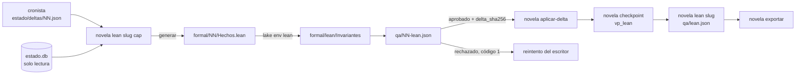

# 0012 — Verificar en Lean 4 la coherencia temporal de la historia y bloquear la publicación si falla

## 1. Resumen

Se añade un validador formal en Lean 4. Genera desde `estado.db` un fichero de hechos temporales: eventos, momento, lugar, personajes presentes y fechas de nacimiento. Después lo contrasta con invariantes demostrados en un proyecto Lake del repositorio. Si una invariante falla, el capítulo no entra en el estado ni se cierra, la novela no se exporta y el `escritor` recibe el fallo como informe de QA en su reintento. Lo usan el orquestador, que obedece el código de salida, y el operador, que no puede publicar una historia en la que un personaje está en dos sitios a la vez.

## 2. Contexto y problema

**Hoy no existe nada de Lean.** La auditoría del entregable marca LEAN-01 a LEAN-04 como «falta» y MEM-02 como «parcial»: `linea_temporal` no guarda personajes ni lugar por evento, y ningún generador la lee (`docs/auditoria-entregable.md` § MEM y § LEAN). OBS-04 añade que Lean tampoco se emite como score.

**Los datos temporales no bastan para razonar sobre ellos.** `linea_temporal(escena, capitulo, inicio, duracion_min, cita)` de `backend/novela/plataforma/esquema.sql` tiene `inicio` en texto libre. En `humo-0003` aparecen «23:10», «mañana» y «tarde/noche (durante temporal)», sin día (`docs/specs/0002-verificacion-a-escala-de-novela.md` § 15). La ficha de personaje guarda `edad`, no fecha de nacimiento (`docs/definitions.md` § 2.3). La petición indica que `linea_temporal` se amplía en G-MEM, un trabajo aparte que aún no tiene spec en `docs/specs/`. Esta spec consume esa ampliación y no la define (ver D3).

**El solape de escenas no lo comprueba nadie.** `docs/definitions.md` § 4 dice que `linea_temporal` existe para detectar «dos cosas ocurriendo simultáneamente en sitios distintos». `docs/validators.md` § 3.9.8 propone el invariante «nadie está en dos escenas que se solapan». Pero la spec 0002 lo sacó de su alcance porque `inicio` no está estructurado (0002 § 1, «Fuera del alcance»). Hoy solo lo vería el `continuista`, que es un modelo (clase I).

**La verificación formal estaba descartada.** `docs/validators.md` § 3.4 declara la verificación formal «descartada para el conjunto del sistema» y § 5.2 la acepta como riesgo U. Esta spec no demuestra la novela entera. Demuestra un subconjunto decidible, la coherencia temporal de los hechos registrados, y actualiza § 3.4 y § 5.2 en consecuencia (ver D12).

**Restricciones del repositorio que condicionan el diseño.**

- `estado.db` es la única fuente de verdad y solo la escribe `novela aplicar-delta`. `linea_temporal` es append-only por trigger (`AGENTS.md` § Invariantes 1 y 2). Una incoherencia que llegue a la base ya no se puede retirar (`docs/validators.md` § 5.9). Por eso el gate corre **antes** de `aplicar-delta`, sobre la base más el delta pendiente, los dos solo en lectura (ver D1).
- El `cronista` se invoca después de los gates de revisión, y el reintento vuelve al `escritor` con el informe de QA como única entrada nueva (`docs/architecture.md` § 2.1).
- No se reescriben capítulos anteriores (`AGENTS.md` § Invariantes 7).
- El CLI no llama a modelos ni accede a la red salvo para los scores (`AGENTS.md` § CLI y § Proceso: ejecución).
- Tocar un gate exige un test property-based (`AGENTS.md` § Proceso: generar código; `docs/validators.md` § 3.6).

**Relación con otras specs.**

- **0001** fijó `aplicar-delta`, su custodia por hash (RF-30 a RF-32) y los códigos de salida de `backend/novela/plataforma/salida.py`. Esta spec añade una precondición más a la custodia.
- **0002** (aceptada, sin implementar) añade invariantes narrativos a `aplicar-delta`, entre ellos que un personaje muerto no reaparece. El invariante de exclusión de esta spec (RF-09) se solapa con ese caso cuando G-MEM registre el momento de la exclusión. Los dos pueden convivir: 0002 mira `condicion` del delta y esta spec, el momento diegético. 0002 también introduce `novela gate` (ADR 0002), y esta spec no depende de él (ver D15).
- **0006** (Propuesta) añade la tabla `apariciones` por capítulo. No sirve como «personajes presentes» porque no tiene escena ni momento. Esta spec no la usa.
- **0007** (Propuesta) versiona la novela. Una versión nueva vuelve a pasar por este gate en cada capítulo que regenera. Reserva el ADR 0004, y 0006 reserva el 0003, así que el de esta spec es el 0005 (ver D12).
- **0009** fijó el catálogo de validadores `backend/novela/dominio/validadores.py` y un score `vp_*` por validador. Esta spec añade `vp_lean` (ver D14).
- **0010** (Propuesta) usa el mismo patrón de devolver el fallo al rol que lo causa, a través de `novela gate`.

## 3. Objetivos y no objetivos

### 3.1 Objetivos

- **O-01** Un generador puro convierte los hechos temporales leídos de `estado.db` en un fichero `Hechos.lean` determinista: mismas entradas, mismos bytes.
- **O-02** `formal/lean/` es un proyecto Lake sin dependencias externas, con tres invariantes: ubicuidad, nacimiento y exclusión. Las dos primeras son obligatorias y la tercera es condicional. Incluye un teorema que demuestra que la función que las comprueba es correcta.
- **O-03** `novela lean <slug> <cap>` rechaza con código 1 el 100 % de los deltas que introducen una violación. En ese caso `aplicar-delta` no los aplica, `checkpoint` no cierra el capítulo, `novela exportar` no publica y el `escritor` recibe `qa/NN-lean.json` en su reintento.
- **O-04** `checkpoint` emite el score `vp_lean` en cada capítulo cerrado.
- **O-05** `docs/lean-caso.md` documenta un caso en que Lean detecta una incoherencia que los demás validadores no detectaron, o justifica con datos por qué no se encontró.
- **O-06** `uv run pytest`, `mypy --strict` y `ruff` pasan sin Lean instalado. Solo un test necesita Lean: lleva la marca `lean` y se omite si falta `lake`.

### 3.2 No objetivos

- Ampliar el esquema de `estado.db` o el delta del `cronista` con momento estructurado, lugar, presencias, nacimientos o exclusiones. Es trabajo de G-MEM (ver D3).
- Comprobar la edad declarada en el texto o en `canon/personajes/*.md` (`identidad.edad`). El generador solo lee `estado.db`, y la edad declarada no está en él. El invariante de nacimiento comprueba solo que nadie aparece antes de nacer (ver D5).
- Comprobar el orden de las escenas dentro de un capítulo. Las analepsis lo harían fallar sin que haya ningún error (ver D5).
- Comprobar `coartada_y_cronologia_privada` ni ningún contenido de `canon/misterio.md`. El escritor recibiría el hallazgo en su reintento, y esos campos se le filtran (`docs/definitions.md` § 2.3).
- Instalar Lean en CI o añadir un job de CI (ver D11).
- Usar Mathlib o cualquier dependencia de Lake que se descargue (ver D10).
- Reescribir capítulos cerrados para corregir una incoherencia detectada al exportar. Sigue acabando en intervención (`AGENTS.md` § Invariantes 7).
- Sustituir al `continuista` o a los invariantes narrativos de la spec 0002.
- Cambiar la API, el frontend, `backend/api/openapi.json` o `backend/schemas/state.schema.json`.

## 4. Usuarios y escenarios

| Actor | Relación con esta spec |
|---|---|
| Orquestador (sesión principal) | Ejecuta `novela lean` entre el `cronista` y `aplicar-delta` y obedece su código de salida |
| `escritor` | Recibe `qa/NN-lean.json` como reintento cuando el capítulo rompe una invariante |
| Operador humano | Instala Lean una vez por máquina, lee `intervencion.md` si se agotan los intentos y exporta la novela |
| Desarrollador del harness | Mantiene los invariantes en `formal/lean/` y los prueba sin cuota |

- Como operador, quiero que la novela no se exporte si un personaje está en dos lugares a la vez, para no entregar una historia con una incoherencia que un lector detecta.
- Como `escritor`, quiero recibir qué personaje, qué escenas y qué momentos chocan, para corregir mi capítulo sin tocar los anteriores.
- Como desarrollador, quiero probar el generador y el gate con un `lake` falso, para mantener la suite sin Lean y sin cuota.

## 5. Requisitos funcionales

**Lectura y generación**

| ID | Requisito (EARS) | Prioridad |
|----|------------------|-----------|
| RF-01 | El sistema debe ofrecer `estado_db.hechos_temporales(conn) -> HechosTemporales`. La función lee en solo lectura los datos del contrato de § 8.3 y devuelve eventos, nacimientos y exclusiones validados por los modelos de `backend/novela/dominio/temporal.py` (ver D3). | Must |
| RF-02 | Cuando reciba un delta, el sistema debe proyectarlo sobre los hechos leídos con la función pura `temporal.proyectar(hechos, delta) -> HechosTemporales`, sin escribir en `estado.db`. La proyección es idempotente: una escena del delta que ya está en la base con el mismo contenido no se duplica (ver D1). | Must |
| RF-03 | El sistema debe convertir cada momento y cada fecha de nacimiento a minutos enteros desde `0001-01-01T00:00` en el calendario gregoriano proléptico, sin zona horaria. Un nacimiento `AAAA-MM-DD` vale las 00:00 de ese día (ver D4). | Must |
| RF-04 | El sistema debe generar `Hechos.lean` con la función pura `slices/lean/generador.py::generar(hechos) -> str`, con la gramática de § 8.4: eventos ordenados por `(inicio, escena)`, nacimientos y exclusiones ordenados por id, y final de línea `\n`. Dos llamadas con hechos equivalentes, en cualquier orden de entrada, devuelven los mismos bytes (ver D6). | Must |
| RF-05 | Si un id de escena, personaje o escenario no cumple su expresión de `docs/architecture.md` § 5, entonces el generador debe rechazar los hechos con `HechosInvalidos` sin producir texto, y `novela lean` debe salir con 4. Ningún texto que no sea un id validado o un entero llega a `Hechos.lean` (ver D6). | Must |

**Proyecto Lean**

| ID | Requisito (EARS) | Prioridad |
|----|------------------|-----------|
| RF-06 | El sistema debe incluir en `formal/lean/` un proyecto Lake con `lakefile.lean` sin ningún `require`, `lean-toolchain` con una versión estable fijada y la biblioteca `Invariantes`, que define `Evento`, `Nacimiento`, `Exclusion`, `Hechos` y `Violacion` según § 8.4 (ver D10). | Must |
| RF-07 | El sistema debe definir en `Invariantes` la invariante de ubicuidad. Ningún personaje está en dos eventos distintos cuyos intervalos `[inicio, inicio + max(duracion, 1))` se solapan y cuyos lugares difieren (ver D5). | Must |
| RF-08 | El sistema debe definir en `Invariantes` la invariante de nacimiento. Ningún personaje con fecha de nacimiento registrada está presente en un evento cuyo `inicio` es anterior a ella (ver D5). | Must |
| RF-09 | Donde G-MEM registre exclusiones, el sistema debe definir en `Invariantes` la invariante de exclusión. Ningún personaje excluido en un evento está presente en otro evento cuyo `inicio` es igual o posterior al fin del evento que lo excluye. Sin exclusiones registradas, la lista va vacía y el informe lo dice (ver D5). | Could |
| RF-10 | El sistema debe definir `violaciones : Hechos → List Violacion`, que devuelve las violaciones en orden determinista, y demostrar en `formal/lean/Invariantes/Correccion.lean` el teorema `violaciones_nil_iff : violaciones h = [] ↔ Coherente h`, donde `Coherente` es la conjunción de las invariantes como `Prop` (ver D16). | Should |
| RF-11 | El sistema debe incluir `formal/lean/README.md` con la instalación de `elan` y del toolchain fijado, cómo compilar la biblioteca, cómo comprobar un `Hechos.lean` a mano, la gramática de § 8.4 y la tabla de invariantes con su tipo de hallazgo. | Must |

**Subcomando y gate**

| ID | Requisito (EARS) | Prioridad |
|----|------------------|-----------|
| RF-12 | Cuando se ejecute `novela lean <slug> <cap>`, el sistema debe tomar el lock del workspace y abrir `estado.db` en solo lectura. Después lee y valida `estado/deltas/NN.json`, proyecta el delta (RF-02) y escribe `formal/NN/Hechos.lean` con escritura atómica. A continuación ejecuta `lake build Invariantes` y `lake env lean <ruta absoluta de Hechos.lean>` con `cwd` en `formal/lean/`, escribe `qa/NN-lean.json` con escritura atómica, añade la línea `lean NN -> <código>` a `harness.log` y sale con 0 si aprueba o con 1 si rechaza (ver D6, D7). | Must |
| RF-13 | Cuando se ejecute `novela lean <slug>` sin capítulo, el sistema debe hacer lo mismo sobre `estado.db` sin delta, con `formal/novela/Hechos.lean` y `qa/lean.json`. `capitulo` es el del último checkpoint. Sin checkpoint, sale con 4 (ver D7, D18). | Must |
| RF-14 | Si Lean informa violaciones y la comprobación falla, entonces el sistema debe escribir un informe `rechazado` con un hallazgo por violación: `tipo` según § 8.4, `gravedad` `alta`, `referencia` el id del personaje, `ubicacion` las escenas implicadas y `descripcion` con los lugares y los momentos en ISO 8601. Después sale con 1 (ver D8). | Must |
| RF-15 | Si falta el toolchain fijado, si `lake` o `lean` superan 120 s, si la comprobación falla sin ninguna línea de violación o si la salida de Lean y su código de salida no coinciden según la tabla de § 8.4, entonces el sistema debe salir con 4, sin escribir el informe, y nombrar la causa en stderr y en `harness.log` (ver D9, D17). | Must |
| RF-16 | Si `estado/deltas/NN.json` no existe o no valida, o si `estado.db` no tiene los datos del contrato de § 8.3, entonces `novela lean <slug> <cap>` debe salir con 4 sin ejecutar Lean y nombrar lo que falta (ver D3). | Must |
| RF-17 | Si `qa/NN-lean.json` no existe, no es `aprobado` o su `delta_sha256` no coincide con el sha256 de `estado/deltas/NN.json`, entonces `novela aplicar-delta` debe salir con 1 sin escribir nada. La causa en `harness.log` empieza por `custodia: lean` (ver D1). | Must |
| RF-18 | Si `qa/lean.json` no existe, no es `aprobado` o su `capitulo` no coincide con el del último checkpoint, entonces `novela exportar` debe salir con 1, nombrar la causa y no escribir nada en `export/` (ver D1, D18). | Must |

**Procedimientos del orquestador**

| ID | Requisito (EARS) | Prioridad |
|----|------------------|-----------|
| RF-19 | El procedimiento `.claude/commands/novela-continuar.md` debe ejecutar `novela lean <slug> <cap>` después del `cronista` y antes de `novela aplicar-delta`, también tras cada reintento del `cronista`. Un 1 de `novela lean` se trata así: reintento del `escritor` con su briefing del paso 2 y `reintento: qa/NN-lean.json`, vuelta al paso 3, intentos contados con las líneas `lean NN -> 1` y `gate: formal` en `intervencion.md` (ver D2). | Must |
| RF-20 | El procedimiento `.claude/commands/novela-auditar.md` debe ejecutar `novela lean <slug>` antes de `novela exportar`. Si sale con 1, escribe `intervencion.md` con `gate: formal` y para sin exportar (ver D1). | Must |

**Informe, catálogo y score**

| ID | Requisito (EARS) | Prioridad |
|----|------------------|-----------|
| RF-21 | El sistema debe ampliar `InformeQA` de `backend/novela/dominio/qa.py` con el productor `lean`, los tipos `lean_ubicuidad`, `lean_antes_de_nacer` y `lean_tras_exclusion`, y los campos opcionales `delta_sha256` y `hechos_sha256`. También regenera `backend/schemas/qa-informe.schema.json` y actualiza `docs/definitions.md` en el mismo commit (ver D8). | Must |
| RF-22 | El sistema debe añadir a `VALIDADORES` el validador `vp_lean`: puntos `lean` y `checkpoint`, bloquea en `lean`, tipos de RF-21 y valor binario. `docs/validators.md` § 3.10 tiene su fila (ver D14). | Must |
| RF-23 | Cuando `novela checkpoint` cierre un capítulo, el sistema debe validar `qa/NN-lean.json` con `vp_schema` como artefacto obligatorio y emitir `vp_lean`: 1 si el informe es `aprobado` y 0 si no. Se emite en la misma llamada que los demás scores y en el orden del catálogo (ver D14). | Must |

**Entorno, pruebas y documentación**

| ID | Requisito (EARS) | Prioridad |
|----|------------------|-----------|
| RF-24 | Cuando se ejecute `novela comprobar-entorno`, el sistema debe comprobar que `lake` y `lean` resuelven en el PATH y que `elan toolchain list` incluye el toolchain de `formal/lean/lean-toolchain`, sin descargar nada. Registra un hallazgo por fallo y sale con 1 (ver D9, D10). | Must |
| RF-25 | El sistema debe registrar la marca `lean` en `backend/pyproject.toml`. El único test que ejecuta Lean real lleva `@pytest.mark.lean` y se omite si `shutil.which("lake")` es `None` (ver D11). | Must |
| RF-26 | El sistema debe incluir el workspace fixture `lean-ubicuidad`, generado por `backend/tests/fixtures/fabrica.py` con datos ficticios, en el que un personaje está en dos escenarios distintos con intervalos solapados en capítulos distintos. Sobre él, `novela validar`, las violaciones de `aplicar-delta` y `novela auditar` no dan ningún hallazgo, y Lean lo rechaza con `lean_ubicuidad` (ver D13). | Must |
| RF-27 | El sistema debe incluir `docs/lean-caso.md` con el caso detectado o la justificación de § 8.6 (ver D13). | Must |
| RF-28 | El sistema debe crear `docs/adr/0005-validador-formal-temporal-en-lean.md` y actualizar, en el mismo commit que el código que los cambia: `docs/validators.md` § 2, § 3.4, § 3.10, § 5.2 y § 6; `docs/architecture.md` § 3.1, § 4, § 7.3, § 8, § 10.5 y § 11.1; `docs/definitions.md` § 6 y § 9; una línea del bucle en `CLAUDE.md`; y una línea de la sección CLI de `AGENTS.md` (ver D12, D19). | Must |
| RF-29 | El sistema debe ignorar `formal/lean/.lake/` en `.gitignore`. | Must |

## 6. Requisitos no funcionales

| ID | Categoría | Requisito | Métrica | Umbral |
|----|-----------|-----------|---------|--------|
| RNF-01 | Rendimiento | El generador es barato | Tiempo de `generar` con 1 000 eventos, 50 personajes y 10 personajes por evento | < 1 s |
| RNF-02 | Rendimiento | El gate cabe en el bucle | Tiempo total de `novela lean <slug> <cap>` con 1 000 eventos y la biblioteca ya compilada, en la máquina de desarrollo | ≤ 60 s |
| RNF-03 | Disponibilidad | Lean colgado no cuelga el bucle | Tiempo máximo de cada llamada a `lake` o `lean` antes de abortar con 4 | 120 s |
| RNF-04 | Seguridad | Sin red | `require` en `formal/lean/lakefile.lean`, y descargas iniciadas por `novela lean` o `comprobar-entorno` | 0 |
| RNF-05 | Seguridad | Sin inyección de código Lean | Cadenas generadas por Hypothesis fuera de las expresiones de id que llegan a `Hechos.lean` | 0 |
| RNF-06 | Integridad | `estado.db` solo se lee | Diferencia de sha256 de `estado.db` antes y después de `novela lean` | 0 bytes |
| RNF-07 | Privacidad | Solo entran datos del estado | Textos de `canon/`, campos `cita` o prosa de capítulos en `Hechos.lean` y `qa/*lean.json` | 0 |
| RNF-08 | Compatibilidad | La suite no depende de Lean | Tests que fallan con `lake` ausente del PATH | 0, con 1 omitido |
| RNF-09 | Compatibilidad | Contratos ajenos intactos | Cambios en `backend/api/openapi.json` y `backend/schemas/state.schema.json` introducidos por esta spec | 0 |
| RNF-10 | Observabilidad | Un score por capítulo | Scores `vp_lean` emitidos por capítulo cerrado con el sink activo | 1 |
| RNF-11 | Calidad de pruebas | Propiedades con volumen | `max_examples` de cada propiedad de Hypothesis de esta spec | ≥ 200 |

## 7. Criterios de aceptación

### CA-01 (cubre RF-01)
- **Dado** un `estado.db` fixture con el contrato de § 8.3, 3 eventos, 2 nacimientos y 1 exclusión
- **Cuando** se llama a `estado_db.hechos_temporales` sobre una conexión en solo lectura
- **Entonces** devuelve exactamente esos 3 eventos con sus personajes y lugar, los 2 nacimientos y la exclusión, y ninguna escritura se ejecuta

### CA-02 (cubre RF-02)
- **Dado** unos hechos leídos y un delta con 2 escenas nuevas, una de ellas ya presente en la base con el mismo contenido
- **Cuando** se aplica `temporal.proyectar` una y dos veces
- **Entonces** el resultado tiene una sola copia de cada escena, es igual en las dos aplicaciones y la base no cambia (propiedad de Hypothesis)

### CA-03 (cubre RF-03)
- **Dados** dos momentos ISO `t1 < t2` generados al azar y el nacimiento `2000-02-29`
- **Cuando** se convierten a minutos
- **Entonces** `minutos(t1) < minutos(t2)`, y el nacimiento vale lo mismo que `2000-02-29T00:00`

### CA-04 (cubre RF-04)
- **Dado** el estado fixture de CA-01
- **Cuando** se genera `Hechos.lean`
- **Entonces** coincide byte a byte con `backend/tests/fixtures/lean/Hechos.esperado.lean`. Para hechos generados al azar y cualquier permutación de su orden de entrada, la salida es idéntica, y el lector de la gramática de § 8.4 del test devuelve los hechos normalizados (ida y vuelta)

### CA-05 (cubre RF-05)
- **Dados** unos hechos con un id que contiene `"`, un salto de línea o `#eval`, generados por Hypothesis
- **Cuando** se llama a `generar` y a `novela lean`
- **Entonces** `generar` lanza `HechosInvalidos` sin devolver texto y `novela lean` sale con 4 sin escribir `formal/` ni `qa/`

### CA-06 (cubre RF-06)
- **Dado** el repositorio
- **Cuando** se lee `formal/lean/lakefile.lean` y `formal/lean/lean-toolchain`
- **Entonces** el lakefile no contiene `require`, el toolchain es una versión `leanprover/lean4:vX.Y.Z` sin `nightly` ni `rc`, y existen los módulos de § 8.4

### CA-07 (cubre RF-07)
- **Dado** el workspace `lean-ubicuidad` y, como control, el mismo con el segundo evento movido a un intervalo que no se solapa
- **Cuando** se ejecuta Lean real (test marcado `lean`)
- **Entonces** el primero produce una sola violación `ubicuidad` con el personaje y las dos escenas, y el control ninguna

### CA-08 (cubre RF-08)
- **Dados** unos hechos en los que un personaje aparece en un evento un minuto antes de su nacimiento
- **Cuando** se comprueban con Lean real (test marcado `lean`)
- **Entonces** hay una violación `antesDeNacer`, y con el evento en el minuto exacto del nacimiento no hay ninguna

### CA-09 (cubre RF-09)
- **Dados** unos hechos con una exclusión de un personaje en un evento que termina en el minuto `m`, y ese personaje presente en otro evento que empieza en `m`
- **Cuando** se comprueban con Lean real (test marcado `lean`)
- **Entonces** hay una violación `trasExclusion`. Sin exclusiones, no la hay, y el informe declara `exclusiones: 0` en la descripción del resumen

### CA-10 (cubre RF-10)
- **Dado** `formal/lean/Invariantes/Correccion.lean`
- **Cuando** se ejecuta `lake build Invariantes` (test marcado `lean`)
- **Entonces** compila sin `sorry` ni `admit`, y `grep -E "sorry|admit"` sobre `formal/lean/` no devuelve nada (test sin Lean)

### CA-11 (cubre RF-11)
- **Dado** `formal/lean/README.md`
- **Cuando** lo lee el test de contrato
- **Entonces** contiene las secciones «Instalación», «Compilar», «Comprobar un Hechos.lean», «Gramática» e «Invariantes», y la tabla de invariantes nombra los tres tipos de RF-21

### CA-12 (cubre RF-12)
- **Dado** un workspace fixture en el paso del `cronista` con un delta válido, y un `lake` falso (`plataforma.lean.ejecutar` sustituido) que devuelve código 0 y la línea `LEAN-RESUMEN {"eventos":4,"violaciones":0}`
- **Cuando** se ejecuta `novela lean <slug> 2`
- **Entonces** sale con 0 y escribe `formal/02/Hechos.lean` y `qa/02-lean.json` `aprobado` con `delta_sha256` igual al del delta. `harness.log` termina en `lean 02 -> 0`, el lake falso recibió `["lake","build","Invariantes"]` y `["lake","env","lean",<ruta>]` con `cwd` `formal/lean`, y el sha256 de `estado.db` no cambió

### CA-13 (cubre RF-13)
- **Dado** un workspace con el capítulo 3 cerrado y el lake falso de CA-12
- **Cuando** se ejecuta `novela lean <slug>`
- **Entonces** escribe `formal/novela/Hechos.lean` y `qa/lean.json` con `capitulo: 3`. Sin checkpoint, sale con 4

### CA-14 (cubre RF-14)
- **Dado** un lake falso que devuelve código 1, dos líneas `LEAN-VIOLACION` (una de ubicuidad y una de nacimiento) y `LEAN-RESUMEN {"eventos":4,"violaciones":2}`
- **Cuando** se ejecuta `novela lean <slug> 2`
- **Entonces** sale con 1, `qa/02-lean.json` es `rechazado` con dos hallazgos `lean_ubicuidad` y `lean_antes_de_nacer`, `gravedad` `alta`, el id del personaje en `referencia` y las escenas en `ubicacion`, y `harness.log` termina en `lean 02 -> 1`

### CA-15 (cubre RF-15)
- **Dadas** las salidas del lake falso: toolchain ausente, `TimeoutExpired`, código 1 sin líneas de violación, código 0 con una línea de violación, y código 1 con un resumen cuyo recuento no coincide con las líneas
- **Cuando** se ejecuta `novela lean <slug> 2` con cada una
- **Entonces** sale con 4 en todas, no existe `qa/02-lean.json` nuevo y stderr nombra la causa. Para cualquier combinación de código y líneas generada por Hypothesis, `interpretar` devuelve `aprobado` solo con código 0, cero violaciones y el resumen presente

### CA-16 (cubre RF-16)
- **Dados** un workspace sin `estado/deltas/02.json`, otro con un delta que no valida y otro cuyo `estado.db` no tiene los datos de § 8.3
- **Cuando** se ejecuta `novela lean <slug> 2`
- **Entonces** sale con 4, nombra lo que falta y el lake falso no recibe ninguna llamada

### CA-17 (cubre RF-17)
- **Dados** un delta válido y los casos: sin `qa/02-lean.json`, con el informe `rechazado` y con el informe `aprobado` pero de otro delta
- **Cuando** se ejecuta `novela aplicar-delta <slug> 2`
- **Entonces** sale con 1 en los tres, la causa empieza por `custodia: lean` y `estado.db` no cambia. Con el informe `aprobado` del mismo delta, aplica. Para cualquier par (veredicto, sha) generado por Hypothesis, la precondición aprueba si y solo si el veredicto es `aprobado` y los sha coinciden

### CA-18 (cubre RF-18)
- **Dado** un workspace con el capítulo 3 cerrado
- **Cuando** se ejecuta `novela exportar <slug> --formato md` sin `qa/lean.json`, con `qa/lean.json` `rechazado`, con uno `aprobado` de `capitulo: 2` y con uno `aprobado` de `capitulo: 3`
- **Entonces** los tres primeros salen con 1 sin crear ni modificar `export/`, y el último exporta

### CA-19 (cubre RF-19)
- **Dado** `.claude/commands/novela-continuar.md`
- **Cuando** lo lee `tests/test_contratos.py::test_procedimiento_lean`
- **Entonces** `novela lean <slug> <cap>` aparece entre `Task` `cronista` y `novela aplicar-delta`. La tabla de intentos tiene la fila `lean NN -> 1`, el reintento nombra `reintento: qa/NN-lean.json` y el paso 3, y el bloque de `intervencion.md` admite `formal`. En la novela de humo, un capítulo con el defecto de `lean-ubicuidad` sembrado en su delta vuelve al `escritor`

### CA-20 (cubre RF-20)
- **Dado** `.claude/commands/novela-auditar.md`
- **Cuando** lo lee `test_contratos.py::test_procedimiento_lean`
- **Entonces** `novela lean <slug>` aparece antes de `novela exportar`, con la parada `gate: formal` ante un 1

### CA-21 (cubre RF-21)
- **Dado** `InformeQA`
- **Cuando** se valida un informe `agente: lean` con los tres tipos nuevos y los dos sha, y otro con `delta_sha256` que no es un sha256
- **Entonces** el primero valida, el segundo falla, y `REGENERAR=1 uv run pytest tests/test_contratos.py` no deja cambios sin commitear en `backend/schemas/`

### CA-22 (cubre RF-22)
- **Dado** el catálogo
- **Cuando** se ejecutan `dominio/test_validadores.py::test_catalogo` y `tests/test_contratos.py::test_tabla_de_validadores`
- **Entonces** `validador_de("lean_ubicuidad") == "vp_lean"` para los tres tipos, ningún tipo pertenece a dos validadores y la fila de `docs/validators.md` § 3.10 coincide

### CA-23 (cubre RF-23)
- **Dado** un capítulo listo para cerrar con `qa/NN-lean.json` `aprobado` y un sink falso
- **Cuando** se ejecuta `novela checkpoint`
- **Entonces** el sink recibe `vp_lean: 1.0` en la misma emisión y detrás de `vp_nombres`. Con `qa/NN-lean.json` ausente o sin validar, `vp_schema` rechaza, emite solo `vp_schema: 0` y sale con 1 sin escribir el checkpoint

### CA-24 (cubre RF-24)
- **Dadas** las combinaciones: `lake` ausente, `lean` ausente, toolchain fijado no instalado y todo presente
- **Cuando** se llama a `comprobaciones.entorno` con esos resultados
- **Entonces** hay un hallazgo por cada fallo, que nombra la herramienta o el toolchain, y ninguno con todo presente. La cáscara no invoca ninguna orden que descargue (`elan toolchain install`, `lake update`)

### CA-25 (cubre RF-25)
- **Dado** un entorno sin `lake` en el PATH
- **Cuando** se ejecuta `uv run pytest`
- **Entonces** la suite pasa, exactamente un test figura como omitido con el motivo «lake no está en el PATH», y `pytest --markers` lista `lean`

### CA-26 (cubre RF-26)
- **Dado** el workspace `lean-ubicuidad`
- **Cuando** se ejecutan `novela validar` de sus capítulos, `aplicar-delta` de cada delta en orden con un `qa/NN-lean.json` aprobado de prueba, y `novela auditar`
- **Entonces** ninguno da hallazgos ni sale con 1, y `generar` produce dos eventos del mismo personaje en lugares distintos con intervalos solapados. El test marcado de CA-07 cierra el caso con Lean real

### CA-27 (cubre RF-27)
- **Dado** `docs/lean-caso.md`
- **Cuando** lo lee `tests/test_contratos.py::test_lean_caso` y lo inspecciona la revisión de la spec
- **Entonces** tiene las secciones de § 8.6, cada orden citada existe en el CLI, y el caso sembrado está marcado como tal y no como caso real

### CA-28 (cubre RF-28)
- **Dado** el commit que cierra la implementación
- **Cuando** se revisan los documentos de RF-28
- **Entonces** cada uno describe `novela lean`, `qa/NN-lean.json`, `vp_lean` y `formal/lean/` tal como están implementados, sin «pendiente» ni «próximamente». `docs/adr/0005-validador-formal-temporal-en-lean.md` existe con estado `aceptada`, y § 3.4 y § 5.2 de `validators.md` ya no declaran U la coherencia temporal

### CA-29 (cubre RF-29)
- **Dado** el repositorio tras `lake build`
- **Cuando** se ejecuta `git check-ignore formal/lean/.lake/`
- **Entonces** sale con 0

## 8. Diseño propuesto

### 8.1 Visión general

El validador es un gate determinista más, con dos mitades. En Python, dentro del CLI, se leen los hechos, se proyecta el delta, se genera el fichero Lean, se ejecuta Lake y se interpreta su salida. En Lean, en el repositorio, viven las invariantes, la función que las comprueba y su demostración de corrección. `estado.db` y el delta se leen y no se escriben.



El gate por capítulo mira la historia acumulada hasta ese capítulo, así que el del último capítulo cubre la novela entera. `novela lean <slug>` sin capítulo vuelve a comprobarla sobre la base ya escrita justo antes de exportar, que es el momento de publicar (ver D1).

### 8.2 Componentes afectados

**Nuevos**

- `formal/lean/lakefile.lean`, `formal/lean/lean-toolchain`, `formal/lean/Invariantes.lean`, `formal/lean/Invariantes/Tipos.lean`, `formal/lean/Invariantes/Reglas.lean`, `formal/lean/Invariantes/Informe.lean`, `formal/lean/Invariantes/Correccion.lean` y `formal/lean/README.md`.
- `backend/novela/dominio/temporal.py`: `Evento`, `Nacimiento`, `Exclusion`, `HechosTemporales` (Pydantic, congelados), `minutos(...)` y `proyectar(...)`. Puros.
- `backend/novela/slices/lean/`: `cmd.py` (cáscara), `generador.py` (puro), `interpretar.py` (puro: código y salida de Lean → veredicto y hallazgos), `test_generador.py`, `test_interpretar.py`, `test_lean.py` (cáscara con lake falso) y `test_lean_real.py` (marcado `lean`).
- `backend/novela/plataforma/lean.py`: `ejecutar(orden, cwd, timeout) -> ResultadoLean`, con `subprocess.run` sin shell y lista de argumentos, y `toolchain_instalado(raiz) -> bool`.
- `backend/tests/fixtures/lean/Hechos.esperado.lean` y la fábrica del workspace `lean-ubicuidad` en `backend/tests/fixtures/fabrica.py`.
- `docs/lean-caso.md` y `docs/adr/0005-validador-formal-temporal-en-lean.md`.

**Modificados**

- `backend/novela/plataforma/estado_db.py`: `hechos_temporales(conn)`.
- `backend/novela/dominio/qa.py`: productor, tipos y campos de RF-21.
- `backend/novela/dominio/validadores.py`: `Punto` gana `lean`, y `VALIDADORES` gana `vp_lean`.
- `backend/novela/slices/delta/custodia.py` y `backend/novela/slices/delta/cmd.py`: precondición de RF-17.
- `backend/novela/slices/export/cmd.py`: precondición de RF-18.
- `backend/novela/slices/checkpoint/cmd.py`: artefacto `qa/NN-lean.json` en `artefactos()` y `vp_lean` en `calcular_scores_validadores`.
- `backend/novela/slices/entorno/comprobaciones.py` y `cmd.py`: RF-24.
- `backend/novela/cli.py`: registro de `lean`.
- `backend/schemas/qa-informe.schema.json` (regenerado), `backend/pyproject.toml` (marca `lean`) y `.gitignore`.
- `backend/tests/test_contratos.py`: `test_procedimiento_lean`, `test_lean_caso`, `test_formal_readme` y la tabla de validadores.
- `.claude/commands/novela-continuar.md` y `.claude/commands/novela-auditar.md`.
- Documentación de RF-28.

### 8.3 Modelo de datos

**Contrato de entrada (lo aporta G-MEM).** Esta spec no cambia `esquema.sql`. Exige que, tras G-MEM, `estado.db` y el delta del `cronista` contengan la información siguiente. Los nombres de tabla y columna los fija G-MEM, y `estado_db.hechos_temporales` y `temporal.proyectar` son los dos únicos sitios que los conocen (ver D3).

| Información | Por evento o personaje | Tipo lógico | Estado hoy |
|---|---|---|---|
| Escena, capítulo, duración | evento | `esc-NN-N`, entero, minutos ≥ 0 | existe en `linea_temporal` |
| Momento de inicio | evento | ISO 8601 `AAAA-MM-DDTHH:MM`, sin zona | falta (`inicio` es texto libre) |
| Lugar | evento | id de escenario `esc-<slug>` | falta |
| Personajes presentes | evento | lista de `per-<slug>` | falta |
| Fecha de nacimiento | personaje | ISO 8601 `AAAA-MM-DD`, opcional | falta |
| Exclusión | (personaje, evento) | par de ids | falta, opcional |

Si falta cualquiera de las cuatro primeras filas nuevas, `novela lean` sale con 4 (RF-16). Si G-MEM representa el tiempo de otra forma, esta tabla y RF-03 se revisan antes de aceptar la spec (ver D4).

**Modelos de dominio (`dominio/temporal.py`).**

| Modelo | Campos |
|---|---|
| `Evento` | `escena: EscenaId`, `capitulo: CapituloNum`, `inicio: int` (minutos), `duracion: int` (≥ 0), `lugar: EscenarioId`, `personajes: tuple[PersonajeId, ...]` |
| `Nacimiento` | `personaje: PersonajeId`, `minuto: int` |
| `Exclusion` | `personaje: PersonajeId`, `escena: EscenaId` |
| `HechosTemporales` | `eventos`, `nacimientos`, `exclusiones` (tuplas) |

**Informe.** `qa/NN-lean.json` y `qa/lean.json` son `InformeQA` con `agente: "lean"`. `capitulo` es `cap`, o el del último checkpoint en `qa/lean.json`. `delta_sha256` es el sha256 del delta leído, solo en `qa/NN-lean.json`. `hechos_sha256` es el sha256 del `Hechos.lean` generado. Los hallazgos siguen RF-14 (ver D8).

**Ficheros generados en el workspace.** `formal/NN/Hechos.lean` y `formal/novela/Hechos.lean`, con escritura atómica. Se sobrescriben en cada ejecución y son derivados (ver D7).

### 8.4 Interfaces y contratos

**CLI.**

```
novela lean <slug> <cap>    gate por capítulo: estado.db + estado/deltas/NN.json → qa/NN-lean.json
novela lean <slug>          historia escrita: estado.db → qa/lean.json
```

| Código | Significado |
|---|---|
| 0 | Aprobado |
| 1 | Rechazado: una o más violaciones |
| 2 | Uso incorrecto |
| 3 | Lock ocupado |
| 4 | Workspace inválido o entorno de Lean inutilizable (RF-05, RF-13, RF-15, RF-16) |

**Tipos Lean (`Invariantes/Tipos.lean`).**

```lean
structure Evento where
  escena : String
  capitulo : Nat
  inicio : Nat        -- minutos desde 0001-01-01T00:00
  duracion : Nat
  lugar : String
  personajes : List String
deriving DecidableEq, Repr

structure Nacimiento where
  personaje : String
  minuto : Nat
deriving DecidableEq, Repr

structure Exclusion where
  personaje : String
  escena : String
deriving DecidableEq, Repr

structure Hechos where
  eventos : List Evento
  nacimientos : List Nacimiento
  exclusiones : List Exclusion

inductive Violacion where
  | ubicuidad (personaje : String) (e₁ e₂ : Evento)
  | antesDeNacer (personaje : String) (e : Evento) (nacimiento : Nat)
  | trasExclusion (personaje : String) (excluye e : Evento)
deriving DecidableEq, Repr
```

`fin e = e.inicio + max e.duracion 1`. Dos eventos se solapan si `e₁.inicio < fin e₂ ∧ e₂.inicio < fin e₁`. Cada par sin ordenar se informa una vez, con `e₁.escena < e₂.escena`.

**Gramática de `Hechos.lean` (salida de `generar`).** Solo contiene ids que cumplen su expresión y enteros no negativos:

```lean
import Invariantes
open Invariantes

def hechos : Hechos where
  eventos := [
    ⟨"esc-01-1", 1, 1064000000, 45, "esc-faro-prueba", ["per-prueba-uno"]⟩,
    …
  ]
  nacimientos := [⟨"per-prueba-uno", 1051000000⟩, …]
  exclusiones := [⟨"per-prueba-dos", "esc-02-3"⟩, …]

#eval imprimirInforme hechos
theorem coherente : violaciones hechos = [] := by native_decide
```

Un evento por línea, sangrado de 4 espacios, coma final salvo en el último elemento, `\n` como fin de línea y un `\n` al final del fichero (ver D6).

**Salida de Lean que interpreta el CLI.** `imprimirInforme` escribe en stdout una línea `LEAN-VIOLACION <json>` por violación, en el orden de `violaciones`, y una última línea `LEAN-RESUMEN {"eventos":n,"nacimientos":m,"exclusiones":k,"violaciones":v}`.

```json
{"invariante":"ubicuidad","personaje":"per-prueba-uno","escenas":["esc-01-2","esc-02-1"],"lugares":["esc-faro-prueba","esc-puerto-prueba"],"inicios":[1064001290,1064001260]}
```

| Código de `lake env lean` | Líneas `LEAN-VIOLACION` | `LEAN-RESUMEN.violaciones` | Resultado |
|---|---|---|---|
| 0 | 0 | 0 | `aprobado`, código 0 |
| ≠ 0 | v ≥ 1 | v | `rechazado`, código 1 |
| cualquier otro caso | | | error de entorno, código 4 (RF-15) |

Correspondencia de tipos: `ubicuidad` → `lean_ubicuidad`, `antesDeNacer` → `lean_antes_de_nacer`, `trasExclusion` → `lean_tras_exclusion`. `interpretar` vuelve a convertir los minutos a ISO 8601 para la `descripcion`.

**Python.**

```python
# dominio/temporal.py
def minutos(momento: str) -> int: ...                    # ISO → minutos; ValueError si no es ISO
def proyectar(hechos: HechosTemporales, delta: Delta) -> HechosTemporales: ...

# plataforma/estado_db.py
def hechos_temporales(conn: sqlite3.Connection) -> HechosTemporales: ...  # ContratoTemporalAusente

# slices/lean/generador.py
class HechosInvalidos(ValueError): ...
def generar(hechos: HechosTemporales) -> str: ...

# slices/lean/interpretar.py
def interpretar(codigo: int, stdout: str, capitulo: int) -> InformeQA | ErrorLean: ...

# plataforma/lean.py
@dataclass(frozen=True)
class ResultadoLean: codigo: int; stdout: str; stderr: str
def ejecutar(orden: Sequence[str], cwd: Path, timeout: float = 120) -> ResultadoLean: ...
def toolchain_instalado(proyecto: Path) -> bool: ...     # lee lean-toolchain y `elan toolchain list`
```

El proyecto Lean se localiza como `run.RAIZ_REPO / "formal" / "lean"`, igual que `comprobar-entorno` localiza `.claude/`.

### 8.5 Flujo principal

Caso feliz del capítulo `cap` dentro de `/novela-continuar`:

1. Pasos 2 a 6 del procedimiento sin cambios: `escritor`, `validar`, revisión, `validar` otra vez y gate de revisión.
2. `novela briefing <slug> <cap> cronista` → Task `cronista` → `estado/deltas/NN.json`.
3. `novela lean <slug> <cap>`:
   1. Toma el lock y abre `estado.db` en solo lectura.
   2. Lee `hechos_temporales(conn)` y valida el delta con su modelo.
   3. `proyectar` → `generar` → escribe `formal/NN/Hechos.lean` (tmp y renombrado).
   4. `lake build Invariantes` en `formal/lean/`: la primera vez compila, después no hace nada.
   5. `lake env lean <ruta de Hechos.lean>`, con límite de 120 s.
   6. `interpretar` → escribe `qa/NN-lean.json` (tmp y renombrado) con `delta_sha256` y `hechos_sha256`.
   7. Línea `lean NN -> 0` en `harness.log` y salida con 0.
4. `novela aplicar-delta <slug> <cap>`: la custodia comprueba `qa/NN-lean.json` (RF-17) y aplica.
5. `novela checkpoint <slug> <cap>`: `vp_schema` valida `qa/NN-lean.json` y emite `vp_lean: 1`.

Al final de la novela, `/novela-auditar` ejecuta `novela auditar`, después `novela lean <slug>` (→ `qa/lean.json` aprobado con el `capitulo` del último checkpoint) y por último `novela exportar`, que comprueba RF-18.

Camino de rechazo: en el paso 3, Lean informa violaciones → `qa/NN-lean.json` `rechazado`, `lean NN -> 1`, salida con 1 → reintento del `escritor` con `reintento: qa/NN-lean.json` → vuelta al paso 3 del procedimiento. Al tercer fallo, `intervencion.md` con `gate: formal` (ver D2).

### 8.6 Documento del caso (`docs/lean-caso.md`)

Secciones obligatorias (ver D13):

1. **Qué se buscó**: las invariantes y la versión del toolchain.
2. **Novela real**: slug y sha del harness de la novela de humo de 3 capítulos generada con G-MEM y esta spec. Eventos, personajes y pares comprobados, y resultado de `novela lean <slug>` en cada capítulo.
3. **Comparación**: por cada violación, qué dijeron `qa/NN-validacion.json`, `qa/NN-continuidad.json` y `novela auditar` sobre el mismo capítulo.
4. **Si no se encontró ninguna**: la justificación con los datos de la sección 2 y la tasa de detección del `continuista` en esos capítulos.
5. **Caso sembrado reproducible**: el workspace `lean-ubicuidad`, marcado explícitamente como sembrado, con las órdenes para reproducirlo y la salida de Lean.

## 9. Casos límite y gestión de errores

| Caso | Comportamiento esperado | Requisito relacionado |
|------|-------------------------|-----------------------|
| Evento con `duracion` 0 | Se trata como intervalo de 1 minuto: dos eventos instantáneos en el mismo minuto y lugares distintos con el mismo personaje violan ubicuidad | RF-07 |
| Dos eventos solapados con el mismo personaje y el mismo lugar | No es violación | RF-07 |
| Evento sin personajes presentes | Se genera y no participa en ninguna invariante | RF-04 |
| Personaje sin fecha de nacimiento | No participa en la invariante de nacimiento | RF-08 |
| Nacimiento posterior a todos los eventos del personaje | Una violación `antesDeNacer` por cada evento en que aparece | RF-08 |
| Sin exclusiones registradas en G-MEM | Lista vacía, `exclusiones: 0` en el resumen, sin hallazgo | RF-09 |
| La violación enfrenta una escena del capítulo actual con una de un capítulo cerrado | Rechazo y reintento del `escritor`: solo puede cambiar su capítulo, y el hallazgo nombra las dos escenas | RF-14, RF-19 |
| `qa/lean.json` rechazado al exportar, con violaciones solo en capítulos cerrados | `novela exportar` sale con 1 y `/novela-auditar` escribe `intervencion.md` sin reintentar (invariante 7) | RF-18, RF-20 |
| Reanudación después de `aplicar-delta` del mismo capítulo | `proyectar` no duplica las escenas ya aplicadas y el veredicto es el mismo | RF-02 |
| El `cronista` se reintenta por un fallo de `aplicar-delta` | El delta cambia, `delta_sha256` ya no coincide y el procedimiento repite `novela lean` antes de `aplicar-delta` | RF-17, RF-19 |
| La sesión se salta `novela lean` | `aplicar-delta` sale con 1 y causa `custodia: lean`, y el procedimiento para con intervención | RF-17 |
| Toolchain no instalado o `elan` intentaría descargarlo | `comprobar-entorno` falla antes del bucle, y `novela lean` sale con 4 sin invocar `lake` | RF-15, RF-24 |
| `lake` o `lean` colgado | Aborta a los 120 s con 4 | RF-15 |
| Error de compilación de `Hechos.lean` (fallo del generador) | Código ≠ 0 sin líneas de violación → 4. No consume reintentos del `escritor` | RF-15 |
| Id con caracteres fuera de su expresión | `HechosInvalidos`, sale con 4 y no se genera nada | RF-05 |
| Workspace creado antes de G-MEM | `ContratoTemporalAusente`, sale con 4 y nombra lo que falta | RF-16 |
| Lock ocupado | Sale con 3 sin escribir | RF-12 |
| Dos workspaces compilan la biblioteca a la vez | Lake serializa la compilación en `formal/lean/.lake/`. Si falla, el error sale con 4 y se reintenta a mano | RF-15 |
| Momento fuera de rango (año < 1) | `minutos` lanza `ValueError` y sale con 4 | RF-03 |

## 10. Dependencias y supuestos

- **G-MEM** (trabajo aparte, sin spec en `docs/specs/` a fecha de hoy) debe ampliar `estado.db` y el delta con la información de § 8.3. Sin ella, `novela lean` sale con 4 en cualquier workspace (ver D3).
- **Lean 4 y Lake**, instalados con `elan` una vez por máquina, en la versión de `formal/lean/lean-toolchain`. Es una dependencia del entorno como `uv` o `claude`, no del lockfile de Python.
- **Spec 0009**, implementada en lo que usa esta: catálogo de validadores y emisión de `vp_*` en `checkpoint`.
- **Spec 0002** (aceptada, sin implementar): si se implementa `novela gate`, gana el tipo de gate `formal`, que lee `qa/NN-lean.json`. Esta spec no lo necesita (ver D15).
- **Supuesto:** `native_decide` evalúa `violaciones hechos = []` con 1 000 eventos dentro de RNF-02. Se mide en T-01 (ver D6).
- **Supuesto:** Lake no accede a la red al compilar un paquete sin `require`, y `elan toolchain list` no descarga nada. Se comprueba en T-01 con la red desactivada (ver D10).
- **Supuesto:** G-MEM guarda momentos absolutos en ISO 8601. Si guarda tiempo relativo («día 3»), la invariante de nacimiento necesita una fecha de origen y esta spec se revisa antes de aceptarse (ver D4).

## 11. Riesgos

| Riesgo | Probabilidad (A/M/B) | Impacto (A/M/B) | Mitigación |
|--------|----------------------|-----------------|------------|
| G-MEM no aporta momento estructurado, o lo aporta en otra forma | M | A | § 8.3 fija el contrato mínimo. La spec no se acepta hasta que G-MEM lo confirme (D3, D4) |
| El `cronista` (haiku) extrae mal el momento o el lugar y Lean rechaza un capítulo sano | M | M | El hallazgo nombra escenas y momentos. Dos reintentos y después intervención. La cita obligatoria de la spec 0002 reduce la alucinación |
| El `escritor` no puede corregir una violación que depende de un capítulo cerrado | B | M | Termina en intervención (invariante 7), igual que hoy |
| `native_decide` confía en el compilador de Lean y amplía la base de confianza | B | B | El teorema de corrección (RF-10) se comprueba con el kernel. Se documenta en el ADR 0005 y en `validators.md` § 3.4 |
| `native_decide` o la compilación superan RNF-02 con novelas largas | B | M | Medición en T-01. Algoritmo por personaje y no por pares globales. Límite de 120 s |
| La primera compilación de la biblioteca en una máquina nueva tarda más de lo esperado | M | B | `formal/lean/README.md` indica compilarla una vez tras instalar |
| Actualizar el toolchain rompe los invariantes | B | M | Versión fijada en `lean-toolchain`, y cambiarla pasa por PR con el test marcado en local |
| La verificación de Lean solo corre en local porque CI no lo instala | M | M | Test marcado. La novela de humo lo ejercita. Añadirlo a CI es una decisión revisable (D11) |
| Las comprobaciones de nacimiento y exclusión quedan vacías si faltan datos | M | B | El resumen declara los recuentos, y `docs/lean-caso.md` los publica |

## 12. Plan de implementación

| ID | Tarea | Cubre | Verificación |
|----|-------|-------|--------------|
| T-01 | Proyecto Lake en `formal/lean/`: toolchain fijado, tipos, invariantes, `violaciones`, `imprimirInforme`, `Correccion.lean`, README y `.gitignore`. Medir `native_decide` con 1 000 eventos sintéticos y compilar con la red desactivada | RF-06, RF-07, RF-08, RF-09, RF-10, RF-11, RF-29 | `lake build Invariantes` en verde en local. CA-06, CA-10 (parte sin Lean), CA-11 y CA-29 en verde. RNF-02 y RNF-04 medidos y anotados en el PR |
| T-02 | `dominio/temporal.py` (modelos, `minutos`, `proyectar`) y `estado_db.hechos_temporales` sobre un fixture con el contrato de § 8.3 | RF-01, RF-02, RF-03 | CA-01, CA-02 y CA-03 en verde, vistos antes en rojo |
| T-03 | `slices/lean/generador.py`, `Hechos.esperado.lean` y propiedades de determinismo, ida y vuelta e ids | RF-04, RF-05 | CA-04 y CA-05 en verde. RNF-01, RNF-05 y RNF-11 medidos |
| T-04 | `InformeQA` ampliado, `qa-informe.schema.json` regenerado, `definitions.md` § 6, y `slices/lean/interpretar.py` con propiedad | RF-14, RF-15, RF-21 | CA-21 en verde. CA-14 y CA-15 a nivel de función |
| T-05 | `plataforma/lean.py`, `slices/lean/cmd.py`, registro en `cli.py` y línea de `harness.log`, con lake falso | RF-12, RF-13, RF-14, RF-15, RF-16 | CA-12 a CA-16 en verde. RNF-06 y RNF-07 comprobados en CA-12 |
| T-06 | Precondición de lean en la custodia de `aplicar-delta`, con propiedad | RF-17 | CA-17 en verde |
| T-07 | Precondición en `novela exportar` | RF-18 | CA-18 en verde |
| T-08 | `vp_lean` en el catálogo, artefacto en `vp_schema` y score en `checkpoint`. Fila en `validators.md` § 3.10 | RF-22, RF-23 | CA-22 y CA-23 en verde. RNF-10 |
| T-09 | `comprobar-entorno`: `lake`, `lean` y toolchain | RF-24 | CA-24 en verde |
| T-10 | Marca `lean`, workspace `lean-ubicuidad`, test de los otros validadores y `test_lean_real.py` | RF-25, RF-26, RF-07, RF-08, RF-09, RF-10 | CA-25 y CA-26 en verde sin Lean. CA-07 a CA-10 en verde con Lean en local. RNF-08 |
| T-11 | Procedimientos `novela-continuar` y `novela-auditar`, test de contrato y novela de humo de 3 capítulos con un defecto sembrado en un delta | RF-19, RF-20 | CA-19 y CA-20 en verde. En la humo, el reintento llega al `escritor` con `qa/NN-lean.json` |
| T-12 | `docs/lean-caso.md` con los datos de la novela de humo de T-11 | RF-27 | CA-27 en verde e inspección en la revisión |
| T-13 | ADR 0005 y documentos de referencia y de convención de RF-28, en el commit de cierre | RF-28 | CA-28. `uv run pytest`, `mypy --strict` y `ruff` en verde. RNF-09 comprobado con `git diff` |

## 13. Estrategia de pruebas

Ningún test llama a un modelo, y todos los datos son ficticios (`per-prueba-uno`, `esc-faro-prueba`…).

- **Unitarios (sin Lean).** `dominio/test_temporal.py`: modelos, `minutos` y `proyectar` (CA-02, CA-03). `plataforma/test_estado_db.py::test_hechos_temporales` (CA-01). `slices/lean/test_generador.py::test_salida_esperada` (CA-04). `dominio/test_qa.py::test_informe_lean` (CA-21). `dominio/test_validadores.py::test_catalogo` (CA-22). `slices/entorno/test_entorno.py::test_lean_y_toolchain` (CA-24).
- **Property-based (Hypothesis, ≥ 200 ejemplos).**
  - `test_generador.py::test_determinista_e_independiente_del_orden`, `::test_ida_y_vuelta` y `::test_rechaza_ids_invalidos` (CA-04, CA-05).
  - `dominio/test_temporal.py::test_proyectar_idempotente` y `::test_minutos_monotono` (CA-02, CA-03).
  - `slices/lean/test_interpretar.py::test_interpretar_property`, que es el gate (CA-15).
  - `slices/delta/test_custodia.py::test_precondicion_lean_property` (CA-17).

  Las estrategias nuevas van en `backend/tests/estrategias.py`.
- **Integración con lake falso.** `slices/lean/test_lean.py` sustituye `plataforma.lean.ejecutar` con `monkeypatch` e invoca el CLI en proceso (CA-12 a CA-16). `slices/delta/test_delta.py::test_aplicar_exige_lean` (CA-17). `slices/export/test_export.py::test_exportar_exige_lean` (CA-18). `slices/checkpoint/test_checkpoint.py::test_emite_vp_lean` (CA-23). `tests/test_lean_ubicuidad.py::test_otros_validadores_no_detectan` (CA-26).
- **Contrato.** `tests/test_contratos.py::test_procedimiento_lean` (CA-19, CA-20), `::test_lean_caso` (CA-27), `::test_formal_readme` y `::test_lakefile_sin_require` (CA-06, CA-11), `::test_sin_sorry` (CA-10, parte sin Lean), `::test_tabla_de_validadores` (CA-22) y la regeneración de esquemas (CA-21). `::test_gitignore_lake` (CA-29).
- **Con Lean real (marca `lean`, omitible).** `slices/lean/test_lean_real.py::test_invariantes_con_lean`: un solo test que compila la biblioteca y comprueba `lean-ubicuidad` con su control, nacimiento y exclusión (CA-07 a CA-10). CA-25 comprueba que se omite sin `lake`.
- **Demostración.** Novela de humo de 3 capítulos con G-MEM y esta spec, con un defecto sembrado en un delta (CA-19, T-11). Alimenta `docs/lean-caso.md`.
- **Inspección.** Revisión de `docs/lean-caso.md` y de los documentos de RF-28 (CA-27, CA-28).

## 14. Matriz de trazabilidad

| RF | Criterios de aceptación | Tareas | Tests |
|----|-------------------------|--------|-------|
| RF-01 | CA-01 | T-02 | `plataforma/test_estado_db.py::test_hechos_temporales` |
| RF-02 | CA-02 | T-02 | `dominio/test_temporal.py::test_proyectar_idempotente` |
| RF-03 | CA-03 | T-02 | `dominio/test_temporal.py::test_minutos_monotono` |
| RF-04 | CA-04 | T-03 | `slices/lean/test_generador.py::test_salida_esperada`, `::test_determinista_e_independiente_del_orden`, `::test_ida_y_vuelta` |
| RF-05 | CA-05 | T-03 | `test_generador.py::test_rechaza_ids_invalidos`, `slices/lean/test_lean.py::test_ids_invalidos_sale_con_4` |
| RF-06 | CA-06 | T-01 | `tests/test_contratos.py::test_lakefile_sin_require` |
| RF-07 | CA-07 | T-01, T-10 | `slices/lean/test_lean_real.py::test_invariantes_con_lean` (marca `lean`) |
| RF-08 | CA-08 | T-01, T-10 | `test_lean_real.py::test_invariantes_con_lean` (marca `lean`) |
| RF-09 | CA-09 | T-01, T-10 | `test_lean_real.py::test_invariantes_con_lean` (marca `lean`) |
| RF-10 | CA-10 | T-01, T-10 | `test_contratos.py::test_sin_sorry`, `test_lean_real.py::test_invariantes_con_lean` |
| RF-11 | CA-11 | T-01 | `test_contratos.py::test_formal_readme` |
| RF-12 | CA-12 | T-05 | `slices/lean/test_lean.py::test_aprobado` |
| RF-13 | CA-13 | T-05 | `test_lean.py::test_novela_completa` |
| RF-14 | CA-14 | T-04, T-05 | `test_lean.py::test_rechazado`, `slices/lean/test_interpretar.py::test_interpretar_property` |
| RF-15 | CA-15 | T-04, T-05 | `test_lean.py::test_errores_de_entorno`, `test_interpretar.py::test_interpretar_property` |
| RF-16 | CA-16 | T-05 | `test_lean.py::test_precondiciones` |
| RF-17 | CA-17 | T-06 | `slices/delta/test_delta.py::test_aplicar_exige_lean`, `slices/delta/test_custodia.py::test_precondicion_lean_property` |
| RF-18 | CA-18 | T-07 | `slices/export/test_export.py::test_exportar_exige_lean` |
| RF-19 | CA-19 | T-11 | `test_contratos.py::test_procedimiento_lean`, demostración (novela de humo) |
| RF-20 | CA-20 | T-11 | `test_contratos.py::test_procedimiento_lean` |
| RF-21 | CA-21 | T-04 | `dominio/test_qa.py::test_informe_lean`, regeneración en `test_contratos.py` |
| RF-22 | CA-22 | T-08 | `dominio/test_validadores.py::test_catalogo`, `test_contratos.py::test_tabla_de_validadores` |
| RF-23 | CA-23 | T-08 | `slices/checkpoint/test_checkpoint.py::test_emite_vp_lean` |
| RF-24 | CA-24 | T-09 | `slices/entorno/test_entorno.py::test_lean_y_toolchain` |
| RF-25 | CA-25 | T-10 | Ejecución de `uv run pytest` sin `lake` (integración, § 13) |
| RF-26 | CA-26 | T-10 | `tests/test_lean_ubicuidad.py::test_otros_validadores_no_detectan`, `test_lean_real.py::test_invariantes_con_lean` |
| RF-27 | CA-27 | T-12 | `test_contratos.py::test_lean_caso`, inspección (§ 13) |
| RF-28 | CA-28 | T-13 | Inspección (§ 13), suite completa |
| RF-29 | CA-29 | T-01 | `test_contratos.py::test_gitignore_lake` |

## 16. Decisiones

Ver decisions.md

- D1 — Momento del gate y significado de «publicar»
- D2 — Destino del fallo: el `escritor`
- D3 — Origen de los datos temporales: contrato con G-MEM
- D4 — Representación del tiempo y de las fechas de nacimiento
- D5 — Invariantes y prioridades
- D6 — Ejecución de Lean y obtención del detalle
- D7 — Rutas de los ficheros generados y de los informes
- D8 — Modelo del informe: `InformeQA` ampliado
- D9 — Gate obligatorio y comportamiento sin Lean
- D10 — Sin dependencias de Lake y sin red
- D11 — El test con Lean no entra en CI
- D12 — Contradicción con `validators.md` § 3.4 y § 5.2, y ADR 0005
- D13 — Caso de LEAN-04: novela de humo real más caso sembrado
- D14 — Score `vp_lean` binario
- D15 — Relación con `novela gate` y con los invariantes de la spec 0002
- D16 — Teorema de corrección de `violaciones`
- D17 — Límite de tiempo de 120 s
- D18 — Vínculo de `qa/lean.json` con lo exportado
- D19 — Documentos de convención que se actualizan
