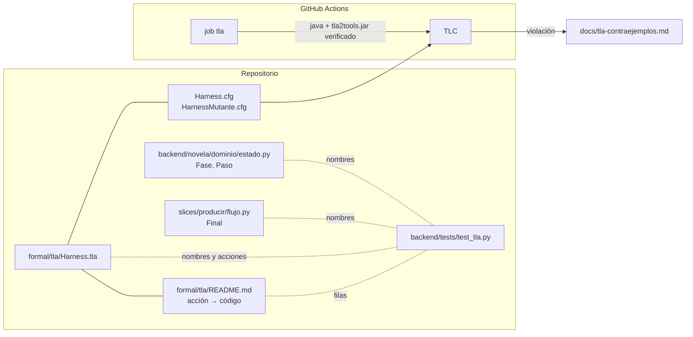

# 0013 — Especificar el flujo del harness en TLA+ y comprobarlo con TLC en CI

## 1. Resumen

Se escribe en TLA+ el flujo completo de una novela: configuración, planificación, bucle por capítulo con sus gates y reintentos, reanudación desde checkpoint, auditoría con exportación y regeneración por un cambio del lector. TLC comprueba en CI, sobre un modelo de 5 capítulos y 2 reintentos, tres garantías: nada se publica sin pasar todos los validadores, la reanudación no pierde ni duplica capítulos y toda generación termina. Lo usan los desarrolladores del harness, que ven en CI si un cambio del procedimiento o del CLI rompe una de esas garantías. Un README mapea cada acción del modelo al código que la implementa.

## 2. Contexto y problema

**Hoy la máquina del bucle se verifica con una enumeración en Python.** `backend/tests/test_bucle.py::test_maquina_del_bucle_y_sus_invariantes` recorre en anchura los estados de `SECUENCIA` con un solo contador `intento` (≤ 3) y comprueba cinco invariantes de orden. `docs/validators.md` § 4.10 descarta TLA+ con este argumento: «El espacio de estados son decenas, no millones […] hoy sería ceremonia». La condición para reabrirlo es que el bucle crezca con ramas condicionales o paralelismo. El assert de la línea 117 de `test_bucle.py` repite el argumento en su mensaje.

**La enumeración ya no cubre el flujo que existe.** Deja fuera cinco cosas que sí están en el repositorio:

- **Configuración y planificación.** `.claude/commands/novela-nueva.md` tiene su propio gate, el del `arquitecto`, con reintentos y una parada sin reintento cuando la causa contiene `misterio.md`.
- **El abanico de revisión.** Los tres revisores corren en paralelo, y el `editor-estilo` reescribe el capítulo (`docs/architecture.md` § 2.1; `docs/validators.md` § 5.15). Un fallo del segundo `validar` reintenta al `editor-estilo` y no al `escritor` (`.claude/commands/novela-continuar.md` paso 5).
- **Contadores de intentos.** Hay uno por gate (mecánico, revisión y delta), cada uno contado en `harness.log` con su propia regla (`novela-continuar.md` § Cuenta de intentos). La enumeración usa un solo contador.
- **La reanudación.** La tabla de `novela-continuar.md` § Punto de reanudación decide dónde se retoma a partir de `harness.log`, `estado/deltas/NN.json` y `capitulos/NN.md`. `docs/validators.md` § 4.12 admite que el procedimiento de reanudación nunca se ha ensayado cortando en cada frontera.
- **La parada del panel y el freno por falta de avance.** Los aplica `backend/novela/slices/producir/flujo.py::producir`. La auditoría y la exportación los aplica `.claude/commands/novela-auditar.md`.

**La regeneración por cambio del lector añade una rama más.** La spec 0007 (Propuesta, sin implementar: no existe `novela cambio` en `backend/novela/slices/`) introduce versiones y capítulos reaplicados byte a byte. También tiene una garantía nueva: la versión anterior se conserva intacta (ADR 0004).

**El cursor persistido no guarda la cuenta de intentos.** `Cursor` (`backend/novela/dominio/estado.py`) tiene `fase`, `ultimo_paso` e `intento` (1 a 3). Pero `apply.py::aplicar` conserva `intento` y `checkpoint/cmd.py` lo copia: ningún subcomando lo incrementa. La cuenta real sale de las líneas de `harness.log`, y `ultimo_paso` en `estado.db` solo toma `None`, `aplicar-delta` o `checkpoint`. El modelo tiene que mapear cada variable a su dato real, no al campo que parece más obvio.

**Se aborda ahora** porque la auditoría del entregable marca TLA-01 a TLA-06 como «falta» (`docs/auditoria-entregable.md` § TLA). DOC-02 pide además la decisión de integrar TLA+, y DOC-04 el diagrama de la máquina de estados.

**Restricciones del repositorio que condicionan el diseño.**

- La documentación de referencia describe lo que hay. Revertir una decisión cara va por ADR en `docs/adr/` (`AGENTS.md` § Proceso: modificar documentación).
- Ningún test llama a un modelo (`AGENTS.md` § Proceso: generar código).
- «Nunca añadir un proveedor de modelos, un gateway o un SDK de API de modelos» (`AGENTS.md` § Nunca). TLC no es ninguna de las tres cosas, pero tampoco puede entrar en el bucle de una novela: solo corre en desarrollo y en CI (petición del usuario).
- Hay que cambiar `AGENTS.md` y `CLAUDE.md` lo mínimo, porque se cargan en cada sesión (`AGENTS.md` § Nunca).

**Relación con otras specs.**

- **0001**: fijó el cursor, `aplicar-delta`, `checkpoint` y la custodia. El modelo los toma como transiciones.
- **0002** (aceptada, sin implementar): añade `novela gate`, que llevará la cuenta de intentos al CLI, y la auditoría de trayectoria, que contrasta cada sesión con la máquina de § 4.10 (`docs/validators.md` § 4.16). Esta spec no depende de ella. Cuando se implemente, el modelo y el README se actualizan (ver § 10).
- **0003**: fijó los procedimientos de `.claude/commands/`, que son la fuente de las transiciones del modelo.
- **0004**: añadió `novela producir`, con la parada «detener» del panel.
- **0007** (Propuesta): define `novela cambio`, `--siguiente` y `aplicar-delta --reaplicar`. El modelo representa esa rama según la spec, marcada en el README como no implementada (ver D7).
- **0008**: las líneas `validar-hook NN` no cuentan intentos. El modelo no las representa como gate.
- **0009**: `vp_schema` bloquea el `checkpoint`. El modelo lo incluye como validador (ver D4).
- **0012** (Propuesta): añade un gate Lean antes de `aplicar-delta` y reserva `docs/adr/0005`, por eso el ADR de esta spec es el 0006 (ver D16). Crea `formal/lean/`, y esta spec usa la carpeta hermana `formal/tla/`. Su gate no entra en el modelo mientras no exista (ver D4).

## 3. Objetivos y no objetivos

### 3.1 Objetivos

- **O-01** `formal/tla/Harness.tla` especifica en TLA+ el flujo configuración → planificación → escritura → validación → publicación, con reintentos por gate, caídas y reanudación desde checkpoint, parada del panel, auditoría, exportación y regeneración por cambio del lector.
- **O-02** El módulo define al menos cuatro invariantes de seguridad: publicar solo lo validado, reanudar sin duplicar ni perder capítulos, conservar la versión anterior e intentos por gate ≤ `MaxIntentos`. Define también una propiedad de liveness: toda generación acaba publicada o detenida.
- **O-03** TLC termina sin violaciones sobre `formal/tla/Harness.cfg` (5 capítulos, 2 reintentos por gate) en el job `tla` de `.github/workflows/ci.yml`. El mismo comando está documentado en `formal/tla/README.md`.
- **O-04** TLC encuentra una violación de `PublicaSoloValidado` en la configuración mutante `formal/tla/HarnessMutante.cfg`. Esto demuestra que la invariante no es vacía.
- **O-05** `formal/tla/README.md` mapea el 100 % de las acciones de `Next` y de las variables del modelo al fichero, función, sección del procedimiento o dato en disco que las implementa.
- **O-06** `backend/tests/test_tla.py` falla si los conjuntos `Fases`, `Pasos` y `Finales` del `.tla` difieren de los enums del código, o si una acción de `Next` no tiene fila en el README.
- **O-07** `docs/tla-contraejemplos.md` registra cada contraejemplo de TLC hallado durante el desarrollo, con el cambio que provocó y dónde (modelo o código). `docs/domain-knowledge.md` tiene el diagrama de la máquina de estados.
- **O-08** `docs/adr/0006-model-checking-con-tla.md` revierte la decisión de `docs/validators.md` § 4.10, y los documentos de referencia describen lo implementado en el mismo commit.

### 3.2 No objetivos

- Ejecutar TLC, Java o `tla2tools.jar` desde el CLI `novela`, la API, los hooks o cualquier procedimiento de `.claude/`. TLC nunca corre en el bucle de una novela.
- Verificar la prosa, el contenido de los informes de QA o la corrección de los gates por dentro. El modelo abstrae cada gate como «pasa» o «falla».
- Verificar que `.claude/commands/novela-continuar.md` sigue el modelo en ejecución. Eso sigue siendo la auditoría de trayectoria de la spec 0002 (`docs/validators.md` § 4.16) y un riesgo aceptado (§ 5.8).
- Modelar los niveles de degradación por cuota de `docs/architecture.md` § 9, las sondas ciegas, el gate Lean de la spec 0012 o `novela gate` de la spec 0002, que no existen en el código.
- Modelar la resolución humana de `intervencion.md` y el relanzamiento posterior. Para el modelo, la intervención es un estado final (ver D6).
- Modelar varios cambios simultáneos, cambios en cascada o volver a una versión anterior. ADR 0004 los deja fuera.
- Demostrar las propiedades para cualquier número de capítulos. TLC comprueba el modelo finito del `.cfg`, no hace una prueba general.
- Implementar la spec 0007. El modelo solo representa su diseño.
- Añadir TLC a `pytest` o al pre-commit.
- Cambiar `AGENTS.md`, `CLAUDE.md`, la API, el frontend, `backend/schemas/` o los modelos de `backend/novela/dominio/` (ver D18).
- Actualizar `docs/auditoria-entregable.md`, que es una foto fechada.

## 4. Usuarios y escenarios

| Actor | Relación con esta spec |
|---|---|
| Desarrollador del harness | Cambia el procedimiento, el CLI o el modelo, ejecuta TLC en local y lee los contraejemplos |
| CI (GitHub Actions) | Ejecuta TLC con la configuración del repo y con la mutante en cada push y pull request |
| Revisor de una spec o un PR | Usa el README para comprobar que una transición nueva del código tiene su acción en el modelo |
| Orquestador y agentes del bucle | No intervienen: el modelo no forma parte de la ejecución de una novela |

- Como desarrollador, quiero que TLC me dé una traza concreta cuando un cambio en `novela-continuar.md` permita publicar un capítulo sin volver a validar, para corregirlo antes de gastar cuota en una novela.
- Como revisor, quiero una tabla acción → código, para saber qué parte del modelo tiene que cambiar cuando cambia un paso del procedimiento.
- Como operador que reanuda tras una caída, quiero tener verificado que la reanudación no repite ni se salta un capítulo, para no confiar solo en un procedimiento que nunca se ha ensayado cortando en cada frontera.

## 5. Requisitos funcionales

**Especificación del flujo (TLA-01)**

| ID | Requisito (EARS) | Prioridad |
|----|------------------|-----------|
| RF-01 | El sistema debe incluir `formal/tla/Harness.tla`, un módulo `Harness` en TLA+ puro, sin PlusCal (ver D2). Extiende `Naturals`, `Sequences`, `FiniteSets` y `TLC`, declara las constantes `NumCapitulos`, `MaxIntentos`, `MaxCaidas`, `MaxCambios`, `Procesos` y `Mutante`, y define `Init`, `Next`, `vars` y `Spec == Init /\ [][Next]_vars /\ Equidad`. La variable `etapa` recorre `configuracion`, `planificacion`, `capitulos`, `auditoria`, `publicada` y `detenida`. | Must |
| RF-02 | El sistema debe definir en `Harness.tla` los conjuntos `Fases`, `Pasos` y `Finales`, cada uno en una sola definición de la forma `Nombre == {"a", "b", …}` con cadenas literales (ver D9). `Fases` es igual a `FASES` y `Pasos` a `PASOS`, ambos de `backend/novela/dominio/estado.py`. `Finales` es igual a los valores de `Final` de `backend/novela/slices/producir/flujo.py`. | Must |
| RF-03 | El sistema debe definir las acciones de configuración y planificación con estos nombres: `Nueva`, `Arquitecto`, `GateArquitecto` y `Trazador`. `GateArquitecto` tiene tres resultados: canon válido (sigue a `Trazador`), canon inválido reintentable (vuelve a `Arquitecto` y consume un intento del gate `arquitecto`) y causa `misterio.md` (va directo a `Intervencion`, sin reintento), según `.claude/commands/novela-nueva.md` paso 3. | Must |
| RF-04 | El sistema debe definir las acciones del bucle por capítulo con estos nombres: `Briefing`, `Escritor`, `Validar`, `Continuista`, `EditorEstilo`, `LectorSuspense`, `ValidarFinal`, `GateRevision`, `Cronista`, `AplicarDelta` y `Checkpoint`. Siguen el orden de `.claude/commands/novela-continuar.md` pasos 2 a 8: los tres briefings de revisión se generan antes de cualquier revisor, los tres revisores se intercalan en cualquier orden, `EditorEstilo` invalida la validación del capítulo y cada gate puede pasar o fallar (ver D4). | Must |
| RF-05 | Cuando un gate falle, el sistema debe reintentar según el procedimiento: un fallo de `Validar` vuelve a `Escritor`; uno de `ValidarFinal` vuelve a `EditorEstilo` con el mismo briefing; uno de `GateRevision` vuelve a `Escritor` y repite todos los gates desde `Validar`; uno de `AplicarDelta` vuelve a `Cronista`. Cada reintento consume un intento del contador de su gate (`arquitecto`, `mecanico`, `revision`, `delta`), y los contadores se reinician al empezar un capítulo (ver D3). | Must |
| RF-06 | Si un gate falla con `MaxIntentos` intentos consumidos, o si falla la custodia de `AplicarDelta`, un `Briefing` o un `Checkpoint` (incluido `vp_schema`), entonces el sistema debe pasar a `Intervencion`: `etapa = "detenida"` y `motivo = "intervencion"`, sin reintento (ver D3, D4). | Must |
| RF-07 | El sistema debe definir la acción `Caida`, habilitada en cualquier estado no final mientras `caidas < MaxCaidas`. Pierde el estado volátil de la sesión y conserva el persistente (ficheros, `harness.log`, `estado.db`, checkpoints). También debe definir la acción `Reanudar`, que decide el paso de retoma con la tabla literal de `novela-continuar.md` § Punto de reanudación y el capítulo como `capitulo` de `checkpoints/latest.json` + 1 (ver D5). | Must |
| RF-08 | El sistema debe definir `Detener` (el panel pidió parar, comprobado antes de empezar cada capítulo, `motivo = "panel"`), `SinAvance` (una sesión termina sin avanzar `checkpoints/latest.json`, `motivo = "sin_avance"`) y `FalloCLI` (código 2 o 3, o CLI roto según la regla de lectura 1, `motivo = "cli"`). Las tres llevan a `etapa = "detenida"`, como en `flujo.py::producir` y `novela-continuar.md` § Códigos de salida (ver D6). | Should |
| RF-09 | El sistema debe definir `Auditar` y `Exportar`. `Auditar` solo está habilitada con los `NumCapitulos` capítulos cerrados. Si pasa, habilita `Exportar`, que deja `etapa = "publicada"`. Si falla, deja `etapa = "detenida"` y `motivo = "auditoria"`, según `.claude/commands/novela-auditar.md` (ver D1). | Must |
| RF-10 | El sistema debe definir `Cambio`, habilitada solo con `etapa = "publicada"` y `cambios < MaxCambios`. Guarda una instantánea de la versión vigente en `versiones[version]`, elige un subconjunto no vacío de capítulos afectados y vuelve a `etapa = "capitulos"` con `version + 1` y sin checkpoints. También debe definir `Reaplicar`: para un capítulo no afectado, copia su contenido de la instantánea y cierra el capítulo sin agentes. Si falla, lleva a `Intervencion`. Los capítulos afectados pasan por el bucle normal, según la spec 0007 RF-19, RF-24, RF-25, RF-27 y RF-34 (ver D7). | Must |
| RF-11 | Donde `Procesos` tenga más de un elemento, el sistema debe definir `TomarLock` y `SoltarLock`. Un proceso que intenta tomar un lock ocupado sale con 3 sin cambiar nada más, y solo el poseedor del lock ejecuta acciones que escriben, según `backend/novela/plataforma/lock.py` y el invariante 8 de `AGENTS.md` (ver D8). | Should |
| RF-12 | El sistema debe definir la acción `Terminado`, habilitada solo en `etapa ∈ {"publicada", "detenida"}` y con todas las variables sin cambios, para que los estados finales no se confundan con un bloqueo y TLC compruebe bloqueos sin la opción `-deadlock` (ver D6). | Must |

**Invariantes de seguridad (TLA-02)**

| ID | Requisito (EARS) | Prioridad |
|----|------------------|-----------|
| RF-13 | El sistema debe definir la invariante `PublicaSoloValidado`. Todo capítulo cerrado por `Checkpoint` o por `Reaplicar` tiene, sobre su contenido vigente, el último `Validar` o `ValidarFinal` aprobado después de la última escritura, el gate de revisión aprobado y el delta aplicado. Si es reaplicado, su contenido es idéntico al de la instantánea, donde cumplía lo mismo. Además, `etapa = "publicada"` implica auditoría aprobada y `NumCapitulos` capítulos cerrados (ver D1, D4). | Must |
| RF-14 | El sistema debe definir la invariante `ReanudacionSinDuplicarNiPerder`. En la versión vigente, la secuencia de capítulos cerrados es exactamente `<<1, 2, …, k>>`, sin repeticiones ni huecos, incluso después de cualquier combinación de `Caida` y `Reanudar`. El capítulo en curso es `k + 1`. `AplicarDelta` solo se ha aplicado sobre `k + 1` o sobre capítulos cerrados de la versión vigente. | Must |
| RF-15 | El sistema debe definir la invariante `VersionAnteriorIntacta`: para toda versión `v < version`, `versiones[v]` es igual al valor que registró `Cambio` en una variable fantasma al crearla. También debe definir `ReaplicadosIdenticos`: el contenido de todo capítulo reaplicado es igual al de la instantánea de la versión anterior (ver D7). | Must |
| RF-16 | El sistema debe definir la invariante `IntentosAcotados`: para cada gate `g`, `1 <= intentos[g] <= MaxIntentos`, y ningún estado alcanzable tiene un intento de valor `MaxIntentos + 1` (ver D3). | Must |
| RF-17 | El sistema debe definir las invariantes `TypeOK`, `OrdenDelBucle` y `UnSoloProceso`. `OrdenDelBucle` cubre las reglas de orden de `docs/validators.md` § 4.10: `Checkpoint` solo tras `AplicarDelta`, `AplicarDelta` solo con `ValidarFinal` aprobado sobre la versión actual y ningún capítulo `N + 1` sin checkpoint de `N`. `UnSoloProceso` establece que como mucho un proceso posee el lock (ver D8). | Should |

**Liveness (TLA-03)**

| ID | Requisito (EARS) | Prioridad |
|----|------------------|-----------|
| RF-18 | El sistema debe definir la propiedad temporal `Termina == <>[](etapa \in {"publicada", "detenida"})` y la fórmula `Equidad`: equidad débil (`WF_vars`) sobre cada acción del sistema y sin equidad sobre `Caida`, `FalloCLI`, `Detener`, `SinAvance` ni `Cambio`. TLC debe comprobar `Termina` sin violaciones con `Harness.cfg` (ver D6). | Must |

**TLC y configuración (TLA-04)**

| ID | Requisito (EARS) | Prioridad |
|----|------------------|-----------|
| RF-19 | El sistema debe incluir `formal/tla/Harness.cfg` con `SPECIFICATION Spec` y estas constantes: `NumCapitulos = 5`, `MaxIntentos = 3` (2 reintentos), `MaxCaidas = 2`, `MaxCambios = 1`, `Procesos = {p1, p2}` como valores de modelo y `Mutante = FALSE`. Incluye `INVARIANTS` con las siete invariantes de RF-13 a RF-17 y `PROPERTIES Termina` (ver D12). | Must |
| RF-20 | El sistema debe incluir `formal/tla/HarnessMutante.cfg`, igual que `Harness.cfg` salvo `Mutante = TRUE`. Con `Mutante = TRUE`, `ValidarFinal` se omite tras `EditorEstilo`, y TLC debe informar una violación de `PublicaSoloValidado` (ver D13). | Should |
| RF-21 | El sistema debe incluir `formal/tla/tla2tools.version` con dos líneas, `version=<x.y.z>` y `sha256=<hex>`, de la versión estable de `tla2tools.jar` fijada al implementar. El jar no se versiona: `formal/tla/*.jar`, `formal/tla/states/` y `formal/tla/*_TTrace_*.tla` van al `.gitignore` (ver D11). | Must |
| RF-22 | El sistema debe añadir a `.github/workflows/ci.yml` el job `tla` en `ubuntu-latest`, con `timeout-minutes: 15`, en este orden. Instala Java 17 con `actions/setup-java@v4` (`distribution: temurin`). Descarga la versión de `tla2tools.version` y verifica su sha256, y falla si no coincide. Ejecuta TLC con `Harness.cfg` y falla con cualquier código de salida distinto de 0. Ejecuta TLC con `HarnessMutante.cfg` y falla si TLC sale con 0 o si su salida no nombra `PublicaSoloValidado` (ver D10, D11, D13). | Must |
| RF-23 | El sistema debe usar en CI y en el README el mismo comando, ejecutado desde `formal/tla/`: `java -XX:+UseParallelGC -cp tla2tools.jar tlc2.TLC -config <cfg> -workers auto -coverage 1 Harness.tla` (ver D10). | Must |

**README, contraejemplos, diagrama y verificación (TLA-05, TLA-06)**

| ID | Requisito (EARS) | Prioridad |
|----|------------------|-----------|
| RF-24 | El sistema debe incluir `formal/tla/README.md` con seis secciones: «Qué modela», «Instalación» (Java ≥ 11 y cómo obtener y verificar el jar), «Ejecutar TLC» (el comando de RF-23 para las dos configuraciones y cómo leer un contraejemplo), «Acciones», «Variables» y «Límites». «Acciones» es una tabla con una fila por acción de `Next` y la tabla de § 8.4. «Variables» es una tabla con el dato real de cada variable, según § 8.3. «Límites» explica qué no modela, con las filas de 0007 marcadas «spec 0007, sin implementar» (ver D7). | Must |
| RF-25 | El sistema debe incluir `backend/tests/test_tla.py`, sin Java y sin llamadas a modelo. Comprueba tres cosas: que los conjuntos de RF-02 son iguales a los enums, que cada acción que aparece como disyunto de `Next` tiene una fila en la tabla «Acciones» del README, y que ningún fichero bajo `.claude/`, `backend/novela/` ni `backend/api/` contiene `tla2tools`, `tlc2` ni `Harness.tla` (ver D9, D10). | Must |
| RF-26 | El sistema debe incluir `docs/tla-contraejemplos.md` con una entrada por contraejemplo hallado durante el desarrollo. Cada entrada tiene: fecha, configuración, propiedad violada, traza resumida (estado inicial, acciones y estado que viola), causa y cambio provocado, este último con su ámbito (`modelo`, `código`, `procedimiento` o `documentación`), fichero y sha del commit. Incluye siempre el contraejemplo de `HarnessMutante.cfg`, marcado como control negativo. Si ningún contraejemplo obligó a cambiar código, lo dice de forma explícita (ver D14). | Must |
| RF-27 | El sistema debe añadir a `docs/domain-knowledge.md` la sección «7. Máquina de estados del flujo (TLA+)». Contiene un diagrama Mermaid `stateDiagram-v2` con las etapas, el bucle por capítulo, los reintentos, `Caida`/`Reanudar`, `Cambio`/`Reaplicar` y los estados finales, con los mismos nombres de acción que `Harness.tla` (ver D15). | Must |
| RF-28 | El sistema debe incluir `docs/adr/0006-model-checking-con-tla.md`, con el formato de `docs/adr/0004-versiones-de-la-novela.md` (frontmatter `adr`, `titulo`, `estado: aceptada`, `fecha`, `decide`, `specs: [0013]` y las secciones Contexto, Decisión, Alternativas descartadas, Consecuencias y Cuándo reabrirla). Revierte el «hoy sería ceremonia» de `docs/validators.md` § 4.10 (ver D16). | Must |
| RF-29 | El sistema debe actualizar, en el mismo commit que el modelo, estos documentos: `docs/validators.md` § 2 (fila 19 y párrafo de estado), § 4.10 (TLA+ y TLC como método activo, qué verifica, qué no y dónde se ejecuta), § 5.8 y § 6 (fila «CI del harness» con el job `tla`); y `docs/architecture.md` § 3.1 (`formal/tla/` en el árbol). En `backend/tests/test_bucle.py` cambia el mensaje del assert de la línea 117 y el docstring para remitir a `formal/tla/Harness.tla` (ver D17, D18). | Must |

## 6. Requisitos no funcionales

| ID | Categoría | Requisito | Métrica | Umbral |
|----|-----------|-----------|---------|--------|
| RNF-01 | Rendimiento | TLC cabe en CI | Tiempo de pared de TLC con `Harness.cfg` en `ubuntu-latest` | ≤ 10 min |
| RNF-02 | Rendimiento | El job no se cuelga | `timeout-minutes` del job `tla` | 15 |
| RNF-03 | Rendimiento | El modelo sigue siendo pequeño | Estados distintos que informa TLC con `Harness.cfg` | ≤ 5 000 000 |
| RNF-04 | Seguridad | Solo se ejecuta el jar esperado | Ejecuciones de TLC en CI sin verificar antes el sha256 de `tla2tools.version` | 0 |
| RNF-05 | Aislamiento | TLC nunca entra en el bucle | Apariciones de `tla2tools`, `tlc2` o `Harness.tla` bajo `.claude/`, `backend/novela/` y `backend/api/` | 0 |
| RNF-06 | Compatibilidad | La suite del backend no necesita Java | Tests de `uv run pytest` que fallan sin `java` en el PATH | 0 |
| RNF-07 | Cobertura del modelo | Ninguna acción muerta | Acciones de `Next` con 0 estados distintos generados en la salida de `-coverage 1` con `Harness.cfg` | 0 |
| RNF-08 | Trazabilidad | Mapeo completo | Acciones de `Next` sin fila en «Acciones», y variables del módulo sin fila en «Variables», en `formal/tla/README.md` | 0 |
| RNF-09 | Observabilidad | Resultado auditable | Ejecuciones del job `tla` cuyo log no muestra los estados generados, los distintos y la profundidad | 0 |

## 7. Criterios de aceptación

### CA-01 (cubre RF-01)
- **Dado** `formal/tla/Harness.tla`
- **Cuando** se ejecuta TLC con `Harness.cfg` (job `tla`)
- **Entonces** el módulo se analiza sin errores de sintaxis, `grep -c "^\(\*" Harness.tla` no encuentra bloques `--algorithm`, y el módulo declara las seis constantes y las seis etapas de RF-01

### CA-02 (cubre RF-02)
- **Dado** el `.tla` y los enums de `backend/novela/dominio/estado.py` y `backend/novela/slices/producir/flujo.py`
- **Cuando** se ejecuta `backend/tests/test_tla.py::test_nombres_coinciden_con_el_dominio`
- **Entonces** `set(Fases) == set(FASES)`, `set(Pasos) == set(PASOS)` y `set(Finales) == set(get_args(Final))`. Si se añade `"publicado"` a `Pasos` en una copia temporal del `.tla`, el test falla y nombra la diferencia (se ve en rojo antes de dar el verde)

### CA-03 (cubre RF-03)
- **Dado** `Harness.cfg`
- **Cuando** TLC explora el modelo con `-coverage 1`
- **Entonces** `Nueva`, `Arquitecto`, `GateArquitecto` y `Trazador` tienen más de 0 estados distintos, y hay estados alcanzables con `intentos["arquitecto"] = 3` y con `motivo = "intervencion"` tras un `GateArquitecto` con causa `misterio.md` e `intentos["arquitecto"] = 1`

### CA-04 (cubre RF-04)
- **Dado** `Harness.cfg`
- **Cuando** TLC explora el modelo con `-coverage 1`
- **Entonces** las once acciones del bucle tienen más de 0 estados distintos, y la invariante `OrdenDelBucle` no se viola en ninguna intercalación de `Continuista`, `EditorEstilo` y `LectorSuspense`

### CA-05 (cubre RF-05)
- **Dada** la invariante auxiliar temporal `~(intentos["mecanico"] = 2 /\ paso = "editor-estilo")`, añadida solo para esta comprobación
- **Cuando** TLC la comprueba con `Harness.cfg`
- **Entonces** TLC da un contraejemplo en el que `ValidarFinal` falla y el paso siguiente es `EditorEstilo` y no `Escritor`. Con la invariante retirada, el modelo vuelve a pasar. El resultado se anota en `docs/tla-contraejemplos.md` como comprobación de alcanzabilidad

### CA-06 (cubre RF-06)
- **Dado** un estado con `intentos["delta"] = 3`
- **Cuando** `AplicarDelta` falla
- **Entonces** el siguiente estado tiene `etapa = "detenida"` y `motivo = "intervencion"`, y ninguna acción salvo `Terminado` está habilitada. TLC lo comprueba en `IntentosAcotados` y `Termina` con `Harness.cfg`

### CA-07 (cubre RF-07)
- **Dado** `Harness.cfg` con `MaxCaidas = 2`
- **Cuando** TLC explora todas las combinaciones de `Caida` en cualquier frontera de paso seguidas de `Reanudar`
- **Entonces** `ReanudacionSinDuplicarNiPerder` y `PublicaSoloValidado` no se violan, y `Caida` y `Reanudar` tienen más de 0 estados distintos en la cobertura

### CA-08 (cubre RF-08)
- **Dado** `Harness.cfg`
- **Cuando** TLC explora el modelo
- **Entonces** `Detener`, `SinAvance` y `FalloCLI` alcanzan `etapa = "detenida"` con `motivo` `panel`, `sin_avance` y `cli` respectivamente, y la cobertura de cada una es mayor que 0

### CA-09 (cubre RF-09)
- **Dado** `Harness.cfg`
- **Cuando** TLC explora el modelo
- **Entonces** `Auditar` nunca está habilitada con menos de 5 capítulos cerrados (`PublicaSoloValidado`), y `Exportar` solo sigue a un `Auditar` aprobado

### CA-10 (cubre RF-10)
- **Dado** `Harness.cfg` con `MaxCambios = 1`
- **Cuando** TLC explora `Cambio` sobre cada subconjunto no vacío de `1..5` como capítulos afectados
- **Entonces** los capítulos no afectados se cierran con `Reaplicar` y los afectados con el bucle normal, `VersionAnteriorIntacta` y `ReaplicadosIdenticos` no se violan, y `Cambio` no está habilitada con `cambios = 1`

### CA-11 (cubre RF-11)
- **Dado** `Harness.cfg` con `Procesos = {p1, p2}`
- **Cuando** TLC explora el modelo
- **Entonces** `UnSoloProceso` no se viola, y hay estados en los que `p2` intenta `TomarLock` con el lock de `p1` y el resto de variables no cambia

### CA-12 (cubre RF-12)
- **Dado** el comando de RF-23, sin la opción `-deadlock`
- **Cuando** TLC termina con `Harness.cfg`
- **Entonces** no informa `Deadlock reached`, y `Terminado` solo está habilitada en `publicada` o `detenida`

### CA-13 (cubre RF-13)
- **Dado** `Harness.cfg` y `HarnessMutante.cfg`
- **Cuando** se ejecuta TLC con cada uno
- **Entonces** con `Harness.cfg` `PublicaSoloValidado` no se viola, y con `HarnessMutante.cfg` TLC sale con un código distinto de 0 y una traza que acaba en `Checkpoint` de un capítulo reescrito por `EditorEstilo` sin `ValidarFinal` posterior

### CA-14 (cubre RF-14)
- **Dado** `Harness.cfg`
- **Cuando** TLC explora el modelo, con caídas en todas las fronteras de paso
- **Entonces** `ReanudacionSinDuplicarNiPerder` no se viola. Durante el desarrollo, si se sustituye en una copia la fila «paso 8» de la tabla de reanudación por «paso 2», TLC informa la violación, y se anota en `docs/tla-contraejemplos.md`

### CA-15 (cubre RF-15)
- **Dado** `Harness.cfg`
- **Cuando** TLC explora `Cambio` seguido de la regeneración completa
- **Entonces** `VersionAnteriorIntacta` y `ReaplicadosIdenticos` no se violan. Si en una copia `Reaplicar` también escribe en `versiones`, TLC informa la violación de `VersionAnteriorIntacta`

### CA-16 (cubre RF-16)
- **Dado** `Harness.cfg` con `MaxIntentos = 3`
- **Cuando** TLC explora el modelo
- **Entonces** `IntentosAcotados` no se viola para ninguno de los cuatro gates, y hay estados alcanzables con `intentos[g] = 3` para cada `g`

### CA-17 (cubre RF-17)
- **Dado** `Harness.cfg`
- **Cuando** TLC explora el modelo
- **Entonces** `TypeOK`, `OrdenDelBucle` y `UnSoloProceso` no se violan

### CA-18 (cubre RF-18)
- **Dado** `Harness.cfg` con `PROPERTIES Termina`
- **Cuando** TLC termina la comprobación de liveness
- **Entonces** no informa `Temporal properties were violated`. Si en una copia se retira `WF_vars` de `AplicarDelta`, TLC informa una violación de `Termina` con un bucle de estados que se repite, y se anota en `docs/tla-contraejemplos.md`

### CA-19 (cubre RF-19)
- **Dado** `formal/tla/Harness.cfg`
- **Cuando** lo lee `test_tla.py::test_cfg_del_repo`
- **Entonces** contiene `SPECIFICATION Spec`, las constantes con los valores de RF-19, las siete invariantes y `PROPERTIES Termina`

### CA-20 (cubre RF-20)
- **Dado** `formal/tla/HarnessMutante.cfg`
- **Cuando** lo lee `test_tla.py::test_cfg_mutante` y lo ejecuta el job `tla`
- **Entonces** difiere de `Harness.cfg` solo en `Mutante = TRUE`, y TLC sale con un código distinto de 0 nombrando `PublicaSoloValidado`

### CA-21 (cubre RF-21)
- **Dado** el repositorio tras ejecutar TLC en local
- **Cuando** se ejecutan `git check-ignore formal/tla/tla2tools.jar`, `git check-ignore formal/tla/states/` y `git check-ignore formal/tla/Harness_TTrace_1.tla`
- **Entonces** los tres salen con 0, y `formal/tla/tla2tools.version` tiene exactamente las líneas `version=` y `sha256=` con un hex de 64 caracteres

### CA-22 (cubre RF-22)
- **Dado** `.github/workflows/ci.yml`
- **Cuando** se lanza el workflow en un push
- **Entonces** el job `tla` verifica el sha256 antes de ejecutar TLC y pasa. Un push de prueba que cambia un byte del sha256 en `tla2tools.version` hace fallar el job antes de TLC. Otro que invierte `Mutante` en `HarnessMutante.cfg` también lo hace fallar

### CA-23 (cubre RF-23)
- **Dados** `formal/tla/README.md` y el job `tla`
- **Cuando** `test_tla.py::test_comando_documentado` compara el comando del README con los pasos del job en `ci.yml`
- **Entonces** los argumentos de `tlc2.TLC` son idénticos en los dos, salvo el nombre del `.cfg`

### CA-24 (cubre RF-24)
- **Dado** `formal/tla/README.md`
- **Cuando** lo lee `test_tla.py::test_readme`
- **Entonces** tiene las seis secciones de RF-24, la tabla «Variables» tiene una fila por cada variable de `VARIABLES` en el `.tla`, y las filas de `Cambio` y `Reaplicar` dicen «spec 0007, sin implementar» mientras `backend/novela/slices/` no tenga `cambio/`

### CA-25 (cubre RF-25)
- **Dado** el repositorio
- **Cuando** se ejecuta `uv run pytest tests/test_tla.py` sin `java` en el PATH
- **Entonces** pasa, y falla, nombrando la acción o el fichero, en cuatro casos: si se borra del README la fila de `Checkpoint`, si se añade a `Next` una acción `Fantasma` sin fila, si se escribe `tlc2` en un fichero temporal bajo `backend/novela/` y si se cambia un valor de `PASOS`

### CA-26 (cubre RF-26)
- **Dado** `docs/tla-contraejemplos.md`
- **Cuando** lo lee `test_tla.py::test_registro_de_contraejemplos` y lo inspecciona la revisión
- **Entonces** cada entrada tiene los siete campos de RF-26, hay una entrada de `HarnessMutante.cfg` marcada como control negativo, cada sha citado existe en `git log` y cada ámbito es uno de los cuatro de RF-26

### CA-27 (cubre RF-27)
- **Dado** `docs/domain-knowledge.md`
- **Cuando** lo lee `test_tla.py::test_diagrama`
- **Entonces** existe la sección 7 con un bloque `mermaid` que empieza por `stateDiagram-v2`, y cada acción de `Next` salvo `Terminado`, `TomarLock` y `SoltarLock` aparece como etiqueta de transición

### CA-28 (cubre RF-28)
- **Dado** `docs/adr/0006-model-checking-con-tla.md`
- **Cuando** lo revisa la revisión de la spec
- **Entonces** tiene el frontmatter y las cinco secciones de RF-28, con `estado: aceptada` y `specs: [0013]`, y su Contexto cita el argumento de `docs/validators.md` § 4.10 que revierte

### CA-29 (cubre RF-29)
- **Dado** el commit que cierra la implementación
- **Cuando** se revisan los documentos de RF-29
- **Entonces** § 4.10 de `docs/validators.md` ya no dice «hoy sería ceremonia», describe `formal/tla/` y el job `tla` tal como están y nombra lo que no verifica. La fila «CI del harness» de § 6 incluye TLC, `architecture.md` § 3.1 muestra `formal/tla/`, y el mensaje del assert de `test_bucle.py` ya no argumenta contra TLA+, con la suite en verde

## 8. Diseño propuesto

### 8.1 Visión general

El modelo vive en el repositorio, fuera de `backend/` y de `.claude/`, y solo lo ejecutan TLC en CI y el desarrollador en su máquina. No hay ninguna dependencia de ejecución entre el modelo y el harness. Solo hay tres contratos de coherencia, que comprueba `test_tla.py`: los nombres de fases, pasos y finales, la tabla del README y la ausencia de TLC en el bucle.



El diagrama de la máquina de estados que pide RF-27 va en `docs/domain-knowledge.md` § 7, y es el que describe § 8.5.

### 8.2 Componentes afectados

**Nuevos**

- `formal/tla/Harness.tla`: el módulo (RF-01 a RF-18).
- `formal/tla/Harness.cfg` y `formal/tla/HarnessMutante.cfg` (RF-19, RF-20).
- `formal/tla/tla2tools.version` (RF-21).
- `formal/tla/README.md` (RF-24).
- `backend/tests/test_tla.py` (RF-25 y las comprobaciones de CA-19, CA-20, CA-23, CA-24, CA-26 y CA-27). Va en un fichero propio y no en `backend/tests/test_contratos.py`, que hoy está en conflicto de fusión.
- `docs/tla-contraejemplos.md` (RF-26).
- `docs/adr/0006-model-checking-con-tla.md` (RF-28).

**Modificados**

- `.github/workflows/ci.yml`: job `tla` (RF-22).
- `.gitignore`: `formal/tla/*.jar`, `formal/tla/states/` y `formal/tla/*_TTrace_*.tla` (RF-21).
- `docs/domain-knowledge.md`: § 7 (RF-27).
- `docs/validators.md` § 2, § 4.10, § 5.8 y § 6, y `docs/architecture.md` § 3.1 (RF-29).
- `backend/tests/test_bucle.py`: mensaje del assert de la línea 117 y docstring del módulo (RF-29, D17).

**Sin cambios**: `backend/novela/`, `backend/api/`, `backend/schemas/`, `.claude/`, `frontend/`, `AGENTS.md` y `CLAUDE.md`.

### 8.3 Modelo de datos

No hay cambios en `estado.db`, en los esquemas ni en los modelos Pydantic. Las variables del módulo TLA+ y su dato real son estas. El implementador puede añadir variables auxiliares si las documenta en la tabla «Variables» del README (RNF-08).

| Variable TLA+ | Tipo en el modelo | Dato real que representa |
|---|---|---|
| `etapa` | `{"configuracion", "planificacion", "capitulos", "auditoria", "publicada", "detenida"}` | Paso de `novela producir` (`flujo.py::producir`, `p.informar`) y estado de `novelas/.lanzador/<slug>.json` |
| `motivo` | `{"ninguno", "intervencion", "cli", "auditoria", "panel", "sin_avance"}` | Detalle del `Lanzamiento` y existencia de `runs/<run_id>/intervencion.md` |
| `cap` | `1..NumCapitulos` | `capitulo` de `checkpoints/latest.json` + 1 (`novela-continuar.md` § Situación) |
| `fase` | `Fases` | `Cursor.fase` en `estado.db`, derivada de `paso` como `FASE_DE` en `test_bucle.py` |
| `paso` | `Pasos ∪ {"ninguno"}` | Último paso confirmado en disco del capítulo en curso: líneas de `harness.log` y ficheros de salida. En `estado.db`, `Cursor.ultimo_paso` solo registra `aplicar-delta` y `checkpoint` |
| `intentos` | `[{"arquitecto", "mecanico", "revision", "delta"} -> 1..MaxIntentos]` | Recuento de líneas de `harness.log` según `novela-continuar.md` § Cuenta de intentos y `novela-nueva.md` paso 3. No es `Cursor.intento`, que hoy nadie incrementa |
| `validado` | `BOOLEAN` | La última línea `validar NN` del log es `-> 0` y ninguna escritura de `capitulos/NN.md` la sigue |
| `revisado` | `BOOLEAN` | `veredicto` aprobado en `qa/NN-continuidad.json` y `qa/NN-suspense.json` |
| `delta` | `{"ninguno", "escrito", "aplicado"}` | Existencia de `estado/deltas/NN.json` y línea `aplicar-delta NN -> 0` |
| `cerrados` | `Seq(1..NumCapitulos)` | Historia fantasma de checkpoints de la versión vigente: `checkpoints/NN.json` y `capitulos_sha256` |
| `contenido` | `[1..NumCapitulos -> Tokens ∪ {Nada}]` | sha256 de `capitulos/NN.md`, abstraído a un token por escritura |
| `sesion` y `caidas` | `{"viva", "caida"}` y `0..MaxCaidas` | Sesión de `claude -p` en curso; no persiste |
| `version`, `cambios`, `afectados` | `1..MaxCambios+1`, `0..MaxCambios`, `SUBSET (1..NumCapitulos)` | `meta.version` de `estado.db`, `cambios/cam-NNN.json` y capítulos a regenerar (spec 0007 RF-13, RF-16) |
| `versiones` y `versionesFantasma` | `[1..MaxCambios -> Instantanea]` | `versiones/vN/` y los sha256 de `version.json` (spec 0007 RF-17); la fantasma solo existe para la invariante |
| `auditada` | `{"no", "aprobada", "rechazada"}` | Código de salida de `novela auditar` |
| `lock` | `Procesos ∪ {"libre"}` | `estado/state.lock` (`plataforma/lock.py`) |

### 8.4 Interfaces y contratos

**Comando de TLC** (RF-23), desde `formal/tla/`:

```
java -XX:+UseParallelGC -cp tla2tools.jar tlc2.TLC -config Harness.cfg -workers auto -coverage 1 Harness.tla
java -XX:+UseParallelGC -cp tla2tools.jar tlc2.TLC -config HarnessMutante.cfg -workers auto -coverage 1 Harness.tla
```

El primero debe salir con 0. El segundo, con un código distinto de 0 y `PublicaSoloValidado` en la salida.

**`Harness.cfg`** (RF-19):

```
SPECIFICATION Spec
CONSTANTS
  NumCapitulos = 5
  MaxIntentos = 3
  MaxCaidas = 2
  MaxCambios = 1
  Procesos = {p1, p2}
  Mutante = FALSE
INVARIANTS
  TypeOK
  PublicaSoloValidado
  ReanudacionSinDuplicarNiPerder
  VersionAnteriorIntacta
  ReaplicadosIdenticos
  IntentosAcotados
  OrdenDelBucle
  UnSoloProceso
PROPERTIES
  Termina
```

`TypeOK` se suma a las siete invariantes de RF-13 a RF-17 porque RF-17 lo nombra.

**Formato de los conjuntos que lee el test** (RF-02). Una definición por conjunto, en una sola línea o en varias, siempre entre `Nombre ==` y la `}` que la cierra, solo con cadenas entre comillas dobles:

```tla
Fases   == {"escritura", "revision", "registro", "cerrado"}
Pasos   == {"briefing", "escritor", "validar", "continuista", "editor-estilo",
            "lector-suspense", "cronista", "aplicar-delta", "checkpoint"}
Finales == {"terminado", "fallido", "detenido"}
```

Correspondencia de estados finales: `publicada` → `terminado`; `detenida` con `motivo` `intervencion`, `cli`, `auditoria` o `sin_avance` → `fallido`; `detenida` con `motivo = "panel"` → `detenido`.

**Tabla acción → código** (contenido mínimo de «Acciones» en el README, RF-24):

| Acción | Implementación | Efecto que representa |
|---|---|---|
| `Nueva` | `backend/novela/slices/nueva/cmd.py` | `config.yaml`, `estado.db` y cursor `(1, escritura, None, 1)` |
| `Arquitecto` | `.claude/commands/novela-nueva.md` paso 2 | `canon/*` y `canon/misterio.borrador.md` |
| `GateArquitecto` | `novela briefing <slug> 1 trazador` (`slices/briefing/cmd.py`), `novela-nueva.md` paso 3 | Línea `briefing 01 trazador -> error · WorkspaceInvalido`, o misterio colocado |
| `Trazador` | `novela-nueva.md` paso 3 | `plan/escaleta.md` y `plan/capitulos/NN.md` |
| `Briefing` | `slices/briefing/cmd.py`; `novela-continuar.md` pasos 2, 4 y 7 | `runs/<run_id>/briefings/NN-<agente>.md` y línea `briefing NN <agente> -> 0` |
| `Escritor` | `novela-continuar.md` paso 2 | `capitulos/NN.md` |
| `Validar` | `slices/validacion/cmd.py`; paso 3 | `qa/NN-validacion.json` y línea `validar NN -> 0\|1` |
| `Continuista` | paso 4 | `qa/NN-continuidad.json` |
| `EditorEstilo` | paso 4 | `capitulos/NN.md` reescrito y `qa/NN-estilo.json` |
| `LectorSuspense` | paso 4 | `qa/NN-suspense.json` |
| `ValidarFinal` | `slices/validacion/cmd.py`; paso 5 | Igual que `Validar`, sobre el capítulo reescrito |
| `GateRevision` | paso 6 | Lectura de `veredicto`; ilegible cuenta como rechazo (regla de lectura 2) |
| `Cronista` | paso 7 | `estado/deltas/NN.json` |
| `AplicarDelta` | `slices/delta/cmd.py` y `apply.py::aplicar`; paso 7 | `estado.db`, cursor `(N, registro, aplicar-delta)` y línea `aplicar-delta NN -> 0\|1` |
| `Checkpoint` | `slices/checkpoint/cmd.py::checkpoint`; paso 8 | `checkpoints/NN.json`, `latest.json` y cursor `(N, cerrado, checkpoint)`; con `vp_schema` rechazado, 1 sin checkpoint |
| `Intervencion` | `novela-continuar.md` § Cuenta de intentos; `novela-nueva.md` paso 3 | `runs/<run_id>/intervencion.md` |
| `Caida` | Entorno: fin de la sesión de `claude -p` | Pérdida del estado de la sesión |
| `Reanudar` | `novela-continuar.md` § Situación y § Punto de reanudación; `flujo.py::producir` | Lectura de `latest.json`, `manifest.json` y `harness.log` |
| `Detener` | `flujo.py::producir` (`p.detener`) | `novelas/.lanzador/<slug>.detener` |
| `SinAvance` | `flujo.py::producir` (`_latest(ws) == antes`); bucle de `AGENTS.md` § Proceso: ejecución | Parada sin reintento |
| `FalloCLI` | `novela-continuar.md` § Códigos de salida (2, 3) y regla de lectura 1 | Parada sin `intervencion.md` |
| `Auditar` | `slices/auditoria/cmd.py`; `novela-auditar.md` paso 1 | Código de `novela auditar` |
| `Exportar` | `slices/export/cmd.py`; `novela-auditar.md` paso 2 | `export/` |
| `Cambio` | spec 0007 RF-09, RF-17 a RF-19 (sin implementar) | `versiones/vN/`, `cambios/cam-NNN.json` y base vacía |
| `Reaplicar` | spec 0007 RF-24, RF-25, RF-27 y RF-34 (sin implementar) | `aplicar-delta --reaplicar` + `checkpoint` sin agentes |
| `TomarLock`, `SoltarLock` | `plataforma/lock.py` (`ws.bloquear()`) | `estado/state.lock`; salida 3 si está ocupado |
| `Terminado` | Ninguna: paso tartamudo | Estado final |

### 8.5 Flujo principal

**Ciclo de desarrollo (caso feliz):**

1. El desarrollador cambia una transición en `.claude/commands/novela-continuar.md` o en el CLI.
2. Actualiza la acción en `Harness.tla` y su fila en `formal/tla/README.md`.
3. Ejecuta en local `uv run pytest tests/test_tla.py` y el comando de RF-23 con `Harness.cfg`.
4. Si TLC da un contraejemplo, lo analiza, corrige el modelo o el código y lo anota en `docs/tla-contraejemplos.md`.
5. Hace push. El job `tla` descarga y verifica el jar, ejecuta TLC con las dos configuraciones y pasa.

**Máquina de estados que especifica `Harness.tla`** (resumen del diagrama de `domain-knowledge.md` § 7):

1. `Nueva` → `etapa = "planificacion"`.
2. `Arquitecto` → `GateArquitecto`: válido → `Trazador` → `etapa = "capitulos"`, `cap = 1`. Inválido → `Arquitecto` otra vez, con un intento consumido. `misterio.md` → `Intervencion`.
3. Por capítulo: `Detener` si el panel lo pidió. Si no, `Briefing` → `Escritor` → `Validar`. Si falla, vuelve a `Escritor`.
4. `Briefing` ×3 (revisión) → `Continuista`, `EditorEstilo` y `LectorSuspense` en cualquier orden. `EditorEstilo` pone `validado = FALSE`.
5. `ValidarFinal`. Si falla, vuelve a `EditorEstilo`.
6. `GateRevision`. Si falla, vuelve a `Escritor` y se repiten todos los gates.
7. `Briefing` (cronista) → `Cronista` → `AplicarDelta`. Si falla, vuelve a `Cronista`. Un fallo de custodia lleva a `Intervencion`.
8. `Checkpoint` → añade `cap` a `cerrados` → `cap + 1`, contadores a 1. Con `cap = NumCapitulos`, `etapa = "auditoria"`.
9. `Auditar`. Si aprueba, `Exportar` → `publicada`. Si rechaza, `detenida`.
10. Desde `publicada`, `Cambio` (como mucho `MaxCambios` veces) → `capitulos` con `version + 1`. Cada capítulo pasa por `Reaplicar` si no está afectado, o por los pasos 3 a 8 si lo está.
11. En cualquier estado no final: `Caida` → `Reanudar` según la tabla de reanudación, o `FalloCLI` → `detenida`.
12. `Terminado` en `publicada` o `detenida`.

## 9. Casos límite y gestión de errores

| Caso | Comportamiento esperado | Requisito relacionado |
|------|-------------------------|-----------------------|
| Caída entre `AplicarDelta` y `Checkpoint` | `Reanudar` retoma en el paso 8 (`aplicar-delta NN -> 0` en el log) y cierra el capítulo una sola vez | RF-07, RF-14 |
| Caída tras los revisores y antes de `ValidarFinal` | La tabla no casa con las filas 1 a 3 y retoma en el paso 2: el capítulo se reescribe y nada sin validar se cierra | RF-07, RF-13 |
| Caída después de que `EditorEstilo` reescriba y `ValidarFinal` falle | Retoma en el paso 2. Los intentos ya consumidos del gate mecánico siguen contando, porque viven en `harness.log` | RF-05, RF-16 |
| Una reanudación genera un nuevo briefing del `continuista` sin rechazo previo | Cuenta como intento de revisión consumido («todas menos una»). Puede acabar en `Intervencion` antes de 3 rechazos reales, pero no rompe ninguna invariante. Si TLC lo muestra como traza de `Termina` hacia `detenida`, se registra como hallazgo en `docs/tla-contraejemplos.md` | RF-05, RF-26 |
| `vp_schema` rechaza en `Checkpoint` | 1 sin checkpoint → `Intervencion`, sin reintento | RF-06 |
| `GateArquitecto` con causa `misterio.md` en el primer intento | `Intervencion` con `intentos["arquitecto"] = 1` | RF-03 |
| `Cambio` con los 5 capítulos afectados | Ningún `Reaplicar`: los 5 pasan por el bucle | RF-10 |
| `Reaplicar` rechazado por `violaciones` | `Intervencion` con `motivo = "intervencion"`, sin reintento (spec 0007 RF-34) | RF-10 |
| `p2` lanza con el lock de `p1` | `TomarLock` de `p2` no cambia nada salvo la marca de salida 3 | RF-11 |
| TLC agota memoria o supera 15 min en CI | El job falla por tiempo. Se reduce `MaxCaidas` o se parte el modelo, y se registra en el ADR, sin relajar ninguna invariante | RNF-01, RNF-02 |
| El sha256 descargado no coincide | El job falla antes de ejecutar TLC | RF-22, RNF-04 |
| Cambia un valor de `Paso` en el dominio | `test_tla.py` falla hasta que se actualizan el `.tla` y el README | RF-02, RF-25 |
| La spec 0007 cambia antes de implementarse | Las acciones `Cambio` y `Reaplicar` se actualizan en el mismo PR que cambie la 0007 | RF-10 |

## 10. Dependencias y supuestos

- **Java ≥ 11** para ejecutar `tla2tools.jar`. En CI, Temurin 17 con `actions/setup-java@v4`. En local, cualquier JDK o JRE ≥ 11 en el PATH.
- **`tla2tools.jar`**, versión estable publicada por el proyecto TLA+ y fijada en `formal/tla/tla2tools.version` (ver D11).
- **Specs pendientes**: 0007 (regeneración) está Propuesta. El modelo la representa según su texto, y el README la marca como no implementada (ver D7). 0002 (`novela gate`) y 0012 (gate Lean) no entran en el modelo mientras no existan. La spec que las implemente tiene que actualizar `Harness.tla` y el README en el mismo commit.
- **Estado del repositorio**: `backend/tests/test_contratos.py` está en conflicto de fusión, por eso los tests de esta spec van en `backend/tests/test_tla.py`.
- **Supuesto**: el procedimiento de `novela-continuar.md` es la especificación de referencia del bucle. Si el procedimiento y el modelo difieren, manda el procedimiento, y se corrige el modelo o se abre un cambio del procedimiento. Lo que no se hace es ajustar el modelo en silencio.
- **Supuesto**: la tabla de reanudación se modela con las condiciones sobre ficheros y líneas de log tal como están escritas. No se modela la granularidad del `mtime` (`docs/validators.md` § 5.18).

## 11. Riesgos

| Riesgo | Probabilidad (A/M/B) | Impacto (A/M/B) | Mitigación |
|--------|----------------------|-----------------|------------|
| El modelo y el procedimiento divergen sin que falle ningún test | A | A | `test_tla.py` ata los nombres y las filas del README. La revisión de PR usa la tabla acción → código. § 5.8 de `validators.md` lo sigue declarando reducido y no cerrado |
| El espacio de estados crece por encima de lo que cabe en CI | M | M | RNF-03 y RNF-01. Se reduce primero `MaxCaidas` y después `Procesos`. `NumCapitulos` y `MaxIntentos` no bajan de la petición |
| Una invariante es vacía y pasa siempre | M | A | La configuración mutante debe violarla (RF-20). Las comprobaciones de alcanzabilidad de CA-03, CA-05 y CA-16 y la cobertura de RNF-07 lo detectan |
| Se interpreta el verde de TLC como prueba de que la novela real cumple | M | M | § 4.10 y el ADR dicen qué no verifica: la prosa, la ejecución real del procedimiento y los tamaños mayores que el `.cfg` |
| Se modela la regeneración de 0007 y la implementación final difiere | M | M | Las filas se marcan como «sin implementar». La 0007 debe actualizar el modelo al implementarse (§ 10) |
| La descarga del jar falla en CI por red | B | B | El job falla de forma visible y se relanza. No hay otra fuente del jar sin verificar |
| `architecture.md` § 2.1 se lee como presupuesto compartido de intentos («Dos formas distintas de fallar agotan el presupuesto…») y alguien cambia el modelo a un solo contador | B | M | D3 fija el contador por gate con su fuente. § 4.10 de `validators.md` lo dice de forma explícita |

## 12. Plan de implementación

| ID | Tarea | Cubre | Verificación |
|----|-------|-------|--------------|
| T-01 | Escribir `backend/tests/test_tla.py::test_nombres_coinciden_con_el_dominio` y verlo en rojo (sin `.tla`). Después, el esqueleto de `Harness.tla` con constantes, variables, `TypeOK` y los conjuntos `Fases`, `Pasos` y `Finales` | RF-01, RF-02 | El test pasa de rojo a verde; CA-02 |
| T-02 | Acciones de configuración y planificación con su gate | RF-03 | TLC local con un `.cfg` provisional; CA-03 |
| T-03 | Acciones del bucle por capítulo, reintentos por gate e `Intervencion` | RF-04, RF-05, RF-06 | CA-04, CA-05, CA-06 |
| T-04 | `Caida` y `Reanudar` con la tabla literal del procedimiento | RF-07 | CA-07 |
| T-05 | `Detener`, `SinAvance`, `FalloCLI`, `Auditar`, `Exportar` y `Terminado` | RF-08, RF-09, RF-12 | CA-08, CA-09, CA-12 |
| T-06 | `Cambio` y `Reaplicar` según la spec 0007 | RF-10 | CA-10 |
| T-07 | `TomarLock` y `SoltarLock` con `Procesos` | RF-11 | CA-11 |
| T-08 | Invariantes de seguridad y comprobaciones de alcanzabilidad; cada contraejemplo se anota | RF-13, RF-14, RF-15, RF-16, RF-17, RF-26 | CA-13 a CA-17 con TLC local |
| T-09 | `Equidad` y `Termina` | RF-18 | CA-18 |
| T-10 | `Harness.cfg`, `HarnessMutante.cfg`, `tla2tools.version` y `.gitignore`; tests `test_cfg_del_repo` y `test_cfg_mutante` en rojo y después en verde | RF-19, RF-20, RF-21 | CA-19, CA-20, CA-21 |
| T-11 | `formal/tla/README.md` con las seis secciones, y los tests `test_readme`, la cobertura de acciones y `test_comando_documentado` | RF-23, RF-24, RF-25 | CA-23, CA-24, CA-25 |
| T-12 | Job `tla` en `.github/workflows/ci.yml` y comprobación de cobertura de RNF-07 sobre la salida de `-coverage 1` | RF-22 | CA-22 en un push de rama |
| T-13 | `docs/tla-contraejemplos.md` con todas las entradas de T-02 a T-09 y la del mutante; `test_registro_de_contraejemplos` | RF-26 | CA-26 |
| T-14 | Diagrama en `docs/domain-knowledge.md` § 7 y `test_diagrama` | RF-27 | CA-27 |
| T-15 | ADR 0006, `docs/validators.md` § 2, § 4.10, § 5.8 y § 6, `docs/architecture.md` § 3.1 y el mensaje de `test_bucle.py`, en el mismo commit que cierra el modelo | RF-28, RF-29 | CA-28, CA-29; `uv run pytest`, `mypy --strict` y `ruff` en verde |

## 13. Estrategia de pruebas

- **Unitario (pytest, sin Java ni modelo)**: `backend/tests/test_tla.py` cubre CA-02, CA-19, CA-20, CA-21 (formato de `tla2tools.version`), CA-23, CA-24, CA-25, CA-26 y CA-27. Cada test se ve en rojo antes de su verde (`AGENTS.md` § Proceso: generar código). Los datos son ficheros del repositorio y copias temporales en `tmp_path`, sin datos personales.
- **Model checking (TLC, job `tla` y local)**: cubre CA-01, CA-03 a CA-18 con `Harness.cfg`, y CA-13 y CA-20 con `HarnessMutante.cfg`. Las comprobaciones de alcanzabilidad (CA-05) y las mutaciones puntuales (CA-14, CA-15, CA-18) se hacen durante el desarrollo sobre copias, no se commitean, y quedan registradas en `docs/tla-contraejemplos.md`.
- **Integración (CI)**: CA-22, ejecutando el workflow en una rama con el sha256 correcto, con uno alterado y con el mutante invertido.
- **Inspección (revisión de la spec y del PR)**: CA-26 (contenido del registro), CA-28 (ADR) y CA-29 (documentos de referencia).
- **Regresión**: `backend/tests/test_bucle.py` sigue pasando con el mensaje nuevo, y `uv run pytest`, `mypy --strict` y `ruff` completos en verde.

## 14. Matriz de trazabilidad

| RF | Criterios de aceptación | Tareas | Tests |
|----|-------------------------|--------|-------|
| RF-01 | CA-01 | T-01 | TLC `Harness.cfg` (job `tla`) |
| RF-02 | CA-02 | T-01 | `test_tla.py::test_nombres_coinciden_con_el_dominio` |
| RF-03 | CA-03 | T-02 | TLC `Harness.cfg` con `-coverage 1` |
| RF-04 | CA-04 | T-03 | TLC `Harness.cfg` con `-coverage 1` (`OrdenDelBucle`) |
| RF-05 | CA-05 | T-03 | TLC, comprobación de alcanzabilidad (desarrollo) |
| RF-06 | CA-06 | T-03 | TLC `Harness.cfg` (`IntentosAcotados`, `Termina`) |
| RF-07 | CA-07 | T-04 | TLC `Harness.cfg` (`ReanudacionSinDuplicarNiPerder`) |
| RF-08 | CA-08 | T-05 | TLC `Harness.cfg` con `-coverage 1` |
| RF-09 | CA-09 | T-05 | TLC `Harness.cfg` (`PublicaSoloValidado`) |
| RF-10 | CA-10 | T-06 | TLC `Harness.cfg` (`VersionAnteriorIntacta`, `ReaplicadosIdenticos`) |
| RF-11 | CA-11 | T-07 | TLC `Harness.cfg` (`UnSoloProceso`) |
| RF-12 | CA-12 | T-05 | TLC `Harness.cfg` sin `-deadlock` |
| RF-13 | CA-13 | T-08 | TLC `Harness.cfg` y `HarnessMutante.cfg` |
| RF-14 | CA-14 | T-08 | TLC `Harness.cfg` y mutación puntual (desarrollo) |
| RF-15 | CA-15 | T-08 | TLC `Harness.cfg` y mutación puntual (desarrollo) |
| RF-16 | CA-16 | T-08 | TLC `Harness.cfg` (`IntentosAcotados`) |
| RF-17 | CA-17 | T-08 | TLC `Harness.cfg` (`TypeOK`, `OrdenDelBucle`, `UnSoloProceso`) |
| RF-18 | CA-18 | T-09 | TLC `Harness.cfg` (`PROPERTIES Termina`) y mutación puntual |
| RF-19 | CA-19 | T-10 | `test_tla.py::test_cfg_del_repo` |
| RF-20 | CA-20 | T-10 | `test_tla.py::test_cfg_mutante`; TLC `HarnessMutante.cfg` (job `tla`) |
| RF-21 | CA-21 | T-10 | `git check-ignore`; `test_tla.py::test_cfg_del_repo` (formato de `tla2tools.version`) |
| RF-22 | CA-22 | T-12 | Job `tla` en CI (integración) |
| RF-23 | CA-23 | T-11 | `test_tla.py::test_comando_documentado` |
| RF-24 | CA-24 | T-11 | `test_tla.py::test_readme` |
| RF-25 | CA-25 | T-11 | `test_tla.py` (acciones, aislamiento, nombres) |
| RF-26 | CA-26 | T-08, T-13 | `test_tla.py::test_registro_de_contraejemplos`; inspección |
| RF-27 | CA-27 | T-14 | `test_tla.py::test_diagrama` |
| RF-28 | CA-28 | T-15 | Inspección |
| RF-29 | CA-29 | T-15 | Inspección; `uv run pytest` (`test_bucle.py`) |

## 16. Decisiones

Ver decisions.md

- D1 — Qué es publicar en el modelo
- D2 — TLA+ puro en vez de PlusCal
- D3 — Un contador de intentos por gate
- D4 — Validadores que entran en el modelo
- D5 — Caídas acotadas y reanudación con la tabla del procedimiento
- D6 — Estados finales y equidad de la propiedad de liveness
- D7 — Regeneración modelada según la spec 0007, marcada como no implementada
- D8 — Lock con dos procesos en el modelo
- D9 — Nombres que compara el test y cómo se leen del `.tla`
- D10 — TLC en un job de CI propio, fuera de pytest
- D11 — Obtención y verificación de Java y `tla2tools.jar`
- D12 — Tamaño del modelo y umbrales de TLC
- D13 — Configuración mutante como control negativo
- D14 — Contenido del registro de contraejemplos
- D15 — Ubicación del diagrama
- D16 — Número del ADR
- D17 — Destino de la enumeración de `test_bucle.py`
- D18 — Sin cambios en `AGENTS.md` ni `CLAUDE.md`
