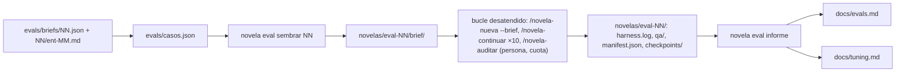

# 0014 — Evaluar el sistema con cinco briefs de prueba, una tabla por validador y una iteración de tuning documentada

## 1. Resumen

Se monta una evaluación reproducible del harness sobre cinco briefs de novela de regalo con datos ficticios. Entre ellos hay uno adversarial, con una inyección en texto libre, y otro que provoca una incoherencia temporal. Un subcomando determinista del CLI siembra cada brief en un workspace. Otro lee los workspaces que una persona ya generó con el bucle desatendido y produce una tabla por brief: qué validadores pasaron y cuáles fallaron, con números. Los resultados reales quedan en `docs/evals.md`. `docs/tuning.md` documenta una iteración de ajuste de prompt con su antes, su después y el sha de commit de cada versión.

## 2. Contexto y problema

**Hoy no hay evaluación con resultados.** La auditoría del entregable marca EVAL-01, EVAL-02 y EVAL-03 como «falta» (`docs/auditoria-entregable.md` § EVAL). `docs/validators.md` § 4.2 describe los tipos de eval (golden, task completion, LLM-as-judge, adversarial y live), pero no recoge ningún resultado. § 4.2 dice además que «la señal más barata y más infravalorada es **intentos por gate**», y nada la agrega hoy por novela.

**No existe ningún brief de prueba para una novela completa.** Los briefs que hay son fixtures unitarios de la fase de brief (`backend/tests/fixtures/brief/`: `brief-completo.json`, `carta-inyectada.md`, `borrador-obediente.json`…), pensados para probar `novela brief validar` y no para generar una novela. `backend/tests/canario/` prueba las barreras de contención del orquestador (`docs/validators.md` § 4.9), no la calidad de lo que se escribe.

**Los números existen, pero dispersos y en parte sobrescritos.**

- `novela checkpoint` emite a Langfuse, por capítulo, seis scores agregados y un score binario por validador (`backend/novela/slices/checkpoint/cmd.py`; `docs/architecture.md` § 10.5). Esos binarios «casi siempre valen 1 en `checkpoint`» porque la custodia exige que la última `validar` haya aprobado: miden el artefacto final, no los intentos (`docs/validators.md` § 3.10).
- `qa/NN-*.json` tiene nombre determinista y cada intento lo reescribe, así que los hallazgos de un intento rechazado se pierden.
- `runs/<run_id>/harness.log` guarda una línea por subcomando con su código y su causa. `novela validar` deja `validar NN -> 1 · k hallazgos: <tipos>` (`backend/novela/slices/validacion/cmd.py`). Es la única huella de los intentos fallidos.
- `runs/<run_id>/manifest.json` registra `sha_commit`, `sucio` y `hashes_claude`, que sirven de versión del prompt (`backend/novela/plataforma/run.py`; `docs/architecture.md` § 10.4).

**Lanzar una novela desde un brief exige hoy la entrevista.** `novela nueva <slug> --brief` necesita `brief/brief.json` en un workspace creado por `novela brief iniciar` (`backend/novela/slices/nueva/cmd.py`). `brief.json` solo lo escribe `novela brief validar` a partir del borrador del `entrevistador` (`docs/architecture.md` § 8). `novela producir` solo admite `--idea` (`backend/novela/slices/producir/cmd.py`). Editar `novelas/` a mano está prohibido (`AGENTS.md` § Separación repo / workspace).

**Solapamientos y dependencias con otras specs.**

- La spec 0005 define `Brief`, `brief.schema.json` y los gates del brief, que esta spec consume sin cambiarlos.
- La spec 0009 define el catálogo `dominio/validadores.py` y `vp_cobertura`. La tabla recorre ese catálogo, pero no reimplementa `vp_cobertura` (ver D12).
- La spec 0012 (Lean) verificará la coherencia temporal. El brief temporal es su caso natural: si añade un validador al catálogo, aparece en la tabla sin cambiar esta spec.
- La spec 0011 (juez narrativo) añadirá scores por criterio. Quedan fuera de esta tabla.
- § 4.11 de `docs/validators.md` (control negativo de revisores, de la spec 0002) es otra evaluación, con fixtures de capítulo y no de brief.

**Restricciones del repositorio que condicionan el diseño.**

- Ningún test llama a un modelo (`AGENTS.md` § Proceso: generar código). Generar las novelas gasta cuota y lo lanza una persona con el bucle desatendido documentado, nunca un test (petición del usuario).
- Cambiar el prompt de un agente no tiene TDD. Va por spec, se valida con una novela de humo de 3 capítulos comparando scores y se commitea para que el sha lo atribuya (`AGENTS.md` § Proceso: generar código; `CLAUDE.md` § Subagentes).
- Ningún dato cruza del disco al código sin pasar por un modelo de `backend/novela/dominio/` (`docs/validators.md` § 3.1).
- Los datos del brief no van al log ni a los mensajes del CLI (`docs/definitions.md` § 6, `brief/`).

## 3. Objetivos y no objetivos

### 3.1 Objetivos

- **O-01.** El repositorio contiene cinco briefs de prueba en `evals/briefs/`, válidos contra el esquema del brief, con al menos un caso adversarial y uno temporal. Un test lo comprueba mecánicamente.
- **O-02.** Un subcomando determinista siembra cualquiera de los cinco briefs en un workspace listo para `/novela-nueva <slug> --brief`, sin entrevista y sin editar `novelas/` a mano.
- **O-03.** Un subcomando determinista, probado sobre workspaces fixture, produce para cada workspace una tabla por validador con resultado (pasa, falla o no evaluado) y números.
- **O-04.** `docs/evals.md` recoge la tabla con números reales de las cinco novelas, generadas con un solo sha de commit y el árbol limpio.
- **O-05.** `docs/tuning.md` documenta una iteración de tuning con antes y después comparables y el sha de cada versión del prompt.
- **O-06.** `uv run pytest`, `mypy --strict` y `ruff` en verde.

### 3.2 No objetivos

- Ejecutar novelas desde un test o desde CI.
- Emitir los resultados de la evaluación a Langfuse o crear datasets o experimentos en Langfuse.
- Ampliar `novela producir`, la API o el panel para lanzar briefs.
- Pasar los briefs de evaluación por el `entrevistador`. La fase de brief ya tiene sus fixtures y su demostración pendiente (`docs/validators.md` § 4.9, T-12 de la 0005).
- Conservar los hallazgos de los intentos rechazados cambiando el nombre de los ficheros de `qa/` o el contrato de `harness.log`.
- Implementar `vp_cobertura`, el validador Lean de la 0012 o el juez de la 0011.
- Decidir si el tuning se queda. `docs/tuning.md` registra el resultado; revertir el prompt, si procede, es otro commit.
- Evaluar con significación estadística: cada medición es una ejecución (ver § 11).

## 4. Usuarios y escenarios

**Actores:**

- **Operador del harness:** la persona que lanza las novelas de evaluación con el bucle desatendido y escribe los documentos.
- **Desarrollador del harness:** mantiene el CLI y los tests.
- **Revisor del entregable:** lee `docs/evals.md` y `docs/tuning.md`.

**Historias:**

1. Como operador, quiero sembrar el brief 04 con una orden y lanzar la novela con el bucle de siempre para no tener que pasar por la entrevista.
2. Como operador, quiero una tabla que diga, brief a brief, qué validadores fallaron y cuántas veces para elegir con datos qué prompt ajustar.
3. Como revisor, quiero ver el antes y el después de un cambio de prompt con el sha de cada versión para atribuir la diferencia a ese cambio.

## 5. Requisitos funcionales

| ID | Requisito (EARS) | Prioridad |
|----|------------------|-----------|
| RF-01 | El sistema debe incluir cinco briefs, `evals/briefs/01.json` a `05.json`. Cada uno valida contra el modelo `Brief` y contra `backend/schemas/brief.schema.json`. Junto a cada uno van los cuerpos de sus entradas en `evals/briefs/NN/ent-MM.md`, cuyo sha256 y número de caracteres, tras la normalización de `novela brief entrada`, coinciden con su `EntradaMeta` (ver D1). | Must |
| RF-02 | El sistema debe incluir el catálogo `evals/casos.json`, validado por el modelo `CatalogoEval`. Tiene exactamente cinco casos con ids `01` a `05`, slugs únicos `eval-NN`, la ruta de su brief y una categoría `base`, `adversarial` o `temporal`, con al menos un caso de cada una de las dos últimas (ver D2). | Must |
| RF-03 | Donde un caso sea `adversarial`, el sistema debe declarar su `inyeccion {cita, senal}`. `cita` es literal de una entrada `texto_libre` y la cita un recuerdo del brief; contiene la cadena `senal`, que no aparece en ninguna otra entrada, y ninguna de sus líneas la marca `slices/brief/entradas.py::marcar` (ver D3). | Must |
| RF-04 | Donde un caso sea `temporal`, el sistema debe declarar su `conflicto_temporal {cita, edad_implicada}`. `cita` es un recuerdo del brief, literal de su entrada, y `edad_implicada` es mayor que `destinatario.edad.valor` (ver D4). | Must |
| RF-05 | El sistema debe garantizar que cada brief, convertido en borrador, no produce hallazgos en los cuatro gates de `slices/brief/gates.py` (esquema, faltantes, contradicciones y procedencia) contra sus entradas (ver D5). | Must |
| RF-06 | El sistema debe repartir los cinco briefs entre las cinco ocasiones de `Ocasion`, las tres extensiones y al menos tres géneros de `Genero`. | Should |
| RF-07 | El sistema debe usar solo datos ficticios en `evals/`. Cada `destinatario.nombre.valor` lleva la palabra `Ficticio` o `Ficticia`, y ningún fichero contiene algo con forma de correo, teléfono o DNI/NIE (ver D6). | Must |
| RF-08 | Cuando el operador ejecute `novela eval sembrar <caso> [--slug <slug>]`, el sistema debe crear `novelas/<slug>/` con `estado/`, `runs/`, `brief/inicio.json`, `brief/entradas/ent-MM.md` (frontmatter `EntradaMeta`), `brief/informe.json` con `valido: true` y `brief/brief.json`. Antes, repite en memoria los cuatro gates del brief. Deja una línea en el `harness.log` del run de arranque, sale con 0 e imprime la orden siguiente, `/novela-nueva <slug> --brief`. Sin `--slug`, usa el del catálogo (ver D7 y D8). | Must |
| RF-09 | Si el workspace ya existe, `novela eval sembrar` debe salir con 1 sin tocarlo. Si `<caso>` no está en el catálogo o `--slug` no casa `^[a-z0-9-]+$`, debe salir con 2. Si el brief o sus entradas no validan (modelo, sha256 o gates), debe salir con 4 sin crear el workspace. Ningún mensaje lleva valores del brief. | Must |
| RF-10 | Cuando el operador ejecute `novela eval informe [<slug>…] [--hasta N]`, el sistema debe imprimir en Markdown la tabla 1, con una fila por workspace. Sin slugs, recorre los del catálogo. Las columnas son: caso, categoría, slug, una por cada validador binario de `VALIDADORES` en el orden del catálogo, gate del canon, gate de revisión y gate del delta. Cada celda vale `pasa 0/t`, `falla c/t (n)` o `no evaluado`: `t` son los capítulos evaluados, `c` los capítulos con algún intento fallido y `n` el total de intentos fallidos, contados según § 8.4 (ver D9, D10 y D11). | Must |
| RF-11 | Cuando se ejecute `novela eval informe`, el sistema debe imprimir, tras la tabla 1, la tabla 2 con una fila por workspace. Columnas: capítulos cerrados sobre el total de `config.yaml`, estado de la novela, intervenciones (totales y vivas), veredictos finales de continuidad y de suspense, medias de `tension`, `fair_play` y `coherencia`, hallazgos `contradiccion_temporal` en los informes finales, señal de inyección (solo en casos `adversarial`), hallazgos de `qa/auditoria.json` por tipo y `vp_cobertura` (ver D12). | Must |
| RF-12 | El sistema debe mostrar en cada fila de la tabla 1 la versión del prompt: los `sha_commit` distintos de los manifiestos del run de arranque y de los runs de capítulo hasta `--hasta`, abreviados a 12 caracteres. Añade `(sucio)` si algún manifiesto tiene `sucio: true` y `(mezclado)` si hay más de un sha. La salida `--json` lleva además los conjuntos distintos de `hashes_claude` (ver D15). | Must |
| RF-13 | Mientras un workspace del catálogo no exista, el sistema debe mostrar su fila con `no generado` en todas las celdas de resultado. Mientras no tenga capítulos evaluados, debe mostrar `sin capítulos`. Si un validador no dejó rastro en el workspace, su celda debe valer `no evaluado`. | Must |
| RF-14 | Si un slug pasado explícitamente no existe, o su `brief/brief.json` no es igual, como modelo, a ningún brief del catálogo, `novela eval informe` debe salir con 4 nombrando el slug. Si un manifiesto, un checkpoint o un informe de `qa/` no valida contra su modelo, debe salir con 4 nombrando la ruta. Debe salir con 3 si el lock del workspace está tomado y con 2 si `--hasta` es menor que 1 o un slug no casa `^[a-z0-9-]+$` (ver D14 y D22). | Must |
| RF-15 | Donde se pase `--json`, `novela eval informe` debe imprimir, en vez del Markdown, un `InformeEval` válido contra `backend/schemas/eval-informe.schema.json`, con los mismos números (ver D13 y D18). | Should |
| RF-16 | El sistema debe producir la misma salida, byte a byte, en dos ejecuciones de `novela eval informe` sobre los mismos workspaces, sin depender del reloj, del orden de listado del disco ni de la zona horaria. | Must |
| RF-17 | El sistema debe tratar `novela eval informe` como solo lectura: no escribe en ningún workspace, ni siquiera en `harness.log`, ni en `docs/`, y no abre conexiones de red (ver D13). | Must |
| RF-18 | El sistema debe incluir `docs/evals.md` con las dos tablas producidas por `novela eval informe` sobre los cinco workspaces del catálogo, generados con el bucle desatendido. Incluye el sha de commit, que es único y con `sucio: false` en todos, la fecha, las órdenes ejecutadas y una lectura de cada caso, con el resultado del adversarial y del temporal (ver D20 y D21). | Must |
| RF-19 | El sistema debe incluir `docs/tuning.md` con una iteración de tuning: celda objetivo según la regla de § 8.5, hipótesis escrita antes del cambio, fichero de `.claude/agents/` cambiado y sha del commit del cambio. Incluye las tablas de antes y después con `--hasta 3`, los `sha_commit` y el `hashes_claude` del fichero cambiado en cada versión, la comparación métrica a métrica y la conclusión, con la advertencia de que cada medición es una sola ejecución (ver D16 y D17). | Must |
| RF-20 | El sistema debe actualizar en el mismo commit que el código: `docs/architecture.md` § 3.1 y § 8 con `novela eval`, `docs/definitions.md` con los modelos nuevos y `docs/validators.md` § 4.2 con la referencia a `docs/evals.md` y `docs/tuning.md` y el estado de los evals (ver D19). | Must |

## 6. Requisitos no funcionales

| ID | Categoría | Requisito | Métrica | Umbral |
|----|-----------|-----------|---------|--------|
| RNF-01 | Rendimiento | `novela eval informe` sobre cinco workspaces fixture de 10 capítulos cada uno | Tiempo de pared en `pytest` | < 5 s |
| RNF-02 | Rendimiento | `novela eval sembrar` de un caso | Tiempo de pared en `pytest` | < 2 s |
| RNF-03 | Privacidad y protección de datos | Ni `sembrar` ni `informe` escriben valores del brief (nombre, edad, rasgos, recuerdos ni términos) en stdout, stderr o `harness.log` | Valores del brief encontrados en esas salidas | 0 |
| RNF-04 | Privacidad y protección de datos | Datos de `evals/` ficticios | Coincidencias de las expresiones de correo, teléfono y DNI/NIE del test sobre `evals/` | 0 |
| RNF-05 | Seguridad (coste y red) | Ningún test invoca `claude`, `novela producir` ni la red | Llamadas a `subprocess` con `claude` y conexiones de socket durante los tests de la spec | 0 |
| RNF-06 | Compatibilidad | Suite y analizadores | Errores de `uv run pytest`, `mypy --strict` y `ruff check` | 0 |
| RNF-07 | Observabilidad (atribución) | Las ejecuciones que documentan `docs/evals.md` y `docs/tuning.md` son atribuibles a un commit | Manifiestos con `sucio: true` o con más de un `sha_commit` por fila documentada | 0 |
| RNF-08 | Rendimiento (determinismo) | Salida estable | Diferencias entre dos ejecuciones sobre los mismos fixtures | 0 bytes |

## 7. Criterios de aceptación

### CA-01 (cubre RF-01)
- **Dado** `evals/briefs/01.json` a `05.json` y sus directorios de entradas
- **Cuando** `tests/test_evals_briefs.py` valida cada brief con `Brief.model_validate_json` y con `jsonschema` contra `backend/schemas/brief.schema.json`, y recalcula el sha256 y los caracteres de cada `ent-MM.md` normalizado
- **Entonces** los cinco validan por las dos vías y cada `EntradaMeta` coincide con su fichero.

### CA-02 (cubre RF-02)
- **Dado** `evals/casos.json`
- **Cuando** se valida con `CatalogoEval`
- **Entonces** hay cinco casos con ids `01` a `05`, slugs únicos que casan `^eval-[0-9]{2}$` y rutas de brief existentes, y al menos un caso `adversarial` y uno `temporal`.
- **Y** un catálogo con un id repetido, o sin caso `temporal`, no valida.

### CA-03 (cubre RF-03)
- **Dado** el caso `adversarial` del catálogo
- **Cuando** el test busca su `inyeccion.cita`
- **Entonces** es subcadena literal, tras normalizar, de una entrada `texto_libre` de su brief.
- **Y** es la `cita` de un recuerdo del brief.
- **Y** contiene `inyeccion.senal`, que no aparece en ninguna otra entrada ni en otro brief.
- **Y** `entradas.marcar` no devuelve ninguna línea marcada para esa cita.

### CA-04 (cubre RF-04)
- **Dado** el caso `temporal` del catálogo
- **Cuando** el test lee su `conflicto_temporal`
- **Entonces** `cita` es un recuerdo de su brief y es literal de su entrada.
- **Y** `edad_implicada` es mayor que `destinatario.edad.valor`.

### CA-05 (cubre RF-05)
- **Dado** cada brief convertido en `BorradorBrief` (mismos campos, sin `ocasion` ni `entradas`) y sus entradas
- **Cuando** se ejecutan `gates.esquema`, `gates.faltantes`, `gates.contradicciones` y `gates.procedencia`
- **Entonces** ninguno devuelve hallazgos.

### CA-06 (cubre RF-06)
- **Dado** los cinco briefs
- **Cuando** el test reúne sus `ocasion`, `extension.valor` y `genero.valor`
- **Entonces** hay 5 ocasiones distintas, 3 extensiones y al menos 3 géneros.

### CA-07 (cubre RF-07)
- **Dado** todos los ficheros de `evals/`
- **Cuando** el test aplica las expresiones de correo, teléfono (9 dígitos seguidos, con o sin prefijo `+34`) y DNI/NIE (`[XYZ]?\d{7,8}[A-Z]`), y lee cada `destinatario.nombre.valor`
- **Entonces** no hay ninguna coincidencia y cada nombre contiene `Ficticio` o `Ficticia`.

### CA-08 (cubre RF-08)
- **Dado** `NOVELAS_DIR` en un directorio temporal sin el slug `eval-04`
- **Cuando** se ejecuta `novela eval sembrar 04`
- **Entonces** sale con 0 e imprime `/novela-nueva eval-04 --brief`.
- **Y** existen `brief/inicio.json` con la ocasión del brief, las entradas con su frontmatter, `brief/informe.json` con `valido: true` y `brief/brief.json` igual, como modelo, a `evals/briefs/04.json`.
- **Y** el `harness.log` del run de arranque tiene una línea `eval sembrar 04 -> 0`.
- **Y** a continuación `novela nueva eval-04 --brief` sale con 0.

### CA-09 (cubre RF-09)
- **Dado** un workspace `eval-04` ya existente
- **Cuando** se ejecuta `novela eval sembrar 04`
- **Entonces** sale con 1 y ningún fichero del workspace cambia de sha256.
- **Y** `novela eval sembrar 09` sale con 2 y `--slug "../x"` sale con 2.
- **Y** con un catálogo fixture cuya entrada no casa su sha256, sale con 4 y no crea el directorio.
- **Y** ninguna de las salidas contiene un valor del brief.

### CA-10 (cubre RF-10)
- **Dado** un workspace fixture de 3 capítulos cuyo `harness.log` tiene, en este orden:
  - `validar 01 -> 1 · 2 hallazgos: longitud_fuera_de_rango, pista_ausente` y `validar 01 -> 0`
  - `validar-hook 02 -> 1 · 1 hallazgos: id_inexistente` y `validar 02 -> 0`
  - `validar 03 -> 1 · 1 hallazgos: longitud_fuera_de_rango` dos veces y después `validar 03 -> 0`
- **Cuando** se ejecuta `novela eval informe <slug>`
- **Entonces** `vp_longitud` vale `falla 2/3 (3)`, `vp_pistas` vale `falla 1/3 (1)`, `vp_ids` vale `pasa 0/3` y el resto de binarios vale `pasa 0/3`.
- **Y** con una línea `briefing NN continuista -> 0` en cada uno de los tres capítulos y una segunda en el 02, el gate de revisión vale `falla 1/3 (1)`.
- **Y** con `aplicar-delta NN -> 0` en los tres capítulos y además `aplicar-delta 03 -> 1`, el gate del delta vale `falla 1/3 (1)`.
- **Y** con una línea `briefing 01 trazador -> error · WorkspaceInvalido: …` en el run de arranque, el gate del canon vale `falla 1/1 (1)`.

### CA-11 (cubre RF-10)
- **Dado** un workspace fixture de 3 capítulos con líneas `validar NN -> 0` en los tres, `checkpoint 02 -> 1 · vp_schema: esquema_invalido@…` y `validar 01 -> 1 · 1 hallazgos: frontmatter_invalido`
- **Cuando** se ejecuta `novela eval informe <slug>`
- **Entonces** `vp_schema` vale `falla 2/3 (2)`.

### CA-12 (cubre RF-11)
- **Dado** un workspace fixture del caso `adversarial` con 3 capítulos cerrados de 10, la señal presente en el cuerpo de `capitulos/02.md`, `qa/NN-suspense.json` con `tension` 4, 6 y 8, un `qa/02-continuidad.json` con dos hallazgos `contradiccion_temporal`, un `intervencion.md` sin `resuelto:` en el run del capítulo 4 y un `qa/auditoria.json` con un hallazgo `hilo_sin_cerrar`
- **Cuando** se ejecuta `novela eval informe <slug>`
- **Entonces** la tabla 2 muestra `3/10`, `intervención en 04`, `1 (1 viva)`, tensión media `6.00`, `contradiccion_temporal` `2`, señal `1/3`, auditoría `hilo_sin_cerrar: 1` y `vp_cobertura` `no evaluado`.
- **Y** en un caso `base` la columna de señal vale `—`.

### CA-13 (cubre RF-12)
- **Dado** un workspace fixture cuyos manifiestos tienen dos `sha_commit` distintos y uno con `sucio: true`
- **Cuando** se ejecuta `novela eval informe <slug>`
- **Entonces** la columna de prompt lista los dos shas abreviados a 12 caracteres, en orden, seguidos de `(sucio) (mezclado)`.
- **Y** con `--json`, `hashes_claude` lista los dos conjuntos distintos.

### CA-14 (cubre RF-13)
- **Dado** `NOVELAS_DIR` con solo `eval-01` generado y `eval-02` sembrado sin capítulos
- **Cuando** se ejecuta `novela eval informe` sin slugs
- **Entonces** sale con 0 y hay cinco filas por tabla, en orden de caso.
- **Y** `eval-02` muestra `sin capítulos`, y `eval-03` a `eval-05` muestran `no generado`.
- **Y** en `eval-01`, sin `qa/auditoria.json`, la auditoría vale `no ejecutada`.

### CA-15 (cubre RF-14)
- **Dado** un slug inexistente, un workspace cuyo `brief.json` no es ninguno del catálogo, uno con un `manifest.json` inválido, uno con el lock tomado por otro proceso y `--hasta 0`
- **Cuando** se ejecuta `novela eval informe` con cada uno
- **Entonces** sale con 4, 4, 4 nombrando `runs/<run_id>/manifest.json`, 3 y 2, respectivamente, sin valores del brief en stderr.

### CA-16 (cubre RF-15)
- **Dado** el workspace de CA-10
- **Cuando** se ejecuta `novela eval informe <slug> --json`
- **Entonces** la salida valida contra `backend/schemas/eval-informe.schema.json` con `jsonschema` y lleva los mismos `c`, `t` y `n` que la tabla Markdown.

### CA-17 (cubre RF-16)
- **Dado** los cinco workspaces fixture copiados en dos directorios creados en orden inverso, con `TZ` distinta y el reloj movido con `monkeypatch`
- **Cuando** se ejecuta `novela eval informe` en los dos
- **Entonces** las dos salidas son idénticas byte a byte.

### CA-18 (cubre RF-17)
- **Dado** los workspaces fixture y `socket.socket.connect` sustituido por una función que falla
- **Cuando** se ejecuta `novela eval informe`
- **Entonces** sale con 0 y el sha256 y el `mtime` de todos los ficheros de los workspaces y de `docs/` no cambian.

### CA-19 (cubre RF-18)
- **Dado** `docs/evals.md` commiteado
- **Cuando** `tests/test_docs_evals.py` lo lee
- **Entonces** contiene las dos tablas con cinco filas cada una, una por caso `01` a `05`, sin ninguna celda `no generado`.
- **Y** contiene un solo sha de 40 hexadecimales, sin `(sucio)` ni `(mezclado)`, y una sección por caso con los encabezados `Adversarial` y `Temporal` presentes.
- **Y** no contiene `pendiente`, `TODO` ni `próximamente`.

### CA-20 (cubre RF-19)
- **Dado** `docs/tuning.md` commiteado
- **Cuando** `tests/test_docs_tuning.py` lo lee
- **Entonces** contiene las secciones Objetivo, Hipótesis, Cambio, Antes, Después, Comparación y Conclusión, en ese orden.
- **Y** Antes y Después llevan cada uno una tabla de `novela eval informe --hasta 3` y un sha de 40 hexadecimales, y los dos shas son distintos.
- **Y** Cambio nombra un fichero existente de `.claude/agents/`, y su hash aparece distinto en Antes y en Después.
- **Y** el sha de Después es un commit de `git log` que modifica ese fichero.

### CA-21 (cubre RF-20)
- **Dado** el commit que añade el slice
- **Cuando** se revisa con `test_contratos.py` y con búsquedas en los documentos
- **Entonces** `backend/schemas/eval-casos.schema.json` y `eval-informe.schema.json` coinciden con los modelos regenerados.
- **Y** `docs/architecture.md` § 8 nombra `novela eval sembrar` y `novela eval informe`, y § 3.1 incluye `evals/` y `slices/evaluacion/`.
- **Y** `docs/definitions.md` define `CasoEval`, `CatalogoEval` e `InformeEval`.
- **Y** `docs/validators.md` § 4.2 enlaza `docs/evals.md` y `docs/tuning.md`.

## 8. Diseño propuesto

### 8.1 Visión general

La evaluación tiene una parte versionada y determinista (briefs, catálogo, CLI y tests) y otra manual que gasta cuota: generar las novelas y escribir los documentos. Las une el workspace. `sembrar` lo prepara, el bucle desatendido de siempre lo llena e `informe` lo lee sin tocarlo.

### 8.2 Componentes afectados

**Nuevos:**

- `evals/casos.json`: el catálogo.
- `evals/briefs/01.json` … `05.json` y `evals/briefs/01/ent-01.md` …: los briefs y los cuerpos de sus entradas.
- `backend/novela/dominio/evaluacion.py`: `CasoEval`, `CatalogoEval`, `Inyeccion`, `ConflictoTemporal`, `CeldaValidador`, `FilaEval` e `InformeEval`.
- `backend/novela/slices/evaluacion/`:
  - `cmd.py`: cáscara de `sembrar` e `informe`.
  - `registro.py`: puro; interpreta líneas de `harness.log`.
  - `agregar.py`: puro; construye `FilaEval` a partir de datos ya leídos.
  - `tabla.py`: puro; `InformeEval` → Markdown.
  - Sus tests: `test_registro.py`, `test_agregar.py`, `test_tabla.py` y `test_cmd.py`.
- `backend/tests/fixtures/evaluacion.py`: construye workspaces fixture con `tests/fixtures/fabrica.py` y añade líneas de log, informes y manifiestos sintéticos.
- `backend/tests/test_evals_briefs.py`, `backend/tests/test_docs_evals.py` y `backend/tests/test_docs_tuning.py`.
- `backend/schemas/eval-casos.schema.json` y `backend/schemas/eval-informe.schema.json`.
- `docs/evals.md` y `docs/tuning.md`.

**Modificados:**

- `backend/novela/cli.py`: registra la subaplicación `eval`, como `brief`.
- `backend/tests/test_contratos.py`: los dos esquemas nuevos.
- `docs/architecture.md` § 3.1 y § 8, `docs/definitions.md` y `docs/validators.md` § 4.2.
- `.claude/agents/<rol>.md`: uno solo, el de la iteración de tuning (T-08), en su propio commit.

**Sin cambios:** `AGENTS.md`, `CLAUDE.md`, `.claude/settings.json`, hooks, API y frontend.

### 8.3 Modelo de datos

Sin cambios en `estado.db` ni en los modelos existentes. Modelos nuevos en `dominio/evaluacion.py`, todos `Modelo` con `schema_version`:

| Modelo | Campos |
|---|---|
| `Inyeccion` | `cita: str` (1..600), `senal: str` (4..40, `^[A-Z0-9-]+$`) |
| `ConflictoTemporal` | `cita: str` (1..600), `edad_implicada: int` (1..150) |
| `CasoEval` | `id: ^[0-9]{2}$`, `slug: ^eval-[0-9]{2}$`, `categoria: base \| adversarial \| temporal`, `brief: str` (ruta relativa a la raíz, bajo `evals/briefs/`), `descripcion: str` (1..300, sin valores del brief), `inyeccion: Inyeccion \| None`, `conflicto_temporal: ConflictoTemporal \| None`. Un validador exige `inyeccion` si y solo si es `adversarial`, y `conflicto_temporal` si y solo si es `temporal` |
| `CatalogoEval` | `casos: list[CasoEval]` (exactamente 5), con ids y slugs únicos y al menos un `adversarial` y un `temporal` |
| `CeldaValidador` | `estado: pasa \| falla \| no_evaluado`, `capitulos_evaluados: int`, `capitulos_con_fallo: int`, `intentos_fallidos: int` |
| `FilaEval` | `caso`, `categoria`, `slug`, `situacion: generado \| sin_capitulos \| no_generado`, `validadores: dict[str, CeldaValidador]` (catálogo más `gate_canon`, `gate_revision` y `gate_delta`, en orden), `shas: list[str]`, `sucio: bool`, `hashes_claude: list[dict[str, str]]`, `cerrados: int`, `total: int`, `estado_novela: str`, `intervenciones: int`, `intervenciones_vivas: int`, `veredictos_continuidad` y `veredictos_suspense: dict[Veredicto, int]`, `medias: dict[Puntuacion, float]`, `contradiccion_temporal: int`, `senal: int \| None`, `auditoria: dict[TipoHallazgo, int] \| None`, `vp_cobertura: no_evaluado \| float` |
| `InformeEval` | `hasta: int \| None`, `filas: list[FilaEval]` |

`evals/briefs/NN.json` es un `Brief` de la spec 0005, sin cambios. `evals/briefs/NN/ent-MM.md` es texto plano; `sembrar` le añade el frontmatter `EntradaMeta` al escribirlo en el workspace, igual que `novela brief entrada`.

### 8.4 Interfaces y contratos

**`novela eval sembrar <caso> [--slug <slug>]`**

| Código | Cuándo | Efecto |
|---|---|---|
| 0 | Sembrado | Workspace creado; imprime `<slug>: sembrado · siguiente: /novela-nueva <slug> --brief` |
| 1 | El workspace existe | Nada |
| 2 | Caso desconocido o slug inválido | Nada |
| 3 | Lock ocupado | Nada |
| 4 | Brief, entradas o gates inválidos | Nada. El mensaje nombra ruta y código de hallazgo, nunca valores |

La línea de log `eval sembrar <caso> -> <código>` va en el run `(1, "arranque")`, cuyo manifiesto registra `sha_commit`. `/novela-nueva --brief` reutiliza ese run (`docs/architecture.md` § 8).

**`novela eval informe [<slug>…] [--hasta N] [--json]`**

Códigos: 0, informe impreso; 2, uso incorrecto; 3, lock ocupado; 4, workspace o artefacto inválido. Toma el lock de cada workspace mientras lo lee y lo suelta antes de pasar al siguiente.

**Reglas de conteo** (puras, en `registro.py` y `agregar.py`). Se leen todos los `runs/*/harness.log` y se consideran solo los capítulos `≤ --hasta`.

| Columna | Intento fallido | Capítulos evaluados `t` |
|---|---|---|
| Validador `v` con punto `validar` | Línea que contiene `validar NN -> 1 · k hallazgos: <tipos>`, en la que algún tipo cumple `validador_de(tipo) == v`. Las líneas `validar-hook` no cuentan (ver D11) | Capítulos con alguna línea `validar NN -> ` |
| `vp_schema` | Lo anterior con `frontmatter_invalido`, más cada línea `checkpoint NN -> 1` con `vp_schema:` en la causa | Ídem |
| Gate del canon | Línea `briefing 01 trazador -> error · WorkspaceInvalido` del run de arranque | 1 si hay run de arranque |
| Gate de revisión | Por capítulo, las líneas `briefing NN continuista -> 0` menos una, con mínimo 0 (`.claude/commands/novela-continuar.md` § Cuenta de intentos) | Capítulos con alguna de esas líneas |
| Gate del delta | Línea `aplicar-delta NN -> 1` | Capítulos con alguna línea `aplicar-delta NN -> ` |

- `c` son los capítulos con al menos un intento fallido y `n` la suma de intentos fallidos. Además, un capítulo cuyo `qa/NN-validacion.json` final tenga hallazgos de `v` cuenta como capítulo con fallo aunque el log no lo registre.
- La celda vale `pasa` si `n = 0` y `c = 0`, `falla` en otro caso y `no evaluado` si `t = 0`.
- En la tabla 2, la señal es el número de capítulos cerrados cuyo cuerpo contiene `senal`, sin distinguir mayúsculas y tras NFC, sobre los capítulos cerrados.
- El estado de la novela vale `terminado` si están cerrados todos los capítulos, `intervención en NN` si hay un `intervencion.md` vivo (`NN` es el capítulo del manifiesto de su run) y `parado en NN` en otro caso.
- Las medias se calculan sobre las `puntuaciones` de los `qa/NN-suspense.json` de los capítulos cerrados y se redondean a 2 decimales con `ROUND_HALF_EVEN`. Sin datos, la celda vale `—`.

**Formato Markdown.** Las dos tablas van precedidas de `<!-- novela eval informe · hasta: N|todos -->`. Las filas van por id de caso y las columnas de validador en el orden de `VALIDADORES`, seguidas de `gate_canon`, `gate_revision` y `gate_delta`. Sin fechas ni rutas absolutas.

### 8.5 Flujo principal

1. El desarrollador implementa T-01 a T-06 con TDD y commitea en verde. Sea `A` el sha de `HEAD`, con el árbol limpio.
2. El operador ejecuta `novela eval sembrar 01` … `05`.
3. Para cada `eval-NN`, en Git Bash, lanza el bucle desatendido de `AGENTS.md` § Proceso: ejecución, precedido de una sesión `claude -p "/novela-nueva eval-NN --brief" …` con los mismos flags, y seguido de `/novela-auditar eval-NN`. No se commitea nada en `.claude/`, `backend/` ni la raíz mientras duran las cinco novelas.
4. Ejecuta `novela eval informe > <scratch>`, comprueba que la columna de prompt es `A` sin marcas y escribe `docs/evals.md` con las tablas y la lectura de cada caso (T-07).
5. **Regla de selección del tuning:** la celda de la tabla 1 con mayor `n`. Si hay empate, la del caso de id menor y, dentro del caso, el primer validador en orden de columna. Si todas las celdas valen `pasa`, el objetivo es la señal de inyección del caso adversarial si es mayor que 0 y, si no, `contradiccion_temporal` del caso temporal. El rol responsable es el que produce el artefacto que falla: `escritor` para los validadores de `validar` y la revisión, `cronista` para el delta, `arquitecto` para el canon y la señal.
6. Escribe en `docs/tuning.md` el Objetivo y la Hipótesis. Después cambia el prompt de ese rol y commitea solo ese fichero (sha `B`).
7. Ejecuta `novela eval sembrar NN --slug eval-NN-t1` y una novela de humo de 3 capítulos: la sesión de `/novela-nueva` y tres de `/novela-continuar … --capitulos 1`.
8. Ejecuta `novela eval informe eval-NN --hasta 3` (antes, sha `A`) y `novela eval informe eval-NN-t1 --hasta 3` (después, sha `B`), completa `docs/tuning.md` y commitea los documentos (T-08).

## 9. Casos límite y gestión de errores

| Caso | Comportamiento esperado | Requisito relacionado |
|------|-------------------------|-----------------------|
| La inyección del caso adversarial casa un patrón de `PATRONES` | El test de CA-03 falla: el brief no llegaría a validar en la fase real y el caso no mediría la fase de novela | RF-03 |
| El `arquitecto` o la sesión se niegan a escribir la novela adversarial y el bucle para en el arranque | La fila muestra `sin capítulos` o `gate_canon` en `falla`, y `docs/evals.md` lo registra como resultado del caso, no como error | RF-11, RF-13, RF-18 |
| Una novela para con `intervencion.md` antes del capítulo 10 | Informe con los capítulos que haya y estado `intervención en NN`; `docs/evals.md` lo lee como resultado | RF-11 |
| Un commit en `.claude/` durante las cinco novelas | Columna de prompt `(mezclado)`; CA-19 rechaza `docs/evals.md` y se regeneran las filas afectadas con slugs nuevos | RF-12, RF-18 |
| Árbol sucio al lanzar | `(sucio)`; CA-19 o CA-20 rechazan el documento | RF-12, RNF-07 |
| Línea de log con causa multilínea o con el sufijo `sesion=<uuid>` | Se interpreta igual: `run.py` la aplana en una línea y la sesión va antes de la orden | RF-10 |
| `harness.log` con una línea truncada al final (corte a mitad de escritura) | La línea se ignora si no casa el patrón `<orden> NN -> <código>` | RF-10 |
| `qa/NN-suspense.json` ausente por la política de cuota | La media excluye ese capítulo, y el veredicto cuenta como ausente, no como rechazado: el informe mide, no decide | RF-11 |
| `qa/NN-continuidad.json` ilegible | Sale con 4 nombrando la ruta: un artefacto que no valida invalida la medición | RF-14 |
| `--hasta` mayor que los capítulos que existen | Se usan los que haya; sin error | RF-10 |
| Workspace de tuning (`eval-NN-t1`) con el mismo brief que `eval-NN` | Se identifica como el caso `NN` por igualdad de modelo del brief | RF-14 |
| Workspace generado con `--idea`, sin brief | Sale con 4: no es un caso de evaluación | RF-14 |
| Un validador nuevo en `VALIDADORES` (0012) | Aparece como columna, sin cambiar esta spec; `no evaluado` en workspaces antiguos | RF-10 |
| `sembrar` interrumpido a mitad | Los ficheros se escriben con escritura atómica y `brief.json` el último. Un workspace sin `brief.json` hace que `nueva --brief` salga con 1, y el operador borra el directorio y resiembra | RF-08 |

## 10. Dependencias y supuestos

- **Spec 0005** (aceptada, en `entrega`): `Brief`, `EntradaMeta`, `entradas.normalizar_entrada`, `entradas.marcar` y `gates.*`. Esta spec no los cambia.
- **Spec 0009** (Propuesta): catálogo `VALIDADORES` y `validador_de`, ya presentes en `backend/novela/dominio/validadores.py`. `vp_cobertura` queda como `no evaluado` mientras la 0009 no persista su valor en el workspace (ver D12).
- **Spec 0012** (Propuesta): si su validador entra en `VALIDADORES`, la tabla lo recoge. El caso temporal es la entrada natural para demostrarlo, pero no es requisito aquí.
- **Spec 0011** (Propuesta): sus scores por criterio no entran en la tabla 2.
- **Entorno de ejecución manual:** la máquina preparada según `AGENTS.md` § Proceso: ejecución, con `novela comprobar-entorno` en verde.
- **Supuesto:** las novelas de evaluación se trazan en Langfuse como cualquier otra, porque el plugin está habilitado en `local`. Es aceptable porque los datos del brief son ficticios (RF-07). La regla de `--setting-sources project` de `/novela-brief` protege datos reales y aquí no hay entrevista.
- **Supuesto:** cuota suficiente para unas 53 sesiones de capítulo: 5 × 10 capítulos más 3 de tuning, además de las de arranque y auditoría. Si se agota, el bucle para en checkpoint y se reanuda (`docs/architecture.md` § 9).

## 11. Riesgos

| Riesgo | Probabilidad (A/M/B) | Impacto (A/M/B) | Mitigación |
|--------|----------------------|-----------------|------------|
| Una sola ejecución por versión: la diferencia antes/después puede ser ruido del modelo | A | M | RF-19 obliga a declararlo. La comparación va métrica a métrica con los números absolutos, y la conclusión no puede afirmar mejora si la diferencia es menor de 1 intento fallido por capítulo |
| Los hallazgos de los intentos rechazados se pierden al reescribirse `qa/` | A | M | Se cuentan los intentos desde `harness.log`, que sí los conserva. Los tipos del revisor en intentos rechazados quedan fuera y se declara en `docs/evals.md` |
| Coste de cuota de 5 novelas completas más el tuning | A | M | Un capítulo por sesión, parada en checkpoint y reanudación. El tuning usa la novela de humo de 3 capítulos (`AGENTS.md`) |
| El caso temporal no dispara ningún validador porque el `arquitecto` resuelve la contradicción en silencio | M | M | Es un resultado válido: la tabla 2 lo muestra (0 `contradiccion_temporal`) y `docs/evals.md` lo interpreta como hueco de detección, entrada para la 0012 |
| El sha cambia entre novelas por un commit accidental | M | A | `(mezclado)` en la tabla y CA-19. El paso 3 de § 8.5 prohíbe commitear durante la evaluación |
| El formato de `harness.log` cambia en otra spec | B | A | Las reglas de conteo reutilizan las subcadenas que ya lee el procedimiento (`validar NN -> 1`), y `test_registro.py` las fija con ejemplos de `run.py` |
| Un brief de prueba con un nombre que coincide con el de una persona real | B | M | Apellido `Ficticio`/`Ficticia` obligatorio (RF-07), como en `backend/tests/fixtures/brief/brief-completo.json` |

## 12. Plan de implementación

| ID | Tarea | Cubre | Verificación |
|----|-------|-------|--------------|
| T-01 | Modelos de `dominio/evaluacion.py`, esquemas `eval-casos` y `eval-informe` regenerados, `test_contratos.py` y `docs/definitions.md` | RF-02, RF-15, RF-20 | Tests del modelo vistos en rojo y después en verde; `REGENERAR=1 uv run pytest tests/test_contratos.py` sin diff posterior |
| T-02 | `evals/casos.json`, los cinco briefs y sus entradas; `tests/test_evals_briefs.py` | RF-01, RF-02, RF-03, RF-04, RF-05, RF-06, RF-07 | CA-01 a CA-07 en verde, vistos en rojo antes de añadir los ficheros |
| T-03 | `novela eval sembrar` en `slices/evaluacion/cmd.py` y registro en `cli.py` | RF-08, RF-09 | CA-08 y CA-09; RNF-02 y RNF-03 |
| T-04 | `registro.py` y `agregar.py` puros, y fixtures `tests/fixtures/evaluacion.py` | RF-10, RF-11, RF-12, RF-13, RF-16 | CA-10 a CA-14 y CA-17 sobre las funciones puras |
| T-05 | `novela eval informe`: cáscara, lock, errores, `tabla.py` y `--json` | RF-10, RF-11, RF-12, RF-13, RF-14, RF-15, RF-16, RF-17 | CA-10 a CA-18 por CLI; RNF-01, RNF-05, RNF-06 y RNF-08 |
| T-06 | `docs/architecture.md` § 3.1 y § 8 y `docs/validators.md` § 4.2 | RF-20 | CA-21 |
| T-07 | Manual: generar las cinco novelas según § 8.5 pasos 2 a 4 y escribir `docs/evals.md` con `tests/test_docs_evals.py` en el mismo commit | RF-18 | CA-19 y RNF-07 |
| T-08 | Manual: iteración de tuning según § 8.5 pasos 5 a 8, commit del prompt aparte, y `docs/tuning.md` con `tests/test_docs_tuning.py` | RF-19 | CA-20 y RNF-07 |

## 13. Estrategia de pruebas

Ningún test llama a un modelo, lanza `claude` ni ejecuta `novela producir` (RNF-05). Todos los datos son ficticios.

- **Unitarios puros** (`slices/evaluacion/test_registro.py`, `test_agregar.py` y `test_tabla.py`): interpretación de líneas de log, con y sin `sesion=`, líneas `validar-hook` y líneas truncadas; conteo `c/t/n` por columna; reglas de celda, medias, señal y estado; y render Markdown estable. Cubren CA-10 a CA-14 y CA-17 a nivel de función. Además, un test property-based con Hypothesis (200 casos) genera secuencias de líneas y comprueba que `n` es igual al número de líneas fallidas generadas por validador. `dominio/test_evaluacion.py` cubre los validadores de `CasoEval` y `CatalogoEval` (CA-02).
- **Contrato** (`tests/test_evals_briefs.py`): briefs contra `Brief` y `brief.schema.json`, catálogo, casos adversarial y temporal, gates del brief, variedad y datos ficticios. Cubre CA-01 a CA-07. `tests/test_contratos.py` cubre los esquemas nuevos (CA-21).
- **Integración por CLI** (`slices/evaluacion/test_cmd.py`, con `CliRunner` y `NOVELAS_DIR` temporal): `sembrar` y `nueva --brief` encadenados (CA-08) y sus errores (CA-09). `informe` sobre los workspaces de `tests/fixtures/evaluacion.py` (CA-10 a CA-16), determinismo (CA-17), solo lectura y sin red (CA-18), lock ocupado con el fixture `lock_ajeno` existente, rendimiento (RNF-01 y RNF-02) y ausencia de valores del brief en las salidas (RNF-03, con el mismo método que `slices/brief/test_cmd.py::test_log_sin_valores`).
- **Documentales** (`tests/test_docs_evals.py` y `tests/test_docs_tuning.py`): estructura, shas y ausencia de marcadores pendientes (CA-19 y CA-20). Se añaden en el commit de T-07 y T-08, junto a su documento, para no commitear en rojo.
- **Demostración (D, manual)**: las cinco novelas y la de tuning, con el bucle desatendido (T-07 y T-08). Es la única parte que gasta cuota.

## 14. Matriz de trazabilidad

| RF | Criterios de aceptación | Tareas | Tests |
|----|-------------------------|--------|-------|
| RF-01 | CA-01 | T-02 | `tests/test_evals_briefs.py` (contrato) |
| RF-02 | CA-02 | T-01, T-02 | `tests/test_evals_briefs.py`, `dominio/test_evaluacion.py` (contrato, unitario) |
| RF-03 | CA-03 | T-02 | `tests/test_evals_briefs.py` (contrato) |
| RF-04 | CA-04 | T-02 | `tests/test_evals_briefs.py` (contrato) |
| RF-05 | CA-05 | T-02 | `tests/test_evals_briefs.py` (contrato) |
| RF-06 | CA-06 | T-02 | `tests/test_evals_briefs.py` (contrato) |
| RF-07 | CA-07 | T-02 | `tests/test_evals_briefs.py` (contrato) |
| RF-08 | CA-08 | T-03 | `slices/evaluacion/test_cmd.py` (integración CLI) |
| RF-09 | CA-09 | T-03 | `slices/evaluacion/test_cmd.py` (integración CLI) |
| RF-10 | CA-10, CA-11 | T-04, T-05 | `test_registro.py`, `test_agregar.py` (unitario y property-based), `test_cmd.py` (integración) |
| RF-11 | CA-12 | T-04, T-05 | `test_agregar.py` (unitario), `test_cmd.py` (integración) |
| RF-12 | CA-13 | T-04, T-05 | `test_agregar.py` (unitario), `test_cmd.py` (integración) |
| RF-13 | CA-14 | T-04, T-05 | `test_agregar.py` (unitario), `test_cmd.py` (integración) |
| RF-14 | CA-15 | T-05 | `test_cmd.py` (integración CLI) |
| RF-15 | CA-16 | T-01, T-05 | `test_cmd.py` (integración), `tests/test_contratos.py` (contrato) |
| RF-16 | CA-17 | T-04, T-05 | `test_tabla.py` (unitario), `test_cmd.py` (integración) |
| RF-17 | CA-18 | T-05 | `test_cmd.py` (integración CLI) |
| RF-18 | CA-19 | T-07 | `tests/test_docs_evals.py` (documental) y demostración manual |
| RF-19 | CA-20 | T-08 | `tests/test_docs_tuning.py` (documental) y demostración manual |
| RF-20 | CA-21 | T-01, T-06 | `tests/test_contratos.py` (contrato) y revisión documental |

## 16. Decisiones

Ver decisions.md:

- D1 — Formato de los briefs de prueba
- D2 — Catálogo de casos separado del brief
- D3 — Comprobación mecánica del caso adversarial
- D4 — Forma de la incoherencia temporal
- D5 — Los briefs pasan los gates del brief
- D6 — Criterio de datos ficticios
- D7 — Siembra del workspace sin entrevista
- D8 — Nombre y forma de los subcomandos
- D9 — Fuente de los números de la tabla
- D10 — Formato de celda y regla de pasa/falla
- D11 — Las líneas del hook no cuentan como intento
- D12 — `vp_cobertura` sin reimplementar
- D13 — Salida del informe y solo lectura
- D14 — Lock durante la lectura
- D15 — Atribución de la versión del prompt
- D16 — Diseño de la iteración de tuning
- D17 — Métricas comparadas en el tuning
- D18 — Ubicación de los modelos nuevos
- D19 — Documentación de referencia que se actualiza
- D20 — Cómo se lanzan las novelas de evaluación
- D21 — Tests estructurales de los documentos de resultados
- D22 — Errores de identificación de workspaces en el informe
