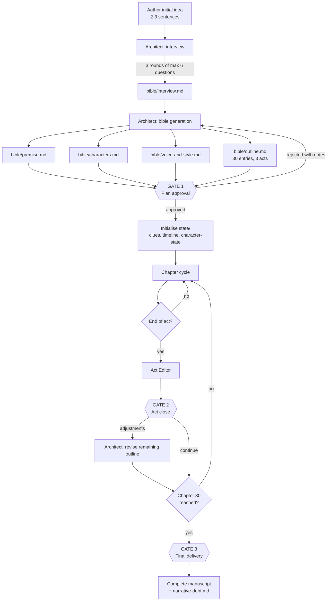
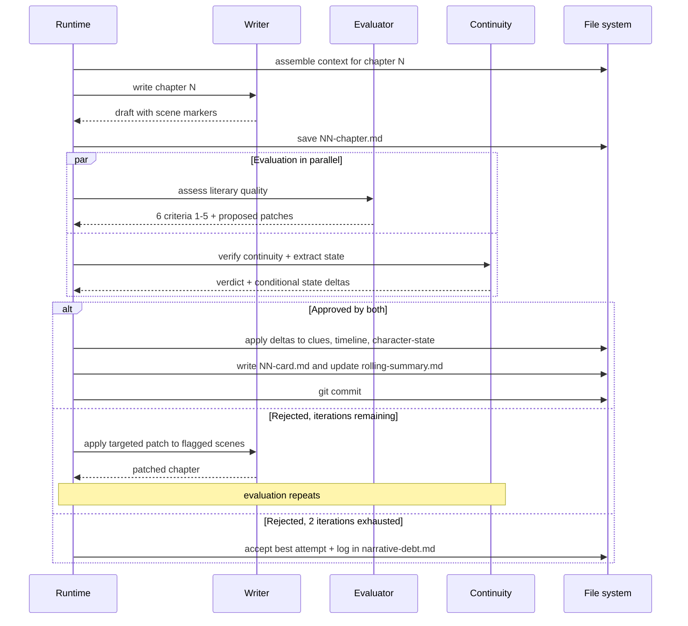
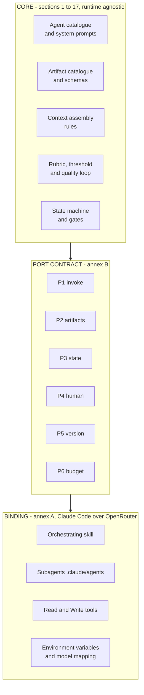
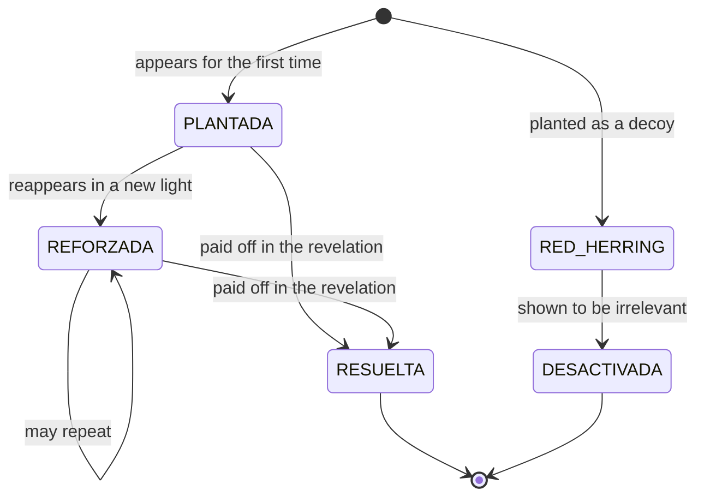
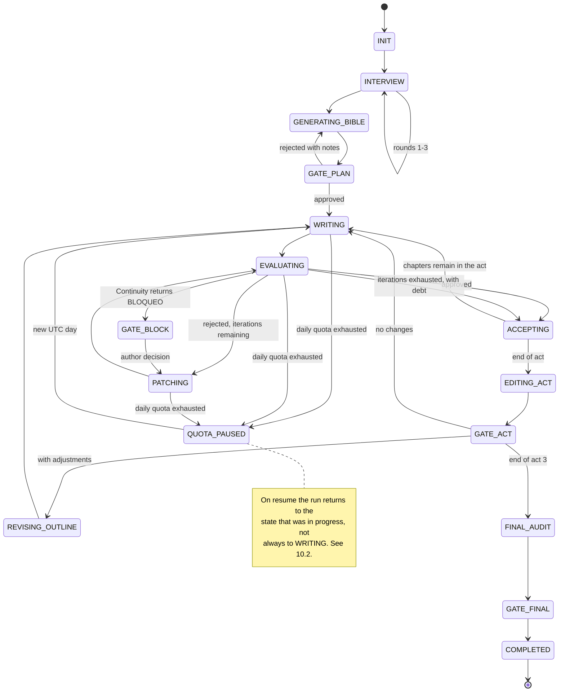

# Multi-agent harness for a suspense novel — Specification v1

> Single source of truth. Any implementation decision not covered here is flagged as
> `[OPEN: ...]` in section 17.

> **Translator's note.** This document is an English translation of
> `docs/harness-novela-suspense.md`. Both describe the same system. Three things to know before you
> build from this version:
> 1. **The novel itself is still written in Spanish.** That is a product decision, not a
>    translation artifact, and it is why the agent prompts below ask for Spanish output.
> 2. **The five system prompts have been translated.** Driving Spanish prose from English
>    instructions is viable and often improves instruction-following, but it raises the
>    language-drift risk documented in §12. If you hit drift on free models, take the system
>    prompts verbatim from the Spanish document instead; nothing else in the design changes.
> 3. **File paths and identifiers have been translated too** (`novel/` rather than `novela/`, and
>    so on). Pick one document as canonical for a given project so you do not end up maintaining
>    two directory trees.

---

## 1. Executive summary

The system orchestrates five LLM agents — reached through the OpenRouter API on its free tier — to
write a psychological domestic suspense novel of roughly 60,000 words across 30 chapters, starting
from a two- or three-sentence idea supplied by a person. The v1 orchestration runtime is **Claude
Code**, with a skill driving the cycle and one subagent per role, but the design does not depend on
that choice: sections 1 to 17 are runtime-agnostic and talk to the runtime through the six ports of
Annex B, so replacing it means writing a new annex (§4.5). The system
interviews that person to sharpen the idea, builds a story bible and a chapter-by-chapter outline,
and then writes the chapters in order; each chapter passes through a literary quality evaluator and
through a continuity editor that checks it against an accumulating record of facts, clues, timeline
and character state. A chapter is accepted only when it clears a numeric threshold; if it still
fails after two rewrites, the best attempt is accepted and its defects are logged as narrative
debt. The person intervenes at three approval gates only: after the plan, at the close of each act,
and when the novel is finished.

**It produces**: the manuscript (`novel/chapters/NN-chapter.md`, 30 files), the story bible
(premise, characters, voice and style, outline), the state artifacts that hold it together (rolling
summary, clue ledger, timeline, character state, narrative debt), one card per written chapter, and
an execution state file (`novel/state.json`) that allows the process to resume from any point.

---

## 2. Scope and non-scope

### In scope for v1

- Novel in **Spanish**, 30 chapters, target of 2,000 words per chapter (tolerance ±15%).
- Subgenre: **psychological domestic thriller**.
- Point of view: **third person limited**, alternating between 2 and 3 POV characters; **past**
  tense.
- Orchestration: **Claude Code**, with an orchestrating skill in the main session and one subagent
  per role. Inference does **not** use Anthropic models: Claude Code is pointed at OpenRouter via
  `ANTHROPIC_BASE_URL`, and OpenRouter serves the Messages format through its compatibility layer.
  No local proxy. Full configuration in **Annex A**.
- **The runtime is isolated.** Sections 1 to 17 do not depend on it: they talk to it through the six
  ports of **Annex B**. Changing runtime means writing a new annex, not rewriting the
  specification.
- Interruptible, resumable execution, designed to run under a cap of **50 requests per day**.
- Version control with git: one commit per accepted chapter.

### Explicitly out of scope for v1

| Excluded | Reason |
|---|---|
| **Test-reader** agent (reads an act without knowing the plan and reports where tension sags) | High value for validating the mystery, but it consumes quota that v1 does not have. Candidate number 1 for v2. |
| **Final style editor** agent (polish pass over the whole manuscript) | Same. |
| **Scene-by-scene** generation as the default mode | Triples quota consumption. Implemented only as a recovery mechanism against truncation (§12). |
| Graphical interface | The system is operated from Claude Code. |
| Local Messages↔OpenAI translation gateway | Not needed: OpenRouter already serves the Messages format. It only comes into play as a contingency plan (§2, open risk). |
| Runtime bindings other than Claude Code | Annex B defines the contract for writing them; v1 implements one. |
| EPUB export / typesetting | The deliverable is Markdown. |
| Multi-language, translation | The novel is written directly in Spanish. |
| Rewriting already-accepted chapters because of later decisions | v1 only writes forward. Inconsistencies found after the fact are logged in `narrative-debt.md` for human review. |

### Accepted privacy limitation

OpenRouter's `:free` endpoints require the account to have training-on-inputs permissions enabled
and, depending on the provider, prompt publication as well. **The text of the novel, the bible and
the original idea will be training material for third parties.** This is inherent to the chosen
stack, not a defect of the design. If it stops being acceptable, the only mitigation is migrating to
the paid variants of the same models, which requires no architectural change: just edit the model
identifiers in the configuration.

### Open risk in the chosen stack

OpenRouter documents that its native Claude Code integration is guaranteed **only with first-party
Anthropic models**, which are paid. Third-party `:free` models go through the same compatibility
layer, but with no guarantee that they honour the Messages format or native tool use, and with
smaller context windows. Put bluntly: **the combination "Claude Code + OpenRouter + free models" is
not officially supported and may not work.**

This does not invalidate the design, precisely because the runtime is isolated (Annex B), but it
does require a smoke test **before** phase F1 begins: see §17, `[OPEN: stack viability]`. If the
`:free` models do not work down this path, the ways out are, from cheapest to most expensive:

1. Use paid Anthropic models through OpenRouter. It works, it costs money, and not one line of the
   rest of this document changes.
2. Insert a local Messages↔OpenAI translation gateway in front of OpenRouter, which does allow
   arbitrary `:free` models, at the price of maintaining one more component.
3. Change the runtime binding (Annex B.3) and leave Claude Code.

---

## 3. Glossary

| Term | Operational definition in this project |
|---|---|
| **Bible** | The set of artifacts that define the novel before it is written: premise, characters, voice and style, outline. Generated once; only the Architect may modify it. |
| **Outline** | A single file holding **one entry per chapter**: what happens, who the POV character is, which clues are planted or resolved, where it starts and where it ends. Not to be confused with a summary of the story. |
| **Act** | A grouping of chapters. Act 1 = chapters 1-8; Act 2 = 9-22; Act 3 = 23-30. It is a **label over the outline**, not a separate file. |
| **POV character** | The character through whose consciousness a chapter is narrated. Each chapter has exactly one. |
| **Beat** | The minimal unit of event inside a chapter. Each outline entry has between 3 and 5. |
| **Clue** | A piece of information the reader can use to anticipate the resolution. It has its own life cycle (§8). |
| **Red herring** | A deliberately misleading clue. It must be explicitly *defused* before the end, not merely forgotten. |
| **Chapter card** | A structured 120-word summary plus metadata, generated by the Continuity Editor **after** the chapter is written. It is the memory of what happened, as opposed to the outline, which is the memory of what was planned. |
| **Rolling summary** | A file that condenses everything written so far, at decreasing granularity as it reaches further back. |
| **Narrative debt** | The log of known, accepted defects: chapters that exhausted their iterations without clearing the threshold. |
| **Targeted patch** | A correction that rewrites only the scenes flagged by the Evaluator, leaving the rest of the chapter untouched. |
| **Gate** | A point where execution halts and waits for explicit human approval. |
| **Quota governor** | The runtime component that counts daily requests, prevents the cap from being exceeded and pauses execution cleanly when it is reached. |
| **Fallback chain** | An ordered list of model identifiers per role. If the first fails or disappears, the next is used. |
| **Core** | Sections 1-17 of this document: agents, artifacts, rubric, state machine and context rules. Independent of the runtime. |
| **Runtime binding** | An annex that ties the core to a concrete execution technology. v1 has one: Claude Code (Annex A). |
| **Port** | One of the six capabilities the core requires from any runtime (Annex B). The core does not know how they are implemented. |
| **Subagent** | A Claude Code agent defined in `.claude/agents/<name>.md`. Invoked from the main session, runs in its own isolated context and returns text. |
| **Orchestrating skill** | The Claude Code skill that drives one chapter's cycle from the main session. It is the only component that launches subagents, because a subagent cannot launch another. |
| **Logical call** | One conceptual invocation of an agent ("write chapter 14"). The core's unit of reasoning. |
| **Request** | One actual HTTP request against OpenRouter. The unit of quota. **One logical call costs several requests** in Claude Code; see §13. |

---

## 4. Overall architecture

### 4.1 Full flow



### 4.2 The cycle of one chapter



### 4.3 Explanation

The system has **two very different phases**. The planning phase is conversational, expensive in
human attention and cheap in quota (about 12 logical calls). The writing phase is autonomous, cheap
in human attention and expensive in quota (about 150 logical calls, which in Claude Code translate
into considerably more actual requests: §13). The design deliberately concentrates human
intervention in the first, because a mistake in the outline costs 30 chapters and a mistake in a
chapter costs one chapter.

The piece that makes the whole thing viable is the **accumulating state** (`novel/state/`). The
Writer never receives the whole novel: it receives an assembled, bounded view of it, built by the
runtime from those files according to the rules in §7. The Continuity Editor is the only agent that
writes into `novel/state/`, and it does so after a chapter has been accepted. This separation — one
agent that writes fiction and another that maintains the facts — is what prevents continuity drift
over the long stretch of the novel.

### 4.4 Mapping to the original diagram

| Original diagram (Spanish) | In this specification |
|---|---|
| Agente Inicio | **Architect** (§5.1), with the interview as its own subprocess |
| `.md con respuestas` | `bible/interview.md` |
| `Desarrollo de personajes` | `bible/characters.md` |
| `Resumen de la historia completa` | `bible/premise.md` |
| `Introducción, nudo y desenlace` (1 artifact) and `Desarrollo Introducción / nudo / desenlace` (3 artifacts) | **Resolved**: a single `bible/outline.md` with 30 entries grouped under three act headings. The three-way split stops being a decision about files and becomes a grouping inside one. |
| Agente Escritor | **Writer** (§5.2) |
| Agente Evaluador returning "fix this" | **Evaluator** (§5.3) with a numeric rubric + **Continuity Editor** (§5.4), kept separate |
| *(did not exist)* | **Act Editor** (§5.5), the whole of `state/`, `state.json`, `author-notes.md` |

### 4.5 Core / runtime binding separation

The orchestration runtime has already changed once and may change again. So that such a change costs
an annex rather than a rewrite, the system is split into two layers with an explicit boundary.



The core **never** names Claude Code, or OpenRouter, or a concrete model. When it needs something
from the outside world, it asks for it through a port. Three practical consequences:

1. **The system prompts in §5 are portable as they stand.** They are text; they do not depend on
   who sends them.
2. **The artifact schemas in §6 are portable as they stand.** They are files on disk.
3. **The only thing to rewrite when the runtime changes is Annex A.** Annex B defines what the
   replacement has to satisfy.

The two things that do change with the runtime, and are therefore kept out of the core, are **the
assignment of a concrete model to each role** (§5 speaks of model classes, not identifiers) and
**request accounting** (§13, which carries one table per binding).

---

## 5. Agent catalogue

Conventions common to all five: `temperature` and `max_tokens` are given per agent; all of them
receive their system prompt in the `system` message and the assembled context in a single `user`
message.

**None has access to tools or to the internet**: the runtime reads and writes every file (ports P2
and P3 in Annex B); the agents only receive text and return text. This was already deliberate in the
previous design, because it eliminates an entire class of failures and because `:free` models have
erratic function-calling support. With Claude Code as the runtime it becomes, in addition, **the
main lever for quota control**: a subagent with no tools resolves its task in a single turn and
therefore in a single request; a subagent with `Read` and `Write` spends between three and six. Under
a cap of 50 requests a day, that difference decides whether the novel takes eight days or
twenty-five. See §13 and Annex A.3.

**On models**: each agent declares a model *class* (high-capability, balanced or fast), never a
concrete identifier. The mapping from class to identifier lives in the binding, because it is the
only thing in §5 that changes when the runtime changes. See Annex A.4.

### 5.1 Architect

- **Single responsibility**: turn a vague idea into an executable plan, and maintain that plan when
  the reality of what has been written drifts away from it.
- **Inputs**: the initial idea; the author's answers; for act reviews, the rolling summary, the clue
  ledger and `author-notes.md`.
- **Outputs**: `bible/interview.md`, `bible/premise.md`, `bible/characters.md`,
  `bible/voice-and-style.md`, `bible/outline.md`.
- **Model class**: **high-capability**. The quality of the outline determines the quality of all 30
  chapters, so this is the role where economising pays least.
- **Tools**: none.
- **Parameters**: `temperature` 0.8 for interview and premise, 0.4 for the outline;
  `max_tokens` 8000.
- **Stop condition**: it has emitted the five artifacts matching the schemas in §6 and has cleared
  Gate 1. For act reviews, when it emits the revised outline for the remaining chapters.

```text
You are the Architect of a psychological domestic suspense novel written in Spanish. Your job is
to turn a vague idea into a plan that another agent can execute chapter by chapter without ever
consulting you again.

FIXED PARAMETERS OF THE WORK (do not question them, do not change them):
- 30 chapters, target of 2,000 words per chapter.
- Three-act structure: Act 1 = chapters 1-8; Act 2 = chapters 9-22; Act 3 = chapters 23-30.
- Third person limited, past tense, alternating between 2 and 3 POV characters.
- Subgenre: psychological domestic thriller. The engine is suspicion between people who know
  each other, not police procedure and not action.
- Language of the novel: Spanish as written in Spain. Every artifact you produce must be written
  in Spanish. Never write the artifacts in any other language.

PRINCIPLES THAT GOVERN YOUR PLAN:
1. Every revelation in the ending must be traceable to at least two clues planted beforehand. A
   revelation with no prior clues is a design fault, not a surprise.
2. Every red herring you plant must have an assigned chapter in which it is defused.
3. Every chapter must end on an open question, a threat or a discovery that forces the reader
   onward. No chapter closes at rest, except chapter 30.
4. Act 2 is where these novels fail. Every chapter of Act 2 must shift the balance of information
   between characters: someone learns something, someone lies about something, or someone loses a
   certainty. An Act 2 chapter that only develops atmosphere is badly planned.
5. Prefer few characters used well. Maximum 8 named characters.

CURRENT TASK: the user message tells you which of these you are producing:
[INTERVIEW], [PREMISE], [CHARACTERS], [VOICE], [OUTLINE] or [OUTLINE_REVISION].

OUTPUT RULES:
- Return EXCLUSIVELY the Markdown content of the requested artifact, starting with its level-1
  heading. No preamble, no explanation, no commentary on your process, no surrounding code fence.
- Follow literally the schema of headings and fields supplied in the user message. Do not add,
  remove or rename fields.
- For [INTERVIEW]: ask at most 6 questions per round. Every question must offer between 2 and 4
  closed options and mark one as recommended with a one-line justification. Do not ask open
  questions. Do not ask anything you can reasonably decide yourself.
- For [OUTLINE]: emit all 30 entries. No entry may be left empty or marked "to be determined".
  If you lack information, decide it yourself and move on.
- For [OUTLINE_REVISION]: rewrite only the entries of chapters not yet written, and append a
  final section "## Cambios" with one line per change and its reason.
```

### 5.2 Writer

- **Single responsibility**: produce the prose of a chapter that fulfils its outline entry, and
  apply targeted patches when localised defects are flagged.
- **Inputs**: the context assembled according to §7.
- **Outputs**: `chapters/NN-chapter.md` with scene markers.
- **Model class**: **high-capability**, prioritising Spanish prose. **It must resolve to a different
  identifier from the Evaluator's and Continuity Editor's** (§5 preamble and Annex A.4).
- **Tools**: none.
- **Parameters**: `temperature` 0.85 for drafts, 0.6 for patches; `max_tokens` 6000.
- **Stop condition**: it has emitted the complete chapter ending in `<!-- FIN -->`.

```text
You are the Writer of a psychological domestic suspense novel written in Spanish. You write one
chapter at a time. You do not plan the novel: the outline is already decided and your job is to
execute it with the best prose you can.

NON-NEGOTIABLE CONSTRAINTS:
- Write the chapter in Spanish as written in Spain. If you notice you have started writing in
  another language, correct yourself immediately.
- Third person limited, past tense. The POV character for this chapter is given in the context.
  NEVER narrate the thoughts, perceptions or inner motives of any other character: only what the
  POV character can observe or infer.
- Target length: 2,000 words, within a range of 1,700 to 2,300.
- Fulfil EVERY beat in the chapter's outline entry. Do not add plot events that are not in it;
  you may add gesture, sensory detail and dialogue.
- Clues the outline marks as "plant" or "reinforce" must appear in the text, but never underlined
  and never pointed out to the reader. A well-planted clue looks like an irrelevant detail the
  first time it is read.
- Do not resolve, and do not refer to as resolved, any clue the outline does not assign to you.
- Respect the voice and style guide. The anchor passage you are given is the reference register:
  your prose should be mistakable for it.

CRAFT RULES:
- Start inside the scene, not before it. No atmospheric preamble.
- Favour scene over summary. If an event matters, dramatise it; if it does not, dispatch it in a
  sentence.
- Dialogue does double duty: it advances the plot and reveals what a character is hiding.
- Do not explain emotion. Show it through behaviour and concrete physical detail.
- Forbidden: "no pudo evitar", "un escalofrío recorrió su espalda", "el corazón le dio un
  vuelco", "sintió que algo no encajaba", and any equivalent formula.
- End the chapter on a hook: an open question, a new threat or a discovery.

OUTPUT FORMAT (mandatory and literal):
# Capítulo N — <short title>

<!-- ESCENA 1 -->
<text>

<!-- ESCENA 2 -->
<text>

<!-- FIN -->

- Between 2 and 4 scenes per chapter. The markers are mandatory: the system uses them to apply
  targeted corrections.
- Write nothing outside that structure: no notes, no summaries, no commentary.

PATCH MODE: if the user message contains a "PARCHES SOLICITADOS" block, rewrite ONLY the scenes
listed there and return the complete chapter in the same structure, with the unflagged scenes
copied over literally, without a single change.
```

### 5.3 Evaluator

- **Single responsibility**: score the literary quality of the chapter against a fixed rubric and
  localise defects by scene. **It does not judge facts or continuity**: that is the Continuity
  Editor's job.
- **Inputs**: the chapter, its outline entry, `voice-and-style.md`, the previous chapter's card.
- **Outputs**: a JSON object with the structure in §9.
- **Model class**: **balanced**, prioritising adherence to format instructions over literary
  ability. Different from the Writer.
- **Tools**: none.
- **Parameters**: `temperature` 0.2; `max_tokens` 2000.
- **Stop condition**: it has emitted valid JSON containing all six criteria.

```text
You are the literary quality Evaluator of a psychological domestic suspense novel written in
Spanish. You evaluate ONE chapter. You do not rewrite the chapter: you score it and you point out
which specific scene must be touched and how.

You do NOT evaluate factual continuity with previous chapters: another agent handles that. If you
notice a contradiction, record it in "observaciones" but do not let it affect your scores.

RUBRIC (score each criterion from 1 to 5, integers only):
- tension: does it generate and sustain unease? does it end on a hook? [BLOCKING]
- escaleta: do all the planned beats occur? are the assigned clues planted or reinforced, and no
  others? [BLOCKING]
- voz: does it match the voice and style guide? third person limited and past tense, with no
  leaks into another character's interiority?
- caracterizacion: do each character's decisions follow from their known motivation?
- ritmo: is the balance of scene against summary right? is the dialogue functional? is it free of
  filler?
- prosa: lexical precision, absence of cliché and verbal tics, syntactic variety?

SCALE: 1 = unacceptable · 2 = poor · 3 = adequate but improvable · 4 = good, publishable ·
5 = excellent. Be demanding: a chapter that is merely correct is a 3, not a 4. Do not award 5
unless the criterion is handled remarkably well.

FOR EVERY criterion scored below 4, emit at least one patch. A patch identifies the scene,
describes the problem in one sentence and gives an actionable correction instruction. Do not
propose patches for criteria scored 4 or 5.

Maximum 4 patches in total. If there are more problems, prioritise the blocking criteria.

OUTPUT FORMAT: exclusively a valid JSON object, with no text before or after it and no
surrounding code fence:

{
  "capitulo": <integer>,
  "puntuaciones": {
    "tension": <1-5>, "escaleta": <1-5>, "voz": <1-5>,
    "caracterizacion": <1-5>, "ritmo": <1-5>, "prosa": <1-5>
  },
  "media": <decimal, one decimal place>,
  "veredicto": "APROBADO" | "CORREGIR",
  "parches": [
    {"escena": <integer>, "criterio": "<criterion name>",
     "problema": "<one sentence>", "correccion": "<actionable instruction>"}
  ],
  "observaciones": "<at most 2 sentences, or empty string>"
}

The string values inside the JSON must be written in Spanish, because the Writer reads them.

VERDICT RULE: "APROBADO" only if media >= 4.0 AND tension >= 4 AND escaleta >= 4. In every other
case, "CORREGIR". Compute the mean yourself and apply the rule yourself; do not delegate it.
```

### 5.4 Continuity Editor

- **Single responsibility**: verify that the chapter contradicts nothing already established and,
  if it passes, extract the state updates. **Both things in a single call**, because the daily
  quota does not allow separating them.
- **Inputs**: the chapter, the rolling summary, the filtered clue ledger, the timeline, the
  character state, the outline entry.
- **Outputs**: a JSON object with a verdict and, conditionally, the state deltas.
- **Model class**: **balanced**, the same as the Evaluator; never the Writer's.
- **Tools**: none.
- **Parameters**: `temperature` 0.1; `max_tokens` 3000.
- **Stop condition**: valid JSON emitted.

```text
You are the Continuity Editor of a psychological domestic suspense novel written in Spanish. Your
job has two parts and you do both in a single response.

PART 1 — VERIFICATION. Check the chapter you are given against the established state: rolling
summary, clue ledger, timeline and character state. Look exclusively for objective, verifiable
contradictions:
- Facts incompatible with what has already been narrated (objects, places, injuries, possessions,
  family relations, physical features, names).
- Timeline errors: events impossible in the elapsed time, incoherent days of the week, characters
  in two places at once.
- Knowledge errors: a character uses information they cannot have yet, or ignores something they
  already knew.
- Clue errors: a clue is resolved or referred to as known when its state does not allow it, or a
  clue that was already planted is planted again as if it were new.
- Characters who reappear contradicting their recorded state (location, alive or dead,
  relationship to others).

Do not comment on literary quality, style, pacing or plausibility. That belongs to another agent.
An improbable but non-contradictory event is NOT an error of yours.

Verdict:
- "OK" if there is no contradiction at all.
- "CORREGIR" if there are contradictions the Writer can fix by touching this chapter.
- "BLOQUEO" only if the contradiction would require changing already-accepted chapters or the
  outline.

PART 2 — EXTRACTION. If and only if the verdict is "OK", also emit the state deltas. If the
verdict is anything else, return "deltas": null.

Extraction rules:
- The card summarises what HAPPENS in the chapter, not what was planned. Exactly 120 words, in
  the past tense, with no evaluative adjectives.
- In "pistas": one entry per clue touched, with its new state. Valid states: PLANTADA,
  REFORZADA, RESUELTA, RED_HERRING, DESACTIVADA. If the chapter introduces a clue that is not in
  the ledger, create it with a new id prefixed "P-" and note it.
- In "cronologia": the datable events of the chapter, with the story day relative to day 0 (the
  start of the novel).
- In "personajes": only the characters whose state CHANGES. For each one, only the modified
  fields.

OUTPUT FORMAT: exclusively a valid JSON object, with no text before or after it:

{
  "capitulo": <integer>,
  "veredicto": "OK" | "CORREGIR" | "BLOQUEO",
  "contradicciones": [
    {"escena": <integer>, "tipo": "hecho|cronologia|conocimiento|pista|personaje",
     "descripcion": "<one sentence>", "evidencia": "<where the opposite was established>",
     "correccion": "<actionable instruction>"}
  ],
  "deltas": {
    "ficha": {"titulo": "<...>", "focalizador": "<...>", "dia_ficcion": <integer>,
              "resumen_120": "<...>", "personajes_presentes": ["<...>"],
              "gancho_final": "<one sentence>"},
    "pistas": [{"id": "<P-NN>", "nuevo_estado": "<...>", "nota": "<...>"}],
    "cronologia": [{"dia_ficcion": <integer>, "suceso": "<...>"}],
    "personajes": [{"nombre": "<...>", "cambios": {"<field>": "<value>"}}]
  } | null
}

The string values inside the JSON must be written in Spanish, because they are written straight
into the novel's state files.
```

### 5.5 Act Editor

- **Single responsibility**: when an act closes, detect the problems that are only visible at act
  scale — repetition between chapters, a flat tension curve, abrupt transitions, recurring tics —
  and issue a report of adjustments.
- **Inputs**: the cards of the act's chapters, the clue ledger, the act's outline. **It does not
  receive the full text**: it would fit neither the quota nor the context window.
- **Outputs**: a Markdown report that feeds Gate 2 and, where applicable, the outline revision.
- **Model class**: **high-capability**, the same as the Architect.
- **Tools**: none.
- **Parameters**: `temperature` 0.5; `max_tokens` 3000.
- **Stop condition**: report emitted.

```text
You are the Act Editor of a psychological domestic suspense novel written in Spanish. You have
just received the cards of every chapter in one act, the clue ledger and that act's outline. You
do not have the full text and you do not need it: your work is at act scale, not sentence scale.

DIAGNOSE, in this order of priority:
1. Clues: has any clue been planted and left untouched for more than 6 chapters? is any red
   herring still live with no assigned chapter for defusing it? has any clue been resolved
   without having been planted?
2. Tension curve: using the closing hook of each card, are there stretches of 3 or more
   consecutive chapters with the same type of hook, or with hooks of decreasing intensity?
3. Structural repetition: chapters that make the same narrative move (same kind of discovery,
   same confrontation, same suspicion scene)?
4. Distribution of POV characters: is it balanced? does any POV character disappear for too long?
5. Temporal pacing: does the timeline advance coherently? are there unjustified jumps or
   stagnation?

For each problem, propose a CONCRETE correction applied to chapters NOT YET WRITTEN. Never
propose rewriting already-accepted chapters: this version of the system cannot do it.

OUTPUT FORMAT (Markdown, in Spanish, no preamble):

# Informe de cierre del Acto <N>

## Estado de las pistas
<table: id | state | last chapter touched | risk>

## Problemas detectados
<numbered list: problem, severity ALTA/MEDIA/BAJA, proposed correction and in which future
chapter to apply it>

## Recomendación
<one of these three, literally, plus one sentence of justification:>
CONTINUAR SIN CAMBIOS
CONTINUAR CON AJUSTES DE ESCALETA
REQUIERE DECISIÓN DEL AUTOR
```

---

## 6. Artifact catalogue

Full tree. All paths are relative to the repository root.

```
novel/
├── state.json
├── author-notes.md
├── bible/
│   ├── interview.md
│   ├── premise.md
│   ├── characters.md
│   ├── voice-and-style.md
│   └── outline.md
├── state/
│   ├── rolling-summary.md
│   ├── clues.md
│   ├── timeline.md
│   ├── character-state.md
│   └── narrative-debt.md
├── chapters/
│   ├── 01-chapter.md
│   ├── 01-card.md
│   └── ...
└── reports/
    └── act-1.md
```

The Markdown schemas below keep their Spanish headings and field names, because they are the
literal shape of files the Spanish-writing agents produce and consume. Translating them would
change the system, not describe it.

### 6.1 `bible/interview.md`

Created when the 3 interview rounds finish · Written by: the runtime (from the Architect and the
author) · Read by: the Architect · **Immutable** after Gate 1.

```markdown
# Entrevista de partida

## Idea original
<verbatim, exactly as the author gave it>

## Ronda 1
### P1. <question>
- (A) <option>
- (B) <option>
**Respuesta:** <A|B|free text>
...

## Decisiones no consultadas
<list of decisions the Architect made on its own, and why>
```

### 6.2 `bible/premise.md`

Created during planning · Written by: the Architect · Read by: Writer, Evaluator, Act Editor ·
**Immutable** after Gate 1. Target: ≤ 600 words.

```markdown
# Premisa

## Logline
<one sentence, maximum 40 words>

## Situación de partida
<one paragraph>

## El secreto
<what has actually happened; the truth the reader does not know>

## La revelación
<what is revealed, in which chapter, and to whom>

## Pistas que sostienen la revelación
<at least 3, each with the chapter where it is planted>

## Apuesta temática
<one sentence: what the book is about underneath the plot>

## Final
<one paragraph: how it ends, including the fate of each main character>
```

**Example (fragment):**
```markdown
## Logline
Cuando su marido reaparece tras nueve días desaparecido sin recordar nada, una restauradora de
muebles empieza a sospechar que el hombre que ha vuelto no es exactamente el que se fue.
```

### 6.3 `bible/characters.md`

Written by: the Architect · Read by: Writer, Evaluator, Continuity Editor · **Immutable** after
Gate 1 (the changing *state* lives in `state/character-state.md`). Maximum 8 characters.

```markdown
# Personajes

## <Full name>
- **Rol:** protagonista | antagonista | secundario | figurante recurrente
- **Focalizador:** sí | no
- **Edad y ocupación:**
- **Deseo consciente:** <what they want and believe they want>
- **Necesidad inconsciente:** <what they actually need>
- **Miente sobre:** <what they hide, from whom, and why>
- **Rasgo físico distintivo:** <exactly one, memorable, reusable>
- **Tic verbal o de conducta:** <exactly one>
- **Arco:** <from X to Y, in one sentence>
- **Relaciones:** <name: nature of the bond>
```

### 6.4 `bible/voice-and-style.md`

Written by: the Architect · Read by: the Writer (on **every** call) and the Evaluator ·
**Immutable**. This is the anchor against voice drift, especially when the fallback chain switches
models midway through the novel.

```markdown
# Voz y estilo

## Parámetros fijos
- Persona y tiempo: tercera limitada, pasado
- Focalizadores: <list>
- Longitud media de frase: <corta | media | variada con dominio de la corta>
- Densidad de diálogo: <alta | media | baja>

## Reglas positivas
<5 to 8 actionable rules>

## Reglas negativas
<5 to 8 explicit prohibitions, with examples of what must not be written>

## Pasaje ancla
<200 words of sample prose, written by the Architect, that fix the register>
```

### 6.5 `bible/outline.md`

Written by: the Architect · Read by: the Writer (its own entry ±1 only), Evaluator, Act Editor ·
**Mutable, but only by the Architect and only for chapters not yet written**; every revision appends
a line to `## Cambios`. **This file resolves the ambiguity in the original diagram**: there are not
three files for beginning, middle and end; there is one, with three act headings.

```markdown
# Escaleta

## Acto 1 — Capítulos 1-8

### Capítulo 1
- **Título provisional:**
- **Focalizador:**
- **Día de ficción:** <integer, 0 = start>
- **Localización:**
- **Beats:**
  1. <...>
  2. <...>
  3. <...>
- **Pistas a plantar:** <ids, or "ninguna">
- **Pistas a reforzar:** <ids, or "ninguna">
- **Pistas a resolver:** <ids, or "ninguna">
- **Pistas relevantes en contexto:** <ids the Writer must keep in mind without touching them>
- **Empieza en:** <concrete situation>
- **Termina en:** <the hook>

## Acto 2 — Capítulos 9-22
...

## Acto 3 — Capítulos 23-30
...

## Cambios
- <date> · ch. <N> · <what changed> · <reason>
```

The **Pistas relevantes en contexto** field is the key to §7: it lets the runtime inject five clues
instead of fifty.

### 6.6 `state/clues.md`

Created after Gate 1 from the outline · Written by: the runtime, applying the Continuity Editor's
deltas · Read by: Writer (filtered), Continuity Editor, Act Editor · **Mutable**.

```markdown
# Ledger de pistas

| id | descripción | tipo | estado | plantada en | tocada por última vez en | resolución prevista |
|----|-------------|------|--------|-------------|--------------------------|---------------------|
| P-01 | El reloj de pulsera aparece con la correa cambiada | real | PLANTADA | 2 | 2 | 27 |
| P-02 | La vecina asegura haber oído el coche a las tres | red_herring | RED_HERRING | 4 | 9 | 18 (desactivación) |

## Notas
- <id> · cap. <N> · <note from the Continuity Editor>
```

### 6.7 `state/timeline.md`

Written by: the runtime, from the Continuity Editor's deltas · Read by: Writer (recent window),
Continuity Editor · **Mutable**.

```markdown
# Cronología

| día de ficción | fecha relativa | capítulo(s) | sucesos |
|----------------|----------------|-------------|---------|
| 0 | martes | 1 | <...> |
| 1 | miércoles | 2, 3 | <...> |
```

### 6.8 `state/character-state.md`

Written by: the runtime, from the Continuity Editor's deltas · Read by: Writer (only characters
present), Continuity Editor · **Mutable**.

```markdown
# Estado de personajes

## <Name>
- **Última aparición:** capítulo <N>
- **Ubicación:** <...>
- **Situación física:** <injuries, exhaustion, pregnancy, whatever applies>
- **Sabe que:** <facts this character knows, each with the chapter where they learned it>
- **Cree erróneamente que:** <list>
- **Oculta a:** <character: what is hidden from them>
- **Objetos en su posesión:** <list>
```

The **Sabe que / Cree erróneamente que** block is what models the information asymmetry, which in
this genre *is* the plot.

### 6.9 `state/rolling-summary.md`

Written by: the runtime after each accepted chapter · Read by: Writer, Continuity Editor, Architect
· **Mutable, regenerated by deterministic rules, with no LLM call.**

```markdown
# Resumen rodante

## Actos cerrados
### Acto 1 (capítulos 1-8)
<one 150-word paragraph, produced by concatenating and compressing the act's chapter lines>

## Capítulos 1..N-6 — una línea cada uno
- **Cap. 3:** <first sentence of the card's resumen_120>

## Capítulos N-5..N-3 — ficha completa
<resumen_120 of each>

## Capítulos N-2 y N-1
<full text is injected directly; it is not copied here>
```

### 6.10 `state/narrative-debt.md`

Written by: the runtime when a chapter exhausts its iterations · Read by: the human at the gates,
and the Act Editor · **Append-only; never deleted.**

```markdown
# Deuda narrativa

## Capítulo <N> — aceptado con <mean> tras 2 iteraciones
- **Criterio fallido:** <name> (<score>)
- **Problema:** <from the Evaluator's last report>
- **Corrección propuesta y no aplicada:** <...>
- **Riesgo si no se corrige:** <...>
```

### 6.11 `chapters/NN-chapter.md` and `chapters/NN-card.md`

The chapter follows the Writer's output format (§5.2), with `<!-- ESCENA n -->` markers. It is
**immutable** once accepted and committed. The card:

```markdown
# Ficha del capítulo <N>
- **Título:** <...>
- **Focalizador:** <...>
- **Día de ficción:** <integer>
- **Personajes presentes:** <list>
- **Gancho final:** <one sentence>
- **Palabras:** <integer>
- **Iteraciones consumidas:** <0|1|2>
- **Media del Evaluador:** <decimal>

## Resumen (120 palabras)
<...>
```

### 6.12 `author-notes.md`

Written by: **the person, whenever they want** · Read by: the Writer at the start of each chapter,
and the Architect during act reviews. An asynchronous control channel that does not block execution.

```markdown
# Notas del autor

## Vigentes
- [cap. >= 12] <instruction>

## Aplicadas
- [cap. 7] <instruction> — aplicada en cap. 7
```

The runtime moves a note from `Vigentes` to `Aplicadas` when the chapter it applies to is accepted.

---

## 7. Context management

### 7.1 What each agent sees

| Block | Architect | Writer | Evaluator | Continuity | Act Editor |
|---|:--:|:--:|:--:|:--:|:--:|
| System prompt | ✓ | ✓ | ✓ | ✓ | ✓ |
| `premise.md` | ✓ | ✓ | — | — | ✓ |
| `characters.md` | ✓ | present only | — | present only | — |
| `voice-and-style.md` | ✓ | ✓ | ✓ | — | — |
| `outline.md` | ✓ (full) | entry N ±1 | entry N | entry N | full act |
| Full text of ch. N-1, N-2 | — | ✓ | — | ✓ (N only) | — |
| Cards of ch. N-6..N-3 | — | ✓ | — | ✓ | full act |
| Rolling summary | ✓ | ✓ | — | ✓ | — |
| `clues.md` | ✓ (full) | filtered | — | filtered | ✓ (full) |
| `timeline.md` | — | last 7 days | — | ✓ | ✓ |
| `character-state.md` | — | present only | — | ✓ | — |
| `author-notes.md` | ✓ | ✓ | — | — | ✓ |
| The chapter under judgement | — | — | ✓ | ✓ | — |

**Permanent** for the Writer: system prompt, premise, voice and style. **Rotating**: everything
else, reassembled by the runtime for every chapter.

### 7.2 Decreasing-granularity strategy

The memory of what has been written degrades with distance; it is not truncated:

| Distance from the current chapter | What the Writer receives |
|---|---|
| N-1, N-2 | Full text |
| N-3 to N-6 | Full card (120 words) |
| N-7 and earlier within the current act | First sentence of the card |
| Acts already closed | One 150-word paragraph per act |

### 7.3 Clue filtering

The Writer **never** receives the full ledger. It receives only the clues whose ids appear in the
*Pistas a plantar / reforzar / resolver / relevantes en contexto* fields of its own outline entry.
In practice that is between 4 and 8 out of a total that will eventually approach 40. This is what
stops the context from growing with the chapter number. The Continuity Editor, by contrast, receives
every clue whose state is neither RESUELTA nor DESACTIVADA, because its job is precisely to catch
what the Writer did not have in front of it.

### 7.4 Token budget at chapter 30

Estimated at 1.5 tokens per Spanish word. This is the worst case of the entire run.

| Block | Tokens |
|---|--:|
| Writer system prompt | 900 |
| `premise.md` | 400 |
| `characters.md`, filtered to the 4 present | 900 |
| `voice-and-style.md` including the anchor passage | 700 |
| Outline, entries 29-31 | 600 |
| Filtered clues (6 of ~40) | 400 |
| State of the 4 characters present | 500 |
| Timeline, last 7 story days | 300 |
| Chapters 28 and 29 in full | 6,000 |
| Cards for chapters 24-27 | 720 |
| One line per chapter from 23 onward in the act | 200 |
| Summaries of acts 1 and 2 | 450 |
| `author-notes.md` | 200 |
| **Total input** | **~12,270** |
| Output (2,000 words) | ~3,000 |
| **Window required** | **~15,300** |

**Verifiable design target: the Writer's input never exceeds 16,000 tokens, at chapter 3 or at
chapter 30.** The practical consequence is that the system runs on any `:free` model with a 32k
window, not only on the large-window ones — which matters a great deal, because the free model
catalogue rotates and no single model can be depended upon. The runtime must check this budget
before every call and, if it is exceeded, trim in this order: timeline → old cards → full text of
N-2.

### 7.5 The orchestrator's context

With a conversational-agent runtime — Claude Code today, perhaps something else tomorrow — there is
a second window to watch besides the Writer's: **the orchestrating session's own**, which
accumulates everything that passes through it. Because the subagents have no tools, the orchestrator
reads the files and passes their contents along, so chapter text crosses its context twice: once
outbound and once inbound.

Per chapter that comes to roughly 12k tokens of assembled input plus about 3k of draft, plus the
Evaluator's and Continuity Editor's reports: on the order of **35k session tokens per chapter**,
counting a full cycle with one patch. Perfectly manageable for one chapter and plainly unmanageable
for thirty in a row.

Hence the operating rule: **one invocation of the orchestrating skill writes exactly one chapter and
then stops**. State lives in `state.json`, not in the conversation, so the next session starts
clean. This rule is what keeps §7.4 sufficient: without it, the Writer's 16k budget would be
correctly computed and the system would still blow up on the other side.

---

## 8. Continuity and suspense

### 8.1 Life cycle of a clue



### 8.2 Blocking rules

Checked on every chapter; a breach produces a `CORREGIR` verdict from the Continuity Editor. The
first three are verifiable **in code, with no LLM call**, and must be implemented that way:

1. **Nothing is resolved that was not planted.** A clue cannot move to `RESUELTA` unless it has
   previously been `PLANTADA` or `REFORZADA` in a strictly earlier chapter.
2. **Every real clue has a planned resolution.** No clue of type `real` may exist without an
   assigned resolution chapter in the ledger.
3. **Every red herring is defused.** No `red_herring` clue may reach chapter 30 without moving to
   `DESACTIVADA`.
4. **Nobody uses information they do not have.** A character cannot act on a fact that is not in
   their *Sabe que* block in `character-state.md`. This one requires LLM judgement.
5. **The timeline moves forward.** A chapter's story day can never be lower than the previous
   chapter's, unless the outline explicitly marks it as a flashback.

### 8.3 When verification happens

| Moment | What is verified | By whom |
|---|---|---|
| After each draft, before acceptance | Rules 1-5 against the chapter | Continuity Editor + code checks |
| After each chapter is accepted | Deltas are applied and the rolling summary is recomputed | Runtime, deterministic |
| At the close of each act | Orphaned clues, live red herrings, tension curve | Act Editor |
| Before writing chapter 30 | **Final audit**: no `real` clue unresolved, no `red_herring` undefused | Runtime, in code; on failure it halts and opens a gate |

The audit before chapter 30 is the only point at which the system may refuse to continue for
reasons of plot. This is intentional: a suspense novel that ends with loose ends has failed, however
well each individual chapter is written.

---

## 9. Evaluation loop

### 9.1 Rubric

Six criteria, integer scale 1-5, defined in the Evaluator's system prompt (§5.3). Two are
**blocking**: `tension` and `escaleta`.

| Score | Meaning |
|---|---|
| 1 | Unacceptable |
| 2 | Poor |
| 3 | Adequate but improvable |
| 4 | Good, publishable |
| 5 | Excellent |

### 9.2 Acceptance condition

A chapter is accepted if and only if **both** conditions hold:

```
Evaluator:  media >= 4.0  AND  tension >= 4  AND  escaleta >= 4
Continuity: veredicto == "OK"
```

### 9.3 Maximum iterations

**2 rewrites.** The reasoning: two passes capture nearly all the real improvement; from the third
onward free models tend to oscillate between versions without converging, and each pass costs three
calls (patch + re-evaluation + re-verification) out of a budget of 50 per day.

### 9.4 Behaviour when they are exhausted

1. The attempt with the **highest mean** is selected, not necessarily the last one; a rewrite can
   make a chapter worse.
2. That attempt is accepted and committed.
3. An entry is appended to `state/narrative-debt.md` with the failed criterion, the problem, and the
   correction that was proposed and not applied.
4. Execution **continues**. The system never halts because one isolated chapter is not good enough.

The exception: if the Continuity Editor returns `BLOQUEO` — a contradiction that would require
touching already-accepted chapters — this rule does not apply. State is persisted, an ad hoc human
gate is opened, and execution halts.

### 9.5 Applying the patch

The Writer receives the full chapter plus a `PARCHES SOLICITADOS` block that merges the Evaluator's
patches and the Continuity Editor's contradictions, grouped by scene. It returns the complete
chapter with the unflagged scenes copied over literally. The runtime **verifies** that the unflagged
scenes have not changed, by comparing hashes; if the model altered them, the originals are restored
and only the patched scenes are kept. This check is cheap and prevents silent regression, which is
the characteristic failure of rewrite loops.

---

## 10. Execution state machine



### 10.1 `novel/state.json`

Rewritten atomically (write to a temporary file + `os.replace`) **after every state transition and
after every LLM call**, without exception.

```json
{
  "version": 1,
  "state": "EVALUATING",
  "current_chapter": 14,
  "current_act": 2,
  "iteration": 1,
  "attempts": [
    {"iteration": 0, "mean": 3.7, "path": "novel/.attempts/14-i0.md"}
  ],
  "accepted_chapters": [1, 2, 3, 4, 5, 6, 7, 8, 9, 10, 11, 12, 13],
  "pending_gate": null,
  "quota": {
    "date_utc": "2026-09-15",
    "calls_today": 37,
    "daily_limit": 50,
    "per_minute_limit": 20,
    "last_call_ts": 1789200000.0
  },
  "model_classes": {
    "architect":  "high",
    "writer":     "high",
    "evaluator":  "balanced",
    "continuity": "balanced",
    "act_editor": "high"
  },
  "binding": "claude-code",
  "last_error": null
}
```

State stores model **classes**, not identifiers: the concrete mapping is resolved by the binding
(Annex A.4) and must therefore not be frozen into the state of a run that might be resumed under a
different runtime. The `binding` field is recorded for diagnostics only, when resuming a run started
under another one. See `[OPEN: models]` in §17.

### 10.2 Resuming

Resuming means reading `state.json` and jumping to the handler for the state it names. There is no
other source of truth: the files on disk are a consequence of the state, never the other way round.
**This is what makes the runtime interchangeable even mid-novel**: a run started under one binding
can continue under another, because everything that defines it is on disk and nothing is in the
orchestrator's memory. In the Claude Code binding, resuming simply means opening a new session and
invoking the skill; there is no process to restart. Rules:

- If `state == "QUOTA_PAUSED"` and the current UTC date is later than `quota.date_utc`, the counter
  is reset to zero and the run continues automatically.
- If the process died mid-call, that call is repeated. Calls are idempotent from the point of view
  of state: nothing is applied until the response has been parsed successfully.
- Intermediate drafts live in `novel/.attempts/` (git-ignored) until one is accepted and promoted to
  `novel/chapters/`.
- Each accepted chapter produces a commit `feat(novel): chapter NN — <title>`. The git history is
  the second safety net: it allows returning to any point.

---

## 11. Human control points

Three synchronous gates plus one asynchronous channel. Outside them, the system moves on its own.

### Gate 1 — Plan approval
**When**: after the four bible artifacts are generated. **Why here**: it is the only moment at which
a correction costs one call rather than thirty chapters.

The system prints the premise, the character list with each character's lie, the anchor passage and
the 30 outline entries in condensed form (title, POV character, hook), then asks literally:

> Do you approve the plan? Answer with one of these:
> - `approve` — state is initialised and chapter 1 begins.
> - `redo <artifact> : <instruction>` — only that artifact is regenerated.
> - `edit` — the run pauses so you can edit the files by hand; on resume they are validated against
>   their schemas.

### Gate 2 — Act close
**When**: after chapters 8, 22 and 30. The Act Editor's report and the state of the clue ledger are
shown.

> Act <N> report. Editor's recommendation: <...>
> - `continue` — proceed with the outline as it stands.
> - `adjust` — the Architect revises the outline for the remaining chapters, applying the report.
> - `adjust : <instruction>` — the same, plus your instruction.
> - `stop` — state is persisted and the process exits.

### Gate 3 — Final delivery
**When**: after chapter 30 and the audit in §8.3. The audit result, the full contents of
`narrative-debt.md` and the run statistics are shown.

### Block gate (ad hoc)
Opened only when the Continuity Editor returns `BLOQUEO`. The contradiction and its evidence are
shown:

> Irresolvable contradiction in chapter <N>: <...>
> - `force` — the chapter is accepted and the contradiction is logged as debt.
> - `rewrite : <instruction>` — it goes back to the Writer with your instruction.
> - `stop` — state is persisted and the process exits.

### Asynchronous channel
`novel/author-notes.md` is read at the start of every chapter. It lets you correct course without
halting the run or waiting for a gate.

---

## 12. Failure modes and degradation

| Failure mode | Detection | Response |
|---|---|---|
| **429 from the 20 req/min limit** | HTTP 429 with a retry header | Exponential backoff of `2^n` seconds, n from 0 to 4. After 5 attempts, move to `QUOTA_PAUSED`. |
| **Daily quota exhausted (50/day)** | The governor's internal counter, or a persistent 429 | Transition to `QUOTA_PAUSED`, persist state, exit with code 0. Relaunching on a new UTC day continues with no intervention. |
| **Truncated response** | `finish_reason == "length"`, or the `<!-- FIN -->` marker is missing | Retry asking only for the missing scenes, with the generated ones as context. After 2 failures, reduce the word target by 20% and retry. After 3, move to the next model in the chain. |
| **Model withdrawn from the catalogue** | HTTP 404 or a `model_not_found` error | Advance in the fallback chain, record the switch in `state.json` and in the log. If the chain is exhausted: `ERROR` and exit. |
| **Malformed JSON from the Evaluator or Continuity Editor** | `json.loads` fails after extracting the first balanced object from the response | One retry with the parser's error message appended to the prompt. If it fails again: for the Evaluator, treat it as a generic `CORREGIR` and log it as debt; for the Continuity Editor, treat it as `CORREGIR` with the raw response attached. Never assume `OK`. |
| **Language drift** | Heuristic over the draft: proportion of Spanish function words below a threshold | Retry with an explicit language reminder. After 2 failures, move to the next model in the chain. |
| **The loop does not converge** | 2 iterations reached without approval | §9.4: accept the best attempt and log the debt. Execution continues. |
| **Irresolvable contradiction** | `veredicto == "BLOQUEO"` | Block gate (§11). |
| **A patch alters unflagged scenes** | Per-scene hash comparison | The original scenes are restored and only the patched ones are kept. |
| **The Writer cannot fulfil a beat** | The Evaluator scores `escaleta` 1 or 2 on two consecutive iterations | Accept with debt and mark the beat as unfulfilled; the Act Editor picks it up in its report. |
| **Final audit fails** | Clues unresolved before chapter 30 | Execution halts and a gate opens. Chapter 30 is never written with known loose ends. |
| **Network drop or process killed** | — | State was already persisted before the call; the run resumes by repeating the last call. |
| **The compatibility layer rejects a `:free` model** | Format error, tools unsupported, or an empty response right at the start | This is the open risk of §2. Not recoverable in flight: halt, record the offending model, and apply one of the three ways out in §2. The F0 smoke test in §14 exists to find this before a single line of novel is written. |
| **A subagent returns prose instead of JSON** | Same as "malformed JSON", but from a different cause: the subagent has "conversed" instead of answering | Same treatment. As prevention, the system prompt demands pure JSON and the orchestrator never shows the raw result to the human. |
| **A subagent uses tools and burns several turns** | The binding records more requests than expected for that role | A configuration defect, not a runtime one: the subagent is declared with no tools (Annex A.3). Detected by comparing actual requests against the model in §13. |
| **The orchestrating session runs out of context** | The session compacts or warns mid-chapter | Should not happen with one chapter per invocation (§7.5). If it does, it is a sign that chapters are being chained in a single session: go back to one chapter per invocation. State on disk guarantees nothing is lost. |
| **429 in the middle of a subagent's loop** | The subagent fails halfway | The orchestrator treats it as a failed logical call and repeats it whole; calls are idempotent (§10.2). The cost is that the quota already consumed is not recovered. |

---

## 13. Cost and performance

This section has two levels. The first, **logical calls**, is part of the core and does not change
if the runtime changes. The second, **actual requests**, depends on the binding and must be redone
every time the runtime changes.

### 13.1 Stated assumptions

- 30 chapters, 2,000 words per chapter, 1.5 tokens per word.
- Probability of first-pass approval: **0.5**. With one rewrite: **0.4**. With two: **0.1**. These
  are starting estimates; they must be recalibrated after the 3-chapter rehearsal (§15).
- Continuity verification and state extraction go in **a single call** (§5.4).
- The rolling summary is regenerated **with no LLM call**.
- Quota: 50 requests/day, 20/minute. Monetary cost: **€0**, if the `:free` models turn out to be
  viable (§2, open risk).

### 13.2 Logical calls (runtime-agnostic)

| Path | Probability | Calls | Breakdown |
|---|--:|--:|---|
| Approved first time | 0.5 | 3 | writer + evaluator + continuity |
| One rewrite | 0.4 | 6 | 3 + patch + evaluator + continuity |
| Two rewrites | 0.1 | 9 | 3 + 2 × (patch + evaluator + continuity) |
| **Expected value per chapter** | | **4.8** | 0.5·3 + 0.4·6 + 0.1·9 |

| Phase | Logical calls |
|---|--:|
| Interview (3 rounds) | 3 |
| Premise + characters + voice | 3 |
| Outline (one per act) | 3 |
| Adjustments after Gate 1 | 3 |
| 30 chapters × 4.8 | 144 |
| Act Editor (3 acts, with margin) | 4 |
| Outline revisions at act gates | 2 |
| **Total** | **~162** |

### 13.3 Actual requests in the Claude Code binding

This is where the runtime change hurts, and it is worth saying plainly: **in Claude Code a logical
call does not cost one request.** The orchestrating session is itself an agent, and every turn of
its own — deciding what to do, invoking a subagent, processing what comes back, writing a file — is
a request against OpenRouter. A subagent is its own session with its own loop.

Conversion factors, with subagents that have **no tools** (Annex A.3):

| Item | Requests | Why |
|---|--:|---|
| One logical call to a subagent | 1 | With no tools, it resolves in one turn |
| Orchestrator turns per chapter | 6 to 8 | Read state, assemble context, dispatch three subagents, apply deltas, write card and summary, commit |
| **Cycle of a chapter approved first time** | **~10** | 3 subagents + ~7 orchestration turns |
| **Cycle with one rewrite** | **~15** | 6 subagents + ~9 turns |
| **Expected value per chapter** | **~12** | against 4.8 logical calls: **a factor of 2.5** |

| Phase | Actual requests |
|---|--:|
| Full planning (12 logical calls) | ~30 |
| 30 chapters × 12 | ~360 |
| Act editors and outline revisions | ~20 |
| **Total** | **~410** |

### 13.4 Wall-clock time

**410 / 50 ≈ 9 calendar days**, against 4 in the previous design. The novel has not changed; what
it costs to execute has. The three levers for bringing that number down, in order of effectiveness:

1. **Tool-less subagents** (already assumed by the design). Giving them `Read` and `Write` would
   multiply requests by two or three and push the novel past twenty days. It is the single
   highest-impact decision in the whole binding.
2. **Do not chain chapters within one session.** Besides protecting the context (§7.5), it avoids
   redundant orchestration turns.
3. **Load $10 of credit on OpenRouter**, which raises the cap from 50 to 1,000 requests a day and
   cuts wall-clock time from nine days to under one. It is by far the cheapest way to buy speed in
   this system, and worth bearing in mind before optimising anything else.

The 20 requests-per-minute limit is still not binding: what dominates is the latency of generating
long chapters.

**Design consequence**: writing the novel takes several calendar days by construction, not through
inefficiency. That is why persistence and resumption (§10) are v1 requirements and not a later
improvement. Under the current binding that statement is more true than before, not less.

---

## 14. Phased implementation plan

| Phase | Contents | Verifiable "done" criterion |
|---|---|---|
| **F0 — Stack viability** | Point Claude Code at OpenRouter (Annex A.1) and test the candidate `:free` models. **Nothing else starts until this phase passes.** | A Claude Code session routed to OpenRouter answers correctly; `/status` confirms the routing. A tool-less test subagent returns valid JSON 10 times out of 10. The OpenRouter dashboard records the requests. On failure, apply one of the three ways out in §2 **before** going any further. |
| **F1 — Skeleton** | Structure of `.claude/agents/` and `.claude/skills/`, minimal orchestrating skill, atomic `state.json`, quota governor, status and resume commands. | Invoking the skill prints the current state. A test invocation increments `calls_today` in `state.json`. Closing Claude Code halfway and opening a new session resumes from persisted state. A simulated 429 produces a wait and a retry. |
| **F2 — Planning** | Architect subagent, 3-round interview, generation of the four artifacts, schema validators, Gate 1. | Starting from a 3-line idea, the four artifacts are produced, all four pass their schema validators, the outline has exactly 30 entries with no empty fields, and execution halts at `GATE_PLAN`. |
| **F3 — Writing** | Context assembler (§7), Writer subagent, truncation detection, scene-level recovery, commit per chapter. | `01-chapter.md` is generated at 1,700-2,300 words, with scene markers and `<!-- FIN -->`, in third person past tense. The assembler reports an input budget under 16k tokens. The cycle consumes ~10 requests, not ~25: if it consumes ~25, some subagent is using tools. |
| **F4 — Quality** | Evaluator and Continuity Editor subagents, delta application, targeted patch with hash verification, narrative debt, deterministic blocking rules. | With a contradiction injected by hand into a chapter (e.g. changing the colour of an already-established object), the Continuity Editor detects it and the patch fixes it within 2 iterations without altering the unflagged scenes. A deliberately bad chapter exhausts its iterations and appears in `narrative-debt.md`. |
| **F5 — Acts and closing** | Act Editor subagent, Gates 2 and 3, outline revision, final audit, `author-notes.md`. | The 3-chapter rehearsal in §15 passes in full. With an undefused red herring, the pre-chapter-30 audit halts execution. |
| **F6 — Closing the port contract** | Verify that no core logic has leaked into the binding. | Each of the six functions in Annex B has exactly one implementation site in the binding. Searching the core artifacts for "Claude Code", "OpenRouter" and any model identifier: zero hits outside the annexes. |

---

## 15. How to test it

Before launching all 30 chapters, run a **3-chapter rehearsal** with the outline cut down to 3
entries. Launch the full novel only if all eleven points pass.

**On the plan**
1. The outline has one entry per chapter, no empty fields and no "to be determined".
2. Every `real` clue in the premise appears in the ledger with an assigned resolution chapter, and
   every `red_herring` with an assigned defusing chapter.

**On the text**
3. All three chapters are in Spanish, third person limited, past tense, and none leaks into the
   interiority of a character who is not its POV character.
4. Length within 1,700-2,300 words, with scene markers and `<!-- FIN -->`.
5. All three end on a hook. Read only the endings: if any closes at rest, it fails.
6. All three beats of each outline entry actually occur in the text.

**On the state**
7. After the three chapters, `clues.md`, `timeline.md` and `character-state.md` reflect what was
   written. Verify by hand against the text: this is the most important point of the rehearsal,
   because an extractor that hallucinates poisons the remaining 27 chapters.
8. `rolling-summary.md` holds the full text of the last 2 and the card of the one before.

**On the loop**
9. Inject a contradiction by hand into chapter 3 and confirm the Continuity Editor catches it.
10. Force a bad chapter (drop `temperature` to 0 or mutilate the context) and confirm that it
    exhausts both iterations, that the best attempt is accepted, and that it appears in
    `narrative-debt.md`.

**On operation**
11. Close Claude Code midway through chapter 2 and resume in a new session: it must continue without
    duplicating work or corrupting state. Also verify the quota counter is correct.
12. **Count the actual requests for the 3 chapters in the OpenRouter dashboard** and compare against
    the forecast in §13.3 (~12 per chapter). An overshoot almost always means some subagent is using
    tools and burning turns. This is the check that decides whether the full novel takes nine days
    or twenty-five, so it is not optional.

**Recalibration**: record how many of the 3 chapters were approved first time and adjust the
probabilities in §13. If fewer than 1 in 3 are approved, the problem is almost always the outline
(vague beats) or the anchor passage, not the Writer.

---

## 16. Decisions taken and alternatives rejected

The first four were decided by the author. The remaining eleven were applied by default, taking the
recommended option, following the author's instruction to resolve unanswered questions that way.

| # | Decision | Chosen | Rejected, and why |
|---|---|---|---|
| 1 | Runtime | **Claude Code: orchestrating skill + one subagent per role, with inference routed to OpenRouter** · *external requirement imposed on the author* | Python script with no framework: this was the previous decision and remains technically superior in quota consumption (a factor of 2.5, §13.3), but it is not available. It is documented as an alternative binding in Annex B.3 in case the requirement is lifted. LangGraph and n8n: rejected before, unchanged. |
| 1b | Runtime isolation | **Agnostic core (§1-17) + binding annex (A) + port contract (B)** · *author's decision* | Writing for Claude Code with a migration note: easier to read today, but the runtime has already changed once in this document's lifetime and the next change would force a full review. Documenting both bindings in full now: the unused one ages without anyone noticing. |
| 1c | Shape of the orchestration | **Orchestrating skill, one chapter per invocation** · *author's decision* | A skill that runs a whole act: early drift propagates across many chapters before you see it, and it also breaks the orchestrating session's context budget (§7.5). Separate per-phase slash commands: they leave state and transitions in the human's hands, which is precisely what the state machine exists to avoid. |
| 1d | Subagent tools | **None: the orchestrator does all I/O** | Giving them `Read` and `Write`: would keep the orchestrating session lighter, but multiplies actual requests by two or three and takes the novel from nine days to over twenty. With quota as the scarce resource, the orchestrating session is protected by limiting work to one chapter per invocation, not by handing out tools. |
| 2 | Quota | **50 req/day** · *author's decision* | — A fact, not a preference. It conditions the whole document. |
| 3 | Length | **30 × 2,000 ≈ 60,000** · *author's decision* | 40 × 2,500: more drift and ~270 calls. 15 × 2,500: would not have exercised the long-stretch problem. |
| 4 | Agents | **5** · *author's decision* | 3 (the original diagram): the Writer would be its own continuity editor, which is the root failure. 7: Test-reader and final style editor do not fit in 50 req/day. |
| 5 | POV and tense | Third limited, 2-3 POV characters, past | First person present: harder to withhold information legitimately, and more fragile against voice drift between models. |
| 6 | Subgenre | Psychological domestic thriller | Police procedural: demands technical detail that free models invent. Conspiracy/action: depends on scale and choreography, their weak points. |
| 7 | Outline | **Single file, 30 entries, 3 act headings** | Three separate files: this was one of the two readings of the original diagram; it describes the shape of the story but not what happens in chapter 17, which is what the Writer needs. One file per act: fragments without gaining anything, since the Writer only loads its own entry ±1. |
| 8 | State record | Chapter card + rolling summary + clues + timeline + character state | A single cumulative summary: grows without structure and loses precisely what needs verifying. Re-reading previous chapters: overflows both context and quota. |
| 9 | Evaluation | **Two evaluators**: quality (subjective) and continuity (objective) | One with a mixed rubric: when "is it well written?" is mixed with "is it true?", the model systematically sacrifices the second. |
| 10 | Models | Different model for Writer than for Evaluator/Continuity | Same model: tends to validate its own text. On the free tier, diversity costs nothing. |
| 11 | Rubric and threshold | 6 criteria × 1-5; mean ≥ 4.0 with 2 blocking ≥ 4; max 2 rewrites | Threshold 4.5 and 4 iterations: free models oscillate without converging and the quota cost is prohibitive. Binary verdict: makes it impossible to pick the best attempt when iterations run out. |
| 12 | On exhausting iterations | Accept the best attempt + narrative debt + continue | Halt and ask: turns a 4-day autonomous run into an interactive session. Silently lowering the threshold: you lose the record of what went wrong. |
| 13 | Correction | Targeted patch by scene, with hash verification | Full rewrite: twice the tokens and regression over text that was already fine. Letting the Evaluator correct: mixes the roles of judge and author, and the voice drifts. |
| 14 | Human control | 3 gates + asynchronous channel | Chapter by chapter: 30 interruptions, incompatible with "minimal human intervention". Zero intervention: an outline error surfaces at chapter 30. |
| 15 | Granularity | Full chapter in one call; scenes only as recovery | Always scene by scene: triples the quota, which is the scarce resource. No truncation control: would put cut-off chapters into the corpus, which then contaminate the context of every chapter that follows. |

### Additions that were not in the original diagram

`state/clues.md`, `state/timeline.md`, `state/character-state.md`, `state/narrative-debt.md`,
`bible/voice-and-style.md`, `bible/outline.md`, the per-chapter cards, `state.json`,
`author-notes.md`, the quota governor, the model fallback chain, and the pre-chapter-30 audit. All
of them are integrated into the flow in §4, not bolted on.

---

## 17. Open questions

- **[OPEN: stack viability]** — *blocking; resolve before anything else.* It is unconfirmed that
  Claude Code routed to OpenRouter works with third-party `:free` models. OpenRouter guarantees its
  compatibility layer only with first-party Anthropic models (§2, open risk). Phase F0 in §14 exists
  precisely to answer this, and no other phase should begin before it. If the answer is no, one of
  the three ways out in §2 must be chosen, and that choice belongs to the author, not the
  implementer.

- **[OPEN: models]** Which specific `:free` model identifiers to use for each role. OpenRouter's
  free catalogue rotates frequently and cannot be pinned down from this document. The implementer
  must consult the current catalogue and fill in the environment variables in Annex A.4. Note the
  constraint the current binding imposes: Claude Code offers **three model slots** (the high,
  balanced and fast classes), not one per agent, so the five roles share at most three identifiers.
  Selection criteria: for the **Writer**, Spanish prose quality and a
  window of ≥ 32k; for **Evaluator** and **Continuity Editor**, reliability at emitting valid JSON,
  which matters more than literary ability; for the **Architect**, structured reasoning. Before the
  first launch, verify empirically that the Evaluator and Continuity Editor candidates return
  parseable JSON in 10 out of 10 attempts.

- **[OPEN: training permissions]** Confirm that the OpenRouter account has the permissions enabled
  that `:free` endpoints require, and consciously accept the implication described in §2.

- **[OPEN: title]** The novel's title is undecided. The Architect may propose one while generating
  the premise, but it is not specified as a mandatory field.

- **[OPEN: initial idea]** The two- or three-sentence starting idea has not been supplied yet. It is
  the only mandatory human input before Gate 1.

- **[OPEN: manuscript destination]** It has not been stated what happens to the 30 files at the end.
  v1 leaves them in `novel/chapters/`. If a single assembled file or an export is wanted, that is v2
  work and is out of scope today (§2).

---

# Annex A — Runtime binding: Claude Code over OpenRouter

This annex is **the only part of the document that has to be rewritten if the runtime changes**.
Everything above it is independent of the runtime.

## A.1 Routing Claude Code to OpenRouter

Claude Code speaks Anthropic's Messages format. OpenRouter exposes a compatibility layer for that
format, so **no local gateway is needed**: no proxy, no Docker, no listening port. It is enough to
point Claude Code at the OpenRouter endpoint.

```bash
export OPENROUTER_API_KEY="<your OpenRouter key>"
export ANTHROPIC_BASE_URL="https://openrouter.ai/api"
export ANTHROPIC_AUTH_TOKEN="$OPENROUTER_API_KEY"
export ANTHROPIC_API_KEY=""
```

Three details that are common causes of silent failure:

- `OPENROUTER_API_KEY` must be defined **before** `ANTHROPIC_AUTH_TOKEN`, or the expansion comes out
  empty and authentication falls back to a path that was not intended.
- `ANTHROPIC_API_KEY` must be an **empty string, not left undefined**. If left undefined, Claude
  Code may authenticate against Anthropic and the run will work without touching OpenRouter at all,
  which is the exact opposite of the requirement.
- Verify with `/status` inside Claude Code that routing points at OpenRouter, and cross-check
  against the OpenRouter activity dashboard. A session answering is not proof that it is routed.

These variables belong in `.claude/settings.local.json` or in the shell profile.
**`.claude/settings.local.json` must not be committed**: it holds the key.

## A.2 Binding file layout

```
.claude/
├── settings.local.json          # variables from A.1 — NOT version-controlled
├── agents/
│   ├── architect.md
│   ├── writer.md
│   ├── evaluator.md
│   ├── continuity.md
│   └── act-editor.md
└── skills/
    └── novel/
        └── SKILL.md             # orchestrating skill
```

Each file under `agents/` carries, as its body, the **literal system prompt** of the corresponding
agent from §5, copied unmodified. The annex does not rewrite the prompts: it references them.

## A.3 Defining a subagent

Template, with the Writer as the example. The other four are identical in shape and differ in name,
description, model class and body.

```markdown
---
name: writer
description: Writes the draft of one novel chapter from the assembled context it is given.
  Returns only the chapter text with scene markers.
tools: []
model: opus
---

<here goes, literal and complete, the system prompt from §5.2>
```

**`tools: []` is the single most important line in this annex.** A tool-less subagent resolves its
task in one turn and costs one request; one with `Read` and `Write` enters a tool loop and costs
between three and six. Under the 50-requests-per-day cap, that difference decides whether the novel
takes nine days or more than twenty (§13.3).

The trade-off is that **the orchestrator must pass it all the context in the prompt**, since the
subagent cannot read files. That is exactly what the assembler in §7 does, and it is why the 16k
token budget in §7.4 is a requirement and not a recommendation.

> `[OPEN: exact syntax]` Confirm against the installed version of Claude Code the exact way to
> declare a tool-less subagent: whether `tools: []` is valid syntax or whether the field must be
> omitted and restricted another way. The design intent — zero tools — does not change; only how it
> is written. Verifiable in a minute during phase F0.

## A.4 Model classes and identifiers

Claude Code does not allow an arbitrary identifier per subagent: it offers **three slots**, selected
by each agent's frontmatter with `model: opus | sonnet | haiku`, plus one slot specific to
subagents. Slots resolve to OpenRouter identifiers through environment variables.

```bash
export ANTHROPIC_DEFAULT_OPUS_MODEL="<id of the high-capability model>"
export ANTHROPIC_DEFAULT_SONNET_MODEL="<id of the balanced model>"
export ANTHROPIC_DEFAULT_HAIKU_MODEL="<id of the fast model>"
export CLAUDE_CODE_SUBAGENT_MODEL="<default id for subagents>"
```

Mapping between the core's roles and the slots:

| Role (§5) | Declared class | Slot | Identifier |
|---|---|---|---|
| Architect | high-capability | `opus` | `[OPEN: models]` |
| Writer | high-capability | `opus` | `[OPEN: models]` |
| Evaluator | balanced | `sonnet` | `[OPEN: models]` |
| Continuity Editor | balanced | `sonnet` | `[OPEN: models]` |
| Act Editor | high-capability | `opus` | `[OPEN: models]` |

The §5.2 requirement — that Writer and Evaluator not share a model — is met because they fall into
different slots. It would *not* be met if someone pointed all three slots at the same identifier,
which the configuration permits and which must be explicitly avoided.

**Limitation inherited from the binding**: Architect, Writer and Act Editor share a slot and
therefore an identifier. The core neither requires nor forbids this; it is a consequence of there
being only three slots. If separating them ever mattered, the binding would have to change.

The fallback chain of §12 is implemented by reassigning the relevant environment variable and
resuming: since state lives on disk and stores no identifiers (§10.1), switching model mid-novel
requires nothing else.

## A.5 The orchestrating skill

It lives in `.claude/skills/novel/SKILL.md` and is invoked from the main session. It is the only
component that launches subagents, because **a subagent cannot launch another**: the loop has to
live in the main session, and that is a runtime constraint, not a design preference.

Each invocation **writes exactly one chapter and stops** (§7.5). State lives in `novel/state.json`,
never in the conversation.

The body of the skill, in pseudocode. This is not code to copy: it is the order of operations the
skill must describe in prose for whichever agent executes it.

```
1.  state = read(novel/state.json)
2.  if state.state is a GATE_*: present the gate to the human (§11) and stop.
3.  if quota_exhausted(state): report and stop. Do not start a chapter that does not fit.
4.  N = state.current_chapter
5.  context = assemble_context(N)             # rules in §7; max budget 16k tokens
6.  draft = subagent("writer", context)
7.  save(novel/.attempts/NN-i0.md, draft)
8.  evaluation = subagent("evaluator",  draft + outline entry + voice-and-style)
    continuity = subagent("continuity", draft + filtered state)
9.  if both approve -> go to 13
10. if iterations remain:
        patches = merge(evaluation.patches, continuity.contradictions)
        draft = subagent("writer", draft + patches)
        verify_hashes_of_unpatched_scenes()          # §9.5
        go back to 8
11. if iterations exhausted:
        draft = best_attempt_by_mean()               # §9.4
        log in novel/state/narrative-debt.md
12. if continuity.verdict == "BLOQUEO": open the block gate (§11) and stop.
13. promote draft to novel/chapters/NN-chapter.md
14. apply continuity.deltas to clues, timeline, character-state
15. write novel/chapters/NN-card.md
16. regenerate novel/state/rolling-summary.md        # deterministic, no LLM
17. move applied notes in novel/author-notes.md
18. git commit -m "feat(novel): chapter NN — <title>"
19. state.current_chapter = N + 1; persist state.json
20. if N was an act boundary: run subagent("act-editor") and leave state at GATE_ACT
21. if N == 29: run the final audit of §8.3 before allowing chapter 30
```

Steps 5, 14, 16 and 21 are **deterministic and must not be delegated to a subagent**: they are file
manipulation and rule checking, not judgement. Delegating them would burn quota and add a source of
hallucination where there is none today.

## A.6 The six ports in this binding

| Port (Annex B) | Implementation in Claude Code |
|---|---|
| **P1 invoke** | The `Agent` tool over the subagents in `.claude/agents/`, tool-less |
| **P2 artifacts** | The orchestrating session's `Read` and `Write` tools |
| **P3 state** | `Write` over `novel/state.json`, full rewrite after every transition |
| **P4 human** | The Claude Code conversation itself: the skill presents the gate and ends its turn |
| **P5 version** | `Bash` with `git commit` |
| **P6 budget** | Counter in `state.json` plus the OpenRouter activity dashboard as a cross-check |

Port **P4 is the one that gains most from this runtime**: in a script you would have to build a
console dialogue, whereas here a gate is simply the end of a turn, with the human already present
and able to answer in natural language instead of with a fixed command.

Port **P6 is the one that fares worst**: the counter in `state.json` counts logical calls, but quota
is spent in requests, and the orchestrator has no direct visibility of how many requests its own
loop has consumed. That is why §15 requires cross-checking against the OpenRouter dashboard during
the 3-chapter rehearsal, rather than trusting the internal counter.

---

# Annex B — Port contract and how to write another binding

## B.1 The six ports

The core (§1-17) can ask the outside world for six things only. Any runtime that provides them can
execute this specification without modifying it.

| Port | Conceptual signature | Required semantics |
|---|---|---|
| **P1 invoke** | `invoke(role, prompt) -> text` | Sends `prompt` to the model of the class that role declares in §5 and returns plain text. **Stateless**: two invocations of the same role share no memory. If the role returns JSON, the port does not interpret it; it only transports it. |
| **P2 artifacts** | `read(path) -> text`<br>`write(path, text)` | Storage for the `.md` files of §6. Must preserve text byte for byte: the scene markers and the hashes of §9.5 depend on it. |
| **P3 state** | `read_state() -> object`<br>`write_state(object)` | **Atomic** persistence of `state.json`. An interrupted write must not leave a half-written file. It is the single point of truth for the run (§10.2). |
| **P4 human** | `ask(text, options) -> answer` | Presents a gate (§11) and **blocks** until an answer arrives. It may be synchronous or deferred to another session; the core only requires that nothing advances without an answer. |
| **P5 version** | `commit(message)` | Records a restore point after each accepted chapter. **Optional**: a binding without version control may implement it as a no-op, at the cost of losing the second safety net in §10.2. |
| **P6 budget** | `has_budget() -> bool`<br>`record_usage(n)` | Decides whether one more logical call may start. Encapsulates the daily cap, the per-minute limit and the backoff. **The unit of consumption is defined by the binding**, not the core: in Claude Code it is HTTP requests; in another it might be tokens or euros. |

What the core **never** does, and therefore no binding needs to expose: pick a concrete model, know
a network protocol, know whether there are subagents or threads, or manage a conversational
orchestrator's context.

## B.2 Writing a new binding

Checks for accepting an alternative binding. They apply equally to Annex A and to any replacement:

1. **All six ports are implemented**, each in exactly one place. If a port's logic appears in two
   places, the next runtime change will hurt again.
2. **The five system prompts of §5 are used literally**, unrewritten, unsummarised and without
   runtime-specific additions. If a binding needs to add instructions to a prompt, those go in the
   invocation prompt, not in the system prompt.
3. **The artifact schemas of §6 are honoured byte for byte.** A binding that moves or reshapes
   `novel/state/clues.md` breaks compatibility with a run already in progress.
4. **A request table equivalent to §13.3 is published.** It is the thing that always changes and
   that nobody remembers to recompute. Without that table, the projected wall-clock time is fiction.
5. **A run started under the previous binding can continue under the new one.** This is the acid
   test, and it passes for free if point 3 was honoured: copy `novel/` and resume. Worth actually
   testing rather than assuming.

### B.3 Documented alternative binding: Python script

This was the runtime of the previous version of this specification. It is kept here because it
remains the lowest-quota option, in case the requirement to use Claude Code is lifted. Summary:
Python script with no framework, direct HTTP calls to OpenRouter's `/api/v1/chat/completions`, every
logical call equal to exactly **one** request, a conversion factor of 1.0 instead of 2.5. With it,
the full novel is ~162 requests and about **4 days** of wall-clock time instead of nine.

The ports would map as follows: P1 with `requests` or `httpx`; P2 and P3 with the file system and
`os.replace` for atomicity; P4 with `input()` at the console; P5 with `subprocess` over git; P6 with
a counter in `state.json`, which in that binding is exact because one logical call is one request.

`[OPEN: author's decision]` This binding is **not implemented in v1**. It is documented to this
level of detail and no further, so that it does not age unnoticed (§16, decision 1b).
