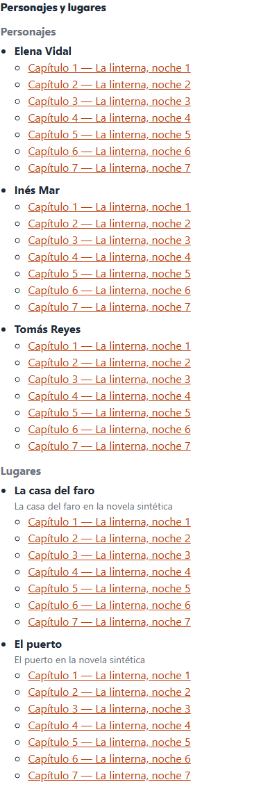

# Validación visual de la lectura web

Comprueba en un navegador real que la lectura web de una novela (`docs/lectura-web.md`) tiene
portada y dedicatoria, un índice que navega y una ficha enlazada, y devuelve cada fallo al rol que
lo causa.

## Piezas

| Pieza | Dónde |
|---|---|
| Servidor Playwright MCP | `.mcp.json` |
| Procedimiento con el navegador MCP | `.claude/skills/validar-visual/SKILL.md` |
| Verificador determinista equivalente | `frontend/e2e/libro.spec.ts` |
| Informe | `InformeVisual`, `backend/novela/dominio/visual.py`; esquema `backend/schemas/qa-visual.schema.json` |
| Registro y score | `novela registrar-visual <slug> --fichero <json>` → `qa/visual.json` y `visual_lectura` |

### `.mcp.json`

```json
{"mcpServers": {"playwright": {"command": "cmd",
  "args": ["/c", "npx", "@playwright/mcp@latest", "--browser", "chromium", "--headless", "--isolated", "--output-dir", ".playwright-mcp"]}}}
```

- **`cmd /c` hace falta en Windows.** Claude Code lanza el servidor sin shell, y `npx` es
  `npx.cmd`: `spawnSync('npx', …)` da `ENOENT` en esta máquina. Con `cmd /c` arranca
  (`@playwright/mcp` 0.0.82). Fuera de Windows, `"command": "npx"` sin `cmd`.
- **`--browser chromium`.** Sin él, el servidor busca Google Chrome instalado
  (`…\Google\Chrome\Application\chrome.exe`) y falla. Con él usa el Chromium de Playwright; la
  primera vez hay que descargarlo: `cmd /c npx @playwright/mcp@latest install-browser chrome-for-testing`.
- `--headless --isolated`: sin ventana y con un perfil temporal por sesión. `.playwright-mcp/`
  está en `.gitignore`.
- El servidor es de proyecto: Claude Code pide aprobarlo la primera vez. No se añade a
  `.claude/settings.json`, y ningún rol de `.claude/agents/` lo tiene: lo usa la sesión de desarrollo
  con la skill.

### Qué se comprueba

Cinco comprobaciones, con lo esperado tomado de `GET /novelas/<slug>/libro` y `…/checkpoint`:

| `id` | Correcto si | Si falla, se devuelve a |
|---|---|---|
| `portada` | el título pintado es el del libro | `frontend` |
| `dedicatoria` | el libro trae dedicatoria y la portada la pinta igual | `exportacion` si el JSON no la trae; `frontend` si no se pinta |
| `indice` | un enlace por capítulo cerrado, con título | `exportacion` si el JSON trae de menos; `frontend` si faltan enlaces; `escritor` si un título está vacío |
| `navegacion` | cada enlace del índice abre su capítulo, con ese título y con texto | `frontend` si no abre; `escritor` si abre vacío |
| `ficha` | cada personaje y lugar pintado, con ≥ 1 enlace, y el primero abre su capítulo | `escritor` si no hay personajes; `exportacion` si una entrada no tiene capítulo; `frontend` si no se pinta o no navega |

`escritor` es contenido que falta en la novela; `exportacion`, el libro que arma el backend
(`plataforma/libro.py`); `frontend`, el panel. `InformeVisual` exige `responsable` en cada fallo y
lo prohíbe en cada acierto.

### Registro

```bash
cd backend && uv run novela registrar-visual <slug> --fichero <informe.json>
```

Valida el informe (2 si no valida o es de otro slug), lo guarda en `qa/visual.json` con escritura
atómica y bajo el lock, y emite `visual_lectura` = comprobaciones correctas / total, con el run y el
capítulo del último checkpoint, por el mismo `ScoreSink` que `checkpoint` (id
`{slug}-{run_id}-{NN}-visual_lectura`: registrar otra vez sustituye el score). Sale con 0 si todo
pasa y con 1 si algo falla, con la línea `devolver a: <rol> (<id>), …`. Sin capítulos cerrados, 1.

## Uso real (2026-09-25)

Claude Code 2.1.281, `@playwright/mcp` 0.0.82, Chromium de Playwright, rama `feat/lectura` sobre
`f0d341c`. Datos ficticios: `regalo-24` es `demo-24` (fábrica de `backend/tests/fixtures`, 7
capítulos cerrados de 24) con `brief-completo.json`; lo crea `e2e/preparar.ts`. La novela real en
curso no tenía todavía ningún capítulo cerrado, así que no se inspeccionó.

La sesión de desarrollo no tenía las herramientas `mcp__playwright__*` cargadas (el `.mcp.json` se
creó en ella). El servidor se condujo igualmente **por MCP**: un cliente JSON-RPC por stdio lanzó
el comando de `.mcp.json` y llamó a las mismas herramientas que usa la skill (`browser_resize`,
`browser_navigate`, `browser_wait_for`, `browser_snapshot`, `browser_click`, `browser_press_key`,
`browser_take_screenshot`, `browser_close`). Además, `e2e/libro.spec.ts` con Playwright de test.

### Qué se inspeccionó

- **Snapshot de la región «Libro»**: heading «regalo-24», la dedicatoria como párrafo,
  `navigation "Índice"` con 7 enlaces «N. La linterna, noche N», y la ficha con 3 personajes y 2
  lugares, 35 enlaces «Capítulo N — …».
- **Navegación**: clic en «2.» del índice → `dialog` con heading «La linterna, noche 2», botón
  «Cerrar» con el foco y el primer párrafo del capítulo; Escape; clic en el primer enlace de la
  ficha → `dialog`.
- **Capturas** de portada, libro entero y un capítulo abierto (`docs/img/`).
- **Verificador**: `regalo-24` 5/5; control negativo con `demo-24` (sin brief) → falla
  `dedicatoria`, «el libro no trae dedicatoria: ¿falta brief/brief.json?», `exportacion`.
- **Registro**: `registrar-visual regalo-24` con el informe MCP y con el del verificador →
  «visual: 5/5 comprobaciones ok», salida 0; con el de `demo-24` → «visual: 4/5 comprobaciones ok»,
  «devolver a: exportacion (dedicatoria)», salida 1. Sin claves de Langfuse en el entorno, el
  score salió por el sink nulo; el envío lo cubre `novela/slices/visual/test_visual.py`.

### Qué se detectó y qué cambió en el código

1. **La ficha era una lista interminable** (captura). Una línea «Capítulo N — título» por
   aparición: con 5 entidades en 7 capítulos, 35 líneas; en una novela de 10 capítulos, la columna
   más alta de la vista con diferencia. Ningún test lo veía, porque el DOM era correcto.
   *Cambio*: cada aparición es un número en línea (`.q-libro__apariciones`, flex) con el título como
   nombre accesible; el snapshot MCP lo confirma (`link "Capítulo 2 — La linterna, noche 2"`).

   

2. **Numeración duplicada en el índice**: «1. 1. La linterna, noche 1», el marcador del `<ol>` más
   el número del texto (que se mantiene igual que en el PDF). Visible solo en la captura.
   *Cambio*: `list-style: none` en el índice.

3. **`test_sin_rutas_de_libro` y `test_sin_rutas_de_brief` eran vacuos.** Al añadir `/libro`, el
   test que debía fallar pasó: la versión de FastAPI instalada monta cada `include_router` como un
   `_IncludedRouter` sin `path` ni `routes`, y el recorrido no veía ninguna ruta de `/novelas`.
   *Cambio*: `_rutas` baja también por `original_router`; los dos tests vuelven a ver las rutas y el
   de libro fija `/novelas/{slug:path}/libro` como única excepción.

4. **Selectores de la vista en conflicto.** Los enlaces del libro llevaban `data-capitulo`, que ya
   usan los volúmenes: los tests de teclado y de título hostil empezaron a encontrar el enlace en
   vez del volumen. *Cambio*: `data-destino`.

5. **`browser_click` de `@playwright/mcp` 0.0.82 pide `target`, no `ref`.** El primer intento no
   abrió ningún diálogo y la captura parecía un fallo del panel; la respuesta del servidor era
   «expected string, received undefined → at target». `target` admite la ref del snapshot o un
   selector, así que la skill usa los `data-testid`. Anotado en la skill para no confundirlo con un
   fallo de `frontend`.

6. **`.mcp.json` tal como se pedía no arrancaba en esta máquina**: `npx` sin `cmd /c` (ENOENT) y
   el navegador por defecto (Chrome, no instalado). *Cambio*: `cmd /c` y `--browser chromium`.


### Limitaciones

- El snapshot MCP no ve maquetación: los hallazgos 1 y 2 salieron de mirar las capturas. La skill
  obliga a mirarlas.
- `e2e/libro.spec.ts` solo corre sobre workspaces sintéticos: `preparar.ts` borra su directorio.
  Para una novela real, la skill con el navegador MCP contra la API en solo lectura.
- Los puertos son fijos (API 8000, panel 5173): el build lleva esa URL y el CORS solo admite ese
  origen. Dos validaciones a la vez en la misma máquina chocan.
